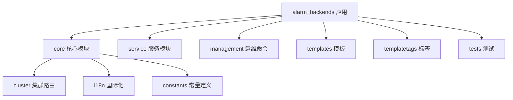
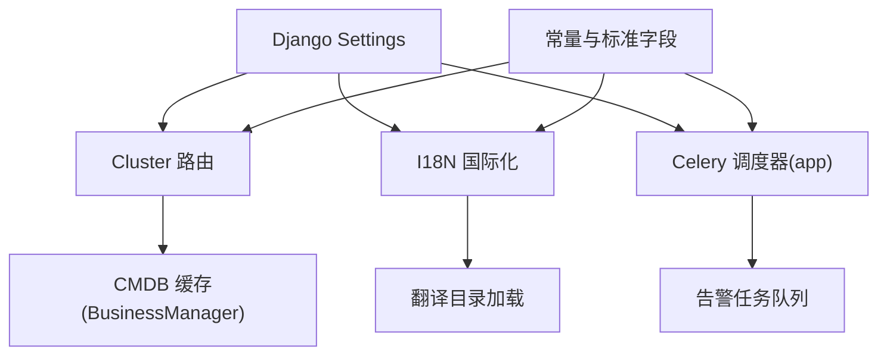
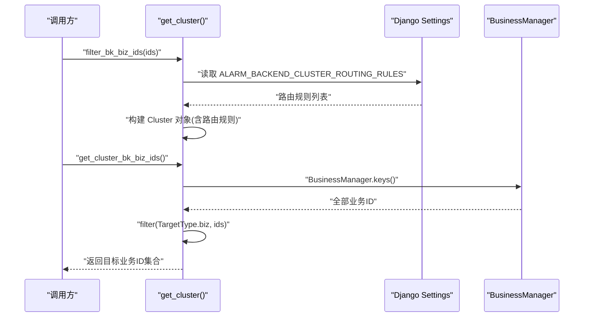
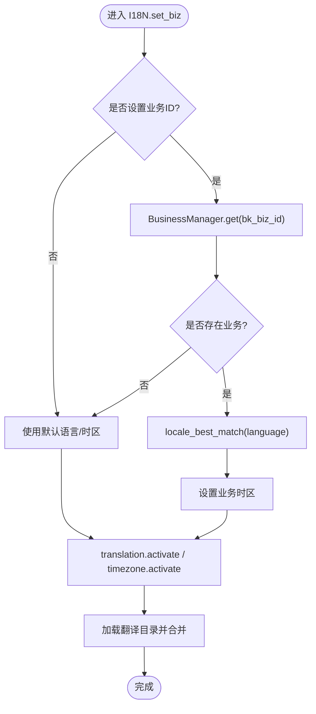
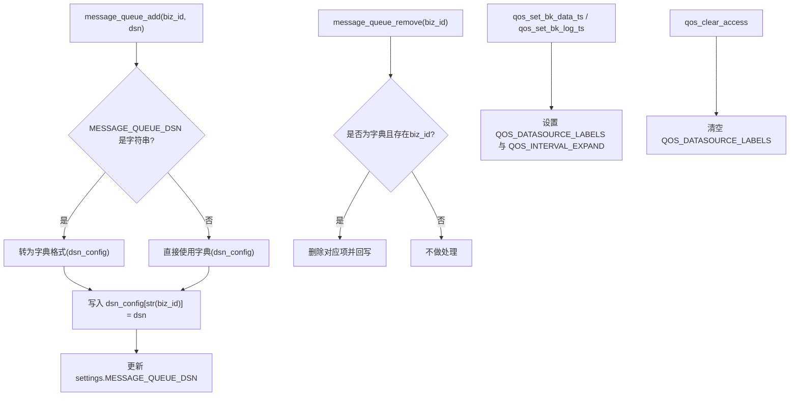
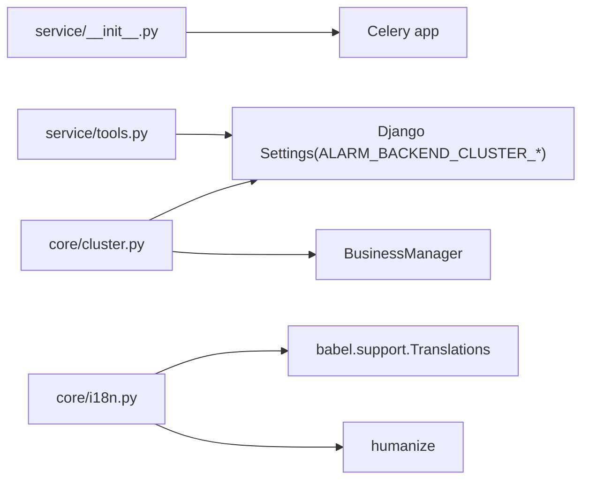

# 告警后端模块

<cite>
**本文引用的文件**
- [bkmonitor/alarm_backends/__init__.py](file://bkmonitor/alarm_backends/__init__.py)
- [bkmonitor/alarm_backends/apps.py](file://bkmonitor/alarm_backends/apps.py)
- [bkmonitor/alarm_backends/constants.py](file://bkmonitor/alarm_backends/constants.py)
- [bkmonitor/alarm_backends/urls.py](file://bkmonitor/alarm_backends/urls.py)
- [bkmonitor/alarm_backends/core/__init__.py](file://bkmonitor/alarm_backends/core/__init__.py)
- [bkmonitor/alarm_backends/core/cluster.py](file://bkmonitor/alarm_backends/core/cluster.py)
- [bkmonitor/alarm_backends/core/i18n.py](file://bkmonitor/alarm_backends/core/i18n.py)
- [bkmonitor/alarm_backends/service/__init__.py](file://bkmonitor/alarm_backends/service/__init__.py)
- [bkmonitor/alarm_backends/service/tools.py](file://bkmonitor/alarm_backends/service/tools.py)
</cite>

## 目录
1. [简介](#简介)
2. [项目结构](#项目结构)
3. [核心组件](#核心组件)
4. [架构总览](#架构总览)
5. [详细组件分析](#详细组件分析)
6. [依赖分析](#依赖分析)
7. [性能考虑](#性能考虑)
8. [故障排查指南](#故障排查指南)
9. [结论](#结论)
10. [附录](#附录)

## 简介
本文件面向蓝鲸智云监控平台的“告警后端模块”，系统性梳理其整体架构、核心组件与处理流程，重点覆盖以下方面：
- 告警引擎的组织方式与模块边界
- 核心模块（集群路由、国际化、服务工具）的职责与算法要点
- 服务层的业务逻辑与运维命令能力
- 告警检测、收敛、通知、存储等关键环节的实现思路
- 组件交互关系、扩展机制与最佳实践

该文档既服务于对代码不熟悉的读者，也提供足够细节帮助开发者进行二次开发与定制。

## 项目结构
告警后端模块位于 bkmonitor/alarm_backends 目录下，采用按功能域划分的层次化组织方式：
- core：核心基础设施与通用能力（集群路由、国际化、缓存、上下文等）
- service：服务层与调度器（包含任务调度入口）
- management：运维命令（未在已知上下文中展开）
- templates/templatetags/tests：模板、标签、测试资源
- 常量与应用配置：constants.py、apps.py、urls.py

图表来源
- [bkmonitor/alarm_backends/core/cluster.py:1-60](file://bkmonitor/alarm_backends/core/cluster.py#L1-L60)
- [bkmonitor/alarm_backends/core/i18n.py:1-131](file://bkmonitor/alarm_backends/core/i18n.py#L1-L131)
- [bkmonitor/alarm_backends/constants.py:1-81](file://bkmonitor/alarm_backends/constants.py#L1-L81)
- [bkmonitor/alarm_backends/service/__init__.py:1-14](file://bkmonitor/alarm_backends/service/__init__.py#L1-L14)
- [bkmonitor/alarm_backends/apps.py:1-23](file://bkmonitor/alarm_backends/apps.py#L1-L23)

章节来源
- [bkmonitor/alarm_backends/__init__.py:1-11](file://bkmonitor/alarm_backends/__init__.py#L1-L11)
- [bkmonitor/alarm_backends/apps.py:1-23](file://bkmonitor/alarm_backends/apps.py#L1-L23)
- [bkmonitor/alarm_backends/urls.py:1-4](file://bkmonitor/alarm_backends/urls.py#L1-L4)

## 核心组件
本节聚焦于告警后端的关键构件及其职责：

- 集群路由与业务过滤
  - 通过读取配置中的路由规则，构建集群对象，并提供业务 ID 过滤与批量获取能力，用于限定告警处理范围。
  - 关键点：路由规则来源于 Django settings；带缓存的单例获取，降低重复初始化成本。

- 国际化与本地化
  - 提供单例 I18N 工具，支持根据业务动态切换语言与时间区域，加载翻译目录并合并多源翻译。
  - 关键点：基于 Babel 的翻译加载；与 humanize 配合实现友好时间显示；全局激活语言与时区。

- 服务工具与消息队列配置
  - 提供针对业务维度的消息队列 DSN 动态增删与 QoS 标签配置方法，便于按业务隔离或优化接入策略。
  - 关键点：支持字符串与字典两种 DSN 配置形态；QOS 标签用于区分数据源类型与时间序列特性。

章节来源
- [bkmonitor/alarm_backends/core/cluster.py:1-60](file://bkmonitor/alarm_backends/core/cluster.py#L1-L60)
- [bkmonitor/alarm_backends/core/i18n.py:1-131](file://bkmonitor/alarm_backends/core/i18n.py#L1-L131)
- [bkmonitor/alarm_backends/service/tools.py:1-58](file://bkmonitor/alarm_backends/service/tools.py#L1-L58)

## 架构总览
告警后端模块以“应用”形式集成到 Django 环境中，核心能力通过 core 子模块提供，服务层通过 service 子模块暴露任务调度入口，常量与配置贯穿各模块。

图表来源
- [bkmonitor/alarm_backends/core/cluster.py:1-60](file://bkmonitor/alarm_backends/core/cluster.py#L1-L60)
- [bkmonitor/alarm_backends/core/i18n.py:1-131](file://bkmonitor/alarm_backends/core/i18n.py#L1-L131)
- [bkmonitor/alarm_backends/service/__init__.py:1-14](file://bkmonitor/alarm_backends/service/__init__.py#L1-L14)
- [bkmonitor/alarm_backends/constants.py:1-81](file://bkmonitor/alarm_backends/constants.py#L1-L81)

## 详细组件分析

### 集群路由组件（cluster）
职责与流程
- 从 Django settings 中读取集群名称、代码、路由规则，构造 Cluster 对象
- 提供业务 ID 过滤与批量获取能力，用于限定告警处理范围
- 使用缓存避免频繁重建集群对象

图表来源
- [bkmonitor/alarm_backends/core/cluster.py:1-60](file://bkmonitor/alarm_backends/core/cluster.py#L1-L60)

章节来源
- [bkmonitor/alarm_backends/core/cluster.py:1-60](file://bkmonitor/alarm_backends/core/cluster.py#L1-L60)

### 国际化组件（i18n）
职责与流程
- 单例 I18N：根据业务 ID 动态切换语言与时间区域
- 加载翻译目录，合并多源翻译，支持 humanize 的本地化时间显示
- 与 Django 的 translation/timezone 集成，确保全局生效

图表来源
- [bkmonitor/alarm_backends/core/i18n.py:1-131](file://bkmonitor/alarm_backends/core/i18n.py#L1-L131)

章节来源
- [bkmonitor/alarm_backends/core/i18n.py:1-131](file://bkmonitor/alarm_backends/core/i18n.py#L1-L131)

### 服务工具组件（service.tools）
职责与流程
- 动态维护 MESSAGE_QUEUE_DSN：支持按业务新增/移除队列 DSN
- QOS 相关配置：按数据源类型设置标签与时间序列区间扩展因子
- 清理访问策略：清空 QOS 标签

图表来源
- [bkmonitor/alarm_backends/service/tools.py:1-58](file://bkmonitor/alarm_backends/service/tools.py#L1-L58)

章节来源
- [bkmonitor/alarm_backends/service/tools.py:1-58](file://bkmonitor/alarm_backends/service/tools.py#L1-L58)

### 常量与标准字段
- 环境与时间常量：生产/测试/开发环境标识，秒、分钟、小时、天、周等单位换算
- 时间格式：箭头格式与日志时间格式
- 标准数据字段：告警事件/异常/记录等必须具备的字段集合
- 无数据告警常量：告警等级、值、维度标签、最新检查点键等
- 去重字段：事件默认去重字段
- Kafka 最大缓冲区大小

章节来源
- [bkmonitor/alarm_backends/constants.py:1-81](file://bkmonitor/alarm_backends/constants.py#L1-L81)

## 依赖分析
- 模块内聚与耦合
  - core 作为基础设施，被 service 与业务逻辑间接依赖
  - service 通过 Celery app 暴露调度能力，与任务执行链路耦合
  - i18n 与 CMDB 缓存存在运行时依赖，需保证配置可用
- 外部依赖
  - Django settings：集群路由规则、消息队列 DSN、QOS 配置、语言与时区等
  - Babel：翻译加载与合并
  - humanize：本地化时间显示

图表来源
- [bkmonitor/alarm_backends/service/__init__.py:1-14](file://bkmonitor/alarm_backends/service/__init__.py#L1-L14)
- [bkmonitor/alarm_backends/core/cluster.py:1-60](file://bkmonitor/alarm_backends/core/cluster.py#L1-L60)
- [bkmonitor/alarm_backends/core/i18n.py:1-131](file://bkmonitor/alarm_backends/core/i18n.py#L1-L131)
- [bkmonitor/alarm_backends/service/tools.py:1-58](file://bkmonitor/alarm_backends/service/tools.py#L1-L58)

## 性能考虑
- 集群对象缓存：集群对象按固定周期刷新，减少重复构建开销
- 翻译加载缓存：按语言缓存翻译对象，避免重复加载
- 配置读取：优先从 settings 一次性读取，避免多次 IO
- 扩展建议
  - 在高并发场景下，对 BusinessManager 的 keys() 调用进行分页或缓存
  - 对翻译目录数量较多时，考虑按需加载或懒加载策略
  - 对消息队列 DSN 的动态更新频率进行限流，避免频繁写入 settings

## 故障排查指南
- 集群路由不生效
  - 检查 Django settings 中的集群路由规则是否正确配置
  - 确认缓存刷新周期是否过短导致频繁重建
- 业务国际化异常
  - 检查业务语言字段与时区是否有效
  - 确认翻译目录路径与语言匹配
- 消息队列 DSN 更新失败
  - 确认 MESSAGE_QUEUE_DSN 的初始形态（字符串或字典）
  - 检查业务 ID 类型是否为字符串
- QOS 配置无效
  - 确认 QOS_DATASOURCE_LABELS 与 QOS_INTERVAL_EXPAND 是否被正确写入 settings

章节来源
- [bkmonitor/alarm_backends/core/cluster.py:1-60](file://bkmonitor/alarm_backends/core/cluster.py#L1-L60)
- [bkmonitor/alarm_backends/core/i18n.py:1-131](file://bkmonitor/alarm_backends/core/i18n.py#L1-L131)
- [bkmonitor/alarm_backends/service/tools.py:1-58](file://bkmonitor/alarm_backends/service/tools.py#L1-L58)

## 结论
告警后端模块通过“应用 + 核心能力 + 服务调度”的分层设计，提供了可扩展、可维护的告警处理基础。核心能力包括：
- 基于配置的集群路由与业务过滤
- 动态国际化与本地化支持
- 面向业务的消息队列与 QOS 配置工具

这些能力为上层的告警检测、收敛、通知、存储等环节提供了稳定的基础支撑。建议在二次开发中遵循现有模块边界，优先通过配置与工具函数扩展，保持系统的一致性与可演进性。

## 附录
- 术语
  - 集群路由：根据目标类型与匹配规则筛选业务 ID 的机制
  - 国际化：按业务切换语言与时区，并加载翻译资源
  - QOS：服务质量标签，用于区分数据源类型与时间序列特性
- 参考路径
  - 集群路由实现：[bkmonitor/alarm_backends/core/cluster.py:1-60](file://bkmonitor/alarm_backends/core/cluster.py#L1-L60)
  - 国际化实现：[bkmonitor/alarm_backends/core/i18n.py:1-131](file://bkmonitor/alarm_backends/core/i18n.py#L1-L131)
  - 服务工具实现：[bkmonitor/alarm_backends/service/tools.py:1-58](file://bkmonitor/alarm_backends/service/tools.py#L1-L58)
  - 常量定义：[bkmonitor/alarm_backends/constants.py:1-81](file://bkmonitor/alarm_backends/constants.py#L1-L81)
  - 应用配置：[bkmonitor/alarm_backends/apps.py:1-23](file://bkmonitor/alarm_backends/apps.py#L1-L23)
  - URL 配置：[bkmonitor/alarm_backends/urls.py:1-4](file://bkmonitor/alarm_backends/urls.py#L1-L4)