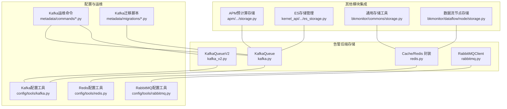
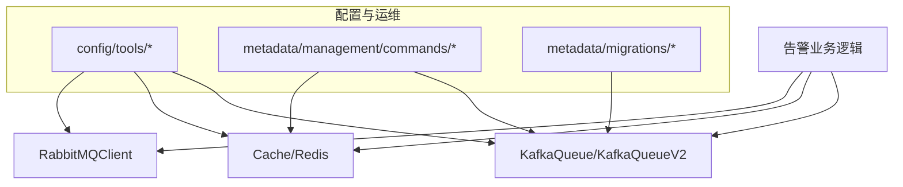
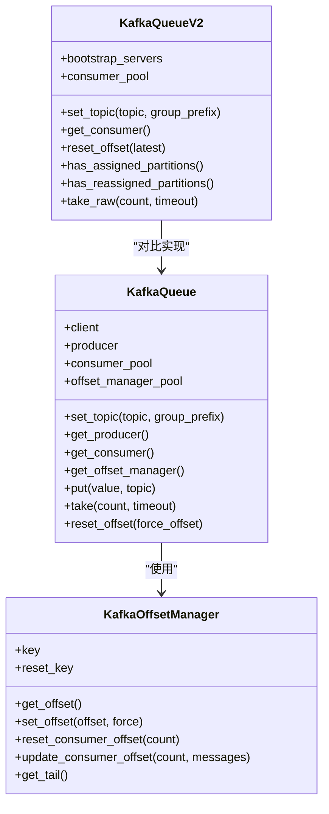
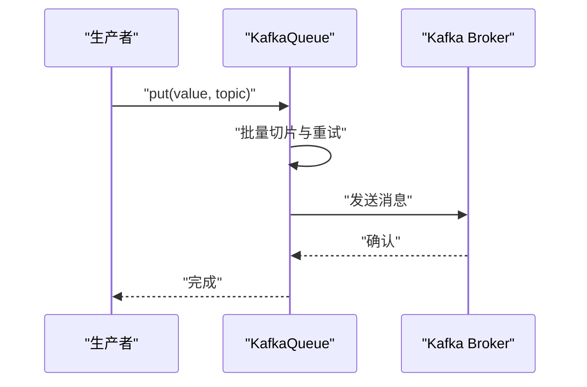
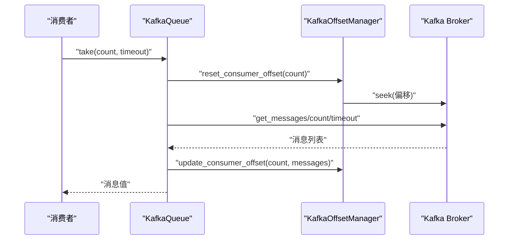
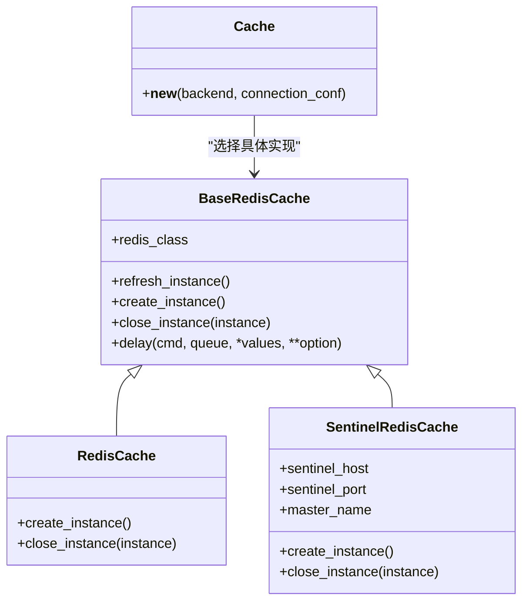
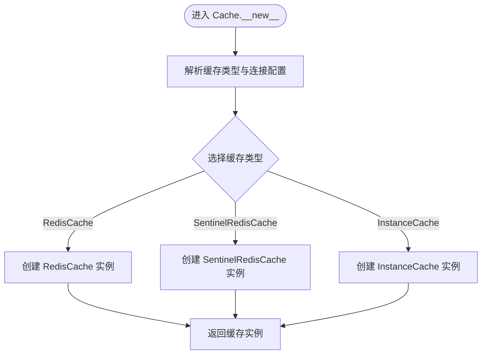
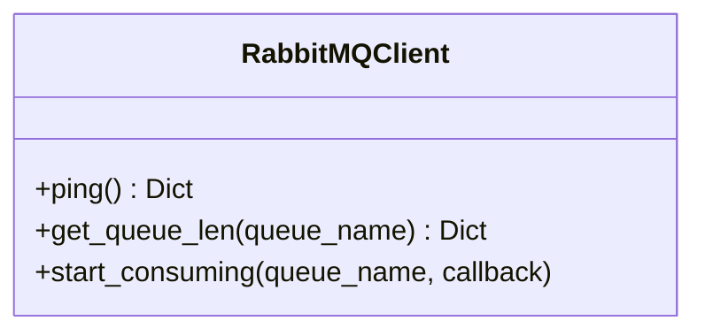
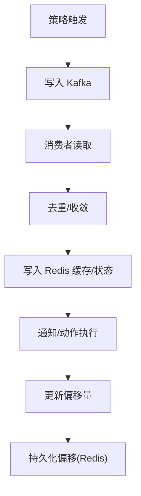
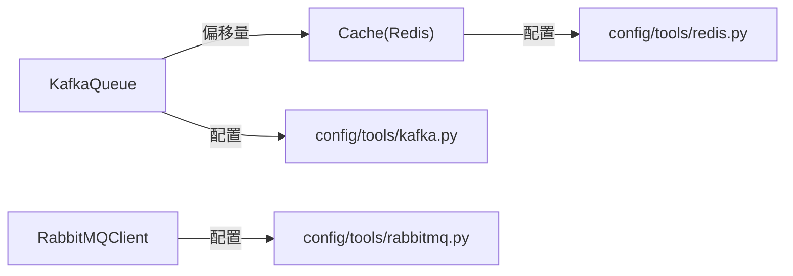

# 告警存储系统

<cite>
**本文引用的文件**
- [bkmonitor/alarm_backends/core/storage/kafka.py](file://bkmonitor/alarm_backends/core/storage/kafka.py)
- [bkmonitor/alarm_backends/core/storage/kafka_v2.py](file://bkmonitor/alarm_backends/core/storage/kafka_v2.py)
- [bkmonitor/alarm_backends/core/storage/redis.py](file://bkmonitor/alarm_backends/core/storage/redis.py)
- [bkmonitor/alarm_backends/core/storage/rabbitmq.py](file://bkmonitor/alarm_backends/core/storage/rabbitmq.py)
- [bkmonitor/constants/alert.py](file://bkmonitor/constants/alert.py)
- [bkmonitor/alarm_backends/constants.py](file://bkmonitor/alarm_backends/constants.py)
- [bkmonitor/config/tools/kafka.py](file://bkmonitor/config/tools/kafka.py)
- [bkmonitor/config/tools/redis.py](file://bkmonitor/config/tools/redis.py)
- [bkmonitor/config/tools/rabbitmq.py](file://bkmonitor/config/tools/rabbitmq.py)
- [bkmonitor/metadata/management/commands/check_realtime_strategy_kafka_storage.py](file://bkmonitor/metadata/management/commands/check_realtime_strategy_kafka_storage.py)
- [bkmonitor/metadata/management/commands/modify_kafka_cluster.py](file://bkmonitor/metadata/management/commands/modify_kafka_cluster.py)
- [bkmonitor/metadata/management/commands/switch_kafka_for_data_id.py](file://bkmonitor/metadata/management/commands/switch_kafka_for_data_id.py)
- [bkmonitor/metadata/migrations/0029_create_kafka_storage_for_init_rt.py](file://bkmonitor/metadata/migrations/0029_create_kafka_storage_for_init_rt.py)
- [bkmonitor/metadata/migrations/0030_kafkastorage_retention.py](file://bkmonitor/metadata/migrations/0030_kafkastorage_retention.py)
- [bkmonitor/metadata/migrations/0031_fix_kafka_label_config.py](file://bkmonitor/metadata/migrations/0031_fix_kafka_label_config.py)
- [bkmonitor/metadata/migrations/0218_redisstorage_bk_tenant_id.py](file://bkmonitor/metadata/migrations/0218_redisstorage_bk_tenant_id.py)
- [bkmonitor/packages/utils/redis_client.py](file://bkmonitor/packages/utils/redis_client.py)
- [bkmonitor/metadata/utils/redis_tools.py](file://bkmonitor/metadata/utils/redis_tools.py)
- [bkmonitor/metadata/tools/redis_lock.py](file://bkmonitor/metadata/tools/redis_lock.py)
- [bkmonitor/metadata/service/space_redis.py](file://bkmonitor/metadata/service/space_redis.py)
- [bkmonitor/metadata/models/space/space_table_id_redis.py](file://bkmonitor/metadata/models/space/space_table_id_redis.py)
- [bkmonitor/kernel_api/rpc/functions/admin/kafka_sample.py](file://bkmonitor/kernel_api/rpc/functions/admin/kafka_sample.py)
- [bkmonitor/kernel_api/rpc/functions/admin/es_storage.py](file://bkmonitor/kernel_api/rpc/functions/admin/es_storage.py)
- [bkmonitor/bkmonitor/commons/storage.py](file://bkmonitor/bkmonitor/commons/storage.py)
- [bkmonitor/apm/core/discover/precalculation/storage.py](file://bkmonitor/apm/core/discover/precalculation/storage.py)
- [bkmonitor/core/statistics/storage.py](file://bkmonitor/core/statistics/storage.py)
- [bkmonitor/bkmonitor/dataflow/node/storage.py](file://bkmonitor/bkmonitor/dataflow/node/storage.py)
- [bkmonitor/scripts/query_unused_bk_data_id_by_kafka.py](file://bkmonitor/scripts/query_unused_bk_data_id_by_kafka.py)
</cite>

## 目录
1. [简介](#简介)
2. [项目结构](#项目结构)
3. [核心组件](#核心组件)
4. [架构总览](#架构总览)
5. [详细组件分析](#详细组件分析)
6. [依赖分析](#依赖分析)
7. [性能考虑](#性能考虑)
8. [故障排查指南](#故障排查指南)
9. [结论](#结论)
10. [附录](#附录)

## 简介
本文件面向告警存储系统的技术文档，聚焦于Kafka消息队列、Redis缓存、RabbitMQ消息代理在告警系统中的应用场景与实现方式。内容涵盖数据结构、访问模式、性能特性、配置参数、连接池管理、故障恢复机制、数据持久化策略，并提供不同场景下的存储选型建议、容量规划与性能调优方法，帮助开发者选择合适的存储方案并进行有效管理。

## 项目结构
告警存储相关代码主要集中在 alarm_backends/core/storage 下，分别实现 Kafka、Redis、RabbitMQ 的接入与封装；同时在 config/tools 下提供各组件的配置工具，在 metadata/management/commands 与 migrations 中提供与 Kafka/Redis 存储相关的运维与迁移能力；其他模块如 apm、kernel_api、bkmonitor/commons 等也存在与存储相关的实现或工具。

图表来源
- [bkmonitor/alarm_backends/core/storage/kafka.py:1-262](file://bkmonitor/alarm_backends/core/storage/kafka.py#L1-L262)
- [bkmonitor/alarm_backends/core/storage/kafka_v2.py:1-157](file://bkmonitor/alarm_backends/core/storage/kafka_v2.py#L1-L157)
- [bkmonitor/alarm_backends/core/storage/redis.py:1-326](file://bkmonitor/alarm_backends/core/storage/redis.py#L1-L326)
- [bkmonitor/alarm_backends/core/storage/rabbitmq.py:1-79](file://bkmonitor/alarm_backends/core/storage/rabbitmq.py#L1-L79)
- [bkmonitor/config/tools/kafka.py](file://bkmonitor/config/tools/kafka.py)
- [bkmonitor/config/tools/redis.py](file://bkmonitor/config/tools/redis.py)
- [bkmonitor/config/tools/rabbitmq.py](file://bkmonitor/config/tools/rabbitmq.py)
- [bkmonitor/metadata/management/commands/check_realtime_strategy_kafka_storage.py](file://bkmonitor/metadata/management/commands/check_realtime_strategy_kafka_storage.py)
- [bkmonitor/metadata/management/commands/modify_kafka_cluster.py](file://bkmonitor/metadata/management/commands/modify_kafka_cluster.py)
- [bkmonitor/metadata/management/commands/switch_kafka_for_data_id.py](file://bkmonitor/metadata/management/commands/switch_kafka_for_data_id.py)
- [bkmonitor/metadata/migrations/0029_create_kafka_storage_for_init_rt.py](file://bkmonitor/metadata/migrations/0029_create_kafka_storage_for_init_rt.py)
- [bkmonitor/metadata/migrations/0030_kafkastorage_retention.py](file://bkmonitor/metadata/migrations/0030_kafkastorage_retention.py)
- [bkmonitor/metadata/migrations/0031_fix_kafka_label_config.py](file://bkmonitor/metadata/migrations/0031_fix_kafka_label_config.py)
- [bkmonitor/apm/core/discover/precalculation/storage.py](file://bkmonitor/apm/core/discover/precalculation/storage.py)
- [bkmonitor/kernel_api/rpc/functions/admin/es_storage.py](file://bkmonitor/kernel_api/rpc/functions/admin/es_storage.py)
- [bkmonitor/bkmonitor/commons/storage.py](file://bkmonitor/bkmonitor/commons/storage.py)
- [bkmonitor/bkmonitor/dataflow/node/storage.py](file://bkmonitor/bkmonitor/dataflow/node/storage.py)

章节来源
- [bkmonitor/alarm_backends/core/storage/kafka.py:1-262](file://bkmonitor/alarm_backends/core/storage/kafka.py#L1-L262)
- [bkmonitor/alarm_backends/core/storage/kafka_v2.py:1-157](file://bkmonitor/alarm_backends/core/storage/kafka_v2.py#L1-L157)
- [bkmonitor/alarm_backends/core/storage/redis.py:1-326](file://bkmonitor/alarm_backends/core/storage/redis.py#L1-L326)
- [bkmonitor/alarm_backends/core/storage/rabbitmq.py:1-79](file://bkmonitor/alarm_backends/core/storage/rabbitmq.py#L1-L79)

## 核心组件
- Kafka 队列封装：提供生产者、消费者、偏移量管理与重连机制，支持两类实现（旧版 SimpleClient 与新版 KafkaConsumer）。
- Redis 缓存封装：统一的 Cache 类，支持直连与哨兵两种模式，提供连接刷新、只读实例、延迟队列等功能。
- RabbitMQ 客户端：提供健康检查、队列长度查询、消费回调等基础能力。

章节来源
- [bkmonitor/alarm_backends/core/storage/kafka.py:26-176](file://bkmonitor/alarm_backends/core/storage/kafka.py#L26-L176)
- [bkmonitor/alarm_backends/core/storage/kafka_v2.py:24-157](file://bkmonitor/alarm_backends/core/storage/kafka_v2.py#L24-L157)
- [bkmonitor/alarm_backends/core/storage/redis.py:98-326](file://bkmonitor/alarm_backends/core/storage/redis.py#L98-L326)
- [bkmonitor/alarm_backends/core/storage/rabbitmq.py:23-79](file://bkmonitor/alarm_backends/core/storage/rabbitmq.py#L23-L79)

## 架构总览
告警系统通过 Kafka 实现高吞吐的消息传递，通过 Redis 提供低延迟的缓存与状态管理，通过 RabbitMQ 提供可靠的消息代理能力。配置工具与运维命令支撑 Kafka/Redis 的部署与变更，其他模块按需复用这些存储能力。

图表来源
- [bkmonitor/alarm_backends/core/storage/kafka.py:1-262](file://bkmonitor/alarm_backends/core/storage/kafka.py#L1-L262)
- [bkmonitor/alarm_backends/core/storage/kafka_v2.py:1-157](file://bkmonitor/alarm_backends/core/storage/kafka_v2.py#L1-L157)
- [bkmonitor/alarm_backends/core/storage/redis.py:1-326](file://bkmonitor/alarm_backends/core/storage/redis.py#L1-L326)
- [bkmonitor/alarm_backends/core/storage/rabbitmq.py:1-79](file://bkmonitor/alarm_backends/core/storage/rabbitmq.py#L1-L79)
- [bkmonitor/config/tools/kafka.py](file://bkmonitor/config/tools/kafka.py)
- [bkmonitor/config/tools/redis.py](file://bkmonitor/config/tools/redis.py)
- [bkmonitor/config/tools/rabbitmq.py](file://bkmonitor/config/tools/rabbitmq.py)
- [bkmonitor/metadata/management/commands/check_realtime_strategy_kafka_storage.py](file://bkmonitor/metadata/management/commands/check_realtime_strategy_kafka_storage.py)
- [bkmonitor/metadata/migrations/0029_create_kafka_storage_for_init_rt.py](file://bkmonitor/metadata/migrations/0029_create_kafka_storage_for_init_rt.py)

## 详细组件分析

### Kafka 组件分析
- 数据结构与访问模式
  - 生产者：批量发送，支持失败重试与异常处理。
  - 消费者：SimpleConsumer/KafkaConsumer 两种实现，支持自动提交与手动提交，具备重连与元数据加载保护。
  - 偏移量管理：基于 Redis 的偏移量持久化，支持重置点、尾部偏移、游标更新。
- 性能特性
  - 支持批量推送与分区轮询，提升吞吐。
  - 提供连接存活检测与主动重连，增强稳定性。
- 配置参数与连接池
  - 通过 settings 或 kfk_conf 注入集群地址与端口。
  - SimpleClient/SimpleProducer 与 KafkaConsumer 的参数可配置（自动提交、分区拉取大小、会话超时等）。
- 故障恢复机制
  - 元数据加载失败重试、偏移越界自动回退、连接断开主动重建。
- 数据持久化策略
  - 偏移量写入 Redis，确保重启后可继续消费。

图表来源
- [bkmonitor/alarm_backends/core/storage/kafka.py:26-176](file://bkmonitor/alarm_backends/core/storage/kafka.py#L26-L176)
- [bkmonitor/alarm_backends/core/storage/kafka_v2.py:24-157](file://bkmonitor/alarm_backends/core/storage/kafka_v2.py#L24-L157)

图表来源
- [bkmonitor/alarm_backends/core/storage/kafka.py:127-145](file://bkmonitor/alarm_backends/core/storage/kafka.py#L127-L145)

图表来源
- [bkmonitor/alarm_backends/core/storage/kafka.py:155-175](file://bkmonitor/alarm_backends/core/storage/kafka.py#L155-L175)
- [bkmonitor/alarm_backends/core/storage/kafka.py:178-262](file://bkmonitor/alarm_backends/core/storage/kafka.py#L178-L262)

章节来源
- [bkmonitor/alarm_backends/core/storage/kafka.py:26-176](file://bkmonitor/alarm_backends/core/storage/kafka.py#L26-L176)
- [bkmonitor/alarm_backends/core/storage/kafka_v2.py:24-157](file://bkmonitor/alarm_backends/core/storage/kafka_v2.py#L24-L157)
- [bkmonitor/alarm_backends/constants.py:79-81](file://bkmonitor/alarm_backends/constants.py#L79-L81)
- [bkmonitor/metadata/migrations/0029_create_kafka_storage_for_init_rt.py](file://bkmonitor/metadata/migrations/0029_create_kafka_storage_for_init_rt.py)
- [bkmonitor/metadata/migrations/0030_kafkastorage_retention.py](file://bkmonitor/metadata/migrations/0030_kafkastorage_retention.py)
- [bkmonitor/metadata/migrations/0031_fix_kafka_label_config.py](file://bkmonitor/metadata/migrations/0031_fix_kafka_label_config.py)
- [bkmonitor/metadata/management/commands/check_realtime_strategy_kafka_storage.py](file://bkmonitor/metadata/management/commands/check_realtime_strategy_kafka_storage.py)
- [bkmonitor/metadata/management/commands/modify_kafka_cluster.py](file://bkmonitor/metadata/management/commands/modify_kafka_cluster.py)
- [bkmonitor/metadata/management/commands/switch_kafka_for_data_id.py](file://bkmonitor/metadata/management/commands/switch_kafka_for_data_id.py)
- [bkmonitor/scripts/query_unused_bk_data_id_by_kafka.py](file://bkmonitor/scripts/query_unused_bk_data_id_by_kafka.py)

### Redis 组件分析
- 数据结构与访问模式
  - Cache 类统一入口，支持多种后端类型（RedisCache、SentinelRedisCache、InstanceCache）。
  - BaseRedisCache 提供连接刷新、只读实例、延迟队列等能力。
  - SentinelRedisCache 支持哨兵主从切换与随机哨兵节点选择。
- 性能特性
  - 连接池管理，异常自动重连，减少抖动。
  - 只读实例分离，降低主实例压力。
- 配置参数与连接池
  - 通过 settings 中的 REDIS_*_CONF 与环境变量路由配置。
  - 支持 decode_responses、encoding 等参数注入。
- 故障恢复机制
  - 连接错误自动刷新实例，保障可用性。
  - 哨兵模式下主从切换与密码配置。
- 数据持久化策略
  - 通过 DB 分配与命名空间隔离，避免冲突。

图表来源
- [bkmonitor/alarm_backends/core/storage/redis.py:98-326](file://bkmonitor/alarm_backends/core/storage/redis.py#L98-L326)

图表来源
- [bkmonitor/alarm_backends/core/storage/redis.py:293-326](file://bkmonitor/alarm_backends/core/storage/redis.py#L293-L326)

章节来源
- [bkmonitor/alarm_backends/core/storage/redis.py:98-326](file://bkmonitor/alarm_backends/core/storage/redis.py#L98-L326)
- [bkmonitor/config/tools/redis.py](file://bkmonitor/config/tools/redis.py)
- [bkmonitor/metadata/migrations/0218_redisstorage_bk_tenant_id.py](file://bkmonitor/metadata/migrations/0218_redisstorage_bk_tenant_id.py)
- [bkmonitor/packages/utils/redis_client.py](file://bkmonitor/packages/utils/redis_client.py)
- [bkmonitor/metadata/utils/redis_tools.py](file://bkmonitor/metadata/utils/redis_tools.py)
- [bkmonitor/metadata/tools/redis_lock.py](file://bkmonitor/metadata/tools/redis_lock.py)
- [bkmonitor/metadata/service/space_redis.py](file://bkmonitor/metadata/service/space_redis.py)
- [bkmonitor/metadata/models/space/space_table_id_redis.py](file://bkmonitor/metadata/models/space/space_table_id_redis.py)

### RabbitMQ 组件分析
- 数据结构与访问模式
  - RabbitMQClient 提供健康检查、队列长度查询、消费回调等基础能力。
- 性能特性
  - 基于 pika 的阻塞连接，适合轻量级消费场景。
- 配置参数与连接池
  - 通过 broker_url 解析主机、端口、用户、密码与虚拟主机。
- 故障恢复机制
  - 连接异常时记录错误并返回建议。
- 数据持久化策略
  - 队列声明为持久化，消息可持久化（取决于发布方）。

图表来源
- [bkmonitor/alarm_backends/core/storage/rabbitmq.py:23-79](file://bkmonitor/alarm_backends/core/storage/rabbitmq.py#L23-L79)

章节来源
- [bkmonitor/alarm_backends/core/storage/rabbitmq.py:23-79](file://bkmonitor/alarm_backends/core/storage/rabbitmq.py#L23-L79)
- [bkmonitor/config/tools/rabbitmq.py](file://bkmonitor/config/tools/rabbitmq.py)

### 概念性总览
以下为概念性流程图，展示告警系统中存储组件的协作关系与典型工作流。

（此图为概念性示意，无需图表来源）

## 依赖分析
- 组件耦合
  - KafkaOffsetManager 依赖 Cache（Redis）进行偏移量持久化。
  - Cache 支持多种后端类型，通过统一入口选择具体实现。
  - RabbitMQClient 作为独立客户端，与其他组件解耦。
- 外部依赖
  - Kafka：kafka-python 库；KafkaConsumer 与 SimpleConsumer 两套 API。
  - Redis：redis-py 与 redis.sentinel；支持哨兵与直连。
  - RabbitMQ：pika；阻塞连接模型。
- 潜在环路
  - 存储组件间无直接环路，通过 settings 与配置工具间接耦合。

图表来源
- [bkmonitor/alarm_backends/core/storage/kafka.py:178-262](file://bkmonitor/alarm_backends/core/storage/kafka.py#L178-L262)
- [bkmonitor/alarm_backends/core/storage/redis.py:98-326](file://bkmonitor/alarm_backends/core/storage/redis.py#L98-L326)
- [bkmonitor/alarm_backends/core/storage/rabbitmq.py:23-79](file://bkmonitor/alarm_backends/core/storage/rabbitmq.py#L23-L79)
- [bkmonitor/config/tools/kafka.py](file://bkmonitor/config/tools/kafka.py)
- [bkmonitor/config/tools/redis.py](file://bkmonitor/config/tools/redis.py)
- [bkmonitor/config/tools/rabbitmq.py](file://bkmonitor/config/tools/rabbitmq.py)

章节来源
- [bkmonitor/alarm_backends/core/storage/kafka.py:178-262](file://bkmonitor/alarm_backends/core/storage/kafka.py#L178-L262)
- [bkmonitor/alarm_backends/core/storage/redis.py:98-326](file://bkmonitor/alarm_backends/core/storage/redis.py#L98-L326)
- [bkmonitor/alarm_backends/core/storage/rabbitmq.py:23-79](file://bkmonitor/alarm_backends/core/storage/rabbitmq.py#L23-L79)

## 性能考虑
- Kafka
  - 批量推送与分区轮询提升吞吐；合理设置 max_partition_fetch_bytes 与 session_timeout_ms。
  - 自动提交与手动提交结合，平衡性能与可靠性。
  - 偏移量持久化到 Redis，避免重复消费与丢失。
- Redis
  - 使用只读实例分流读请求；连接池与自动刷新降低抖动。
  - DB 分离与命名空间隔离，避免热 key 冲突。
- RabbitMQ
  - 适用于小规模、低延迟场景；对高吞吐场景建议评估 Kafka。

（本节为通用指导，无需章节来源）

## 故障排查指南
- Kafka
  - 元数据加载失败：检查集群可达性与 topic 权限，重试初始化。
  - 偏移越界：自动回退到尾部并提示调整消费策略。
  - 连接断开：主动检测并重建消费者，确保分区分配稳定。
- Redis
  - 连接错误：自动刷新实例，检查哨兵与主从状态。
  - 延迟队列异常：核对任务存储与延迟队列键空间。
- RabbitMQ
  - 连接失败：检查 broker_url 解析与认证信息。

章节来源
- [bkmonitor/alarm_backends/core/storage/kafka.py:100-126](file://bkmonitor/alarm_backends/core/storage/kafka.py#L100-L126)
- [bkmonitor/alarm_backends/core/storage/kafka.py:155-175](file://bkmonitor/alarm_backends/core/storage/kafka.py#L155-L175)
- [bkmonitor/alarm_backends/core/storage/kafka_v2.py:107-145](file://bkmonitor/alarm_backends/core/storage/kafka_v2.py#L107-L145)
- [bkmonitor/alarm_backends/core/storage/redis.py:167-195](file://bkmonitor/alarm_backends/core/storage/redis.py#L167-L195)
- [bkmonitor/alarm_backends/core/storage/rabbitmq.py:40-55](file://bkmonitor/alarm_backends/core/storage/rabbitmq.py#L40-L55)

## 结论
告警存储系统通过 Kafka、Redis、RabbitMQ 的组合实现了高吞吐、低延迟与可靠性的平衡。Kafka 负责消息传递与偏移管理，Redis 提供缓存与状态持久化，RabbitMQ 适配轻量级消息代理需求。配合完善的配置工具、运维命令与迁移脚本，系统具备良好的可维护性与扩展性。

## 附录
- 存储选型建议
  - 高吞吐实时告警：优先 Kafka；需要强一致与复杂事务：Redis；轻量可靠消息：RabbitMQ。
- 容量规划
  - Kafka：按峰值 QPS 与消息体积估算磁盘与分区数；设置合理的 retention 与副本因子。
  - Redis：按热 key 与过期策略估算内存；DB 分离与只读实例扩容。
  - RabbitMQ：按消息速率与持久化策略估算磁盘与队列数量。
- 性能调优
  - Kafka：增大 max_partition_fetch_bytes、优化分区数与消费者组；合理设置 auto_commit 与 session_timeout_ms。
  - Redis：启用连接池与只读实例；优化键空间与过期策略；必要时引入哨兵与分片。
  - RabbitMQ：优化队列与交换机配置；限制并发与批处理大小。