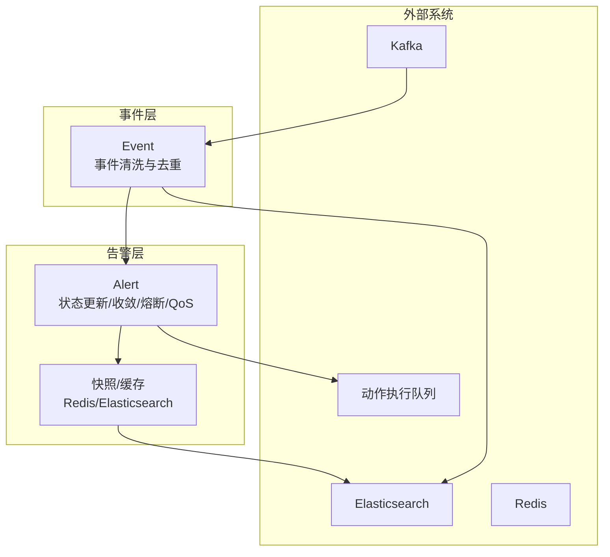
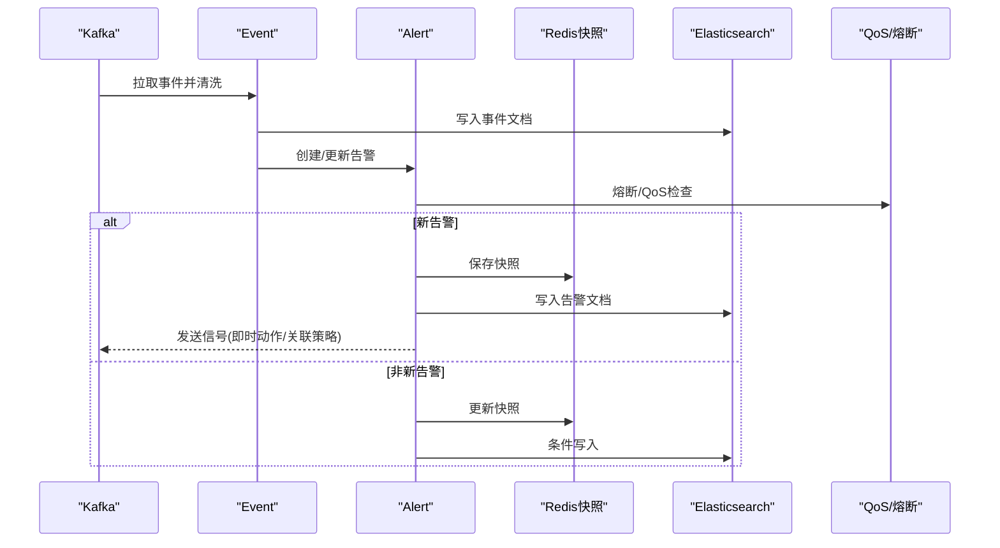
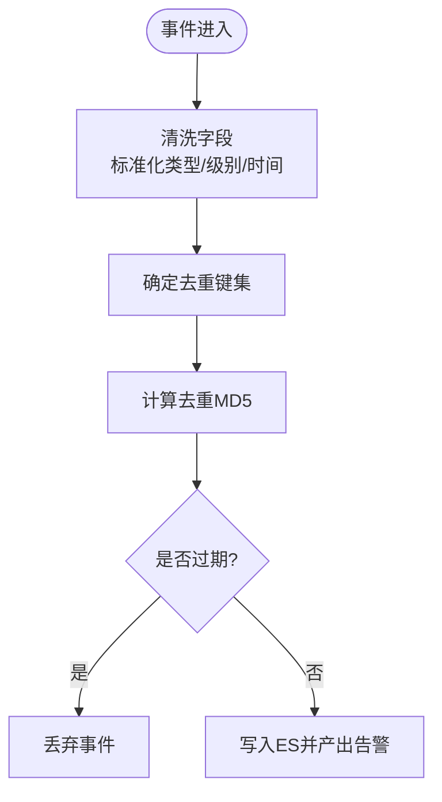
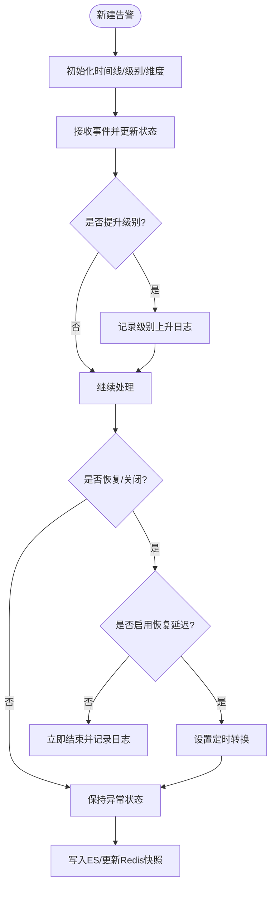
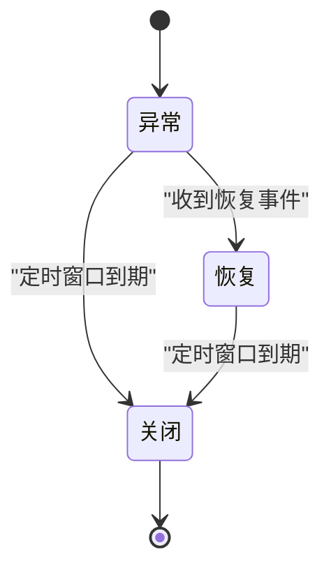
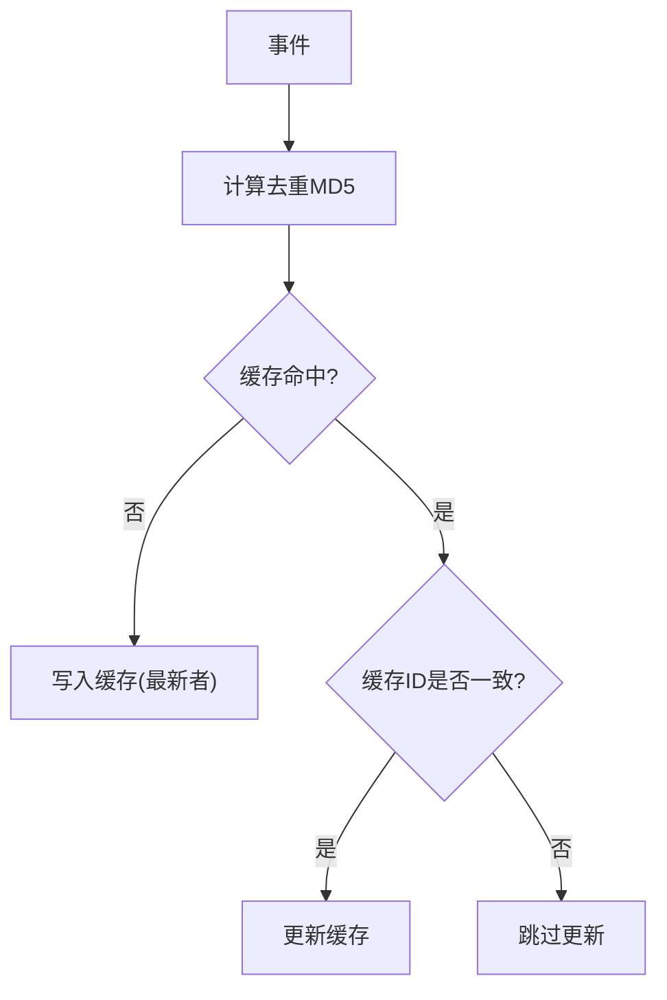
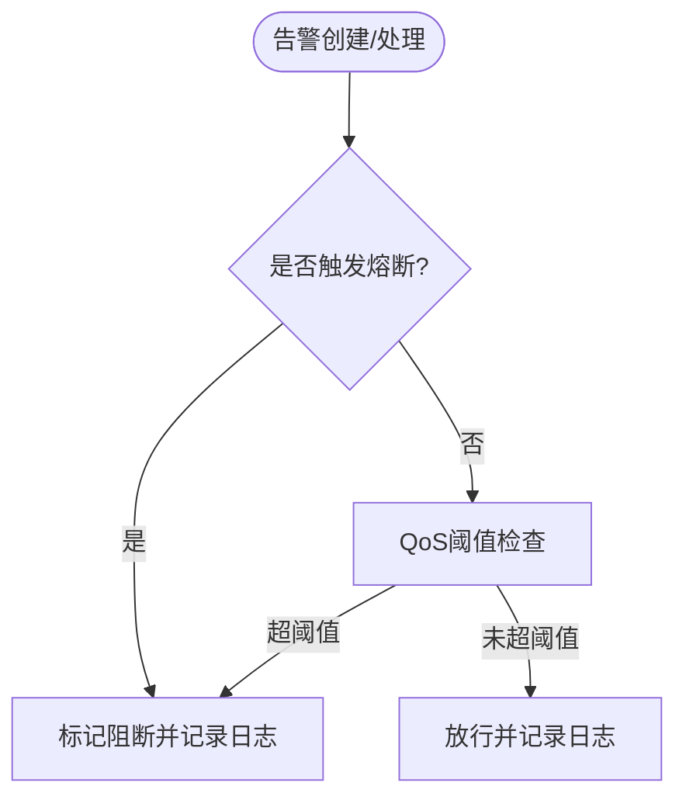
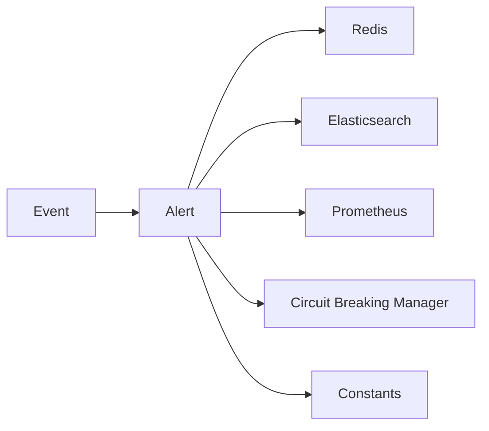

# 告警处理服务

<cite>
**本文引用的文件**
- [alarm_backends/constants.py](file://bkmonitor/alarm_backends/constants.py)
- [alarm_backends/core/alert/alert.py](file://bkmonitor/alarm_backends/core/alert/alert.py)
- [alarm_backends/core/alert/event.py](file://bkmonitor/alarm_backends/core/alert/event.py)
- [alarm_backends/service/access/alert/base.py](file://bkmonitor/alarm_backends/service/access/alert/base.py)
- [alarm_backends/service/alert/README.md](file://bkmonitor/alarm_backends/service/alert/README.md)
- [alarm_backends/core/circuit_breaking/manager.py](file://bkmonitor/alarm_backends/core/circuit_breaking/manager.py)
- [bkmonitor/constants/alert.py](file://bkmonitor/constants/alert.py)
- [bkmonitor/constants/common.py](file://bkmonitor/constants/common.py)
- [bkmonitor/constants/data_source.py](file://bkmonitor/constants/data_source.py)
- [bkmonitor/documents.py](file://bkmonitor/documents.py)
- [bkmonitor/models.py](file://bkmonitor/models.py)
- [bkmonitor/utils/common_utils.py](file://bkmonitor/utils/common_utils.py)
- [bkmonitor/core/prometheus.py](file://bkmonitor/core/prometheus.py)
- [bkmonitor/apm-wiki/docs/alert.manager-ES-scroll-context积压-scan替换search-after-PIT修复方案.md](file://ai-docs/bk-monitor/scenarios/troubleshooting/docs/alert.manager-ES-scroll-context积压-scan替换search-after-PIT修复方案.md)
</cite>

## 目录
1. [简介](#简介)
2. [项目结构](#项目结构)
3. [核心组件](#核心组件)
4. [架构总览](#架构总览)
5. [详细组件分析](#详细组件分析)
6. [依赖分析](#依赖分析)
7. [性能考量](#性能考量)
8. [故障排查指南](#故障排查指南)
9. [结论](#结论)
10. [附录](#附录)

## 简介
本技术文档面向“告警处理服务”，系统性阐述告警的生成、增强、管理与服务质量保障机制。重点覆盖：
- 告警构建器的数据组装逻辑
- 告警丰富器的信息补充算法
- 告警管理者对状态的控制与QoS服务质量监控
- 告警生命周期管理、去重机制、升级策略与性能监控指标
- 最佳实践、配置优化建议与常见问题解决方案

## 项目结构
告警处理服务位于 alarm_backends 子系统，围绕事件与告警两大核心对象展开，通过事件清洗、去重、聚合、收敛、熔断与QoS控制，最终形成稳定的告警状态并驱动后续动作。

图示来源
- [alarm_backends/service/alert/README.md:13-21](file://bkmonitor/alarm_backends/service/alert/README.md#L13-L21)
- [alarm_backends/core/alert/alert.py:844-887](file://bkmonitor/alarm_backends/core/alert/alert.py#L844-L887)

章节来源
- [alarm_backends/service/alert/README.md:1-37](file://bkmonitor/alarm_backends/service/alert/README.md#L1-L37)

## 核心组件
- 事件(Event)：负责输入数据清洗、字段标准化、去重键计算、严重级别初始化与过期判断。
- 告警(Alert)：负责基于事件更新告警状态、收敛日志、维度补充、熔断与QoS检查、持久化与快照。
- 去重与缓存：基于去重MD5与维度集合，维护最新告警快照，避免重复写入与覆盖。
- 熔断与QoS：在新告警创建与非新告警处理阶段分别进行熔断与QoS阈值控制，防止风暴。
- 生命周期管理：异常、恢复、关闭、定时转换、持续时间刷新等。

章节来源
- [alarm_backends/core/alert/event.py:23-286](file://bkmonitor/alarm_backends/core/alert/event.py#L23-L286)
- [alarm_backends/core/alert/alert.py:60-752](file://bkmonitor/alarm_backends/core/alert/alert.py#L60-L752)
- [alarm_backends/core/alert/alert.py:843-920](file://bkmonitor/alarm_backends/core/alert/alert.py#L843-L920)
- [alarm_backends/core/alert/alert.py:951-1042](file://bkmonitor/alarm_backends/core/alert/alert.py#L951-L1042)

## 架构总览
告警处理服务采用“事件驱动 + 缓存优先 + QoS保护”的架构：
- 输入：Kafka 接收第三方事件与监控策略事件
- 清洗：Event 对象完成字段清理、去重键与严重级别初始化
- 聚合：Alert 对象根据事件更新状态、收敛日志、维度与标签
- 保护：熔断与QoS在创建与处理阶段双重控制
- 输出：变更告警发出信号，驱动动作执行与关联策略检测

图示来源
- [alarm_backends/service/alert/README.md:13-21](file://bkmonitor/alarm_backends/service/alert/README.md#L13-L21)
- [alarm_backends/core/alert/alert.py:843-841](file://bkmonitor/alarm_backends/core/alert/alert.py#L843-L841)
- [alarm_backends/core/alert/alert.py:951-998](file://bkmonitor/alarm_backends/core/alert/alert.py#L951-L998)

## 详细组件分析

### 事件处理与去重
- 字段清洗：移除空值、标准化目标类型、数据类型、分类、严重级别、时间戳等。
- 去重键策略：默认去重字段结合策略ID/告警名称选择，支持扩展键；兼容目标扩展场景下的指纹连贯性。
- 去重MD5：按去重键序列化并计算MD5，作为维度去重的核心依据。
- 过期判断：以接入时间与阈值比较，过滤过期事件。

图示来源
- [alarm_backends/core/alert/event.py:77-186](file://bkmonitor/alarm_backends/core/alert/event.py#L77-L186)
- [alarm_backends/core/alert/event.py:205-217](file://bkmonitor/alarm_backends/core/alert/event.py#L205-L217)
- [alarm_backends/core/alert/event.py:404-415](file://bkmonitor/alarm_backends/core/alert/event.py#L404-L415)

章节来源
- [alarm_backends/core/alert/event.py:23-286](file://bkmonitor/alarm_backends/core/alert/event.py#L23-L286)

### 告警构建与状态更新
- 新建：从事件构造告警，补齐维度、标签、策略标签、初始时间线与关闭窗口。
- 更新：根据事件时间与状态，更新开始/最新/首次异常时间，必要时提升告警级别并记录日志。
- 恢复/关闭：支持恢复延迟窗口与定时转换，避免抖动。
- 维度与标签：自动从去重键与附加维度补充，支持标签合并与去重。
- 文档化：转为AlertDocument写入ES，同时维护Redis快照。

图示来源
- [alarm_backends/core/alert/alert.py:755-800](file://bkmonitor/alarm_backends/core/alert/alert.py#L755-L800)
- [alarm_backends/core/alert/alert.py:108-252](file://bkmonitor/alarm_backends/core/alert/alert.py#L108-L252)
- [alarm_backends/core/alert/alert.py:685-697](file://bkmonitor/alarm_backends/core/alert/alert.py#L685-L697)

章节来源
- [alarm_backends/core/alert/alert.py:60-752](file://bkmonitor/alarm_backends/core/alert/alert.py#L60-L752)

### 告警生命周期管理
- 异常期：维护首次异常时间、开始时间、最新事件时间与持续时间。
- 恢复期：可配置恢复延迟窗口，定时转换为恢复。
- 关闭期：定时转换为关闭，记录结束描述与日志。
- 定时推进：move_to_next_status按时间推进下一状态。
- 无数据告警：特殊标记维度，区分处理路径。

图示来源
- [alarm_backends/core/alert/alert.py:226-252](file://bkmonitor/alarm_backends/core/alert/alert.py#L226-L252)
- [alarm_backends/constants.py:58-70](file://bkmonitor/alarm_backends/constants.py#L58-L70)

章节来源
- [alarm_backends/core/alert/alert.py:416-430](file://bkmonitor/alarm_backends/core/alert/alert.py#L416-L430)
- [alarm_backends/constants.py:58-70](file://bkmonitor/alarm_backends/constants.py#L58-L70)

### 告警去重机制
- 去重键：默认字段结合策略ID/告警名称选择，支持扩展键；兼容目标扩展场景。
- 去重MD5：按去重键序列化并计算MD5，作为维度去重的核心依据。
- 缓存策略：按去重MD5与策略ID定位Redis键，保留最新创建时间的告警，避免覆盖。
- 结束态处理：已结束告警同样更新缓存内容，便于后续查询与回溯。

图示来源
- [alarm_backends/core/alert/alert.py:1139-1165](file://bkmonitor/alarm_backends/core/alert/alert.py#L1139-L1165)
- [alarm_backends/core/alert/alert.py:1168-1230](file://bkmonitor/alarm_backends/core/alert/alert.py#L1168-L1230)

章节来源
- [alarm_backends/core/alert/event.py:164-180](file://bkmonitor/alarm_backends/core/alert/event.py#L164-L180)
- [alarm_backends/core/alert/event.py:205-217](file://bkmonitor/alarm_backends/core/alert/event.py#L205-L217)
- [alarm_backends/core/alert/alert.py:1139-1230](file://bkmonitor/alarm_backends/core/alert/alert.py#L1139-L1230)

### 告警示例与增强
- 丰富器：从事件extra_info中提取原始告警信息，动态调整告警级别与标签。
- 标签与维度：自动从去重键与附加维度补充，支持标签合并与去重。
- 无数据告警：通过特殊维度标签识别并走专门路径。

章节来源
- [alarm_backends/core/alert/alert.py:95-106](file://bkmonitor/alarm_backends/core/alert/alert.py#L95-L106)
- [alarm_backends/core/alert/alert.py:781-799](file://bkmonitor/alarm_backends/core/alert/alert.py#L781-L799)
- [alarm_backends/constants.py:67](file://bkmonitor/alarm_backends/constants.py#L67)

### 熔断与QoS服务质量监控
- 熔断：基于策略源、业务ID、数据源/类型标签与标签维度进行熔断判定，新告警创建时优先检查。
- QoS：新告警与非新告警分别进行阈值控制，统计窗口期内告警数量，超过阈值则阻断并记录日志。
- 指标：通过Prometheus指标上报QoS阻断计数，支持总量与按策略维度统计。

图示来源
- [alarm_backends/core/alert/alert.py:386-400](file://bkmonitor/alarm_backends/core/alert/alert.py#L386-L400)
- [alarm_backends/core/alert/alert.py:951-998](file://bkmonitor/alarm_backends/core/alert/alert.py#L951-L998)
- [alarm_backends/core/alert/alert.py:1000-1042](file://bkmonitor/alarm_backends/core/alert/alert.py#L1000-L1042)

章节来源
- [alarm_backends/core/alert/alert.py:386-400](file://bkmonitor/alarm_backends/core/alert/alert.py#L386-L400)
- [alarm_backends/core/alert/alert.py:951-1042](file://bkmonitor/alarm_backends/core/alert/alert.py#L951-L1042)
- [alarm_backends/core/circuit_breaking/manager.py](file://bkmonitor/alarm_backends/core/circuit_breaking/manager.py)

### 访问层适配
- AccessAlertProcess：抽象访问层处理基类，定义拉取/推送接口占位，便于扩展第三方接入。

章节来源
- [alarm_backends/service/access/alert/base.py:16-27](file://bkmonitor/alarm_backends/service/access/alert/base.py#L16-L27)

## 依赖分析
- 事件与告警依赖：
  - 事件常量与字段定义来自事件模块
  - 告警依赖事件状态、严重级别、去重键与维度
- 外部依赖：
  - Redis：快照与QoS计数
  - Elasticsearch：事件与告警文档存储
  - Prometheus：QoS阻断指标
- 策略与标签：
  - 策略标签、数据源/类型标签参与熔断维度与QoS维度

图示来源
- [alarm_backends/core/alert/alert.py:31-41](file://bkmonitor/alarm_backends/core/alert/alert.py#L31-L41)
- [alarm_backends/core/alert/event.py:15-21](file://bkmonitor/alarm_backends/core/alert/event.py#L15-L21)
- [alarm_backends/core/alert/alert.py:951-998](file://bkmonitor/alarm_backends/core/alert/alert.py#L951-L998)

章节来源
- [alarm_backends/constants.py:28-50](file://bkmonitor/alarm_backends/constants.py#L28-L50)
- [bkmonitor/constants/alert.py](file://bkmonitor/constants/alert.py)
- [bkmonitor/constants/data_source.py](file://bkmonitor/constants/data_source.py)
- [bkmonitor/documents.py](file://bkmonitor/documents.py)
- [bkmonitor/models.py](file://bkmonitor/models.py)
- [bkmonitor/utils/common_utils.py](file://bkmonitor/utils/common_utils.py)
- [bkmonitor/core/prometheus.py](file://bkmonitor/core/prometheus.py)

## 性能考量
- 缓存优先：告警快照优先从Redis读取，降级到ES，减少数据库压力。
- 批量写入：缓存更新采用pipeline批量提交，降低RTT开销。
- QoS窗口：合理设置阈值与窗口，避免风暴；第三方告警按业务+名称+级别聚合维度。
- ES深分页优化：针对alert.manager场景，采用PIT替代scan，缓解scroll上下文积压问题。

章节来源
- [alarm_backends/core/alert/alert.py:889-920](file://bkmonitor/alarm_backends/core/alert/alert.py#L889-L920)
- [alarm_backends/core/alert/alert.py:1139-1165](file://bkmonitor/alarm_backends/core/alert/alert.py#L1139-L1165)
- [bkmonitor/apm-wiki/docs/alert.manager-ES-scroll-context积压-scan替换search-after-PIT修复方案.md](file://ai-docs/bk-monitor/scenarios/troubleshooting/docs/alert.manager-ES-scroll-context积压-scan替换search-after-PIT修复方案.md)

## 故障排查指南
- ES scroll上下文积压：使用PIT替代scan，降低上下文泄漏风险。
- 告警生成延迟：检查trigger模块overflow导致队列积压，优化消费速率。
- 无数据告警：确认特殊维度标签识别逻辑与处理分支。
- 熔断/QoS误判：核对熔断维度与QoS阈值配置，关注策略源与标签维度变化。

章节来源
- [bkmonitor/apm-wiki/docs/alert.manager-ES-scroll-context积压-scan替换search-after-PIT修复方案.md](file://ai-docs/bk-monitor/scenarios/troubleshooting/docs/alert.manager-ES-scroll-context积压-scan替换search-after-PIT修复方案.md)
- [alarm_backends/core/alert/alert.py:951-998](file://bkmonitor/alarm_backends/core/alert/alert.py#L951-L998)
- [alarm_backends/constants.py:67](file://bkmonitor/alarm_backends/constants.py#L67)

## 结论
告警处理服务通过事件清洗与去重、告警状态收敛与维度增强、熔断与QoS双重保护，实现了高吞吐、低抖动、可观测的告警生命周期管理。配合缓存与批量写入策略，有效降低了ES与Redis的压力；通过PIT优化与阈值治理，进一步提升了稳定性与可维护性。

## 附录
- 最佳实践
  - 合理设置去重键，避免过度宽泛导致维度爆炸
  - 配置合适的熔断与QoS阈值，结合策略源与标签维度细化
  - 使用快照与增量更新策略，减少重复写入
  - 定期评估ES深分页与滚动上下文，采用PIT替代scan
- 配置优化建议
  - QOS_ALERT_THRESHOLD/QOS_ALERT_WINDOW：按业务峰值与SLA设定
  - QOS_DROP_ACTION_THRESHOLD/QOS_DROP_ACTION_WINDOW：动作抑制阈值与窗口
  - 熔断维度：策略源、数据源/类型标签、标签
- 常见问题
  - 告警风暴：优先启用熔断/QoS，再考虑限速与降级
  - 延迟与积压：检查Kafka/队列与消费者并发，优化批处理大小
  - 无数据告警：确保维度标签与处理分支正确