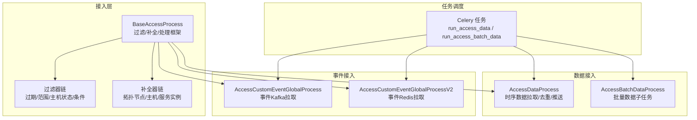
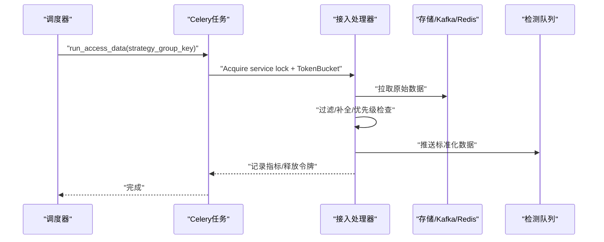
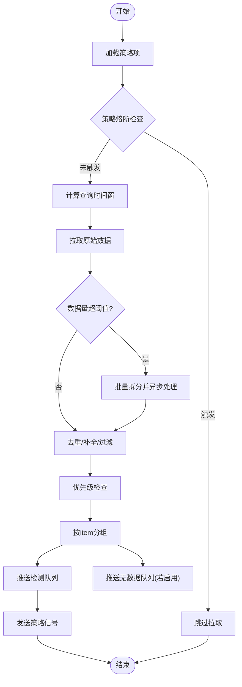
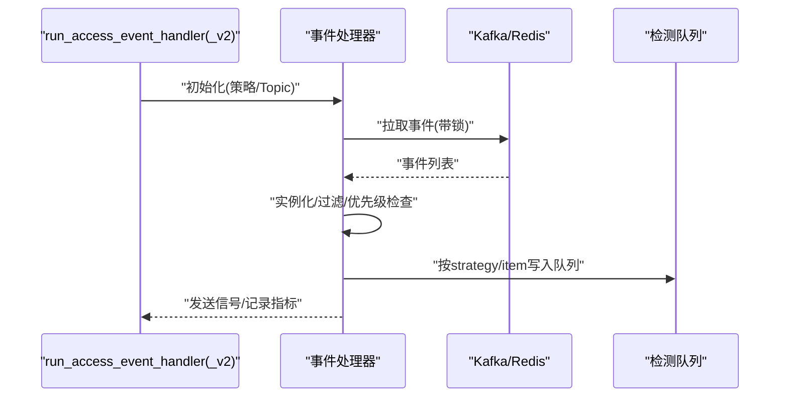
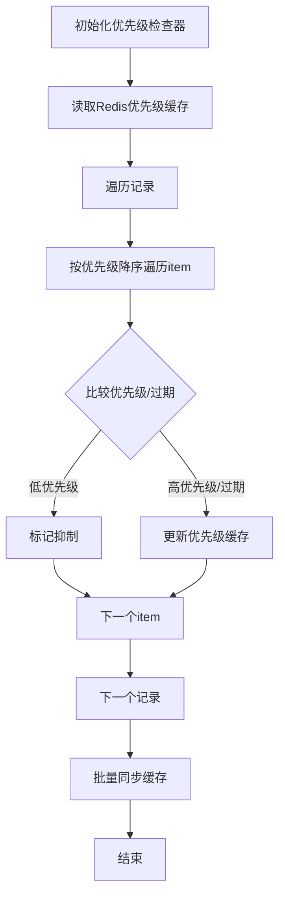
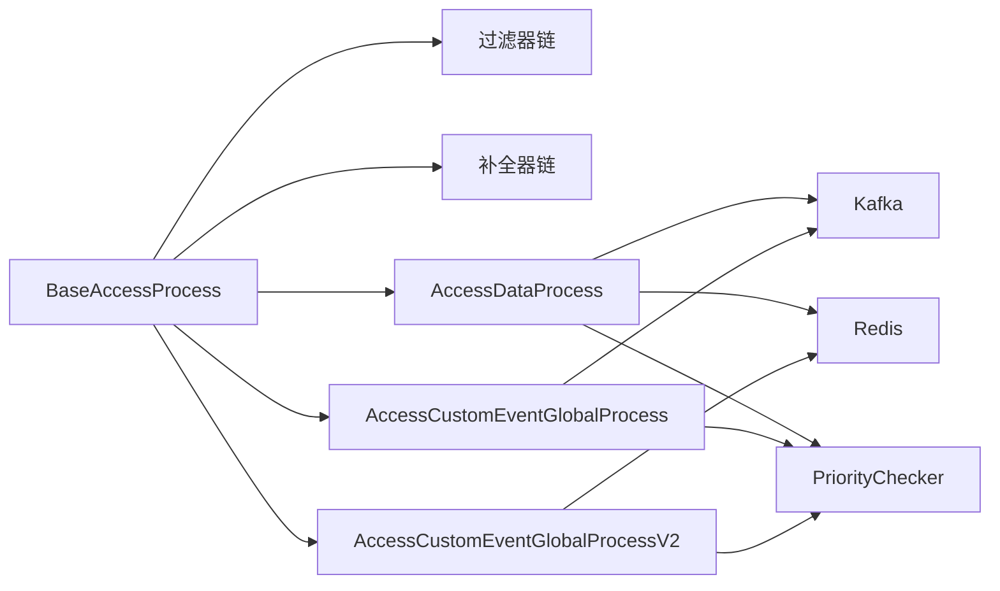

# 告警接入服务

<cite>
**本文引用的文件**
- [bkmonitor/alarm_backends/service/access/base/__init__.py](file://bkmonitor/alarm_backends/service/access/base/__init__.py)
- [bkmonitor/alarm_backends/service/access/data/processor.py](file://bkmonitor/alarm_backends/service/access/data/processor.py)
- [bkmonitor/alarm_backends/service/access/data/filters.py](file://bkmonitor/alarm_backends/service/access/data/filters.py)
- [bkmonitor/alarm_backends/service/access/data/fullers.py](file://bkmonitor/alarm_backends/service/access/data/fullers.py)
- [bkmonitor/alarm_backends/service/access/event/processor.py](file://bkmonitor/alarm_backends/service/access/event/processor.py)
- [bkmonitor/alarm_backends/service/access/event/processorv2.py](file://bkmonitor/alarm_backends/service/access/event/processorv2.py)
- [bkmonitor/alarm_backends/service/access/tasks.py](file://bkmonitor/alarm_backends/service/access/tasks.py)
- [bkmonitor/alarm_backends/service/access/priority.py](file://bkmonitor/alarm_backends/service/access/priority.py)
- [bkmonitor/alarm_backends/constants.py](file://bkmonitor/alarm_backends/constants.py)
</cite>

## 目录
1. [简介](#简介)
2. [项目结构](#项目结构)
3. [核心组件](#核心组件)
4. [架构总览](#架构总览)
5. [详细组件分析](#详细组件分析)
6. [依赖分析](#依赖分析)
7. [性能考量](#性能考量)
8. [故障排查指南](#故障排查指南)
9. [结论](#结论)
10. [附录](#附录)

## 简介
本技术文档围绕告警接入服务，系统阐述原始告警数据的接收、解析、转换与预处理全流程，深入解析告警接入处理器的工作原理、优先级管理策略、事件处理流程与任务调度机制。文档还涵盖告警数据格式规范、接入配置参数、错误处理与重试机制，并提供接入示例、性能优化建议与故障排查方法，帮助开发者理解并扩展告警接入功能。

## 项目结构
告警接入服务位于 alarm_backends 子模块中，采用“按职责分层”的组织方式：
- service/access/base：接入处理基类与通用过滤/补全框架
- service/access/data：时序数据接入（指标/日志等）
- service/access/event：事件数据接入（Agent/自定义事件等）
- service/access/tasks：Celery 任务编排与调度
- service/access/priority：优先级抑制与维度优先级缓存
- alarm_backends/constants：标准字段与常量定义

图表来源
- [bkmonitor/alarm_backends/service/access/base/__init__.py:116-188](file://bkmonitor/alarm_backends/service/access/base/__init__.py#L116-L188)
- [bkmonitor/alarm_backends/service/access/data/processor.py:66-303](file://bkmonitor/alarm_backends/service/access/data/processor.py#L66-L303)
- [bkmonitor/alarm_backends/service/access/event/processor.py:51-177](file://bkmonitor/alarm_backends/service/access/event/processor.py#L51-L177)
- [bkmonitor/alarm_backends/service/access/event/processorv2.py:50-177](file://bkmonitor/alarm_backends/service/access/event/processorv2.py#L50-L177)
- [bkmonitor/alarm_backends/service/access/tasks.py:34-106](file://bkmonitor/alarm_backends/service/access/tasks.py#L34-L106)

章节来源
- [bkmonitor/alarm_backends/service/access/base/__init__.py:1-188](file://bkmonitor/alarm_backends/service/access/base/__init__.py#L1-L188)
- [bkmonitor/alarm_backends/service/access/data/processor.py:1-1766](file://bkmonitor/alarm_backends/service/access/data/processor.py#L1-L1766)
- [bkmonitor/alarm_backends/service/access/event/processor.py:1-364](file://bkmonitor/alarm_backends/service/access/event/processor.py#L1-L364)
- [bkmonitor/alarm_backends/service/access/event/processorv2.py:1-387](file://bkmonitor/alarm_backends/service/access/event/processorv2.py#L1-L387)
- [bkmonitor/alarm_backends/service/access/tasks.py:1-154](file://bkmonitor/alarm_backends/service/access/tasks.py#L1-L154)

## 核心组件
- 基础处理框架
  - BaseAccessProcess：统一的处理生命周期（pull → handle → push），内置过滤器与补全器链
  - Filterer/Fullerer：可插拔的过滤与补全扩展点
- 时序数据接入
  - AccessDataProcess：按策略组拉取指标/日志等时序数据，执行去重、时间点限制、批量拆分与推送
  - AccessBatchDataProcess：批量数据子任务，负责解压与处理
- 事件接入
  - AccessCustomEventGlobalProcess：基于 Kafka 的事件拉取与处理
  - AccessCustomEventGlobalProcessV2：基于 Redis 的事件拉取与处理（自动探测Kafka/Redis）
- 优先级管理
  - PriorityChecker：按维度与优先级组进行抑制判断，维护Redis优先级缓存
- 任务调度
  - run_access_data / run_access_batch_data / run_access_event_handler / run_access_event_handler_v2：Celery 任务封装与限流

章节来源
- [bkmonitor/alarm_backends/service/access/base/__init__.py:116-188](file://bkmonitor/alarm_backends/service/access/base/__init__.py#L116-L188)
- [bkmonitor/alarm_backends/service/access/data/processor.py:66-303](file://bkmonitor/alarm_backends/service/access/data/processor.py#L66-L303)
- [bkmonitor/alarm_backends/service/access/event/processor.py:51-177](file://bkmonitor/alarm_backends/service/access/event/processor.py#L51-L177)
- [bkmonitor/alarm_backends/service/access/event/processorv2.py:50-177](file://bkmonitor/alarm_backends/service/access/event/processorv2.py#L50-L177)
- [bkmonitor/alarm_backends/service/access/priority.py:19-162](file://bkmonitor/alarm_backends/service/access/priority.py#L19-L162)
- [bkmonitor/alarm_backends/service/access/tasks.py:34-145](file://bkmonitor/alarm_backends/service/access/tasks.py#L34-L145)

## 架构总览
告警接入服务通过 Celery 任务驱动，按策略组或 DataID 拉取原始数据，经过过滤、补全、优先级抑制与格式化后，推送到检测队列。时序数据支持批量拆分与异步处理，事件数据支持 Kafka 与 Redis 两种拉取模式。

图表来源
- [bkmonitor/alarm_backends/service/access/tasks.py:34-77](file://bkmonitor/alarm_backends/service/access/tasks.py#L34-L77)
- [bkmonitor/alarm_backends/service/access/data/processor.py:371-498](file://bkmonitor/alarm_backends/service/access/data/processor.py#L371-L498)
- [bkmonitor/alarm_backends/service/access/event/processor.py:295-349](file://bkmonitor/alarm_backends/service/access/event/processor.py#L295-L349)
- [bkmonitor/alarm_backends/service/access/event/processorv2.py:348-373](file://bkmonitor/alarm_backends/service/access/event/processorv2.py#L348-L373)

## 详细组件分析

### 时序数据接入处理器（AccessDataProcess）
- 职责
  - 按策略组加载策略项，计算查询时间窗，拉取原始时序数据
  - 去重与重复数据处理，时间点数量限制，批量拆分与异步子任务
  - 优先级检查，按 item 分组推送至检测队列与无数据队列
- 关键流程
  - 熔断检查：在拉取前剔除策略级别熔断项
  - 查询时间窗：结合 CheckPoint、聚合周期与入库延迟
  - 数据拉取：支持BKDATA局部结果与localTime保护
  - 批量拆分：按series优先与时间点完整性保障拆分
  - 去重与补全：Duplicate + TopoNodeFuller
  - 推送：按strategy/item写入队列并发送信号

图表来源
- [bkmonitor/alarm_backends/service/access/data/processor.py:371-498](file://bkmonitor/alarm_backends/service/access/data/processor.py#L371-L498)
- [bkmonitor/alarm_backends/service/access/data/processor.py:543-639](file://bkmonitor/alarm_backends/service/access/data/processor.py#L543-L639)
- [bkmonitor/alarm_backends/service/access/data/processor.py:641-745](file://bkmonitor/alarm_backends/service/access/data/processor.py#L641-L745)
- [bkmonitor/alarm_backends/service/access/data/processor.py:245-301](file://bkmonitor/alarm_backends/service/access/data/processor.py#L245-L301)

章节来源
- [bkmonitor/alarm_backends/service/access/data/processor.py:66-303](file://bkmonitor/alarm_backends/service/access/data/processor.py#L66-L303)
- [bkmonitor/alarm_backends/service/access/data/processor.py:371-498](file://bkmonitor/alarm_backends/service/access/data/processor.py#L371-L498)
- [bkmonitor/alarm_backends/service/access/data/processor.py:543-639](file://bkmonitor/alarm_backends/service/access/data/processor.py#L543-L639)
- [bkmonitor/alarm_backends/service/access/data/processor.py:641-745](file://bkmonitor/alarm_backends/service/access/data/processor.py#L641-L745)
- [bkmonitor/alarm_backends/service/access/data/processor.py:245-301](file://bkmonitor/alarm_backends/service/access/data/processor.py#L245-L301)

### 事件接入处理器（AccessCustomEventGlobalProcess / V2）
- 职责
  - 从 Kafka 或 Redis 拉取事件数据，按白名单类型实例化事件记录
  - 过滤过期、主机状态、范围与条件，执行优先级检查
  - 将事件按维度分组，写入检测队列并发送信号
- 差异
  - V2 自动探测 Kafka/Redis 拉取模式，支持 Redis 直接拉取与Kafka回退
  - V2 对超大队列进行清理保护，避免Redis阻塞

图表来源
- [bkmonitor/alarm_backends/service/access/event/processor.py:295-349](file://bkmonitor/alarm_backends/service/access/event/processor.py#L295-L349)
- [bkmonitor/alarm_backends/service/access/event/processorv2.py:348-373](file://bkmonitor/alarm_backends/service/access/event/processorv2.py#L348-L373)
- [bkmonitor/alarm_backends/service/access/tasks.py:116-145](file://bkmonitor/alarm_backends/service/access/tasks.py#L116-L145)

章节来源
- [bkmonitor/alarm_backends/service/access/event/processor.py:51-177](file://bkmonitor/alarm_backends/service/access/event/processor.py#L51-L177)
- [bkmonitor/alarm_backends/service/access/event/processorv2.py:50-177](file://bkmonitor/alarm_backends/service/access/event/processorv2.py#L50-L177)
- [bkmonitor/alarm_backends/service/access/tasks.py:116-145](file://bkmonitor/alarm_backends/service/access/tasks.py#L116-L145)

### 优先级管理（PriorityChecker）
- 设计要点
  - 按优先级分组维护维度优先级缓存（Redis Hash）
  - 比较策略优先级与过期时间，低优先级数据被抑制
  - 支持事件记录按优先级降序排序，确保高优先级先处理
- 处理流程
  - 读取优先级缓存
  - 对每个记录逐项比较，决定是否抑制
  - 批量同步更新/删除过期项

图表来源
- [bkmonitor/alarm_backends/service/access/priority.py:100-139](file://bkmonitor/alarm_backends/service/access/priority.py#L100-L139)
- [bkmonitor/alarm_backends/service/access/priority.py:140-162](file://bkmonitor/alarm_backends/service/access/priority.py#L140-L162)

章节来源
- [bkmonitor/alarm_backends/service/access/priority.py:19-162](file://bkmonitor/alarm_backends/service/access/priority.py#L19-L162)

### 任务调度与限流（Celery）
- run_access_data
  - 服务锁：确保同一策略组串行执行
  - 令牌桶：按拉取耗时释放令牌，快速任务不计消耗
  - 执行 AccessDataProcess.process()
- run_access_batch_data
  - 从 Redis 读取压缩批量数据，解压后执行完整处理流程
- run_access_event_handler / run_access_event_handler_v2
  - 事件处理器，支持 Kafka/Redis 拉取模式

章节来源
- [bkmonitor/alarm_backends/service/access/tasks.py:34-77](file://bkmonitor/alarm_backends/service/access/tasks.py#L34-L77)
- [bkmonitor/alarm_backends/service/access/tasks.py:79-106](file://bkmonitor/alarm_backends/service/access/tasks.py#L79-L106)
- [bkmonitor/alarm_backends/service/access/tasks.py:116-145](file://bkmonitor/alarm_backends/service/access/tasks.py#L116-L145)

## 依赖分析
- 组件耦合
  - BaseAccessProcess 作为抽象基类，被数据与事件处理器继承，统一处理流程
  - 过滤器/补全器通过 Filterer/Fullerer 注入，提升可扩展性
  - 优先级检查贯穿数据与事件处理，依赖 Redis 缓存
- 外部依赖
  - Kafka/Redis：事件与批量数据的存储与传输
  - Consul/Cluster：集群与分片信息
  - Prometheus Metrics：接入过程指标上报

图表来源
- [bkmonitor/alarm_backends/service/access/base/__init__.py:116-188](file://bkmonitor/alarm_backends/service/access/base/__init__.py#L116-L188)
- [bkmonitor/alarm_backends/service/access/data/processor.py:66-303](file://bkmonitor/alarm_backends/service/access/data/processor.py#L66-L303)
- [bkmonitor/alarm_backends/service/access/event/processor.py:51-177](file://bkmonitor/alarm_backends/service/access/event/processor.py#L51-L177)
- [bkmonitor/alarm_backends/service/access/event/processorv2.py:50-177](file://bkmonitor/alarm_backends/service/access/event/processorv2.py#L50-L177)
- [bkmonitor/alarm_backends/service/access/priority.py:19-162](file://bkmonitor/alarm_backends/service/access/priority.py#L19-L162)

章节来源
- [bkmonitor/alarm_backends/service/access/base/__init__.py:116-188](file://bkmonitor/alarm_backends/service/access/base/__init__.py#L116-L188)
- [bkmonitor/alarm_backends/service/access/data/processor.py:66-303](file://bkmonitor/alarm_backends/service/access/data/processor.py#L66-L303)
- [bkmonitor/alarm_backends/service/access/event/processor.py:51-177](file://bkmonitor/alarm_backends/service/access/event/processor.py#L51-L177)
- [bkmonitor/alarm_backends/service/access/event/processorv2.py:50-177](file://bkmonitor/alarm_backends/service/access/event/processorv2.py#L50-L177)
- [bkmonitor/alarm_backends/service/access/priority.py:19-162](file://bkmonitor/alarm_backends/service/access/priority.py#L19-L162)

## 性能考量
- 令牌桶限流
  - run_access_data 使用 TokenBucket 控制任务频率，快速任务不计消耗，长任务按耗时释放令牌
- 批量拆分与异步处理
  - 超阈值数据按时间点完整性拆分，首批发往原地处理，其余异步处理，降低端到端延迟
- 去重与缓存
  - 基于策略组与时间窗口的去重缓存，减少重复数据推送
- 优先级抑制
  - 通过维度优先级缓存抑制低优先级数据，降低下游检测压力
- Redis/Kafka 优化
  - 事件V2自动探测Kafka/Redis，避免Kafka分区不足或Redis堆积导致的性能问题

章节来源
- [bkmonitor/alarm_backends/service/access/tasks.py:34-77](file://bkmonitor/alarm_backends/service/access/tasks.py#L34-L77)
- [bkmonitor/alarm_backends/service/access/data/processor.py:543-639](file://bkmonitor/alarm_backends/service/access/data/processor.py#L543-L639)
- [bkmonitor/alarm_backends/service/access/data/processor.py:641-745](file://bkmonitor/alarm_backends/service/access/data/processor.py#L641-L745)
- [bkmonitor/alarm_backends/service/access/priority.py:100-139](file://bkmonitor/alarm_backends/service/access/priority.py#L100-L139)

## 故障排查指南
- 常见问题定位
  - 数据未到达检测队列：检查策略组熔断、过滤器链、优先级抑制与推送信号
  - 事件堆积：检查 Kafka/Redis 拉取模式与队列长度，必要时清理超大队列
  - 去重异常：核对去重缓存TTL与时间窗，确认重复数据是否被正确识别
- 错误处理与重试
  - 事件处理器在拉取失败时记录异常并返回，可通过任务重试机制恢复
  - Kafka/Redis 拉取上限触发时，任务会立即再次调度以继续处理
- 指标与日志
  - 使用 Prometheus 指标与接入日志定位耗时与吞吐瓶颈
  - 关注“熔断”“跳过拉取”“队列过长”“清理超大队列”等关键日志

章节来源
- [bkmonitor/alarm_backends/service/access/data/processor.py:85-146](file://bkmonitor/alarm_backends/service/access/data/processor.py#L85-L146)
- [bkmonitor/alarm_backends/service/access/event/processor.py:315-349](file://bkmonitor/alarm_backends/service/access/event/processor.py#L315-L349)
- [bkmonitor/alarm_backends/service/access/event/processorv2.py:294-335](file://bkmonitor/alarm_backends/service/access/event/processorv2.py#L294-L335)
- [bkmonitor/alarm_backends/service/access/data/processor.py:209-218](file://bkmonitor/alarm_backends/service/access/data/processor.py#L209-L218)

## 结论
告警接入服务通过统一的处理框架、可插拔的过滤与补全机制、优先级抑制与批量拆分策略，实现了高吞吐、低延迟与时序/事件数据的统一接入。Celery 任务与令牌桶限流保障了资源使用的稳定性，Redis/Kafka 双通道拉取增强了系统的弹性与可靠性。建议在生产环境中结合指标监控与日志审计，持续优化策略组粒度、批量阈值与优先级配置，以获得最佳性能与稳定性。

## 附录

### 告警数据格式规范
- 标准字段
  - 时序数据：time、value/values、dimensions、record_id、dimension_fields
  - 异常记录：anomaly_id、anomaly_time、anomaly_message
  - 事件记录：data、anomaly、strategy_snapshot_key
- 字段约束
  - value 保留两位小数
  - dimensions 为维度字典
  - record_id 为标准化后的记录标识

章节来源
- [bkmonitor/alarm_backends/constants.py:28-54](file://bkmonitor/alarm_backends/constants.py#L28-L54)

### 接入配置参数
- 时序数据
  - ACCESS_DATA_BATCH_PROCESS_THRESHOLD：批量处理阈值
  - ACCESS_DATA_BATCH_PROCESS_SIZE：批量大小
  - ACCESS_DATA_TIME_DELAY：入库延迟补偿
  - NUM_OF_COUNT_FREQ_ACCESS：向前拉取周期数
  - ACCESS_DATA_MAX_TIME_POINTS：时间点数量限制
- 事件数据
  - GSE_CUSTOM_EVENT_DATAID / GSE_PROCESS_REPORT_DATAID：事件DataID
  - ENABLE_PING_ALARM / ENABLE_AGENT_ALARM：事件开关
- 优先级与熔断
  - ACCESS_PRIORITY_KEY：优先级缓存键
  - ACCESS_DATA_CIRCUIT_BREAKING：策略级别熔断配置

章节来源
- [bkmonitor/alarm_backends/service/access/data/processor.py:500-542](file://bkmonitor/alarm_backends/service/access/data/processor.py#L500-L542)
- [bkmonitor/alarm_backends/service/access/event/processor.py:218-230](file://bkmonitor/alarm_backends/service/access/event/processor.py#L218-L230)
- [bkmonitor/alarm_backends/service/access/event/processorv2.py:217-229](file://bkmonitor/alarm_backends/service/access/event/processorv2.py#L217-L229)
- [bkmonitor/alarm_backends/service/access/priority.py:46-48](file://bkmonitor/alarm_backends/service/access/priority.py#L46-L48)

### 错误处理与重试机制
- 事件拉取失败：记录异常并返回，任务可重试
- Kafka/Redis 拉取上限：触发立即重试任务继续处理
- 队列过长保护：检测到过长队列时清理并记录日志

章节来源
- [bkmonitor/alarm_backends/service/access/event/processor.py:315-349](file://bkmonitor/alarm_backends/service/access/event/processor.py#L315-L349)
- [bkmonitor/alarm_backends/service/access/event/processorv2.py:294-335](file://bkmonitor/alarm_backends/service/access/event/processorv2.py#L294-L335)

### 接入示例（步骤说明）
- 时序数据接入
  - 通过 run_access_data 策略组任务启动接入
  - 系统自动拉取、去重、优先级检查与推送
- 事件数据接入
  - 通过 run_access_event_handler 或 run_access_event_handler_v2 启动
  - 自动选择 Kafka/Redis 拉取模式并处理

章节来源
- [bkmonitor/alarm_backends/service/access/tasks.py:34-77](file://bkmonitor/alarm_backends/service/access/tasks.py#L34-L77)
- [bkmonitor/alarm_backends/service/access/tasks.py:116-145](file://bkmonitor/alarm_backends/service/access/tasks.py#L116-L145)