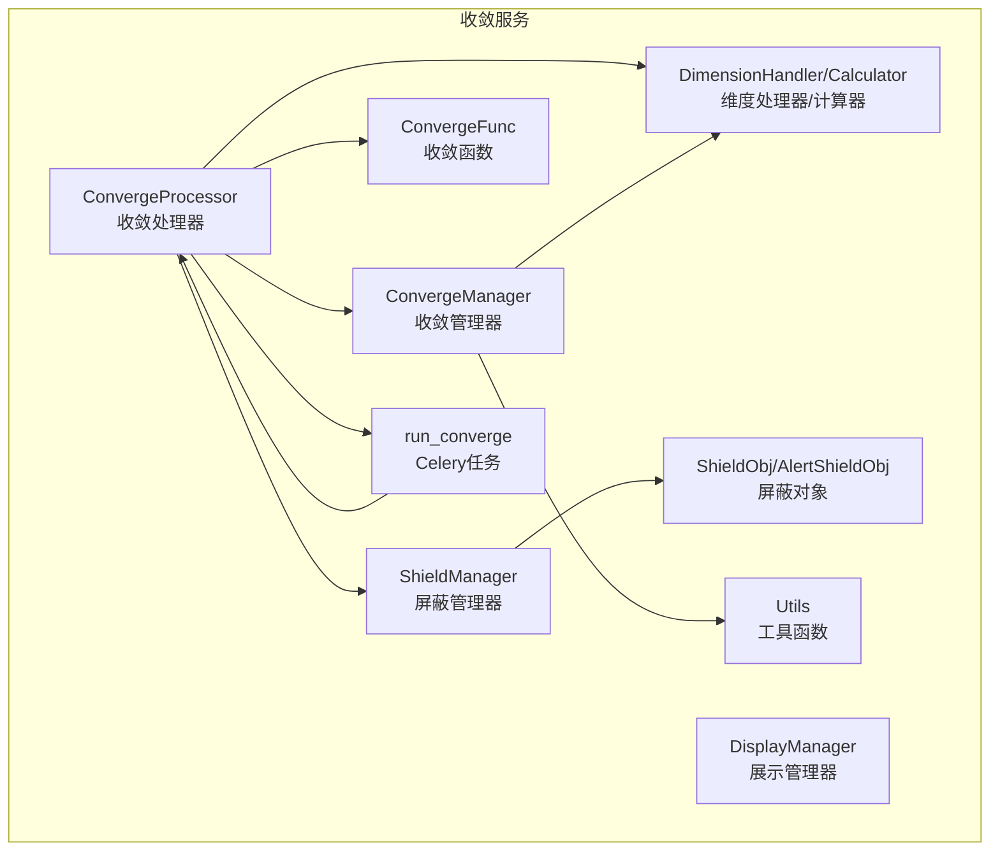
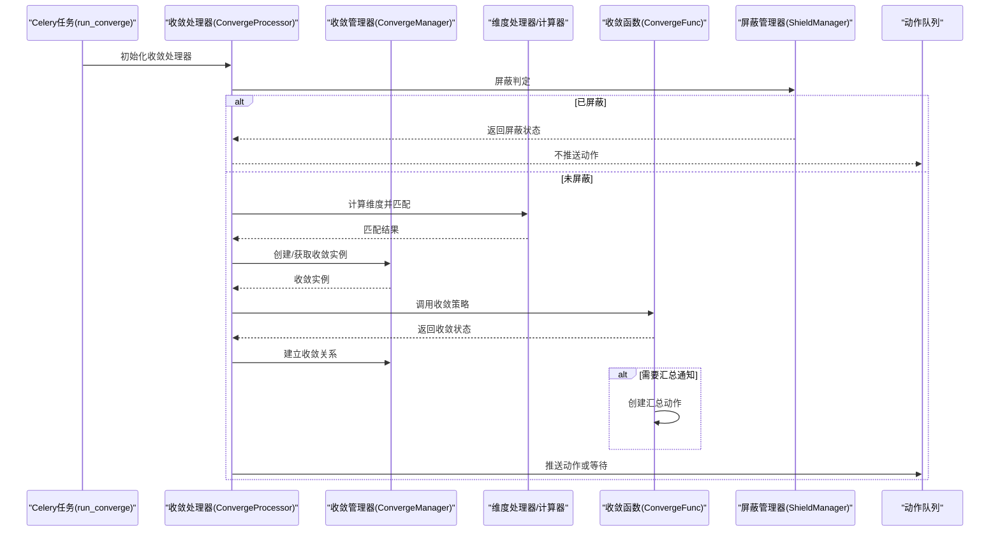
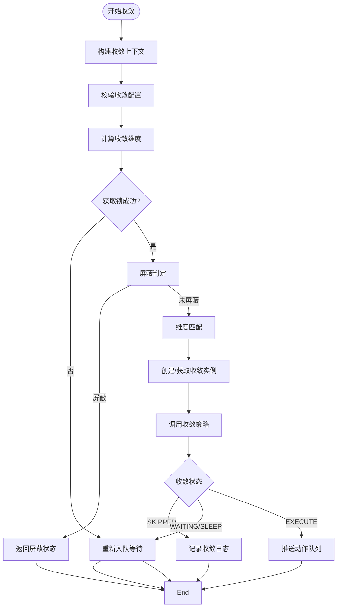
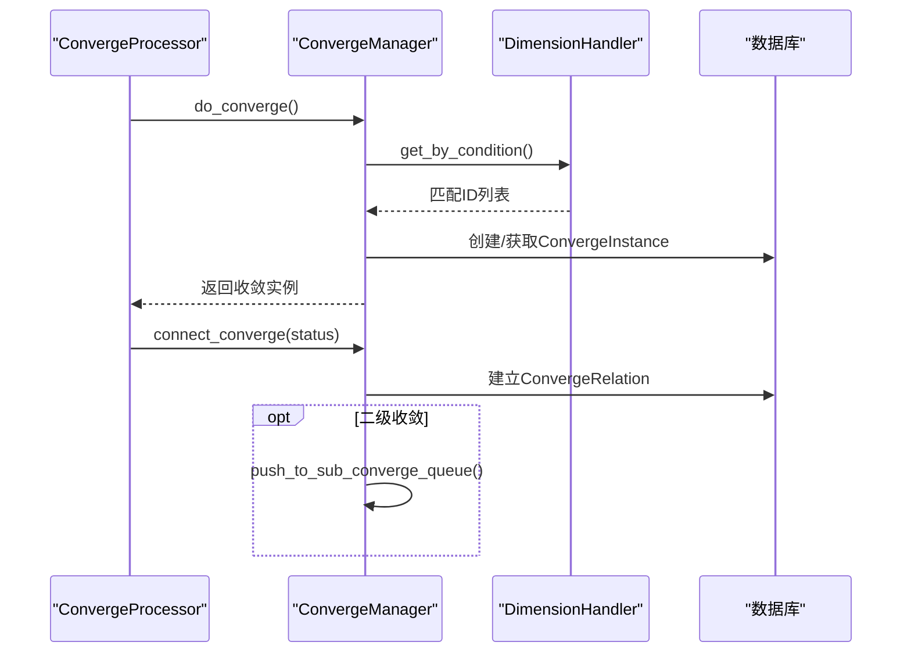
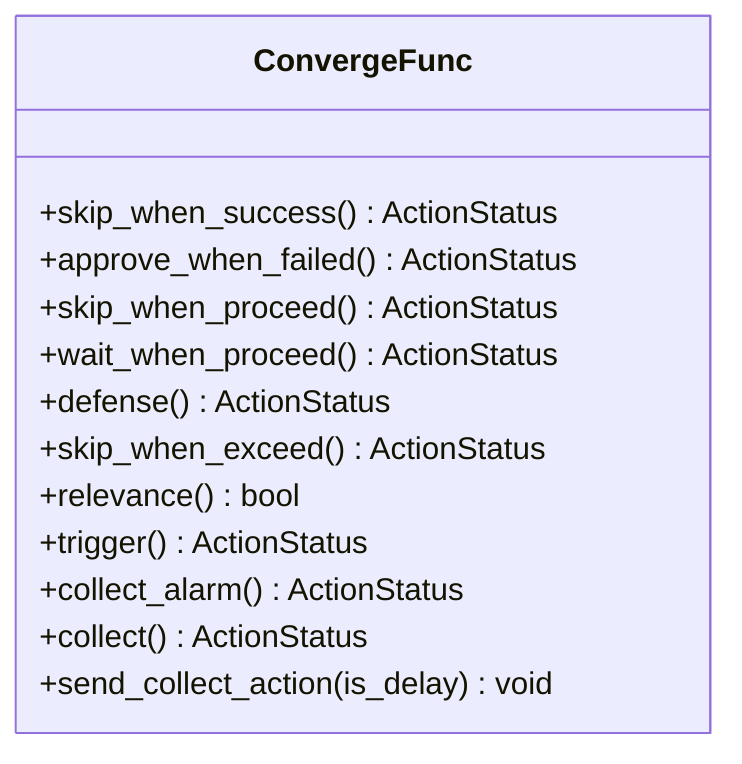
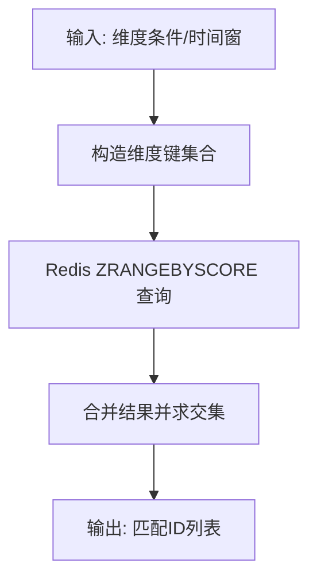
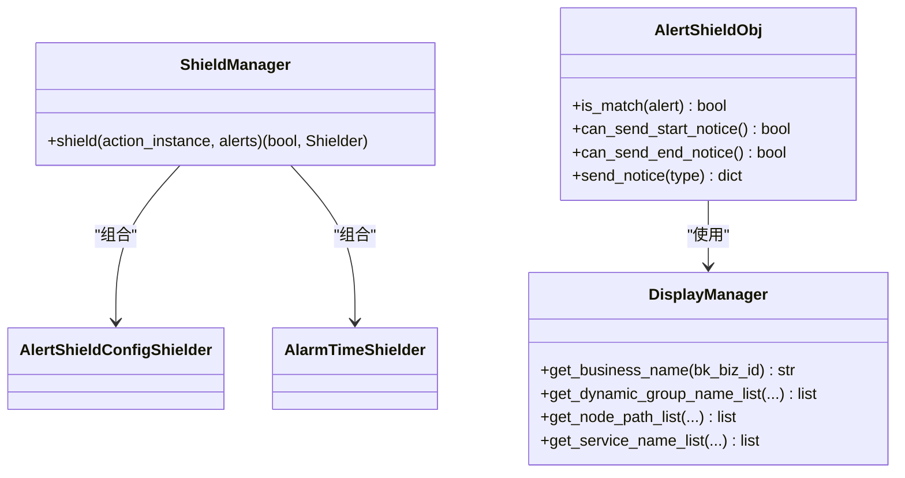
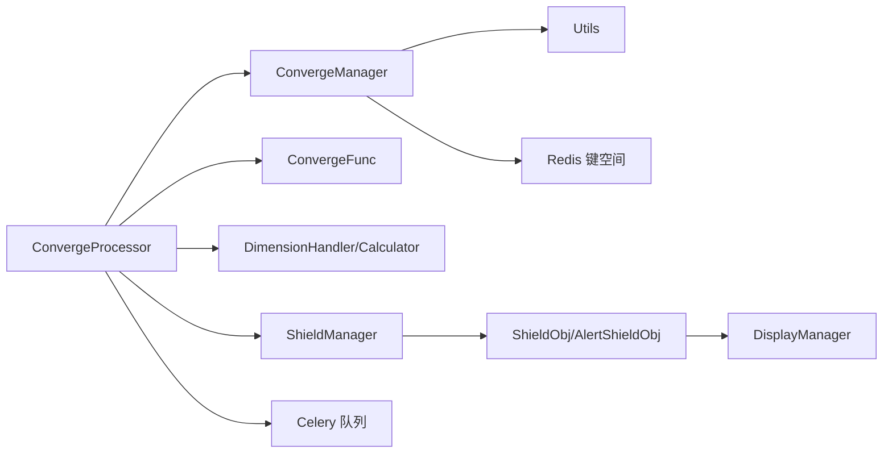

# 告警收敛服务

<cite>
**本文引用的文件**
- [converge_func.py](file://bkmonitor/alarm_backends/service/converge/converge_func.py)
- [converge_manger.py](file://bkmonitor/alarm_backends/service/converge/converge_manger.py)
- [dimension.py](file://bkmonitor/alarm_backends/service/converge/dimension.py)
- [processor.py](file://bkmonitor/alarm_backends/service/converge/processor.py)
- [tasks.py](file://bkmonitor/alarm_backends/service/converge/tasks.py)
- [utils.py](file://bkmonitor/alarm_backends/service/converge/utils.py)
- [manager.py](file://bkmonitor/alarm_backends/service/converge/shield/manager.py)
- [display_manager.py](file://bkmonitor/alarm_backends/service/converge/shield/display_manager.py)
- [shield_obj.py](file://bkmonitor/alarm_backends/service/converge/shield/shield_obj.py)
- [__init__.py](file://bkmonitor/alarm_backends/service/converge/__init__.py)
</cite>

## 目录
1. [简介](#简介)
2. [项目结构](#项目结构)
3. [核心组件](#核心组件)
4. [架构总览](#架构总览)
5. [详细组件分析](#详细组件分析)
6. [依赖关系分析](#依赖关系分析)
7. [性能考量](#性能考量)
8. [故障排查指南](#故障排查指南)
9. [结论](#结论)
10. [附录](#附录)

## 简介
本技术文档围绕告警收敛服务展开，系统性阐述收敛算法实现、维度管理与屏蔽机制，深入解析收敛函数的计算逻辑、收敛管理器的调度策略、维度过滤器的匹配规则以及任务处理器的工作流程。文档还涵盖告警去重策略、收敛规则配置、屏蔽列表管理与性能监控指标，并提供实际应用场景、配置示例与优化建议，帮助开发者构建高效稳定的告警收敛系统。

## 项目结构
告警收敛服务位于 alarm_backends/service/converge 目录，主要由以下模块组成：
- processor.py：收敛任务处理器，负责收敛流程编排、锁控制、队列推送与状态更新
- converge_func.py：收敛函数集合，定义多种收敛策略（跳过、等待、防御、汇总等）
- converge_manger.py：收敛管理器，负责维度匹配、收敛实例创建与关联关系维护
- dimension.py：维度处理器与维度计算器，负责维度键构造、Redis集合查询与二级收敛维度计算
- tasks.py：Celery收敛任务入口，封装收敛任务执行、异常重试与指标上报
- utils.py：收敛工具函数，提供关联动作查询、收敛关系连接等辅助能力
- shield/：屏蔽模块，包含屏蔽管理器、屏蔽对象与展示管理器，支持按策略/维度/动态分组等多维屏蔽

**图表来源**
- [processor.py:55-503](file://bkmonitor/alarm_backends/service/converge/processor.py#L55-L503)
- [converge_manger.py:40-399](file://bkmonitor/alarm_backends/service/converge/converge_manger.py#L40-L399)
- [converge_func.py:29-291](file://bkmonitor/alarm_backends/service/converge/converge_func.py#L29-L291)
- [dimension.py:34-252](file://bkmonitor/alarm_backends/service/converge/dimension.py#L34-L252)
- [tasks.py:24-90](file://bkmonitor/alarm_backends/service/converge/tasks.py#L24-L90)
- [utils.py:16-70](file://bkmonitor/alarm_backends/service/converge/utils.py#L16-L70)
- [manager.py:18-56](file://bkmonitor/alarm_backends/service/converge/shield/manager.py#L18-L56)
- [shield_obj.py:39-497](file://bkmonitor/alarm_backends/service/converge/shield/shield_obj.py#L39-L497)
- [display_manager.py:22-70](file://bkmonitor/alarm_backends/service/converge/shield/display_manager.py#L22-L70)

**章节来源**
- [processor.py:55-503](file://bkmonitor/alarm_backends/service/converge/processor.py#L55-L503)
- [converge_manger.py:40-399](file://bkmonitor/alarm_backends/service/converge/converge_manger.py#L40-L399)
- [dimension.py:34-252](file://bkmonitor/alarm_backends/service/converge/dimension.py#L34-L252)
- [converge_func.py:29-291](file://bkmonitor/alarm_backends/service/converge/converge_func.py#L29-L291)
- [tasks.py:24-90](file://bkmonitor/alarm_backends/service/converge/tasks.py#L24-L90)
- [utils.py:16-70](file://bkmonitor/alarm_backends/service/converge/utils.py#L16-L70)
- [manager.py:18-56](file://bkmonitor/alarm_backends/service/converge/shield/manager.py#L18-L56)
- [shield_obj.py:39-497](file://bkmonitor/alarm_backends/service/converge/shield/shield_obj.py#L39-L497)
- [display_manager.py:22-70](file://bkmonitor/alarm_backends/service/converge/shield/display_manager.py#L22-L70)

## 核心组件
- 收敛处理器（ConvergeProcessor）
  - 负责收敛上下文构建、收敛配置校验、维度计算、锁控制、收敛执行与队列推送
  - 提供收敛状态更新、睡眠等待与动作队列推送逻辑
- 收敛管理器（ConvergeManager）
  - 负责维度匹配、收敛实例创建、关联关系建立与二级收敛推送
  - 提供业务维度锁控制与收敛实例生命周期管理
- 收敛函数（ConvergeFunc）
  - 定义多种收敛策略：成功后跳过、执行中跳过、防御、超出忽略、触发后处理、汇总通知等
  - 提供汇总通知的创建与异步执行
- 维度处理器/计算器（DimensionHandler/DimensionCalculator）
  - 构造Redis维度键，查询匹配的告警事件集合，计算收敛维度与二级收敛标签
  - 清理过期维度数据并设置过期时间
- 屏蔽管理器（ShieldManager）
  - 组合全局屏蔽、告警配置屏蔽与时间屏蔽器，对动作执行前进行屏蔽判定
- 屏蔽对象（ShieldObj/AlertShieldObj）
  - 解析屏蔽配置，构建维度与时间匹配条件，支持动态分组与拓扑节点匹配
  - 提供屏蔽通知的发送与锁控制
- Celery任务（run_converge）
  - 封装收敛任务执行，处理并发锁冲突、数据库异常与重试逻辑
  - 上报处理耗时与异常指标

**章节来源**
- [processor.py:55-503](file://bkmonitor/alarm_backends/service/converge/processor.py#L55-L503)
- [converge_manger.py:40-399](file://bkmonitor/alarm_backends/service/converge/converge_manger.py#L40-L399)
- [converge_func.py:29-291](file://bkmonitor/alarm_backends/service/converge/converge_func.py#L29-L291)
- [dimension.py:34-252](file://bkmonitor/alarm_backends/service/converge/dimension.py#L34-L252)
- [manager.py:18-56](file://bkmonitor/alarm_backends/service/converge/shield/manager.py#L18-L56)
- [shield_obj.py:39-497](file://bkmonitor/alarm_backends/service/converge/shield/shield_obj.py#L39-L497)
- [tasks.py:24-90](file://bkmonitor/alarm_backends/service/converge/tasks.py#L24-L90)

## 架构总览
告警收敛服务采用“任务驱动 + 维度匹配 + 屏蔽判定”的架构模式。Celery任务触发收敛处理器，处理器根据收敛配置计算维度并调用收敛管理器进行匹配与实例化；收敛函数根据策略决定是否收敛或继续处理；屏蔽模块在动作执行前进行屏蔽判定；最终将动作推送至相应处理队列或等待队列。

**图表来源**
- [tasks.py:24-90](file://bkmonitor/alarm_backends/service/converge/tasks.py#L24-L90)
- [processor.py:186-328](file://bkmonitor/alarm_backends/service/converge/processor.py#L186-L328)
- [converge_manger.py:84-128](file://bkmonitor/alarm_backends/service/converge/converge_manger.py#L84-L128)
- [converge_func.py:178-291](file://bkmonitor/alarm_backends/service/converge/converge_func.py#L178-L291)
- [manager.py:25-55](file://bkmonitor/alarm_backends/service/converge/shield/manager.py#L25-L55)

## 详细组件分析

### 收敛处理器（ConvergeProcessor）
- 收敛上下文与配置校验
  - 从动作实例或收敛实例提取收敛上下文，校验收敛配置合法性（条件、时间窗、阈值）
  - 设置收敛时间窗与最大收敛时间窗，计算起止时间戳
- 维度计算
  - 通过“self”占位符替换为真实上下文值，生成维度字符串并计算哈希，确保维度安全长度
  - 支持通知类动作与多策略聚合场景的默认收敛配置
- 锁控制与并发保护
  - 使用分布式锁限制同一维度下的并发收敛数量，避免过度竞争
  - 当无法获取锁时，将任务重新推入收敛队列等待
- 屏蔽判定
  - 在动作执行前进行屏蔽判定，若命中屏蔽则直接返回屏蔽状态并记录日志
- 收敛执行与队列推送
  - 调用收敛管理器进行维度匹配与收敛实例创建
  - 根据收敛函数策略返回状态，更新动作状态并推送至动作队列或等待队列
  - 对通知类动作进行汇总键记录以便后续合并

**图表来源**
- [processor.py:186-328](file://bkmonitor/alarm_backends/service/converge/processor.py#L186-L328)

**章节来源**
- [processor.py:55-503](file://bkmonitor/alarm_backends/service/converge/processor.py#L55-L503)

### 收敛管理器（ConvergeManager）
- 维度匹配
  - 使用维度处理器查询在时间窗内的匹配事件ID，过滤已关联的收敛关系
  - 支持二级收敛场景下的维度标签构造与匹配
- 收敛实例创建
  - 根据匹配数量与阈值创建收敛实例，设置描述与收敛函数
  - 若创建时间早于当前起始时间，及时结束该收敛实例
- 关联关系维护
  - 建立收敛关系表，区分主实例与关联实例，记录收敛状态
  - 对二级收敛抑制一级收敛可见性，避免重复展示
- 业务维度锁控制
  - 使用Redis计数器控制业务维度下的并发数量，超过阈值直接跳过
- 二级收敛推送
  - 计算二级收敛维度并推送至收敛队列，形成多级收敛链路

**图表来源**
- [converge_manger.py:84-128](file://bkmonitor/alarm_backends/service/converge/converge_manger.py#L84-L128)
- [dimension.py:61-107](file://bkmonitor/alarm_backends/service/converge/dimension.py#L61-L107)

**章节来源**
- [converge_manger.py:40-399](file://bkmonitor/alarm_backends/service/converge/converge_manger.py#L40-L399)
- [dimension.py:34-252](file://bkmonitor/alarm_backends/service/converge/dimension.py#L34-L252)

### 收敛函数（ConvergeFunc）
- 策略方法
  - 成功后跳过：若有其他收敛成功则跳过当前动作
  - 执行中跳过：若有其他动作执行中则跳过当前动作
  - 防御：超过阈值数量时进入等待状态，交由人工审批
  - 超出忽略：超过阈值数量直接忽略
  - 触发后处理：仅在触发条件满足后才处理
  - 汇总通知：在收敛窗口结束时发送汇总通知
- 汇总通知
  - 构建汇总动作配置，设置插件类型为通知插件
  - 异步执行汇总动作，延时发送以覆盖完整窗口

**图表来源**
- [converge_func.py:29-291](file://bkmonitor/alarm_backends/service/converge/converge_func.py#L29-L291)

**章节来源**
- [converge_func.py:29-291](file://bkmonitor/alarm_backends/service/converge/converge_func.py#L29-L291)

### 维度处理器与计算器（DimensionHandler/DimensionCalculator）
- 维度键构造
  - 基于策略ID、维度键与维度值构造Redis集合键，支持空值与多值场景
  - 使用有序集合存储事件ID与创建时间戳作为分数
- 维度匹配
  - 对多个维度键执行并集与交集运算，得到匹配事件ID集合
  - 支持二级收敛场景下的标签键构造与匹配
- 维度清理与过期
  - 定期清理过期维度数据，设置合理TTL避免无限增长
  - 二级收敛维度使用独立键空间与标签拼接

**图表来源**
- [dimension.py:61-107](file://bkmonitor/alarm_backends/service/converge/dimension.py#L61-L107)

**章节来源**
- [dimension.py:34-252](file://bkmonitor/alarm_backends/service/converge/dimension.py#L34-L252)

### 屏蔽管理器与屏蔽对象
- 屏蔽管理器
  - 优先进行全局屏蔽判定，随后遍历屏蔽器组合（告警配置屏蔽、时间屏蔽）
  - 对多告警场景，任一告警命中即整体屏蔽
- 屏蔽对象
  - 解析屏蔽配置，构建维度与时间匹配条件，支持动态分组与拓扑节点
  - 提供开始/结束通知的发送与锁控制，避免重复通知
- 展示管理器
  - 提供业务名称、动态分组名称、拓扑节点路径与服务实例名称的展示解析

**图表来源**
- [manager.py:18-56](file://bkmonitor/alarm_backends/service/converge/shield/manager.py#L18-L56)
- [shield_obj.py:39-497](file://bkmonitor/alarm_backends/service/converge/shield/shield_obj.py#L39-L497)
- [display_manager.py:22-70](file://bkmonitor/alarm_backends/service/converge/shield/display_manager.py#L22-L70)

**章节来源**
- [manager.py:18-56](file://bkmonitor/alarm_backends/service/converge/shield/manager.py#L18-L56)
- [shield_obj.py:39-497](file://bkmonitor/alarm_backends/service/converge/shield/shield_obj.py#L39-L497)
- [display_manager.py:22-70](file://bkmonitor/alarm_backends/service/converge/shield/display_manager.py#L22-L70)

### Celery收敛任务（run_converge）
- 任务入口
  - 接收收敛配置、实例ID、实例类型与收敛上下文，初始化收敛处理器
- 异常处理
  - 捕获并发锁冲突与数据库异常，必要时进行最多3次重试
- 指标上报
  - 上报处理耗时与异常状态，便于监控与容量规划

**章节来源**
- [tasks.py:24-90](file://bkmonitor/alarm_backends/service/converge/tasks.py#L24-L90)

## 依赖关系分析
- 组件耦合
  - ConvergeProcessor 依赖 ConvergeManager、ConvergeFunc、DimensionHandler、ShieldManager
  - ConvergeManager 依赖 DimensionHandler、Utils、ConvergeInstance/ConvergeRelation
  - DimensionHandler/Calculator 依赖 Redis 键空间与时间工具
  - ShieldManager 依赖 ShieldObj/AlertShieldObj 与展示管理器
- 外部依赖
  - Celery 队列（收敛队列与动作队列）
  - Redis（维度键空间、锁键空间、通知屏蔽锁键）
  - 数据库（动作实例、收敛实例、收敛关系）

**图表来源**
- [processor.py:55-503](file://bkmonitor/alarm_backends/service/converge/processor.py#L55-L503)
- [converge_manger.py:40-399](file://bkmonitor/alarm_backends/service/converge/converge_manger.py#L40-L399)
- [dimension.py:34-252](file://bkmonitor/alarm_backends/service/converge/dimension.py#L34-L252)
- [manager.py:18-56](file://bkmonitor/alarm_backends/service/converge/shield/manager.py#L18-L56)
- [shield_obj.py:39-497](file://bkmonitor/alarm_backends/service/converge/shield/shield_obj.py#L39-L497)

**章节来源**
- [processor.py:55-503](file://bkmonitor/alarm_backends/service/converge/processor.py#L55-L503)
- [converge_manger.py:40-399](file://bkmonitor/alarm_backends/service/converge/converge_manger.py#L40-L399)
- [dimension.py:34-252](file://bkmonitor/alarm_backends/service/converge/dimension.py#L34-L252)
- [manager.py:18-56](file://bkmonitor/alarm_backends/service/converge/shield/manager.py#L18-L56)
- [shield_obj.py:39-497](file://bkmonitor/alarm_backends/service/converge/shield/shield_obj.py#L39-L497)

## 性能考量
- 并发控制
  - 使用分布式锁限制同一维度并发收敛数量，避免热点维度引发的抖动
  - 当锁冲突时自动等待并重试，降低竞争带来的失败率
- 维度查询优化
  - 通过Redis有序集合快速查询时间窗内事件，减少数据库扫描
  - 交集/并集运算在内存中完成，复杂度与维度数量线性相关
- 过期与清理
  - 定期清理过期维度数据，防止键空间无限增长
  - TTL设置合理，兼顾时效性与资源占用
- 指标监控
  - 上报收敛处理耗时与异常状态，便于容量评估与性能优化
  - 对动作队列与收敛队列的延迟进行观测，识别瓶颈环节

[本节为通用性能讨论，不直接分析具体文件]

## 故障排查指南
- 并发锁冲突
  - 现象：收敛任务频繁重试或长时间处于等待状态
  - 排查：检查维度并发阈值设置、热点维度分布与Redis锁键状态
  - 处置：调整并发阈值、拆分维度或引入降级策略
- 维度匹配异常
  - 现象：匹配结果为空或不准确
  - 排查：确认维度键构造逻辑、时间窗边界与Redis键空间
  - 处置：核对收敛配置、维度值与时间戳
- 屏蔽误判
  - 现象：正常动作被屏蔽或屏蔽未生效
  - 排查：检查屏蔽配置、动态分组与拓扑节点映射
  - 处置：修正屏蔽规则、更新动态分组或调整时间周期
- 任务重试
  - 现象：收敛任务多次重试
  - 排查：查看数据库异常日志与锁冲突日志
  - 处置：修复数据库异常、优化锁键TTL或增加重试上限

**章节来源**
- [tasks.py:49-76](file://bkmonitor/alarm_backends/service/converge/tasks.py#L49-L76)
- [processor.py:220-245](file://bkmonitor/alarm_backends/service/converge/processor.py#L220-L245)
- [converge_manger.py:155-174](file://bkmonitor/alarm_backends/service/converge/converge_manger.py#L155-L174)

## 结论
告警收敛服务通过“任务驱动 + 维度匹配 + 屏蔽判定”的架构实现了高并发、可扩展的告警收敛能力。收敛处理器负责流程编排与状态管理，收敛管理器承担维度匹配与实例化，收敛函数提供多样化的收敛策略，维度处理器与计算器保障高效匹配，屏蔽模块确保收敛前的准确性。结合Celery任务与Redis键空间，系统在保证稳定性的同时具备良好的性能表现。建议在生产环境中合理设置并发阈值、优化维度键设计并完善监控指标，以获得更佳的收敛效果。

[本节为总结性内容，不直接分析具体文件]

## 附录

### 实际应用场景
- 大促流量洪峰：通过“执行中跳过”策略避免重复处理，降低系统压力
- 网络波动：利用“防御”策略在异常情况下等待人工审批，避免误处理
- 通知聚合：使用“汇总通知”策略在收敛窗口结束后统一发送，减少打扰

### 配置示例（说明性）
- 收敛配置要点
  - 条件：定义参与收敛的维度键与取值
  - 阈值：设置时间窗内事件数量阈值
  - 策略：选择收敛函数（如 skip_when_proceed、defense、collect）
  - 时间窗：设置收敛时间窗与最大收敛时间窗
- 屏蔽配置要点
  - 类别：按策略/维度/动态分组等
  - 时间周期：支持单次与循环周期
  - 通知：配置开始/结束通知接收人与模板

### 优化建议
- 维度设计
  - 选择高区分度的维度键，避免过于宽泛导致匹配误差
  - 控制维度值数量，减少Redis集合规模
- 并发与锁
  - 根据业务峰值调整并发阈值，避免过度竞争
  - 合理设置锁TTL，防止长期占用
- 监控与告警
  - 关注收敛处理耗时与异常率，及时发现性能瓶颈
  - 对队列积压与任务重试进行专项监控

[本节为通用指导，不直接分析具体文件]