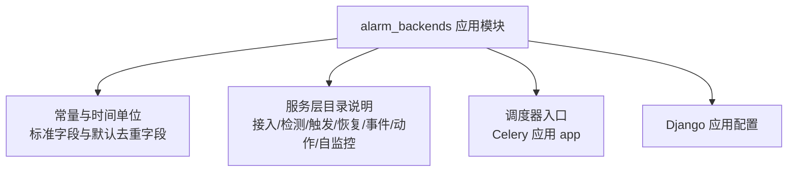
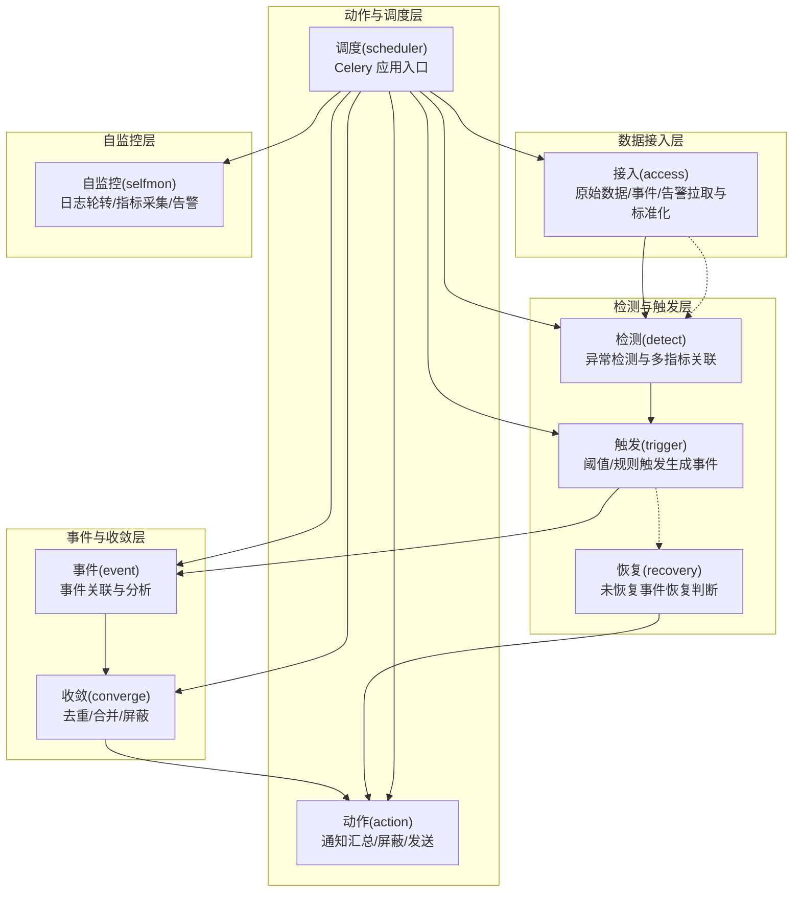
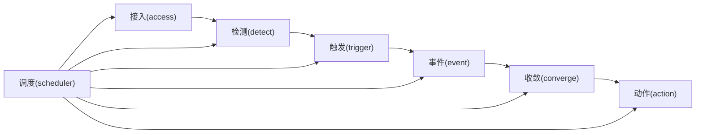

# 告警服务层

<cite>
**本文引用的文件**
- [apps.py](file://bkmonitor/alarm_backends/apps.py)
- [constants.py](file://bkmonitor/alarm_backends/constants.py)
- [README.md](file://bkmonitor/alarm_backends/service/README.md)
- [__init__.py](file://bkmonitor/alarm_backends/service/__init__.py)
</cite>

## 目录
1. [简介](#简介)
2. [项目结构](#项目结构)
3. [核心组件](#核心组件)
4. [架构总览](#架构总览)
5. [详细组件分析](#详细组件分析)
6. [依赖分析](#依赖分析)
7. [性能考虑](#性能考虑)
8. [故障排查指南](#故障排查指南)
9. [结论](#结论)
10. [附录](#附录)

## 简介
本技术文档面向告警服务层，系统性梳理“告警接入、告警处理、复合告警、告警收敛、检测策略、触发器、无数据处理、调度器”等核心能力的业务逻辑、接口设计与实现要点。文档以仓库中“alarm_backends”模块为依据，结合服务层目录说明与常量定义，给出服务间协作关系、数据流转、错误处理机制、配置参数与性能优化建议，帮助开发者快速掌握告警服务层的开发与维护。

## 项目结构
alarm_backends 是告警后端服务的聚合模块，包含应用配置、常量定义、服务层目录与调度入口等关键部分。服务层目录说明了数据接入、检测、触发、恢复、事件关联、动作执行、自监控等环节的职责边界与数据契约。

图表来源
- [apps.py:16-22](file://bkmonitor/alarm_backends/apps.py#L16-L22)
- [constants.py:11-81](file://bkmonitor/alarm_backends/constants.py#L11-L81)
- [README.md:1-120](file://bkmonitor/alarm_backends/service/README.md#L1-L120)
- [__init__.py:13-13](file://bkmonitor/alarm_backends/service/__init__.py#L13-L13)

章节来源
- [apps.py:16-22](file://bkmonitor/alarm_backends/apps.py#L16-L22)
- [constants.py:11-81](file://bkmonitor/alarm_backends/constants.py#L11-L81)
- [README.md:1-120](file://bkmonitor/alarm_backends/service/README.md#L1-L120)
- [__init__.py:13-13](file://bkmonitor/alarm_backends/service/__init__.py#L13-L13)

## 核心组件
- 应用配置与启动
  - Django 应用配置类负责模块注册与 ready 生命周期钩子，确保告警后端服务在系统初始化阶段完成必要的准备。
- 常量与标准字段
  - 定义环境标识、时间单位、标准数据/异常/事件字段集合、默认去重字段、无数据相关常量、Kafka 缓冲上限等，为各服务模块提供统一契约。
- 服务层目录说明
  - 明确接入(access)、检测(detect)、触发(trigger)、恢复(recovery)、事件(event)、动作(action)、自监控(selfmon)等服务的输入输出与职责边界。
- 调度器入口
  - 通过服务层 __init__ 导出 Celery 应用 app，作为调度器的统一入口。

章节来源
- [apps.py:16-22](file://bkmonitor/alarm_backends/apps.py#L16-L22)
- [constants.py:11-81](file://bkmonitor/alarm_backends/constants.py#L11-L81)
- [README.md:1-120](file://bkmonitor/alarm_backends/service/README.md#L1-L120)
- [__init__.py:13-13](file://bkmonitor/alarm_backends/service/__init__.py#L13-L13)

## 架构总览
告警服务层采用分层流水线架构：数据接入将原始数据标准化；检测模块基于策略进行异常检测；触发器根据阈值与规则生成事件；事件进行关联与收敛；动作模块执行通知与处置；恢复模块监测恢复并下发恢复动作；自监控保障系统健康运行。

图表来源
- [README.md:3-79](file://bkmonitor/alarm_backends/service/README.md#L3-L79)
- [__init__.py:13-13](file://bkmonitor/alarm_backends/service/__init__.py#L13-L13)

## 详细组件分析

### 数据接入(access)
- 职责
  - 原始数据接入：拉取配置、拉取数据、维度补充、范围过滤、输出标准数据。
  - 事件数据接入：原始事件拉取、维度补充、范围过滤、输出标准事件数据。
  - 告警数据接入：原始告警拉取、输出标准动作数据。
- 数据契约
  - 标准化数据需满足标准字段集合，保证后续检测与事件处理的一致性。
- 实现要点
  - 配置来源：支持从配置文件或缓存获取接入参数。
  - 过滤与补维：在接入层完成维度补充与范围过滤，降低下游压力。
  - 输出规范：严格遵循标准数据/事件格式，便于跨模块传递。

章节来源
- [README.md:3-23](file://bkmonitor/alarm_backends/service/README.md#L3-L23)
- [constants.py:28-50](file://bkmonitor/alarm_backends/constants.py#L28-L50)

### 检测(detect)
- 职责
  - 输入标准数据，执行算法检测（含多指标计算与关联），输出异常。
- 数据契约
  - 输入：标准数据；输出：异常对象，包含异常标识、异常时间、异常消息等。
- 实现要点
  - 支持多指标关联与复合检测，提升复杂场景下的准确性。
  - 异常对象需携带可追溯的异常标识与时间戳，便于事件与收敛处理。

章节来源
- [README.md:25-32](file://bkmonitor/alarm_backends/service/README.md#L25-L32)
- [constants.py:38-44](file://bkmonitor/alarm_backends/constants.py#L38-L44)

### 触发(trigger)
- 职责
  - 输入异常与检测结果，执行触发判断，输出事件。
- 数据契约
  - 输入：异常 + 检测结果；输出：事件对象，包含数据、异常、策略快照键等。
- 实现要点
  - 触发条件应与策略配置一致，避免误报与漏报。
  - 事件对象需携带策略快照键，便于后续事件分析与回溯。

章节来源
- [README.md:34-41](file://bkmonitor/alarm_backends/service/README.md#L34-L41)
- [constants.py:45-50](file://bkmonitor/alarm_backends/constants.py#L45-L50)

### 恢复(recovery)
- 职责
  - 输入未恢复事件与检测结果，执行恢复判断，输出动作（当前为恢复通知）。
- 数据契约
  - 输入：未恢复事件 + 检测结果；输出：动作（恢复通知）。
- 实现要点
  - 恢复判断需与触发条件互补，确保告警闭环。
  - 动作类型目前为恢复通知，后续可扩展为其他处置动作。

章节来源
- [README.md:43-51](file://bkmonitor/alarm_backends/service/README.md#L43-L51)

### 事件(event)
- 职责
  - 输入事件，执行关联分析，输出动作（当前为通知）。
- 数据契约
  - 输入：事件；输出：动作（通知）。
- 实现要点
  - 事件关联用于聚合相似事件，减少噪声。
  - 动作类型目前为通知，后续可扩展为更多处置动作。

章节来源
- [README.md:53-61](file://bkmonitor/alarm_backends/service/README.md#L53-L61)

### 收敛(converge)
- 职责
  - 对事件进行去重、合并与屏蔽，降低重复通知。
- 数据契约
  - 输入：事件；输出：收敛后的事件集合。
- 实现要点
  - 默认去重字段包含告警名称、策略ID、目标类型、目标、业务ID等，确保收敛粒度合理。
  - 屏蔽策略可结合业务场景配置，避免无效通知。

章节来源
- [README.md:62-71](file://bkmonitor/alarm_backends/service/README.md#L62-L71)
- [constants.py:74-75](file://bkmonitor/alarm_backends/constants.py#L74-L75)

### 动作(action)
- 职责
  - 执行通知动作，包括通知汇总、屏蔽与发送。
- 数据契约
  - 输入：事件/动作请求；输出：通知执行结果。
- 实现要点
  - 通知汇总与屏蔽策略需与收敛配合，确保通知质量。
  - 发送通道与模板需可配置，满足多渠道通知需求。

章节来源
- [README.md:63-70](file://bkmonitor/alarm_backends/service/README.md#L63-L70)

### 自监控(selfmon)
- 职责
  - 处理日志文件轮转、采集监控指标并做简单判断、发送自监控告警、QoS 检测。
- 数据契约
  - 输入：系统运行日志与指标；输出：自监控告警与报告。
- 实现要点
  - 自监控应独立于主流程，避免“自身故障影响自身观测”。

章节来源
- [README.md:72-79](file://bkmonitor/alarm_backends/service/README.md#L72-L79)

### 调度器(scheduler)
- 职责
  - 提供统一的 Celery 应用入口，承载各服务的定时任务与异步任务。
- 数据契约
  - 通过 app 导出调度器实例，供各服务注册任务。
- 实现要点
  - 任务注册与生命周期管理需与 Django 应用初始化协同。

章节来源
- [__init__.py:13-13](file://bkmonitor/alarm_backends/service/__init__.py#L13-L13)

## 依赖分析
- 模块耦合
  - 各服务模块围绕“标准数据/事件/异常”契约进行解耦，通过统一的常量与字段定义降低耦合度。
  - 调度器作为统一入口，向上承接各服务任务，向下驱动数据流。
- 外部依赖
  - Redis：用于配置缓存、队列与服务自身数据存储（按 DB 分配）。
  - Kafka：用于高吞吐数据传输（缓冲上限配置）。
- 关键依赖链
  - 接入 → 检测 → 触发 → 事件 → 收敛 → 动作
  - 调度器贯穿全链路，保障任务执行与可观测性。

图表来源
- [README.md:3-79](file://bkmonitor/alarm_backends/service/README.md#L3-L79)
- [__init__.py:13-13](file://bkmonitor/alarm_backends/service/__init__.py#L13-L13)

章节来源
- [README.md:3-79](file://bkmonitor/alarm_backends/service/README.md#L3-L79)
- [__init__.py:13-13](file://bkmonitor/alarm_backends/service/__init__.py#L13-L13)

## 性能考虑
- 数据接入层
  - 在接入层完成维度补充与范围过滤，减少下游处理开销。
  - 标准化输出需保持字段最小集，避免冗余传输。
- 检测与触发
  - 复合检测与多指标关联应尽量利用批处理与缓存，降低重复计算。
  - 触发判断需与策略配置保持一致，避免无效分支。
- 收敛与动作
  - 默认去重字段需结合业务场景调优，兼顾准确性与粒度。
  - 通知通道与模板需可配置，避免阻塞主流程。
- 存储与传输
  - Redis DB 分配明确，队列与服务数据分离，避免相互影响。
  - Kafka 缓冲上限配置需结合吞吐与延迟目标调整。

## 故障排查指南
- 常见问题定位
  - 数据不一致：检查接入层是否正确补充维度与过滤范围，确认标准字段是否齐全。
  - 触发异常：核对策略配置与触发条件，确认事件对象是否包含策略快照键。
  - 收敛失效：检查默认去重字段与屏蔽配置，确认收敛粒度是否合理。
  - 通知失败：核查通知通道与模板配置，确认动作模块执行状态。
- 自监控
  - 关注自监控日志与告警，及时发现系统异常与 QoS 下降。
- 调度器
  - 检查 Celery 应用是否正常加载，任务是否按时执行。

章节来源
- [README.md:72-79](file://bkmonitor/alarm_backends/service/README.md#L72-L79)

## 结论
告警服务层通过清晰的服务边界与统一的数据契约，实现了从数据接入到动作执行的完整闭环。借助调度器与自监控，系统具备良好的可运维性与可观测性。开发者在扩展新策略、优化检测算法或增强动作能力时，应严格遵循标准字段与默认去重策略，确保整体稳定性与性能。

## 附录
- 配置参数与约定
  - 环境标识：生产/测试/开发
  - 时间单位：秒、半分钟、分钟、小时、天、周
  - 标准字段：数据、异常、事件所需字段集合
  - 默认去重字段：告警名称、策略ID、目标类型、目标、业务ID
  - 无数据常量：告警等级、记录值、维度标签、最新检查点键
  - Kafka 最大缓冲区：整型上限
- Redis 命名与 DB 分配
  - 命名前缀：应用标识.平台[.环境].
  - DB 分配：日志(7)、配置缓存(8)、队列(9)、Celery(9)、服务数据(10)

章节来源
- [constants.py:11-81](file://bkmonitor/alarm_backends/constants.py#L11-L81)
- [README.md:81-120](file://bkmonitor/alarm_backends/service/README.md#L81-L120)