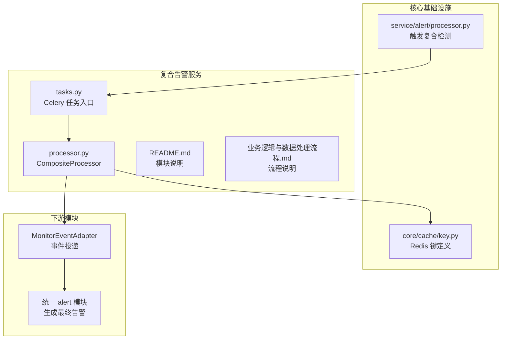
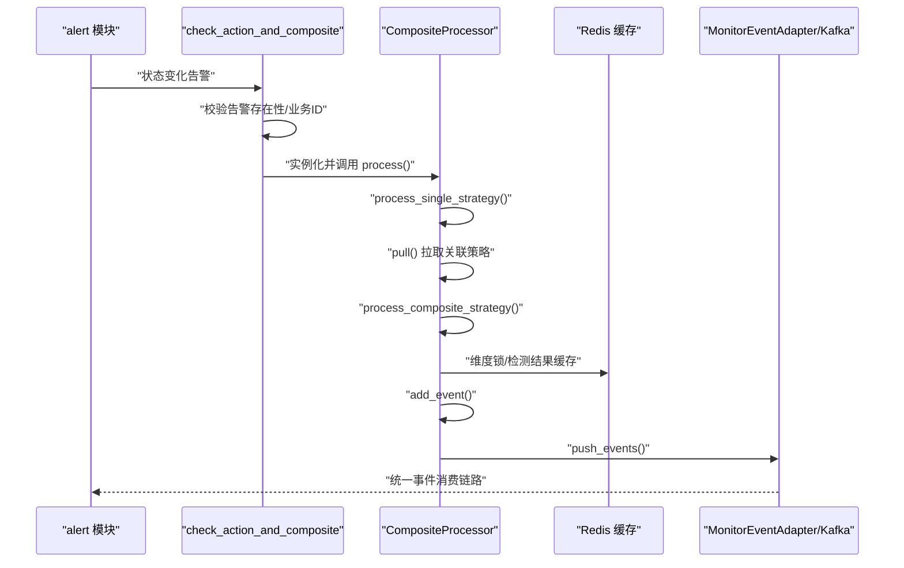
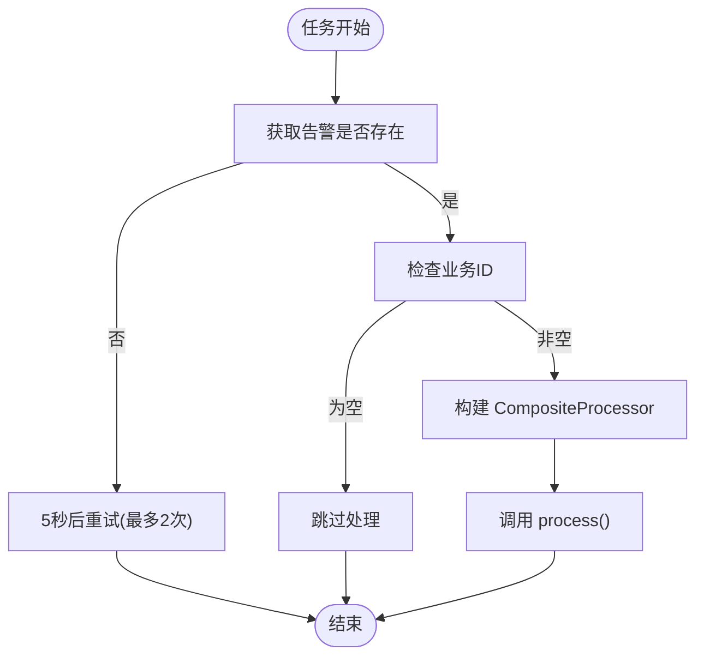
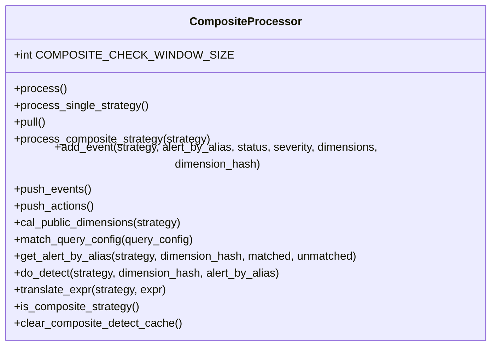
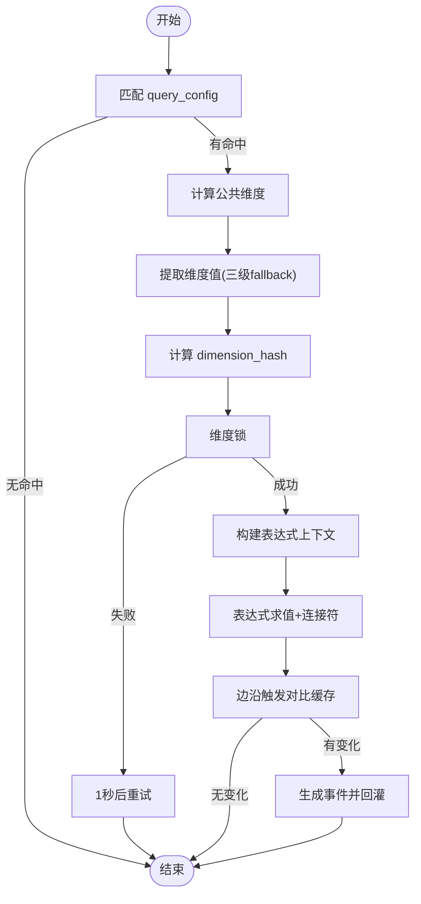
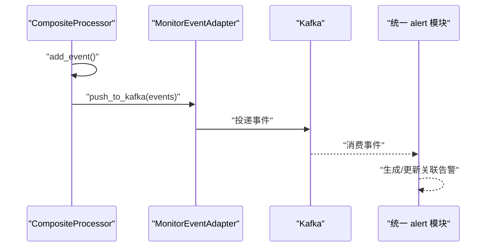
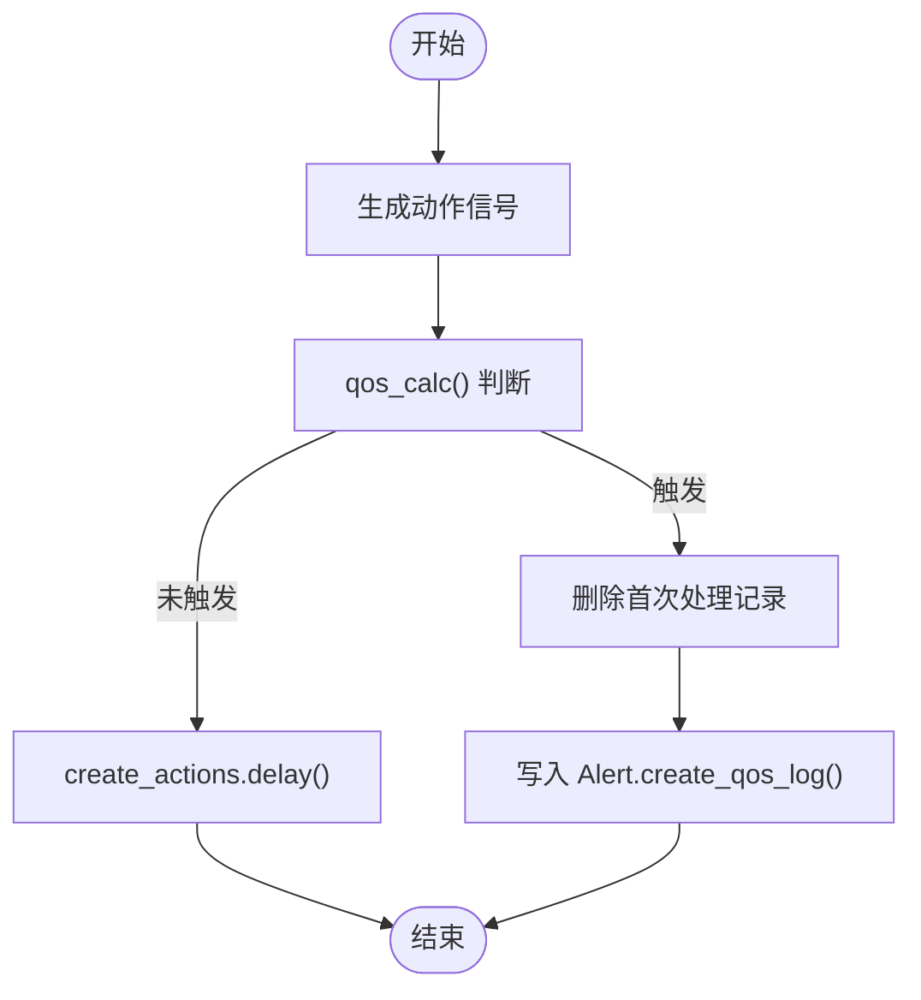
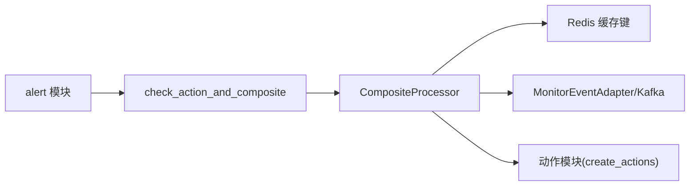

# 复合告警服务

<cite>
**本文引用的文件**
- [README.md](file://bkmonitor/alarm_backends/service/composite/README.md)
- [processor.py](file://bkmonitor/alarm_backends/service/composite/processor.py)
- [tasks.py](file://bkmonitor/alarm_backends/service/composite/tasks.py)
- [业务逻辑与数据处理流程.md](file://ai-docs/bk-monitor/docs/告警后台(alarm_backends)/modules/composite/业务逻辑与数据处理流程.md)
- [key.py](file://bkmonitor/alarm_backends/core/cache/key.py)
- [test_processor.py](file://bkmonitor/alarm_backends/tests/service/composite/test_processor.py)
- [alert_processor.py](file://bkmonitor/alarm_backends/service/alert/processor.py)
</cite>

## 目录
1. [简介](#简介)
2. [项目结构](#项目结构)
3. [核心组件](#核心组件)
4. [架构总览](#架构总览)
5. [详细组件分析](#详细组件分析)
6. [依赖分析](#依赖分析)
7. [性能考量](#性能考量)
8. [故障排查指南](#故障排查指南)
9. [结论](#结论)
10. [附录](#附录)

## 简介
复合告警服务是告警后台中的“关联策略处理模块”，其职责是对“已生成”的告警执行“关联策略检测”，当命中时生成新的“data_type=alert”的事件并回灌到统一事件入口，由统一 alert 模块继续生成最终的关联告警。复合告警服务不直接创建告警对象，而是专注于“判定是否应产出新的关联告警事件”。

## 项目结构
复合告警服务主要由以下文件构成：
- 任务入口：tasks.py
- 处理器：processor.py
- 模块说明：README.md
- 文档说明：业务逻辑与数据处理流程.md
- 缓存键定义：core/cache/key.py
- 单元测试：tests/service/composite/test_processor.py
- 与 alert 模块交互：service/alert/processor.py

**图表来源**
- [tasks.py:14-81](file://bkmonitor/alarm_backends/service/composite/tasks.py#L14-L81)
- [processor.py:46-767](file://bkmonitor/alarm_backends/service/composite/processor.py#L46-L767)
- [README.md:1-319](file://bkmonitor/alarm_backends/service/composite/README.md#L1-L319)
- [业务逻辑与数据处理流程.md:30-60](file://ai-docs/bk-monitor/docs/告警后台(alarm_backends)/modules/composite/业务逻辑与数据处理流程.md#L30-L60)
- [key.py:677-745](file://bkmonitor/alarm_backends/core/cache/key.py#L677-L745)
- [alert_processor.py:166-168](file://bkmonitor/alarm_backends/service/alert/processor.py#L166-L168)

**章节来源**
- [README.md:1-319](file://bkmonitor/alarm_backends/service/composite/README.md#L1-L319)
- [业务逻辑与数据处理流程.md:30-60](file://ai-docs/bk-monitor/docs/告警后台(alarm_backends)/modules/composite/业务逻辑与数据处理流程.md#L30-L60)

## 核心组件
- 任务入口：check_action_and_composite
  - 作用：接收来自 alert 模块的状态变化告警，完成基础校验后实例化处理器并执行完整流程。
  - 关键行为：告警未找到时 5 秒重试；无业务 ID 时跳过；异常时记录指标并上报。
- 处理器：CompositeProcessor
  - 作用：执行单告警动作信号检测与关联策略检测，生成事件并回灌到统一事件入口。
  - 关键流程：process() → process_single_strategy() + 关联策略检测 → add_event() + push_events()。
- 缓存与锁：COMPOSITE_* 相关键
  - 维度锁：避免同一 (strategy_id, dimension_hash) 并发重复处理
  - 检测结果缓存：记录表达式检测结果，用于边沿触发
  - 检测窗口：仅保留最近 1 小时内的异常告警参与表达式求值
- 事件与动作：add_event()/push_events() 与 push_actions()
  - 事件：统一事件格式，data_type=alert，包含 tags/dedupe_keys/extra_info 等
  - 动作：经 QOS 流控后投递到动作执行链路

**章节来源**
- [tasks.py:14-81](file://bkmonitor/alarm_backends/service/composite/tasks.py#L14-L81)
- [processor.py:46-767](file://bkmonitor/alarm_backends/service/composite/processor.py#L46-L767)
- [key.py:677-745](file://bkmonitor/alarm_backends/core/cache/key.py#L677-L745)

## 架构总览
复合告警服务的运行链路如下：
- alert 模块在告警状态变化时触发复合检测
- 复合任务入口获取告警并校验
- 处理器执行单告警动作信号检测与关联策略检测
- 命中时生成 data_type=alert 的事件并回灌到统一事件入口
- 统一 alert 模块消费事件并生成最终关联告警

**图表来源**
- [alert_processor.py:166-168](file://bkmonitor/alarm_backends/service/alert/processor.py#L166-L168)
- [tasks.py:36-72](file://bkmonitor/alarm_backends/service/composite/tasks.py#L36-L72)
- [processor.py:753-767](file://bkmonitor/alarm_backends/service/composite/processor.py#L753-L767)

## 详细组件分析

### 任务入口：check_action_and_composite
- 输入参数：alert_key、alert_status、composite_strategy_ids、retry_times
- 校验逻辑：告警不存在则 5 秒重试（最多 2 次）；无业务 ID 跳过
- 执行流程：实例化 CompositeProcessor 并调用 process()

**图表来源**
- [tasks.py:14-81](file://bkmonitor/alarm_backends/service/composite/tasks.py#L14-L81)

**章节来源**
- [tasks.py:14-81](file://bkmonitor/alarm_backends/service/composite/tasks.py#L14-L81)

### 处理器：CompositeProcessor
- 单告警动作信号检测：根据当前状态与缓存对比，生成动作信号（异常/恢复/关闭/确认/无数据等）
- 关联策略检测：
  - 匹配 query_config：支持两类输入告警（BK_FTA ALERT、BK_MONITOR_COLLECTOR ALERT）
  - 计算公共维度：取所有 query_config.agg_dimension 的交集
  - 维度提取：三级 fallback（origin_alarm → 顶层字段 → tags）
  - 维度哈希：count_md5(dimension_values)
  - 维度锁：避免并发重复生成
  - 表达式求值：按 detect.expression 与连接符计算，结合上一次缓存结果实现边沿触发
  - 事件生成：add_event()，回灌 push_events()

**图表来源**
- [processor.py:46-767](file://bkmonitor/alarm_backends/service/composite/processor.py#L46-L767)

**章节来源**
- [processor.py:46-767](file://bkmonitor/alarm_backends/service/composite/processor.py#L46-L767)

### 关联策略检测算法
- 匹配条件：is_valid_datasource() 识别两类输入告警
- 公共维度：cal_public_dimensions() 取交集，决定事件归并维度
- 表达式求值：parse_alert_expression() + AlertExpressionValue
- 边沿触发：do_detect() 对比缓存结果，仅在状态变化时产事件
- 检测窗口：get_alert_by_alias() 仅统计最近 1 小时内的异常告警

**图表来源**
- [processor.py:281-300](file://bkmonitor/alarm_backends/service/composite/processor.py#L281-L300)
- [processor.py:311-324](file://bkmonitor/alarm_backends/service/composite/processor.py#L311-L324)
- [processor.py:337-391](file://bkmonitor/alarm_backends/service/composite/processor.py#L337-L391)
- [processor.py:393-466](file://bkmonitor/alarm_backends/service/composite/processor.py#L393-L466)

**章节来源**
- [processor.py:281-300](file://bkmonitor/alarm_backends/service/composite/processor.py#L281-L300)
- [processor.py:311-324](file://bkmonitor/alarm_backends/service/composite/processor.py#L311-L324)
- [processor.py:337-391](file://bkmonitor/alarm_backends/service/composite/processor.py#L337-L391)
- [processor.py:393-466](file://bkmonitor/alarm_backends/service/composite/processor.py#L393-L466)

### 事件生成与输出格式
- 事件字段：event_id、plugin_id、strategy_id、alert_name、status、severity、data_type、tags、dedupe_keys、extra_info 等
- 事件回灌：MonitorEventAdapter.push_to_kafka()，统一事件入口
- 后续链路：统一 alert builder 生成最终关联告警

**图表来源**
- [processor.py:97-163](file://bkmonitor/alarm_backends/service/composite/processor.py#L97-L163)
- [processor.py:164-179](file://bkmonitor/alarm_backends/service/composite/processor.py#L164-L179)

**章节来源**
- [processor.py:97-163](file://bkmonitor/alarm_backends/service/composite/processor.py#L97-L163)
- [processor.py:164-179](file://bkmonitor/alarm_backends/service/composite/processor.py#L164-L179)

### 动作信号与 QOS 流控
- 动作信号：根据当前状态与缓存对比生成（异常/恢复/关闭/确认/无数据/升级）
- QOS 流控：push_actions() 调用 qos_calc()，触发时删除首次处理记录并写入 QOS 日志
- 指标：COMPOSITE_PUSH_ACTION_COUNT（含 is_qos 标记）

**图表来源**
- [processor.py:181-249](file://bkmonitor/alarm_backends/service/composite/processor.py#L181-L249)

**章节来源**
- [processor.py:181-249](file://bkmonitor/alarm_backends/service/composite/processor.py#L181-L249)

## 依赖分析
- 与 alert 模块的耦合：alert 模块在 send_signal() 中触发复合检测
- 与 MonitorEventAdapter 的耦合：统一事件投递
- 与缓存系统的耦合：维度锁、检测结果缓存、检测窗口、动作信号缓存等
- 与动作模块的耦合：create_actions.delay() 投递动作

**图表来源**
- [alert_processor.py:166-168](file://bkmonitor/alarm_backends/service/alert/processor.py#L166-L168)
- [tasks.py:64-72](file://bkmonitor/alarm_backends/service/composite/tasks.py#L64-L72)
- [processor.py:164-179](file://bkmonitor/alarm_backends/service/composite/processor.py#L164-L179)
- [key.py:677-745](file://bkmonitor/alarm_backends/core/cache/key.py#L677-L745)

**章节来源**
- [alert_processor.py:166-168](file://bkmonitor/alarm_backends/service/alert/processor.py#L166-L168)
- [tasks.py:64-72](file://bkmonitor/alarm_backends/service/composite/tasks.py#L64-L72)
- [processor.py:164-179](file://bkmonitor/alarm_backends/service/composite/processor.py#L164-L179)
- [key.py:677-745](file://bkmonitor/alarm_backends/core/cache/key.py#L677-L745)

## 性能考量
- 检测窗口：仅保留最近 1 小时内的异常告警，降低表达式求值成本
- 维度锁：避免同一维度并发重复处理，减少无效计算
- QOS 流控：限制动作信号发送频率，防止风暴
- 指标监控：COMPOSITE_PROCESS_TIME/COMPOSITE_PROCESS_COUNT/COMPOSITE_PUSH_EVENT_COUNT/COMPOSITE_PUSH_ACTION_COUNT，便于容量评估与异常定位
- 重试策略：告警未找到 5 秒重试，维度锁失败 1 秒重试，避免瞬时异常放大

**章节来源**
- [processor.py:47-48](file://bkmonitor/alarm_backends/service/composite/processor.py#L47-L48)
- [processor.py:505-600](file://bkmonitor/alarm_backends/service/composite/processor.py#L505-L600)
- [tasks.py:25-31](file://bkmonitor/alarm_backends/service/composite/tasks.py#L25-L31)
- [processor.py:181-249](file://bkmonitor/alarm_backends/service/composite/processor.py#L181-L249)

## 故障排查指南
- 常见日志关键字
  - 任务入口与重试：[composite] alert(...) begin、[composite] alert(...) not found、[composite] retry times exceed 2
  - 错误日志：[composite ERROR]
  - 动作信号：[composite send action]
  - QOS 触发：[action qos triggered]
  - 维度锁失败：[get service lock fail]
- 常见问题定位
  - 告警未找到：检查 alert_key 是否正确，确认重试次数上限
  - 无业务 ID：确认告警来源是否包含业务信息
  - 维度锁竞争：观察维度哈希分布与并发度，必要时调整维度粒度
  - 表达式求值异常：检查 detect.expression 与 alias 映射，关注 parse_alert_expression 的异常日志
  - QOS 导致动作未下发：检查 qos_calc() 返回值与首次处理记录键
- 单元测试参考
  - pull/push、公共维度计算、表达式连接符、关闭/恢复事件、单告警动作信号、QOS 流控等均有覆盖

**章节来源**
- [业务逻辑与数据处理流程.md:484-496](file://ai-docs/bk-monitor/docs/告警后台(alarm_backends)/modules/composite/业务逻辑与数据处理流程.md#L484-L496)
- [test_processor.py:162-211](file://bkmonitor/alarm_backends/tests/service/composite/test_processor.py#L162-L211)
- [test_processor.py:240-352](file://bkmonitor/alarm_backends/tests/service/composite/test_processor.py#L240-L352)
- [test_processor.py:400-447](file://bkmonitor/alarm_backends/tests/service/composite/test_processor.py#L400-L447)
- [test_processor.py:448-496](file://bkmonitor/alarm_backends/tests/service/composite/test_processor.py#L448-L496)
- [test_processor.py:497-764](file://bkmonitor/alarm_backends/tests/service/composite/test_processor.py#L497-L764)
- [test_processor.py:765-800](file://bkmonitor/alarm_backends/tests/service/composite/test_processor.py#L765-L800)

## 结论
复合告警服务通过“已生成告警 + 关联策略 + 边沿触发 + 维度锁 + QOS 流控”的组合，实现了高效、稳定、可扩展的复合告警检测与事件回灌。其核心价值在于将“关联策略检测”从统一 alert 模块中解耦，形成独立的事件生产模块，从而提升整体系统的可维护性与性能。

## 附录

### 规则配置要点
- query_config 匹配条件
  - BK_FTA ALERT：data_source_label=BK_FTA 且 data_type_label=ALERT 且 alert_name 一致
  - BK_MONITOR_COLLECTOR ALERT：data_source_label=BK_MONITOR_COLLECTOR 且 data_type_label=ALERT 且 bkmonitor_strategy_id 一致
- 公共维度
  - cal_public_dimensions() 取所有 query_config.agg_dimension 的交集，决定事件归并与去重
- 表达式与连接符
  - 支持 AND/OR 连接符，默认 AND；按级别聚合后判定
- 检测窗口
  - 仅统计最近 1 小时内的异常告警参与表达式求值

**章节来源**
- [processor.py:281-300](file://bkmonitor/alarm_backends/service/composite/processor.py#L281-L300)
- [processor.py:311-324](file://bkmonitor/alarm_backends/service/composite/processor.py#L311-L324)
- [processor.py:342-391](file://bkmonitor/alarm_backends/service/composite/processor.py#L342-L391)

### 实际应用场景
- 多数据源告警聚合：如拨测告警与主机采集告警共同触发复合告警
- 场景联动：不同场景下的策略组合触发更高严重级别的复合告警
- 事件收敛：通过公共维度与去重键，避免重复事件

**章节来源**
- [README.md:39-55](file://bkmonitor/alarm_backends/service/composite/README.md#L39-L55)
- [业务逻辑与数据处理流程.md:98-114](file://ai-docs/bk-monitor/docs/告警后台(alarm_backends)/modules/composite/业务逻辑与数据处理流程.md#L98-L114)

### 调试方法
- 关注日志关键字：composite、action qos triggered、get service lock fail
- 使用单元测试用例验证表达式连接符、关闭/恢复事件、单告警动作信号、QOS 流控等
- 指标观测：COMPOSITE_PROCESS_TIME、COMPOSITE_PUSH_EVENT_COUNT、COMPOSITE_PUSH_ACTION_COUNT

**章节来源**
- [业务逻辑与数据处理流程.md:470-481](file://ai-docs/bk-monitor/docs/告警后台(alarm_backends)/modules/composite/业务逻辑与数据处理流程.md#L470-L481)
- [test_processor.py:162-211](file://bkmonitor/alarm_backends/tests/service/composite/test_processor.py#L162-L211)
- [test_processor.py:400-447](file://bkmonitor/alarm_backends/tests/service/composite/test_processor.py#L400-L447)
- [test_processor.py:448-496](file://bkmonitor/alarm_backends/tests/service/composite/test_processor.py#L448-L496)
- [test_processor.py:497-764](file://bkmonitor/alarm_backends/tests/service/composite/test_processor.py#L497-L764)
- [test_processor.py:765-800](file://bkmonitor/alarm_backends/tests/service/composite/test_processor.py#L765-L800)