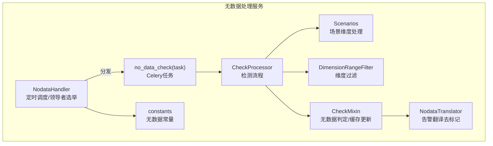
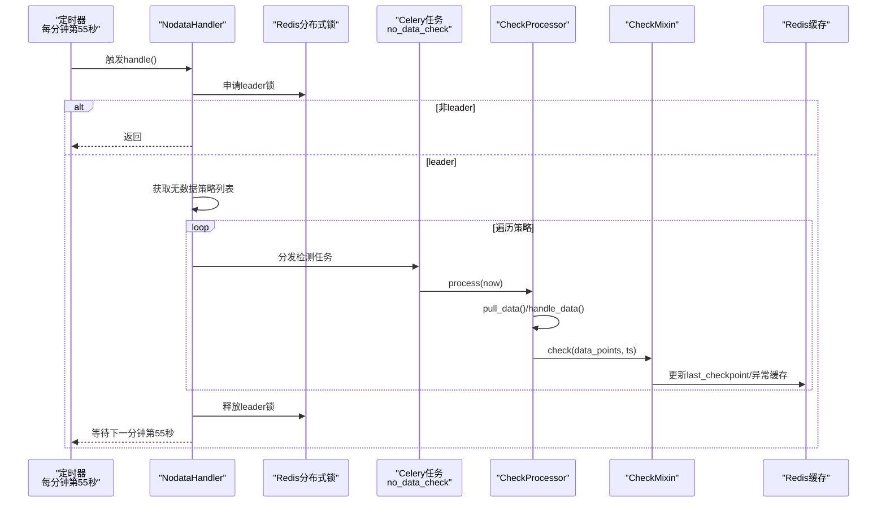
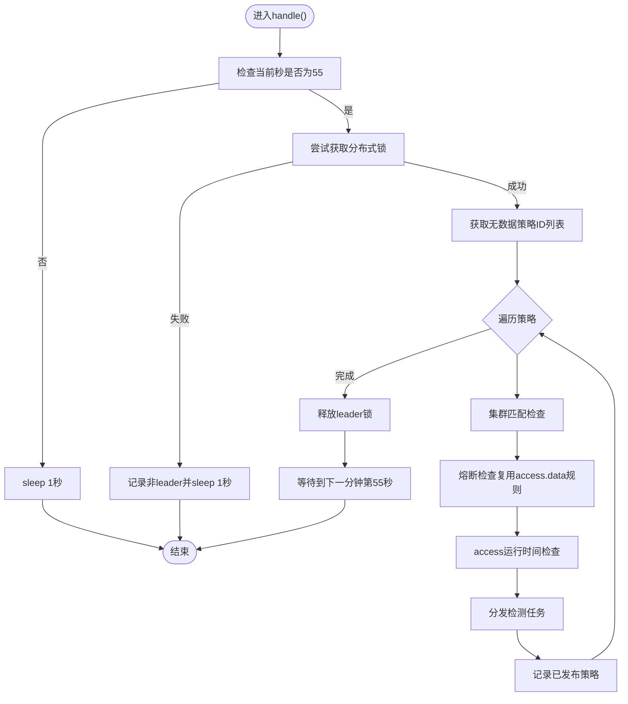
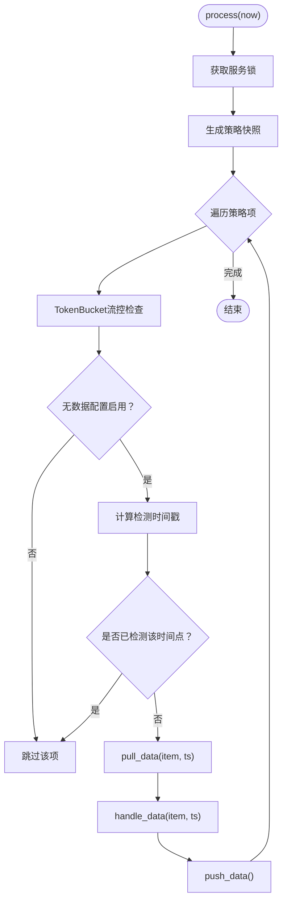
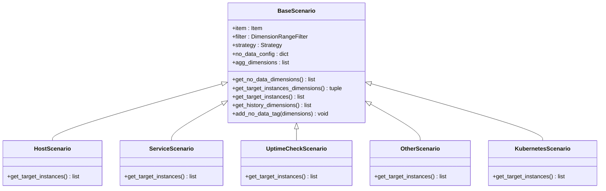
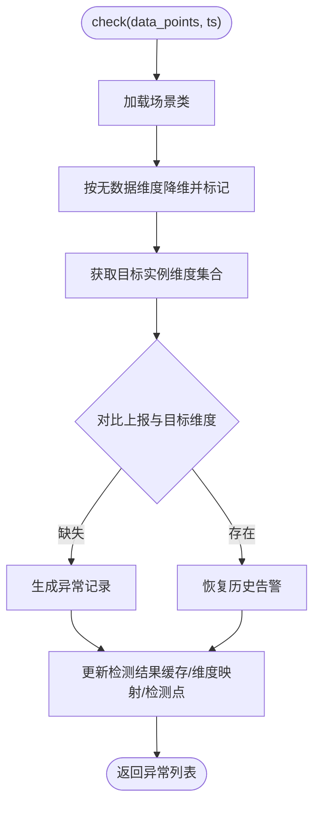
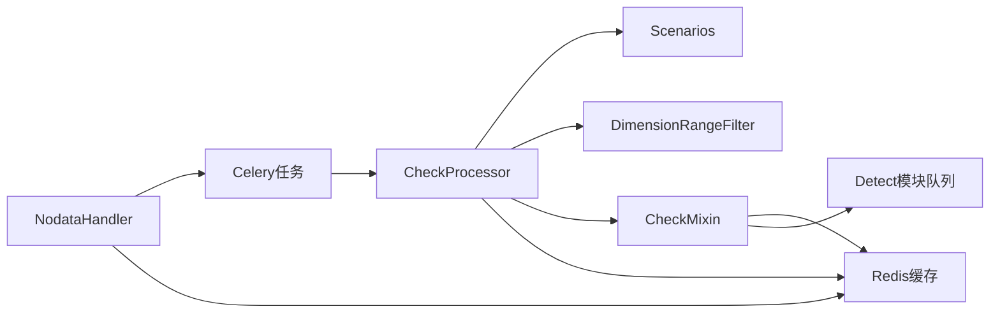

# 无数据处理服务

<cite>
**本文引用的文件**
- [bkmonitor/alarm_backends/service/nodata/handler.py](file://bkmonitor/alarm_backends/service/nodata/handler.py)
- [bkmonitor/alarm_backends/service/nodata/processor.py](file://bkmonitor/alarm_backends/service/nodata/processor.py)
- [bkmonitor/alarm_backends/service/nodata/tasks.py](file://bkmonitor/alarm_backends/service/nodata/tasks.py)
- [bkmonitor/alarm_backends/service/nodata/scenarios/base.py](file://bkmonitor/alarm_backends/service/nodata/scenarios/base.py)
- [bkmonitor/alarm_backends/service/nodata/scenarios/filters.py](file://bkmonitor/alarm_backends/service/nodata/scenarios/filters.py)
- [bkmonitor/alarm_backends/core/control/mixins/nodata.py](file://bkmonitor/alarm_backends/core/control/mixins/nodata.py)
- [bkmonitor/alarm_backends/constants.py](file://bkmonitor/alarm_backends/constants.py)
- [bkmonitor/alarm_backends/service/alert/enricher/translator/nodata.py](file://bkmonitor/alarm_backends/service/alert/enricher/translator/nodata.py)
- [ai-docs/bk-monitor/docs/告警后台(alarm_backends)/modules/nodata/业务逻辑与数据处理流程.md](file://ai-docs/bk-monitor/docs/告警后台(alarm_backends)/modules/nodata/业务逻辑与数据处理流程.md)
</cite>

## 目录
1. [简介](#简介)
2. [项目结构](#项目结构)
3. [核心组件](#核心组件)
4. [架构总览](#架构总览)
5. [详细组件分析](#详细组件分析)
6. [依赖分析](#依赖分析)
7. [性能考虑](#性能考虑)
8. [故障排查指南](#故障排查指南)
9. [结论](#结论)
10. [附录](#附录)

## 简介
本技术文档围绕“无数据处理服务”展开，系统性阐述无数据告警的检测机制、场景处理与任务调度逻辑。内容覆盖：
- 无数据检测规则与配置项
- 场景类型分类与维度处理
- 告警触发条件与异常恢复机制
- 任务调度策略与分布式锁竞争
- 异常与熔断处理、性能监控指标
- 实际应用场景、配置示例与故障排查方法

## 项目结构
无数据处理服务位于 alarm_backends 子系统中，主要由以下模块组成：
- handler：定时调度与领导者选举，驱动无数据检测
- processor：具体检测流程（拉取数据、判定、推送）
- tasks：Celery 异步任务封装
- scenarios：场景化维度处理（主机、服务实例、UptimeCheck、默认等）
- filters：维度范围过滤
- core/control/mixins/nodata：无数据判定的核心算法与缓存更新
- alert/enricher/translator/nodata：告警翻译阶段去除无数据标记维度
- constants：无数据相关常量（等级、标签、值等）

图示来源
- [bkmonitor/alarm_backends/service/nodata/handler.py:30-153](file://bkmonitor/alarm_backends/service/nodata/handler.py#L30-L153)
- [bkmonitor/alarm_backends/service/nodata/processor.py:31-224](file://bkmonitor/alarm_backends/service/nodata/processor.py#L31-L224)
- [bkmonitor/alarm_backends/service/nodata/tasks.py:24-47](file://bkmonitor/alarm_backends/service/nodata/tasks.py#L24-L47)
- [bkmonitor/alarm_backends/service/nodata/scenarios/base.py:35-276](file://bkmonitor/alarm_backends/service/nodata/scenarios/base.py#L35-L276)
- [bkmonitor/alarm_backends/service/nodata/scenarios/filters.py:20-46](file://bkmonitor/alarm_backends/service/nodata/scenarios/filters.py#L20-L46)
- [bkmonitor/alarm_backends/core/control/mixins/nodata.py:33-355](file://bkmonitor/alarm_backends/core/control/mixins/nodata.py#L33-L355)
- [bkmonitor/alarm_backends/service/alert/enricher/translator/nodata.py:17-28](file://bkmonitor/alarm_backends/service/alert/enricher/translator/nodata.py#L17-L28)
- [bkmonitor/alarm_backends/constants.py:58-71](file://bkmonitor/alarm_backends/constants.py#L58-L71)

章节来源
- [bkmonitor/alarm_backends/service/nodata/handler.py:11-153](file://bkmonitor/alarm_backends/service/nodata/handler.py#L11-L153)
- [bkmonitor/alarm_backends/service/nodata/processor.py:11-224](file://bkmonitor/alarm_backends/service/nodata/processor.py#L11-L224)
- [bkmonitor/alarm_backends/service/nodata/tasks.py:11-47](file://bkmonitor/alarm_backends/service/nodata/tasks.py#L11-L47)
- [bkmonitor/alarm_backends/service/nodata/scenarios/base.py:11-276](file://bkmonitor/alarm_backends/service/nodata/scenarios/base.py#L11-L276)
- [bkmonitor/alarm_backends/service/nodata/scenarios/filters.py:11-46](file://bkmonitor/alarm_backends/service/nodata/scenarios/filters.py#L11-L46)
- [bkmonitor/alarm_backends/core/control/mixins/nodata.py:11-355](file://bkmonitor/alarm_backends/core/control/mixins/nodata.py#L11-L355)
- [bkmonitor/alarm_backends/constants.py:11-81](file://bkmonitor/alarm_backends/constants.py#L11-L81)
- [bkmonitor/alarm_backends/service/alert/enricher/translator/nodata.py:11-28](file://bkmonitor/alarm_backends/service/alert/enricher/translator/nodata.py#L11-L28)
- [ai-docs/bk-monitor/docs/告警后台(alarm_backends)/modules/nodata/业务逻辑与数据处理流程.md](file://ai-docs/bk-monitor/docs/告警后台(alarm_backends)/modules/nodata/业务逻辑与数据处理流程.md#L1-L311)

## 核心组件
- 定时调度与领导者选举：每分钟固定时间点触发，使用分布式锁确保单点执行，避免重复检测。
- 检测处理器：负责从队列拉取数据、按周期判定、生成异常并推送。
- Celery 任务：异步执行检测，便于横向扩展与资源隔离。
- 场景化维度处理：根据策略场景（主机、服务实例、UptimeCheck、默认）确定待检测维度集合。
- 维度过滤：基于聚合条件与额外内置条件过滤历史维度，避免误报。
- 核心判定与缓存：计算无数据周期、异常周期，维护检测点与维度缓存，支持恢复检测。
- 告警翻译：在告警输出前移除无数据标记维度，提升可读性。

章节来源
- [bkmonitor/alarm_backends/service/nodata/handler.py:25-153](file://bkmonitor/alarm_backends/service/nodata/handler.py#L25-L153)
- [bkmonitor/alarm_backends/service/nodata/processor.py:31-224](file://bkmonitor/alarm_backends/service/nodata/processor.py#L31-L224)
- [bkmonitor/alarm_backends/service/nodata/tasks.py:24-47](file://bkmonitor/alarm_backends/service/nodata/tasks.py#L24-L47)
- [bkmonitor/alarm_backends/service/nodata/scenarios/base.py:35-276](file://bkmonitor/alarm_backends/service/nodata/scenarios/base.py#L35-L276)
- [bkmonitor/alarm_backends/service/nodata/scenarios/filters.py:20-46](file://bkmonitor/alarm_backends/service/nodata/scenarios/filters.py#L20-L46)
- [bkmonitor/alarm_backends/core/control/mixins/nodata.py:33-355](file://bkmonitor/alarm_backends/core/control/mixins/nodata.py#L33-L355)
- [bkmonitor/alarm_backends/service/alert/enricher/translator/nodata.py:17-28](file://bkmonitor/alarm_backends/service/alert/enricher/translator/nodata.py#L17-L28)

## 架构总览
无数据处理服务采用“定时触发 + 分布式领导者 + 异步任务 + 场景化判定”的架构，确保在大规模策略与多集群环境下稳定运行。

图示来源
- [bkmonitor/alarm_backends/service/nodata/handler.py:30-153](file://bkmonitor/alarm_backends/service/nodata/handler.py#L30-L153)
- [bkmonitor/alarm_backends/service/nodata/tasks.py:24-47](file://bkmonitor/alarm_backends/service/nodata/tasks.py#L24-L47)
- [bkmonitor/alarm_backends/service/nodata/processor.py:166-224](file://bkmonitor/alarm_backends/service/nodata/processor.py#L166-L224)
- [bkmonitor/alarm_backends/core/control/mixins/nodata.py:57-146](file://bkmonitor/alarm_backends/core/control/mixins/nodata.py#L57-L146)

## 详细组件分析

### 组件一：定时调度与领导者选举（NodataHandler）
- 固定执行时间：每分钟第55秒，确保检测两个周期前的 access 数据，避免与入库延迟冲突。
- 领导者选举：使用分布式锁，仅允许一个节点执行检测，防止重复执行。
- 策略筛选：仅处理当前集群内的策略；支持熔断检查（复用 access.data 规则）；检查 access 最后运行时间，避免长时间未运行导致误报。
- 任务分发：同步或异步（Celery）两种方式，后者适合大规模场景。

图示来源
- [bkmonitor/alarm_backends/service/nodata/handler.py:30-153](file://bkmonitor/alarm_backends/service/nodata/handler.py#L30-L153)

章节来源
- [bkmonitor/alarm_backends/service/nodata/handler.py:25-153](file://bkmonitor/alarm_backends/service/nodata/handler.py#L25-L153)
- [ai-docs/bk-monitor/docs/告警后台(alarm_backends)/modules/nodata/业务逻辑与数据处理流程.md](file://ai-docs/bk-monitor/docs/告警后台(alarm_backends)/modules/nodata/业务逻辑与数据处理流程.md#L46-L93)

### 组件二：检测流程（CheckProcessor）
- 数据拉取（pull_data）：从 Redis 队列读取待检测数据，仅保留检测时间点之前的记录；若当前周期无数据但未来有数据，则取最早未来周期数据用于恢复检测；其余数据推回队列等待后续检测。
- 数据处理（handle_data）：调用 Item 的 check 方法，结合场景维度与历史维度，生成异常记录或恢复记录。
- 结果推送（push_data）：将异常数据写入检测结果缓存与异常列表，触发异常信号。
- 流控与重复检测：基于 TokenBucket 与 last_checkpoint 缓存避免过度检测与重复检测。

图示来源
- [bkmonitor/alarm_backends/service/nodata/processor.py:166-224](file://bkmonitor/alarm_backends/service/nodata/processor.py#L166-L224)

章节来源
- [bkmonitor/alarm_backends/service/nodata/processor.py:31-224](file://bkmonitor/alarm_backends/service/nodata/processor.py#L31-L224)
- [ai-docs/bk-monitor/docs/告警后台(alarm_backends)/modules/nodata/业务逻辑与数据处理流程.md](file://ai-docs/bk-monitor/docs/告警后台(alarm_backends)/modules/nodata/业务逻辑与数据处理流程.md#L94-L221)

### 组件三：场景化维度处理（BaseScenario 及子类）
- 维度来源：从策略目标与历史维度中提取待检测集合。
- 过滤逻辑：基于聚合条件与额外内置条件过滤历史维度，避免误报。
- 场景类型：
  - 主机场景：支持静态IP、动态拓扑、动态分组三种目标配置。
  - 服务场景：支持服务实例与实例ID两种目标配置。
  - UptimeCheck/Other/Kubernetes：默认不参与维度检测。

图示来源
- [bkmonitor/alarm_backends/service/nodata/scenarios/base.py:35-276](file://bkmonitor/alarm_backends/service/nodata/scenarios/base.py#L35-L276)
- [bkmonitor/alarm_backends/service/nodata/scenarios/filters.py:20-46](file://bkmonitor/alarm_backends/service/nodata/scenarios/filters.py#L20-L46)

章节来源
- [bkmonitor/alarm_backends/service/nodata/scenarios/base.py:35-276](file://bkmonitor/alarm_backends/service/nodata/scenarios/base.py#L35-L276)
- [bkmonitor/alarm_backends/service/nodata/scenarios/filters.py:20-46](file://bkmonitor/alarm_backends/service/nodata/scenarios/filters.py#L20-L46)

### 组件四：无数据判定与缓存更新（CheckMixin）
- 维度降维：按无数据维度对上报数据进行降维，并打上无数据标记。
- 历史维度对比：获取目标实例维度与历史维度集合，对比缺失维度生成异常或恢复记录。
- 周期计算：计算无数据周期与异常周期，用于异常消息与去重。
- 缓存更新：维护检测结果缓存、上次异常时刻、上次检测点与维度映射，支持恢复检测。

图示来源
- [bkmonitor/alarm_backends/core/control/mixins/nodata.py:57-355](file://bkmonitor/alarm_backends/core/control/mixins/nodata.py#L57-L355)

章节来源
- [bkmonitor/alarm_backends/core/control/mixins/nodata.py:33-355](file://bkmonitor/alarm_backends/core/control/mixins/nodata.py#L33-L355)

### 组件五：告警翻译（NodataTranslator）
- 在告警输出阶段移除无数据标记维度，保证告警展示简洁清晰。

章节来源
- [bkmonitor/alarm_backends/service/alert/enricher/translator/nodata.py:17-28](file://bkmonitor/alarm_backends/service/alert/enricher/translator/nodata.py#L17-L28)

## 依赖分析
- 外部依赖
  - Redis：分布式锁、检测点缓存、维度映射、异常列表与信号队列。
  - Celery：异步任务执行，支持水平扩展。
  - Prometheus：无数据处理过程的指标埋点。
- 内部依赖
  - Strategy/Item：策略与监控项配置、查询配置、聚合维度。
  - Access 模块：运行时间检查与熔断规则复用。
  - Detect 模块：异常数据与信号队列共享。

图示来源
- [bkmonitor/alarm_backends/service/nodata/handler.py:30-153](file://bkmonitor/alarm_backends/service/nodata/handler.py#L30-L153)
- [bkmonitor/alarm_backends/service/nodata/processor.py:166-224](file://bkmonitor/alarm_backends/service/nodata/processor.py#L166-L224)
- [bkmonitor/alarm_backends/core/control/mixins/nodata.py:298-346](file://bkmonitor/alarm_backends/core/control/mixins/nodata.py#L298-L346)

章节来源
- [bkmonitor/alarm_backends/service/nodata/handler.py:11-153](file://bkmonitor/alarm_backends/service/nodata/handler.py#L11-L153)
- [bkmonitor/alarm_backends/service/nodata/processor.py:11-224](file://bkmonitor/alarm_backends/service/nodata/processor.py#L11-L224)
- [bkmonitor/alarm_backends/core/control/mixins/nodata.py:11-355](file://bkmonitor/alarm_backends/core/control/mixins/nodata.py#L11-L355)

## 性能考虑
- 固定时间点执行：每分钟第55秒，避免与入库延迟冲突，降低重复检测概率。
- 分布式锁：单点领导者执行，避免多节点重复工作。
- 流控：TokenBucket 控制检测频率，防止过载。
- 异步任务：Celery 任务解耦，支持横向扩展。
- 缓存命中：Redis 缓存检测点与维度映射，减少重复计算。
- 指标监控：Prometheus 指标记录处理耗时与计数，便于容量评估与优化。

## 故障排查指南
- 无数据检测未触发
  - 检查是否到达每分钟第55秒；确认领导者选举是否成功。
  - 检查策略是否属于当前集群；确认无数据配置是否启用。
  - 检查 access 运行时间是否过期（超过2倍检测周期）。
- 误报或漏报
  - 确认熔断规则是否生效；检查维度过滤是否正确。
  - 检查 TokenBucket 是否阻塞；确认 last_checkpoint 是否重复检测。
- 异常恢复不及时
  - 检查未来数据处理逻辑是否正常；确认异常缓存与维度映射是否更新。
- Celery 任务异常
  - 查看任务日志与指标；确认锁超时与异常处理分支。

章节来源
- [bkmonitor/alarm_backends/service/nodata/handler.py:107-139](file://bkmonitor/alarm_backends/service/nodata/handler.py#L107-L139)
- [bkmonitor/alarm_backends/service/nodata/processor.py:176-223](file://bkmonitor/alarm_backends/service/nodata/processor.py#L176-L223)
- [bkmonitor/alarm_backends/core/control/mixins/nodata.py:348-355](file://bkmonitor/alarm_backends/core/control/mixins/nodata.py#L348-L355)

## 结论
无数据处理服务通过“定时固定点 + 分布式领导者 + 异步任务 + 场景化维度 + 缓存与熔断”的组合，实现了稳定、可扩展的无数据告警能力。其核心优势在于：
- 明确的检测时间点与周期推进，避免误报与漏报
- 分布式锁与熔断规则保障系统稳定性
- 场景化维度处理与历史维度对比提升准确性
- 异步任务与流控支持大规模扩展

## 附录

### 无数据检测规则配置
- 策略项配置
  - is_enabled：是否启用无数据告警
  - continuous：连续周期阈值
  - agg_dimension：无数据维度集合
  - no_data_level：告警等级（默认等级常量）
- 周期与时间
  - 检测时间点：(now // agg_interval) * agg_interval - agg_interval
  - 执行时间：每分钟第55秒
- 熔断与流控
  - 熔断：复用 access.data 的熔断规则（支持多维度配置）
  - 流控：TokenBucket（按 query_md5 分桶）

章节来源
- [bkmonitor/alarm_backends/service/nodata/scenarios/base.py:43-48](file://bkmonitor/alarm_backends/service/nodata/scenarios/base.py#L43-L48)
- [bkmonitor/alarm_backends/service/nodata/processor.py:185-189](file://bkmonitor/alarm_backends/service/nodata/processor.py#L185-L189)
- [bkmonitor/alarm_backends/constants.py:60-71](file://bkmonitor/alarm_backends/constants.py#L60-L71)
- [ai-docs/bk-monitor/docs/告警后台(alarm_backends)/modules/nodata/业务逻辑与数据处理流程.md](file://ai-docs/bk-monitor/docs/告警后台(alarm_backends)/modules/nodata/业务逻辑与数据处理流程.md#L241-L247)

### 场景类型分类
- 主机场景：静态IP、动态拓扑、动态分组
- 服务场景：服务实例ID、实例ID
- 其他场景：UptimeCheck、Other、Kubernetes 默认不参与维度检测

章节来源
- [bkmonitor/alarm_backends/service/nodata/scenarios/base.py:160-276](file://bkmonitor/alarm_backends/service/nodata/scenarios/base.py#L160-L276)

### 告警触发条件
- 策略启用无数据告警
- 检测周期内无上报数据或上报时间早于上次检测点
- 目标实例维度缺失或不在业务范围内
- 未被熔断与流控阻断

章节来源
- [bkmonitor/alarm_backends/core/control/mixins/nodata.py:108-124](file://bkmonitor/alarm_backends/core/control/mixins/nodata.py#L108-L124)

### 性能监控指标
- NODATA_PROCESS_PULL_DATA_COUNT：拉取数据量
- NODATA_PROCESS_PUSH_DATA_COUNT：推送数据量
- NODATA_PROCESS_TIME：处理耗时分布
- NODATA_PROCESS_COUNT：处理次数与状态统计

章节来源
- [bkmonitor/alarm_backends/service/nodata/processor.py:75-162](file://bkmonitor/alarm_backends/service/nodata/processor.py#L75-L162)
- [bkmonitor/alarm_backends/service/nodata/tasks.py:42-46](file://bkmonitor/alarm_backends/service/nodata/tasks.py#L42-L46)

### 实际应用场景
- 业务指标长时间无上报：如采集器停止、网络中断、探针异常
- 监控目标变更：如主机下线、服务实例减少，需通过历史维度过滤与缺失目标实例检测及时发现
- 数据入库延迟：通过检测时间点前推一个周期与未来数据处理，提升恢复检测的及时性

章节来源
- [ai-docs/bk-monitor/docs/告警后台(alarm_backends)/modules/nodata/业务逻辑与数据处理流程.md](file://ai-docs/bk-monitor/docs/告警后台(alarm_backends)/modules/nodata/业务逻辑与数据处理流程.md#L1-L311)