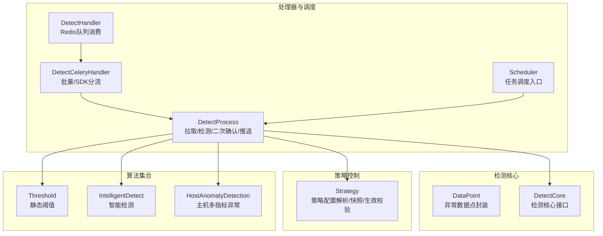
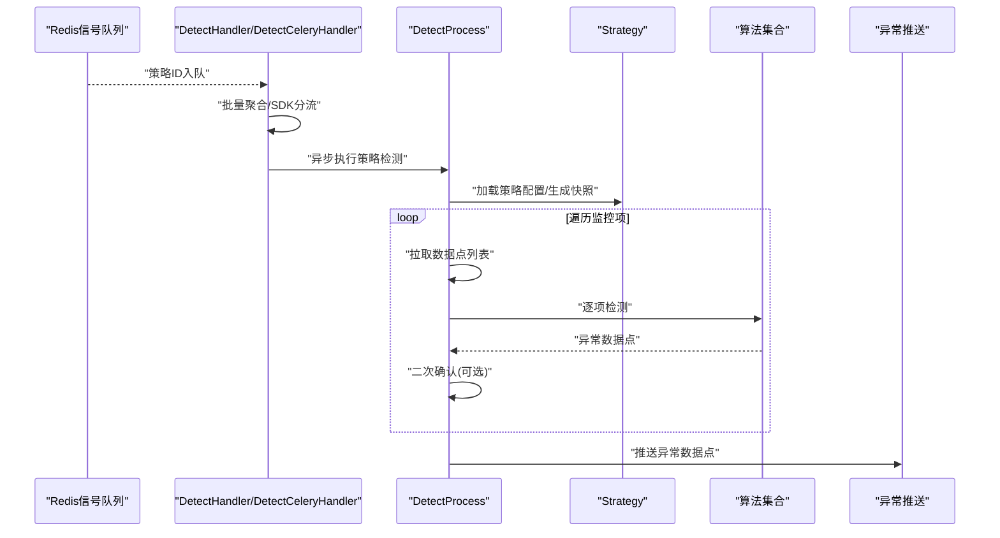
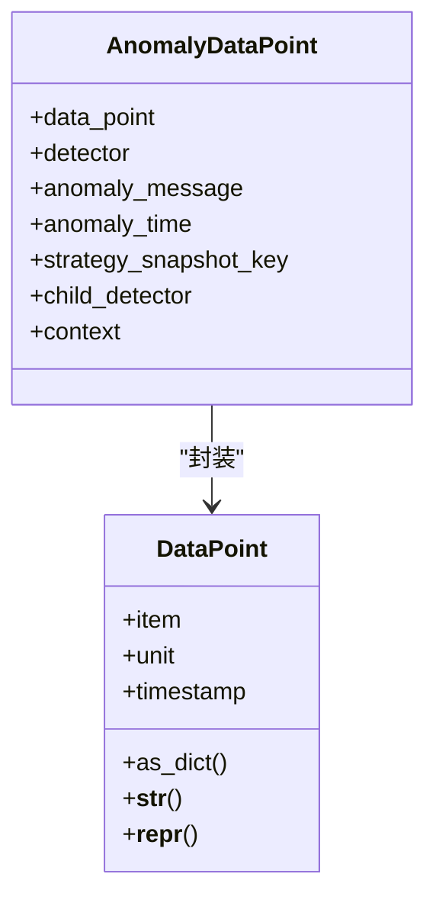
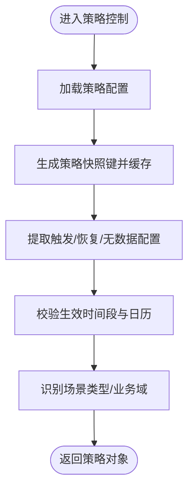
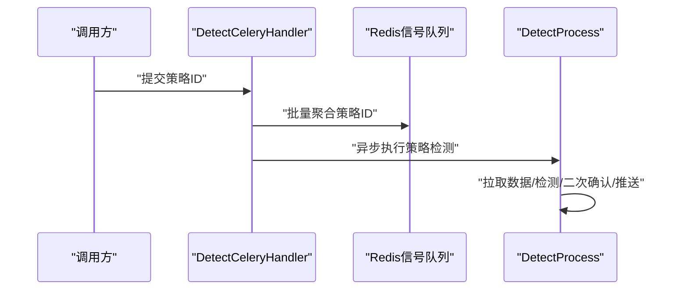
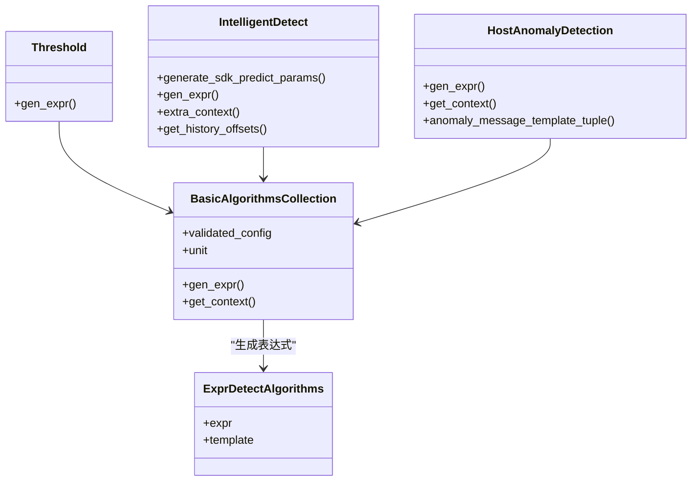
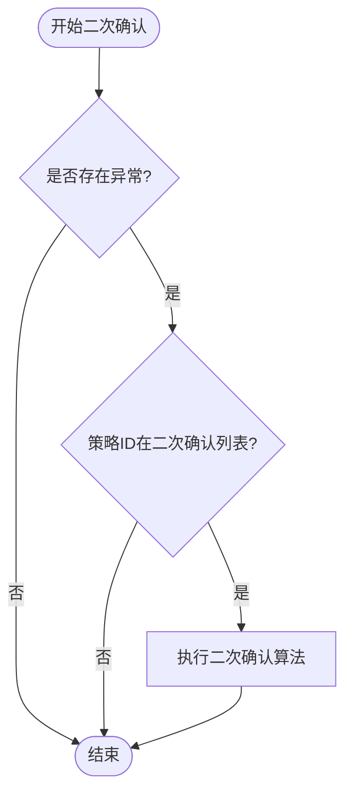
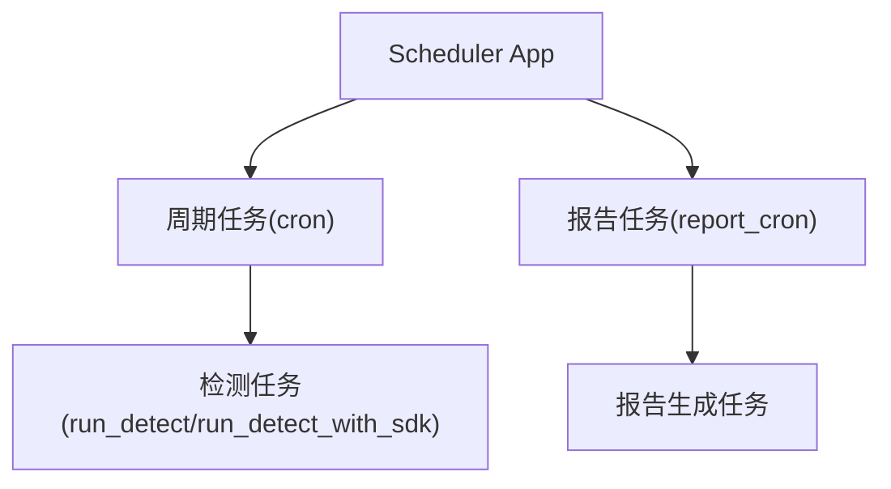
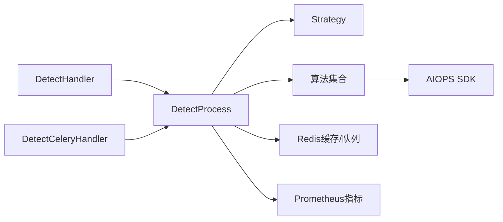

# 检测策略服务

<cite>
**本文引用的文件**
- [bkmonitor/alarm_backends/service/detect/__init__.py](file://bkmonitor/alarm_backends/service/detect/__init__.py)
- [bkmonitor/alarm_backends/service/detect/core.py](file://bkmonitor/alarm_backends/service/detect/core.py)
- [bkmonitor/alarm_backends/service/detect/handler.py](file://bkmonitor/alarm_backends/service/detect/handler.py)
- [bkmonitor/alarm_backends/service/detect/process.py](file://bkmonitor/alarm_backends/service/detect/process.py)
- [bkmonitor/alarm_backends/core/control/strategy.py](file://bkmonitor/alarm_backends/core/control/strategy.py)
- [bkmonitor/alarm_backends/service/detect/strategy/threshold.py](file://bkmonitor/alarm_backends/service/detect/strategy/threshold.py)
- [bkmonitor/alarm_backends/service/detect/strategy/intelligent_detect.py](file://bkmonitor/alarm_backends/service/detect/strategy/intelligent_detect.py)
- [bkmonitor/alarm_backends/service/detect/strategy/host_anomaly_detection.py](file://bkmonitor/alarm_backends/service/detect/strategy/host_anomaly_detection.py)
- [bkmonitor/alarm_backends/service/scheduler/app.py](file://bkmonitor/alarm_backends/service/scheduler/app.py)
- [bkmonitor/alarm_backends/service/scheduler/tasks/cron.py](file://bkmonitor/alarm_backends/service/scheduler/tasks/cron.py)
- [bkmonitor/alarm_backends/service/scheduler/tasks/report_cron.py](file://bkmonitor/alarm_backends/service/scheduler/tasks/report_cron.py)
- [bkmonitor/alarm_backends/service/detect/double_check_strategies/sum.py](file://bkmonitor/alarm_backends/service/detect/double_check_strategies/sum.py)
</cite>

## 目录
1. [简介](#简介)
2. [项目结构](#项目结构)
3. [核心组件](#核心组件)
4. [架构总览](#架构总览)
5. [组件详细分析](#组件详细分析)
6. [依赖关系分析](#依赖关系分析)
7. [性能考量](#性能考量)
8. [故障排查指南](#故障排查指南)
9. [结论](#结论)
10. [附录](#附录)

## 简介
本技术文档围绕“检测策略服务”展开，系统性阐述检测策略的执行机制、双重检查逻辑、策略管理流程，以及策略处理器的算法实现、检测核心的判断逻辑、处理流程的控制机制与任务调度策略。文档还覆盖策略配置语法要点、检测算法选择、双重检查机制与性能优化方法，并提供可落地的应用案例、配置示例与调试技巧，帮助开发者设计与实现高效稳定的告警检测系统。

## 项目结构
检测策略服务主要由以下层次构成：
- 检测核心与数据模型：定义数据点抽象与异常数据点封装，支撑后续检测与输出。
- 策略控制与管理：解析策略配置、生成触发/恢复窗口、快照缓存与生效时间校验。
- 策略处理器与调度：负责从信号队列拉取策略、批量聚合、调用检测算法、二次确认与异常推送。
- 算法集合与具体算法：提供阈值、智能检测、主机多指标异常等算法表达式与上下文扩展。
- 调度器与定时任务：统一的任务调度入口与周期性任务编排。

图表来源
- [bkmonitor/alarm_backends/service/detect/core.py:17-68](file://bkmonitor/alarm_backends/service/detect/core.py#L17-L68)
- [bkmonitor/alarm_backends/core/control/strategy.py:33-384](file://bkmonitor/alarm_backends/core/control/strategy.py#L33-L384)
- [bkmonitor/alarm_backends/service/detect/handler.py:26-89](file://bkmonitor/alarm_backends/service/detect/handler.py#L26-L89)
- [bkmonitor/alarm_backends/service/detect/process.py:29-188](file://bkmonitor/alarm_backends/service/detect/process.py#L29-L188)
- [bkmonitor/alarm_backends/service/detect/strategy/threshold.py:36-69](file://bkmonitor/alarm_backends/service/detect/strategy/threshold.py#L36-L69)
- [bkmonitor/alarm_backends/service/detect/strategy/intelligent_detect.py:37-110](file://bkmonitor/alarm_backends/service/detect/strategy/intelligent_detect.py#L37-L110)
- [bkmonitor/alarm_backends/service/detect/strategy/host_anomaly_detection.py:29-49](file://bkmonitor/alarm_backends/service/detect/strategy/host_anomaly_detection.py#L29-L49)
- [bkmonitor/alarm_backends/service/scheduler/app.py](file://bkmonitor/alarm_backends/service/scheduler/app.py)

章节来源
- [bkmonitor/alarm_backends/service/detect/__init__.py:12-14](file://bkmonitor/alarm_backends/service/detect/__init__.py#L12-L14)
- [bkmonitor/alarm_backends/service/detect/core.py:17-68](file://bkmonitor/alarm_backends/service/detect/core.py#L17-L68)
- [bkmonitor/alarm_backends/core/control/strategy.py:33-384](file://bkmonitor/alarm_backends/core/control/strategy.py#L33-L384)

## 核心组件
- 数据点模型
  - DataPoint：对上游接入数据进行轻量封装，暴露统一字段（如数值、时间戳、单位），并兼容多指标场景下的单位处理。
  - AnomalyDataPoint：检测后异常数据点的载体，承载异常消息、异常时间、策略快照键、子检测器与上下文等。
- 策略控制
  - Strategy：负责解析策略配置、计算最小聚合周期、判定生效时间、生成策略快照、提取触发/恢复/无数据配置等；支持场景类型识别（服务/主机）与优先级组键。
- 处理器
  - DetectHandler/DetectCeleryHandler：从Redis信号队列拉取策略ID，支持阻塞/非阻塞与批量聚合；根据策略配置决定是否走AIOPS SDK路径。
  - DetectProcess：单策略处理流水线，包括拉取数据、逐项检测、二次确认、异常推送与延迟统计。

章节来源
- [bkmonitor/alarm_backends/service/detect/core.py:17-68](file://bkmonitor/alarm_backends/service/detect/core.py#L17-L68)
- [bkmonitor/alarm_backends/core/control/strategy.py:33-384](file://bkmonitor/alarm_backends/core/control/strategy.py#L33-L384)
- [bkmonitor/alarm_backends/service/detect/handler.py:26-89](file://bkmonitor/alarm_backends/service/detect/handler.py#L26-L89)
- [bkmonitor/alarm_backends/service/detect/process.py:29-188](file://bkmonitor/alarm_backends/service/detect/process.py#L29-L188)

## 架构总览
检测策略服务采用“事件驱动 + 批量聚合 + 策略快照 + 二次确认”的整体架构。Redis信号队列作为事件源，处理器批量拉取策略ID并分发到检测流程；每个策略内部按监控项逐项执行检测算法，产出异常数据点并通过异常通道推送。

图表来源
- [bkmonitor/alarm_backends/service/detect/handler.py:32-89](file://bkmonitor/alarm_backends/service/detect/handler.py#L32-L89)
- [bkmonitor/alarm_backends/service/detect/process.py:171-188](file://bkmonitor/alarm_backends/service/detect/process.py#L171-L188)
- [bkmonitor/alarm_backends/core/control/strategy.py:261-284](file://bkmonitor/alarm_backends/core/control/strategy.py#L261-L284)

## 组件详细分析

### 数据模型与检测核心
- DataPoint
  - 统一字段：数值、时间戳、单位、指标对象。
  - 单位处理：多指标时不进行单位转换，避免语义错配。
  - 时间别名：提供时间戳的别名访问。
- AnomalyDataPoint
  - 异常元信息：异常消息、异常时间、策略快照键、子检测器列表、上下文字典。
  - 便于后续告警收敛与溯源。

图表来源
- [bkmonitor/alarm_backends/service/detect/core.py:17-68](file://bkmonitor/alarm_backends/service/detect/core.py#L17-L68)

章节来源
- [bkmonitor/alarm_backends/service/detect/core.py:17-68](file://bkmonitor/alarm_backends/service/detect/core.py#L17-L68)

### 策略控制与管理
- 配置解析与快照
  - 通过缓存管理器获取策略配置，生成策略快照键并写入缓存，用于检测阶段快速比对策略变更。
- 触发/恢复/无数据配置
  - 自动识别AIOPS算法场景，触发窗口与计数规则适配；普通场景从策略配置中提取。
- 生效时间校验
  - 支持时间段与日历生效/失效规则，优先级与冲突处理明确。
- 场景与业务域
  - 识别服务/主机等场景类型，便于后续策略路由与资源隔离。

图表来源
- [bkmonitor/alarm_backends/core/control/strategy.py:261-384](file://bkmonitor/alarm_backends/core/control/strategy.py#L261-L384)

章节来源
- [bkmonitor/alarm_backends/core/control/strategy.py:33-384](file://bkmonitor/alarm_backends/core/control/strategy.py#L33-L384)

### 处理器与任务调度
- DetectHandler/DetectCeleryHandler
  - 阻塞/非阻塞拉取策略ID，批量聚合上限控制，避免瞬时洪峰。
  - 基于策略配置判断是否启用AIOPS SDK路径，分别投递到不同异步任务。
- DetectProcess
  - 单策略处理流水线：拉取数据、逐项检测、二次确认、异常推送与延迟统计。
  - 对超限数据量进行标记与告警，保障系统稳定性。
  - 服务级锁确保同一策略在同一节点内串行处理，避免重复与竞争。

图表来源
- [bkmonitor/alarm_backends/service/detect/handler.py:41-89](file://bkmonitor/alarm_backends/service/detect/handler.py#L41-L89)
- [bkmonitor/alarm_backends/service/detect/process.py:171-188](file://bkmonitor/alarm_backends/service/detect/process.py#L171-L188)

章节来源
- [bkmonitor/alarm_backends/service/detect/handler.py:26-89](file://bkmonitor/alarm_backends/service/detect/handler.py#L26-L89)
- [bkmonitor/alarm_backends/service/detect/process.py:29-188](file://bkmonitor/alarm_backends/service/detect/process.py#L29-L188)

### 算法集合与检测逻辑
- 静态阈值（Threshold）
  - 支持“与/或”组合阈值表达式，自动进行单位换算与表达式拼装。
  - 配置序列化器校验阈值参数合法性，非法配置抛出异常。
- 智能检测（IntelligentDetect）
  - 基于AIOPS SDK预测，使用is_anomaly字段进行异常判断。
  - 支持历史异常回填、服务名/灰度开关/周同比等服务端参数透传。
  - 扩展上下文：异常分值、异常消息、前一时刻数据等。
- 主机多指标异常（HostAnomalyDetection）
  - 基于多指标异常排序与额外信息，构造异常描述上下文。

图表来源
- [bkmonitor/alarm_backends/service/detect/strategy/threshold.py:36-69](file://bkmonitor/alarm_backends/service/detect/strategy/threshold.py#L36-L69)
- [bkmonitor/alarm_backends/service/detect/strategy/intelligent_detect.py:37-110](file://bkmonitor/alarm_backends/service/detect/strategy/intelligent_detect.py#L37-L110)
- [bkmonitor/alarm_backends/service/detect/strategy/host_anomaly_detection.py:29-49](file://bkmonitor/alarm_backends/service/detect/strategy/host_anomaly_detection.py#L29-L49)

章节来源
- [bkmonitor/alarm_backends/service/detect/strategy/threshold.py:28-69](file://bkmonitor/alarm_backends/service/detect/strategy/threshold.py#L28-L69)
- [bkmonitor/alarm_backends/service/detect/strategy/intelligent_detect.py:37-110](file://bkmonitor/alarm_backends/service/detect/strategy/intelligent_detect.py#L37-L110)
- [bkmonitor/alarm_backends/service/detect/strategy/host_anomaly_detection.py:29-49](file://bkmonitor/alarm_backends/service/detect/strategy/host_anomaly_detection.py#L29-L49)

### 双重检查机制
- 触发条件
  - 仅当某监控项存在异常时才进行二次确认。
  - 仅对配置在“二次确认策略集”中的策略执行二次确认。
- 执行流程
  - 在主检测完成后，针对该监控项再次调用双检策略，进一步过滤误报。
- 异常处理
  - 二次确认异常不影响主检测流程继续推进，保证鲁棒性。

图表来源
- [bkmonitor/alarm_backends/service/detect/process.py:158-170](file://bkmonitor/alarm_backends/service/detect/process.py#L158-L170)
- [bkmonitor/alarm_backends/service/detect/double_check_strategies/sum.py](file://bkmonitor/alarm_backends/service/detect/double_check_strategies/sum.py)

章节来源
- [bkmonitor/alarm_backends/service/detect/process.py:158-183](file://bkmonitor/alarm_backends/service/detect/process.py#L158-L183)
- [bkmonitor/alarm_backends/service/detect/double_check_strategies/sum.py](file://bkmonitor/alarm_backends/service/detect/double_check_strategies/sum.py)

### 任务调度与运行策略
- 调度入口
  - 调度器应用统一注册任务，支持周期性任务与报告类任务。
- 周期性任务
  - cron：通用周期任务模板，按策略周期调度。
  - report_cron：报告类周期任务，支持按策略维度的报表生成。
- 与检测流程衔接
  - 检测处理器通过异步任务提交策略检测，调度器负责任务生命周期管理。

图表来源
- [bkmonitor/alarm_backends/service/scheduler/app.py](file://bkmonitor/alarm_backends/service/scheduler/app.py)
- [bkmonitor/alarm_backends/service/scheduler/tasks/cron.py](file://bkmonitor/alarm_backends/service/scheduler/tasks/cron.py)
- [bkmonitor/alarm_backends/service/scheduler/tasks/report_cron.py](file://bkmonitor/alarm_backends/service/scheduler/tasks/report_cron.py)

章节来源
- [bkmonitor/alarm_backends/service/scheduler/app.py](file://bkmonitor/alarm_backends/service/scheduler/app.py)
- [bkmonitor/alarm_backends/service/scheduler/tasks/cron.py](file://bkmonitor/alarm_backends/service/scheduler/tasks/cron.py)
- [bkmonitor/alarm_backends/service/scheduler/tasks/report_cron.py](file://bkmonitor/alarm_backends/service/scheduler/tasks/report_cron.py)

## 依赖关系分析
- 组件耦合
  - DetectProcess强依赖Strategy与算法集合；通过Redis键空间与缓存进行解耦。
  - DetectHandler/DetectCeleryHandler与Redis信号队列耦合，承担流量削峰与分流职责。
- 外部依赖
  - AIOPS SDK：智能检测算法依赖外部服务进行预测与异常判断。
  - Prometheus指标：检测延迟、处理耗时、异常溢出等指标上报。
- 潜在环路
  - 检测流程为单向：拉取->检测->二次确认->推送，未见循环依赖。

图表来源
- [bkmonitor/alarm_backends/service/detect/handler.py:26-89](file://bkmonitor/alarm_backends/service/detect/handler.py#L26-L89)
- [bkmonitor/alarm_backends/service/detect/process.py:29-188](file://bkmonitor/alarm_backends/service/detect/process.py#L29-L188)
- [bkmonitor/alarm_backends/service/detect/strategy/intelligent_detect.py:42-69](file://bkmonitor/alarm_backends/service/detect/strategy/intelligent_detect.py#L42-L69)

章节来源
- [bkmonitor/alarm_backends/service/detect/handler.py:26-89](file://bkmonitor/alarm_backends/service/detect/handler.py#L26-L89)
- [bkmonitor/alarm_backends/service/detect/process.py:29-188](file://bkmonitor/alarm_backends/service/detect/process.py#L29-L188)
- [bkmonitor/alarm_backends/service/detect/strategy/intelligent_detect.py:37-110](file://bkmonitor/alarm_backends/service/detect/strategy/intelligent_detect.py#L37-L110)

## 性能考量
- 批量聚合与限流
  - Celery处理器限制最大输入数量，避免一次性处理过多策略导致内存与CPU压力。
- 数据量阈值与溢出告警
  - 检测拉取上限与溢出指标上报，及时发现积压并定位Redis节点。
- 二次确认的灰度控制
  - 仅对配置在二次确认策略集中的策略执行二次确认，降低整体检测开销。
- 指标观测
  - 检测延迟、处理耗时、异常推送速率等指标持续上报，便于容量规划与性能优化。

章节来源
- [bkmonitor/alarm_backends/service/detect/handler.py:41-89](file://bkmonitor/alarm_backends/service/detect/handler.py#L41-L89)
- [bkmonitor/alarm_backends/service/detect/process.py:64-103](file://bkmonitor/alarm_backends/service/detect/process.py#L64-L103)
- [bkmonitor/alarm_backends/service/detect/process.py:158-188](file://bkmonitor/alarm_backends/service/detect/process.py#L158-L188)

## 故障排查指南
- 未拉取到待处理策略
  - 现象：处理器日志提示未拉取到待处理的策略项。
  - 排查：确认Redis信号队列是否正确入队；检查消费者是否启动。
- 非期望格式数据
  - 现象：拉取数据时出现非JSON格式记录，记录错误数量与样例。
  - 排查：核对上游数据接入格式与编码；修复异常数据后重试。
- 二次确认异常
  - 现象：二次确认抛出异常但不影响主流程。
  - 排查：关注二次确认策略集配置与算法实现；修复后再观察效果。
- 异常溢出与延迟
  - 现象：异常推送量过大或检测延迟升高。
  - 排查：检查SQL_MAX_LIMIT配置、Redis节点负载与网络；评估策略聚合周期与算法复杂度。

章节来源
- [bkmonitor/alarm_backends/service/detect/handler.py:32-38](file://bkmonitor/alarm_backends/service/detect/handler.py#L32-L38)
- [bkmonitor/alarm_backends/service/detect/process.py:81-102](file://bkmonitor/alarm_backends/service/detect/process.py#L81-L102)
- [bkmonitor/alarm_backends/service/detect/process.py:124-156](file://bkmonitor/alarm_backends/service/detect/process.py#L124-L156)

## 结论
检测策略服务通过清晰的分层设计与完善的控制机制，实现了高吞吐、低延迟且可扩展的告警检测能力。策略快照、二次确认与灰度控制有效提升了检测质量与系统稳定性；批量聚合与指标观测为性能优化提供了依据。结合本文提供的配置语法要点、算法选择建议与调试技巧，开发者可快速构建高效可靠的告警检测系统。

## 附录

### 策略配置语法要点（摘要）
- 触发/恢复/无数据配置
  - 触发窗口大小、触发计数、生效时间段与日历、级别映射。
- 算法类型
  - 普通阈值、AIOPS算法（智能检测/主机多指标异常等）。
- 场景与业务域
  - 服务/主机等场景类型影响策略路由与资源隔离。
- 快照与变更
  - 策略更新时间参与快照键生成，用于检测阶段快速对比策略变更。

章节来源
- [bkmonitor/alarm_backends/core/control/strategy.py:310-384](file://bkmonitor/alarm_backends/core/control/strategy.py#L310-L384)

### 检测算法选择建议
- 静态阈值
  - 适用于规则明确、趋势稳定、具备明确边界指标的场景。
- 智能检测
  - 适用于时间序列波动大、存在周期性/趋势性的场景；需配合AIOPS SDK。
- 主机多指标异常
  - 适用于主机层面多指标联动异常的场景，便于聚合异常描述。

章节来源
- [bkmonitor/alarm_backends/service/detect/strategy/threshold.py:36-69](file://bkmonitor/alarm_backends/service/detect/strategy/threshold.py#L36-L69)
- [bkmonitor/alarm_backends/service/detect/strategy/intelligent_detect.py:37-110](file://bkmonitor/alarm_backends/service/detect/strategy/intelligent_detect.py#L37-L110)
- [bkmonitor/alarm_backends/service/detect/strategy/host_anomaly_detection.py:29-49](file://bkmonitor/alarm_backends/service/detect/strategy/host_anomaly_detection.py#L29-L49)

### 双重检查机制与灰度
- 仅对存在异常且在二次确认策略集中的策略执行二次确认。
- 二次确认异常不影响主检测流程，保证系统鲁棒性。

章节来源
- [bkmonitor/alarm_backends/service/detect/process.py:158-183](file://bkmonitor/alarm_backends/service/detect/process.py#L158-L183)
- [bkmonitor/alarm_backends/service/detect/double_check_strategies/sum.py](file://bkmonitor/alarm_backends/service/detect/double_check_strategies/sum.py)

### 实际应用案例与配置示例（路径指引）
- 静态阈值策略
  - 参考路径：[阈值算法实现:36-69](file://bkmonitor/alarm_backends/service/detect/strategy/threshold.py#L36-L69)
- 智能检测策略
  - 参考路径：[智能检测算法实现:37-110](file://bkmonitor/alarm_backends/service/detect/strategy/intelligent_detect.py#L37-L110)
- 主机多指标异常策略
  - 参考路径：[主机异常检测算法实现:29-49](file://bkmonitor/alarm_backends/service/detect/strategy/host_anomaly_detection.py#L29-L49)
- 策略管理与生效时间
  - 参考路径：[策略控制与生效时间校验:156-237](file://bkmonitor/alarm_backends/core/control/strategy.py#L156-L237)
- 二次确认策略集
  - 参考路径：[二次确认策略集](file://bkmonitor/alarm_backends/service/detect/double_check_strategies/sum.py)

### 调试技巧
- 关注Redis信号队列与处理延迟指标，定位瓶颈。
- 使用异常溢出与延迟告警阈值，及时发现积压。
- 对二次确认策略进行灰度验证，逐步扩大范围。
- 校验上游数据格式与编码，避免非期望格式导致的解析失败。

章节来源
- [bkmonitor/alarm_backends/service/detect/process.py:64-103](file://bkmonitor/alarm_backends/service/detect/process.py#L64-L103)
- [bkmonitor/alarm_backends/service/detect/process.py:124-156](file://bkmonitor/alarm_backends/service/detect/process.py#L124-L156)
- [bkmonitor/alarm_backends/service/detect/handler.py:32-38](file://bkmonitor/alarm_backends/service/detect/handler.py#L32-L38)