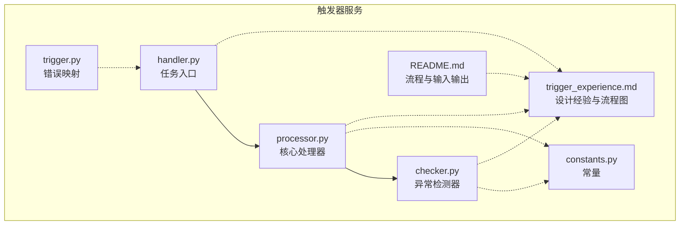
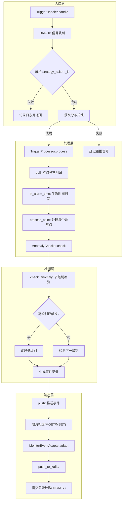
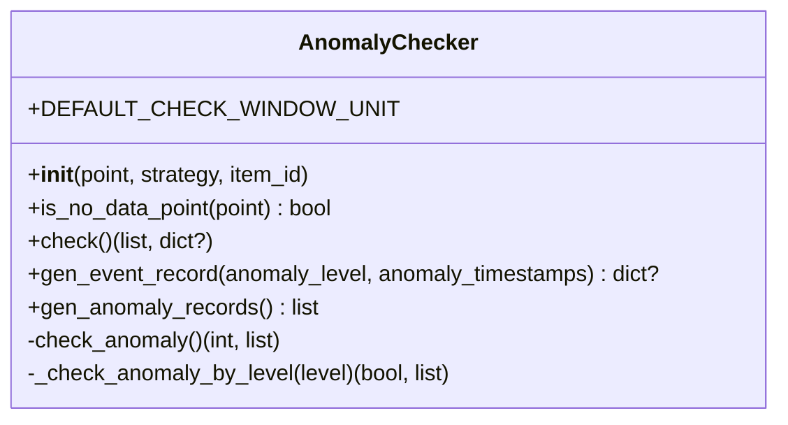
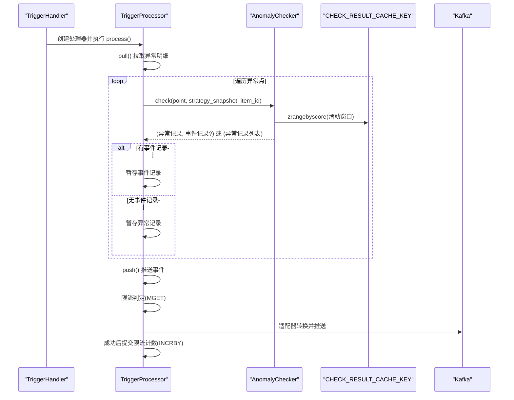
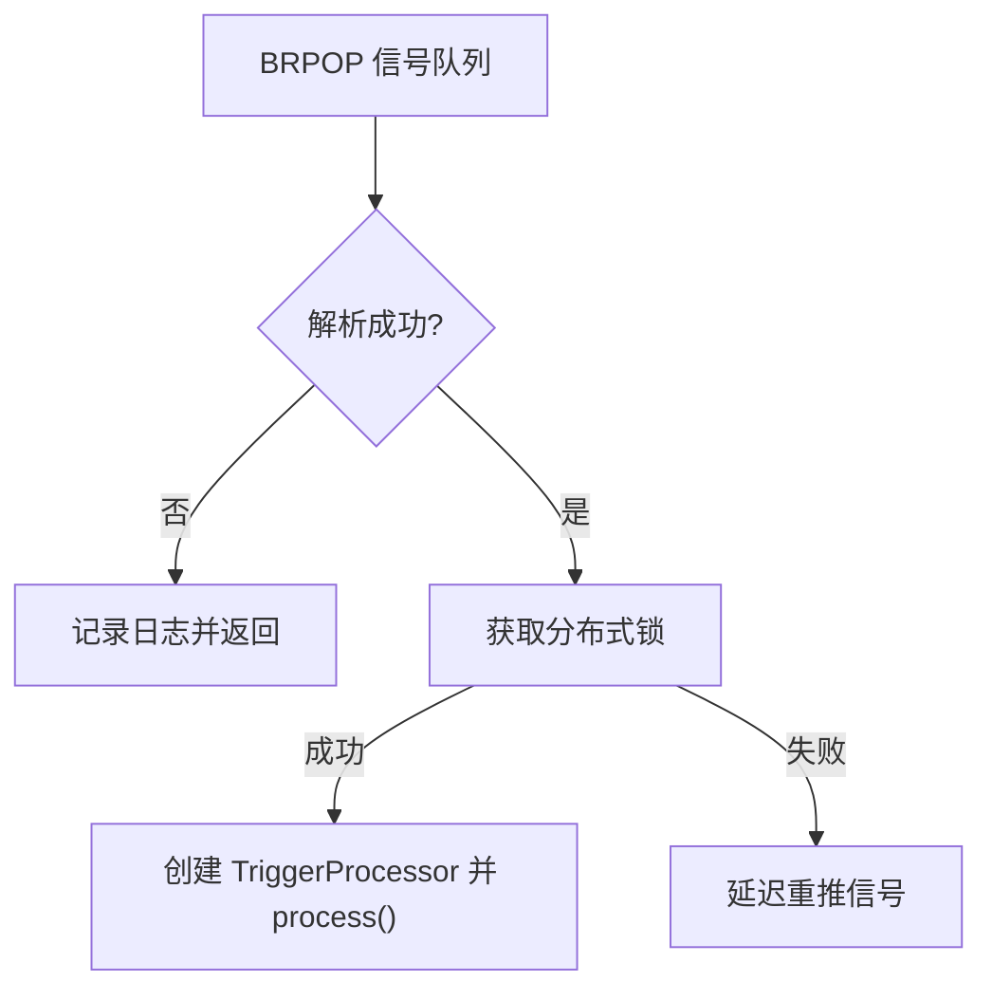
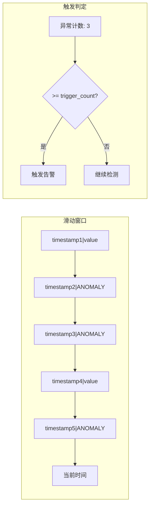
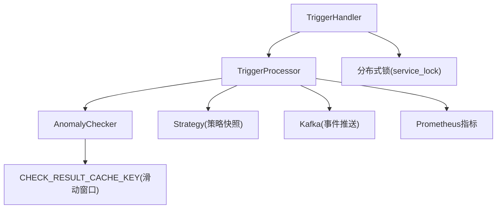

# 触发器服务

<cite>
**本文引用的文件**   
- [README.md](file://bkmonitor/alarm_backends/service/trigger/README.md)
- [checker.py](file://bkmonitor/alarm_backends/service/trigger/checker.py)
- [handler.py](file://bkmonitor/alarm_backends/service/trigger/handler.py)
- [processor.py](file://bkmonitor/alarm_backends/service/trigger/processor.py)
- [trigger_experience.md](file://bkmonitor/ai-learning-docs/trigger_experience.md)
- [trigger.py](file://bkmonitor/core/errors/alarm_backends/trigger.py)
- [constants.py](file://bkmonitor/alarm_backends/constants.py)
</cite>

## 目录
1. [简介](#简介)
2. [项目结构](#项目结构)
3. [核心组件](#核心组件)
4. [架构总览](#架构总览)
5. [详细组件分析](#详细组件分析)
6. [依赖分析](#依赖分析)
7. [性能考虑](#性能考虑)
8. [故障排查指南](#故障排查指南)
9. [结论](#结论)
10. [附录](#附录)

## 简介
触发器服务负责将异常检测结果转化为告警事件，核心目标是：
- 基于“N个周期内累计M次异常”规则进行触发判断
- 支持多算法级别优先级检测，高级别触发后跳过低级别
- 支持无数据告警的特殊判定
- 提供分布式锁、滑动窗口统计、策略快照缓存、事件限流与适配器转换等工程化能力
- 通过 Prometheus 指标与日志记录保障可观测性

## 项目结构
触发器服务位于 alarm_backends/service/trigger，主要文件与职责如下：
- handler.py：任务入口，负责从信号队列拉取任务、加分布式锁、调度处理器
- processor.py：核心处理器，负责拉取异常明细、按策略快照执行检测、事件推送与限流
- checker.py：异常检测器，负责按级别与滑动窗口统计异常次数并生成事件记录
- README.md：模块功能、数据处理流程与输入输出规范
- trigger_experience.md：模块设计经验、最佳实践与架构流程图
- constants.py：通用常量（含无数据维度标签）
- trigger.py：触发器相关错误映射

**图表来源**
- [handler.py:1-75](file://bkmonitor/alarm_backends/service/trigger/handler.py#L1-L75)
- [processor.py:1-294](file://bkmonitor/alarm_backends/service/trigger/processor.py#L1-L294)
- [checker.py:1-220](file://bkmonitor/alarm_backends/service/trigger/checker.py#L1-L220)
- [README.md:1-201](file://bkmonitor/alarm_backends/service/trigger/README.md#L1-L201)
- [trigger_experience.md:1-797](file://bkmonitor/ai-learning-docs/trigger_experience.md#L1-L797)
- [constants.py:1-81](file://bkmonitor/alarm_backends/constants.py#L1-L81)
- [trigger.py:1-14](file://bkmonitor/core/errors/alarm_backends/trigger.py#L1-L14)

**章节来源**
- [README.md:1-201](file://bkmonitor/alarm_backends/service/trigger/README.md#L1-L201)
- [trigger_experience.md:1-797](file://bkmonitor/ai-learning-docs/trigger_experience.md#L1-L797)

## 核心组件
- 触发器处理器（TriggerProcessor）
  - 拉取异常明细列表
  - 读取策略快照（内存优先，Redis兜底）
  - 对每个异常点调用检测器
  - 事件限流与适配器转换后推送至 Kafka
- 异常检测器（AnomalyChecker）
  - 从策略快照中解析触发配置（周期数与触发次数）
  - 从滑动窗口缓存中统计异常次数
  - 多级别从高到低检测，高级别触发后跳过低级别
  - 无数据告警补充判定
- 任务入口（TriggerHandler）
  - 从信号队列 BRPOP 拉取任务
  - 获取分布式锁，避免并发重复处理
  - 调用处理器执行处理流程
  - 指标与日志记录

**章节来源**
- [processor.py:29-294](file://bkmonitor/alarm_backends/service/trigger/processor.py#L29-L294)
- [checker.py:27-220](file://bkmonitor/alarm_backends/service/trigger/checker.py#L27-L220)
- [handler.py:25-75](file://bkmonitor/alarm_backends/service/trigger/handler.py#L25-L75)

## 架构总览
触发器服务采用三层职责分离：
- 入口层：接收信号、加锁、调度
- 处理层：拉取数据、按策略快照执行检测、事件限流与推送
- 检测层：基于滑动窗口与级别优先策略进行触发判定

**图表来源**
- [trigger_experience.md:18-76](file://bkmonitor/ai-learning-docs/trigger_experience.md#L18-L76)
- [handler.py:28-75](file://bkmonitor/alarm_backends/service/trigger/handler.py#L28-L75)
- [processor.py:59-294](file://bkmonitor/alarm_backends/service/trigger/processor.py#L59-L294)
- [checker.py:70-220](file://bkmonitor/alarm_backends/service/trigger/checker.py#L70-L220)

## 详细组件分析

### 组件A：异常检测器（AnomalyChecker）
职责与行为：
- 从异常点提取维度MD5与源时间
- 从策略快照中解析触发配置（周期数与触发次数），并确定检测窗口单位
- 从滑动窗口缓存中统计异常次数，若达到阈值则判定触发
- 多级别从高到低检测，高级别触发后跳过低级别
- 无数据告警补充：若全部为异常且时间跨度满足配置，则触发

**图表来源**
- [checker.py:27-220](file://bkmonitor/alarm_backends/service/trigger/checker.py#L27-L220)

**章节来源**
- [checker.py:35-220](file://bkmonitor/alarm_backends/service/trigger/checker.py#L35-L220)

### 组件B：触发器处理器（TriggerProcessor）
职责与行为：
- 拉取异常明细列表，按旧到新顺序处理
- 读取策略快照（内存优先，Redis兜底），避免配置变更影响一致性
- 对每个异常点调用检测器，暂存异常记录与事件记录
- 事件限流：按（策略ID、监控项ID、数据时间戳）粒度进行 fail-open 限流
- 适配器转换为外部事件格式并推送至 Kafka
- 成功后提交限流计数，避免“先记账后投递”的额度浪费

**图表来源**
- [processor.py:59-294](file://bkmonitor/alarm_backends/service/trigger/processor.py#L59-L294)
- [checker.py:70-220](file://bkmonitor/alarm_backends/service/trigger/checker.py#L70-L220)

**章节来源**
- [processor.py:29-294](file://bkmonitor/alarm_backends/service/trigger/processor.py#L29-L294)

### 组件C：任务入口（TriggerHandler）
职责与行为：
- 从信号队列 BRPOP 拉取任务，解析 strategy_id.item_id
- 获取分布式锁，避免并发重复处理；锁失败则延迟重推信号
- 调用处理器执行处理流程，并记录处理耗时与状态指标

**图表来源**
- [handler.py:28-75](file://bkmonitor/alarm_backends/service/trigger/handler.py#L28-L75)

**章节来源**
- [handler.py:25-75](file://bkmonitor/alarm_backends/service/trigger/handler.py#L25-L75)

### 组件D：滑动窗口与统计逻辑
- 使用 Redis SortedSet 存储检测结果，score 为时间戳，member 为“正常|ANOMALY”
- 通过 ZRANGEBYSCORE 获取时间窗口内的检测记录，统计以 ANOMALY 结尾的成员数量
- 当异常次数达到阈值时触发告警；否则继续检测更高级别

**图表来源**
- [checker.py:190-220](file://bkmonitor/alarm_backends/service/trigger/checker.py#L190-L220)

**章节来源**
- [checker.py:168-220](file://bkmonitor/alarm_backends/service/trigger/checker.py#L168-L220)

### 组件E：无数据告警补充判定
- 当异常点标记为无数据维度时，除常规统计外，还要求“全部为异常且时间跨度满足配置”才触发
- 该逻辑在检测器中实现，避免误触发

**章节来源**
- [checker.py:209-218](file://bkmonitor/alarm_backends/service/trigger/checker.py#L209-L218)

### 组件F：策略生效时间判定
- 处理器在开始处理前调用策略的生效时间判定
- 若不在生效时间内则跳过处理，记录原因

**章节来源**
- [processor.py:270-273](file://bkmonitor/alarm_backends/service/trigger/processor.py#L270-L273)

## 依赖分析
- 组件耦合与内聚
  - TriggerHandler 仅负责入口与锁，内聚度高，耦合度低
  - TriggerProcessor 负责数据拉取、策略快照、检测与推送，承担较多职责但保持清晰的分层
  - AnomalyChecker 专注触发判定，职责单一，内聚度高
- 外部依赖
  - Redis：SortedSet 作为滑动窗口存储，Hash/Key 作为限流计数与策略快照
  - Kafka：事件推送通道
  - Prometheus：指标埋点
- 循环依赖
  - 未见循环导入；模块间通过函数调用与对象组合连接

**图表来源**
- [handler.py:15-21](file://bkmonitor/alarm_backends/service/trigger/handler.py#L15-L21)
- [processor.py:15-21](file://bkmonitor/alarm_backends/service/trigger/processor.py#L15-L21)
- [checker.py:17-22](file://bkmonitor/alarm_backends/service/trigger/checker.py#L17-L22)

**章节来源**
- [handler.py:15-21](file://bkmonitor/alarm_backends/service/trigger/handler.py#L15-L21)
- [processor.py:15-21](file://bkmonitor/alarm_backends/service/trigger/processor.py#L15-L21)
- [checker.py:17-22](file://bkmonitor/alarm_backends/service/trigger/checker.py#L17-L22)

## 性能考虑
- 滑动窗口统计
  - 使用 SortedSet + ZRANGEBYSCORE 实现 O(logN + k) 的区间扫描，k 为窗口内元素数
  - 建议合理设置周期数与窗口单位，避免窗口过大导致扫描成本上升
- 限流策略
  - 使用 Pipeline MGET 预取 Redis 计数，再在内存中逐条判定，减少网络往返
  - fail-open 策略在 Redis 异常时仍允许事件通过，降低故障面
  - 成功后统一 INCRBY 提交计数，避免“先记账后投递”导致的额度浪费
- 指标与日志
  - 关键节点埋点处理耗时、处理数量、大延迟与溢出事件数，便于快速定位瓶颈
  - 大延迟（>1分钟）会触发警告日志与指标上报，便于运维告警
- 批处理与队列
  - 拉取满额后自动再次推送信号，保证队列清空
  - 事件推送批量适配与 Kafka 发送，提升吞吐

**章节来源**
- [processor.py:83-181](file://bkmonitor/alarm_backends/service/trigger/processor.py#L83-L181)
- [processor.py:182-256](file://bkmonitor/alarm_backends/service/trigger/processor.py#L182-L256)
- [trigger_experience.md:608-675](file://bkmonitor/ai-learning-docs/trigger_experience.md#L608-L675)

## 故障排查指南
- 锁竞争与重试
  - 若获取分布式锁失败，会延迟重推信号；检查锁 TTL 与处理时长是否匹配
- 策略快照缺失
  - 若根据快照键无法获取策略快照，会抛出“策略未找到”异常；确认策略更新与快照生成
- 无数据告警未触发
  - 检查异常点是否标记无数据维度，以及时间跨度是否满足“全部异常且跨度满足配置”
- 事件限流丢弃
  - 查看限流丢弃指标与日志，确认 Redis 计数器是否正常；必要时调整阈值
- 处理延迟大
  - 关注大延迟指标与日志，定位上游检测延迟或下游 Kafka 投递问题

**章节来源**
- [handler.py:54-67](file://bkmonitor/alarm_backends/service/trigger/handler.py#L54-L67)
- [processor.py:52-57](file://bkmonitor/alarm_backends/service/trigger/processor.py#L52-L57)
- [checker.py:209-218](file://bkmonitor/alarm_backends/service/trigger/checker.py#L209-L218)
- [processor.py:192-199](file://bkmonitor/alarm_backends/service/trigger/processor.py#L192-L199)
- [processor.py:221-232](file://bkmonitor/alarm_backends/service/trigger/processor.py#L221-L232)

## 结论
触发器服务通过分层职责分离、分布式锁、滑动窗口统计、策略快照缓存与事件限流等工程化手段，实现了稳定高效的告警触发能力。其多级别优先检测与无数据告警补充判定，进一步提升了告警质量与准确性。结合完善的指标与日志，能够有效支撑大规模监控系统的可靠运行。

## 附录

### 触发器配置参数与检查条件
- 触发配置来源
  - 正常告警：从策略快照中的检测配置读取“周期数（check_window_size）”与“触发次数（trigger_count）”
  - 无数据告警：从监控项的无数据配置读取相应级别下的周期数与触发次数
- 检测窗口单位
  - 默认单位为 60 秒；若策略中存在更小周期则取最小周期
- 维度处理
  - 相同维度会累计次数；主机/进程类监控需剔除易漂移维度

**章节来源**
- [README.md:27-39](file://bkmonitor/alarm_backends/service/trigger/README.md#L27-L39)
- [checker.py:41-48](file://bkmonitor/alarm_backends/service/trigger/checker.py#L41-L48)
- [constants.py:67](file://bkmonitor/alarm_backends/constants.py#L67)

### 处理流程控制
- 信号队列
  - 从 ANOMALY_SIGNAL_KEY 拉取 strategy_id.item_id
- 异常明细队列
  - 从 ANOMALY_LIST_KEY 拉取异常点列表，按旧到新顺序处理
- 生效时间判定
  - 在策略生效时间内才进行处理
- 事件推送
  - 通过适配器转换为外部事件格式并推送至 Kafka

**章节来源**
- [README.md:19-43](file://bkmonitor/alarm_backends/service/trigger/README.md#L19-L43)
- [processor.py:59-82](file://bkmonitor/alarm_backends/service/trigger/processor.py#L59-L82)
- [processor.py:270-281](file://bkmonitor/alarm_backends/service/trigger/processor.py#L270-L281)

### 异常处理机制
- 分布式锁失败
  - 延迟重推信号，避免丢失数据
- 策略快照缺失
  - 抛出“策略未找到”异常，阻止使用不一致配置
- Redis 异常
  - 限流阶段采用 fail-open，避免阻塞业务；成功后再提交计数
- 处理异常
  - 记录异常日志并上报指标，便于追踪

**章节来源**
- [handler.py:54-67](file://bkmonitor/alarm_backends/service/trigger/handler.py#L54-L67)
- [processor.py:52-57](file://bkmonitor/alarm_backends/service/trigger/processor.py#L52-L57)
- [processor.py:126-130](file://bkmonitor/alarm_backends/service/trigger/processor.py#L126-L130)
- [trigger.py:13](file://bkmonitor/core/errors/alarm_backends/trigger.py#L13)

### 实际应用场景
- 多级别告警系统：高级别触发后跳过低级别，避免重复告警
- 周期性检测：通过滑动窗口统计异常次数，适用于波动性较大的指标
- 无数据告警：针对长时间无数据的场景，补充判定逻辑
- 高并发事件推送：结合限流与批量适配，保障系统稳定性

**章节来源**
- [trigger_experience.md:190-265](file://bkmonitor/ai-learning-docs/trigger_experience.md#L190-L265)
- [trigger_experience.md:268-328](file://bkmonitor/ai-learning-docs/trigger_experience.md#L268-L328)
- [trigger_experience.md:381-477](file://bkmonitor/ai-learning-docs/trigger_experience.md#L381-L477)

### 配置示例（路径参考）
- 输入数据结构参考
  - [标准输入数据:58-81](file://bkmonitor/alarm_backends/service/trigger/README.md#L58-L81)
- 输出数据结构参考
  - [原始输出数据（EventRecord）:87-116](file://bkmonitor/alarm_backends/service/trigger/README.md#L87-L116)
  - [自愈事件记录:120-188](file://bkmonitor/alarm_backends/service/trigger/README.md#L120-L188)

**章节来源**
- [README.md:58-188](file://bkmonitor/alarm_backends/service/trigger/README.md#L58-L188)