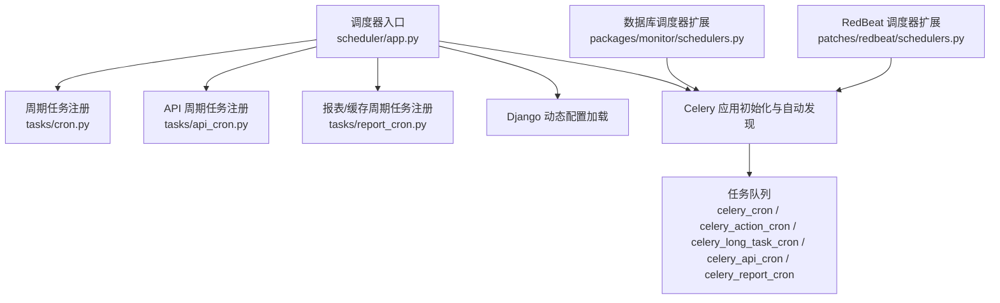
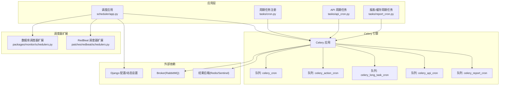
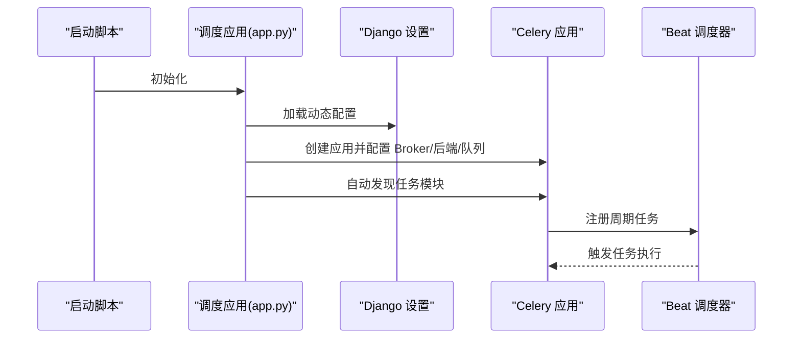
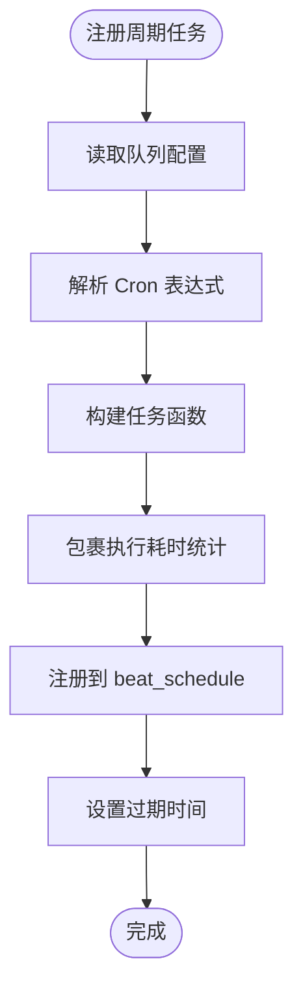
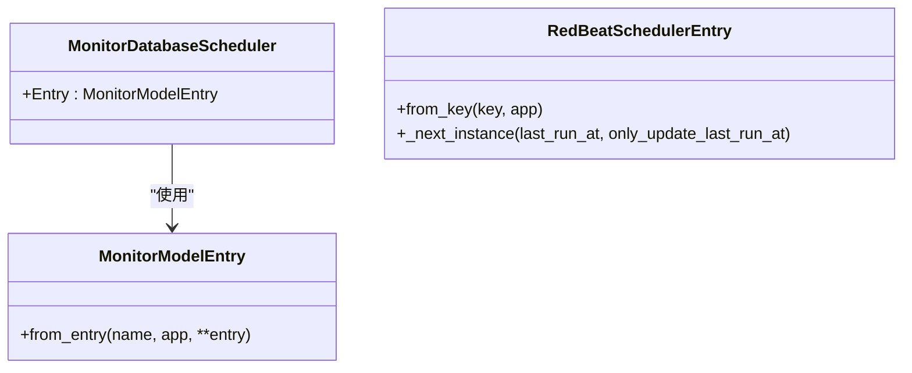
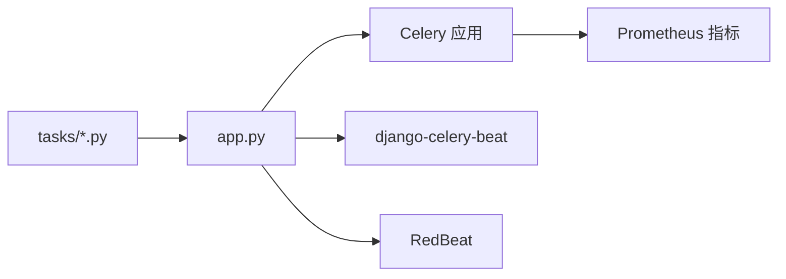

# 调度器服务

<cite>
**本文引用的文件**
- [README.md](file://bkmonitor/alarm_backends/service/scheduler/README.md)
- [app.py](file://bkmonitor/alarm_backends/service/scheduler/app.py)
- [cron.py](file://bkmonitor/alarm_backends/service/scheduler/tasks/cron.py)
- [api_cron.py](file://bkmonitor/alarm_backends/service/scheduler/tasks/api_cron.py)
- [report_cron.py](file://bkmonitor/alarm_backends/service/scheduler/tasks/report_cron.py)
- [schedulers.py](file://bkmonitor/packages/monitor/schedulers.py)
- [schedulers.py](file://bkmonitor/patches/redbeat/schedulers.py)
</cite>

## 目录
1. [简介](#简介)
2. [项目结构](#项目结构)
3. [核心组件](#核心组件)
4. [架构总览](#架构总览)
5. [详细组件分析](#详细组件分析)
6. [依赖分析](#依赖分析)
7. [性能考虑](#性能考虑)
8. [故障排查指南](#故障排查指南)
9. [结论](#结论)
10. [附录](#附录)

## 简介
本文件面向调度器服务，系统性阐述任务调度机制、应用管理与任务执行流程，覆盖调度应用的启动逻辑、任务管理器的调度策略、任务队列处理机制以及性能监控实现。文档同时给出调度配置参数、任务类型定义、执行周期设置与资源管理策略，并提供实际应用场景、配置示例与性能优化建议，帮助开发者构建高效稳定的任务调度系统。

## 项目结构
调度器位于 alarm_backends 服务子模块中，采用 Celery 作为任务分发与调度引擎，结合 Django 配置与动态设置，支持多种任务队列与周期任务注册。核心文件组织如下：
- 启动与配置：scheduler/app.py
- 周期任务注册与队列：scheduler/tasks/cron.py、scheduler/tasks/api_cron.py、scheduler/tasks/report_cron.py
- 调度器扩展：packages/monitor/schedulers.py、patches/redbeat/schedulers.py
- 使用说明：scheduler/README.md

图表来源
- [app.py:176-203](file://bkmonitor/alarm_backends/service/scheduler/app.py#L176-L203)
- [cron.py:89-111](file://bkmonitor/alarm_backends/service/scheduler/tasks/cron.py#L89-L111)
- [api_cron.py:25-39](file://bkmonitor/alarm_backends/service/scheduler/tasks/api_cron.py#L25-L39)
- [report_cron.py:174-204](file://bkmonitor/alarm_backends/service/scheduler/tasks/report_cron.py#L174-L204)
- [schedulers.py:26-28](file://bkmonitor/packages/monitor/schedulers.py#L26-L28)
- [schedulers.py:105-108](file://bkmonitor/patches/redbeat/schedulers.py#L105-L108)

章节来源
- [README.md:1-31](file://bkmonitor/alarm_backends/service/scheduler/README.md#L1-L31)
- [app.py:176-203](file://bkmonitor/alarm_backends/service/scheduler/app.py#L176-L203)

## 核心组件
- 调度应用与配置
  - 通过 app.py 构建 Celery 应用，加载 Django 动态配置，配置 Broker、结果后端、队列与并发策略，并启用周期任务注册。
  - 自动发现任务模块，按安装的应用列表与自定义模块根进行扫描。
- 周期任务管理
  - 通过 PeriodicTask 抽象类与 periodic_task 装饰器，将任务绑定到 beat_schedule 中，支持相对时间与绝对时间调度。
  - 提供 task_duration 包装器，记录任务耗时与异常状态并上报 Prometheus 指标。
- 任务队列与类型
  - 默认队列：celery_cron（通用周期任务）
  - 行动类队列：celery_action_cron（动作相关任务）
  - 长任务队列：celery_long_task_cron（耗时较长任务）
  - API 队列：celery_api_cron（API 缓存/接口相关周期任务）
  - 报表队列：celery_report_cron（运营数据/邮件/缓存刷新等周期任务）
- 调度器扩展
  - 数据库调度器扩展：MonitorDatabaseScheduler 与 MonitorModelEntry，避免覆盖已存在的任务启用状态。
  - RedBeat 调度器扩展：增强 Redis/Sentinel 连接与条目持久化，提升高可用与稳定性。

章节来源
- [app.py:176-250](file://bkmonitor/alarm_backends/service/scheduler/app.py#L176-L250)
- [cron.py:27-54](file://bkmonitor/alarm_backends/service/scheduler/tasks/cron.py#L27-L54)
- [cron.py:81-111](file://bkmonitor/alarm_backends/service/scheduler/tasks/cron.py#L81-L111)
- [api_cron.py:25-39](file://bkmonitor/alarm_backends/service/scheduler/tasks/api_cron.py#L25-L39)
- [report_cron.py:174-204](file://bkmonitor/alarm_backends/service/scheduler/tasks/report_cron.py#L174-L204)
- [schedulers.py:15-28](file://bkmonitor/packages/monitor/schedulers.py#L15-L28)
- [schedulers.py:28-108](file://bkmonitor/patches/redbeat/schedulers.py#L28-L108)

## 架构总览
调度器整体架构围绕 Celery 与 Django 展开，通过动态配置注入、自动任务发现与多队列调度实现高可用与可扩展的任务执行体系。

图表来源
- [app.py:176-203](file://bkmonitor/alarm_backends/service/scheduler/app.py#L176-L203)
- [cron.py:89-111](file://bkmonitor/alarm_backends/service/scheduler/tasks/cron.py#L89-L111)
- [api_cron.py:25-39](file://bkmonitor/alarm_backends/service/scheduler/tasks/api_cron.py#L25-L39)
- [report_cron.py:174-204](file://bkmonitor/alarm_backends/service/scheduler/tasks/report_cron.py#L174-L204)
- [schedulers.py:26-28](file://bkmonitor/packages/monitor/schedulers.py#L26-L28)
- [schedulers.py:105-108](file://bkmonitor/patches/redbeat/schedulers.py#L105-L108)

## 详细组件分析

### 组件一：调度应用启动与配置（app.py）
- 启动流程
  - 初始化 Django 环境，加载全局配置与动态设置，确保运行时配置可热更新。
  - 构造 Celery 应用，基于 RabbitMQ 作为 Broker，Redis 或 Sentinel 作为结果后端，设置队列与路由键。
  - 根据 CPU 核心数计算默认工作进程并发数，支持通过环境变量覆盖。
  - 自动发现任务模块，扫描多个根模块与 INSTALLED_APPS，完成任务注册。
- 关键特性
  - 任务序列化采用 pickle，保证复杂对象传递能力。
  - 开启任务确认延迟与任务幂等策略，提升可靠性。
  - 在 beat 初始化时清理旧数据库连接，避免连接泄漏。
  - 提供 PeriodicTask 抽象类与 periodic_task 装饰器，简化周期任务注册。

图表来源
- [app.py:28-39](file://bkmonitor/alarm_backends/service/scheduler/app.py#L28-L39)
- [app.py:176-203](file://bkmonitor/alarm_backends/service/scheduler/app.py#L176-L203)
- [app.py:215-218](file://bkmonitor/alarm_backends/service/scheduler/app.py#L215-L218)
- [app.py:220-249](file://bkmonitor/alarm_backends/service/scheduler/app.py#L220-L249)

章节来源
- [app.py:28-39](file://bkmonitor/alarm_backends/service/scheduler/app.py#L28-L39)
- [app.py:96-173](file://bkmonitor/alarm_backends/service/scheduler/app.py#L96-L173)
- [app.py:176-203](file://bkmonitor/alarm_backends/service/scheduler/app.py#L176-L203)
- [app.py:215-218](file://bkmonitor/alarm_backends/service/scheduler/app.py#L215-L218)
- [app.py:220-249](file://bkmonitor/alarm_backends/service/scheduler/app.py#L220-L249)

### 组件二：周期任务注册与队列（tasks/cron.py）
- 任务包装
  - task_duration 装饰器记录任务开始、结束与异常，计算耗时并上报 Prometheus 指标（执行时间与计数）。
- 队列定义
  - 支持多队列：celery_cron、celery_action_cron、celery_long_task_cron。
  - 从配置中读取 DEFAULT_CRONTAB、ACTION_TASK_CRONTAB、LONG_TASK_CRONTAB，解析 Cron 表达式生成周期任务。
- 执行策略
  - 通过 get_interval 计算任务周期，设置任务过期时间（最小 5 分钟，最大 1 小时），避免任务堆积。
  - 支持集群类型过滤（global/cluster），非默认集群跳过全局任务。

图表来源
- [cron.py:81-111](file://bkmonitor/alarm_backends/service/scheduler/tasks/cron.py#L81-L111)
- [cron.py:27-54](file://bkmonitor/alarm_backends/service/scheduler/tasks/cron.py#L27-L54)
- [cron.py:69-78](file://bkmonitor/alarm_backends/service/scheduler/tasks/cron.py#L69-L78)

章节来源
- [cron.py:27-54](file://bkmonitor/alarm_backends/service/scheduler/tasks/cron.py#L27-L54)
- [cron.py:81-111](file://bkmonitor/alarm_backends/service/scheduler/tasks/cron.py#L81-L111)

### 组件三：API 周期任务（tasks/api_cron.py）
- 任务来源
  - 从 API 缓存库中读取 API_CRONTAB，逐项注册为周期任务。
- 执行策略
  - 统一使用 celery_api_cron 队列，Cron 表达式逐项解析。
  - 通过 task_duration 包裹，记录执行耗时与状态。
  - 任务过期时间为 5 分钟，避免长时间阻塞。

章节来源
- [api_cron.py:25-39](file://bkmonitor/alarm_backends/service/scheduler/tasks/api_cron.py#L25-L39)

### 组件四：报表/缓存周期任务（tasks/report_cron.py）
- 任务类型
  - 运营数据上报、SLI 指标上报、Redis 指标采集、告警缓存刷新任务注册等。
- 执行策略
  - 统一使用 celery_report_cron 队列，Cron 表达式逐项解析。
  - 通过 share_lock 装饰器实现分布式互斥，避免重复注册。
  - 对接 bmw（bk-monitor-worker）任务中心，按租户维度注册/更新/删除任务，确保参数一致性与幂等。
- 条件注册
  - 当 MAIL_REPORT_BIZ 配置开启时，额外注册订阅报表相关任务。

章节来源
- [report_cron.py:60-172](file://bkmonitor/alarm_backends/service/scheduler/tasks/report_cron.py#L60-L172)
- [report_cron.py:174-204](file://bkmonitor/alarm_backends/service/scheduler/tasks/report_cron.py#L174-L204)

### 组件五：调度器扩展（packages/monitor/schedulers.py 与 patches/redbeat/schedulers.py）
- 数据库调度器扩展（MonitorDatabaseScheduler）
  - 重写 ModelEntry 的 from_entry 方法，避免覆盖已存在的任务启用状态，保持数据库侧配置优先。
- RedBeat 调度器扩展（RedBeatSchedulerEntry）
  - 增强条目持久化与 Redis/Sentinel 连接，解决云 Redis 的 pipeline 取数问题，提升高可用性与稳定性。

图表来源
- [schedulers.py:26-28](file://bkmonitor/packages/monitor/schedulers.py#L26-L28)
- [schedulers.py:15-24](file://bkmonitor/packages/monitor/schedulers.py#L15-L24)
- [schedulers.py:28-74](file://bkmonitor/patches/redbeat/schedulers.py#L28-L74)

章节来源
- [schedulers.py:15-28](file://bkmonitor/packages/monitor/schedulers.py#L15-L28)
- [schedulers.py:28-108](file://bkmonitor/patches/redbeat/schedulers.py#L28-L108)

## 依赖分析
- 内部依赖
  - app.py 依赖 Django 动态设置、集群信息与包内容扫描工具，完成 Celery 配置与任务自动发现。
  - 各任务模块依赖 app.py 中的 periodic_task 与 task_duration，统一执行与监控。
- 外部依赖
  - Celery 与 django-celery-beat：周期任务调度与数据库持久化。
  - RedBeat：基于 Redis 的高可用周期任务存储与调度。
  - Prometheus：通过 metrics 上报任务执行时间与计数。

图表来源
- [app.py:176-203](file://bkmonitor/alarm_backends/service/scheduler/app.py#L176-L203)
- [cron.py:22](file://bkmonitor/alarm_backends/service/scheduler/tasks/cron.py#L22)

章节来源
- [app.py:176-203](file://bkmonitor/alarm_backends/service/scheduler/app.py#L176-L203)
- [cron.py:22](file://bkmonitor/alarm_backends/service/scheduler/tasks/cron.py#L22)

## 性能考虑
- 并发与资源
  - 默认并发数按 CPU 核心数的幂律函数计算，支持通过环境变量覆盖，避免过度占用资源。
  - 单个 Worker 最大任务数限制为 1000，防止内存泄漏与资源耗尽。
- 任务过期与节流
  - 周期任务根据计算出的间隔设置过期时间（最小 5 分钟，最大 1 小时），避免任务堆积与超时。
- 队列隔离
  - 将长任务与普通任务分离到不同队列，降低相互影响，提升整体吞吐。
- 指标监控
  - 通过 task_duration 包装器上报执行时间与异常状态，便于定位慢任务与失败任务。
- 高可用
  - Redis/Sentinel 与 RedBeat 结合，提升调度器与任务持久化的可靠性。

章节来源
- [app.py:42-94](file://bkmonitor/alarm_backends/service/scheduler/app.py#L42-L94)
- [app.py:104-173](file://bkmonitor/alarm_backends/service/scheduler/app.py#L104-L173)
- [cron.py:69-78](file://bkmonitor/alarm_backends/service/scheduler/tasks/cron.py#L69-L78)
- [cron.py:109](file://bkmonitor/alarm_backends/service/scheduler/tasks/cron.py#L109)

## 故障排查指南
- 任务未执行
  - 检查 DEFAULT_CRONTAB/ACTION_TASK_CRONTAB/LONG_TASK_CRONTAB 是否正确配置，且 Cron 表达式合法。
  - 确认任务模块路径可被自动发现（DISCOVER_DIRS 与 INSTALLED_APPS）。
  - 若为全局任务，检查当前集群类型是否为默认集群。
- 任务重复或冲突
  - 使用 MonitorDatabaseScheduler 避免覆盖已存在任务的启用状态。
  - 对于 bmw 任务，确认 share_lock 已生效，避免重复注册。
- 执行异常与耗时
  - 查看 Prometheus 指标中的任务执行时间与异常计数，定位慢任务与失败原因。
  - 检查任务过期时间设置是否合理，避免任务被提前丢弃。
- 高可用问题
  - 检查 Redis/Sentinel 连接配置与网络连通性，必要时启用 RedBeat 的重试连接。

章节来源
- [cron.py:89-111](file://bkmonitor/alarm_backends/service/scheduler/tasks/cron.py#L89-L111)
- [report_cron.py:174-204](file://bkmonitor/alarm_backends/service/scheduler/tasks/report_cron.py#L174-L204)
- [schedulers.py:26-28](file://bkmonitor/packages/monitor/schedulers.py#L26-L28)
- [schedulers.py:77-102](file://bkmonitor/patches/redbeat/schedulers.py#L77-L102)

## 结论
调度器服务以 Celery 为核心，结合 Django 动态配置与多队列策略，实现了高可靠、可扩展的任务调度体系。通过周期任务包装器、队列隔离与高可用扩展，系统在性能与稳定性方面具备良好表现。建议在生产环境中合理设置并发与过期时间，完善监控指标，并根据业务需求选择合适的队列与任务类型，持续优化执行效率与资源利用率。

## 附录

### 配置参数清单
- Celery 相关
  - BROKER_URL：RabbitMQ 地址
  - REDIS_CELERY_CONF：Redis/Redis-Sentinel 配置
  - CELERY_WORKERS：手动指定工作进程数（可选）
  - task_serializer/accept_content/result_serializer：序列化策略（pickle）
  - task_acks_late：任务确认延迟
  - task_default_queue/routing_key/exchange：队列与路由
- 调度配置
  - DEFAULT_CRONTAB：通用周期任务列表（模块名, Cron 表达式, 运行类型）
  - ACTION_TASK_CRONTAB：行动类周期任务列表
  - LONG_TASK_CRONTAB：长任务周期任务列表
  - MAIL_REPORT_BIZ：是否启用订阅报表相关任务
- 集群与租户
  - CLUSTER 类型：区分 global/cluster 任务
  - BMW 接口地址与租户信息：用于注册 bmw 任务

章节来源
- [app.py:96-173](file://bkmonitor/alarm_backends/service/scheduler/app.py#L96-L173)
- [cron.py:81-87](file://bkmonitor/alarm_backends/service/scheduler/tasks/cron.py#L81-L87)
- [report_cron.py:174-188](file://bkmonitor/alarm_backends/service/scheduler/tasks/report_cron.py#L174-L188)

### 任务类型与队列映射
- 通用周期任务：celery_cron
- 行动类周期任务：celery_action_cron
- 长任务周期任务：celery_long_task_cron
- API 周期任务：celery_api_cron
- 报表/缓存周期任务：celery_report_cron

章节来源
- [cron.py:81-87](file://bkmonitor/alarm_backends/service/scheduler/tasks/cron.py#L81-L87)
- [api_cron.py:30](file://bkmonitor/alarm_backends/service/scheduler/tasks/api_cron.py#L30)
- [report_cron.py:195](file://bkmonitor/alarm_backends/service/scheduler/tasks/report_cron.py#L195)

### 实际应用场景
- 周期性数据上报：运营数据、SLI 指标、Redis 指标
- 缓存与索引刷新：CMDB 资源与缓存全量/增量刷新
- 订阅报表：按分钟级频率触发报表检测与发送
- API 缓存：定期拉取与刷新外部 API 数据

章节来源
- [report_cron.py:174-188](file://bkmonitor/alarm_backends/service/scheduler/tasks/report_cron.py#L174-L188)
- [api_cron.py:25-39](file://bkmonitor/alarm_backends/service/scheduler/tasks/api_cron.py#L25-L39)