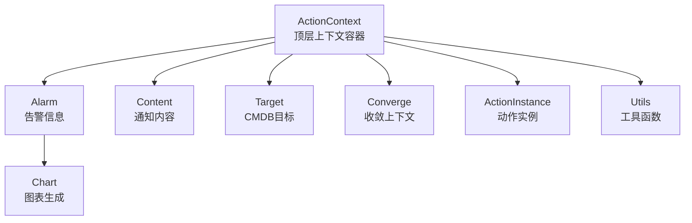
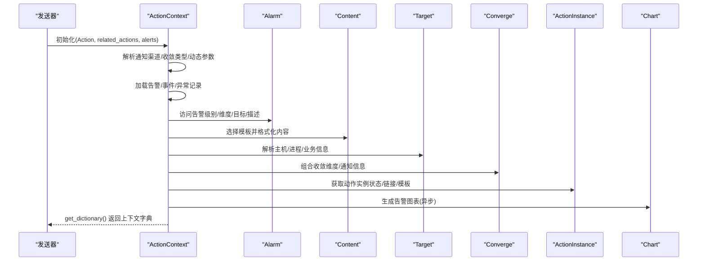
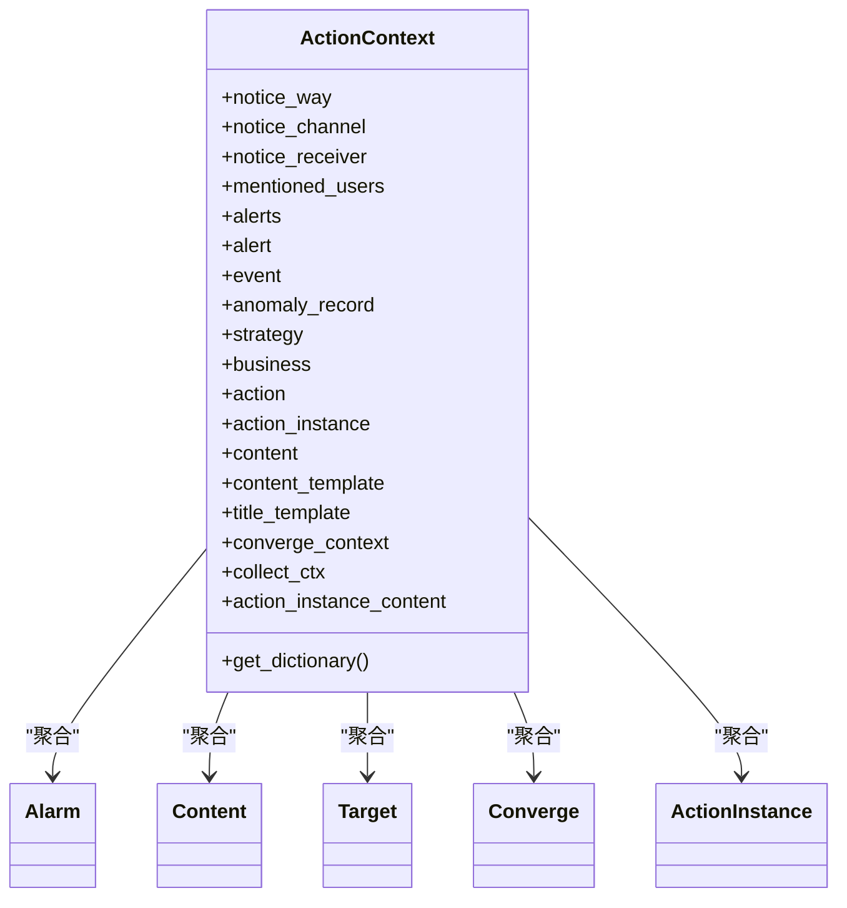
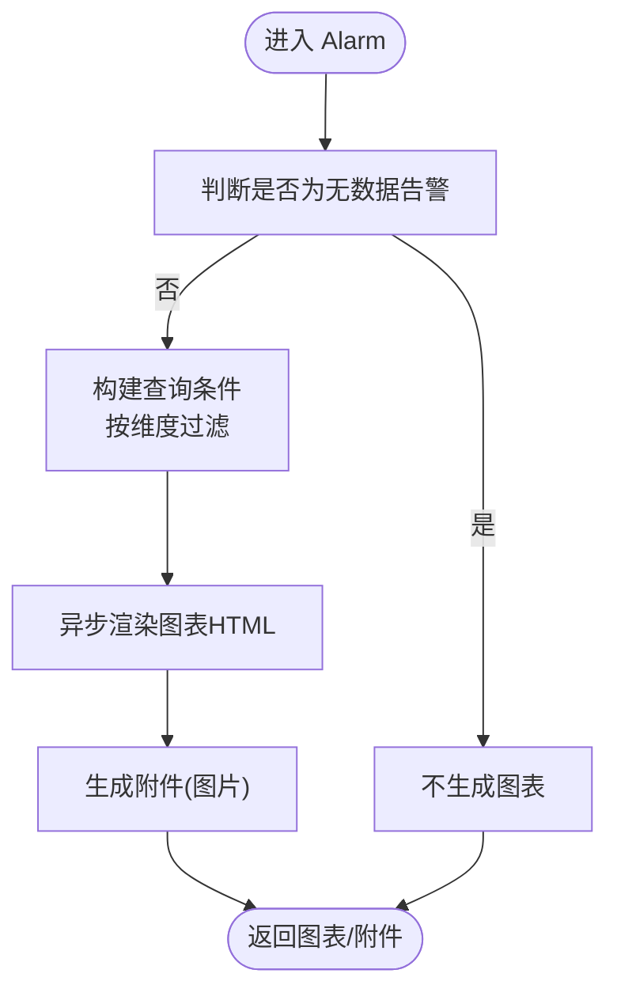
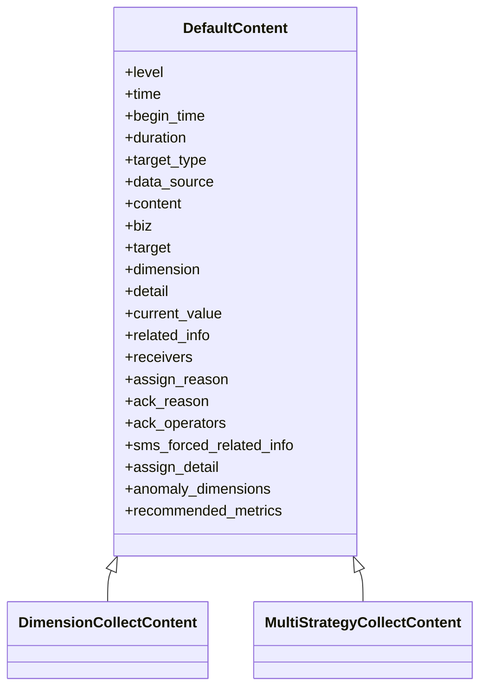
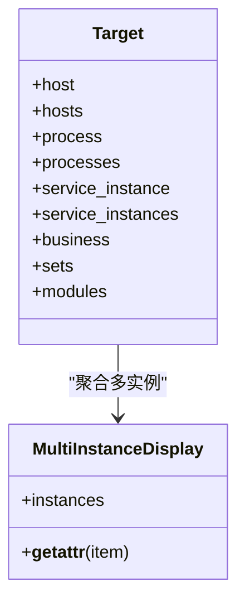
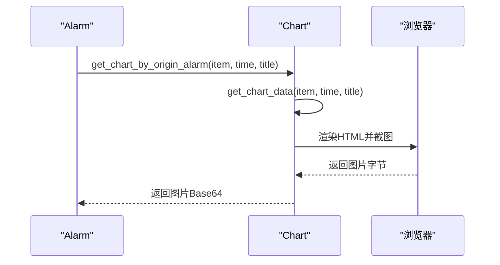
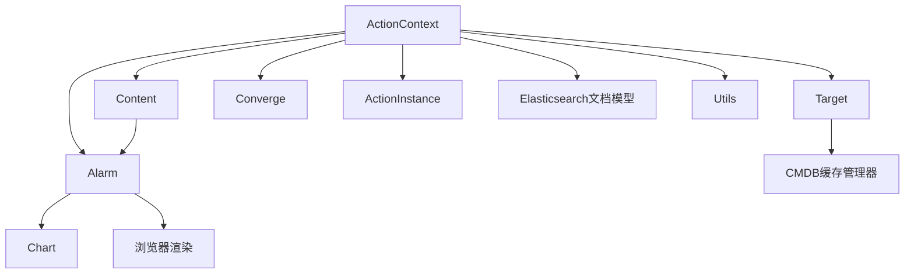

# 上下文管理系统

<cite>
**本文档引用的文件**
- [__init__.py](file://bkmonitor/alarm_backends/core/context/__init__.py)
- [alarm.py](file://bkmonitor/alarm_backends/core/context/alarm.py)
- [content.py](file://bkmonitor/alarm_backends/core/context/content.py)
- [target.py](file://bkmonitor/alarm_backends/core/context/target.py)
- [chart.py](file://bkmonitor/alarm_backends/core/context/chart.py)
- [converge.py](file://bkmonitor/alarm_backends/core/context/converge.py)
- [action_instance.py](file://bkmonitor/alarm_backends/core/context/action_instance.py)
- [utils.py](file://bkmonitor/alarm_backends/core/context/utils.py)
- [context_preview.py](file://bkmonitor/alarm_backends/management/commands/context_preview.py)
</cite>

## 目录
1. [简介](#简介)
2. [项目结构](#项目结构)
3. [核心组件](#核心组件)
4. [架构总览](#架构总览)
5. [详细组件分析](#详细组件分析)
6. [依赖关系分析](#依赖关系分析)
7. [性能考量](#性能考量)
8. [故障排查指南](#故障排查指南)
9. [结论](#结论)
10. [附录](#附录)

## 简介
本文件面向“上下文管理系统”，聚焦告警上下文的构建机制、数据传递与状态管理，系统性阐述告警上下文中目标信息、内容模板、图表数据与告警状态的管理方式，以及上下文数据的生命周期、作用域与跨组件共享机制。文档还包含上下文处理器的实现原理、数据格式规范与扩展接口，并提供使用示例与集成方法，帮助开发者理解告警上下文在整个告警流程中的关键作用。

## 项目结构
上下文管理位于 alarm_backends/core/context 目录，围绕 ActionContext 核心对象，按职责拆分为多个子上下文对象：
- ActionContext：顶层上下文容器，聚合告警、目标、策略、收敛、通知模板等
- Alarm：告警信息对象，负责维度、目标、图表、URL、描述等
- Content：通知内容对象，按通知方式格式化输出
- Target：CMDB 目标对象，封装主机、进程、服务实例、业务等
- Converge：收敛上下文，用于收敛维度与通知信息组合
- ActionInstance：处理动作上下文，封装动作实例状态、时长、链接等
- Chart：图表生成器，异步渲染策略曲线图
- Utils：通用工具函数，含字段计时指标、维度解析、通知映射等

**图表来源**
- [__init__.py:44-576](file://bkmonitor/alarm_backends/core/context/__init__.py#L44-L576)
- [alarm.py:58-800](file://bkmonitor/alarm_backends/core/context/alarm.py#L58-L800)
- [content.py:38-712](file://bkmonitor/alarm_backends/core/context/content.py#L38-L712)
- [target.py:44-238](file://bkmonitor/alarm_backends/core/context/target.py#L44-L238)
- [converge.py:26-222](file://bkmonitor/alarm_backends/core/context/converge.py#L26-L222)
- [action_instance.py:42-342](file://bkmonitor/alarm_backends/core/context/action_instance.py#L42-L342)
- [chart.py:37-236](file://bkmonitor/alarm_backends/core/context/chart.py#L37-L236)
- [utils.py:136-161](file://bkmonitor/alarm_backends/core/context/utils.py#L136-L161)

**章节来源**
- [__init__.py:44-576](file://bkmonitor/alarm_backends/core/context/__init__.py#L44-L576)

## 核心组件
- ActionContext：聚合顶层上下文字段，负责模板选择、告警加载、收敛关系解析、通知渠道解析、内容模板组装等
- Alarm：负责告警级别、维度、目标字符串、图表、URL、描述、关联信息等
- Content：负责按通知方式格式化输出，支持短信、邮件、Markdown 等
- Target：负责主机、进程、服务实例、业务等 CMDB 信息
- Converge：负责收敛维度、通知信息组合、动作信息等
- ActionInstance：负责动作实例状态、时长、链接、模板渲染等
- Chart：负责策略曲线图的异步渲染与图片生成
- Utils：提供字段计时指标、维度解析、通知映射等

**章节来源**
- [__init__.py:44-576](file://bkmonitor/alarm_backends/core/context/__init__.py#L44-L576)
- [alarm.py:58-800](file://bkmonitor/alarm_backends/core/context/alarm.py#L58-L800)
- [content.py:38-712](file://bkmonitor/alarm_backends/core/context/content.py#L38-L712)
- [target.py:44-238](file://bkmonitor/alarm_backends/core/context/target.py#L44-L238)
- [converge.py:26-222](file://bkmonitor/alarm_backends/core/context/converge.py#L26-L222)
- [action_instance.py:42-342](file://bkmonitor/alarm_backends/core/context/action_instance.py#L42-L342)
- [chart.py:37-236](file://bkmonitor/alarm_backends/core/context/chart.py#L37-L236)
- [utils.py:136-161](file://bkmonitor/alarm_backends/core/context/utils.py#L136-L161)

## 架构总览
上下文系统以 ActionContext 为核心，通过 cached_property 按需计算并缓存字段，避免重复 IO 与计算。Alarm、Content、Target、Converge、ActionInstance 等子对象通过 parent 引用共享 ActionContext 的状态与数据。图表生成采用异步渲染，结合浏览器截图生成图片附件。

**图表来源**
- [__init__.py:102-540](file://bkmonitor/alarm_backends/core/context/__init__.py#L102-L540)
- [alarm.py:283-357](file://bkmonitor/alarm_backends/core/context/alarm.py#L283-L357)
- [content.py:69-88](file://bkmonitor/alarm_backends/core/context/content.py#L69-L88)
- [chart.py:37-103](file://bkmonitor/alarm_backends/core/context/chart.py#L37-L103)

**章节来源**
- [__init__.py:102-540](file://bkmonitor/alarm_backends/core/context/__init__.py#L102-L540)
- [alarm.py:283-357](file://bkmonitor/alarm_backends/core/context/alarm.py#L283-L357)
- [content.py:69-88](file://bkmonitor/alarm_backends/core/context/content.py#L69-L88)
- [chart.py:37-103](file://bkmonitor/alarm_backends/core/context/chart.py#L37-L103)

## 详细组件分析

### ActionContext：顶层上下文容器
- 职责
  - 聚合通知渠道、用户类型、告警列表、策略、业务、动作实例等
  - 解析通知渠道与通知方式，支持外部渠道识别
  - 选择内容模板与标题模板，支持不同信号类型
  - 加载告警与事件，支持强制使用告警快照
  - 组装收敛上下文、动作实例上下文、告警上下文、目标上下文
- 关键字段
  - notice_way、notice_channel、notice_receiver、mentioned_users
  - alerts、alert、event、anomaly_record、strategy、business、action、action_instance
  - content、content_template、title_template、default_content_template、default_title_template
  - converge_context、collect_ctx、action_instance_content
- 生命周期与作用域
  - 由调用方传入 ActionInstance 与相关告警初始化
  - 通过 cached_property 缓存字段，减少重复计算
  - 通过 get_dictionary() 暴露统一上下文字典，供模板渲染使用

**图表来源**
- [__init__.py:44-576](file://bkmonitor/alarm_backends/core/context/__init__.py#L44-L576)
- [alarm.py:58-800](file://bkmonitor/alarm_backends/core/context/alarm.py#L58-L800)
- [content.py:38-712](file://bkmonitor/alarm_backends/core/context/content.py#L38-L712)
- [target.py:44-238](file://bkmonitor/alarm_backends/core/context/target.py#L44-L238)
- [converge.py:26-222](file://bkmonitor/alarm_backends/core/context/converge.py#L26-L222)
- [action_instance.py:42-342](file://bkmonitor/alarm_backends/core/context/action_instance.py#L42-L342)

**章节来源**
- [__init__.py:102-540](file://bkmonitor/alarm_backends/core/context/__init__.py#L102-L540)

### Alarm：告警信息对象
- 职责
  - 告警级别、级别名称、告警类型标识
  - 目标字符串与维度字符串，支持 Markdown 链接
  - 图表生成（异步）、附件（图片）、URL（详情、快速操作）
  - 描述（新告警/持续时间/恢复描述）、关联信息（拓扑/日志）
  - 回调数据（接口回调）、策略链接、负责人/接收人
- 关键能力
  - chart_image：根据策略与告警维度生成图表
  - attachments：返回图片附件
  - detail_url/example_detail_url：详情链接（支持移动端/桌面端）
  - operate_allowed/quick_ack_url/quick_shield_url：快捷操作链接
  - related_info/log_related_info：关联信息拼装

**图表来源**
- [alarm.py:283-357](file://bkmonitor/alarm_backends/core/context/alarm.py#L283-L357)
- [chart.py:93-236](file://bkmonitor/alarm_backends/core/context/chart.py#L93-L236)

**章节来源**
- [alarm.py:83-800](file://bkmonitor/alarm_backends/core/context/alarm.py#L83-L800)
- [chart.py:37-236](file://bkmonitor/alarm_backends/core/context/chart.py#L37-L236)

### Content：通知内容对象
- 职责
  - 按通知方式格式化输出，支持短信、邮件、Markdown
  - 统一标签与值的格式化，支持多策略/多维度汇总
- 关键类
  - DefaultContent：基础内容格式化
  - DimensionCollectContent：同维度汇总内容
  - MultiStrategyCollectContent：多策略/多维度汇总内容
- 字段与标签
  - level、time、begin_time、duration、target_type、data_source、content、biz、target、dimension、detail、current_value、related_info、receivers 等
  - Labels：按通知方式定义字段标签

**图表来源**
- [content.py:38-712](file://bkmonitor/alarm_backends/core/context/content.py#L38-L712)

**章节来源**
- [content.py:38-712](file://bkmonitor/alarm_backends/core/context/content.py#L38-L712)

### Target：CMDB 目标对象
- 职责
  - 主机、进程、服务实例、业务信息解析
  - 多实例聚合显示（MultiInstanceDisplay）
  - 环境类型映射（测试/体验/正式）
- 关键能力
  - host/processes/service_instances/business/sets/modules
  - get_host_env_string：根据集群环境映射环境字符串

**图表来源**
- [target.py:44-238](file://bkmonitor/alarm_backends/core/context/target.py#L44-L238)

**章节来源**
- [target.py:44-238](file://bkmonitor/alarm_backends/core/context/target.py#L44-L238)

### Converge：收敛上下文
- 职责
  - 维度哈希、目标、策略/告警名称、信号、通知方式与接收人
  - 通知信息组合（alert_info、notice_info、action_info）
  - 用户类型与群组通知方式拼接
- 关键能力
  - dimensions：普通维度哈希
  - notice_info：通知信息组合
  - action_info：动作信息组合

**章节来源**
- [converge.py:26-222](file://bkmonitor/alarm_backends/core/context/converge.py#L26-L222)

### ActionInstance：动作实例上下文
- 职责
  - 套餐名称、插件类型名称、负责人
  - 开始/结束时间、持续时间、状态展示
  - 执行内容（支持链接替换）、模板详情渲染
  - 防御告警列表与信息、收敛描述
  - 详情链接（仅内部渠道）
- 关键能力
  - template_detail：模板详情渲染
  - defensed_alerts/defensed_alerts_info：防御告警列表
  - detail_url/detail_link：详情链接

**章节来源**
- [action_instance.py:42-342](file://bkmonitor/alarm_backends/core/context/action_instance.py#L42-L342)

### Chart：图表生成器
- 职责
  - 异步渲染策略曲线图，生成图片附件
  - HTML 模板渲染、浏览器截图、Base64 编码
- 关键流程
  - get_chart_by_origin_alarm：根据告警与策略生成图表
  - get_chart_data：构造图表数据（今日/昨日/上周）
  - get_chart_image：渲染 HTML 并截图

**图表来源**
- [alarm.py:283-357](file://bkmonitor/alarm_backends/core/context/alarm.py#L283-L357)
- [chart.py:37-236](file://bkmonitor/alarm_backends/core/context/chart.py#L37-L236)

**章节来源**
- [chart.py:37-236](file://bkmonitor/alarm_backends/core/context/chart.py#L37-L236)

### Utils：工具函数
- 职责
  - 业务角色获取、汇总信息序列化、目标维度键解析
  - 通知显示映射、上下文字段计时指标
- 关键能力
  - get_business_roles：获取业务角色
  - get_target_dimension_keys/get_display_dimensions/get_display_targets：维度/目标解析
  - get_notice_display_mapping：通知方式显示映射
  - context_field_timer：字段访问计时与指标上报

**章节来源**
- [utils.py:25-161](file://bkmonitor/alarm_backends/core/context/utils.py#L25-L161)

## 依赖关系分析
- 组件耦合
  - ActionContext 作为根容器，被 Alarm、Content、Target、Converge、ActionInstance 引用
  - Alarm 依赖 Chart 生成图片附件
  - Content 依赖 Alarm 的维度/目标/描述等
  - Target 依赖 CMDB 缓存管理器
  - Utils 提供通用工具，被各子对象复用
- 外部依赖
  - Django cached_property：字段缓存
  - Elasticsearch 文档模型：AlertDocument、ActionInstanceDocument
  - 浏览器渲染：pyppeteer（异步）
  - 通知渠道映射：CMSI API 缓存

**图表来源**
- [__init__.py:44-576](file://bkmonitor/alarm_backends/core/context/__init__.py#L44-L576)
- [alarm.py:283-357](file://bkmonitor/alarm_backends/core/context/alarm.py#L283-L357)
- [content.py:38-712](file://bkmonitor/alarm_backends/core/context/content.py#L38-L712)
- [target.py:44-238](file://bkmonitor/alarm_backends/core/context/target.py#L44-L238)
- [chart.py:37-236](file://bkmonitor/alarm_backends/core/context/chart.py#L37-L236)
- [utils.py:136-161](file://bkmonitor/alarm_backends/core/context/utils.py#L136-L161)

**章节来源**
- [__init__.py:44-576](file://bkmonitor/alarm_backends/core/context/__init__.py#L44-L576)
- [alarm.py:283-357](file://bkmonitor/alarm_backends/core/context/alarm.py#L283-L357)
- [content.py:38-712](file://bkmonitor/alarm_backends/core/context/content.py#L38-L712)
- [target.py:44-238](file://bkmonitor/alarm_backends/core/context/target.py#L44-L238)
- [chart.py:37-236](file://bkmonitor/alarm_backends/core/context/chart.py#L37-L236)
- [utils.py:136-161](file://bkmonitor/alarm_backends/core/context/utils.py#L136-L161)

## 性能考量
- 字段缓存：大量 cached_property 避免重复计算与 IO
- 异步渲染：图表生成采用异步浏览器渲染，降低阻塞
- 指标监控：context_field_timer 为字段访问耗时打点，便于性能分析
- 条件渲染：Alarm 中对无数据告警、非时序数据源、外部渠道等进行早退判断，减少无效计算

[本节为通用性能讨论，无需特定文件分析]

## 故障排查指南
- 上下文变量预览
  - 使用 context_preview 命令预览模板变量与结构，支持单变量/批量变量查询、JSON/模板两种输出格式
  - 支持指定递归深度与输出格式，便于调试模板变量访问
- 常见问题
  - 图表生成失败：检查 GRAPH_RENDER_SERVICE_ENABLED、策略数据源类型、维度过滤条件
  - 通知链接缺失：检查 notice_way 与 is_external_channel 判断
  - 告警维度/目标为空：检查策略场景与聚合维度配置
  - 字段计时异常：查看 ALARM_CONTEXT_GET_FIELD_TIME 指标，定位耗时字段

**章节来源**
- [context_preview.py:33-800](file://bkmonitor/alarm_backends/management/commands/context_preview.py#L33-L800)

## 结论
上下文管理系统通过 ActionContext 聚合告警、目标、策略、收敛与动作实例等多维信息，借助 Alarm/Content/Target/Converge/ActionInstance 等子对象实现强解耦与高扩展性。Alarm 的图表生成与附件机制、Content 的多通知方式格式化、Target 的 CMDB 信息聚合、Converge 的收敛维度组合、ActionInstance 的动作状态与链接，共同构成完整的告警上下文生态。配合 context_preview 命令与字段计时指标，开发者可高效调试与优化上下文渲染流程。

[本节为总结性内容，无需特定文件分析]

## 附录

### 数据格式规范与扩展接口
- 上下文字段清单（ActionContext.Fields）
  - 包含通知方式、用户类型、通知渠道、接收人、提及用户、标题/内容模板、告警信息、目标、级别、告警对象、策略、业务、动作、动作实例、收敛上下文等
- 模板渲染
  - content_template/title_template：支持按信号类型与通知方式选择模板
  - ActionInstanceContext.template_detail：支持 Jinja2 渲染
- 图表数据
  - Alarm.chart_image：返回图片 Base64
  - Chart.get_chart_data：返回图表配置（单位、系列、时区、标题等）

**章节来源**
- [__init__.py:49-94](file://bkmonitor/alarm_backends/core/context/__init__.py#L49-L94)
- [alarm.py:283-390](file://bkmonitor/alarm_backends/core/context/alarm.py#L283-L390)
- [chart.py:106-235](file://bkmonitor/alarm_backends/core/context/chart.py#L106-L235)
- [action_instance.py:199-226](file://bkmonitor/alarm_backends/core/context/action_instance.py#L199-L226)

### 使用示例与集成方法
- 预览上下文变量
  - 命令：python manage.py context_preview <alert_id> [--action-id <action_id>] [--variable <var_path>] [--depth <n>] [--format <template|json>]
  - 用途：调试模板变量、查看字段结构、批量查询
- 集成步骤
  - 创建 ActionContext：传入 ActionInstance、相关动作、告警列表
  - 获取上下文字典：调用 get_dictionary()
  - 渲染模板：使用 Jinja2Renderer.render
  - 生成图表：Alarm.chart_image 或 Chart.get_chart_by_origin_alarm
  - 发送通知：根据 notice_way 与渠道规则发送

**章节来源**
- [context_preview.py:167-254](file://bkmonitor/alarm_backends/management/commands/context_preview.py#L167-L254)
- [__init__.py:102-540](file://bkmonitor/alarm_backends/core/context/__init__.py#L102-L540)
- [alarm.py:283-357](file://bkmonitor/alarm_backends/core/context/alarm.py#L283-L357)
- [chart.py:93-103](file://bkmonitor/alarm_backends/core/context/chart.py#L93-L103)