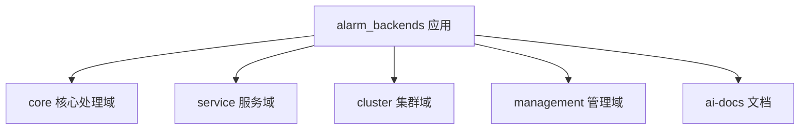
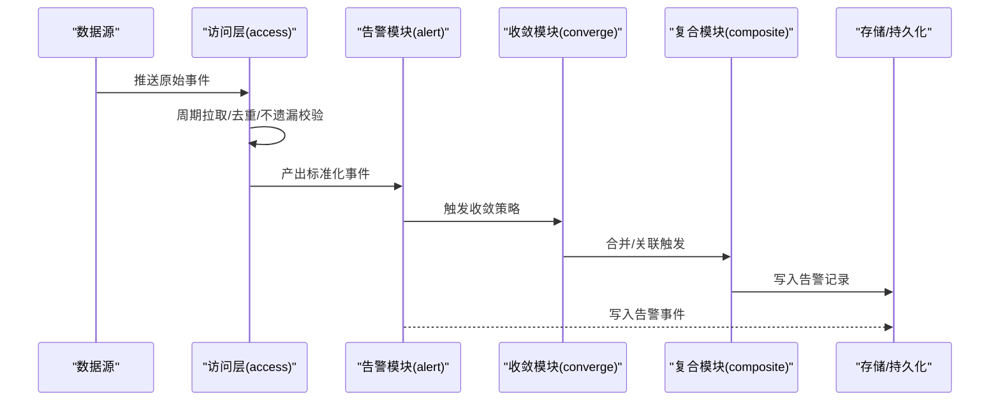
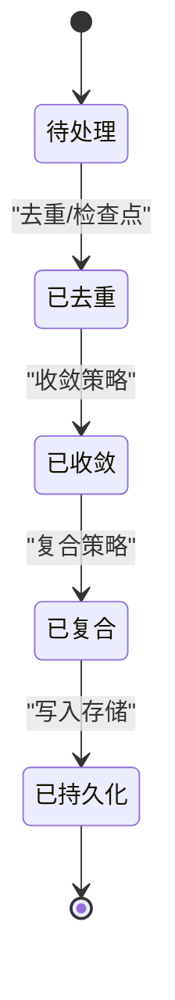
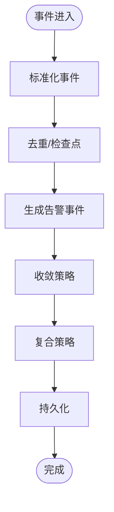
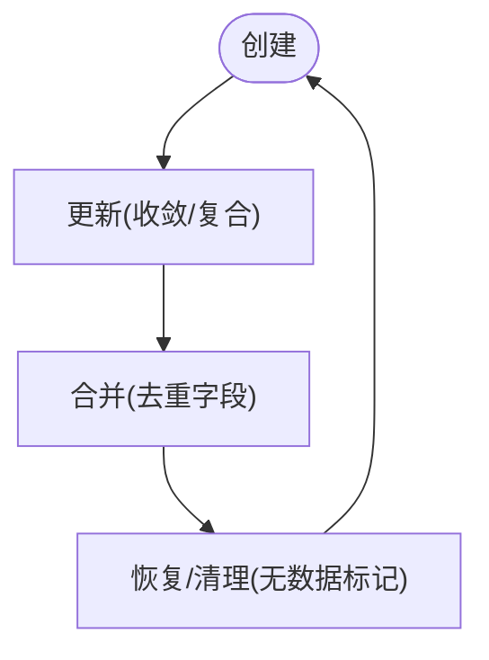
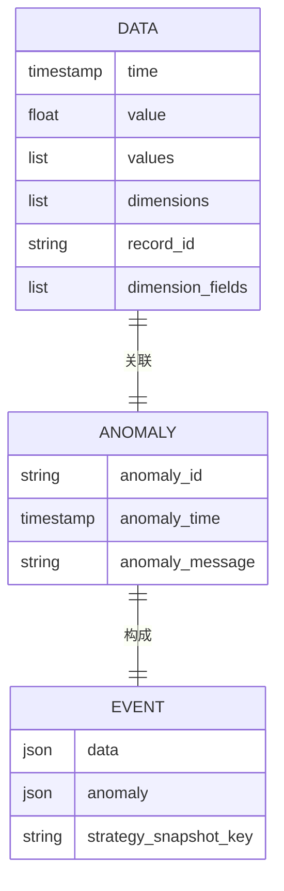
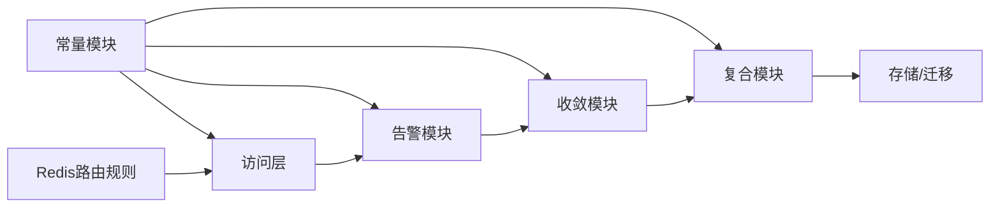

# 告警处理引擎

<cite>
**本文引用的文件**
- [alarm_backends/__init__.py](file://bkmonitor/alarm_backends/__init__.py)
- [alarm_backends/apps.py](file://bkmonitor/alarm_backends/apps.py)
- [alarm_backends/constants.py](file://bkmonitor/alarm_backends/constants.py)
- [alarm_backends/urls.py](file://bkmonitor/alarm_backends/urls.py)
- [ai-docs/bk-monitor/docs/告警后台(alarm_backends)/modules/access/access.event事件处理流程详解.md](file://ai-docs/bk-monitor/docs/告警后台(alarm_backends)/modules/access/access.event事件处理流程详解.md)
- [ai-docs/bk-monitor/docs/告警后台(alarm_backends)/modules/access/去重机制详解.md](file://ai-docs/bk-monitor/docs/告警后台(alarm_backends)/modules/access/去重机制详解.md)
- [ai-docs/bk-monitor/docs/告警后台(alarm_backends)/modules/access/周期拉取与数据不遗漏保障机制.md](file://ai-docs/bk-monitor/docs/告警后台(alarm_backends)/modules/access/周期拉取与数据不遗漏保障机制.md)
- [ai-docs/bk-monitor/docs/告警后台(alarm_backends)/modules/alert/业务逻辑与数据处理流程.md](file://ai-docs/bk-monitor/docs/告警后台(alarm_backends)/modules/alert/业务逻辑与数据处理流程.md)
- [ai-docs/bk-monitor/docs/告警后台(alarm_backends)/modules/composite/业务逻辑与数据处理流程.md](file://ai-docs/bk-monitor/docs/告警后台(alarm_backends)/modules/composite/业务逻辑与数据处理流程.md)
- [ai-docs/bk-monitor/docs/告警后台(alarm_backends)/modules/converge/业务逻辑与数据处理流程.md](file://ai-docs/bk-monitor/docs/告警后台(alarm_backends)/modules/converge/业务逻辑与数据处理流程.md)
- [ai-docs/bk-monitor/docs/告警后台(alarm_backends)/models/告警策略模型设计.md](file://ai-docs/bk-monitor/docs/告警后台(alarm_backends)/models/告警策略模型设计.md)
- [ai-docs/bk-monitor/docs/告警后台(alarm_backends)/backend_alert-db迁移操作手册.md](file://ai-docs/bk-monitor/docs/告警后台(alarm_backends)/backend_alert-db迁移操作手册.md)
- [ai-docs/bk-monitor/docs/告警后台(alarm_backends)/PROCESS_OVER_FLOW指标说明.md](file://ai-docs/bk-monitor/docs/告警后台(alarm_backends)/PROCESS_OVER_FLOW指标说明.md)
- [ai-docs/bk-monitor/docs/告警后台(alarm_backends)/Redis路由规则.md](file://ai-docs/bk-monitor/docs/告警后台(alarm_backends)/Redis路由规则.md)
</cite>

## 目录
1. [简介](#简介)
2. [项目结构](#项目结构)
3. [核心组件](#核心组件)
4. [架构总览](#架构总览)
5. [详细组件分析](#详细组件分析)
6. [依赖分析](#依赖分析)
7. [性能考虑](#性能考虑)
8. [故障排查指南](#故障排查指南)
9. [结论](#结论)
10. [附录](#附录)

## 简介
本技术文档围绕“告警处理引擎”展开，目标是帮助开发者全面理解告警事件的生命周期管理、状态转换机制、告警适配器的实现原理，以及告警对象的创建、更新、合并与清理流程。同时，文档将阐述告警事件的数据结构设计、属性管理与事件传播机制，并给出处理器接口定义、扩展点与自定义实现方式，辅以具体使用场景与参考路径，便于二次开发与问题定位。

## 项目结构
告警处理引擎位于 bkmonitor/alarm_backends 模块中，采用模块化组织方式，涵盖集群、核心处理、服务层、管理命令等子域。其常量与配置、URL路由、Django 应用入口等基础设施在该模块内完成初始化与声明。

图表来源
- [alarm_backends/apps.py:16-22](file://bkmonitor/alarm_backends/apps.py#L16-L22)

章节来源
- [alarm_backends/__init__.py:1-11](file://bkmonitor/alarm_backends/__init__.py#L1-L11)
- [alarm_backends/apps.py:16-22](file://bkmonitor/alarm_backends/apps.py#L16-L22)
- [alarm_backends/urls.py:1-4](file://bkmonitor/alarm_backends/urls.py#L1-L4)

## 核心组件
- 常量与标准字段：定义时间单位、标准数据/异常/事件字段集合、默认去重字段、无数据标记等关键常量，为事件与告警对象的统一建模提供约束。
- 事件处理与去重：通过访问层（access）对事件进行周期性拉取、去重与不遗漏保障，确保上游数据稳定进入后续处理链路。
- 告警生成与传播：告警模块（alert）负责基于策略快照与异常信息生成告警事件，并驱动后续收敛、复合与上报流程。
- 收敛与复合：收敛模块（converge）用于聚合相似事件，减少噪声；复合模块（composite）用于跨维度/跨策略的关联触发。
- 数据模型与迁移：策略模型设计文档与数据库迁移手册为告警数据持久化与演进提供依据。

章节来源
- [alarm_backends/constants.py:11-81](file://bkmonitor/alarm_backends/constants.py#L11-L81)
- [ai-docs/bk-monitor/docs/告警后台(alarm_backends)/modules/access/access.event事件处理流程详解.md](file://ai-docs/bk-monitor/docs/告警后台(alarm_backends)/modules/access/access.event事件处理流程详解.md)
- [ai-docs/bk-monitor/docs/告警后台(alarm_backends)/modules/alert/业务逻辑与数据处理流程.md](file://ai-docs/bk-monitor/docs/告警后台(alarm_backends)/modules/alert/业务逻辑与数据处理流程.md)
- [ai-docs/bk-monitor/docs/告警后台(alarm_backends)/modules/converge/业务逻辑与数据处理流程.md](file://ai-docs/bk-monitor/docs/告警后台(alarm_backends)/modules/converge/业务逻辑与数据处理流程.md)
- [ai-docs/bk-monitor/docs/告警后台(alarm_backends)/modules/composite/业务逻辑与数据处理流程.md](file://ai-docs/bk-monitor/docs/告警后台(alarm_backends)/modules/composite/业务逻辑与数据处理流程.md)
- [ai-docs/bk-monitor/docs/告警后台(alarm_backends)/models/告警策略模型设计.md](file://ai-docs/bk-monitor/docs/告警后台(alarm_backends)/models/告警策略模型设计.md)
- [ai-docs/bk-monitor/docs/告警后台(alarm_backends)/backend_alert-db迁移操作手册.md](file://ai-docs/bk-monitor/docs/告警后台(alarm_backends)/backend_alert-db迁移操作手册.md)

## 架构总览
告警处理引擎从“事件接入—去重—告警生成—收敛—复合—上报”的链路组织，形成闭环。下图展示典型调用序列：

图表来源
- [ai-docs/bk-monitor/docs/告警后台(alarm_backends)/modules/access/access.event事件处理流程详解.md](file://ai-docs/bk-monitor/docs/告警后台(alarm_backends)/modules/access/access.event事件处理流程详解.md)
- [ai-docs/bk-monitor/docs/告警后台(alarm_backends)/modules/alert/业务逻辑与数据处理流程.md](file://ai-docs/bk-monitor/docs/告警后台(alarm_backends)/modules/alert/业务逻辑与数据处理流程.md)
- [ai-docs/bk-monitor/docs/告警后台(alarm_backends)/modules/converge/业务逻辑与数据处理流程.md](file://ai-docs/bk-monitor/docs/告警后台(alarm_backends)/modules/converge/业务逻辑与数据处理流程.md)
- [ai-docs/bk-monitor/docs/告警后台(alarm_backends)/modules/composite/业务逻辑与数据处理流程.md](file://ai-docs/bk-monitor/docs/告警后台(alarm_backends)/modules/composite/业务逻辑与数据处理流程.md)

## 详细组件分析

### 事件生命周期与状态转换
- 生命周期阶段
  - 接入：原始事件由数据源推送至访问层，按周期拉取与去重策略进行清洗。
  - 去重与不遗漏：通过去重字段与检查点机制，保证事件幂等与完整性。
  - 告警生成：基于策略快照与异常信息生成标准化事件。
  - 收敛与复合：收敛模块聚合相似事件，复合模块进行跨维度/跨策略关联。
  - 上报与持久化：最终写入存储，供查询与报表使用。
- 状态转换
  - 事件状态：待处理 → 已去重/已收敛 → 已复合 → 已持久化
  - 告警状态：未恢复 → 告警中 → 恢复 → 无数据 → 处理完成
  - 默认去重字段与无数据标记为状态转换提供判定依据

图表来源
- [alarm_backends/constants.py:74-76](file://bkmonitor/alarm_backends/constants.py#L74-L76)
- [ai-docs/bk-monitor/docs/告警后台(alarm_backends)/modules/access/去重机制详解.md](file://ai-docs/bk-monitor/docs/告警后台(alarm_backends)/modules/access/去重机制详解.md)
- [ai-docs/bk-monitor/docs/告警后台(alarm_backends)/modules/access/周期拉取与数据不遗漏保障机制.md](file://ai-docs/bk-monitor/docs/告警后台(alarm_backends)/modules/access/周期拉取与数据不遗漏保障机制.md)
- [ai-docs/bk-monitor/docs/告警后台(alarm_backends)/modules/alert/业务逻辑与数据处理流程.md](file://ai-docs/bk-monitor/docs/告警后台(alarm_backends)/modules/alert/业务逻辑与数据处理流程.md)
- [ai-docs/bk-monitor/docs/告警后台(alarm_backends)/modules/converge/业务逻辑与数据处理流程.md](file://ai-docs/bk-monitor/docs/告警后台(alarm_backends)/modules/converge/业务逻辑与数据处理流程.md)
- [ai-docs/bk-monitor/docs/告警后台(alarm_backends)/modules/composite/业务逻辑与数据处理流程.md](file://ai-docs/bk-monitor/docs/告警后台(alarm_backends)/modules/composite/业务逻辑与数据处理流程.md)

章节来源
- [alarm_backends/constants.py:28-76](file://bkmonitor/alarm_backends/constants.py#L28-L76)
- [ai-docs/bk-monitor/docs/告警后台(alarm_backends)/modules/access/access.event事件处理流程详解.md](file://ai-docs/bk-monitor/docs/告警后台(alarm_backends)/modules/access/access.event事件处理流程详解.md)
- [ai-docs/bk-monitor/docs/告警后台(alarm_backends)/modules/access/去重机制详解.md](file://ai-docs/bk-monitor/docs/告警后台(alarm_backends)/modules/access/去重机制详解.md)
- [ai-docs/bk-monitor/docs/告警后台(alarm_backends)/modules/access/周期拉取与数据不遗漏保障机制.md](file://ai-docs/bk-monitor/docs/告警后台(alarm_backends)/modules/access/周期拉取与数据不遗漏保障机制.md)
- [ai-docs/bk-monitor/docs/告警后台(alarm_backends)/modules/alert/业务逻辑与数据处理流程.md](file://ai-docs/bk-monitor/docs/告警后台(alarm_backends)/modules/alert/业务逻辑与数据处理流程.md)
- [ai-docs/bk-monitor/docs/告警后台(alarm_backends)/modules/converge/业务逻辑与数据处理流程.md](file://ai-docs/bk-monitor/docs/告警后台(alarm_backends)/modules/converge/业务逻辑与数据处理流程.md)
- [ai-docs/bk-monitor/docs/告警后台(alarm_backends)/modules/composite/业务逻辑与数据处理流程.md](file://ai-docs/bk-monitor/docs/告警后台(alarm_backends)/modules/composite/业务逻辑与数据处理流程.md)

### 告警适配器与处理器接口
- 适配器职责
  - 将上游数据标准化为统一事件格式，满足标准字段集合要求。
  - 提供去重与不遗漏保障，确保后续处理稳定性。
- 处理器接口要点
  - 输入：标准化事件（含 data/anomaly/strategy_snapshot_key）
  - 输出：告警事件与持久化记录
  - 扩展点：可插拔的收敛与复合策略，支持自定义算法与阈值

图表来源
- [alarm_backends/constants.py:45-50](file://bkmonitor/alarm_backends/constants.py#L45-L50)
- [ai-docs/bk-monitor/docs/告警后台(alarm_backends)/modules/access/access.event事件处理流程详解.md](file://ai-docs/bk-monitor/docs/告警后台(alarm_backends)/modules/access/access.event事件处理流程详解.md)
- [ai-docs/bk-monitor/docs/告警后台(alarm_backends)/modules/alert/业务逻辑与数据处理流程.md](file://ai-docs/bk-monitor/docs/告警后台(alarm_backends)/modules/alert/业务逻辑与数据处理流程.md)
- [ai-docs/bk-monitor/docs/告警后台(alarm_backends)/modules/converge/业务逻辑与数据处理流程.md](file://ai-docs/bk-monitor/docs/告警后台(alarm_backends)/modules/converge/业务逻辑与数据处理流程.md)
- [ai-docs/bk-monitor/docs/告警后台(alarm_backends)/modules/composite/业务逻辑与数据处理流程.md](file://ai-docs/bk-monitor/docs/告警后台(alarm_backends)/modules/composite/业务逻辑与数据处理流程.md)

章节来源
- [alarm_backends/constants.py:28-50](file://bkmonitor/alarm_backends/constants.py#L28-L50)
- [ai-docs/bk-monitor/docs/告警后台(alarm_backends)/modules/access/access.event事件处理流程详解.md](file://ai-docs/bk-monitor/docs/告警后台(alarm_backends)/modules/access/access.event事件处理流程详解.md)
- [ai-docs/bk-monitor/docs/告警后台(alarm_backends)/modules/alert/业务逻辑与数据处理流程.md](file://ai-docs/bk-monitor/docs/告警后台(alarm_backends)/modules/alert/业务逻辑与数据处理流程.md)
- [ai-docs/bk-monitor/docs/告警后台(alarm_backends)/modules/converge/业务逻辑与数据处理流程.md](file://ai-docs/bk-monitor/docs/告警后台(alarm_backends)/modules/converge/业务逻辑与数据处理流程.md)
- [ai-docs/bk-monitor/docs/告警后台(alarm_backends)/modules/composite/业务逻辑与数据处理流程.md](file://ai-docs/bk-monitor/docs/告警后台(alarm_backends)/modules/composite/业务逻辑与数据处理流程.md)

### 告警对象的创建、更新、合并与清理
- 创建
  - 基于策略快照与异常信息生成告警事件，写入存储。
- 更新
  - 通过收敛与复合策略对相似事件进行合并，减少重复告警。
- 合并
  - 使用默认去重字段进行聚合，避免重复通知。
- 清理
  - 无数据状态下使用特定标记与检查点，确保清理与恢复边界清晰

图表来源
- [alarm_backends/constants.py:74-76](file://bkmonitor/alarm_backends/constants.py#L74-L76)
- [ai-docs/bk-monitor/docs/告警后台(alarm_backends)/modules/converge/业务逻辑与数据处理流程.md](file://ai-docs/bk-monitor/docs/告警后台(alarm_backends)/modules/converge/业务逻辑与数据处理流程.md)
- [ai-docs/bk-monitor/docs/告警后台(alarm_backends)/modules/composite/业务逻辑与数据处理流程.md](file://ai-docs/bk-monitor/docs/告警后台(alarm_backends)/modules/composite/业务逻辑与数据处理流程.md)
- [ai-docs/bk-monitor/docs/告警后台(alarm_backends)/modules/access/去重机制详解.md](file://ai-docs/bk-monitor/docs/告警后台(alarm_backends)/modules/access/去重机制详解.md)

章节来源
- [alarm_backends/constants.py:74-76](file://bkmonitor/alarm_backends/constants.py#L74-L76)
- [ai-docs/bk-monitor/docs/告警后台(alarm_backends)/modules/converge/业务逻辑与数据处理流程.md](file://ai-docs/bk-monitor/docs/告警后台(alarm_backends)/modules/converge/业务逻辑与数据处理流程.md)
- [ai-docs/bk-monitor/docs/告警后台(alarm_backends)/modules/composite/业务逻辑与数据处理流程.md](file://ai-docs/bk-monitor/docs/告警后台(alarm_backends)/modules/composite/业务逻辑与数据处理流程.md)
- [ai-docs/bk-monitor/docs/告警后台(alarm_backends)/modules/access/去重机制详解.md](file://ai-docs/bk-monitor/docs/告警后台(alarm_backends)/modules/access/去重机制详解.md)

### 数据结构设计与属性管理
- 标准字段集合
  - 标准数据字段：时间戳、数值、多值、维度、记录标识、维度字段
  - 标准异常字段：异常标识、异常时间、异常消息
  - 标准事件字段：数据体、异常体、策略快照键
- 属性管理
  - 通过统一字段约束与默认去重字段，确保跨模块属性一致性
  - 无数据场景使用专用标记与检查点，避免误判

图表来源
- [alarm_backends/constants.py:28-50](file://bkmonitor/alarm_backends/constants.py#L28-L50)

章节来源
- [alarm_backends/constants.py:28-50](file://bkmonitor/alarm_backends/constants.py#L28-L50)

### 事件传播机制
- 传播路径
  - 访问层负责事件接入与去重，随后进入告警生成阶段，再经收敛与复合，最终写入存储。
- 传播保障
  - 周期拉取与检查点机制确保不遗漏；去重字段确保幂等。

章节来源
- [ai-docs/bk-monitor/docs/告警后台(alarm_backends)/modules/access/access.event事件处理流程详解.md](file://ai-docs/bk-monitor/docs/告警后台(alarm_backends)/modules/access/access.event事件处理流程详解.md)
- [ai-docs/bk-monitor/docs/告警后台(alarm_backends)/modules/access/周期拉取与数据不遗漏保障机制.md](file://ai-docs/bk-monitor/docs/告警后台(alarm_backends)/modules/access/周期拉取与数据不遗漏保障机制.md)
- [ai-docs/bk-monitor/docs/告警后台(alarm_backends)/modules/alert/业务逻辑与数据处理流程.md](file://ai-docs/bk-monitor/docs/告警后台(alarm_backends)/modules/alert/业务逻辑与数据处理流程.md)
- [ai-docs/bk-monitor/docs/告警后台(alarm_backends)/modules/converge/业务逻辑与数据处理流程.md](file://ai-docs/bk-monitor/docs/告警后台(alarm_backends)/modules/converge/业务逻辑与数据处理流程.md)
- [ai-docs/bk-monitor/docs/告警后台(alarm_backends)/modules/composite/业务逻辑与数据处理流程.md](file://ai-docs/bk-monitor/docs/告警后台(alarm_backends)/modules/composite/业务逻辑与数据处理流程.md)

## 依赖分析
- 组件耦合
  - 访问层与告警模块强耦合，收敛与复合模块作为中间层降低告警模块复杂度。
  - 常量模块为各模块提供统一字段与去重策略依据。
- 外部依赖
  - 存储与数据库迁移遵循策略模型设计与迁移手册。
  - Redis 路由规则影响事件分发与负载均衡。

图表来源
- [alarm_backends/constants.py:28-81](file://bkmonitor/alarm_backends/constants.py#L28-L81)
- [ai-docs/bk-monitor/docs/告警后台(alarm_backends)/Redis路由规则.md](file://ai-docs/bk-monitor/docs/告警后台(alarm_backends)/Redis路由规则.md)
- [ai-docs/bk-monitor/docs/告警后台(alarm_backends)/models/告警策略模型设计.md](file://ai-docs/bk-monitor/docs/告警后台(alarm_backends)/models/告警策略模型设计.md)
- [ai-docs/bk-monitor/docs/告警后台(alarm_backends)/backend_alert-db迁移操作手册.md](file://ai-docs/bk-monitor/docs/告警后台(alarm_backends)/backend_alert-db迁移操作手册.md)

章节来源
- [alarm_backends/constants.py:28-81](file://bkmonitor/alarm_backends/constants.py#L28-L81)
- [ai-docs/bk-monitor/docs/告警后台(alarm_backends)/Redis路由规则.md](file://ai-docs/bk-monitor/docs/告警后台(alarm_backends)/Redis路由规则.md)
- [ai-docs/bk-monitor/docs/告警后台(alarm_backends)/models/告警策略模型设计.md](file://ai-docs/bk-monitor/docs/告警后台(alarm_backends)/models/告警策略模型设计.md)
- [ai-docs/bk-monitor/docs/告警后台(alarm_backends)/backend_alert-db迁移操作手册.md](file://ai-docs/bk-monitor/docs/告警后台(alarm_backends)/backend_alert-db迁移操作手册.md)

## 性能考虑
- 去重与收敛策略应结合业务维度选择合适字段，避免过度聚合导致延迟。
- 周期拉取与检查点需平衡吞吐与不遗漏，防止积压与重复。
- Kafka 缓冲区上限与 Redis 路由规则需与集群规模匹配，避免瓶颈。

章节来源
- [alarm_backends/constants.py:79-81](file://bkmonitor/alarm_backends/constants.py#L79-L81)
- [ai-docs/bk-monitor/docs/告警后台(alarm_backends)/PROCESS_OVER_FLOW指标说明.md](file://ai-docs/bk-monitor/docs/告警后台(alarm_backends)/PROCESS_OVER_FLOW指标说明.md)
- [ai-docs/bk-monitor/docs/告警后台(alarm_backends)/Redis路由规则.md](file://ai-docs/bk-monitor/docs/告警后台(alarm_backends)/Redis路由规则.md)

## 故障排查指南
- 常见问题
  - 事件丢失：核查周期拉取与检查点配置。
  - 重复告警：核对去重字段与收敛策略。
  - 无数据误判：确认无数据标记与检查点逻辑。
- 参考路径
  - 去重机制详解与周期拉取保障文档
  - 告警策略模型与数据库迁移手册

章节来源
- [ai-docs/bk-monitor/docs/告警后台(alarm_backends)/modules/access/去重机制详解.md](file://ai-docs/bk-monitor/docs/告警后台(alarm_backends)/modules/access/去重机制详解.md)
- [ai-docs/bk-monitor/docs/告警后台(alarm_backends)/modules/access/周期拉取与数据不遗漏保障机制.md](file://ai-docs/bk-monitor/docs/告警后台(alarm_backends)/modules/access/周期拉取与数据不遗漏保障机制.md)
- [ai-docs/bk-monitor/docs/告警后台(alarm_backends)/models/告警策略模型设计.md](file://ai-docs/bk-monitor/docs/告警后台(alarm_backends)/models/告警策略模型设计.md)
- [ai-docs/bk-monitor/docs/告警后台(alarm_backends)/backend_alert-db迁移操作手册.md](file://ai-docs/bk-monitor/docs/告警后台(alarm_backends)/backend_alert-db迁移操作手册.md)

## 结论
告警处理引擎通过标准化事件结构、严格的去重与不遗漏保障、可插拔的收敛与复合策略，实现了高可靠、高性能的告警处理闭环。开发者可基于默认去重字段与策略模型快速定制扩展，同时依托迁移与路由规则保障系统演进与扩容。

## 附录
- 使用场景建议
  - 新增策略时，优先完善策略快照键与异常消息，确保事件可追溯。
  - 在高维场景下，合理选择去重字段，避免过度收敛导致延迟。
  - 对无数据场景，明确检查点与标记策略，确保恢复边界清晰。