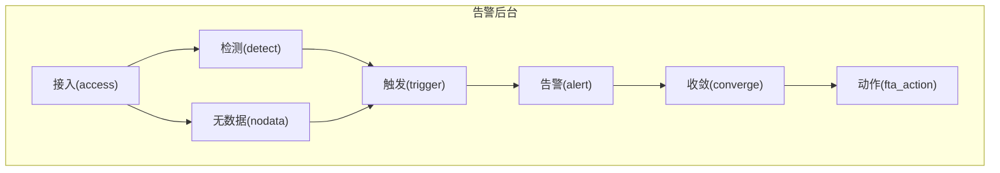
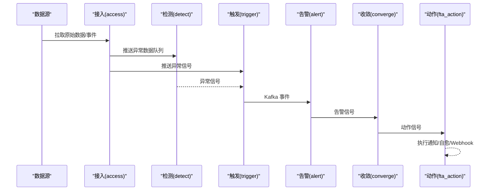
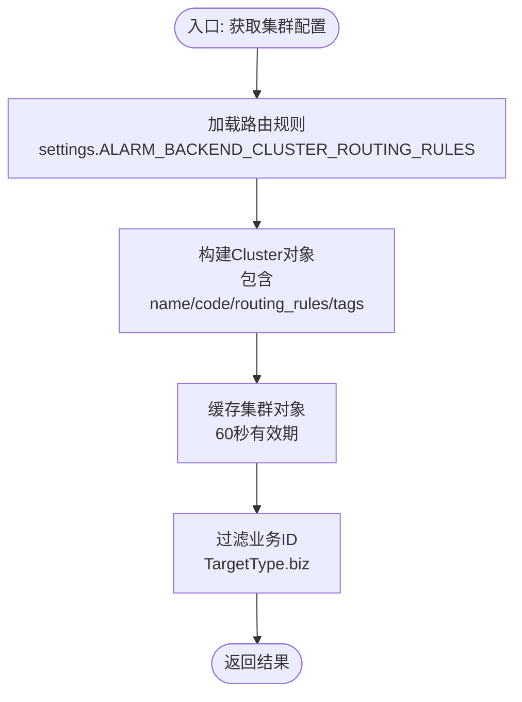
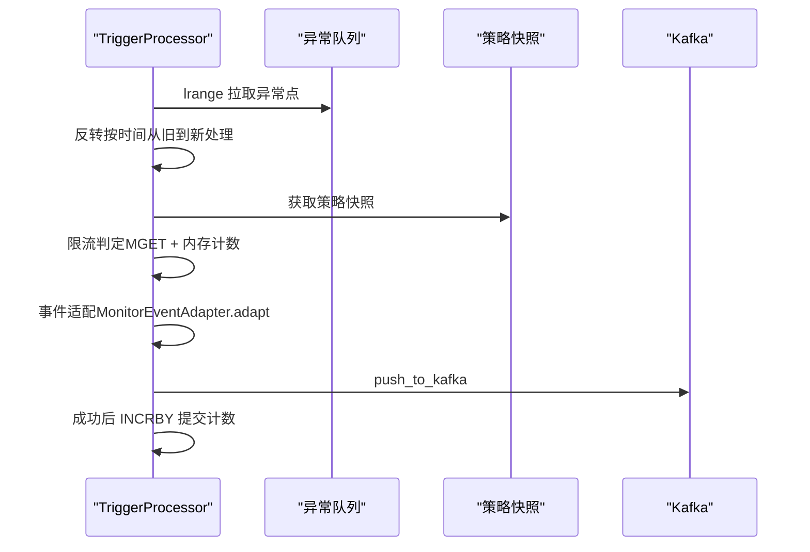
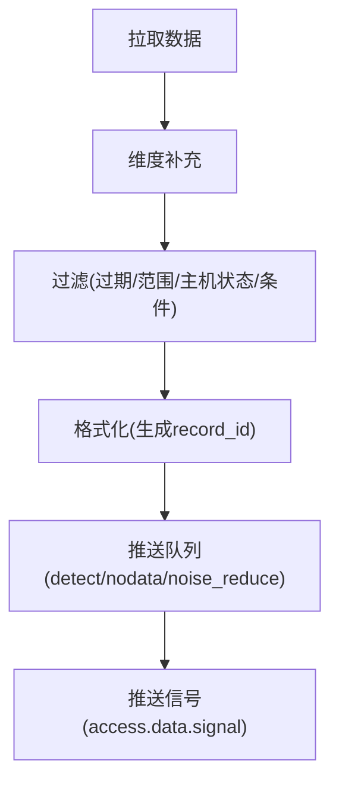
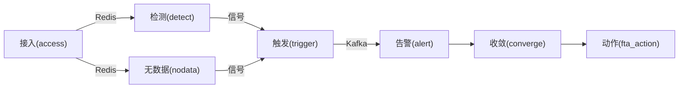

# 告警核心引擎

<cite>
**本文引用的文件**
- [alarm_backends/core/cluster.py](file://bkmonitor/alarm_backends/core/cluster.py)
- [alarm_backends/constants.py](file://bkmonitor/alarm_backends/constants.py)
- [alarm_backends/service/trigger/processor.py](file://bkmonitor/alarm_backends/service/trigger/processor.py)
- [ai-docs/bk-monitor/docs/告警后台(alarm_backends)/告警数据流.md](file://ai-docs/bk-monitor/docs/告警后台(alarm_backends)/告警数据流.md)
- [ai-docs/bk-monitor/docs/告警后台(alarm_backends)/modules/access/业务逻辑与数据处理流程.md](file://ai-docs/bk-monitor/docs/告警后台(alarm_backends)/modules/access/业务逻辑与数据处理流程.md)
- [ai-docs/bk-monitor/docs/告警后台(alarm_backends)/modules/access/access.event事件处理流程详解.md](file://ai-docs/bk-monitor/docs/告警后台(alarm_backends)/modules/access/access.event事件处理流程详解.md)
</cite>

## 目录
1. [简介](#简介)
2. [项目结构](#项目结构)
3. [核心组件](#核心组件)
4. [架构总览](#架构总览)
5. [详细组件分析](#详细组件分析)
6. [依赖分析](#依赖分析)
7. [性能考量](#性能考量)
8. [故障排查指南](#故障排查指南)
9. [结论](#结论)
10. [附录](#附录)

## 简介
本技术文档面向“告警核心引擎”，系统化解析其核心算法、数据结构、处理流程与关键组件，涵盖告警上下文管理、缓存机制、存储策略、熔断机制、检测算法、状态机管理与事件处理机制。文档以模块化视角呈现从数据接入到动作执行的完整数据流，帮助开发者快速理解内部工作机制并进行二次开发。

## 项目结构
告警核心引擎位于 alarm_backends 子系统，围绕“接入(access)→检测(detect)→触发(trigger)→告警(alert)→收敛(converge)→动作(fta_action)”的流水线组织模块。核心模块与关键文件如下：
- 核心常量与时间单位：alarm_backends/constants.py
- 集群路由与业务过滤：alarm_backends/core/cluster.py
- 事件触发器：alarm_backends/service/trigger/processor.py
- 数据流与模块文档：ai-docs/bk-monitor/docs/告警后台(alarm_backends)/告警数据流.md
- 接入模块文档（时序/事件/实时/故障）：ai-docs/bk-monitor/docs/告警后台(alarm_backends)/modules/access/业务逻辑与数据处理流程.md
- 事件处理详解：ai-docs/bk-monitor/docs/告警后台(alarm_backends)/modules/access/access.event事件处理流程详解.md

图表来源
- [告警数据流.md](file://ai-docs/bk-monitor/docs/告警后台(alarm_backends)/告警数据流.md#L53-L63)

章节来源
- [告警数据流.md](file://ai-docs/bk-monitor/docs/告警后台(alarm_backends)/告警数据流.md#L1-L800)

## 核心组件
- 集群与业务路由：通过集群配置与路由规则，限定引擎处理的业务范围，避免跨域处理。
- 事件触发器：负责从异常队列拉取异常点，按策略快照进行触发判断，生成事件并推送至 Kafka。
- 接入模块：多数据源接入（时序/事件/实时/故障），维度补充、过滤、格式化、批量处理、熔断与 QoS。
- 常量与字段规范：统一标准数据/异常/事件/告警字段，保障跨模块一致性。
- 缓存与存储：Redis 队列承载模块间数据流转，ES/Mysql/Redis 作为持久化与缓存介质。

章节来源
- [cluster.py:22-60](file://bkmonitor/alarm_backends/core/cluster.py#L22-L60)
- [constants.py:11-81](file://bkmonitor/alarm_backends/constants.py#L11-L81)
- [告警数据流.md](file://ai-docs/bk-monitor/docs/告警后台(alarm_backends)/告警数据流.md#L1-L800)

## 架构总览
引擎采用“队列化 + 分布式任务”的架构，模块间通过 Redis 队列与 Kafka 流转数据，结合熔断、限流、批量处理与时间点限制等机制，保障高吞吐与稳定性。

图表来源
- [告警数据流.md](file://ai-docs/bk-monitor/docs/告警后台(alarm_backends)/告警数据流.md#L53-L63)

章节来源
- [告警数据流.md](file://ai-docs/bk-monitor/docs/告警后台(alarm_backends)/告警数据流.md#L1-L800)

## 详细组件分析

### 组件A：集群与业务路由（cluster）
- 设计要点
  - 通过路由规则将业务ID映射到目标集群，支持缓存与定期刷新。
  - 提供业务ID过滤能力，确保仅处理本集群负责的业务。
- 关键接口
  - 获取集群配置：get_cluster()
  - 过滤业务ID：filter_bk_biz_ids()
  - 获取集群业务集合：get_cluster_bk_biz_ids()

图表来源
- [cluster.py:22-60](file://bkmonitor/alarm_backends/core/cluster.py#L22-L60)

章节来源
- [cluster.py:22-60](file://bkmonitor/alarm_backends/core/cluster.py#L22-L60)

### 组件B：事件触发器（TriggerProcessor）
- 设计要点
  - 从异常队列拉取异常点，按策略快照进行触发判断，生成事件并推送 Kafka。
  - 限流控制：按（策略, 监控项, 数据时间戳）维度进行限流，避免瞬时洪峰。
  - 延迟监控：统计 detect→trigger 延迟，超过阈值进行告警与指标上报。
- 关键流程
  - 拉取：lrange + ltrim，支持分批处理与信号重入。
  - 限流：MGET 预取 + 内存判定 + 成功后 INCRBY 提交。
  - 推送：MonitorEventAdapter.adapt() + push_to_kafka()。
  - 统计：PROCESS_OVER_FLOW、PROCESS_BIG_LATENCY、TRIGGER_EVENT_RATE_LIMIT_DROP。

图表来源
- [trigger/processor.py:29-294](file://bkmonitor/alarm_backends/service/trigger/processor.py#L29-L294)

章节来源
- [trigger/processor.py:29-294](file://bkmonitor/alarm_backends/service/trigger/processor.py#L29-L294)

### 组件C：接入模块（Access）与事件处理（Access.Event）
- 设计要点
  - 多数据源接入：时序数据、事件数据、实时数据、故障分析数据。
  - 维度补充：TopoNodeFuller 补充 CMDB 拓扑节点，按主机/服务实例/主机维度补全。
  - 过滤：过期、范围、主机状态、条件过滤。
  - 熔断与 QoS：策略/业务/数据源多维熔断；高优数据源独立队列与周期扩展。
  - 批量处理：超阈值自动拆分，首批发处理，其余异步处理。
  - 事件处理（V2）：Kafka→Redis 中转→Worker 拉取，白名单事件类型，维度补充与过滤。
- 关键 Redis Key
  - access.data.{strategy_id}.{item_id}
  - access.event.{data_id}
  - access.nodata.{strategy_id}.{item_id}
  - access.data.signal
  - access.noise_reduce.total.{strategy_id}.{noise_dimension_hash}

图表来源
- [modules/access/业务逻辑与数据处理流程.md](file://ai-docs/bk-monitor/docs/告警后台(alarm_backends)/modules/access/业务逻辑与数据处理流程.md#L106-L228)

章节来源
- [modules/access/业务逻辑与数据处理流程.md](file://ai-docs/bk-monitor/docs/告警后台(alarm_backends)/modules/access/业务逻辑与数据处理流程.md#L1-L800)
- [modules/access/access.event事件处理流程详解.md](file://ai-docs/bk-monitor/docs/告警后台(alarm_backends)/modules/access/access.event事件处理流程详解.md#L1-L800)

### 组件D：常量与字段规范（Standard Fields）
- 设计要点
  - 统一标准数据/异常/事件/告警字段，确保跨模块一致性。
  - 时间单位、日志格式、无数据等级与维度标签等常量集中管理。
- 关键字段
  - 标准数据字段：time/value/values/dimensions/record_id/dimension_fields
  - 标准异常字段：anomaly_id/anomaly_time/anomaly_message
  - 标准事件字段：data/anomaly/strategy_snapshot_key

章节来源
- [constants.py:28-77](file://bkmonitor/alarm_backends/constants.py#L28-L77)

## 依赖分析
- 模块耦合
  - Access 与 Detect/Nodata 通过 Redis 队列解耦，信号驱动。
  - Trigger 依赖策略快照与异常队列，输出 Kafka 事件。
  - Alert 依赖 ES/Mysql/Redis，进行去重、状态管理与周期检查。
  - Converge 依赖 MySQL 与 Redis，进行收敛与动作状态管理。
  - Fta_action 依赖策略动作配置与外部系统（通知/作业/标准运维）。
- 外部依赖
  - Redis：队列、缓存、锁、令牌桶。
  - Kafka：事件传输。
  - ES/Mysql：持久化存储。

图表来源
- [告警数据流.md](file://ai-docs/bk-monitor/docs/告警后台(alarm_backends)/告警数据流.md#L53-L63)

章节来源
- [告警数据流.md](file://ai-docs/bk-monitor/docs/告警后台(alarm_backends)/告警数据流.md#L1-L800)

## 性能考量
- 批量处理
  - 超阈值自动拆分，首批发处理，其余异步处理，保障吞吐与延迟平衡。
- 限流与熔断
  - 令牌桶限流（TokenBucket）与多维熔断（业务/数据源/策略），防止雪崩。
  - QoS 队列与周期扩展，保障高优数据源稳定性。
- 缓存与队列
  - Redis 队列承载模块间数据流转，DB 分离（队列/缓存/自身数据）降低耦合。
- 延迟与溢出监控
  - detect→trigger、detect→alert 延迟监控；异常/事件/信号超阈值上报 PROCESS_OVER_FLOW。

章节来源
- [modules/access/业务逻辑与数据处理流程.md](file://ai-docs/bk-monitor/docs/告警后台(alarm_backends)/modules/access/业务逻辑与数据处理流程.md#L548-L787)
- [告警数据流.md](file://ai-docs/bk-monitor/docs/告警后台(alarm_backends)/告警数据流.md#L216-L235)

## 故障排查指南
- 常见问题定位
  - 数据未到达：检查 access.data.signal 是否有信号，队列长度与消费速率。
  - 异常未触发：检查策略快照是否可用、触发条件与告警时间范围。
  - 事件风暴：检查限流阈值与 Redis 计数器，关注 PROCESS_OVER_FLOW 指标。
  - 延迟过高：关注 detect→trigger、detect→alert 延迟，定位慢点。
- 关键指标
  - ACCESS_DATA_PROCESS_TIME/ACCESS_EVENT_PROCESS_TIME
  - PROCESS_OVER_FLOW/PROCESS_BIG_LATENCY
  - TRIGGER_EVENT_RATE_LIMIT_DROP
- 关键日志
  - 策略快照缺失：StrategyNotFound
  - 事件限流丢弃：TRIGGER_EVENT_RATE_LIMIT_DROP
  - 大延迟告警：detect→trigger/big latency

章节来源
- [告警数据流.md](file://ai-docs/bk-monitor/docs/告警后台(alarm_backends)/告警数据流.md#L216-L235)
- [trigger/processor.py:182-252](file://bkmonitor/alarm_backends/service/trigger/processor.py#L182-L252)

## 结论
告警核心引擎通过模块化与队列化设计，结合熔断、限流、批量处理与时间点限制等机制，在高吞吐场景下保障稳定性与一致性。事件触发器以策略快照为核心，完成异常到事件的高效转换；接入模块提供多数据源统一接入与预处理能力；收敛与动作模块确保告警风暴防护与外部系统联动。开发者可基于本文档理解核心算法与扩展点，进行二次开发与定制。

## 附录
- 使用场景建议
  - 新增事件类型：在 Access.Event 中新增事件记录类并加入白名单。
  - 自定义触发规则：扩展 AnomalyChecker 的 check 逻辑。
  - 调整限流策略：修改 TRIGGER_EVENT_RATE_LIMIT_THRESHOLD 与 Redis TTL。
  - 熔断与 QoS：通过配置项启用/调整熔断与 QoS 队列。
- 代码示例路径
  - 集群路由：[cluster.py:22-60](file://bkmonitor/alarm_backends/core/cluster.py#L22-L60)
  - 事件触发器：[trigger/processor.py:29-294](file://bkmonitor/alarm_backends/service/trigger/processor.py#L29-L294)
  - 接入流程（时序/事件/实时/故障）：[modules/access/业务逻辑与数据处理流程.md](file://ai-docs/bk-monitor/docs/告警后台(alarm_backends)/modules/access/业务逻辑与数据处理流程.md#L1-L800)
  - 事件处理详解：[modules/access/access.event事件处理流程详解.md](file://ai-docs/bk-monitor/docs/告警后台(alarm_backends)/modules/access/access.event事件处理流程详解.md#L1-L800)