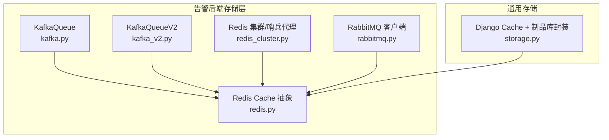
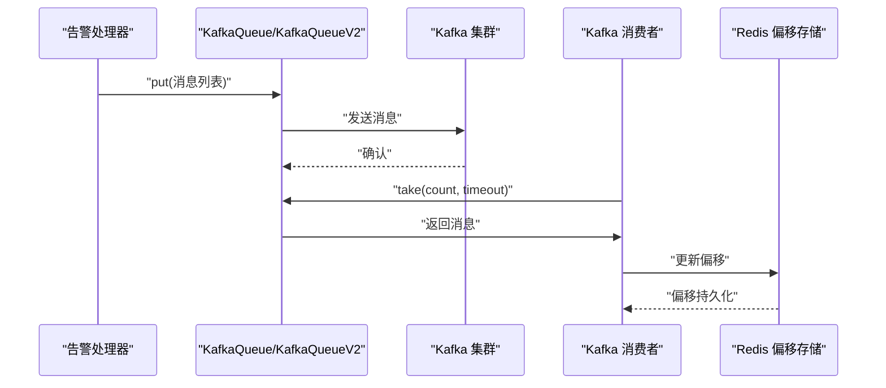
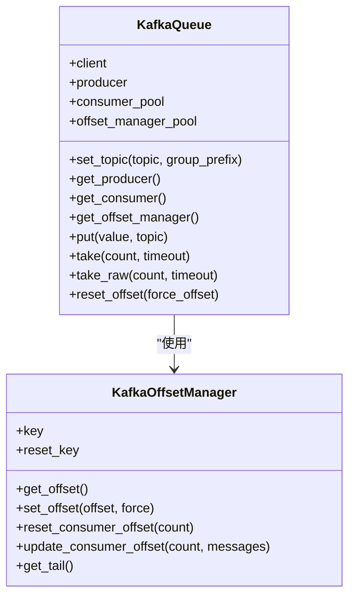
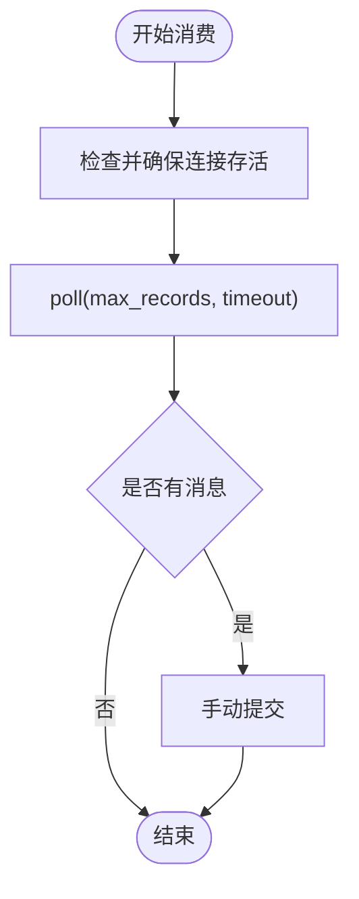
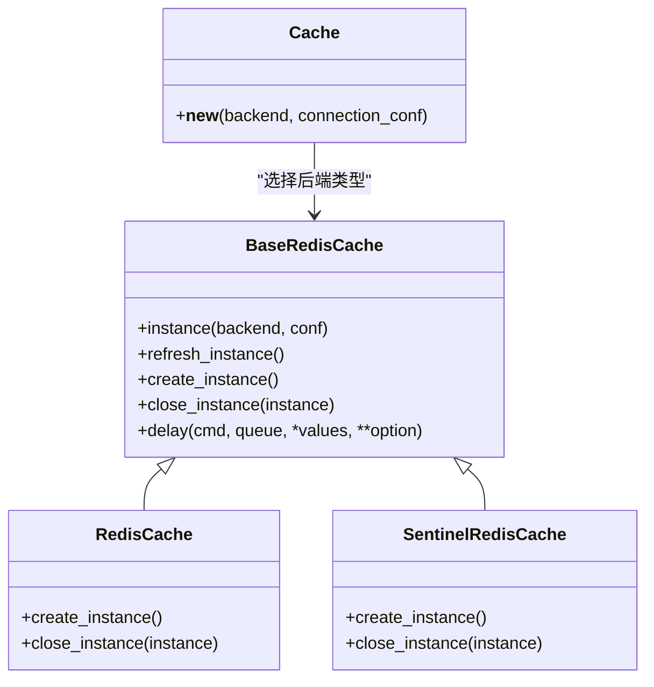
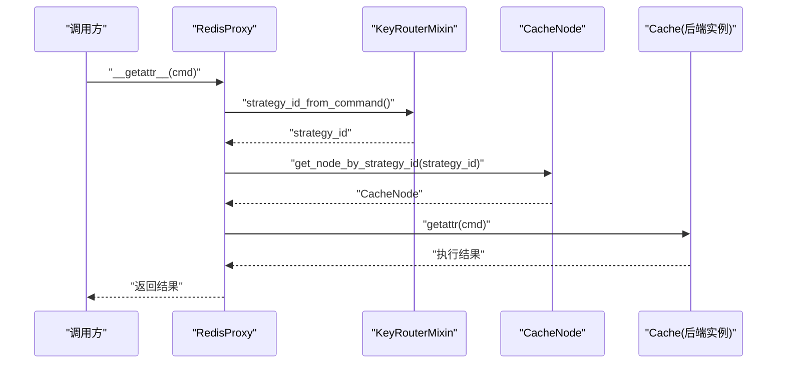
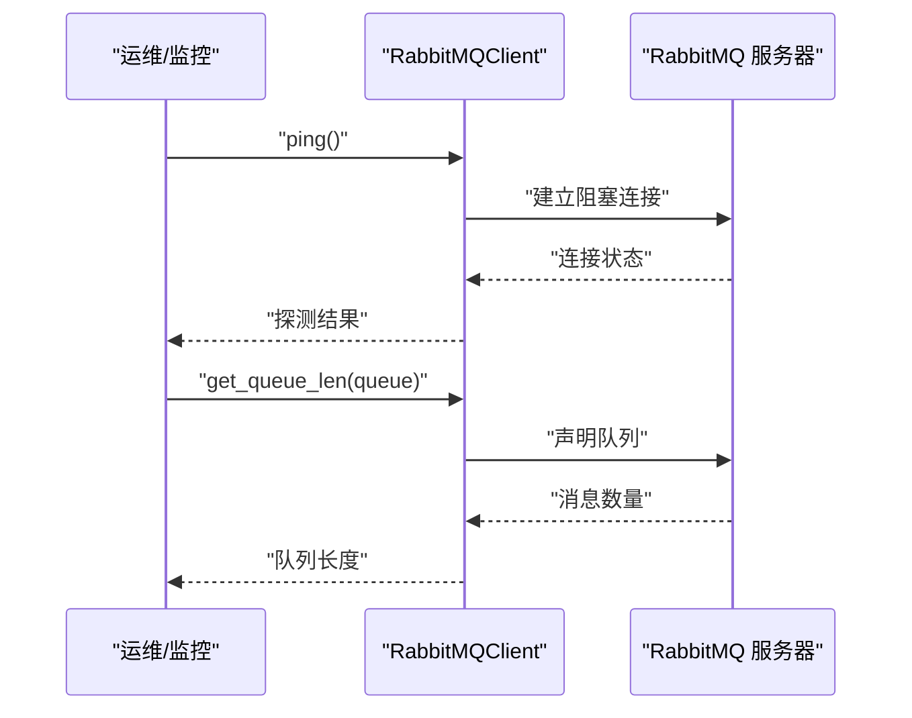
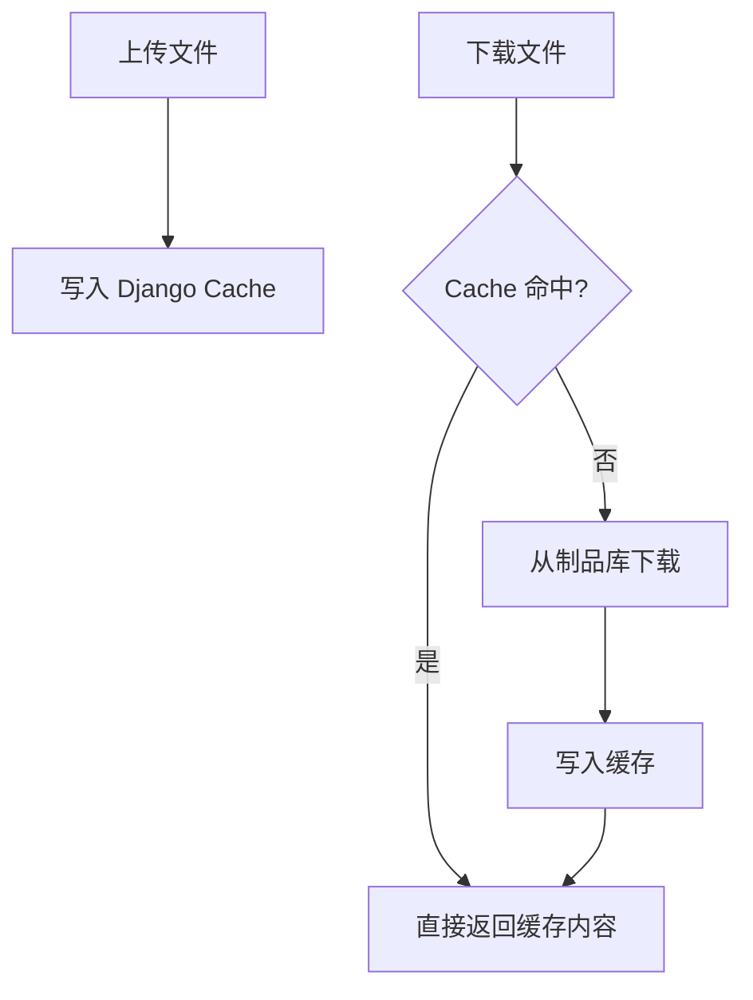
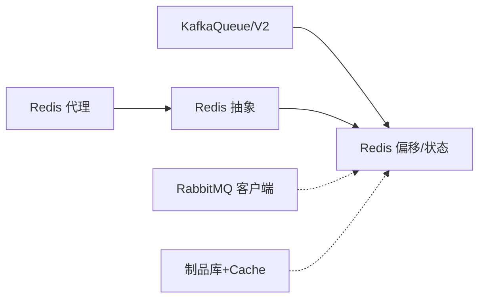

# 存储层抽象

<cite>
**本文引用的文件**
- [kafka.py](file://bkmonitor/alarm_backends/core/storage/kafka.py)
- [kafka_v2.py](file://bkmonitor/alarm_backends/core/storage/kafka_v2.py)
- [rabbitmq.py](file://bkmonitor/alarm_backends/core/storage/rabbitmq.py)
- [redis.py](file://bkmonitor/alarm_backends/core/storage/redis.py)
- [redis_cluster.py](file://bkmonitor/alarm_backends/core/storage/redis_cluster.py)
- [storage.py](file://bkmonitor/bkmonitor/commons/storage.py)
</cite>

## 目录
1. [简介](#简介)
2. [项目结构](#项目结构)
3. [核心组件](#核心组件)
4. [架构总览](#架构总览)
5. [组件详细分析](#组件详细分析)
6. [依赖关系分析](#依赖关系分析)
7. [性能考量](#性能考量)
8. [故障排查指南](#故障排查指南)
9. [结论](#结论)
10. [附录](#附录)

## 简介
本技术文档聚焦于告警系统中的存储层抽象与统一接口实现，系统性阐述 Kafka 消息队列、Redis 缓存存储、RabbitMQ 消息中间件的集成方式与使用场景；同时覆盖存储客户端的连接管理、数据序列化与错误重试机制，并给出性能优化策略、容量规划与故障恢复方法，辅以配置要点与最佳实践，帮助开发者在多种存储介质间做出合理选择并高效集成。

## 项目结构
存储层抽象主要分布在告警后端的 core/storage 目录下，围绕 Kafka、Redis、RabbitMQ 三类介质提供统一的生产/消费与偏移管理能力；同时在通用模块中提供基于 Django Cache 的文件存储封装，便于制品库与缓存的协同使用。

图示来源
- [kafka.py:26-176](file://bkmonitor/alarm_backends/core/storage/kafka.py#L26-L176)
- [kafka_v2.py:24-157](file://bkmonitor/alarm_backends/core/storage/kafka_v2.py#L24-L157)
- [redis.py:98-326](file://bkmonitor/alarm_backends/core/storage/redis.py#L98-L326)
- [redis_cluster.py:108-226](file://bkmonitor/alarm_backends/core/storage/redis_cluster.py#L108-L226)
- [rabbitmq.py:23-79](file://bkmonitor/alarm_backends/core/storage/rabbitmq.py#L23-L79)
- [storage.py:18-71](file://bkmonitor/bkmonitor/commons/storage.py#L18-L71)

章节来源
- [kafka.py:1-262](file://bkmonitor/alarm_backends/core/storage/kafka.py#L1-L262)
- [kafka_v2.py:1-157](file://bkmonitor/alarm_backends/core/storage/kafka_v2.py#L1-L157)
- [redis.py:1-326](file://bkmonitor/alarm_backends/core/storage/redis.py#L1-L326)
- [redis_cluster.py:1-226](file://bkmonitor/alarm_backends/core/storage/redis_cluster.py#L1-L226)
- [rabbitmq.py:1-79](file://bkmonitor/alarm_backends/core/storage/rabbitmq.py#L1-L79)
- [storage.py:1-71](file://bkmonitor/bkmonitor/commons/storage.py#L1-L71)

## 核心组件
- Kafka 生产/消费与偏移管理：提供基于 SimpleClient/SimpleConsumer 的旧版实现与基于 kafka-python 的新版实现，均支持消费者池、偏移持久化、重试与自动提交控制。
- Redis 缓存抽象：统一 Redis 与哨兵模式的连接与命令调用，提供只读/主写分离、连接刷新、延迟队列等能力。
- Redis 集群/哨兵代理：按策略 ID 路由到具体节点，支持管道执行与跨节点聚合结果。
- RabbitMQ 客户端：提供连接探测、队列长度查询与消费启动能力。
- Django Cache + 制品库封装：对通用制品文件进行缓存与回源下载，结合 Django Cache 提升访问效率。

章节来源
- [kafka.py:26-176](file://bkmonitor/alarm_backends/core/storage/kafka.py#L26-L176)
- [kafka_v2.py:24-157](file://bkmonitor/alarm_backends/core/storage/kafka_v2.py#L24-L157)
- [redis.py:98-326](file://bkmonitor/alarm_backends/core/storage/redis.py#L98-L326)
- [redis_cluster.py:108-226](file://bkmonitor/alarm_backends/core/storage/redis_cluster.py#L108-L226)
- [rabbitmq.py:23-79](file://bkmonitor/alarm_backends/core/storage/rabbitmq.py#L23-L79)
- [storage.py:18-71](file://bkmonitor/bkmonitor/commons/storage.py#L18-L71)

## 架构总览
存储层通过统一的抽象接口屏蔽底层差异，上层业务仅需面向 Topic/Queue 名称与键空间语义即可完成数据的可靠投递与消费。Kafka 作为告警事件的主要通道，配合 Redis 实现偏移与状态持久；Redis 既承担缓存也承担队列/延迟队列等角色；RabbitMQ 提供轻量级消息能力与健康探测；制品库与 Django Cache 协同提升静态资源访问性能。

图示来源
- [kafka.py:127-176](file://bkmonitor/alarm_backends/core/storage/kafka.py#L127-L176)
- [kafka_v2.py:147-157](file://bkmonitor/alarm_backends/core/storage/kafka_v2.py#L147-L157)
- [redis.py:196-221](file://bkmonitor/alarm_backends/core/storage/redis.py#L196-L221)

## 组件详细分析

### Kafka 存储抽象
- 连接与生命周期
  - 旧版 KafkaQueue 使用 SimpleClient/SimpleProducer，具备定时重连与消费者池复用；消费者创建带最大重试次数与元数据加载校验。
  - 新版 KafkaQueueV2 使用 kafka.KafkaConsumer，支持多主机、分区轮询分配策略、手动提交与连接存活检测。
- 偏移管理
  - KafkaOffsetManager 将消费偏移持久化至 Redis，支持首次消费位置计算、重置点与尾部游标对齐。
- 错误处理与重试
  - 生产侧对 FailedPayloadsError 进行幂等重试；消费侧对 OffsetOutOfRangeError 进行回溯并重试；自动提交失败进行告警。
- 数据序列化
  - 消息体为原始字节/字符串，上层负责序列化；消费返回原始消息值，便于解耦序列化策略。

图示来源
- [kafka.py:26-176](file://bkmonitor/alarm_backends/core/storage/kafka.py#L26-L176)
- [kafka.py:178-262](file://bkmonitor/alarm_backends/core/storage/kafka.py#L178-L262)

章节来源
- [kafka.py:26-176](file://bkmonitor/alarm_backends/core/storage/kafka.py#L26-L176)
- [kafka.py:178-262](file://bkmonitor/alarm_backends/core/storage/kafka.py#L178-L262)

### Kafka 新版实现（kafka_v2）
- 连接与分区
  - 支持多主机 bootstrap、轮询分区分配、会话/轮询间隔与分区拉取大小可调。
- 健壮性
  - 主动检测消费者连接状态并在断连时重建；提供分区重新分配检测。
- 提交策略
  - 显式手动提交，确保可靠性；poll 结果聚合后一次性提交。

图示来源
- [kafka_v2.py:107-157](file://bkmonitor/alarm_backends/core/storage/kafka_v2.py#L107-L157)

章节来源
- [kafka_v2.py:24-157](file://bkmonitor/alarm_backends/core/storage/kafka_v2.py#L24-L157)

### Redis 缓存抽象
- 后端类型与路由
  - 支持 Celery、Service、Queue、Cache、Log 五类后端，可通过环境变量按模块路由到不同实例。
- 连接与实例
  - BaseRedisCache 提供单例化实例获取、只读/主写分离、连接刷新与命令重试。
  - RedisCache 与 SentinelRedisCache 分别适配直连与哨兵模式，支持随机哨兵节点与超时配置。
- 延迟队列
  - delay 接口将任务写入有序集合与哈希存储，配合外部调度器实现延时执行。

图示来源
- [redis.py:98-326](file://bkmonitor/alarm_backends/core/storage/redis.py#L98-L326)

章节来源
- [redis.py:98-326](file://bkmonitor/alarm_backends/core/storage/redis.py#L98-L326)

### Redis 集群/哨兵代理（KeyRouter/Pipeline）
- 节点与路由
  - RedisNode/SentinelRedisNode 表达直连与哨兵节点，按后端类型生成连接配置。
  - RedisProxy 根据策略 ID 计算路由，动态选择节点并复用客户端实例。
- 管道与聚合
  - PipelineProxy 在各节点上构建管道，按命令栈顺序聚合返回结果，保证上层调用语义一致。

图示来源
- [redis_cluster.py:108-143](file://bkmonitor/alarm_backends/core/storage/redis_cluster.py#L108-L143)
- [redis_cluster.py:195-226](file://bkmonitor/alarm_backends/core/storage/redis_cluster.py#L195-L226)

章节来源
- [redis_cluster.py:108-226](file://bkmonitor/alarm_backends/core/storage/redis_cluster.py#L108-L226)

### RabbitMQ 客户端
- 连接与探测
  - 从 broker_url 解析连接参数，支持 ping 探测与队列长度查询。
- 消费流程
  - 声明持久化队列，注册回调并启动消费；捕获 Broker 关闭异常以便上层处理。

图示来源
- [rabbitmq.py:40-79](file://bkmonitor/alarm_backends/core/storage/rabbitmq.py#L40-L79)

章节来源
- [rabbitmq.py:23-79](file://bkmonitor/alarm_backends/core/storage/rabbitmq.py#L23-L79)

### Django Cache + 制品库封装
- 功能
  - 上传文件时同步写入 Django Cache，下载时优先命中缓存，未命中则回源制品库并写入缓存。
- 适用场景
  - 图标/Logo 等静态资源的高频读取与低频更新场景，降低制品库压力。

图示来源
- [storage.py:18-71](file://bkmonitor/bkmonitor/commons/storage.py#L18-L71)

章节来源
- [storage.py:18-71](file://bkmonitor/bkmonitor/commons/storage.py#L18-L71)

## 依赖关系分析
- 组件内聚与耦合
  - Kafka 与 Redis 偏移管理强耦合，确保消费进度可靠；Redis 抽象向上层屏蔽连接细节。
  - RabbitMQ 客户端与 Kafka/Redis 解耦，仅提供基础连接与消费能力。
  - 制品库封装与 Django Cache 解耦，通过统一接口实现缓存与回源。
- 外部依赖
  - Kafka 客户端库、pika、redis-py、redis.sentinel。
- 循环依赖
  - 未见明显循环导入；延迟队列在 Redis 抽象内部被引用，属于单向依赖。

图示来源
- [kafka.py:178-262](file://bkmonitor/alarm_backends/core/storage/kafka.py#L178-L262)
- [kafka_v2.py:24-157](file://bkmonitor/alarm_backends/core/storage/kafka_v2.py#L24-L157)
- [redis.py:98-326](file://bkmonitor/alarm_backends/core/storage/redis.py#L98-L326)
- [redis_cluster.py:108-226](file://bkmonitor/alarm_backends/core/storage/redis_cluster.py#L108-L226)
- [rabbitmq.py:23-79](file://bkmonitor/alarm_backends/core/storage/rabbitmq.py#L23-L79)
- [storage.py:18-71](file://bkmonitor/bkmonitor/commons/storage.py#L18-L71)

章节来源
- [kafka.py:1-262](file://bkmonitor/alarm_backends/core/storage/kafka.py#L1-L262)
- [kafka_v2.py:1-157](file://bkmonitor/alarm_backends/core/storage/kafka_v2.py#L1-L157)
- [redis.py:1-326](file://bkmonitor/alarm_backends/core/storage/redis.py#L1-L326)
- [redis_cluster.py:1-226](file://bkmonitor/alarm_backends/core/storage/redis_cluster.py#L1-L226)
- [rabbitmq.py:1-79](file://bkmonitor/alarm_backends/core/storage/rabbitmq.py#L1-L79)
- [storage.py:1-71](file://bkmonitor/bkmonitor/commons/storage.py#L1-L71)

## 性能考量
- Kafka
  - 批量推送：按批次大小分批发送，减少网络往返与元数据压力。
  - 消费端优化：增大分区拉取量、调整会话/轮询间隔、启用手动提交；对连接断线主动重建。
  - 偏移持久化：使用 Redis 持久化偏移，避免重复消费与丢失。
- Redis
  - 连接池与实例复用：通过单例与客户端池减少握手成本。
  - 哨兵高可用：随机哨兵节点与主从分离，提升可用性与读写分离。
  - 管道执行：批量命令合并，降低 RTT。
- RabbitMQ
  - 持久化队列与手动确认，保障消息不丢失；合理设置 prefetch 控制并发。
- 制品库与缓存
  - 高频静态资源走缓存，降低制品库 QPS；设置合理过期时间与回源策略。

## 故障排查指南
- Kafka
  - 元数据加载失败：检查主题是否存在、消费者组权限与网络连通性；查看消费者池键冲突与重试日志。
  - 偏移越界：遇到越界时回退到末尾并重试；确认自动提交开关与提交频率。
  - 连接断开：新版实现具备主动检测与重建能力；旧版通过定时重连维持可用。
- Redis
  - 连接异常：触发实例刷新与重试；检查哨兵密码、主名与节点可达性。
  - 延迟队列异常：核对有序集合与哈希存储键空间，确认调度器运行状态。
- RabbitMQ
  - Broker 关闭：捕获 ChannelClosedByBroker 并上报；检查队列声明与凭证。
- 制品库
  - 上传/下载失败：检查制品库鉴权与网络；确认缓存键命名规则与过期时间。

章节来源
- [kafka.py:100-176](file://bkmonitor/alarm_backends/core/storage/kafka.py#L100-L176)
- [kafka_v2.py:67-99](file://bkmonitor/alarm_backends/core/storage/kafka_v2.py#L67-L99)
- [redis.py:177-196](file://bkmonitor/alarm_backends/core/storage/redis.py#L177-L196)
- [rabbitmq.py:65-79](file://bkmonitor/alarm_backends/core/storage/rabbitmq.py#L65-L79)
- [storage.py:18-71](file://bkmonitor/bkmonitor/commons/storage.py#L18-L71)

## 结论
存储层抽象通过统一接口屏蔽 Kafka、Redis、RabbitMQ 的差异，结合 Redis 偏移持久化与连接重试机制，形成高可用、可扩展的告警数据通路。针对不同场景选择合适介质与参数配置，配合缓存与延迟队列策略，可在保证可靠性的同时获得良好性能表现。

## 附录
- 配置要点（示例性说明）
  - Kafka
    - 生产端：批量大小、超时、自动提交开关；消费者端：分区分配策略、拉取大小、会话/轮询间隔。
  - Redis
    - 后端类型：直连或哨兵；哨兵节点、主名、密码与 socket 超时；按模块路由的环境变量。
  - RabbitMQ
    - broker_url 解析参数；队列声明与持久化；手动确认与回调注册。
  - 制品库
    - 缓存键命名规范、过期时间、上传/下载流程与回源策略。
- 最佳实践
  - Kafka：主题分区数与消费者组规模匹配；偏移管理与手动提交；连接断线主动重建。
  - Redis：实例池与只读分离；哨兵随机化；管道批量执行；延迟队列键空间清晰。
  - RabbitMQ：持久化队列与手动确认；合理 prefetch；异常捕获与告警。
  - 制品库：静态资源高频读取走缓存；低频更新回源；缓存键与过期策略明确。