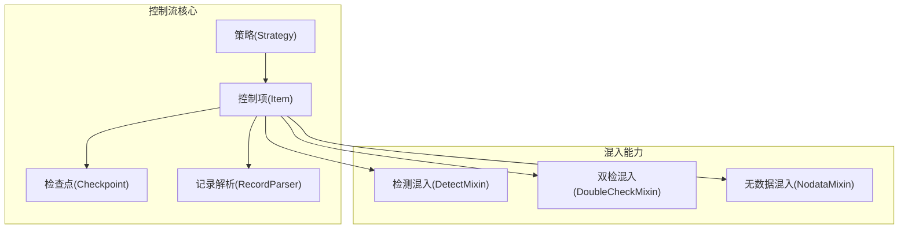
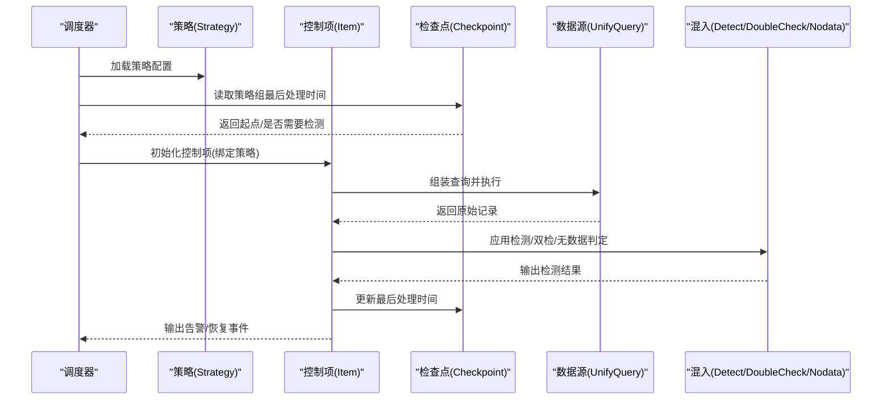
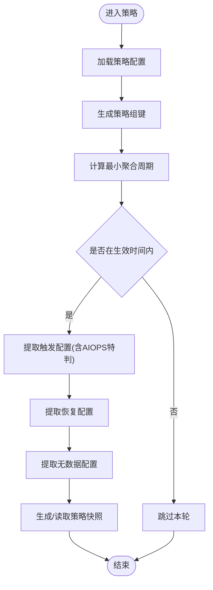
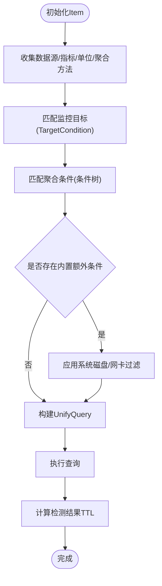
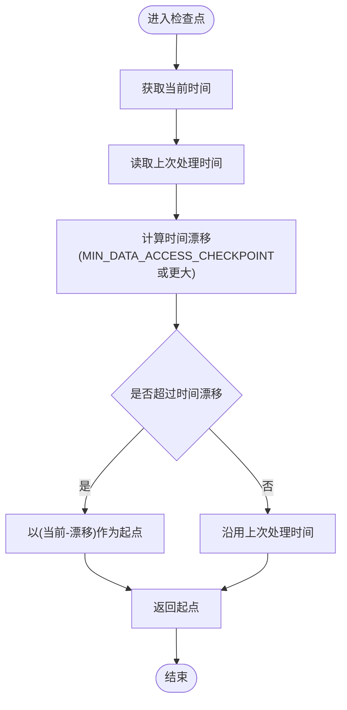
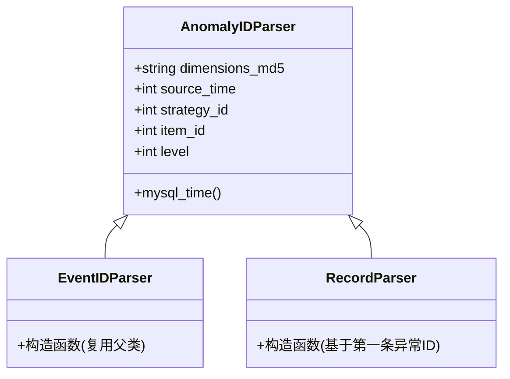
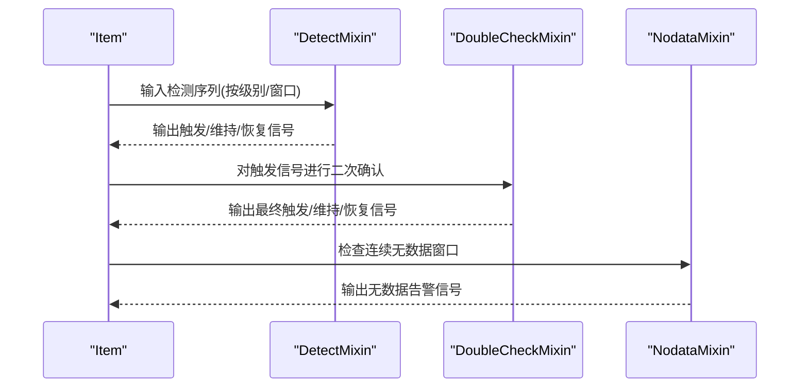
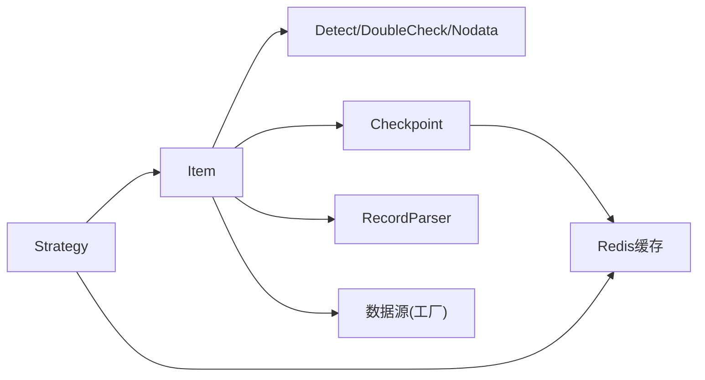

# 控制流管理

<cite>
**本文引用的文件**
- [checkpoint.py](file://bkmonitor/alarm_backends/core/control/checkpoint.py)
- [item.py](file://bkmonitor/alarm_backends/core/control/item.py)
- [strategy.py](file://bkmonitor/alarm_backends/core/control/strategy.py)
- [record_parser.py](file://bkmonitor/alarm_backends/core/control/record_parser.py)
- [detect.py](file://bkmonitor/alarm_backends/core/control/mixins/detect.py)
- [double_check.py](file://bkmonitor/alarm_backends/core/control/mixins/double_check.py)
- [nodata.py](file://bkmonitor/alarm_backends/core/control/mixins/nodata.py)
- [__init__.py](file://bkmonitor/alarm_backends/core/control/__init__.py)
</cite>

## 目录
1. [简介](#简介)
2. [项目结构](#项目结构)
3. [核心组件](#核心组件)
4. [架构总览](#架构总览)
5. [详细组件分析](#详细组件分析)
6. [依赖分析](#依赖分析)
7. [性能考虑](#性能考虑)
8. [故障排查指南](#故障排查指南)
9. [结论](#结论)
10. [附录](#附录)

## 简介
本技术文档围绕“控制流管理系统”展开，聚焦告警控制流的状态机设计、流程控制与异常处理机制，系统性阐述控制项的执行顺序、检查点管理与记录解析逻辑，并深入说明策略控制的实现原理、流程分支与条件判断机制。文档还提供监控方法、调试技巧与性能优化策略，并辅以流程图与代码示例路径，帮助开发者快速理解告警控制流的执行逻辑与故障排查方法。

## 项目结构
控制流管理位于 alarm_backends 子系统中，核心模块包括：
- 策略层：策略加载、配置解析、生效时间与日历校验、触发/恢复配置提取等
- 控制项层：数据源抽象、查询封装、维度匹配、算法类型识别等
- 检查点层：基于 Redis 的策略组最后处理时间缓存与拉取起点计算
- 记录解析层：异常/事件/数据记录 ID 解析与字段映射
- 混入层：检测、双检、无数据等通用能力的可插拔扩展

图表来源
- [strategy.py:33-384](file://bkmonitor/alarm_backends/core/control/strategy.py#L33-L384)
- [item.py:51-277](file://bkmonitor/alarm_backends/core/control/item.py#L51-L277)
- [checkpoint.py:21-60](file://bkmonitor/alarm_backends/core/control/checkpoint.py#L21-L60)
- [record_parser.py:18-87](file://bkmonitor/alarm_backends/core/control/record_parser.py#L18-L87)
- [detect.py](file://bkmonitor/alarm_backends/core/control/mixins/detect.py)
- [double_check.py](file://bkmonitor/alarm_backends/core/control/mixins/double_check.py)
- [nodata.py](file://bkmonitor/alarm_backends/core/control/mixins/nodata.py)

章节来源
- [__init__.py:1-11](file://bkmonitor/alarm_backends/core/control/__init__.py#L1-L11)

## 核心组件
- 策略(Strategy)：负责策略配置缓存获取、策略组键生成、周期计算、生效时间与日历校验、触发/恢复/无数据配置提取、快照生成与读取等。
- 控制项(Item)：封装单个监控项的数据源、查询表达式、维度匹配、算法类型、聚合方法与周期等；提供统一查询接口与检测结果过期 TTL 计算。
- 检查点(Checkpoint)：以 Redis 键空间维护每个策略组的最后处理时间，提供起点计算、是否需要检测等判定。
- 记录解析(RecordParser)：对异常/事件/数据记录 ID 进行解析，抽取维度 md5、时间戳、策略/监控项/级别等关键字段。
- 混入(DetectMixin/DoubleCheckMixin/NodataMixin)：为 Item 提供检测、双检与无数据告警的通用能力，支持按级别与窗口大小进行流程分支与条件判断。

章节来源
- [strategy.py:33-384](file://bkmonitor/alarm_backends/core/control/strategy.py#L33-L384)
- [item.py:51-277](file://bkmonitor/alarm_backends/core/control/item.py#L51-L277)
- [checkpoint.py:21-60](file://bkmonitor/alarm_backends/core/control/checkpoint.py#L21-L60)
- [record_parser.py:18-87](file://bkmonitor/alarm_backends/core/control/record_parser.py#L18-L87)

## 架构总览
控制流由“策略-控制项-检查点-记录解析-混入能力”构成，形成一条闭环：策略决定周期与配置，控制项负责数据查询与维度匹配，检查点保障拉取节奏与去重，记录解析用于异常/事件溯源，混入能力提供检测与恢复判定。

图表来源
- [strategy.py:33-137](file://bkmonitor/alarm_backends/core/control/strategy.py#L33-L137)
- [item.py:99-115](file://bkmonitor/alarm_backends/core/control/item.py#L99-L115)
- [checkpoint.py:31-60](file://bkmonitor/alarm_backends/core/control/checkpoint.py#L31-L60)
- [detect.py](file://bkmonitor/alarm_backends/core/control/mixins/detect.py)
- [double_check.py](file://bkmonitor/alarm_backends/core/control/mixins/double_check.py)
- [nodata.py](file://bkmonitor/alarm_backends/core/control/mixins/nodata.py)

## 详细组件分析

### 策略(Strategy)状态机与流程控制
- 状态入口：策略配置缓存获取、策略组键生成、周期计算、生效时间与日历校验。
- 流程分支：
  - 触发配置：按级别提取 check_window_size 与 trigger_count；若全为 AIOPS 算法则强制窗口大小与计数为固定值。
  - 恢复配置：按级别提取 check_window_size 与状态设置器。
  - 无数据配置：按连续窗口与级别提取触发参数。
  - 生效时间：支持跨天时间范围、日历生效/不生效优先级处理。
- 异常处理：当策略项缺失或配置异常时，抛出策略项未找到异常并记录告警日志。

图表来源
- [strategy.py:33-384](file://bkmonitor/alarm_backends/core/control/strategy.py#L33-L384)

章节来源
- [strategy.py:33-384](file://bkmonitor/alarm_backends/core/control/strategy.py#L33-L384)

### 控制项(Item)执行顺序与维度匹配
- 执行顺序：
  1) 初始化：收集数据源标签/类型、单位、指标 ID、聚合方法与周期。
  2) 维度匹配：依次匹配监控目标、聚合条件、内置额外条件（如系统磁盘/网卡过滤）。
  3) 查询封装：使用 UnifyQuery 组装多数据源表达式与函数。
  4) 检测结果 TTL：根据策略配置计算检测结果保留点数与过期时间。
- 维度匹配逻辑：
  - 目标条件：基于 TargetCondition 判定。
  - 聚合条件：将条件树转换为可匹配对象，实时聚合场景下若存在高级条件则不重复匹配。
  - 内置额外条件：针对系统磁盘/网络类型自动注入过滤条件。

图表来源
- [item.py:51-277](file://bkmonitor/alarm_backends/core/control/item.py#L51-L277)

章节来源
- [item.py:51-277](file://bkmonitor/alarm_backends/core/control/item.py#L51-L277)

### 检查点(Checkpoint)与拉取节奏
- 功能职责：缓存策略组最后处理时间，提供起点计算与是否需要检测的判定。
- 起点策略：
  - 若距离上次处理超过阈值（随周期与最小阈值动态调整），则以“当前时间-时间漂移”作为起点。
  - 否则沿用上次处理时间。
- 判定逻辑：比较当前时间与缓存时间，决定是否继续拉取。

图表来源
- [checkpoint.py:37-59](file://bkmonitor/alarm_backends/core/control/checkpoint.py#L37-L59)

章节来源
- [checkpoint.py:21-60](file://bkmonitor/alarm_backends/core/control/checkpoint.py#L21-L60)

### 记录解析(RecordParser)与溯源
- 异常/事件 ID 解析：从字符串中拆分维度 md5、时间戳、策略 ID、监控项 ID、级别等字段。
- 数据记录解析：从记录中抽取 anomaly 字段内的异常 ID 并复用解析器，便于后续事件/告警关联与回溯。

图表来源
- [record_parser.py:18-87](file://bkmonitor/alarm_backends/core/control/record_parser.py#L18-L87)

章节来源
- [record_parser.py:18-87](file://bkmonitor/alarm_backends/core/control/record_parser.py#L18-L87)

### 混入能力与流程分支
- 检测混入(DetectMixin)：按级别与检测窗口进行连续满足判定，结合触发计数与恢复窗口实现告警/恢复状态切换。
- 双检混入(DoubleCheckMixin)：在检测基础上增加二次确认，降低误报率。
- 无数据混入(NodataMixin)：基于连续无数据窗口触发无数据告警，支持指定级别。

图表来源
- [detect.py](file://bkmonitor/alarm_backends/core/control/mixins/detect.py)
- [double_check.py](file://bkmonitor/alarm_backends/core/control/mixins/double_check.py)
- [nodata.py](file://bkmonitor/alarm_backends/core/control/mixins/nodata.py)

## 依赖分析
- 组件耦合：
  - Item 依赖 Strategy 提供的配置与周期信息，以及混入能力提供的检测/双检/无数据判定。
  - Checkpoint 与 Item 通过策略组键建立弱耦合，仅依赖 Redis 客户端与键空间。
  - RecordParser 依赖异常/事件 ID 规范，与 Item 的输出保持一致。
- 外部依赖：
  - 数据源抽象：通过数据源工厂加载具体实现，统一查询接口。
  - 缓存：策略快照、检查点均依赖 Redis 客户端与键空间。
  - 时间工具：统一使用时间工具库进行本地化格式化与转换。

图表来源
- [strategy.py:33-137](file://bkmonitor/alarm_backends/core/control/strategy.py#L33-L137)
- [item.py:51-115](file://bkmonitor/alarm_backends/core/control/item.py#L51-L115)
- [checkpoint.py:21-35](file://bkmonitor/alarm_backends/core/control/checkpoint.py#L21-L35)
- [record_parser.py:18-31](file://bkmonitor/alarm_backends/core/control/record_parser.py#L18-L31)

## 性能考虑
- 拉取节奏控制：通过检查点的时间漂移策略避免频繁拉取，长周期场景下自适应扩大起点偏移，减少无效 IO。
- 维度匹配优化：实时聚合场景下若数据源已具备高级过滤条件，则跳过重复匹配，降低 CPU 开销。
- 检测结果 TTL：根据触发/恢复窗口大小与级别计算检测结果保留点数，避免过长历史占用内存。
- 缓存利用：策略快照与检查点均采用 Redis 缓存，减少数据库访问压力。
- 查询封装：统一使用 UnifyQuery 将多数据源表达式与函数封装，减少重复解析成本。

## 故障排查指南
- 策略项缺失：当异常点对应的监控项在策略快照中找不到时，会记录警告并抛出策略项未找到异常，需核对策略配置与快照一致性。
- 生效时间异常：若策略未配置生效时间范围或日历冲突，可能导致策略不生效或误生效，需检查 uptime、日历配置与本地化时间格式。
- 维度匹配失败：若目标条件或聚合条件未正确匹配，建议检查 TargetCondition 与条件树构建逻辑，确认字段名与方法是否一致。
- 检查点异常：若检查点长时间未更新或拉取起点异常，需检查 Redis 客户端连接、键空间命名与 TTL 设置。
- 记录解析错误：异常/事件 ID 格式不规范会导致解析失败，需确保 ID 生成遵循“维度md5.时间戳.策略ID.监控项ID.级别”的约定。

章节来源
- [strategy.py:296-299](file://bkmonitor/alarm_backends/core/control/strategy.py#L296-L299)
- [item.py:233-250](file://bkmonitor/alarm_backends/core/control/item.py#L233-L250)
- [checkpoint.py:37-59](file://bkmonitor/alarm_backends/core/control/checkpoint.py#L37-L59)
- [record_parser.py:18-38](file://bkmonitor/alarm_backends/core/control/record_parser.py#L18-L38)

## 结论
控制流管理系统通过“策略-控制项-检查点-记录解析-混入能力”的协同，实现了高效、可扩展且可追溯的告警控制流。策略层提供灵活的生效时间与配置管理，控制项层承担数据查询与维度匹配，检查点层保障拉取节奏，记录解析层提供溯源能力，混入层实现检测、双检与无数据的通用判定。配合合理的性能优化与完善的故障排查手段，系统能够在高并发场景下稳定运行并快速定位问题。

## 附录
- 代码示例路径（不含具体代码内容）：
  - 策略配置加载与生效时间校验：[strategy.py:33-237](file://bkmonitor/alarm_backends/core/control/strategy.py#L33-L237)
  - 控制项初始化与维度匹配：[item.py:51-250](file://bkmonitor/alarm_backends/core/control/item.py#L51-L250)
  - 检查点起点计算与判定：[checkpoint.py:37-59](file://bkmonitor/alarm_backends/core/control/checkpoint.py#L37-L59)
  - 记录解析器异常/事件/数据记录解析：[record_parser.py:18-87](file://bkmonitor/alarm_backends/core/control/record_parser.py#L18-L87)
  - 检测/双检/无数据混入接口定义：[detect.py](file://bkmonitor/alarm_backends/core/control/mixins/detect.py)、[double_check.py](file://bkmonitor/alarm_backends/core/control/mixins/double_check.py)、[nodata.py](file://bkmonitor/alarm_backends/core/control/mixins/nodata.py)