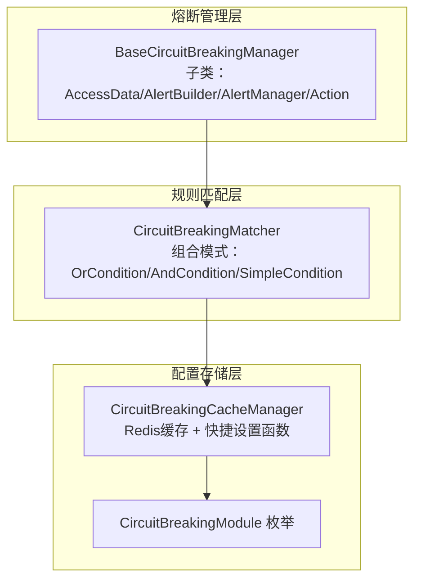
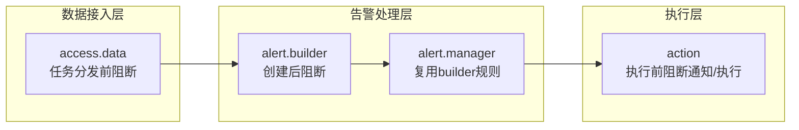
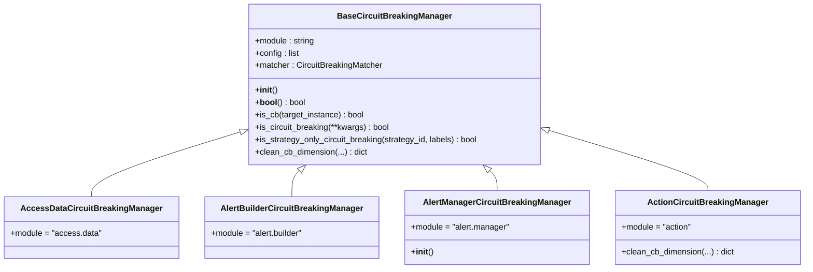
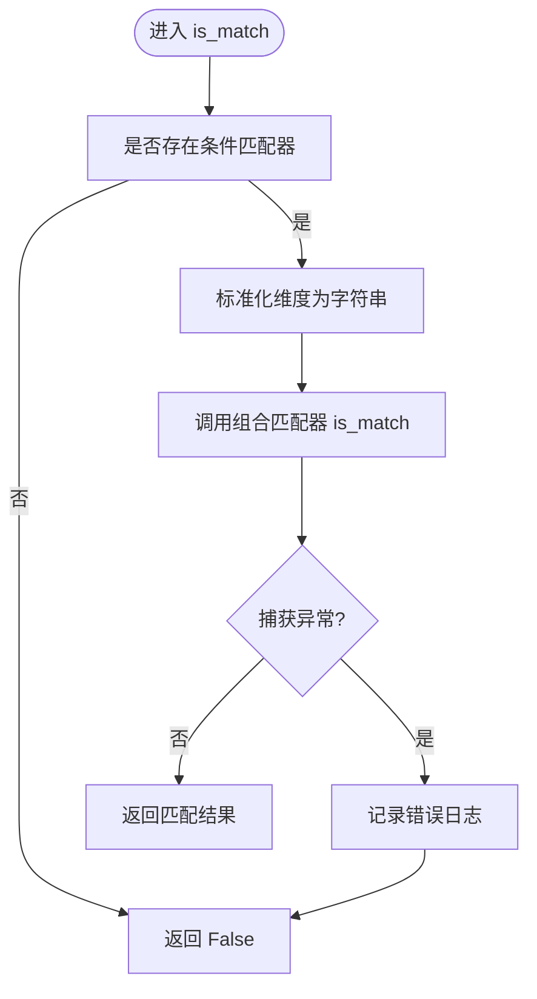
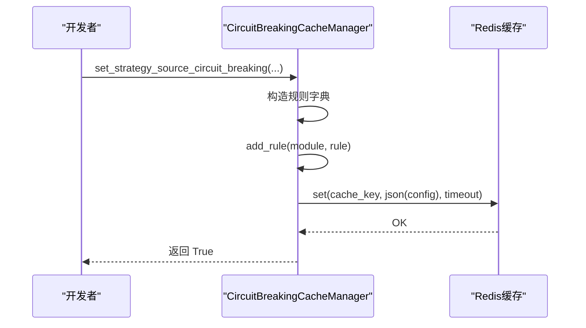
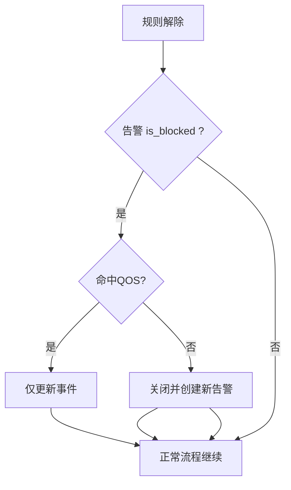
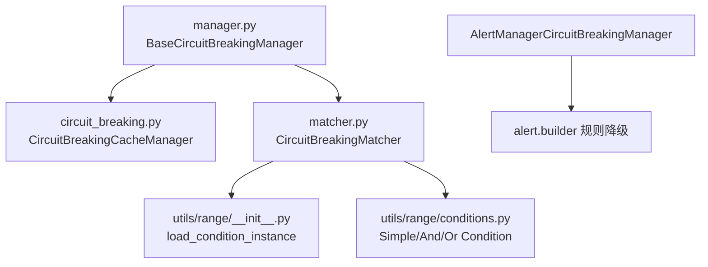

# 熔断机制

<cite>
**本文引用的文件**
- [manager.py](file://bkmonitor/alarm_backends/core/circuit_breaking/manager.py)
- [matcher.py](file://bkmonitor/alarm_backends/core/circuit_breaking/matcher.py)
- [circuit_breaking.py](file://bkmonitor/alarm_backends/core/cache/circuit_breaking.py)
- [__init__.py（熔断模块说明）](file://bkmonitor/alarm_backends/core/circuit_breaking/__init__.py)
- [circuit_breaking_experience.md](file://bkmonitor/ai-learning-docs/circuit_breaking_experience.md)
- [test_access_data_manager.py](file://bkmonitor/alarm_backends/core/circuit_breaking/test_access_data_manager.py)
- [run_test.py](file://bkmonitor/alarm_backends/core/circuit_breaking/run_test.py)
</cite>

## 目录
1. [简介](#简介)
2. [项目结构](#项目结构)
3. [核心组件](#核心组件)
4. [架构总览](#架构总览)
5. [详细组件分析](#详细组件分析)
6. [依赖分析](#依赖分析)
7. [性能考虑](#性能考虑)
8. [故障排查指南](#故障排查指南)
9. [结论](#结论)
10. [附录](#附录)

## 简介
本技术文档围绕告警系统中的熔断机制展开，系统性阐述熔断器设计、触发条件与保护策略；详解熔断管理器的工作原理、状态转换与恢复机制；说明匹配器的实现逻辑、熔断条件判断与动态配置更新能力。文档还提供参数调优建议、监控指标与故障预防策略，并给出具体配置示例与使用场景，帮助开发者快速落地有效的系统保护机制。

## 项目结构
熔断机制由三层协同组成：
- 熔断管理层：负责模块化熔断判定与维度清洗，按模块隔离策略。
- 规则匹配层：基于统一条件匹配器，支持复杂逻辑表达式与多种匹配方法。
- 配置存储层：通过缓存管理器集中管理各模块熔断配置，支持动态更新与快捷设置。

图表来源
- [manager.py:20-193](file://bkmonitor/alarm_backends/core/circuit_breaking/manager.py#L20-L193)
- [matcher.py:18-245](file://bkmonitor/alarm_backends/core/circuit_breaking/matcher.py#L18-L245)
- [circuit_breaking.py:24-591](file://bkmonitor/alarm_backends/core/cache/circuit_breaking.py#L24-L591)

章节来源
- [manager.py:1-193](file://bkmonitor/alarm_backends/core/circuit_breaking/manager.py#L1-L193)
- [matcher.py:1-245](file://bkmonitor/alarm_backends/core/circuit_breaking/matcher.py#L1-L245)
- [circuit_breaking.py:1-591](file://bkmonitor/alarm_backends/core/cache/circuit_breaking.py#L1-L591)

## 核心组件
- 熔断管理器（BaseCircuitBreakingManager 及其子类）
  - 负责拉取模块配置、构造匹配器、清洗维度、执行熔断判定。
  - 提供针对数据源、策略级别等不同粒度的判定接口。
- 规则匹配器（CircuitBreakingMatcher）
  - 支持多种匹配方法与 AND/OR 组合，构建条件树进行高效匹配。
- 配置缓存管理器（CircuitBreakingCacheManager）
  - 提供模块化配置的增删改查、快捷设置函数与枚举约束。

章节来源
- [manager.py:20-193](file://bkmonitor/alarm_backends/core/circuit_breaking/manager.py#L20-L193)
- [matcher.py:18-245](file://bkmonitor/alarm_backends/core/circuit_breaking/matcher.py#L18-L245)
- [circuit_breaking.py:46-591](file://bkmonitor/alarm_backends/core/cache/circuit_breaking.py#L46-L591)

## 架构总览
熔断机制在多模块分层中实施保护：
- access.data：任务分发前阻断，避免队列堆积。
- alert.builder/alert.manager：告警创建后判定，阻断后续处理，记录日志便于回溯。
- action：执行前阻断通知/执行，记录流水，支持重放。

图表来源
- [__init__.py（熔断模块说明）:12-91](file://bkmonitor/alarm_backends/core/circuit_breaking/__init__.py#L12-L91)
- [circuit_breaking_experience.md:265-290](file://bkmonitor/ai-learning-docs/circuit_breaking_experience.md#L265-L290)

章节来源
- [__init__.py（熔断模块说明）:12-91](file://bkmonitor/alarm_backends/core/circuit_breaking/__init__.py#L12-L91)
- [circuit_breaking_experience.md:261-310](file://bkmonitor/ai-learning-docs/circuit_breaking_experience.md#L261-L310)

## 详细组件分析

### 熔断管理器（BaseCircuitBreakingManager）
- 初始化：从缓存管理器按模块获取配置，生成匹配器。
- 熔断判定流程：
  1) 校验匹配器有效性；
  2) 清洗目标实例维度（子类可扩展）；
  3) 使用统一匹配器进行匹配；
  4) 记录命中规则与实例信息的日志。
- 维度清洗：
  - access.data：支持 strategy_id、bk_biz_id、data_source_label、data_type_label、strategy_source。
  - action：在基础维度上增加 plugin_type。
- 接口：
  - is_circuit_breaking：按传入维度判定数据源级熔断。
  - is_strategy_only_circuit_breaking：仅按策略ID维度判定策略级熔断。

图表来源
- [manager.py:20-193](file://bkmonitor/alarm_backends/core/circuit_breaking/manager.py#L20-L193)

章节来源
- [manager.py:20-125](file://bkmonitor/alarm_backends/core/circuit_breaking/manager.py#L20-L125)

### 规则匹配器（CircuitBreakingMatcher）
- 支持的匹配方法：等于、不等于、大小比较、正则、包含/不包含、超集等。
- 逻辑连接符：AND/OR。遇到 OR 时将当前 AND 组作为一组加入 OR 组。
- 构建过程：解析配置规则，构建 OrCondition/AndCondition/SimpleCondition 组合树。
- 异常安全：匹配异常返回 False，fail-safe 原则保障业务连续性。

图表来源
- [matcher.py:170-196](file://bkmonitor/alarm_backends/core/circuit_breaking/matcher.py#L170-L196)

章节来源
- [matcher.py:18-245](file://bkmonitor/alarm_backends/core/circuit_breaking/matcher.py#L18-L245)

### 配置缓存管理器（CircuitBreakingCacheManager）
- 缓存键：模块名前缀 + 模块标识。
- 操作：
  - get_config：获取模块配置（JSON反序列化）。
  - set_config/delete_config：设置/删除模块配置。
  - add_rule：追加规则。
  - get_all_modules：枚举已配置模块。
- 快捷设置函数（简化常见场景）：
  - set_strategy_source_circuit_breaking：基于 strategy_source 组合。
  - set_bk_biz_id_circuit_breaking：基于业务 ID。
  - set_data_source_circuit_breaking：基于数据源/类型标签。
  - set_strategy_circuit_breaking：基于策略 ID。
  - set_plugin_type_circuit_breaking：基于插件类型（action）。
  - clear：清空指定模块或全部模块配置。
- 枚举约束：CircuitBreakingModule 限定模块范围，防止非法配置。

图表来源
- [circuit_breaking.py:158-394](file://bkmonitor/alarm_backends/core/cache/circuit_breaking.py#L158-L394)

章节来源
- [circuit_breaking.py:46-591](file://bkmonitor/alarm_backends/core/cache/circuit_breaking.py#L46-L591)

### 熔断状态转换与恢复机制
- 触发点与效果：
  - access.data：任务分发前阻断，避免队列堆积。
  - alert.builder/alert.manager：告警创建后判定，阻断后续处理，记录日志。
  - action：执行前阻断通知/执行，记录流水。
- 规则解除后的处理：
  - 已存在且被阻断的告警：根据 QOS 命中与否决定仅更新事件或关闭并重建告警。
  - 已存在但未被阻断的告警：正常流程继续。
  - 新创建的告警：正常流程继续。
- 规则降级：AlertManagerCircuitBreakingManager 在自身无配置时，自动复用 alert.builder 的规则。

图表来源
- [__init__.py（熔断模块说明）:32-40](file://bkmonitor/alarm_backends/core/circuit_breaking/__init__.py#L32-L40)
- [circuit_breaking_experience.md:460-494](file://bkmonitor/ai-learning-docs/circuit_breaking_experience.md#L460-L494)

章节来源
- [__init__.py（熔断模块说明）:23-40](file://bkmonitor/alarm_backends/core/circuit_breaking/__init__.py#L23-L40)
- [circuit_breaking_experience.md:460-514](file://bkmonitor/ai-learning-docs/circuit_breaking_experience.md#L460-L514)

### 匹配器实现逻辑与条件判断
- 规则校验：key、method、value 必填，method 必须在支持列表内，value 类型合法。
- 维度标准化：将所有维度值转为字符串，避免类型不一致导致的误判。
- 组合匹配：将规则按 OR 分组、AND 组内串联，构建条件树后统一匹配。
- 异常处理：构建匹配器与匹配过程均捕获异常并返回 False，fail-safe 设计。

章节来源
- [matcher.py:122-196](file://bkmonitor/alarm_backends/core/circuit_breaking/matcher.py#L122-L196)

### 动态配置更新与快捷设置
- 动态更新：通过 set_config/add_rule 实时更新模块熔断规则，缓存有效期 24 小时。
- 快捷设置：提供常用场景的一键配置函数，减少重复工作。
- 清空配置：支持按模块或全量清空，便于紧急处置与快速恢复。

章节来源
- [circuit_breaking.py:83-138](file://bkmonitor/alarm_backends/core/cache/circuit_breaking.py#L83-L138)
- [circuit_breaking.py:158-394](file://bkmonitor/alarm_backends/core/cache/circuit_breaking.py#L158-L394)

## 依赖分析
- 管理器依赖缓存管理器获取配置并生成匹配器。
- 匹配器依赖条件工厂与条件类实现复杂逻辑表达式。
- 模块间关系：AlertManagerCircuitBreakingManager 在无配置时降级复用 alert.builder 规则。

图表来源
- [manager.py:14-25](file://bkmonitor/alarm_backends/core/circuit_breaking/manager.py#L14-L25)
- [matcher.py:11-13](file://bkmonitor/alarm_backends/core/circuit_breaking/matcher.py#L11-L13)
- [circuit_breaking.py:158-394](file://bkmonitor/alarm_backends/core/cache/circuit_breaking.py#L158-L394)

章节来源
- [manager.py:14-25](file://bkmonitor/alarm_backends/core/circuit_breaking/manager.py#L14-L25)
- [matcher.py:73-121](file://bkmonitor/alarm_backends/core/circuit_breaking/matcher.py#L73-L121)
- [circuit_breaking.py:158-394](file://bkmonitor/alarm_backends/core/cache/circuit_breaking.py#L158-L394)

## 性能考虑
- 匹配器构建：规则较多时，组合树深度与宽度增加，建议合理拆分 OR 分组，避免单组过大。
- 维度标准化：字符串化处理开销较小，但需注意维度数量与类型一致性。
- 缓存命中：配置变更后，新规则在缓存过期时间内生效；建议在低峰时段批量更新。
- 异常安全：匹配异常返回 False，避免熔断模块异常影响整体业务，但应关注日志中的异常频率。

## 故障排查指南
- 常见问题与定位
  - 熔断未生效：确认模块标识与 CircuitBreakingModule 枚举一致；检查配置是否已写入缓存。
  - 规则无效：检查规则字段（key/method/value）是否完整且合法；确认连接符是否为 AND/OR。
  - 匹配异常：查看匹配器日志，定位异常维度或规则配置。
  - 规则未更新：确认 set_config 是否成功；检查缓存键与模块名是否匹配。
- 自测与验证
  - 使用自测脚本快速验证不同维度的熔断判定结果，覆盖策略级、业务级、数据源级等场景。
  - 通过 clear 一键清空配置，验证默认不熔断行为。

章节来源
- [test_access_data_manager.py:314-358](file://bkmonitor/alarm_backends/core/circuit_breaking/test_access_data_manager.py#L314-L358)
- [run_test.py:1-22](file://bkmonitor/alarm_backends/core/circuit_breaking/run_test.py#L1-L22)

## 结论
该熔断机制通过“管理器-匹配器-缓存”三层架构实现了跨模块、可组合、可动态更新的系统保护能力。其 fail-safe 设计与规则降级策略确保了在异常情况下仍能维持业务连续性；通过丰富的快捷设置函数与清晰的维度模型，开发者可以快速、安全地实施针对性保护策略。

## 附录

### 熔断维度与规则示例
- access.data 常用维度
  - strategy_id、bk_biz_id、data_source_label、data_type_label、strategy_source
- 常见规则组合
  - 基于策略源组合：strategy_source = "bk_log_search:log"
  - 基于业务 ID：bk_biz_id ∈ [100, 200]
  - 基于数据源/类型：data_source_label = "bk_monitor" 且 data_type_label = "time_series"
  - 策略级熔断：strategy_id ∈ [1001, 1002]
- action 特有维度
  - plugin_type：如 notice、webhook、message_queue 等

章节来源
- [__init__.py（熔断模块说明）:52-91](file://bkmonitor/alarm_backends/core/circuit_breaking/__init__.py#L52-L91)
- [circuit_breaking.py:518-534](file://bkmonitor/alarm_backends/core/cache/circuit_breaking.py#L518-L534)

### 配置示例与使用场景
- 场景一：业务 100 下的 bk_monitor:time_series 熔断
  - set_bk_biz_id_circuit_breaking(module="access.data", bk_biz_ids=["100"])
  - set_strategy_source_circuit_breaking(module="access.data", strategy_sources=["bk_monitor:time_series"])
- 场景二：action 模块对消息队列推送熔断
  - set_bk_biz_id_circuit_breaking(module="action", bk_biz_ids=["100"])
  - set_plugin_type_circuit_breaking(module="action", plugin_types=MESSAGE_QUEUE_PLUGIN_TYPES)
- 场景三：临时清空配置
  - clear(module="access.data")
  - clear()

章节来源
- [circuit_breaking.py:540-584](file://bkmonitor/alarm_backends/core/cache/circuit_breaking.py#L540-L584)