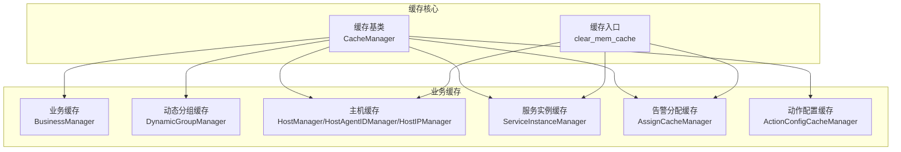
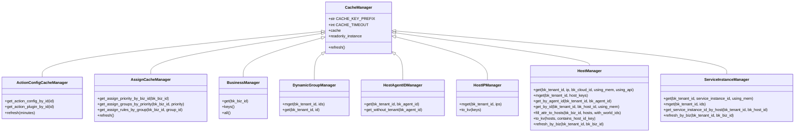
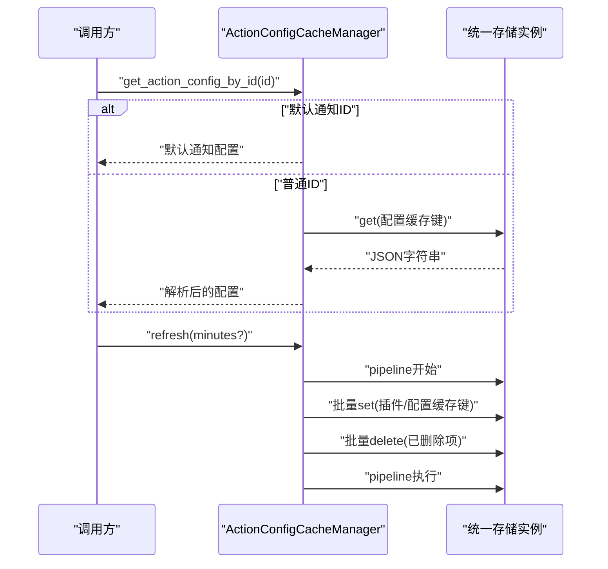
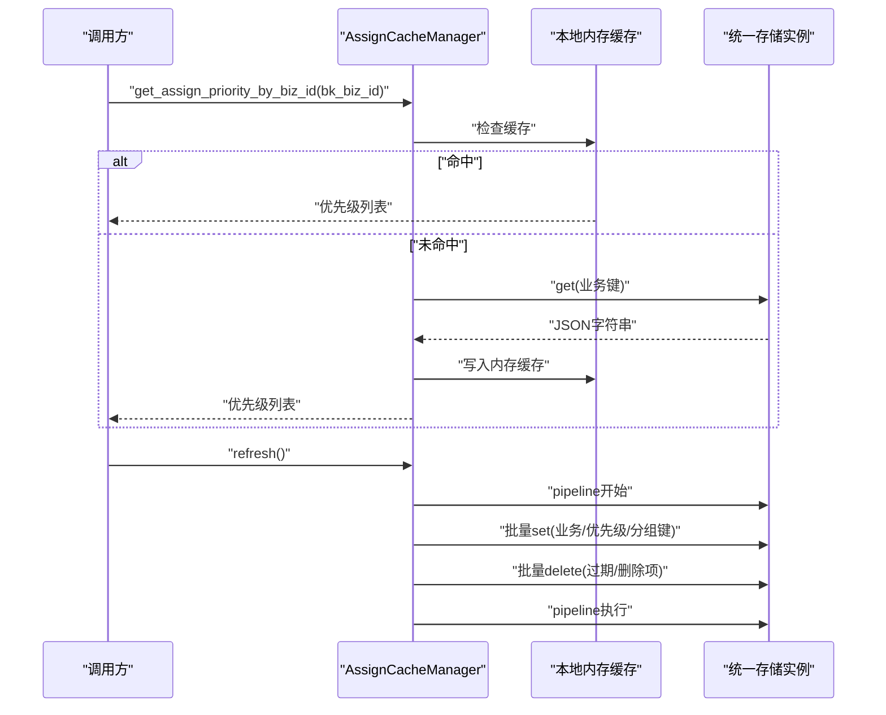
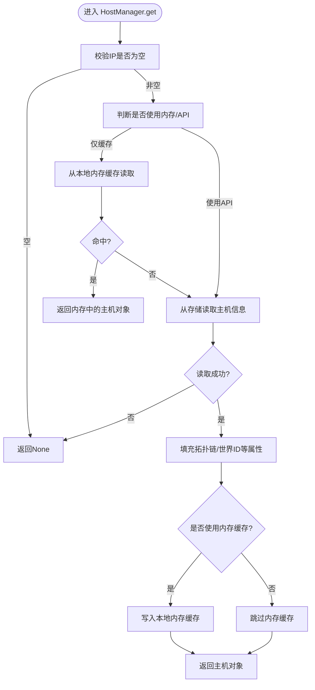
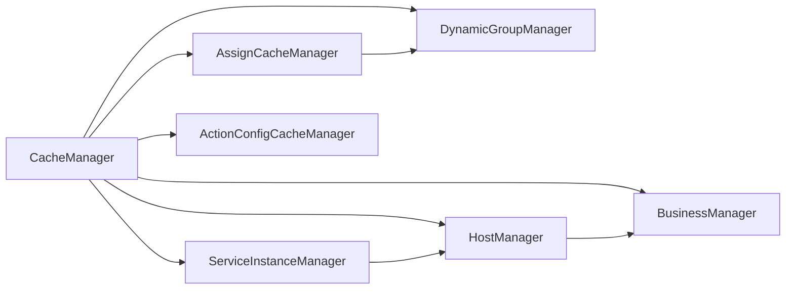

# 缓存管理系统

<cite>
**本文引用的文件**
- [缓存基类](file://bkmonitor/alarm_backends/core/cache/base.py)
- [缓存管理入口](file://bkmonitor/alarm_backends/core/cache/__init__.py)
- [动作配置缓存](file://bkmonitor/alarm_backends/core/cache/action_config.py)
- [告警分配缓存](file://bkmonitor/alarm_backends/core/cache/assign.py)
- [CMDB 业务缓存](file://bkmonitor/alarm_backends/core/cache/cmdb/business.py)
- [CMDB 主机动态组缓存](file://bkmonitor/alarm_backends/core/cache/cmdb/dynamic_group.py)
- [CMDB 主机缓存](file://bkmonitor/alarm_backends/core/cache/cmdb/host.py)
- [CMDB 服务实例缓存](file://bkmonitor/alarm_backends/core/cache/cmdb/service_instance.py)
</cite>

## 目录
1. [简介](#简介)
2. [项目结构](#项目结构)
3. [核心组件](#核心组件)
4. [架构总览](#架构总览)
5. [详细组件分析](#详细组件分析)
6. [依赖分析](#依赖分析)
7. [性能考虑](#性能考虑)
8. [故障排查指南](#故障排查指南)
9. [结论](#结论)
10. [附录](#附录)

## 简介
本技术文档围绕告警系统的缓存管理子系统展开，重点阐述缓存架构设计、缓存策略、数据持久化机制、键值生成规则、失效策略与一致性保障，并对策略缓存、动作配置缓存、订阅/分配关系缓存等不同类型的缓存进行对比说明。同时提供性能优化技巧、内存管理策略与监控方法，辅以配置示例与最佳实践，帮助开发者理解并优化告警系统的缓存性能。

## 项目结构
缓存相关代码主要位于 alarm_backends/core/cache 及其子模块，涵盖通用缓存基类、动作配置缓存、告警分配缓存以及 CMDB 相关的业务缓存（业务、主机、动态分组、服务实例）。

图表来源
- [缓存基类:20-46](file://bkmonitor/alarm_backends/core/cache/base.py#L20-L46)
- [缓存管理入口:14-18](file://bkmonitor/alarm_backends/core/cache/__init__.py#L14-L18)
- [动作配置缓存:23-137](file://bkmonitor/alarm_backends/core/cache/action_config.py#L23-L137)
- [告警分配缓存:25-210](file://bkmonitor/alarm_backends/core/cache/assign.py#L25-L210)
- [CMDB 业务缓存:20-55](file://bkmonitor/alarm_backends/core/cache/cmdb/business.py#L20-L55)
- [CMDB 主机动态组缓存:18-47](file://bkmonitor/alarm_backends/core/cache/cmdb/dynamic_group.py#L18-L47)
- [CMDB 主机缓存:27-293](file://bkmonitor/alarm_backends/core/cache/cmdb/host.py#L27-L293)
- [CMDB 服务实例缓存:26-156](file://bkmonitor/alarm_backends/core/cache/cmdb/service_instance.py#L26-L156)

章节来源
- [缓存基类:20-46](file://bkmonitor/alarm_backends/core/cache/base.py#L20-L46)
- [缓存管理入口:14-18](file://bkmonitor/alarm_backends/core/cache/__init__.py#L14-L18)

## 核心组件
- 缓存基类：定义统一的前缀、超时、存储实例与只读访问接口，作为各类缓存管理器的抽象基类。
- 缓存入口：提供内存缓存清理工具，用于在逻辑结束时释放本地内存缓存占用。
- 动作配置缓存：封装动作插件与动作配置的缓存读取与批量刷新。
- 告警分配缓存：封装业务优先级、分组与规则的缓存读取与刷新。
- CMDB 业务/主机/动态分组/服务实例缓存：封装 CMDB 数据的多类型缓存读取、批量读取、内存缓存与刷新。

章节来源
- [缓存基类:20-46](file://bkmonitor/alarm_backends/core/cache/base.py#L20-L46)
- [缓存管理入口:14-18](file://bkmonitor/alarm_backends/core/cache/__init__.py#L14-L18)
- [动作配置缓存:23-137](file://bkmonitor/alarm_backends/core/cache/action_config.py#L23-L137)
- [告警分配缓存:25-210](file://bkmonitor/alarm_backends/core/cache/assign.py#L25-L210)
- [CMDB 业务缓存:20-55](file://bkmonitor/alarm_backends/core/cache/cmdb/business.py#L20-L55)
- [CMDB 主机动态组缓存:18-47](file://bkmonitor/alarm_backends/core/cache/cmdb/dynamic_group.py#L18-L47)
- [CMDB 主机缓存:27-293](file://bkmonitor/alarm_backends/core/cache/cmdb/host.py#L27-L293)
- [CMDB 服务实例缓存:26-156](file://bkmonitor/alarm_backends/core/cache/cmdb/service_instance.py#L26-L156)

## 架构总览
缓存系统采用“统一基类 + 多类型管理器”的分层设计，底层通过统一的存储实例进行读写；上层管理器按业务域划分职责，支持批量读取、内存缓存与刷新策略。

图表来源
- [缓存基类:20-46](file://bkmonitor/alarm_backends/core/cache/base.py#L20-L46)
- [动作配置缓存:23-137](file://bkmonitor/alarm_backends/core/cache/action_config.py#L23-L137)
- [告警分配缓存:25-210](file://bkmonitor/alarm_backends/core/cache/assign.py#L25-L210)
- [CMDB 业务缓存:20-55](file://bkmonitor/alarm_backends/core/cache/cmdb/business.py#L20-L55)
- [CMDB 主机动态组缓存:18-47](file://bkmonitor/alarm_backends/core/cache/cmdb/dynamic_group.py#L18-L47)
- [CMDB 主机缓存:27-293](file://bkmonitor/alarm_backends/core/cache/cmdb/host.py#L27-L293)
- [CMDB 服务实例缓存:26-156](file://bkmonitor/alarm_backends/core/cache/cmdb/service_instance.py#L26-L156)

## 详细组件分析

### 缓存基类与入口
- 统一前缀与超时：所有缓存键带有公共前缀，统一超时时间，便于集中管理与清理。
- 存储实例：通过统一的存储实例进行读写，支持只读实例用于查询场景。
- 入口清理：提供内存缓存清理工具，避免长时间驻留导致内存膨胀。

章节来源
- [缓存基类:20-46](file://bkmonitor/alarm_backends/core/cache/base.py#L20-L46)
- [缓存管理入口:14-18](file://bkmonitor/alarm_backends/core/cache/__init__.py#L14-L18)

### 动作配置缓存
- 键值规则：
  - 插件缓存键：基于插件ID的模板键。
  - 配置缓存键：基于配置ID的模板键。
- 读取策略：
  - 通过统一存储实例读取，JSON反序列化后返回。
  - 默认通知配置在特定ID下直接构造返回。
- 刷新策略：
  - 支持全量刷新或增量刷新（按更新时间窗口）。
  - 使用管道批量写入，删除已删除项，确保一致性。
- 适用场景：动作插件与动作配置的高频读取与低频变更。

图表来源
- [动作配置缓存:23-137](file://bkmonitor/alarm_backends/core/cache/action_config.py#L23-L137)

章节来源
- [动作配置缓存:23-137](file://bkmonitor/alarm_backends/core/cache/action_config.py#L23-L137)

### 告警分配缓存
- 键值规则：
  - 业务优先级键：按业务维度聚合优先级集合。
  - 优先级分组键：按业务+优先级聚合分组ID集合。
  - 分组规则键：按分组ID聚合规则列表。
- 读取策略：
  - 本地内存缓存优先，缺失则回源存储。
  - 支持全局配置回退（业务ID=0）。
  - 动态分组条件解析为主机ID列表，便于后续匹配。
- 刷新策略：
  - 拉取启用的分组与规则，构建聚合结构。
  - 使用管道批量写入，清理过期分组与删除项。
- 适用场景：告警分配规则的快速匹配与优先级筛选。

图表来源
- [告警分配缓存:25-210](file://bkmonitor/alarm_backends/core/cache/assign.py#L25-L210)

章节来源
- [告警分配缓存:25-210](file://bkmonitor/alarm_backends/core/cache/assign.py#L25-L210)

### CMDB 业务缓存
- 键值规则：哈希键按租户维度组织，字段为业务ID，值为主机对象的序列化结果。
- 读取策略：支持单条、批量、全量读取，兼容旧数据补充租户字段。
- 适用场景：业务元数据的快速查询与遍历。

章节来源
- [CMDB 业务缓存:20-55](file://bkmonitor/alarm_backends/core/cache/cmdb/business.py#L20-L55)

### CMDB 主机动态分组缓存
- 键值规则：哈希键按租户维度组织，字段为动态分组ID，值为动态分组定义。
- 读取策略：支持单条与批量读取，返回结构化动态分组。
- 适用场景：动态分组到主机集合的快速转换。

章节来源
- [CMDB 主机动态组缓存:18-47](file://bkmonitor/alarm_backends/core/cache/cmdb/dynamic_group.py#L18-L47)

### CMDB 主机缓存
- 键值规则：
  - 主机键：ip|cloud_id 或主机ID。
  - IP映射键：IP到主机键列表的映射。
  - AgentID映射键：AgentID到主机ID。
- 读取策略：
  - 支持本地内存缓存开关，减少重复查询。
  - 支持API回源，记录穿透日志便于监控。
  - 批量读取与属性填充（拓扑链、世界ID等）。
- 刷新策略：按业务节点拉取主机并填充属性后写入缓存。
- 适用场景：主机信息的高并发查询与属性补齐。

图表来源
- [CMDB 主机缓存:117-253](file://bkmonitor/alarm_backends/core/cache/cmdb/host.py#L117-L253)

章节来源
- [CMDB 主机缓存:27-293](file://bkmonitor/alarm_backends/core/cache/cmdb/host.py#L27-L293)

### CMDB 服务实例缓存
- 键值规则：
  - 服务实例键：按租户维度的哈希，字段为实例ID，值为实例对象。
  - 主机到实例映射键：按租户维度的哈希，字段为主机ID，值为实例ID列表。
- 读取策略：支持单条、批量读取与映射查询。
- 刷新策略：按业务节点拉取实例，填充拓扑链与主机信息后批量写入。
- 适用场景：服务实例与主机的双向映射查询。

章节来源
- [CMDB 服务实例缓存:26-156](file://bkmonitor/alarm_backends/core/cache/cmdb/service_instance.py#L26-L156)

## 依赖分析
- 组件耦合：
  - 所有管理器均继承自统一基类，共享前缀、超时与存储实例。
  - 分配缓存依赖业务与动态分组缓存进行条件解析。
  - 主机与服务实例缓存依赖 CMDB API 进行数据拉取与属性填充。
- 外部依赖：
  - 统一存储实例（Redis）负责键空间管理与持久化。
  - CMDB API 提供主机、拓扑、服务实例等数据源。
- 循环依赖：
  - 当前结构无明显循环依赖，管理器间通过键空间与API交互。

图表来源
- [缓存基类:20-46](file://bkmonitor/alarm_backends/core/cache/base.py#L20-L46)
- [告警分配缓存:25-210](file://bkmonitor/alarm_backends/core/cache/assign.py#L25-L210)
- [CMDB 主机缓存:27-293](file://bkmonitor/alarm_backends/core/cache/cmdb/host.py#L27-L293)
- [CMDB 服务实例缓存:26-156](file://bkmonitor/alarm_backends/core/cache/cmdb/service_instance.py#L26-L156)
- [动作配置缓存:23-137](file://bkmonitor/alarm_backends/core/cache/action_config.py#L23-L137)

章节来源
- [缓存基类:20-46](file://bkmonitor/alarm_backends/core/cache/base.py#L20-L46)
- [告警分配缓存:25-210](file://bkmonitor/alarm_backends/core/cache/assign.py#L25-L210)
- [CMDB 主机缓存:27-293](file://bkmonitor/alarm_backends/core/cache/cmdb/host.py#L27-L293)
- [CMDB 服务实例缓存:26-156](file://bkmonitor/alarm_backends/core/cache/cmdb/service_instance.py#L26-L156)
- [动作配置缓存:23-137](file://bkmonitor/alarm_backends/core/cache/action_config.py#L23-L137)

## 性能考虑
- 键空间设计
  - 使用公共前缀与清晰的模板键，便于批量清理与运维定位。
  - 业务/租户维度隔离，降低键冲突与热点。
- 批量操作
  - 刷新流程广泛使用管道（pipeline）进行批量写入与删除，显著降低网络往返开销。
- 内存缓存
  - 对高频读取的主机、服务实例与分配规则提供本地内存缓存，减少存储压力。
  - 使用入口工具在逻辑结束时清理内存缓存，避免长期驻留。
- 回源策略
  - 主机缓存支持API回源，结合日志记录穿透情况，便于评估命中率与优化键设计。
- 批量读取
  - 主机与服务实例提供批量读取接口，减少多次查询带来的延迟。
- 一致性与时效性
  - 动作配置缓存支持按时间窗口的增量刷新，兼顾实时性与性能。
  - 分配缓存刷新时清理过期与删除项，保持键空间整洁。

章节来源
- [动作配置缓存:78-122](file://bkmonitor/alarm_backends/core/cache/action_config.py#L78-L122)
- [告警分配缓存:162-205](file://bkmonitor/alarm_backends/core/cache/assign.py#L162-L205)
- [CMDB 主机缓存:171-194](file://bkmonitor/alarm_backends/core/cache/cmdb/host.py#L171-L194)
- [CMDB 服务实例缓存:137-153](file://bkmonitor/alarm_backends/core/cache/cmdb/service_instance.py#L137-L153)
- [缓存管理入口:14-18](file://bkmonitor/alarm_backends/core/cache/__init__.py#L14-L18)

## 故障排查指南
- 命中率低
  - 检查键模板是否正确，确认业务/租户维度是否一致。
  - 查看主机缓存回源日志，评估穿透原因（键缺失/数据未刷新）。
- 缓存不一致
  - 确认刷新流程是否执行（动作配置/分配缓存的全量/增量刷新）。
  - 检查删除项是否同步清理（分配缓存对过期/删除项的清理）。
- 内存泄漏
  - 在使用本地内存缓存的逻辑结束后，调用入口清理工具清理内存缓存。
- 读取异常
  - 核对存储实例连接与权限。
  - 检查序列化/反序列化过程（JSON）是否异常。

章节来源
- [CMDB 主机缓存:179-190](file://bkmonitor/alarm_backends/core/cache/cmdb/host.py#L179-L190)
- [告警分配缓存:196-204](file://bkmonitor/alarm_backends/core/cache/assign.py#L196-L204)
- [动作配置缓存:88-121](file://bkmonitor/alarm_backends/core/cache/action_config.py#L88-L121)
- [缓存管理入口:14-18](file://bkmonitor/alarm_backends/core/cache/__init__.py#L14-L18)

## 结论
该缓存系统通过统一基类与多类型管理器实现了告警系统关键数据的高效读取与稳定维护。键空间设计清晰、批量操作与内存缓存策略有效提升了性能，配合严格的刷新与清理流程保障了数据一致性。建议在实际部署中结合监控指标持续优化键模板与刷新策略，进一步提升命中率与整体吞吐。

## 附录
- 配置示例（概念性）
  - 缓存超时：统一设置为一天，便于集中管理。
  - 键模板：业务/租户维度前缀 + 类型标识 + 具体ID，如“业务键”“主机键”“服务实例键”等。
  - 刷新周期：动作配置缓存可按分钟窗口增量刷新；分配缓存按业务变更触发全量刷新。
- 最佳实践
  - 优先使用批量读取与内存缓存，减少存储压力。
  - 刷新流程使用管道，确保原子性与一致性。
  - 对关键路径增加日志与监控，及时发现穿透与异常。
  - 定期清理过期与删除项，保持键空间整洁。