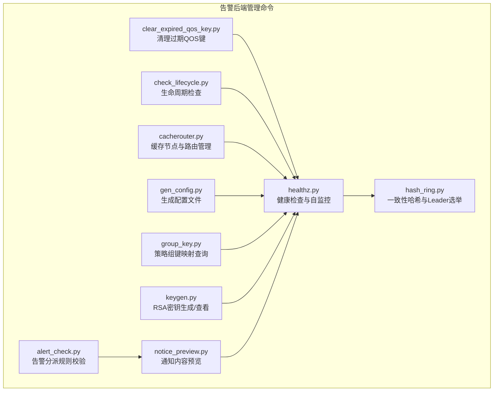
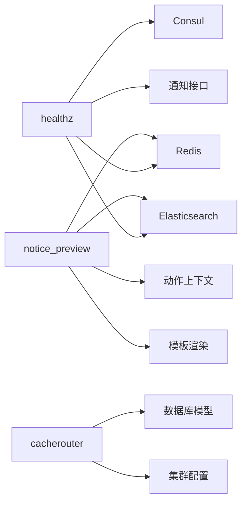

# 告警管理命令

<cite>
**本文引用的文件**
- [healthz.py](file://bkmonitor/alarm_backends/management/commands/healthz.py)
- [alert_check.py](file://bkmonitor/alarm_backends/management/commands/alert_check.py)
- [clear_expired_qos_key.py](file://bkmonitor/alarm_backends/management/commands/clear_expired_qos_key.py)
- [check_lifecycle.py](file://bkmonitor/alarm_backends/management/commands/check_lifecycle.py)
- [hash_ring.py](file://bkmonitor/alarm_backends/management/commands/hash_ring.py)
- [cacherouter.py](file://bkmonitor/alarm_backends/management/commands/cacherouter.py)
- [gen_config.py](file://bkmonitor/alarm_backends/management/commands/gen_config.py)
- [group_key.py](file://bkmonitor/alarm_backends/management/commands/group_key.py)
- [keygen.py](file://bkmonitor/alarm_backends/management/commands/keygen.py)
- [notice_preview.py](file://bkmonitor/alarm_backends/management/commands/notice_preview.py)
- [__init__.py](file://bkmonitor/alarm_backends/management/__init__.py)
- [__init__.py](file://bkmonitor/bkmonitor/management/__init__.py)
- [__init__.py](file://bkmonitor/apm/management/__init__.py)
</cite>

## 目录
1. [简介](#简介)
2. [项目结构](#项目结构)
3. [核心组件](#核心组件)
4. [架构总览](#架构总览)
5. [详细组件分析](#详细组件分析)
6. [依赖分析](#依赖分析)
7. [性能考虑](#性能考虑)
8. [故障排查指南](#故障排查指南)
9. [结论](#结论)
10. [附录](#附录)

## 简介
本运维文档面向蓝鲸监控平台的告警后端管理命令，系统性梳理健康检查、策略检查、缓存清理、集群管理、服务发现等运维操作的命令行接口、执行流程、参数说明、预期结果与常见问题处理。文档同时提供批量操作、定时任务、集群部署等场景下的使用示例，帮助运维人员高效管理与维护告警系统。

## 项目结构
告警管理命令位于 alarm_backends 的 management/commands 子目录下，围绕“健康检查”“策略与告警校验”“缓存与路由”“配置生成”“通知预览”“集群与服务发现”等主题组织。各命令均继承 Django 的 BaseCommand，具备统一的参数解析与执行入口。



图表来源
- [healthz.py:29-252](file://bkmonitor/alarm_backends/management/commands/healthz.py#L29-L252)
- [hash_ring.py:23-82](file://bkmonitor/alarm_backends/management/commands/hash_ring.py#L23-L82)
- [cacherouter.py:19-141](file://bkmonitor/alarm_backends/management/commands/cacherouter.py#L19-L141)
- [gen_config.py:21-72](file://bkmonitor/alarm_backends/management/commands/gen_config.py#L21-L72)
- [group_key.py:18-60](file://bkmonitor/alarm_backends/management/commands/group_key.py#L18-L60)
- [keygen.py:32-40](file://bkmonitor/alarm_backends/management/commands/keygen.py#L32-L40)
- [notice_preview.py:25-397](file://bkmonitor/alarm_backends/management/commands/notice_preview.py#L25-L397)

章节来源
- [__init__.py:1-11](file://bkmonitor/alarm_backends/management/__init__.py#L1-L11)
- [__init__.py:1-11](file://bkmonitor/bkmonitor/management/__init__.py#L1-L11)
- [__init__.py:1-18](file://bkmonitor/apm/management/__init__.py#L1-L18)

## 核心组件
- 健康检查与自监控：提供一次性检查与守护模式，支持多种子检查项（Elasticsearch、Transfer、InfluxDB备份、主机订阅等），并支持多渠道告警上报。
- 策略与告警校验：对指定告警ID进行分派规则匹配验证，支持性能剖析辅助定位瓶颈。
- 缓存与QOS：扫描并清理过期或无效的告警QOS键，保障缓存一致性。
- 生命周期检查：评估策略检查点更新率、确认告警与动作文档已建立。
- 集群与服务发现：基于Consul的一致性哈希分发与Leader选举，支持按业务ID/主机筛选目标。
- 缓存节点与路由：交互式增删改缓存节点与路由，支持Redis/Sentinel配置。
- 配置生成：根据模板生成Supervisor配置文件，适配不同环境与平台。
- 策略组键映射：在策略ID与策略组键之间双向查询，便于排障与配置核对。
- RSA密钥管理：生成或查看RSA私钥，供加密/签名使用。
- 通知预览：按通知渠道预览标准标题与正文，支持指定动作实例或告警ID。

章节来源
- [healthz.py:29-252](file://bkmonitor/alarm_backends/management/commands/healthz.py#L29-L252)
- [alert_check.py:32-86](file://bkmonitor/alarm_backends/management/commands/alert_check.py#L32-L86)
- [clear_expired_qos_key.py:23-78](file://bkmonitor/alarm_backends/management/commands/clear_expired_qos_key.py#L23-L78)
- [check_lifecycle.py:17-68](file://bkmonitor/alarm_backends/management/commands/check_lifecycle.py#L17-L68)
- [hash_ring.py:23-82](file://bkmonitor/alarm_backends/management/commands/hash_ring.py#L23-L82)
- [cacherouter.py:19-141](file://bkmonitor/alarm_backends/management/commands/cacherouter.py#L19-L141)
- [gen_config.py:21-72](file://bkmonitor/alarm_backends/management/commands/gen_config.py#L21-L72)
- [group_key.py:18-60](file://bkmonitor/alarm_backends/management/commands/group_key.py#L18-L60)
- [keygen.py:32-40](file://bkmonitor/alarm_backends/management/commands/keygen.py#L32-L40)
- [notice_preview.py:25-397](file://bkmonitor/alarm_backends/management/commands/notice_preview.py#L25-L397)

## 架构总览
以下序列图展示健康检查命令在守护模式下的典型执行流程，包括Leader判定、周期性检查、问题收集与告警上报。

```mermaid
sequenceDiagram
participant CLI as "运维CLI"
participant Cmd as "healthz.Command"
participant Loop as "HealthzLoop"
participant Story as "sc(Story)"
participant Consul as "Consul(Leader判定)"
participant Notifier as "通知接口(api.cmsi)"
CLI->>Cmd : "执行命令(可带守护/间隔/子检查选项)"
Cmd->>Cmd : "解析参数/初始化"
alt 守护模式
Cmd->>Loop : "run_daemon(interval)"
Loop->>Consul : "查询主机与目标(Leader判定)"
loop 每个检查周期
Loop->>Consul : "Leader判定"
alt 当前节点为Leader
Loop->>Story : "sc.run()"
Story-->>Loop : "收集问题集"
alt 发现问题
Loop->>Notifier : "按配置发送通知"
end
else 其他节点
Loop->>Loop : "跳过检查"
end
end
else 单次模式
Cmd->>Story : "sc.run()"
Story-->>Cmd : "返回问题集"
end
Cmd-->>CLI : "退出码=问题数量"
```

图表来源
- [healthz.py:71-120](file://bkmonitor/alarm_backends/management/commands/healthz.py#L71-L120)
- [healthz.py:159-252](file://bkmonitor/alarm_backends/management/commands/healthz.py#L159-L252)
- [hash_ring.py:32-51](file://bkmonitor/alarm_backends/management/commands/hash_ring.py#L32-L51)

## 详细组件分析

### 健康检查命令（healthz）
- 功能概要
  - 支持一次性检查与守护模式；守护模式下按固定间隔运行，Leader节点负责执行。
  - 子检查项：Elasticsearch、Transfer、InfluxDB备份、主机订阅等。
  - 自动化问题汇总与多渠道通知（短信、微信、邮件、语音）。
- 命令行参数
  - -t：尝试自动修复
  - -d：守护模式（强制启用-t）
  - -i SECONDS：守护模式间隔，默认600秒
  - -es：Elasticsearch检查
  - -transfer：Transfer检查（等待约1分钟以上）
  - -ts_backup：InfluxDB备份数据检查（等待约3分钟）
  - -wild：主机订阅检查
- 执行条件
  - 守护模式需满足Leader判定（Consul一致性哈希）。
  - 需配置健康检查告警通知配置项以启用上报。
- 预期结果
  - 单次模式：输出本次检查结果，退出码等于问题数量。
  - 守护模式：每周期输出报告，发现问题时触发通知。
- 常见问题
  - 无Leader节点：Consul无注册节点导致Leader判定失败。
  - 通知未发送：未配置健康检查告警通知类型或接收人。
  - 子检查耗时长：Transfer/TS备份检查为IO密集型，建议在低峰时段执行。
- 使用示例
  - 单次检查并自动修复：python manage.py healthz -t
  - 守护模式（10分钟间隔）：python manage.py healthz -d -i 600
  - 指定子检查：python manage.py healthz -es -transfer -ts_backup

章节来源
- [healthz.py:32-80](file://bkmonitor/alarm_backends/management/commands/healthz.py#L32-L80)
- [healthz.py:88-120](file://bkmonitor/alarm_backends/management/commands/healthz.py#L88-L120)
- [healthz.py:170-252](file://bkmonitor/alarm_backends/management/commands/healthz.py#L170-L252)

### 告警分派规则校验（alert_check）
- 功能概要
  - 针对指定告警ID，验证其是否命中分派规则，支持性能剖析。
- 命令行参数
  - alert_id：告警ID（必需）
  - --profile：是否开启性能剖析
- 执行条件
  - 告警文档存在且策略配置包含按规则分派模式。
- 预期结果
  - 输出命中的分派规则（分组ID与名称）；若未命中则提示无匹配规则。
- 常见问题
  - 分派模式非按规则：忽略匹配逻辑。
  - 未安装剖析工具：--profile不可用时会降级为普通执行。
- 使用示例
  - python manage.py alert_check 12345
  - python manage.py alert_check 12345 --profile

章节来源
- [alert_check.py:32-86](file://bkmonitor/alarm_backends/management/commands/alert_check.py#L32-L86)

### 过期QOS键清理（clear_expired_qos_key）
- 功能概要
  - 扫描指定时间窗口内被屏蔽且状态为异常的告警，计算并清理无效的QOS键，提升缓存一致性。
- 命令行参数
  - --strategy：仅清理指定策略的QOS键（默认全部）
  - --severity：仅清理指定级别的QOS键（默认全部）
- 执行条件
  - 需有可用的Redis客户端连接。
- 预期结果
  - 统计并输出无效键数量，清理后重新处理。
- 常见问题
  - Redis键无过期：会被删除并计入统计。
  - 查询范围过大：建议限定strategy/severity缩小扫描范围。
- 使用示例
  - python manage.py clear_expired_qos_key
  - python manage.py clear_expired_qos_key --strategy 1001 --severity 1

章节来源
- [clear_expired_qos_key.py:23-78](file://bkmonitor/alarm_backends/management/commands/clear_expired_qos_key.py#L23-L78)

### 生命周期检查（check_lifecycle）
- 功能概要
  - 检查策略检查点的更新率（近似99%视为通过），并验证告警与动作文档是否已创建。
- 命令行参数
  - -t：时间窗口（秒，默认120）
- 执行条件
  - 需有可用的ES与Redis连接。
- 预期结果
  - 输出更新率与通过/失败状态；输出告警/动作文档计数。
- 常见问题
  - 更新率低于阈值：需检查策略调度与检查点写入链路。
  - 文档未创建：需确认索引映射与初始化流程。
- 使用示例
  - python manage.py check_lifecycle
  - python manage.py check_lifecycle -t 300

章节来源
- [check_lifecycle.py:17-68](file://bkmonitor/alarm_backends/management/commands/check_lifecycle.py#L17-L68)

### 一致性哈希与Leader选举（hash_ring）
- 功能概要
  - 提供一致性哈希分发与Leader选举能力，支持容器模式与业务ID过滤。
- 命令行参数
  - --host：目标主机（localhost将解析为本地IP）
  - --biz_id：业务ID过滤
  - --type/name：命令名（默认run_access-data）
- 执行条件
  - Consul可用且存在注册节点。
- 预期结果
  - 输出主机到目标列表的映射，Leader所在主机将执行守护模式检查。
- 常见问题
  - 无注册节点：ZeroDivision错误，Leader判定失败。
  - 主机未注册：日志提示未获取到目标。
- 使用示例
  - python manage.py hash_ring --host localhost --biz_id 2
  - python manage.py hash_ring --type run_access-data

章节来源
- [hash_ring.py:54-82](file://bkmonitor/alarm_backends/management/commands/hash_ring.py#L54-L82)

### 缓存节点与路由管理（cacherouter）
- 功能概要
  - 交互式管理缓存节点与路由，支持添加/删除节点、新增路由、列出节点。
- 命令行参数
  - --strategy_id：查询某策略对应的当前节点
  - --remove_node_id：删除指定节点
  - -r：新增缓存路由
  - -a：新增节点
  - -l：列出节点
- 执行条件
  - 需有可用的数据库连接。
- 预期结果
  - 列表输出当前启用节点；新增/删除成功后刷新列表。
- 常见问题
  - 节点不存在：输入错误或已被删除。
  - 路由范围冲突：需确保区间不重叠。
- 使用示例
  - 列出节点：python manage.py cacherouter -l
  - 新增节点：python manage.py cacherouter -a
  - 新增路由：python manage.py cacherouter -r
  - 删除节点：python manage.py cacherouter --remove_node_id 101

章节来源
- [cacherouter.py:19-141](file://bkmonitor/alarm_backends/management/commands/cacherouter.py#L19-L141)

### 配置生成（gen_config）
- 功能概要
  - 根据模板生成Supervisor配置文件，适配开发/测试/生产与企业/社区平台。
- 命令行参数
  - --environment：development/testing/production
  - --platform：enterprise/community
- 执行条件
  - 模板存在且目标目录可写。
- 预期结果
  - 在指定目录生成配置文件。
- 常见问题
  - 目标目录权限不足：需调整权限或使用更高权限账户。
- 使用示例
  - python manage.py gen_config --environment production --platform enterprise

章节来源
- [gen_config.py:21-72](file://bkmonitor/alarm_backends/management/commands/gen_config.py#L21-L72)

### 策略组键映射（group_key）
- 功能概要
  - 在策略ID与策略组键之间双向查询，便于排障与配置核对。
- 命令行参数
  - --group_key：查询该组键对应的策略
  - --strategy_id：查询该策略的组键
- 执行条件
  - 策略缓存可用。
- 预期结果
  - 输出策略ID、项ID与组键的映射关系。
- 常见问题
  - 策略未配置：提示确认策略ID正确。
  - 组键无配置：提示确认组键正确。
- 使用示例
  - 查询策略到组键：python manage.py group_key --strategy_id 1001
  - 查询组键到策略：python manage.py group_key --group_key abcdef

章节来源
- [group_key.py:18-60](file://bkmonitor/alarm_backends/management/commands/group_key.py#L18-L60)

### RSA密钥管理（keygen）
- 功能概要
  - 生成RSA私钥并保存至设置中，或查看现有私钥。
- 命令行参数
  - 无额外参数
- 执行条件
  - 需具备足够熵源与权限。
- 预期结果
  - 输出私钥内容（首次生成）或现有私钥。
- 常见问题
  - 密钥已存在：重复执行将输出现有私钥。
- 使用示例
  - 生成/查看：python manage.py keygen

章节来源
- [keygen.py:32-40](file://bkmonitor/alarm_backends/management/commands/keygen.py#L32-L40)

### 通知预览（notice_preview）
- 功能概要
  - 预览通知标题与正文，支持指定通知方式与动作实例ID。
- 命令行参数
  - alert_id：告警ID（必需）
  - --notice-way：通知方式（如mail、sms、weixin、wxwork-bot等）
  - --action-id：动作实例ID（可选）
- 执行条件
  - 存在有效的动作实例与告警文档。
- 预期结果
  - 输出每个通知渠道的标题与正文，或错误提示。
- 常见问题
  - 无通知动作：提示未关联通知动作。
  - 动作实例不存在：提示不存在。
  - 渲染失败：输出具体错误信息。
- 使用示例
  - 预览所有渠道：python manage.py notice_preview 12345
  - 指定渠道：python manage.py notice_preview 12345 --notice-way mail
  - 指定动作实例：python manage.py notice_preview 12345 --action-id 67890

章节来源
- [notice_preview.py:25-397](file://bkmonitor/alarm_backends/management/commands/notice_preview.py#L25-L397)

## 依赖分析
- 组件耦合
  - healthz 依赖 Consul 进行 Leader 选举，依赖通知接口进行告警上报。
  - cacherouter 依赖数据库模型与集群配置，用于节点与路由管理。
  - notice_preview 依赖动作上下文与模板渲染，输出标准化通知内容。
- 外部依赖
  - Elasticsearch：用于文档检索与计数。
  - Redis：用于缓存键管理与检查点存储。
  - Consul：用于服务发现与一致性哈希分发。
  - 通知接口：用于短信、微信、邮件、语音通知。



图表来源
- [healthz.py:18-24](file://bkmonitor/alarm_backends/management/commands/healthz.py#L18-L24)
- [hash_ring.py:17-18](file://bkmonitor/alarm_backends/management/commands/hash_ring.py#L17-L18)
- [cacherouter.py:14-16](file://bkmonitor/alarm_backends/management/commands/cacherouter.py#L14-L16)
- [notice_preview.py:15-20](file://bkmonitor/alarm_backends/management/commands/notice_preview.py#L15-L20)

## 性能考虑
- 守护模式间隔：合理设置-i，避免频繁检查造成资源压力。
- 子检查耗时：Transfer/TS备份检查为IO密集型，建议在低峰时段执行。
- 扫描范围：clear_expired_qos_key 与 check_lifecycle 建议限定参数缩小扫描范围。
- 通知频率：HEALTHZ_ALARM_CONFIG 中的通知类型与接收人需合理配置，避免风暴。

## 故障排查指南
- 无Leader节点
  - 现象：Leader判定失败，日志提示无注册节点。
  - 排查：确认Consul服务与节点注册状态。
- 通知未发送
  - 现象：发现问题但未收到通知。
  - 排查：检查 HEALTHZ_ALARM_CONFIG 是否配置通知类型与接收人。
- 节点未注册
  - 现象：hash_ring 输出未获取到目标。
  - 排查：确认主机IP与业务ID过滤条件。
- 路由冲突
  - 现象：新增路由失败。
  - 排查：检查区间范围是否与其他路由重叠。
- 文档未创建
  - 现象：check_lifecycle 报告文档计数为0。
  - 排查：确认索引映射与初始化流程。

章节来源
- [healthz.py:185-252](file://bkmonitor/alarm_backends/management/commands/healthz.py#L185-L252)
- [hash_ring.py:43-51](file://bkmonitor/alarm_backends/management/commands/hash_ring.py#L43-L51)
- [cacherouter.py:78-80](file://bkmonitor/alarm_backends/management/commands/cacherouter.py#L78-L80)
- [check_lifecycle.py:58-67](file://bkmonitor/alarm_backends/management/commands/check_lifecycle.py#L58-L67)

## 结论
告警管理命令覆盖健康检查、策略与告警校验、缓存清理、集群与服务发现、缓存路由、配置生成、通知预览等关键运维场景。通过统一的命令接口与守护模式，可实现自动化巡检与快速定位问题。建议结合定时任务与集群部署策略，形成稳定高效的告警系统运维体系。

## 附录
- 批量操作建议
  - 使用守护模式配合-i参数，按业务维度拆分检查任务。
  - 对高耗时子检查（如-transfer、-ts_backup）采用分批执行。
- 定时任务示例
  - 每10分钟一次健康检查：*/10 * * * * cd /app && python manage.py healthz -t
  - 每日清理过期QOS键：0 2 * * * cd /app && python manage.py clear_expired_qos_key
- 集群部署建议
  - 通过 hash_ring 确保Leader节点唯一执行关键检查。
  - 使用 cacherouter 管理缓存节点与路由，保证策略命中率与一致性。