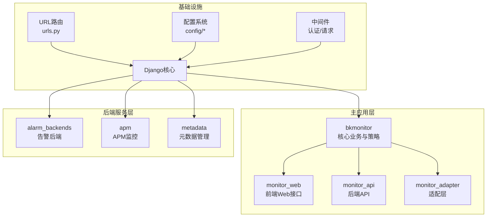
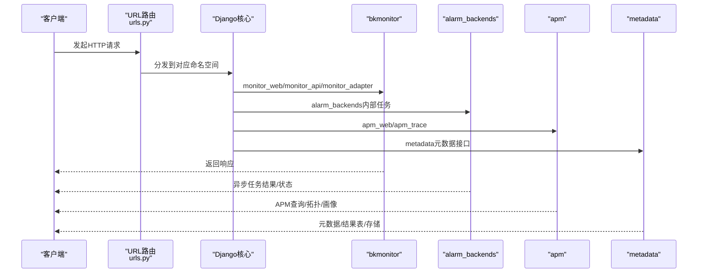
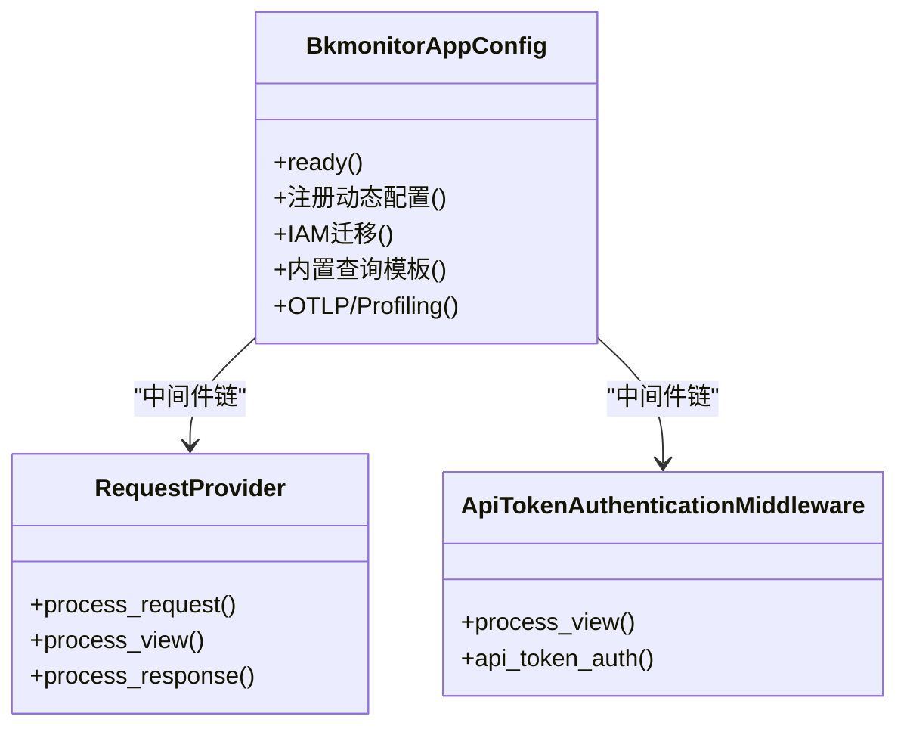
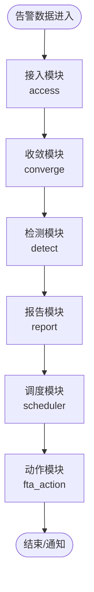
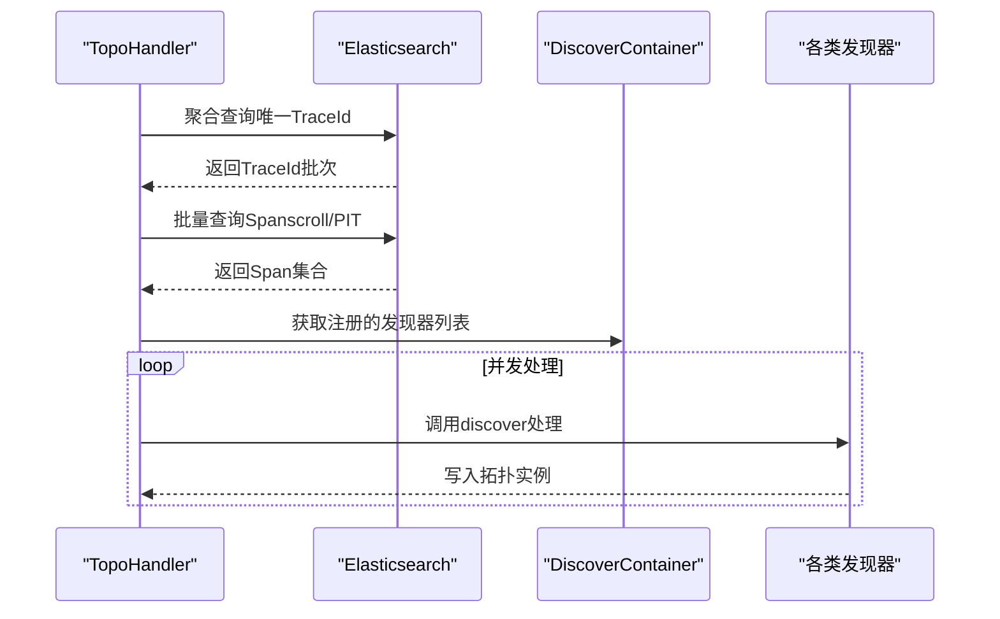
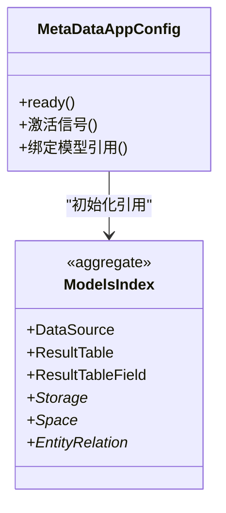
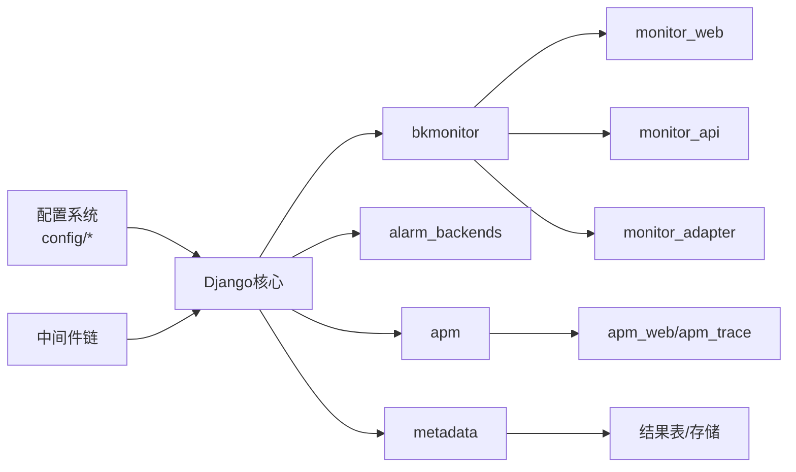

# 核心模块架构

<cite>
**本文档引用的文件**
- [settings.py](file://bkmonitor/settings.py)
- [urls.py](file://bkmonitor/urls.py)
- [apps.py](file://bkmonitor/bkmonitor/apps.py)
- [apps.py](file://bkmonitor/alarm_backends/apps.py)
- [apps.py](file://bkmonitor/apm/apps.py)
- [urls.py](file://bkmonitor/apm/urls.py)
- [urls.py](file://bkmonitor/alarm_backends/urls.py)
- [views.py](file://bkmonitor/metadata/views.py)
- [apps.py](file://bkmonitor/metadata/apps.py)
- [default.py](file://bkmonitor/config/default.py)
- [dev.py](file://bkmonitor/config/dev.py)
- [authentication.py](file://bkmonitor/bkmonitor/middlewares/authentication.py)
- [request_middlewares.py](file://bkmonitor/bkmonitor/middlewares/request_middlewares.py)
- [base.py](file://bkmonitor/apm/core/discover/base.py)
- [__init__.py](file://bkmonitor/metadata/models/__init__.py)
</cite>

## 目录
1. [简介](#简介)
2. [项目结构](#项目结构)
3. [核心组件](#核心组件)
4. [架构总览](#架构总览)
5. [详细组件分析](#详细组件分析)
6. [依赖关系分析](#依赖关系分析)
7. [性能考量](#性能考量)
8. [故障排查指南](#故障排查指南)
9. [结论](#结论)
10. [附录](#附录)

## 简介
本架构文档聚焦蓝鲸智云监控平台的核心模块，系统性阐述各应用模块的设计理念、职责边界与交互关系。重点覆盖：
- 主应用模块（bkmonitor）
- 告警后端模块（alarm_backends）
- APM 监控模块（apm）
- 元数据管理模块（metadata）
同时，结合 Django 应用组织结构、URL 路由配置、中间件机制与配置管理策略，给出模块间依赖关系图与数据流向图，帮助开发者快速理解整体架构。

## 项目结构
项目采用多应用（App）组织方式，核心应用包括：
- 主应用：bkmonitor（核心业务与策略、事件、告警、查询模板等）
- 告警后端：alarm_backends（告警数据处理、收敛、推送等）
- APM：apm（链路追踪、拓扑发现、指标与画像）
- 元数据：metadata（数据源、结果表、存储、空间等）

图表来源
- [urls.py:58-97](file://bkmonitor/urls.py#L58-L97)
- [apps.py:25-113](file://bkmonitor/bkmonitor/apps.py#L25-L113)
- [apps.py:16-23](file://bkmonitor/alarm_backends/apps.py#L16-L23)
- [apps.py:25-69](file://bkmonitor/apm/apps.py#L25-L69)
- [apps.py:16-42](file://bkmonitor/metadata/apps.py#L16-L42)

章节来源
- [urls.py:58-97](file://bkmonitor/urls.py#L58-L97)
- [apps.py:25-113](file://bkmonitor/bkmonitor/apps.py#L25-L113)
- [apps.py:16-23](file://bkmonitor/alarm_backends/apps.py#L16-L23)
- [apps.py:25-69](file://bkmonitor/apm/apps.py#L25-L69)
- [apps.py:16-42](file://bkmonitor/metadata/apps.py#L16-L42)

## 核心组件
- 主应用（bkmonitor）
  - 职责：策略管理、事件与告警处理、查询模板、IAM 权限、审计事件、空间与多租户支持等
  - 关键点：应用启动时注册动态配置、IAM 迁移、内置查询模板注册、OTLP/持续 Profiling 仪表化
- 告警后端（alarm_backends）
  - 职责：告警数据接入、收敛、检测、收敛、报告、调度与自愈动作等
  - 关键点：应用启动钩子、任务分发与去重、存储与缓存策略
- APM（apm）
  - 职责：链路追踪、拓扑发现、指标与画像、eBPF/深度流量集成
  - 关键点：拓扑发现容器、多类型发现器注册、线程池并发处理、ES 查询与滚动
- 元数据（metadata）
  - 职责：数据源、结果表、存储、空间、实体关系、快照与订阅等
  - 关键点：应用启动时信号与模型绑定，保证模块初始化顺序

章节来源
- [apps.py:25-113](file://bkmonitor/bkmonitor/apps.py#L25-L113)
- [apps.py:16-23](file://bkmonitor/alarm_backends/apps.py#L16-L23)
- [apps.py:25-69](file://bkmonitor/apm/apps.py#L25-L69)
- [apps.py:16-42](file://bkmonitor/metadata/apps.py#L16-L42)

## 架构总览
下图展示从入口路由到各应用模块的总体交互：

图表来源
- [urls.py:58-97](file://bkmonitor/urls.py#L58-L97)
- [apps.py:25-113](file://bkmonitor/bkmonitor/apps.py#L25-L113)
- [apps.py:25-69](file://bkmonitor/apm/apps.py#L25-L69)
- [apps.py:16-42](file://bkmonitor/metadata/apps.py#L16-L42)

## 详细组件分析

### 主应用（bkmonitor）分析
- 设计理念
  - 以“策略-事件-告警-通知”为主线，提供统一的告警生命周期管理
  - 通过 IAM 权限与空间抽象，支持多租户与多业务隔离
  - 通过动态配置与内置模板，提升策略与查询的可维护性
- 关键职责
  - 应用启动：动态配置注入、IAM 迁移、内置查询模板注册、OTLP/Profiling 仪表化
  - 中间件：API Token 认证、登录校验、业务上下文注入、审计事件推送
  - 路由：聚合 monitor_web/monitor_api/monitor_adapter 等命名空间
- 数据流
  - 请求经中间件注入业务上下文与租户信息，进入各子应用处理
  - 响应统一设置安全头并推送审计事件

图表来源
- [apps.py:25-113](file://bkmonitor/bkmonitor/apps.py#L25-L113)
- [request_middlewares.py:25-57](file://bkmonitor/bkmonitor/middlewares/request_middlewares.py#L25-L57)
- [authentication.py:49-124](file://bkmonitor/bkmonitor/middlewares/authentication.py#L49-L124)

章节来源
- [apps.py:25-113](file://bkmonitor/bkmonitor/apps.py#L25-L113)
- [authentication.py:25-140](file://bkmonitor/bkmonitor/middlewares/authentication.py#L25-L140)
- [request_middlewares.py:25-57](file://bkmonitor/bkmonitor/middlewares/request_middlewares.py#L25-L57)

### 告警后端（alarm_backends）分析
- 设计理念
  - 将告警处理拆分为接入、收敛、检测、报告、调度等子模块，便于扩展与治理
  - 通过去重、收敛窗口与维度聚合，降低噪声与重复通知
- 关键职责
  - 应用启动：空实现（具体逻辑在子模块）
  - 子模块：access、detect、converge、report、scheduler、fta_action 等
- 数据流
  - 数据从接入模块进入，按策略维度收敛，触发检测与报告，最终进入调度与动作执行

图表来源
- [apps.py:16-23](file://bkmonitor/alarm_backends/apps.py#L16-L23)
- [urls.py:1-4](file://bkmonitor/alarm_backends/urls.py#L1-L4)

章节来源
- [apps.py:16-23](file://bkmonitor/alarm_backends/apps.py#L16-L23)
- [urls.py:1-4](file://bkmonitor/alarm_backends/urls.py#L1-L4)

### APM 监控（apm）分析
- 设计理念
  - 基于 OpenTelemetry 语义，支持 Trace/Metric/Profiling 多类型数据
  - 通过“拓扑发现容器”注册多种发现器，实现端点、主机、实例、节点、关系、远程服务、服务等多维拓扑
- 关键职责
  - 应用启动：注册各类拓扑发现器
  - TopoHandler：按轮次从 ES 读取 TraceId，批量拉取 Span，线程池并发处理
  - ES 查询：支持 composite scroll 与 PIT 替代 scan，避免深分页
- 数据流
  - 从 ES 读取 Trace 数据，按规则匹配与去重，写入拓扑实例

图表来源
- [apps.py:25-69](file://bkmonitor/apm/apps.py#L25-L69)
- [base.py:138-150](file://bkmonitor/apm/core/discover/base.py#L138-L150)
- [base.py:332-571](file://bkmonitor/apm/core/discover/base.py#L332-L571)

章节来源
- [apps.py:25-69](file://bkmonitor/apm/apps.py#L25-L69)
- [base.py:138-150](file://bkmonitor/apm/core/discover/base.py#L138-L150)
- [base.py:332-571](file://bkmonitor/apm/core/discover/base.py#L332-L571)

### 元数据管理（metadata）分析
- 设计理念
  - 以“数据源-结果表-存储-订阅”为核心，支撑统一查询与数据治理
  - 通过空间抽象，实现业务隔离与资源绑定
- 关键职责
  - 应用启动：激活信号、绑定 ResultTable/Field 等模型引用
  - 模型聚合：数据源、结果表、存储、空间、实体关系、快照等
- 数据流
  - 元数据变更通过信号驱动，更新 ResultTable/Field 等引用，保障跨模块一致性

图表来源
- [apps.py:16-42](file://bkmonitor/metadata/apps.py#L16-L42)
- [__init__.py:97-172](file://bkmonitor/metadata/models/__init__.py#L97-L172)

章节来源
- [apps.py:16-42](file://bkmonitor/metadata/apps.py#L16-L42)
- [__init__.py:97-172](file://bkmonitor/metadata/models/__init__.py#L97-L172)

## 依赖关系分析
- 应用依赖
  - 主应用依赖中间件与配置系统，向上提供 Web/API/适配层
  - 告警后端与 APM 作为独立应用，通过各自路由与任务调度协同
  - 元数据为底层支撑，被其他模块通过模型引用间接依赖
- 配置与中间件
  - 配置系统按环境加载（default → 环境 → 角色），支持环境变量覆盖
  - 中间件链包含登录校验、API Token 认证、业务上下文注入、审计事件推送

图表来源
- [default.py:49-66](file://bkmonitor/config/default.py#L49-L66)
- [default.py:68-91](file://bkmonitor/config/default.py#L68-L91)
- [urls.py:58-97](file://bkmonitor/urls.py#L58-L97)
- [apps.py:25-113](file://bkmonitor/bkmonitor/apps.py#L25-L113)

章节来源
- [default.py:49-66](file://bkmonitor/config/default.py#L49-L66)
- [default.py:68-91](file://bkmonitor/config/default.py#L68-L91)
- [urls.py:58-97](file://bkmonitor/urls.py#L58-L97)

## 性能考量
- APM 拓扑发现
  - 使用线程池并发处理，按轮次限制每轮 Trace 数量，避免 OOM
  - ES 查询采用 scroll/PIT，避免深分页带来的性能问题
- 告警后端
  - 接入模块去重与收敛窗口，减少重复计算与通知
  - 任务分发与哈希环路由，提升横向扩展能力
- 主应用
  - 动态配置与内置模板减少策略与查询的重复开发成本
  - 安全头统一设置，增强传输安全性

章节来源
- [base.py:332-571](file://bkmonitor/apm/core/discover/base.py#L332-L571)
- [apps.py:25-69](file://bkmonitor/apm/apps.py#L25-L69)
- [apps.py:25-113](file://bkmonitor/bkmonitor/apps.py#L25-L113)

## 故障排查指南
- 认证与权限
  - API Token 认证失败：检查 Authorization 头、令牌有效性与命名空间权限
  - 登录中间件：确认登录态与租户 ID 一致性
- 请求上下文
  - 业务 ID 注入失败：检查请求上下文与命名空间，确保 monitor_web 下的业务切换逻辑
- 审计事件
  - 审计事件未推送：检查响应阶段事件推送逻辑与本地线程存储清理
- 配置覆盖
  - 环境变量未生效：确认 BKAPP_SETTINGS_ 前缀的环境变量是否正确注入

章节来源
- [authentication.py:49-124](file://bkmonitor/bkmonitor/middlewares/authentication.py#L49-L124)
- [request_middlewares.py:25-57](file://bkmonitor/bkmonitor/middlewares/request_middlewares.py#L25-L57)
- [settings.py:57-63](file://bkmonitor/settings.py#L57-L63)

## 结论
本架构以“主应用-后端服务-基础设施”三层划分清晰，配合灵活的配置系统与中间件链，实现了高内聚、低耦合的监控平台核心能力。APM 与元数据模块分别在可观测性与数据治理方面提供了坚实基础，告警后端通过模块化设计提升了可扩展性与稳定性。建议在新增模块时遵循现有路由与中间件约定，并充分利用动态配置与内置模板能力，确保一致的开发体验与运维效率。

## 附录
- URL 路由与命名空间
  - monitor_web：REST v2 接口
  - monitor_api：REST v1 适配
  - monitor_adapter：适配层
  - apm_web/apm_trace：APM 查询与拓扑
  - fta_web：自愈动作
  - calendar：日历
  - ai_whale：AI能力
- 配置加载顺序
  - config.default → blueapps.patch → config.{env} → config.role.{role}
  - 支持环境变量覆盖（BKAPP_SETTINGS_*）

章节来源
- [urls.py:58-97](file://bkmonitor/urls.py#L58-L97)
- [default.py:26-50](file://bkmonitor/config/default.py#L26-L50)
- [dev.py:17-67](file://bkmonitor/config/dev.py#L17-L67)