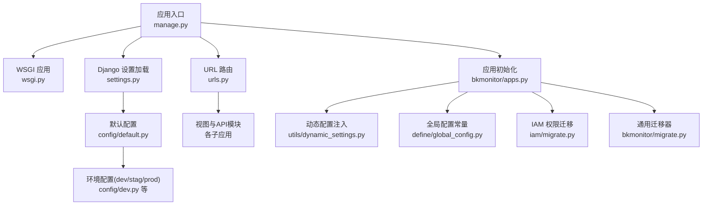
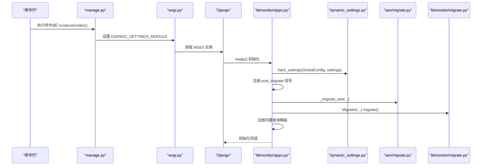
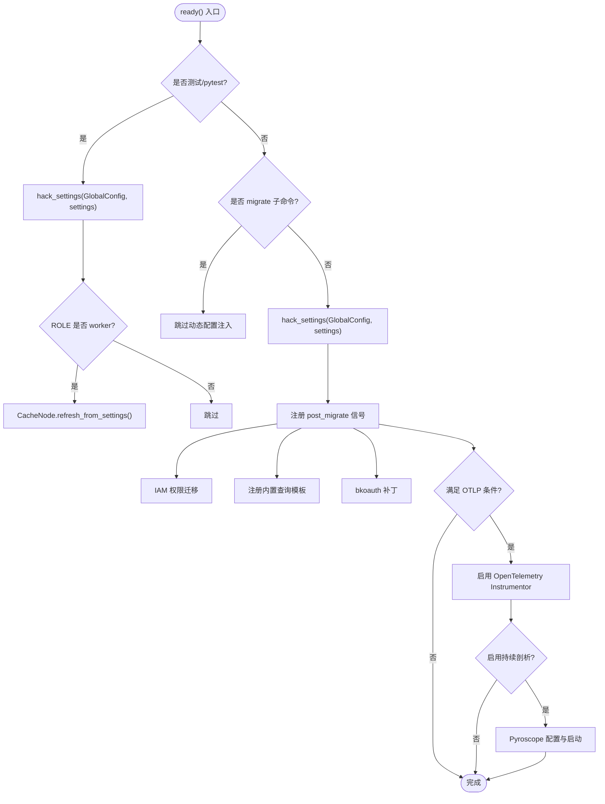
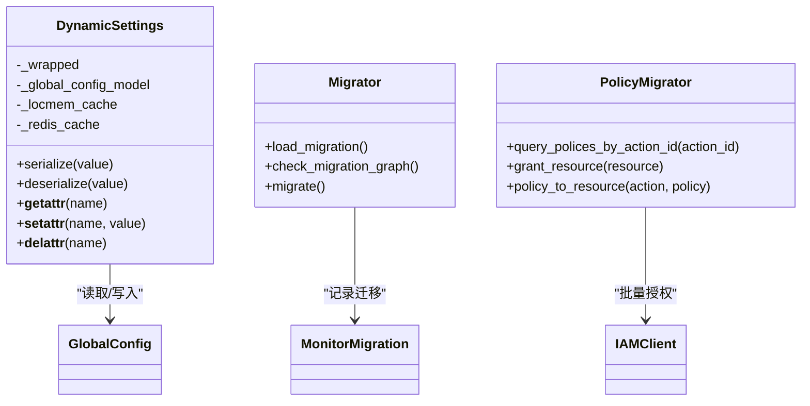
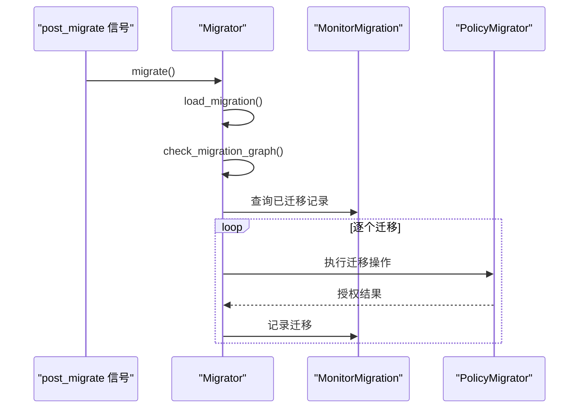
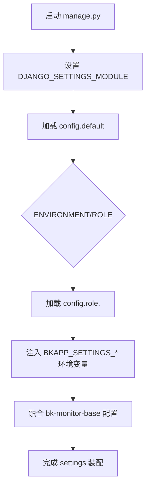
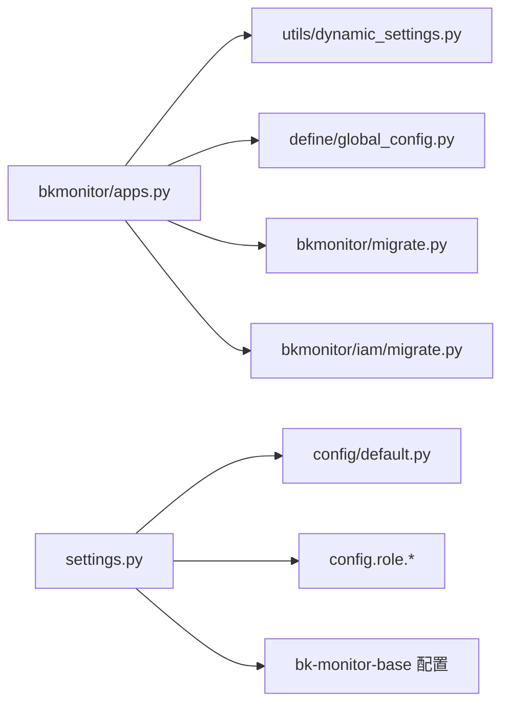

# 监控主应用模块

<cite>
**本文引用的文件**
- [apps.py](file://bkmonitor/bkmonitor/apps.py)
- [settings.py](file://bkmonitor/settings.py)
- [manage.py](file://bkmonitor/manage.py)
- [wsgi.py](file://bkmonitor/wsgi.py)
- [urls.py](file://bkmonitor/urls.py)
- [default.py](file://bkmonitor/config/default.py)
- [dev.py](file://bkmonitor/config/dev.py)
- [dynamic_settings.py](file://bkmonitor/bkmonitor/utils/dynamic_settings.py)
- [global_config.py](file://bkmonitor/bkmonitor/define/global_config.py)
- [migrate.py](file://bkmonitor/bkmonitor/migrate.py)
- [iam/migrate.py](file://bkmonitor/bkmonitor/iam/migrate.py)
- [models/__init__.py](file://bkmonitor/bkmonitor/models/__init__.py)
</cite>

## 目录
1. [简介](#简介)
2. [项目结构](#项目结构)
3. [核心组件](#核心组件)
4. [架构总览](#架构总览)
5. [详细组件分析](#详细组件分析)
6. [依赖分析](#依赖分析)
7. [性能考虑](#性能考虑)
8. [故障排查指南](#故障排查指南)
9. [结论](#结论)
10. [附录](#附录)

## 简介
本文件面向蓝鲸智云监控平台的“监控主应用模块”，系统性阐述其设计理念、核心功能与实现机制，重点覆盖以下主题：
- 应用初始化流程与启动入口
- 信号处理器注册与生命周期钩子
- 动态配置管理与缓存策略
- IAM 权限迁移与鉴权集成
- 模型定义与配置常量体系
- 视图层与路由组织
- 配置加载策略与环境隔离
- 扩展点与最佳实践

目标是帮助开发者快速理解主应用的架构设计、运行机制与扩展方式。

## 项目结构
监控主应用模块位于 bkmonitor/bkmonitor 目录，采用“Django 应用 + 配置体系 + 工具与迁移”的分层组织方式：
- 应用入口与生命周期：apps.py、manage.py、wsgi.py、urls.py
- 配置体系：config/default.py、config/dev.py
- 动态配置与缓存：bkmonitor/utils/dynamic_settings.py、bkmonitor/define/global_config.py
- 权限与迁移：bkmonitor/migrate.py、bkmonitor/iam/migrate.py
- 模型与配置：bkmonitor/models/__init__.py

**图表来源**
- [manage.py:18-48](file://bkmonitor/manage.py#L18-L48)
- [wsgi.py:14-19](file://bkmonitor/wsgi.py#L14-L19)
- [settings.py:46-54](file://bkmonitor/settings.py#L46-L54)
- [default.py:47-66](file://bkmonitor/config/default.py#L47-L66)
- [dev.py:17-66](file://bkmonitor/config/dev.py#L17-L66)
- [urls.py:58-79](file://bkmonitor/urls.py#L58-L79)
- [apps.py:30-90](file://bkmonitor/bkmonitor/apps.py#L30-L90)
- [dynamic_settings.py:143-164](file://bkmonitor/bkmonitor/utils/dynamic_settings.py#L143-L164)
- [global_config.py:773-779](file://bkmonitor/bkmonitor/define/global_config.py#L773-L779)
- [iam/migrate.py:35-117](file://bkmonitor/bkmonitor/iam/migrate.py#L35-L117)
- [migrate.py:23-164](file://bkmonitor/bkmonitor/migrate.py#L23-L164)

**章节来源**
- [manage.py:18-48](file://bkmonitor/manage.py#L18-L48)
- [settings.py:46-54](file://bkmonitor/settings.py#L46-L54)
- [default.py:47-66](file://bkmonitor/config/default.py#L47-L66)
- [dev.py:17-66](file://bkmonitor/config/dev.py#L17-L66)
- [urls.py:58-79](file://bkmonitor/urls.py#L58-L79)
- [apps.py:30-90](file://bkmonitor/bkmonitor/apps.py#L30-L90)

## 核心组件
- 应用初始化与信号注册：在 ready() 中完成动态配置注入、IAM 权限迁移、内置查询模板注册、OTLP/持续剖析等可观测性初始化。
- 动态配置系统：通过 hack_settings 将 settings 包装为 DynamicSettings，支持 locmem + Redis + 数据库三级缓存。
- 全局配置常量：定义 ADVANCED_OPTIONS 与 STANDARD_CONFIGS，提供统一的配置项与序列化校验。
- 权限迁移器：Migrator 提供迁移文件加载、依赖图校验与执行，PolicyMigrator 提供策略查询与批量授权。
- 配置加载策略：settings.py 依据环境变量与角色加载配置，并融合 bk-monitor-base 的 Django 配置。

**章节来源**
- [apps.py:30-113](file://bkmonitor/bkmonitor/apps.py#L30-L113)
- [dynamic_settings.py:42-164](file://bkmonitor/bkmonitor/utils/dynamic_settings.py#L42-L164)
- [global_config.py:18-723](file://bkmonitor/bkmonitor/define/global_config.py#L18-L723)
- [migrate.py:23-164](file://bkmonitor/bkmonitor/migrate.py#L23-L164)
- [iam/migrate.py:35-218](file://bkmonitor/bkmonitor/iam/migrate.py#L35-L218)
- [settings.py:46-110](file://bkmonitor/settings.py#L46-L110)

## 架构总览
监控主应用模块围绕 Django 应用生命周期展开，通过 manage.py 启动，经由 settings.py 与 config/*.py 完成配置装配，随后在 apps.py 的 ready() 中完成动态配置注入、信号注册与可观测性初始化。URL 路由集中于 urls.py，按命名空间组织各子应用。

**图表来源**
- [manage.py:44-48](file://bkmonitor/manage.py#L44-L48)
- [wsgi.py:17-19](file://bkmonitor/wsgi.py#L17-L19)
- [apps.py:30-90](file://bkmonitor/bkmonitor/apps.py#L30-L90)
- [dynamic_settings.py:143-164](file://bkmonitor/bkmonitor/utils/dynamic_settings.py#L143-L164)
- [iam/migrate.py:35-117](file://bkmonitor/bkmonitor/iam/migrate.py#L35-L117)
- [migrate.py:123-164](file://bkmonitor/bkmonitor/migrate.py#L123-L164)

## 详细组件分析

### 应用初始化与信号处理
- 初始化时机：Django AppConfig.ready() 中执行。
- 动态配置注入：在非 migrate/test 场景下，调用 hack_settings 将 settings 包装为 DynamicSettings，使配置项具备缓存与数据库回退能力。
- 信号注册：
  - IAM 权限迁移：post_migrate 注册 _migrate_iam，按 RUN_MODE 与 SKIP_IAM_PERMISSION_CHECK 控制迁移行为。
  - 内置查询模板：post_migrate 注册 _register_builtin_templates，启动时完成模板注册。
  - bkoauth 补丁：post_migrate 注册 patch_bkoauth_update_user_access_token，减少异常堆栈。
  - 测试场景：在 test/pytest 场景下，额外连接 CacheNode.refresh_from_settings()，确保缓存节点一致性。
- OTLP/持续剖析：在满足环境变量与角色条件下，启用 OpenTelemetry Instrumentor 与 Pyroscope 持续剖析。

**图表来源**
- [apps.py:30-90](file://bkmonitor/bkmonitor/apps.py#L30-L90)

**章节来源**
- [apps.py:30-113](file://bkmonitor/bkmonitor/apps.py#L30-L113)

### 动态配置管理
- 设计目标：将配置项从数据库动态下发，降低变更成本，支持热更新。
- 缓存策略：三段式缓存（locmem → Redis → 数据库），命中后回填上层缓存。
- 注入机制：通过 hack_settings 替换 LazySettings.__getattr__，使 settings 读取走 DynamicSettings.__getattr__。
- 配置项来源：global_config.GLOBAL_CONFIGS 覆盖 ADVANCED_OPTIONS 与 STANDARD_CONFIGS，提供序列化校验与默认值。

**图表来源**
- [dynamic_settings.py:42-164](file://bkmonitor/bkmonitor/utils/dynamic_settings.py#L42-L164)
- [migrate.py:23-164](file://bkmonitor/bkmonitor/migrate.py#L23-L164)
- [iam/migrate.py:35-218](file://bkmonitor/bkmonitor/iam/migrate.py#L35-L218)

**章节来源**
- [dynamic_settings.py:42-164](file://bkmonitor/bkmonitor/utils/dynamic_settings.py#L42-L164)
- [global_config.py:18-723](file://bkmonitor/bkmonitor/define/global_config.py#L18-L723)

### IAM 权限迁移
- 迁移器：Migrator 负责加载迁移文件、构建依赖图、执行迁移并记录结果。
- 策略迁移：PolicyMigrator 提供策略查询、表达式解析、批量授权等能力，支持分片授权与异常处理。
- 触发条件：在非 DEVELOP 且未跳过 IAM 检查时，由 post_migrate 信号触发。

**图表来源**
- [apps.py:98-106](file://bkmonitor/bkmonitor/apps.py#L98-L106)
- [migrate.py:123-164](file://bkmonitor/bkmonitor/migrate.py#L123-L164)
- [iam/migrate.py:35-117](file://bkmonitor/bkmonitor/iam/migrate.py#L35-L117)

**章节来源**
- [apps.py:98-106](file://bkmonitor/bkmonitor/apps.py#L98-L106)
- [migrate.py:23-164](file://bkmonitor/bkmonitor/migrate.py#L23-L164)
- [iam/migrate.py:35-218](file://bkmonitor/bkmonitor/iam/migrate.py#L35-L218)

### 配置加载策略
- 环境与角色：settings.py 依据 ENVIRONMENT 与 ROLE 加载 config.default 与 config.role.*，并通过环境变量覆盖。
- 融合基础配置：加载 bk-monitor-base 的 Django 配置，补齐缺失项并初始化数据库别名。
- 环境变量优先：以 BKAPP_SETTINGS_ 前缀的环境变量直接注入 settings。

**图表来源**
- [settings.py:41-110](file://bkmonitor/settings.py#L41-L110)
- [default.py:47-66](file://bkmonitor/config/default.py#L47-L66)
- [dev.py:17-66](file://bkmonitor/config/dev.py#L17-L66)

**章节来源**
- [settings.py:41-110](file://bkmonitor/settings.py#L41-L110)
- [default.py:47-66](file://bkmonitor/config/default.py#L47-L66)
- [dev.py:17-66](file://bkmonitor/config/dev.py#L17-L66)

### 模型定义与常量配置
- 模型聚合：bkmonitor/models/__init__.py 导出各领域模型，便于统一导入。
- 全局配置常量：define/global_config.py 定义 ADVANCED_OPTIONS 与 STANDARD_CONFIGS，提供配置项、默认值、序列化校验与描述信息；run(apps) 在迁移阶段初始化或更新配置项。

**章节来源**
- [models/__init__.py:26-36](file://bkmonitor/bkmonitor/models/__init__.py#L26-L36)
- [global_config.py:726-779](file://bkmonitor/bkmonitor/define/global_config.py#L726-L779)

### 视图层与路由
- 路由组织：urls.py 通过命名空间将各子应用（monitor_api、monitor_web、apm_web、fta_web 等）整合，支持 API 子路径与 Swagger 文档。
- 指标暴露：提供 metrics 视图，转发到聚合网关获取 Prometheus 指标文本。

**章节来源**
- [urls.py:58-97](file://bkmonitor/urls.py#L58-L97)

## 依赖分析
- 应用耦合：
  - apps.py 依赖 dynamic_settings、global_config、models、signals 等模块。
  - settings.py 依赖 config/*.py 与 bk-monitor-base 配置融合。
  - iam/migrate.py 依赖 iam SDK 与 Permission/Resource 定义。
- 外部依赖：
  - Django、Celery、Whitenoise、ES、MySQL 等基础设施。
  - IAM、BK-Data、Grafana、Unify-Query 等蓝鲸生态组件。

**图表来源**
- [apps.py:30-90](file://bkmonitor/bkmonitor/apps.py#L30-L90)
- [dynamic_settings.py:143-164](file://bkmonitor/bkmonitor/utils/dynamic_settings.py#L143-L164)
- [global_config.py:773-779](file://bkmonitor/bkmonitor/define/global_config.py#L773-L779)
- [migrate.py:23-164](file://bkmonitor/bkmonitor/migrate.py#L23-L164)
- [iam/migrate.py:35-117](file://bkmonitor/bkmonitor/iam/migrate.py#L35-L117)
- [settings.py:46-110](file://bkmonitor/settings.py#L46-L110)
- [default.py:47-66](file://bkmonitor/config/default.py#L47-L66)

**章节来源**
- [apps.py:30-90](file://bkmonitor/bkmonitor/apps.py#L30-L90)
- [settings.py:46-110](file://bkmonitor/settings.py#L46-L110)

## 性能考虑
- 动态配置缓存：三段式缓存显著降低数据库压力，建议合理设置缓存键与过期时间。
- 迁移执行：Migrator 在启动时执行，建议在 CI/CD 中提前执行 migrate，避免线上启动时阻塞。
- OTLP/剖析：持续剖析可能带来 2-5% 开销，建议仅在 Web 服务启用并按需开启。
- 路由与静态：WhiteNoise 与 CORS 配置需结合实际部署环境调整，避免不必要的开销。

## 故障排查指南
- 启动失败：检查 manage.py 中环境变量与符号链接创建逻辑，确认 ai_agent 目录存在。
- 配置不生效：确认 settings.py 中 BKAPP_SETTINGS_* 注入与 config.role.* 加载顺序。
- 动态配置异常：检查 caches[locmem]/redis 配置与数据库连接，确认 global_config 初始化成功。
- IAM 权限迁移失败：查看 _migrate_iam 触发条件与 PolicyMigrator 授权结果，关注分片授权与异常处理。
- 路由访问问题：核对 urls.py 命名空间与 API_SUB_PATH，确保 Swagger 文档仅在非生产环境开放。

**章节来源**
- [manage.py:18-48](file://bkmonitor/manage.py#L18-L48)
- [settings.py:56-63](file://bkmonitor/settings.py#L56-L63)
- [dynamic_settings.py:20-40](file://bkmonitor/bkmonitor/utils/dynamic_settings.py#L20-L40)
- [apps.py:98-106](file://bkmonitor/bkmonitor/apps.py#L98-L106)
- [iam/migrate.py:90-108](file://bkmonitor/bkmonitor/iam/migrate.py#L90-L108)
- [urls.py:82-96](file://bkmonitor/urls.py#L82-L96)

## 结论
监控主应用模块通过清晰的初始化流程、完善的动态配置与缓存策略、可扩展的信号机制与 IAM 权限迁移能力，构建了稳定、可演进的监控平台核心。开发者可基于现有扩展点（信号、动态配置、迁移器）快速实现新功能与集成。

## 附录
- 启动命令示例：参考 manage.py 中的命令行参数处理与 celery 支持。
- 环境变量：BKAPP_SETTINGS_*、BK_MONITOR_UNIFY_QUERY_HOST/PORT、BKAPP_OTLP_*、BKAPP_CONTINUOUS_PROFILING_* 等。
- 配置项清单：参考 ADVANCED_OPTIONS 与 STANDARD_CONFIGS，结合 run(apps) 初始化逻辑。