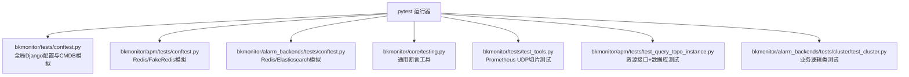
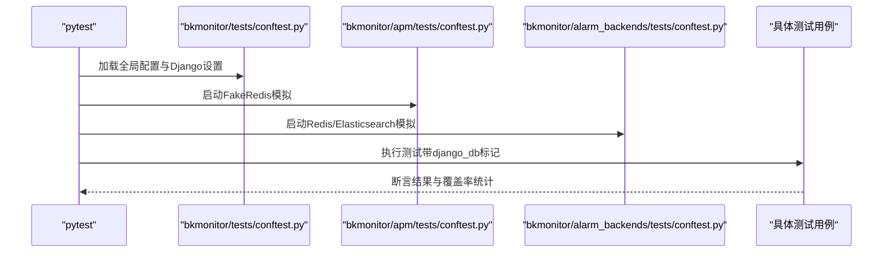
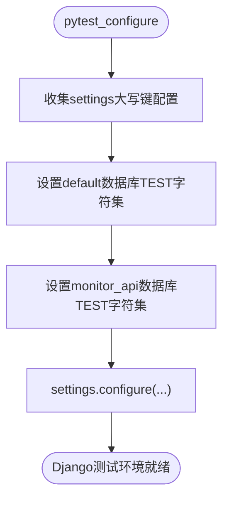
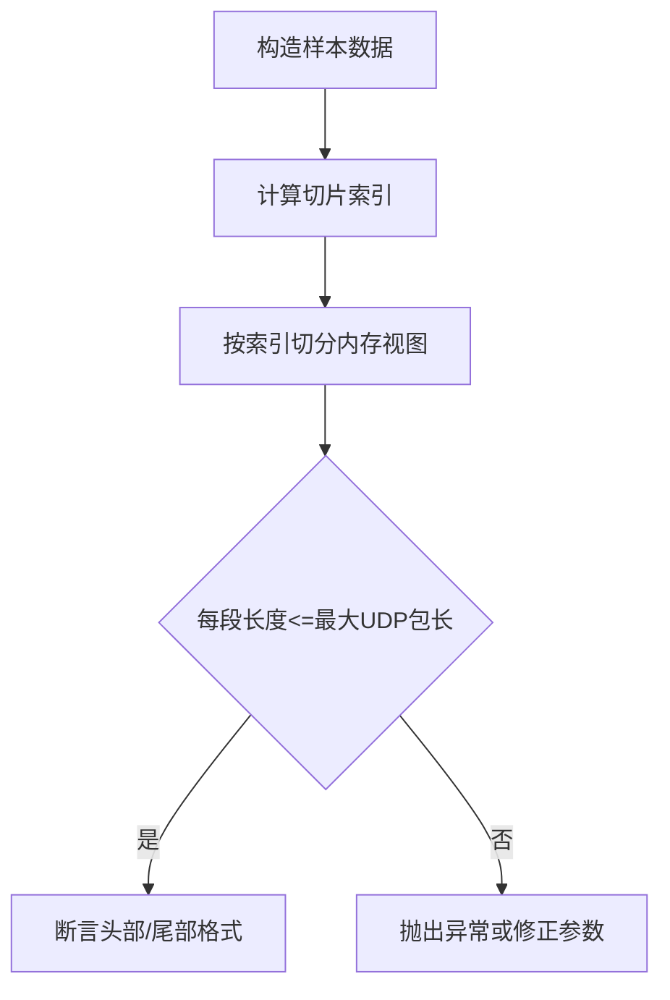
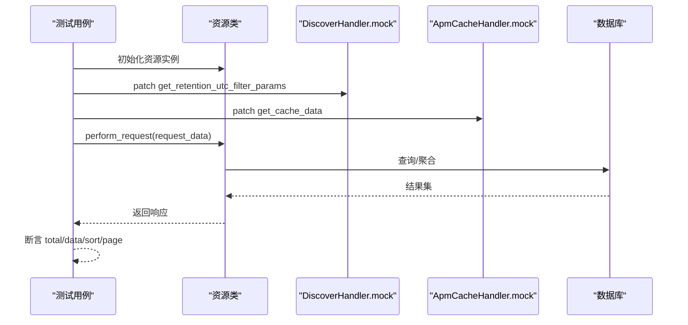
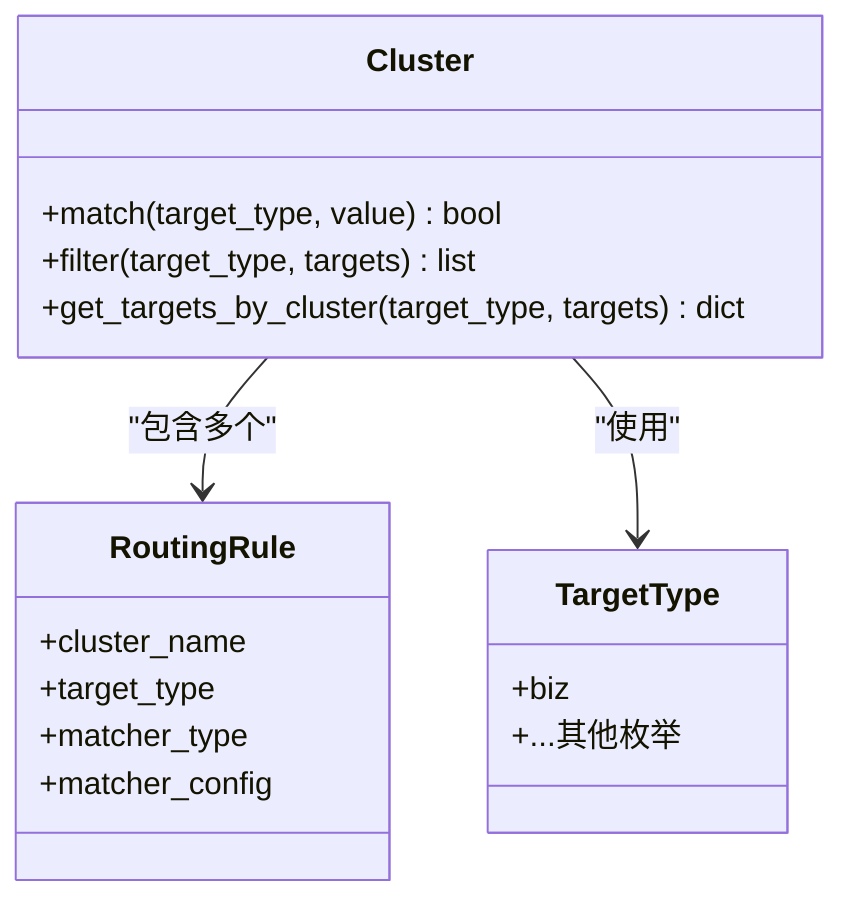
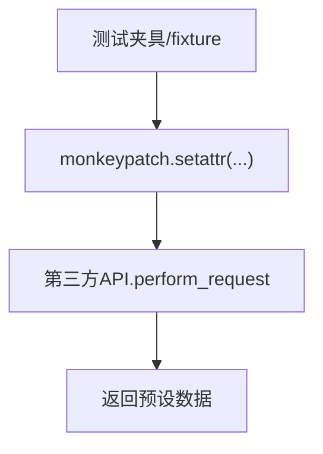
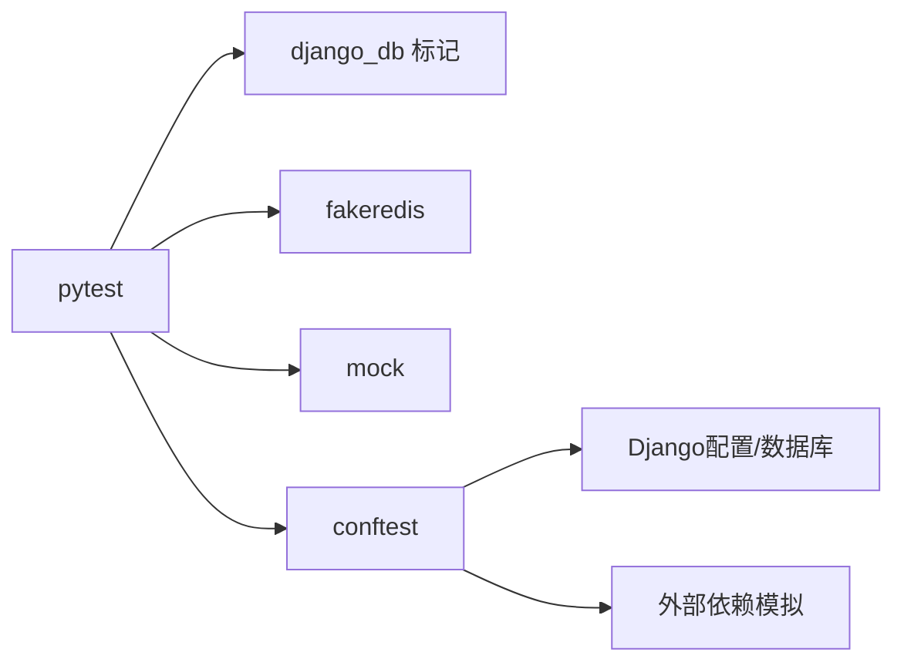

# 单元测试

<cite>
**本文引用的文件**
- [bkmonitor/tests/conftest.py](file://bkmonitor/tests/conftest.py)
- [bkmonitor/apm/tests/conftest.py](file://bkmonitor/apm/tests/conftest.py)
- [bkmonitor/alarm_backends/tests/conftest.py](file://bkmonitor/alarm_backends/tests/conftest.py)
- [bkmonitor/core/testing.py](file://bkmonitor/core/testing.py)
- [bkmonitor/tests/test_tools.py](file://bkmonitor/tests/test_tools.py)
- [bkmonitor/apm/tests/test_query_topo_instance.py](file://bkmonitor/apm/tests/test_query_topo_instance.py)
- [bkmonitor/alarm_backends/tests/cluster/test_cluster.py](file://bkmonitor/alarm_backends/tests/cluster/test_cluster.py)
- [pyproject.toml](file://pyproject.toml)
</cite>

## 目录
1. [简介](#简介)
2. [项目结构](#项目结构)
3. [核心组件](#核心组件)
4. [架构总览](#架构总览)
5. [详细组件分析](#详细组件分析)
6. [依赖分析](#依赖分析)
7. [性能考虑](#性能考虑)
8. [故障排查指南](#故障排查指南)
9. [结论](#结论)
10. [附录](#附录)

## 简介
本文件面向Django项目的单元测试实践，系统梳理了pytest在本仓库中的配置方式、测试夹具（conftest）的组织与作用、测试工具函数的使用、以及针对模型、视图、序列化器与业务逻辑的测试编写方法。同时给出测试数据准备、模拟对象使用、断言方法与测试覆盖率统计的建议与示例路径，帮助开发者快速上手并规范化单元测试流程。

## 项目结构
- 测试框架：pytest
- Django集成：通过pytest插件与django_db标记进行数据库测试
- 多模块测试隔离：各子应用（如apm、alarm_backends等）拥有独立的conftest，用于数据库、缓存、外部依赖的模拟与初始化
- 公共测试工具：core.testing提供通用断言辅助函数；tests/test_tools.py提供特定业务场景的测试工具与用例

**图表来源**
- [bkmonitor/tests/conftest.py:19-36](file://bkmonitor/tests/conftest.py#L19-L36)
- [bkmonitor/apm/tests/conftest.py:18-22](file://bkmonitor/apm/tests/conftest.py#L18-L22)
- [bkmonitor/alarm_backends/tests/conftest.py:24-32](file://bkmonitor/alarm_backends/tests/conftest.py#L24-L32)
- [bkmonitor/core/testing.py:13-34](file://bkmonitor/core/testing.py#L13-L34)
- [bkmonitor/tests/test_tools.py:17-36](file://bkmonitor/tests/test_tools.py#L17-L36)
- [bkmonitor/apm/tests/test_query_topo_instance.py:28-33](file://bkmonitor/apm/tests/test_query_topo_instance.py#L28-L33)
- [bkmonitor/alarm_backends/tests/cluster/test_cluster.py:14-136](file://bkmonitor/alarm_backends/tests/cluster/test_cluster.py#L14-L136)

**章节来源**
- [bkmonitor/tests/conftest.py:19-36](file://bkmonitor/tests/conftest.py#L19-L36)
- [bkmonitor/apm/tests/conftest.py:18-22](file://bkmonitor/apm/tests/conftest.py#L18-L22)
- [bkmonitor/alarm_backends/tests/conftest.py:24-32](file://bkmonitor/alarm_backends/tests/conftest.py#L24-L32)
- [bkmonitor/core/testing.py:13-34](file://bkmonitor/core/testing.py#L13-L34)
- [bkmonitor/tests/test_tools.py:17-36](file://bkmonitor/tests/test_tools.py#L17-L36)
- [bkmonitor/apm/tests/test_query_topo_instance.py:28-33](file://bkmonitor/apm/tests/test_query_topo_instance.py#L28-L33)
- [bkmonitor/alarm_backends/tests/cluster/test_cluster.py:14-136](file://bkmonitor/alarm_backends/tests/cluster/test_cluster.py#L14-L136)

## 核心组件
- pytest配置与运行
  - 使用pytest的标记与夹具机制组织测试生命周期与共享资源
  - 通过django_db标记启用Django数据库测试环境
- 测试夹具（conftest）
  - 全局配置：设置Django配置、数据库字符集与排序规则、数据库别名
  - 模拟外部依赖：Redis/FakeRedis、Elasticsearch、第三方API请求
  - 数据库多实例：支持default与monitor_api双库
- 测试工具函数
  - 字典/列表断言工具：递归断言期望值，提升可读性与健壮性
  - 业务测试工具：构造Prometheus格式样本数据、UDP切片与断言
- 测试用例类型
  - 模型/资源/视图：基于TestCase与数据库标记，覆盖CRUD与接口行为
  - 业务逻辑类：纯Python类的单元测试，验证匹配、过滤与路由逻辑

**章节来源**
- [bkmonitor/tests/conftest.py:19-36](file://bkmonitor/tests/conftest.py#L19-L36)
- [bkmonitor/apm/tests/conftest.py:18-22](file://bkmonitor/apm/tests/conftest.py#L18-L22)
- [bkmonitor/alarm_backends/tests/conftest.py:24-32](file://bkmonitor/alarm_backends/tests/conftest.py#L24-L32)
- [bkmonitor/core/testing.py:13-34](file://bkmonitor/core/testing.py#L13-L34)
- [bkmonitor/tests/test_tools.py:17-36](file://bkmonitor/tests/test_tools.py#L17-L36)

## 架构总览
下图展示了测试运行时的关键交互：pytest加载各模块的conftest，完成Django配置与外部依赖模拟，随后执行具体测试用例。

**图表来源**
- [bkmonitor/tests/conftest.py:19-36](file://bkmonitor/tests/conftest.py#L19-L36)
- [bkmonitor/apm/tests/conftest.py:18-22](file://bkmonitor/apm/tests/conftest.py#L18-L22)
- [bkmonitor/alarm_backends/tests/conftest.py:24-32](file://bkmonitor/alarm_backends/tests/conftest.py#L24-L32)

## 详细组件分析

### 测试夹具与配置（conftest）
- 全局Django配置
  - 从settings模块动态收集大写键作为配置项，注入到settings.configure，确保测试环境具备完整Django上下文
  - 设置默认数据库与monitor_api数据库的TEST字符集与排序规则，避免collation问题
- APM模块模拟
  - 使用fakeredis替换真实Redis客户端，保证测试稳定性与速度
- 告警后端模块模拟
  - 替换Redis连接为FakeRedis，替换Elasticsearch连接为FakeElasticsearchBucket
  - 关闭推送事件到FTA开关，避免副作用
  - 指定TestCase.databases为{"default","monitor_api"}以支持多数据库测试
- 外部API模拟
  - 通过monkeypatch对第三方API的perform_request进行替换，返回预设数据，便于断言

**图表来源**
- [bkmonitor/tests/conftest.py:19-36](file://bkmonitor/tests/conftest.py#L19-L36)

**章节来源**
- [bkmonitor/tests/conftest.py:19-36](file://bkmonitor/tests/conftest.py#L19-L36)
- [bkmonitor/apm/tests/conftest.py:18-22](file://bkmonitor/apm/tests/conftest.py#L18-L22)
- [bkmonitor/alarm_backends/tests/conftest.py:24-32](file://bkmonitor/alarm_backends/tests/conftest.py#L24-L32)

### 测试工具函数
- 字典/列表断言工具
  - 支持嵌套字典与列表的递归断言，简化复杂响应体的校验
- Prometheus UDP切片测试工具
  - 提供构造Prometheus格式样本数据的方法
  - 提供参数化测试，验证切片索引计算与片段边界约束

**图表来源**
- [bkmonitor/tests/test_tools.py:17-36](file://bkmonitor/tests/test_tools.py#L17-L36)
- [bkmonitor/tests/test_tools.py:42-67](file://bkmonitor/tests/test_tools.py#L42-L67)

**章节来源**
- [bkmonitor/core/testing.py:13-34](file://bkmonitor/core/testing.py#L13-L34)
- [bkmonitor/tests/test_tools.py:17-36](file://bkmonitor/tests/test_tools.py#L17-L36)
- [bkmonitor/tests/test_tools.py:42-67](file://bkmonitor/tests/test_tools.py#L42-L67)

### 针对模型与资源的单元测试
- 数据库标记与多库
  - 使用pytestmark或装饰器标记django_db，支持多数据库TestCase.databases
  - 在setUp中批量创建测试数据，减少重复代码
- 资源接口测试
  - 通过mock.patch替换内部依赖（如缓存、保留期参数），聚焦接口行为与返回结构
  - 断言总数与分页/排序字段的行为一致性

**图表来源**
- [bkmonitor/apm/tests/test_query_topo_instance.py:28-33](file://bkmonitor/apm/tests/test_query_topo_instance.py#L28-L33)
- [bkmonitor/apm/tests/test_query_topo_instance.py:61-80](file://bkmonitor/apm/tests/test_query_topo_instance.py#L61-L80)
- [bkmonitor/apm/tests/test_query_topo_instance.py:81-106](file://bkmonitor/apm/tests/test_query_topo_instance.py#L81-L106)
- [bkmonitor/apm/tests/test_query_topo_instance.py:107-135](file://bkmonitor/apm/tests/test_query_topo_instance.py#L107-L135)

**章节来源**
- [bkmonitor/apm/tests/test_query_topo_instance.py:28-33](file://bkmonitor/apm/tests/test_query_topo_instance.py#L28-L33)
- [bkmonitor/apm/tests/test_query_topo_instance.py:61-80](file://bkmonitor/apm/tests/test_query_topo_instance.py#L61-L80)
- [bkmonitor/apm/tests/test_query_topo_instance.py:81-106](file://bkmonitor/apm/tests/test_query_topo_instance.py#L81-L106)
- [bkmonitor/apm/tests/test_query_topo_instance.py:107-135](file://bkmonitor/apm/tests/test_query_topo_instance.py#L107-L135)

### 针对业务逻辑类的单元测试
- 类方法断言
  - 验证匹配器、过滤器与目标分组逻辑
  - 使用多种matcher类型与条件组合，覆盖边界与异常分支

**图表来源**
- [bkmonitor/alarm_backends/tests/cluster/test_cluster.py:14-136](file://bkmonitor/alarm_backends/tests/cluster/test_cluster.py#L14-L136)

**章节来源**
- [bkmonitor/alarm_backends/tests/cluster/test_cluster.py:14-136](file://bkmonitor/alarm_backends/tests/cluster/test_cluster.py#L14-L136)

### 针对外部依赖与API的模拟
- CMDB服务模拟
  - 通过monkeypatch替换ListServiceInstanceDetail.perform_request，返回固定结构的mock数据
- BCS集群管理模拟
  - 通过fixture替换FetchClustersResource.perform_request，返回预设集群列表

**图表来源**
- [bkmonitor/tests/conftest.py:38-121](file://bkmonitor/tests/conftest.py#L38-L121)
- [bkmonitor/alarm_backends/tests/conftest.py:49-55](file://bkmonitor/alarm_backends/tests/conftest.py#L49-L55)

**章节来源**
- [bkmonitor/tests/conftest.py:38-121](file://bkmonitor/tests/conftest.py#L38-L121)
- [bkmonitor/alarm_backends/tests/conftest.py:49-55](file://bkmonitor/alarm_backends/tests/conftest.py#L49-L55)

## 依赖分析
- 测试运行器与工具链
  - pytest作为主测试运行器，配合django_db标记与fakeredis、mock等库
  - 代码风格与静态检查工具（flake8、ruff、isort、black）与测试解耦，但建议在CI中统一执行
- 模块间耦合
  - 各子模块conftest相互独立，避免跨模块污染
  - 业务逻辑类测试不依赖数据库，降低耦合度

**图表来源**
- [pyproject.toml:1-63](file://pyproject.toml#L1-L63)
- [bkmonitor/apm/tests/conftest.py:18-22](file://bkmonitor/apm/tests/conftest.py#L18-L22)
- [bkmonitor/alarm_backends/tests/conftest.py:24-32](file://bkmonitor/alarm_backends/tests/conftest.py#L24-L32)

**章节来源**
- [pyproject.toml:1-63](file://pyproject.toml#L1-L63)
- [bkmonitor/apm/tests/conftest.py:18-22](file://bkmonitor/apm/tests/conftest.py#L18-L22)
- [bkmonitor/alarm_backends/tests/conftest.py:24-32](file://bkmonitor/alarm_backends/tests/conftest.py#L24-L32)

## 性能考虑
- 使用fakeredis替代真实Redis，显著降低I/O开销与测试时延
- 对外部API进行mock，避免网络抖动与第三方限流影响
- 参数化测试（pytest.mark.parametrize）可复用断言逻辑，减少重复执行
- 复杂数据构造建议集中在setUp或工具函数中，避免在单测中重复构建

## 故障排查指南
- 数据库字符集/排序规则错误
  - 症状：迁移或查询报错
  - 处理：确认conftest中DATABASES.TEST的CHARSET/COLLATION已正确设置
- 多数据库未启用
  - 症状：访问monitor_api时报错
  - 处理：在测试类中声明databases或使用pytestmark=django_db(databases="__all__")
- Redis/Elasticsearch连接失败
  - 症状：连接超时或认证错误
  - 处理：确认对应模块conftest中已启动FakeRedis或FakeElasticsearch
- 外部API返回不稳定
  - 症状：偶发失败
  - 处理：使用monkeypatch/fixture固定返回值，确保幂等性

**章节来源**
- [bkmonitor/tests/conftest.py:24-32](file://bkmonitor/tests/conftest.py#L24-L32)
- [bkmonitor/apm/tests/conftest.py:18-22](file://bkmonitor/apm/tests/conftest.py#L18-L22)
- [bkmonitor/alarm_backends/tests/conftest.py:24-32](file://bkmonitor/alarm_backends/tests/conftest.py#L24-L32)

## 结论
本项目的单元测试以pytest为核心，结合Django数据库标记与fakeredis、mock等工具，实现了稳定、可扩展且高性能的测试体系。通过模块化的conftest与公共断言工具，测试编写更加简洁一致。建议在新增功能时遵循现有模式：优先使用fixture与mock，必要时在setUp中准备最小化测试数据，使用参数化覆盖边界条件，并关注断言的可读性与可维护性。

## 附录
- 最佳实践清单
  - 使用pytestmark或装饰器统一标记django_db
  - 将外部依赖替换为mock/fakeredis，避免真实网络调用
  - 用参数化测试覆盖典型与异常输入
  - 使用core.testing中的断言工具简化复杂结构断言
  - 在测试类中明确声明databases，避免遗漏
  - 保持测试用例小而专一，尽量无状态与可并行