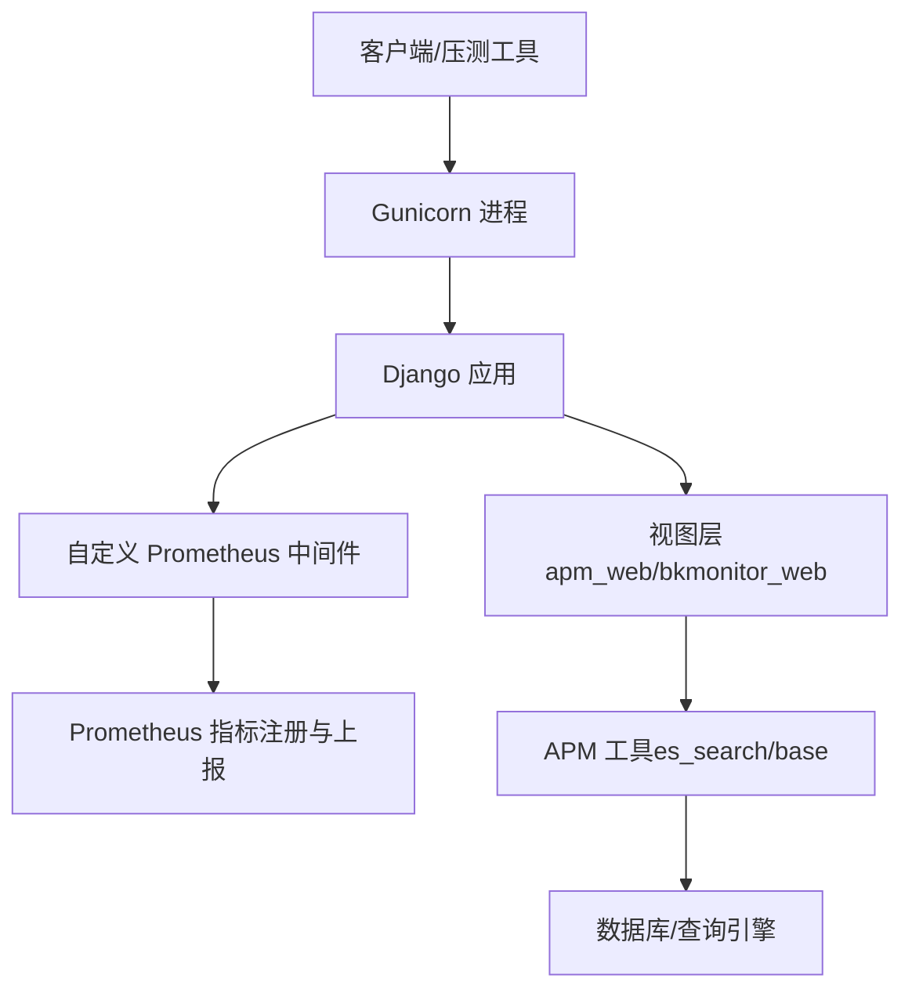
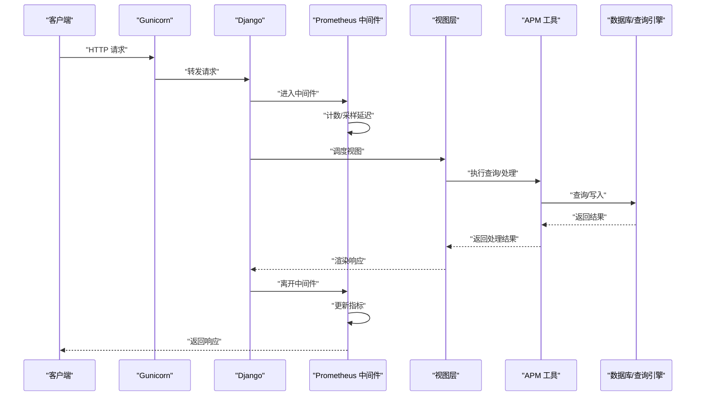
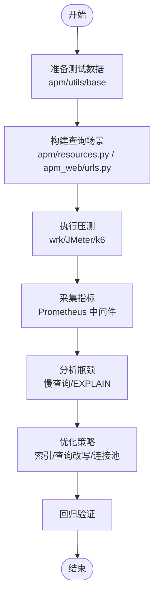
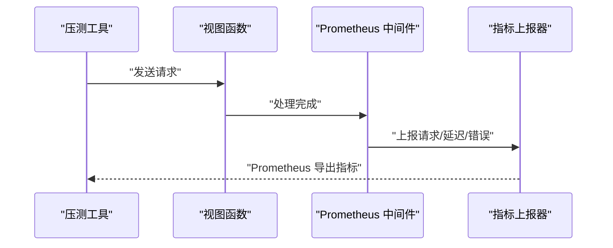
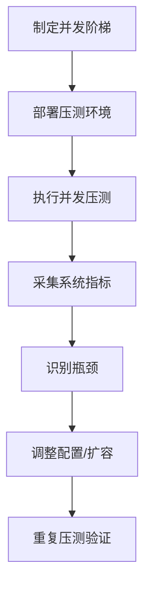
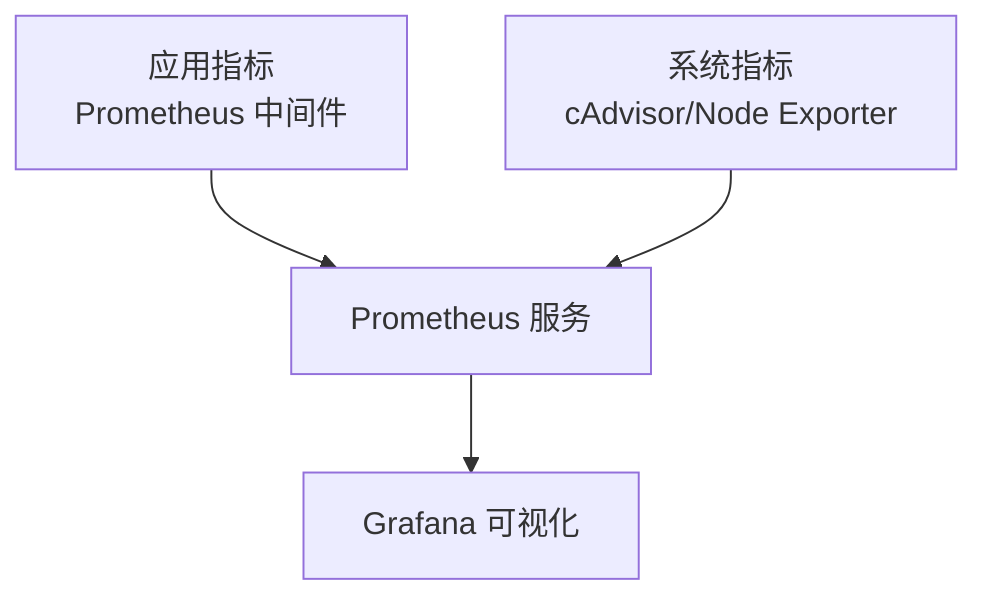
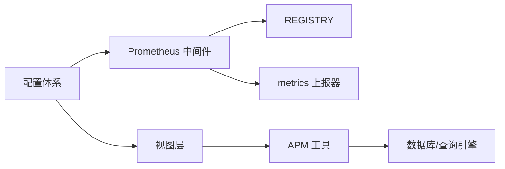

# 性能测试

<cite>
**本文引用的文件**
- [settings.py](file://bkmonitor/settings.py)
- [prometheus.py](file://bkmonitor/bkmonitor/middlewares/prometheus.py)
- [default.py](file://bkmonitor/config/default.py)
- [dev.py](file://bkmonitor/config/dev.py)
- [prod.py](file://bkmonitor/config/prod.py)
- [urls.py](file://bkmonitor/urls.py)
- [gunicorn_config.py](file://bkmonitor/gunicorn_config.py)
- [Makefile](file://bkmonitor/Makefile)
- [Dockerfile](file://bkmonitor/Dockerfile)
- [README.md](file://bkmonitor/README.md)
- [apm_web/views.py](file://bkmonitor/apm_web/views.py)
- [apm_web/urls.py](file://bkmonitor/apm_web/urls.py)
- [apm/models/application.py](file://bkmonitor/apm/models/application.py)
- [apm/utils/base.py](file://bkmonitor/apm/utils/base.py)
- [apm/utils/es_search.py](file://bkmonitor/apm/utils/es_search.py)
- [apm/resources.py](file://bkmonitor/apm/resources.py)
- [bkmonitor/web/urls.py](file://bkmonitor/bkmonitor/web/urls.py)
- [bkmonitor/web/views.py](file://bkmonitor/bkmonitor/web/views.py)
- [bkmonitor/middlewares/prometheus.py](file://bkmonitor/bkmonitor/middlewares/prometheus.py)
- [bkmonitor/core/prometheus/base.py](file://bkmonitor/bkmonitor/core/prometheus/base.py)
- [bkmonitor/core/prometheus/metrics.py](file://bkmonitor/bkmonitor/core/prometheus/metrics.py)
- [bkmonitor/apm_web/views.py](file://bkmonitor/apm_web/views.py)
- [bkmonitor/apm_web/urls.py](file://bkmonitor/apm_web/urls.py)
- [bkmonitor/apm/models/application.py](file://bkmonitor/apm/models/application.py)
- [bkmonitor/apm/utils/base.py](file://bkmonitor/apm/utils/base.py)
- [bkmonitor/apm/utils/es_search.py](file://bkmonitor/apm/utils/es_search.py)
- [bkmonitor/apm/resources.py](file://bkmonitor/apm/resources.py)
- [bkmonitor/bkmonitor/web/urls.py](file://bkmonitor/bkmonitor/web/urls.py)
- [bkmonitor/bkmonitor/web/views.py](file://bkmonitor/bkmonitor/web/views.py)
</cite>

## 目录
1. [简介](#简介)
2. [项目结构](#项目结构)
3. [核心组件](#核心组件)
4. [架构总览](#架构总览)
5. [详细组件分析](#详细组件分析)
6. [依赖分析](#依赖分析)
7. [性能考虑](#性能考虑)
8. [故障排查指南](#故障排查指南)
9. [结论](#结论)
10. [附录](#附录)

## 简介
本文件面向蓝鲸监控平台（bk-monitor）的性能测试工作，系统性阐述性能基准测试、压力测试与负载测试的实施方法，覆盖数据库查询性能测试、API 响应时间测试、并发用户测试与资源使用监控，并提供测试环境搭建、测试场景设计与性能瓶颈分析方法。文档结合仓库中已有的中间件与配置能力，给出可落地的测试步骤与指标采集方案。

## 项目结构
- 应用入口与路由
  - 应用入口位于根目录的 URL 配置，统一挂载各子应用（如 apm_web、bkmonitor_web 等），便于集中进行 API 性能测试与压测。
- 配置体系
  - settings.py 负责加载运行环境与角色配置，结合 config/default.py、config/dev.py、config/prod.py 实现不同环境下的参数注入与行为差异。
- 中间件与指标
  - 自定义 Prometheus 中间件在请求前后记录请求数、响应数与延迟等指标，结合 core/prometheus 提供的指标注册与上报能力，支撑性能观测与分析。
- APM 与查询工具
  - apm_web 提供 APM 相关视图与资源，apm/utils 下提供 ES 查询与基础工具，便于构建数据库查询性能测试场景。
- 运行与容器化
  - gunicorn_config.py、Dockerfile、Makefile、README.md 提供运行与打包参考，便于在容器环境中进行压测与资源监控。

图表来源
- [urls.py](file://bkmonitor/urls.py)
- [prometheus.py](file://bkmonitor/bkmonitor/middlewares/prometheus.py)
- [default.py](file://bkmonitor/config/default.py)
- [apm_web/views.py](file://bkmonitor/apm_web/views.py)
- [apm/utils/es_search.py](file://bkmonitor/apm/utils/es_search.py)

章节来源
- [settings.py:1-110](file://bkmonitor/settings.py#L1-L110)
- [default.py:1-800](file://bkmonitor/config/default.py#L1-L800)
- [dev.py:1-67](file://bkmonitor/config/dev.py#L1-L67)
- [prod.py:1-15](file://bkmonitor/config/prod.py#L1-L15)

## 核心组件
- 自定义 Prometheus 中间件
  - 在请求进入与返回阶段分别计数与采样延迟，附加主机名、环境、应用标识与角色标签，便于多维度分析。
- 指标注册与上报
  - 通过 core/prometheus 提供的 REGISTRY 与 metrics 上报器，实现指标的统一注册与导出。
- APM 查询工具
  - apm/utils/es_search 提供 ES 查询封装，apm/utils/base 提供通用工具，便于构造数据库查询性能测试场景。
- 配置与运行
  - settings 与 config/*.py 提供环境变量注入、数据库连接池与连接复用、Celery 并发等关键性能参数。

章节来源
- [prometheus.py:1-71](file://bkmonitor/bkmonitor/middlewares/prometheus.py#L1-L71)
- [default.py:240-280](file://bkmonitor/config/default.py#L240-L280)
- [apm/utils/es_search.py](file://bkmonitor/apm/utils/es_search.py)
- [apm/utils/base.py](file://bkmonitor/apm/utils/base.py)

## 架构总览
下图展示性能测试视角下的关键交互：客户端发起请求，经由 Gunicorn 进入 Django，中间件采集指标，视图层调用 APM 工具执行查询，最终返回结果并更新指标。

图表来源
- [prometheus.py:40-71](file://bkmonitor/bkmonitor/middlewares/prometheus.py#L40-L71)
- [apm_web/views.py](file://bkmonitor/apm_web/views.py)
- [apm/utils/es_search.py](file://bkmonitor/apm/utils/es_search.py)

## 详细组件分析

### 数据库查询性能测试
- 测试目标
  - 针对 APM 查询工具（如 apm/utils/es_search）构造典型查询场景，测量不同数据规模、聚合复杂度与索引策略下的查询耗时与吞吐。
- 测试步骤
  - 准备测试数据：使用 apm/utils/base 的工具生成或导入测试数据，确保覆盖不同维度与时间窗口。
  - 设计查询场景：基于 apm/resources.py 的资源定义与 apm_web/urls.py 的接口，构造不同复杂度的查询请求。
  - 执行压测：使用压测工具（如 wrk、JMeter、k6）对查询接口进行并发与持续压测，记录 p50/p95/p99 延迟与错误率。
  - 指标采集：启用 Prometheus 中间件，采集请求延迟分布与错误计数；同时结合数据库慢查询日志与 EXPLAIN 分析瓶颈。
- 关键注意
  - 注意数据库连接池与连接复用配置（见 config/default.py 中的连接相关参数），避免连接争用导致的性能抖动。

图表来源
- [apm/utils/base.py](file://bkmonitor/apm/utils/base.py)
- [apm/resources.py](file://bkmonitor/apm/resources.py)
- [apm_web/urls.py](file://bkmonitor/apm_web/urls.py)
- [prometheus.py:40-71](file://bkmonitor/bkmonitor/middlewares/prometheus.py#L40-L71)

章节来源
- [apm/utils/es_search.py](file://bkmonitor/apm/utils/es_search.py)
- [apm/utils/base.py](file://bkmonitor/apm/utils/base.py)
- [apm/resources.py](file://bkmonitor/apm/resources.py)
- [apm_web/urls.py](file://bkmonitor/apm_web/urls.py)
- [default.py:240-280](file://bkmonitor/config/default.py#L240-L280)

### API 响应时间测试
- 测试目标
  - 对 apm_web 与 bkmonitor_web 的核心接口进行响应时间与吞吐测试，识别慢接口与异常路径。
- 测试步骤
  - 选择接口：基于 apm_web/views.py 与 bkmonitor/web/views.py 中的视图函数，确定待测接口清单。
  - 设计场景：构造正常路径与异常路径（如参数缺失、权限不足、数据不存在）。
  - 执行压测：使用压测工具对选定接口进行并发与持续压测，记录响应时间分布与错误率。
  - 指标采集：启用 Prometheus 中间件，采集请求总数、响应总数与延迟分布，结合日志定位异常。
- 关键注意
  - 中间件会在响应阶段调用指标上报，确保在高并发下指标上报不会成为额外瓶颈。

图表来源
- [apm_web/views.py](file://bkmonitor/apm_web/views.py)
- [bkmonitor/web/views.py](file://bkmonitor/bkmonitor/web/views.py)
- [prometheus.py:40-71](file://bkmonitor/bkmonitor/middlewares/prometheus.py#L40-L71)
- [core/prometheus/metrics.py](file://bkmonitor/bkmonitor/core/prometheus/metrics.py)

章节来源
- [apm_web/views.py](file://bkmonitor/apm_web/views.py)
- [bkmonitor/web/views.py](file://bkmonitor/bkmonitor/web/views.py)
- [prometheus.py:40-71](file://bkmonitor/bkmonitor/middlewares/prometheus.py#L40-L71)

### 并发用户测试
- 测试目标
  - 模拟多用户并发访问，评估系统在峰值并发下的稳定性与资源占用。
- 测试步骤
  - 设定并发阶梯：从低并发逐步提升至峰值并发，观察延迟与错误率变化。
  - 覆盖关键路径：包括登录、查询、配置变更等高频路径。
  - 观察资源：结合容器与主机资源监控（CPU/内存/IO/网络），定位瓶颈。
- 关键注意
  - 结合 gunicorn_config.py 的进程与线程配置，合理设置并发参数，避免进程阻塞。

图表来源
- [gunicorn_config.py](file://bkmonitor/gunicorn_config.py)
- [prometheus.py:40-71](file://bkmonitor/bkmonitor/middlewares/prometheus.py#L40-L71)

章节来源
- [gunicorn_config.py](file://bkmonitor/gunicorn_config.py)
- [prometheus.py:40-71](file://bkmonitor/bkmonitor/middlewares/prometheus.py#L40-L71)

### 资源使用监控
- 监控对象
  - CPU、内存、磁盘 IO、网络带宽、数据库连接数与等待时间。
- 指标来源
  - 应用侧：Prometheus 中间件与 core/prometheus 指标注册。
  - 系统侧：操作系统与容器监控（如 cAdvisor、Node Exporter）。
- 采集建议
  - 在压测期间同时采集应用指标与系统指标，建立关联分析。

图表来源
- [prometheus.py:28-71](file://bkmonitor/bkmonitor/middlewares/prometheus.py#L28-L71)
- [core/prometheus/base.py](file://bkmonitor/bkmonitor/core/prometheus/base.py)

章节来源
- [prometheus.py:28-71](file://bkmonitor/bkmonitor/middlewares/prometheus.py#L28-L71)
- [core/prometheus/base.py](file://bkmonitor/bkmonitor/core/prometheus/base.py)

## 依赖分析
- 组件耦合
  - 中间件与指标模块解耦，通过 REGISTRY 与 metrics 上报器实现松耦合。
  - 视图层与 APM 工具通过清晰的接口调用，便于替换与扩展。
- 外部依赖
  - 数据库连接池与连接复用、ES 查询、Gunicorn 进程模型等均来自配置与第三方库，需关注其参数对性能的影响。

图表来源
- [prometheus.py:28-71](file://bkmonitor/bkmonitor/middlewares/prometheus.py#L28-L71)
- [apm/utils/es_search.py](file://bkmonitor/apm/utils/es_search.py)
- [default.py:240-280](file://bkmonitor/config/default.py#L240-L280)

章节来源
- [prometheus.py:28-71](file://bkmonitor/bkmonitor/middlewares/prometheus.py#L28-L71)
- [default.py:240-280](file://bkmonitor/config/default.py#L240-L280)

## 性能考虑
- 数据库连接与复用
  - 利用 config/default.py 中的连接池与连接复用参数，减少连接开销与上下文切换。
- 中间件开销
  - Prometheus 中间件在请求前后进行计数与采样，需关注高并发下的指标上报开销。
- 查询优化
  - 使用 apm/utils/es_search 与 EXPLAIN 分析查询计划，优化索引与查询语句。
- 并发与进程模型
  - 结合 gunicorn_config.py 的进程与线程配置，合理设置并发参数，避免阻塞与资源争用。

章节来源
- [default.py:240-280](file://bkmonitor/config/default.py#L240-L280)
- [prometheus.py:40-71](file://bkmonitor/bkmonitor/middlewares/prometheus.py#L40-L71)
- [apm/utils/es_search.py](file://bkmonitor/apm/utils/es_search.py)
- [gunicorn_config.py](file://bkmonitor/gunicorn_config.py)

## 故障排查指南
- 指标不可见或异常
  - 检查中间件是否正确注册与启用，确认 REGISTRY 与 metrics 上报器可用。
- 响应时间异常升高
  - 结合压测日志与数据库慢查询日志，定位热点接口与慢查询。
- 资源使用过高
  - 通过系统监控与应用指标对比，识别 CPU/内存/IO/网络瓶颈。
- 配置问题
  - 检查 settings 与 config/*.py 中的关键参数（如连接池、并发、超时等），确保与压测目标一致。

章节来源
- [prometheus.py:28-71](file://bkmonitor/bkmonitor/middlewares/prometheus.py#L28-L71)
- [settings.py:1-110](file://bkmonitor/settings.py#L1-L110)
- [default.py:240-280](file://bkmonitor/config/default.py#L240-L280)

## 结论
通过结合中间件指标采集、APM 查询工具与配置体系，本项目具备完善的性能测试基础。建议在测试过程中同步采集应用与系统指标，围绕数据库查询、API 响应与并发用户三条主线开展基准、压力与负载测试，形成闭环的性能优化流程。

## 附录
- 测试环境搭建
  - 使用 Dockerfile 与 Makefile 进行容器化部署，结合 gunicorn_config.py 调整进程与线程参数。
  - 参考 README.md 获取运行与部署指导。
- 测试场景设计
  - 基于 apm_web/urls.py 与 apm/resources.py 定义查询场景，覆盖不同数据规模与复杂度。
- 性能瓶颈分析方法
  - 采用指标关联分析法，将应用指标与系统指标、数据库指标进行交叉比对，定位瓶颈根因。

章节来源
- [Dockerfile](file://bkmonitor/Dockerfile)
- [Makefile](file://bkmonitor/Makefile)
- [gunicorn_config.py](file://bkmonitor/gunicorn_config.py)
- [README.md](file://bkmonitor/README.md)
- [apm_web/urls.py](file://bkmonitor/apm_web/urls.py)
- [apm/resources.py](file://bkmonitor/apm/resources.py)