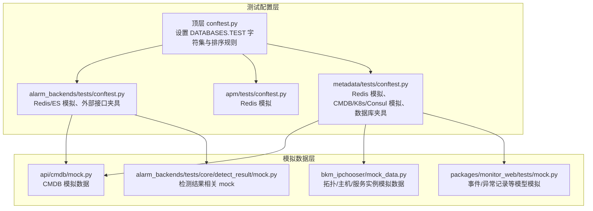
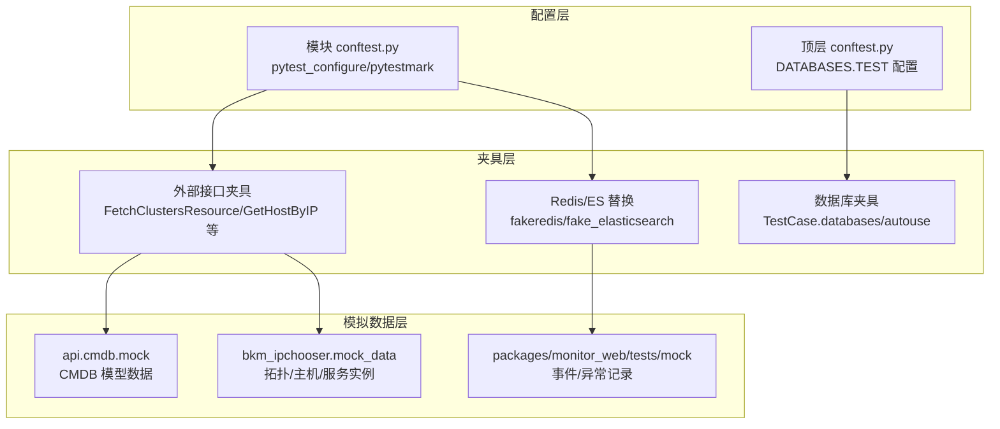
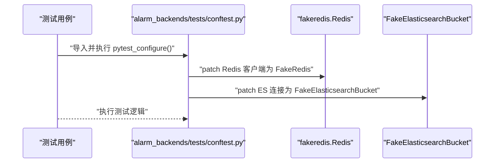
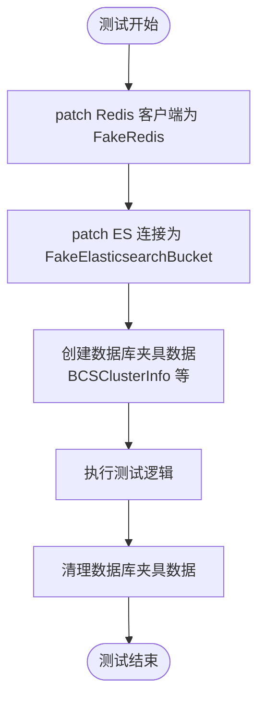
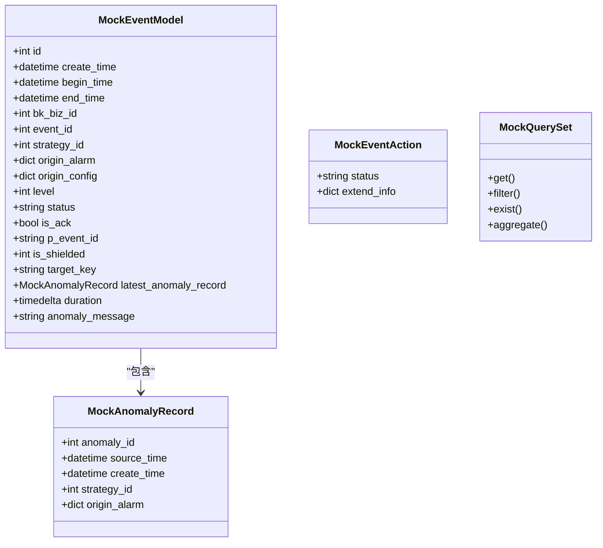
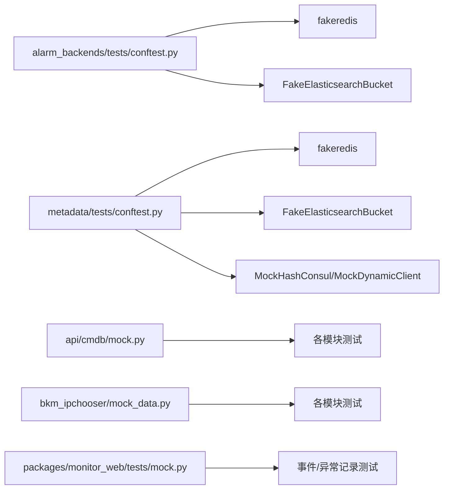

# 测试数据管理

<cite>
**本文引用的文件**   
- [bkmonitor\alarm_backends\tests\conftest.py](file://bkmonitor\alarm_backends\tests\conftest.py)
- [bkmonitor\apm\tests\conftest.py](file://bkmonitor\apm\tests\conftest.py)
- [bkmonitor\metadata\tests\conftest.py](file://bkmonitor\metadata\tests\conftest.py)
- [bkmonitor\tests\conftest.py](file://bkmonitor\tests\conftest.py)
- [bkmonitor\api\cmdb\mock.py](file://bkmonitor\api\cmdb\mock.py)
- [bkmonitor\bkm_ipchooser\mock_data.py](file://bkmonitor\bkm_ipchooser\mock_data.py)
- [bkmonitor\packages\monitor_web\tests\mock.py](file://bkmonitor\packages\monitor_web\tests\mock.py)
- [bkmonitor\alarm_backends\tests\core\detect_result\mock.py](file://bkmonitor\alarm_backends\tests\core\detect_result\mock.py)
- [bkmonitor\packages\monitor_web\tests\mock_settings.py](file://bkmonitor\packages\monitor_web\tests\mock_settings.py)
</cite>

## 目录
1. [简介](#简介)
2. [项目结构](#项目结构)
3. [核心组件](#核心组件)
4. [架构总览](#架构总览)
5. [详细组件分析](#详细组件分析)
6. [依赖分析](#依赖分析)
7. [性能考虑](#性能考虑)
8. [故障排查指南](#故障排查指南)
9. [结论](#结论)
10. [附录](#附录)

## 简介
本文件聚焦于测试数据管理，系统化梳理测试夹具（fixtures）、模拟数据与外部依赖替换、测试数据库管理与隔离、以及测试环境数据同步策略。通过对多个子模块的 conftest.py 与 mock 数据文件的分析，总结出统一的测试数据生成、维护与清理策略，并给出最佳实践与可重复性保障方法。

## 项目结构
测试数据管理主要分布在以下位置：
- 各功能域的测试配置与夹具：各模块 tests 目录下的 conftest.py
- 外部依赖模拟与 Redis/ES 替换：各模块 conftest.py 中的 pytest_configure 与夹具
- 模拟数据工厂：api.*、bkm_ipchooser、packages/* 等目录下的 mock 数据文件
- 数据库与测试环境配置：顶层与模块级 conftest.py 中的 DATABASES.TEST 配置

图表来源
- [bkmonitor\tests\conftest.py:19-36](file://bkmonitor\tests\conftest.py#L19-L36)
- [bkmonitor\alarm_backends\tests\conftest.py:24-32](file://bkmonitor\alarm_backends\tests\conftest.py#L24-L32)
- [bkmonitor\apm\tests\conftest.py:18-22](file://bkmonitor\apm\tests\conftest.py#L18-L22)
- [bkmonitor\metadata\tests\conftest.py:142-153](file://bkmonitor\metadata\tests\conftest.py#L142-L153)
- [bkmonitor\api\cmdb\mock.py:20-526](file://bkmonitor\api\cmdb\mock.py#L20-L526)
- [bkmonitor\bkm_ipchooser\mock_data.py:1-194](file://bkmonitor\bkm_ipchooser\mock_data.py#L1-L194)
- [bkmonitor\packages\monitor_web\tests\mock.py:20-63](file://bkmonitor\packages\monitor_web\tests\mock.py#L20-L63)
- [bkmonitor\alarm_backends\tests\core\detect_result\mock.py:13-15](file://bkmonitor\alarm_backends\tests\core\detect_result\mock.py#L13-L15)

章节来源
- [bkmonitor\tests\conftest.py:19-36](file://bkmonitor\tests\conftest.py#L19-L36)
- [bkmonitor\alarm_backends\tests\conftest.py:24-32](file://bkmonitor\alarm_backends\tests\conftest.py#L24-L32)
- [bkmonitor\apm\tests\conftest.py:18-22](file://bkmonitor\apm\tests\conftest.py#L18-L22)
- [bkmonitor\metadata\tests\conftest.py:142-153](file://bkmonitor\metadata\tests\conftest.py#L142-L153)

## 核心组件
- 测试配置与夹具
  - 顶层 conftest.py：统一设置默认数据库与 monitor_api 数据库的 TEST 字符集与排序规则，确保跨环境一致性。
  - alarm_backends/metadata/apm 等模块 conftest.py：集中进行 Redis/ES 外部依赖替换，注入数据库访问夹具，以及对外部 API 的 monkeypatch。
- 模拟数据工厂
  - api.cmdb.mock：提供业务、主机、模块、拓扑树、服务实例等 CMDB 模型的固定数据集合。
  - bkm_ipchooser.mock_data：提供拓扑树、主机、服务实例、Agent 统计等接口的模拟响应。
  - packages/monitor_web/tests/mock：提供事件、异常记录、查询集等模型与查询对象的模拟封装。
- 数据库与隔离
  - 通过 pytest.mark.django_db 与 TestCase.databases 指定多数据库访问；conftest 中启用数据库访问夹具，确保测试在受控环境中执行。

章节来源
- [bkmonitor\tests\conftest.py:19-36](file://bkmonitor\tests\conftest.py#L19-L36)
- [bkmonitor\alarm_backends\tests\conftest.py:24-32](file://bkmonitor\alarm_backends\tests\conftest.py#L24-L32)
- [bkmonitor\apm\tests\conftest.py:18-22](file://bkmonitor\apm\tests\conftest.py#L18-L22)
- [bkmonitor\metadata\tests\conftest.py:142-153](file://bkmonitor\metadata\tests\conftest.py#L142-L153)
- [bkmonitor\api\cmdb\mock.py:20-526](file://bkmonitor\api\cmdb\mock.py#L20-L526)
- [bkmonitor\bkm_ipchooser\mock_data.py:1-194](file://bkmonitor\bkm_ipchooser\mock_data.py#L1-L194)
- [bkmonitor\packages\monitor_web\tests\mock.py:20-63](file://bkmonitor\packages\monitor_web\tests\mock.py#L20-L63)

## 架构总览
测试数据管理采用“配置层 + 模拟层 + 夹具层”的分层架构，确保：
- 配置层：统一数据库字符集与排序规则，避免跨环境差异导致的测试不稳定。
- 模拟层：以模块化 mock 文件提供稳定、可预期的数据源，减少对外部系统依赖。
- 夹具层：集中管理 Redis/ES 替换、外部 API 模拟与数据库初始化/清理流程。

图表来源
- [bkmonitor\tests\conftest.py:19-36](file://bkmonitor\tests\conftest.py#L19-L36)
- [bkmonitor\alarm_backends\tests\conftest.py:24-32](file://bkmonitor\alarm_backends\tests\conftest.py#L24-L32)
- [bkmonitor\apm\tests\conftest.py:18-22](file://bkmonitor\apm\tests\conftest.py#L18-L22)
- [bkmonitor\metadata\tests\conftest.py:142-153](file://bkmonitor\metadata\tests\conftest.py#L142-L153)
- [bkmonitor\api\cmdb\mock.py:20-526](file://bkmonitor\api\cmdb\mock.py#L20-L526)
- [bkmonitor\bkm_ipchooser\mock_data.py:1-194](file://bkmonitor\bkm_ipchooser\mock_data.py#L1-L194)
- [bkmonitor\packages\monitor_web\tests\mock.py:20-63](file://bkmonitor\packages\monitor_web\tests\mock.py#L20-L63)

## 详细组件分析

### alarm_backends 测试数据管理
- 外部依赖替换
  - Redis 替换：通过 patch 将 Redis 客户端替换为 fakeredis，避免真实 Redis 依赖。
  - Elasticsearch 替换：通过 patch 将连接创建替换为 FakeElasticsearchBucket，屏蔽真实 ES。
- 外部接口夹具
  - 集群列表、节点列表、主机查询等接口通过 monkeypatch 注入固定返回，确保测试稳定性。
- 数据库访问
  - 通过 TestCase.databases 指定多数据库访问，pytestmark 标记 django_db，确保测试在 Django 环境中运行。

图表来源
- [bkmonitor\alarm_backends\tests\conftest.py:24-32](file://bkmonitor\alarm_backends\tests\conftest.py#L24-L32)

章节来源
- [bkmonitor\alarm_backends\tests\conftest.py:24-32](file://bkmonitor\alarm_backends\tests\conftest.py#L24-L32)

### metadata 测试数据管理
- Redis/ES 替换与外部依赖模拟
  - 通过 redis_tools 的属性 mock 和 fakeredis 替换 Redis 客户端。
  - 通过 alarm_backends 的 Redis patch 与 ES 模拟，统一替换多处外部依赖。
  - 提供 HashConsulMocker 与 MockDynamicClient，用于 Consul 与 Kubernetes 动态客户端的模拟。
- 数据库夹具
  - add_bcs_cluster_info 夹具负责在测试前后创建与清理 BCSClusterInfo 数据，确保测试隔离与可重复性。
  - monkeypatch_* 夹具用于对外部接口进行固定返回，避免真实网络调用。

图表来源
- [bkmonitor\metadata\tests\conftest.py:142-153](file://bkmonitor\metadata\tests\conftest.py#L142-L153)
- [bkmonitor\metadata\tests\conftest.py:157-213](file://bkmonitor\metadata\tests\conftest.py#L157-L213)

章节来源
- [bkmonitor\metadata\tests\conftest.py:142-153](file://bkmonitor\metadata\tests\conftest.py#L142-L153)
- [bkmonitor\metadata\tests\conftest.py:157-213](file://bkmonitor\metadata\tests\conftest.py#L157-L213)

### apm 测试数据管理
- Redis 替换
  - 通过 patch 将 ApmCacheHandler 的 Redis 客户端替换为 fakeredis，确保缓存相关逻辑在无真实 Redis 的情况下运行。

章节来源
- [bkmonitor\apm\tests\conftest.py:18-22](file://bkmonitor\apm\tests\conftest.py#L18-L22)

### 顶层测试配置与数据库隔离
- 数据库配置
  - 顶层 conftest.py 将 default 与 monitor_api 数据库的 TEST 字段设置为 UTF8 字符集与排序规则，避免因字符集差异导致的测试失败。
- 数据库访问夹具
  - 通过 autouse 夹具启用数据库访问，确保测试在受控数据库环境中执行。

章节来源
- [bkmonitor\tests\conftest.py:19-36](file://bkmonitor\tests\conftest.py#L19-L36)
- [bkmonitor\tests\conftest.py:237-241](file://bkmonitor\tests\conftest.py#L237-L241)

### 模拟数据工厂与夹具模式
- api.cmdb.mock
  - 提供 Business、Module、Set、TopoTree、Host、ServiceInstance 等固定数据集合，便于上层逻辑测试。
- bkm_ipchooser.mock_data
  - 提供拓扑树、主机、服务实例、Agent 统计等接口的模拟响应，覆盖常见查询场景。
- packages/monitor_web/tests/mock
  - 提供 MockAnomalyRecord、MockEventModel、MockEventAction、MockQuerySet 等模拟对象，简化事件与异常记录相关测试。

图表来源
- [bkmonitor\packages\monitor_web\tests\mock.py:20-63](file://bkmonitor\packages\monitor_web\tests\mock.py#L20-L63)

章节来源
- [bkmonitor\api\cmdb\mock.py:20-526](file://bkmonitor\api\cmdb\mock.py#L20-L526)
- [bkmonitor\bkm_ipchooser\mock_data.py:1-194](file://bkmonitor\bkm_ipchooser\mock_data.py#L1-L194)
- [bkmonitor\packages\monitor_web\tests\mock.py:20-63](file://bkmonitor\packages\monitor_web\tests\mock.py#L20-L63)

## 依赖分析
- 外部依赖替换
  - alarm_backends 与 metadata 模块均通过 fakeredis 替换 Redis，apm 通过 patch 替换特定缓存处理器的 Redis 客户端。
  - alarm_backends 与 metadata 通过 FakeElasticsearchBucket 替换 ES 连接。
- 夹具耦合
  - metadata 的 add_bcs_cluster_info 夹具与 BCSClusterInfo 模型强耦合，确保测试前后数据清理。
  - 多模块共享的 monkeypatch 夹具（如集群/主机/节点）降低重复代码，提升可维护性。
- 数据一致性
  - 通过固定 mock 数据与 fakeredis/ES，避免真实外部系统波动影响测试稳定性。

图表来源
- [bkmonitor\alarm_backends\tests\conftest.py:24-32](file://bkmonitor\alarm_backends\tests\conftest.py#L24-L32)
- [bkmonitor\apm\tests\conftest.py:18-22](file://bkmonitor\apm\tests\conftest.py#L18-L22)
- [bkmonitor\metadata\tests\conftest.py:142-153](file://bkmonitor\metadata\tests\conftest.py#L142-L153)
- [bkmonitor\api\cmdb\mock.py:20-526](file://bkmonitor\api\cmdb\mock.py#L20-L526)
- [bkmonitor\bkm_ipchooser\mock_data.py:1-194](file://bkmonitor\bkm_ipchooser\mock_data.py#L1-L194)
- [bkmonitor\packages\monitor_web\tests\mock.py:20-63](file://bkmonitor\packages\monitor_web\tests\mock.py#L20-L63)

章节来源
- [bkmonitor\alarm_backends\tests\conftest.py:24-32](file://bkmonitor\alarm_backends\tests\conftest.py#L24-L32)
- [bkmonitor\apm\tests\conftest.py:18-22](file://bkmonitor\apm\tests\conftest.py#L18-L22)
- [bkmonitor\metadata\tests\conftest.py:142-153](file://bkmonitor\metadata\tests\conftest.py#L142-L153)
- [bkmonitor\api\cmdb\mock.py:20-526](file://bkmonitor\api\cmdb\mock.py#L20-L526)
- [bkmonitor\bkm_ipchooser\mock_data.py:1-194](file://bkmonitor\bkm_ipchooser\mock_data.py#L1-L194)
- [bkmonitor\packages\monitor_web\tests\mock.py:20-63](file://bkmonitor\packages\monitor_web\tests\mock.py#L20-L63)

## 性能考虑
- 使用 fakeredis 与 FakeElasticsearchBucket 替代真实外部系统，显著降低测试执行时间与资源消耗。
- 通过固定 mock 数据与夹具，避免重复初始化复杂数据，提高测试启动速度。
- 在 metadata 模块中，通过单例与集中式 KV 存储模拟（MockHashConsul），减少重复网络请求与状态开销。

## 故障排查指南
- Redis/ES 未被替换
  - 确认 pytest_configure 中 patch 是否生效，检查模块导入顺序与 patch 路径是否正确。
- 外部接口返回不符合预期
  - 检查 monkeypatch 夹具是否正确设置，确认被 patch 的类或函数路径与实际调用一致。
- 数据库字符集/排序规则问题
  - 确认顶层 conftest.py 的 DATABASES.TEST 配置是否加载，避免因字符集不一致导致的断言失败。
- 夹具数据未清理
  - 检查 metadata 的 add_bcs_cluster_info 夹具是否在测试结束后执行清理逻辑，确保后续测试不受污染。

章节来源
- [bkmonitor\tests\conftest.py:19-36](file://bkmonitor\tests\conftest.py#L19-L36)
- [bkmonitor\metadata\tests\conftest.py:157-213](file://bkmonitor\metadata\tests\conftest.py#L157-L213)

## 结论
本项目的测试数据管理通过“配置层 + 模拟层 + 夹具层”的分层设计，实现了稳定的外部依赖替换、可复用的模拟数据工厂与可靠的数据库隔离。建议在新增测试时遵循现有模式：优先使用模块级 conftest 进行依赖替换与夹具注入，使用 mock 数据文件提供固定数据，结合数据库夹具完成数据的创建与清理，从而确保测试的可重复性与可维护性。

## 附录
- 最佳实践清单
  - 依赖替换：在模块 conftest.py 中集中 patch Redis/ES，避免分散 patch 导致的遗漏。
  - 外部接口：通过 monkeypatch 夹具注入固定返回，必要时提供多组 mock 数据以覆盖不同分支。
  - 数据库：使用 autouse 夹具启用数据库访问，配合模块级 TestCase.databases 确保多数据库场景。
  - 数据一致性：固定 mock 数据与 fakeredis/ES，避免真实外部系统波动影响测试。
  - 可重复性：在夹具中完成数据创建与清理，确保测试之间互不干扰。
  - 环境同步：通过顶层 conftest.py 统一数据库字符集与排序规则，减少跨环境差异。