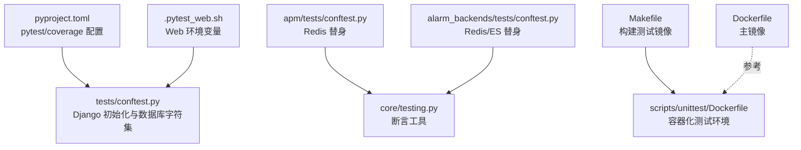
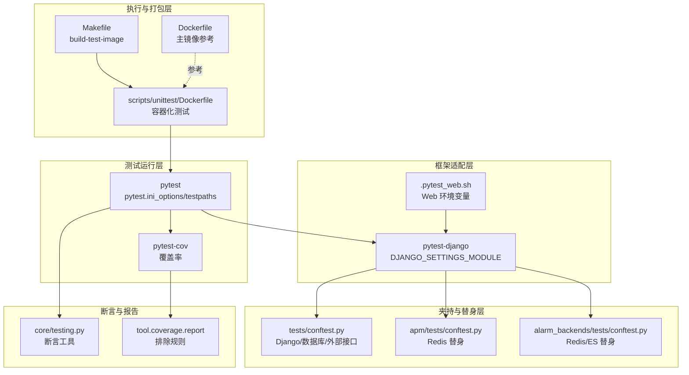
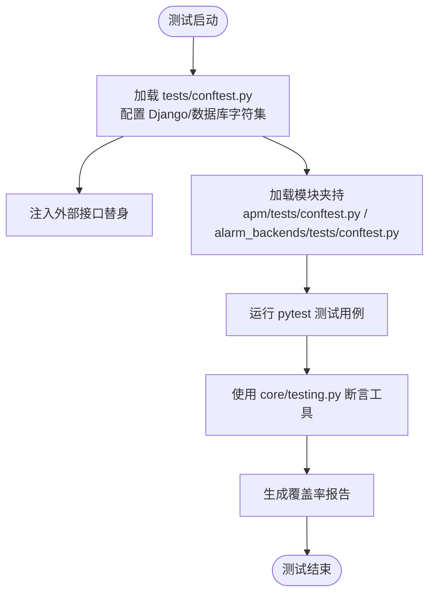
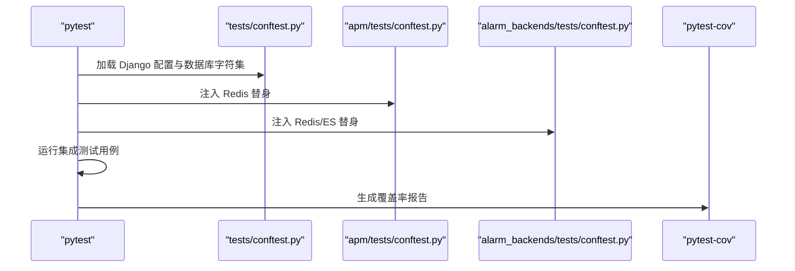
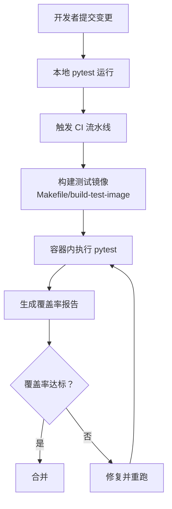
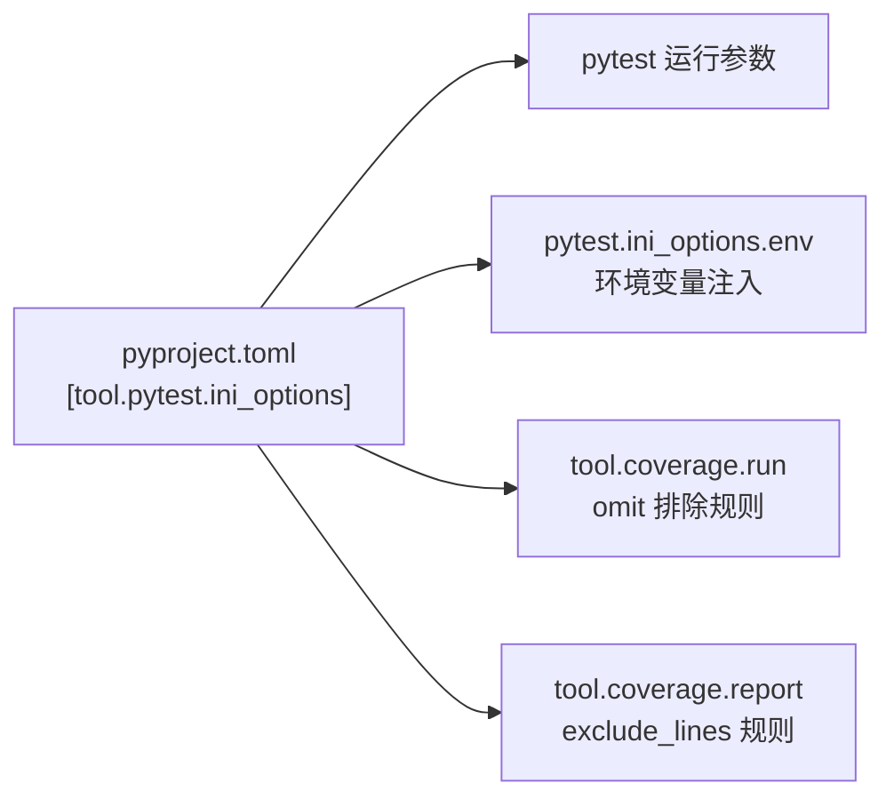

# 测试策略

<cite>
**本文引用的文件**
- [bkmonitor\.pytest_web.sh](file://bkmonitor/.pytest_web.sh)
- [tests/conftest.py](file://bkmonitor/tests/conftest.py)
- [apm/tests/conftest.py](file://bkmonitor/apm/tests/conftest.py)
- [alarm_backends/tests/conftest.py](file://bkmonitor/alarm_backends/tests/conftest.py)
- [pyproject.toml](file://bkmonitor/pyproject.toml)
- [Makefile](file://bkmonitor/Makefile)
- [Dockerfile](file://bkmonitor/Dockerfile)
- [scripts/unittest/Dockerfile](file://bkmonitor/scripts/unittest/Dockerfile)
- [core/testing.py](file://bkmonitor/core/testing.py)
</cite>

## 目录
1. [简介](#简介)
2. [项目结构](#项目结构)
3. [核心组件](#核心组件)
4. [架构总览](#架构总览)
5. [详细组件分析](#详细组件分析)
6. [依赖分析](#依赖分析)
7. [性能考虑](#性能考虑)
8. [故障排查指南](#故障排查指南)
9. [结论](#结论)
10. [附录](#附录)

## 简介
本测试策略文档面向蓝鲸监控平台（bk-monitor）的测试体系，覆盖单元测试、集成测试、性能测试与测试数据管理策略；明确测试环境搭建、测试用例设计、自动化测试流程与持续集成配置；给出测试覆盖率要求、性能基准与压力测试、回归测试的实施方法，并提供测试工具使用指南与结果分析方法。文档以仓库中现有的 pytest、Django、Docker 与 Makefile 为依据，结合各模块的 conftest 配置与测试辅助工具，形成可落地的测试实践蓝图。

## 项目结构
围绕测试的关键目录与文件如下：
- 测试框架与配置：pyproject.toml 中定义 pytest、coverage、pytest-django 等依赖与配置项
- 全局测试夹持：tests/conftest.py 用于 Django 初始化、数据库字符集设置与外部接口模拟
- 模块化夹持：apm/tests/conftest.py、alarm_backends/tests/conftest.py 提供 Redis、ES 等依赖的本地化替身
- 测试执行脚本：.pytest_web.sh 用于 Web 场景的环境变量注入
- 自动化构建与容器：Makefile 提供测试镜像构建目标；Dockerfile 与 scripts/unittest/Dockerfile 支持容器化测试环境
- 断言工具：core/testing.py 提供字典/列表断言辅助函数

**图示来源**
- [pyproject.toml:161-186](file://bkmonitor/pyproject.toml#L161-L186)
- [tests/conftest.py:19-36](file://bkmonitor/tests/conftest.py#L19-L36)
- [apm/tests/conftest.py:18-22](file://bkmonitor/apm/tests/conftest.py#L18-L22)
- [alarm_backends/tests/conftest.py:24-32](file://bkmonitor/alarm_backends/tests/conftest.py#L24-L32)
- [.pytest_web.sh:1-4](file://bkmonitor/.pytest_web.sh#L1-L4)
- [Makefile:36-37](file://bkmonitor/Makefile#L36-L37)
- [scripts/unittest/Dockerfile:85-95](file://bkmonitor/scripts/unittest/Dockerfile#L85-L95)

**章节来源**
- [pyproject.toml:161-186](file://bkmonitor/pyproject.toml#L161-L186)
- [tests/conftest.py:19-36](file://bkmonitor/tests/conftest.py#L19-L36)
- [apm/tests/conftest.py:18-22](file://bkmonitor/apm/tests/conftest.py#L18-L22)
- [alarm_backends/tests/conftest.py:24-32](file://bkmonitor/alarm_backends/tests/conftest.py#L24-L32)
- [.pytest_web.sh:1-4](file://bkmonitor/.pytest_web.sh#L1-L4)
- [Makefile:36-37](file://bkmonitor/Makefile#L36-L37)
- [scripts/unittest/Dockerfile:85-95](file://bkmonitor/scripts/unittest/Dockerfile#L85-L95)

## 核心组件
- 测试框架与覆盖率
  - 使用 pytest 作为测试运行器，pytest-django 适配 Django 应用；通过 pytest-cov 生成覆盖率报告
  - 覆盖率配置在 pyproject.toml 的 tool.coverage 节点，忽略 migrations 与 __init__.py 等
- 测试夹持（Fixtures）
  - tests/conftest.py：全局 Django 配置、数据库 TEST 字符集设置、外部接口请求替身（如 CMDB 服务实例）
  - apm/tests/conftest.py：通过 fakeredis 注入 Redis 客户端替身，避免真实 Redis 依赖
  - alarm_backends/tests/conftest.py：替换 Redis 与 Elasticsearch 连接，同时关闭推送事件开关，统一数据库集合
- 断言工具
  - core/testing.py：提供递归断言字典/列表的工具函数，便于结构化响应断言
- 执行环境与容器化
  - .pytest_web.sh：设置 Web 场景下的 DJANGO_CONF_MODULE 等环境变量
  - scripts/unittest/Dockerfile：容器内安装 MySQL、Redis、Git 等依赖，入口脚本执行测试命令
  - Makefile：提供 build-test-image 目标，一键构建测试镜像

**章节来源**
- [pyproject.toml:123-134](file://bkmonitor/pyproject.toml#L123-L134)
- [pyproject.toml:147-160](file://bkmonitor/pyproject.toml#L147-L160)
- [tests/conftest.py:19-122](file://bkmonitor/tests/conftest.py#L19-L122)
- [apm/tests/conftest.py:18-22](file://bkmonitor/apm/tests/conftest.py#L18-L22)
- [alarm_backends/tests/conftest.py:24-55](file://bkmonitor/alarm_backends/tests/conftest.py#L24-L55)
- [core/testing.py:13-34](file://bkmonitor/core/testing.py#L13-L34)
- [.pytest_web.sh:1-4](file://bkmonitor/.pytest_web.sh#L1-L4)
- [scripts/unittest/Dockerfile:69-95](file://bkmonitor/scripts/unittest/Dockerfile#L69-L95)
- [Makefile:36-37](file://bkmonitor/Makefile#L36-L37)

## 架构总览
下图展示测试栈的整体构成：测试运行器、Django 配置、模块化替身、容器化执行与覆盖率输出。

**图示来源**
- [pyproject.toml:161-186](file://bkmonitor/pyproject.toml#L161-L186)
- [pyproject.toml:147-160](file://bkmonitor/pyproject.toml#L147-L160)
- [tests/conftest.py:19-122](file://bkmonitor/tests/conftest.py#L19-L122)
- [apm/tests/conftest.py:18-22](file://bkmonitor/apm/tests/conftest.py#L18-L22)
- [alarm_backends/tests/conftest.py:24-55](file://bkmonitor/alarm_backends/tests/conftest.py#L24-L55)
- [.pytest_web.sh:1-4](file://bkmonitor/.pytest_web.sh#L1-L4)
- [Makefile:36-37](file://bkmonitor/Makefile#L36-L37)
- [scripts/unittest/Dockerfile:69-95](file://bkmonitor/scripts/unittest/Dockerfile#L69-L95)
- [Dockerfile:1-86](file://bkmonitor/Dockerfile#L1-L86)
- [core/testing.py:13-34](file://bkmonitor/core/testing.py#L13-L34)

## 详细组件分析

### 单元测试框架与夹持
- 全局夹持（tests/conftest.py）
  - 动态注入 Django 配置，设置默认数据库与 monitor_api 数据库的 TEST 字符集，确保测试稳定性
  - 通过 monkeypatch 对外部接口进行请求替身，避免真实网络调用
- 模块夹持
  - APM：使用 fakeredis 替代真实 Redis，保证测试隔离与速度
  - 告警后端：同时替换 Redis 与 Elasticsearch 连接，统一数据库集合，关闭事件推送以避免副作用
- 断言工具（core/testing.py）
  - 支持嵌套字典/列表断言，提升结构化响应校验效率

**图示来源**
- [tests/conftest.py:19-122](file://bkmonitor/tests/conftest.py#L19-L122)
- [apm/tests/conftest.py:18-22](file://bkmonitor/apm/tests/conftest.py#L18-L22)
- [alarm_backends/tests/conftest.py:24-55](file://bkmonitor/alarm_backends/tests/conftest.py#L24-L55)
- [core/testing.py:13-34](file://bkmonitor/core/testing.py#L13-L34)

**章节来源**
- [tests/conftest.py:19-122](file://bkmonitor/tests/conftest.py#L19-L122)
- [apm/tests/conftest.py:18-22](file://bkmonitor/apm/tests/conftest.py#L18-L22)
- [alarm_backends/tests/conftest.py:24-55](file://bkmonitor/alarm_backends/tests/conftest.py#L24-L55)
- [core/testing.py:13-34](file://bkmonitor/core/testing.py#L13-L34)

### 集成测试方案
- 外部依赖本地化
  - Redis：使用 fakeredis 替代真实实例，降低部署复杂度
  - Elasticsearch：使用 FakeElasticsearchBucket 替代真实连接，确保查询逻辑可验证
- 数据库一致性
  - 统一设置 TEST 字符集，避免跨环境字符集差异导致的集成失败
- 环境变量与场景
  - Web 场景通过 .pytest_web.sh 注入 DJANGO_CONF_MODULE 等变量，确保配置正确加载

**图示来源**
- [tests/conftest.py:19-36](file://bkmonitor/tests/conftest.py#L19-L36)
- [apm/tests/conftest.py:18-22](file://bkmonitor/apm/tests/conftest.py#L18-L22)
- [alarm_backends/tests/conftest.py:24-32](file://bkmonitor/alarm_backends/tests/conftest.py#L24-L32)
- [pyproject.toml:161-186](file://bkmonitor/pyproject.toml#L161-L186)

**章节来源**
- [tests/conftest.py:19-36](file://bkmonitor/tests/conftest.py#L19-L36)
- [apm/tests/conftest.py:18-22](file://bkmonitor/apm/tests/conftest.py#L18-L22)
- [alarm_backends/tests/conftest.py:24-32](file://bkmonitor/alarm_backends/tests/conftest.py#L24-L32)
- [.pytest_web.sh:1-4](file://bkmonitor/.pytest_web.sh#L1-L4)

### 性能测试方法
- 基准与火焰图
  - 项目内置 pyinstrument、pyroscope-io 等性能观测依赖，可用于生成性能剖析与火焰图，定位热点路径
- 测试数据规模
  - 建议在容器化环境中准备不同规模的测试数据集，分别评估查询、聚合与导出等关键路径的吞吐与延迟
- 压力测试
  - 结合容器化测试环境，使用并发请求或批量任务驱动压力，记录响应时间分布与错误率

**章节来源**
- [pyproject.toml:78-84](file://bkmonitor/pyproject.toml#L78-L84)

### 测试数据管理策略
- 替身与假数据
  - 使用 fakeredis、FakeElasticsearchBucket 等替身，避免真实外部系统耦合
  - tests/conftest.py 中通过 monkeypatch 注入固定返回值，确保测试可重复性
- 数据库字符集
  - 在 TEST 配置中显式设置字符集，避免因字符集差异导致的断言失败
- 配置隔离
  - 通过模块夹持与环境变量注入，确保不同模块测试互不干扰

**章节来源**
- [tests/conftest.py:24-32](file://bkmonitor/tests/conftest.py#L24-L32)
- [alarm_backends/tests/conftest.py:24-32](file://bkmonitor/alarm_backends/tests/conftest.py#L24-L32)

### 测试用例设计
- 结构化断言
  - 利用 core/testing.py 的断言工具，对字典/列表进行递归断言，减少重复样板代码
- 外部接口替身
  - 在 tests/conftest.py 中集中注入替身，避免在单测中分散 patch，提升可维护性
- 模块化夹持
  - 将 Redis/ES 替身限定在模块级，避免跨模块污染

**章节来源**
- [core/testing.py:13-34](file://bkmonitor/core/testing.py#L13-L34)
- [tests/conftest.py:38-122](file://bkmonitor/tests/conftest.py#L38-L122)
- [apm/tests/conftest.py:18-22](file://bkmonitor/apm/tests/conftest.py#L18-L22)
- [alarm_backends/tests/conftest.py:49-55](file://bkmonitor/alarm_backends/tests/conftest.py#L49-L55)

### 自动化测试流程与持续集成
- 本地开发
  - 使用 pytest 运行单模块测试；通过 .pytest_web.sh 注入 Web 场景变量
- 容器化测试
  - 使用 scripts/unittest/Dockerfile 构建测试镜像，容器内安装 MySQL、Redis、Git 等依赖，入口脚本执行测试
  - Makefile 提供一键构建测试镜像的目标
- 覆盖率与报告
  - 通过 pytest-cov 生成覆盖率报告，结合 tool.coverage.report 的排除规则，聚焦业务代码覆盖率

**图示来源**
- [Makefile:36-37](file://bkmonitor/Makefile#L36-L37)
- [scripts/unittest/Dockerfile:69-95](file://bkmonitor/scripts/unittest/Dockerfile#L69-L95)
- [pyproject.toml:161-186](file://bkmonitor/pyproject.toml#L161-L186)
- [pyproject.toml:147-160](file://bkmonitor/pyproject.toml#L147-L160)

**章节来源**
- [.pytest_web.sh:1-4](file://bkmonitor/.pytest_web.sh#L1-L4)
- [Makefile:36-37](file://bkmonitor/Makefile#L36-L37)
- [scripts/unittest/Dockerfile:69-95](file://bkmonitor/scripts/unittest/Dockerfile#L69-L95)
- [pyproject.toml:161-186](file://bkmonitor/pyproject.toml#L161-L186)
- [pyproject.toml:147-160](file://bkmonitor/pyproject.toml#L147-L160)

## 依赖分析
- 测试依赖分组
  - test 分组包含 pytest、pytest-cov、pytest-django、pytest-mock 等，满足单元与集成测试需求
- 覆盖率与警告
  - tool.coverage.run.omit 排除 migrations 与 __init__.py，tool.coverage.report.exclude_lines 忽略特定语句
  - pytest.ini_options.filterwarnings 将部分警告升级为错误，提升测试质量

**图示来源**
- [pyproject.toml:161-186](file://bkmonitor/pyproject.toml#L161-L186)
- [pyproject.toml:147-160](file://bkmonitor/pyproject.toml#L147-L160)

**章节来源**
- [pyproject.toml:123-134](file://bkmonitor/pyproject.toml#L123-L134)
- [pyproject.toml:147-160](file://bkmonitor/pyproject.toml#L147-L160)
- [pyproject.toml:161-186](file://bkmonitor/pyproject.toml#L161-L186)

## 性能考虑
- 依赖选择
  - 项目引入 pyinstrument、pyroscope-io 等性能观测工具，适合在测试阶段进行性能剖析
- 数据规模与并发
  - 建议在容器化环境中准备不同规模的数据集，评估查询与聚合的性能表现
- 报告与对比
  - 将性能指标纳入 CI 报告，建立基线与回归阈值，防止性能退化

**章节来源**
- [pyproject.toml:78-84](file://bkmonitor/pyproject.toml#L78-L84)

## 故障排查指南
- 常见问题
  - 数据库字符集不一致：检查 tests/conftest.py 中 DATABASES.TEST 的字符集配置
  - 外部接口不稳定：确认 tests/conftest.py 中的 monkeypatch 是否生效
  - Redis/ES 依赖：确认 apm/tests/conftest.py 与 alarm_backends/tests/conftest.py 的替身已启用
  - Web 场景变量缺失：确认 .pytest_web.sh 已正确注入 DJANGO_CONF_MODULE 等变量
- 调试建议
  - 使用 pytest 的 -v 与 -s 参数查看详细输出与打印
  - 在容器内复现问题，确保依赖与环境一致

**章节来源**
- [tests/conftest.py:24-32](file://bkmonitor/tests/conftest.py#L24-L32)
- [tests/conftest.py:38-122](file://bkmonitor/tests/conftest.py#L38-L122)
- [apm/tests/conftest.py:18-22](file://bkmonitor/apm/tests/conftest.py#L18-L22)
- [alarm_backends/tests/conftest.py:24-32](file://bkmonitor/alarm_backends/tests/conftest.py#L24-L32)
- [.pytest_web.sh:1-4](file://bkmonitor/.pytest_web.sh#L1-L4)

## 结论
本测试策略以 pytest 为核心，结合 pytest-django、pytest-cov 与模块化夹持，构建了稳定、可扩展且可容器化的测试体系。通过 Redis/ES 替身、统一数据库字符集与断言工具，显著提升了测试的可靠性与可维护性。建议在现有基础上完善覆盖率门槛、性能基线与回归阈值，并将测试流程纳入 CI/CD，持续保障代码质量与系统稳定性。

## 附录
- 测试覆盖率要求
  - 建议为关键模块设定最小覆盖率阈值（例如 80%），并在 CI 中作为门禁
- 性能基准与压力测试
  - 基于 pyproject.toml 中的性能观测依赖，建立性能基线与回归阈值
- 回归测试
  - 将核心功能测试纳入每日流水线，确保重大变更不会引入回归