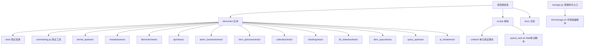
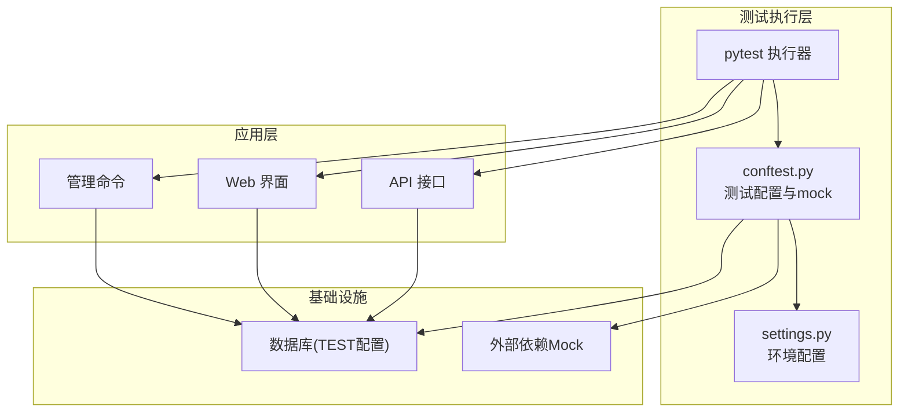
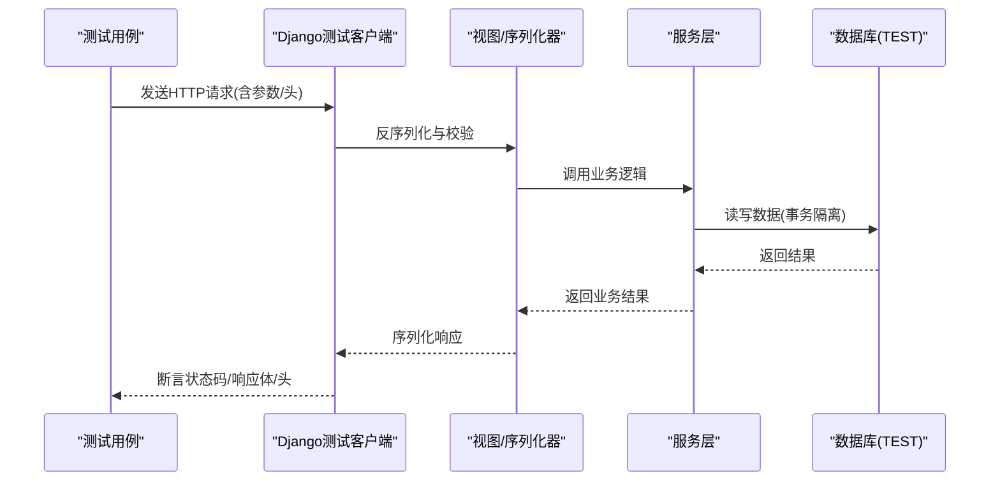
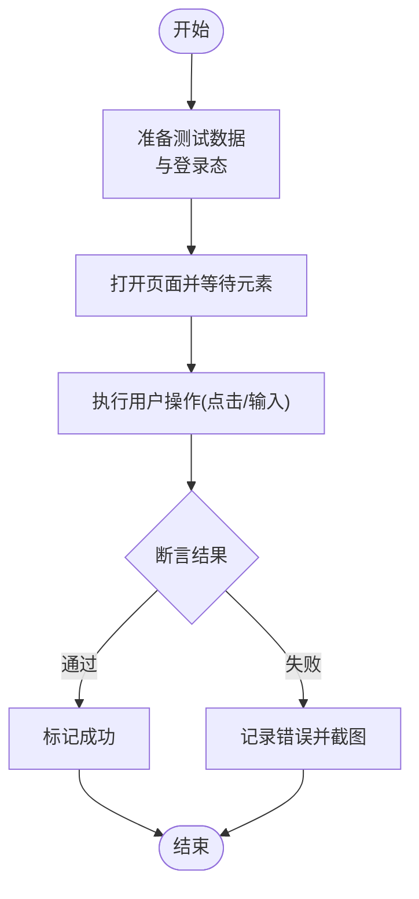
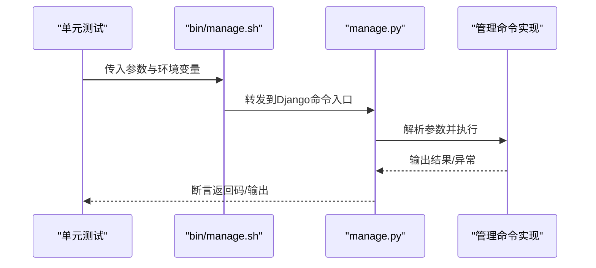
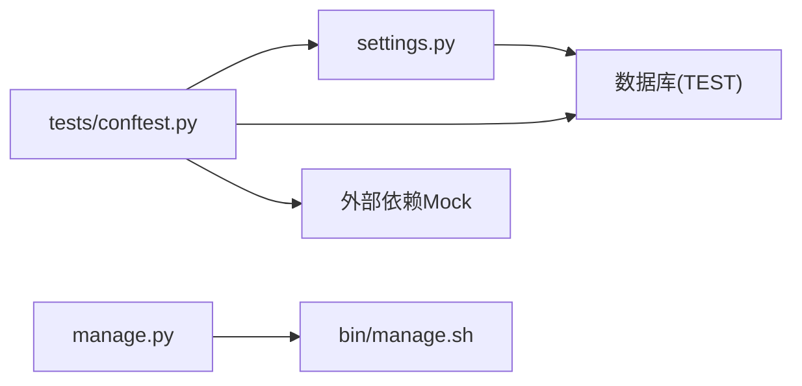

# 集成测试

<cite>
**本文引用的文件**
- [bkmonitor/settings.py](file://bkmonitor/settings.py)
- [bkmonitor/manage.py](file://bkmonitor/manage.py)
- [bkmonitor/bin/manage.sh](file://bkmonitor/bin/manage.sh)
- [bkmonitor/tests/conftest.py](file://bkmonitor/tests/conftest.py)
- [bkmonitor/tests/__init__.py](file://bkmonitor/tests/__init__.py)
- [bkmonitor/core/testing.py](file://bkmonitor/core/testing.py)
- [bkmonitor/kernel_api/tests/](file://bkmonitor/kernel_api/tests/)
- [bkmonitor/metadata/tests/](file://bkmonitor/metadata/tests/)
- [bkmonitor/bkmonitor/tests/](file://bkmonitor/bkmonitor/tests/)
- [bkmonitor/apm/tests/](file://bkmonitor/apm/tests/)
- [bkmonitor/alarm_backends/tests/](file://bkmonitor/alarm_backends/tests/)
- [bkmonitor/bkm_ipchooser/tests/](file://bkmonitor/bkm_ipchooser/tests/)
- [bkmonitor/calendars/tests/](file://bkmonitor/calendars/tests/)
- [bkmonitor/blueking/tests/](file://bkmonitor/blueking/tests/)
- [bkmonitor/bk_dataview/tests/](file://bkmonitor/bk_dataview/tests/)
- [bkmonitor/bkm_space/tests/](file://bkmonitor/bkm_space/tests/)
- [bkmonitor/query_api/tests/](file://bkmonitor/query_api/tests/)
- [bkmonitor/ai_whale/tests/](file://bkmonitor/ai_whale/tests/)
- [bkmonitor/scripts/unittest/](file://bkmonitor/scripts/unittest/)
- [bkmonitor/.pytest_web.sh](file://bkmonitor/.pytest_web.sh)
</cite>

## 目录
1. [简介](#简介)
2. [项目结构](#项目结构)
3. [核心组件](#核心组件)
4. [架构总览](#架构总览)
5. [详细组件分析](#详细组件分析)
6. [依赖分析](#依赖分析)
7. [性能考虑](#性能考虑)
8. [故障排查指南](#故障排查指南)
9. [结论](#结论)
10. [附录](#附录)

## 简介
本文件面向蓝鲸监控平台（bk-monitor）的集成测试，系统性阐述API接口测试、Web界面测试与管理命令测试的实施方法。内容覆盖HTTP请求测试、响应验证、状态码检查与错误处理测试；测试环境配置、数据库事务与测试数据清理策略；以及API测试用例设计、Web测试自动化与管理命令测试的具体实现路径。文档以仓库现有测试框架与脚本为基础，结合实际源码文件进行说明，确保读者可按步骤落地执行。

## 项目结构
bk-monitor采用Django应用组织方式，测试主要分布在各子应用的 tests 目录中，并通过顶层 conftest.py 提供统一的测试配置与数据库测试集设置。管理命令通过 manage.py 与 bin/manage.sh 统一入口执行，便于在CI/CD中调用。

图表来源
- [bkmonitor/tests/conftest.py:19-36](file://bkmonitor/tests/conftest.py#L19-L36)
- [bkmonitor/manage.py:44-48](file://bkmonitor/manage.py#L44-L48)
- [bkmonitor/bin/manage.sh:1-14](file://bkmonitor/bin/manage.sh#L1-L14)

章节来源
- [bkmonitor/tests/conftest.py:19-36](file://bkmonitor/tests/conftest.py#L19-L36)
- [bkmonitor/settings.py:41-63](file://bkmonitor/settings.py#L41-L63)
- [bkmonitor/manage.py:44-48](file://bkmonitor/manage.py#L44-L48)
- [bkmonitor/bin/manage.sh:1-14](file://bkmonitor/bin/manage.sh#L1-L14)

## 核心组件
- 测试配置与环境
  - 顶层 conftest.py 负责配置Django测试环境、设置数据库字符集与排序规则，以及注入外部依赖的mock行为，确保测试在隔离环境中运行。
  - settings.py 根据运行环境动态选择配置模块，合并基础配置并初始化多数据库映射，为测试提供稳定的数据库上下文。
- 管理命令入口
  - manage.py 设置默认Django配置模块并执行命令行参数，支持在容器或CI中直接调用。
  - bin/manage.sh 作为bash入口，加载环境变量后转发给manage.py，便于在不同环境下统一启动。
- 测试工具
  - core/testing.py 提供通用测试辅助能力，便于在各应用测试中复用。

章节来源
- [bkmonitor/tests/conftest.py:19-36](file://bkmonitor/tests/conftest.py#L19-L36)
- [bkmonitor/tests/conftest.py:38-122](file://bkmonitor/tests/conftest.py#L38-L122)
- [bkmonitor/settings.py:41-63](file://bkmonitor/settings.py#L41-L63)
- [bkmonitor/settings.py:94-110](file://bkmonitor/settings.py#L94-L110)
- [bkmonitor/manage.py:44-48](file://bkmonitor/manage.py#L44-L48)
- [bkmonitor/bin/manage.sh:1-14](file://bkmonitor/bin/manage.sh#L1-L14)
- [bkmonitor/core/testing.py](file://bkmonitor/core/testing.py)

## 架构总览
下图展示集成测试在系统中的位置与交互关系：测试通过Django测试框架驱动，利用conftest.py提供的数据库与mock配置，访问各应用的API与管理命令，最终验证业务逻辑与数据一致性。

图表来源
- [bkmonitor/tests/conftest.py:19-36](file://bkmonitor/tests/conftest.py#L19-L36)
- [bkmonitor/tests/conftest.py:38-122](file://bkmonitor/tests/conftest.py#L38-L122)
- [bkmonitor/settings.py:41-63](file://bkmonitor/settings.py#L41-L63)

## 详细组件分析

### API接口测试
- 测试目标
  - 验证HTTP请求是否正确构造、响应体结构与字段是否符合预期、状态码是否满足业务要求、异常场景下的错误码与提示是否一致。
- 实施要点
  - 使用Django测试客户端或第三方HTTP客户端发起请求，结合pytest参数化设计多种输入组合（正常、边界、异常）。
  - 在conftest.py中注入mock，屏蔽对外部系统的依赖，保证测试稳定与可重复。
  - 对于多数据库场景，确保TEST配置生效，避免污染生产数据。
- 典型流程（序列图）

图表来源
- [bkmonitor/tests/conftest.py:19-36](file://bkmonitor/tests/conftest.py#L19-L36)
- [bkmonitor/tests/conftest.py:38-122](file://bkmonitor/tests/conftest.py#L38-L122)

章节来源
- [bkmonitor/tests/conftest.py:19-36](file://bkmonitor/tests/conftest.py#L19-L36)
- [bkmonitor/tests/conftest.py:38-122](file://bkmonitor/tests/conftest.py#L38-L122)

### Web界面测试
- 测试目标
  - 自动化验证页面渲染、用户交互、表单提交、权限控制与错误提示等端到端流程。
- 实施要点
  - 使用浏览器自动化框架（如pytest-playwright/selenium），结合pytest-web脚本统一执行。
  - 在conftest.py中配置浏览器驱动、登录态与页面等待策略，确保跨浏览器一致性。
  - 将测试数据预置在TEST数据库中，避免影响真实业务数据。
- 典型流程（流程图）

图表来源
- [bkmonitor/.pytest_web.sh](file://bkmonitor/.pytest_web.sh)
- [bkmonitor/tests/conftest.py:19-36](file://bkmonitor/tests/conftest.py#L19-L36)

章节来源
- [bkmonitor/.pytest_web.sh](file://bkmonitor/.pytest_web.sh)
- [bkmonitor/tests/conftest.py:19-36](file://bkmonitor/tests/conftest.py#L19-L36)

### 管理命令测试
- 测试目标
  - 验证命令行参数解析、执行流程、输出格式与异常处理。
- 实施要点
  - 通过manage.py与bin/manage.sh统一入口，传入参数并捕获stdout/stderr进行断言。
  - 在测试中使用mock替换外部依赖，确保命令在离线或受限环境下可执行。
- 典型流程（序列图）

图表来源
- [bkmonitor/bin/manage.sh:1-14](file://bkmonitor/bin/manage.sh#L1-L14)
- [bkmonitor/manage.py:44-48](file://bkmonitor/manage.py#L44-L48)

章节来源
- [bkmonitor/bin/manage.sh:1-14](file://bkmonitor/bin/manage.sh#L1-L14)
- [bkmonitor/manage.py:44-48](file://bkmonitor/manage.py#L44-L48)

## 依赖分析
- 测试依赖关系
  - 各应用tests目录相互独立，但共享顶层conftest.py提供的数据库与mock配置。
  - settings.py根据环境变量动态加载配置，确保测试与生产配置解耦。
- 外部依赖
  - 通过conftest.py对部分外部接口进行mock，降低测试脆弱性与执行成本。
- 管理命令依赖
  - manage.py与bin/manage.sh形成“环境准备+命令执行”的分层，便于在CI中复用。

图表来源
- [bkmonitor/tests/conftest.py:19-36](file://bkmonitor/tests/conftest.py#L19-L36)
- [bkmonitor/settings.py:41-63](file://bkmonitor/settings.py#L41-L63)
- [bkmonitor/manage.py:44-48](file://bkmonitor/manage.py#L44-L48)
- [bkmonitor/bin/manage.sh:1-14](file://bkmonitor/bin/manage.sh#L1-L14)

章节来源
- [bkmonitor/tests/conftest.py:19-36](file://bkmonitor/tests/conftest.py#L19-L36)
- [bkmonitor/settings.py:41-63](file://bkmonitor/settings.py#L41-L63)
- [bkmonitor/manage.py:44-48](file://bkmonitor/manage.py#L44-L48)
- [bkmonitor/bin/manage.sh:1-14](file://bkmonitor/bin/manage.sh#L1-L14)

## 性能考虑
- 测试数据库隔离
  - 使用TEST配置的数据库连接，避免与生产库竞争资源，减少锁冲突。
- Mock策略
  - 对外部系统调用进行mock，缩短测试执行时间并提升稳定性。
- 并行执行
  - 在不依赖共享状态的前提下，合理拆分测试用例并行执行，缩短CI周期。
- 缓存与重用
  - 利用pytest缓存与虚拟环境复用，减少重复安装与编译开销。

## 故障排查指南
- 数据库相关
  - 若出现编码或排序问题，确认TEST配置中的字符集与排序规则已正确设置。
  - 若测试间数据互相影响，检查是否遗漏事务回滚或数据清理。
- 外部依赖
  - 若mock未生效，检查monkeypatch注入时机与作用域，确保在测试前完成替换。
- 管理命令
  - 若命令执行失败，核对bin/manage.sh与manage.py的参数传递与环境变量设置。
- Web测试
  - 若页面元素定位不稳定，增加显式等待或改用更稳定的selector。

章节来源
- [bkmonitor/tests/conftest.py:19-36](file://bkmonitor/tests/conftest.py#L19-L36)
- [bkmonitor/tests/conftest.py:38-122](file://bkmonitor/tests/conftest.py#L38-L122)
- [bkmonitor/bin/manage.sh:1-14](file://bkmonitor/bin/manage.sh#L1-L14)
- [bkmonitor/manage.py:44-48](file://bkmonitor/manage.py#L44-L48)

## 结论
本集成测试方案以Django测试框架为核心，配合统一的环境配置与mock策略，覆盖API、Web与管理命令三大测试维度。通过TEST数据库隔离与外部依赖屏蔽，确保测试的稳定性与可重复性。建议在CI流水线中按需并行执行，并持续完善用例覆盖面与断言粒度，以提升整体质量保障水平。

## 附录
- 测试用例设计建议
  - API：参数化边界值、空值、非法格式；错误场景覆盖4xx/5xx与业务异常。
  - Web：覆盖关键路径（新增/编辑/删除/导出）、权限校验与错误提示。
  - 管理命令：覆盖所有参数组合、默认值、异常分支与日志输出。
- 测试数据清理策略
  - 使用事务包装每个测试用例，在结束后回滚；对需要持久化的数据，提供专门的清理函数。
- 环境准备脚本
  - 使用bin/manage.sh加载环境变量并启动manage.py，确保测试环境与生产一致。