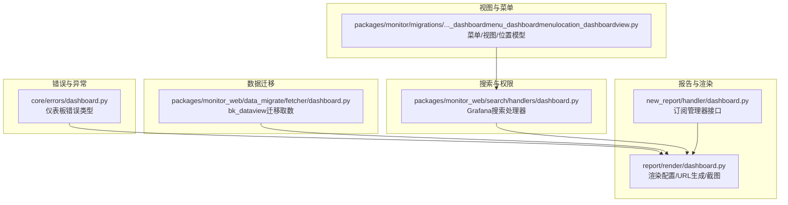
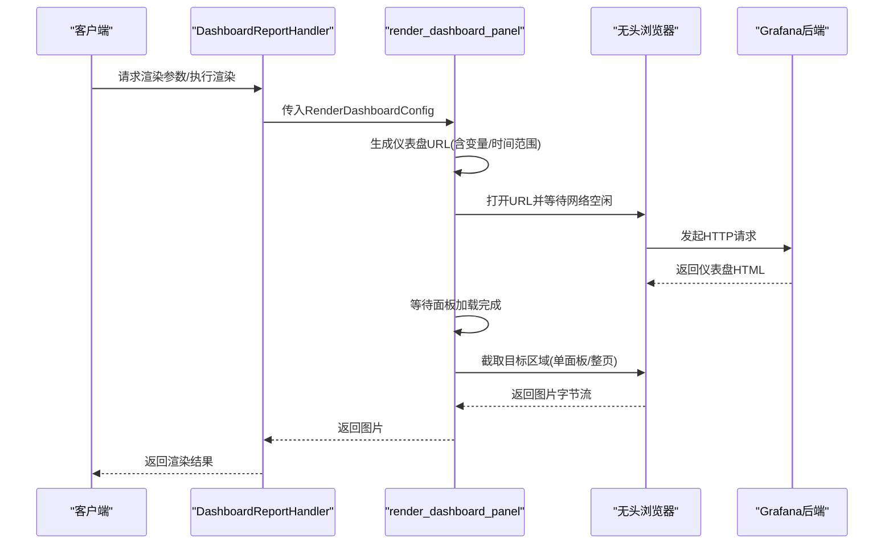
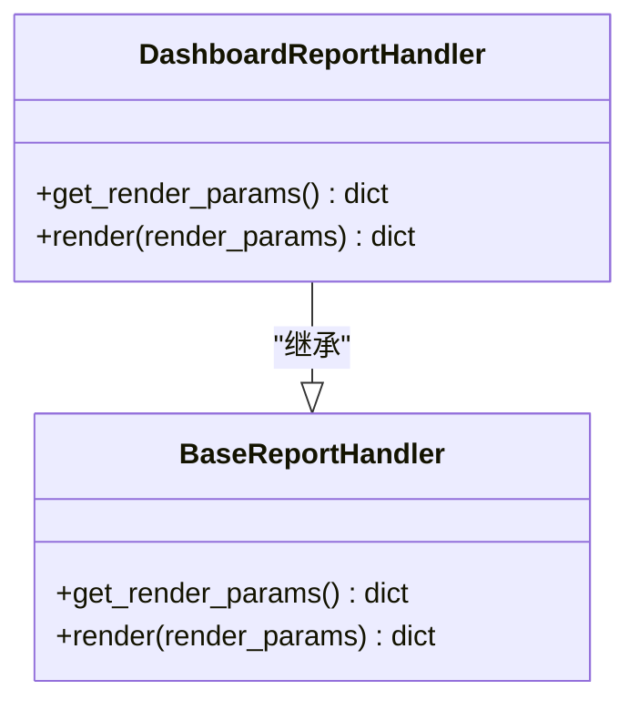
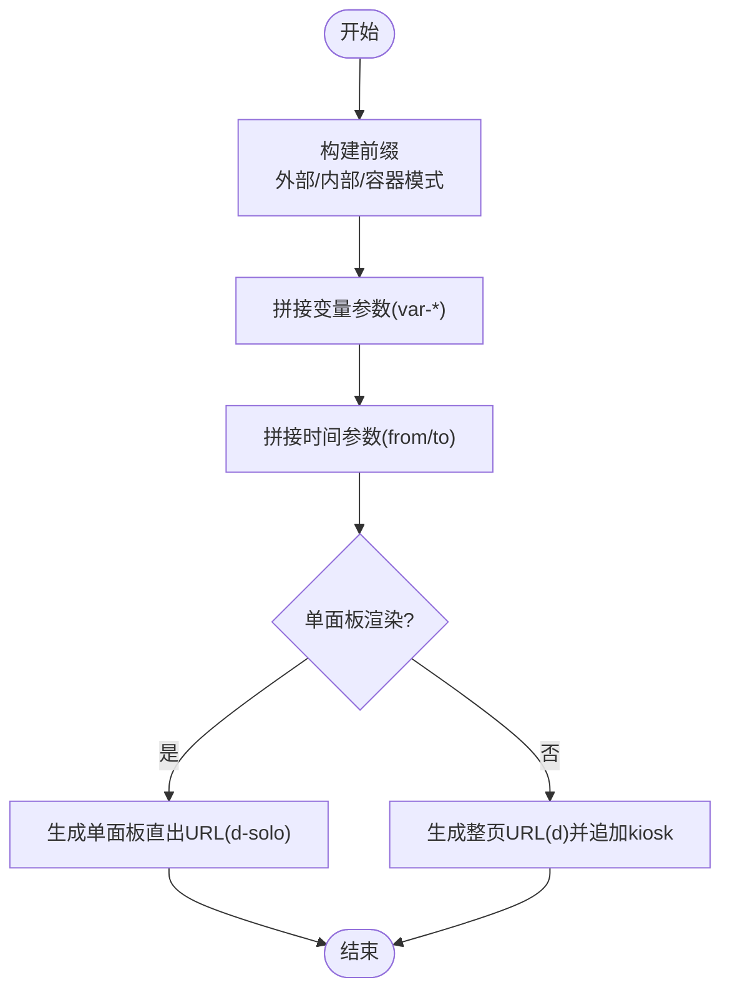
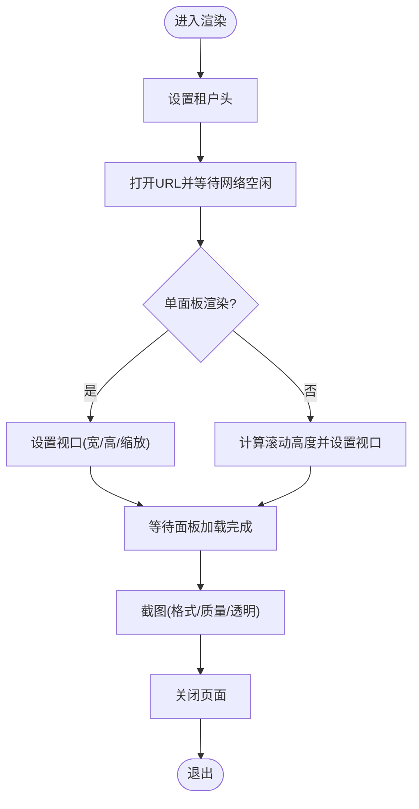
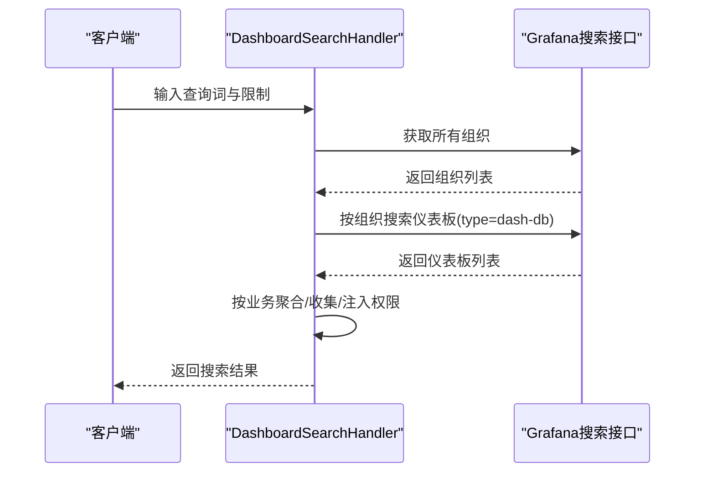
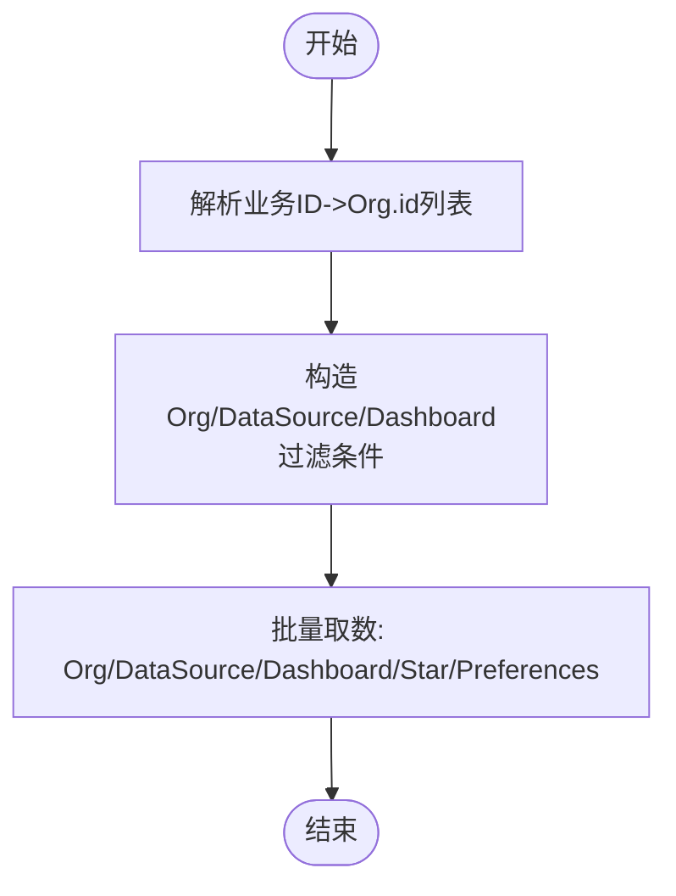
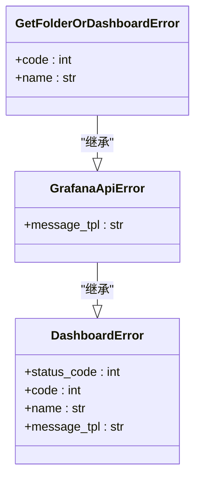
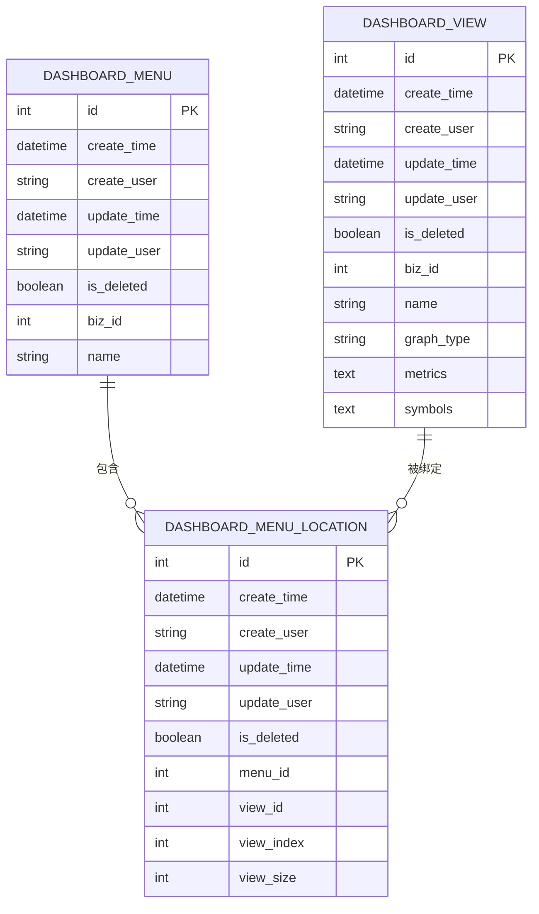
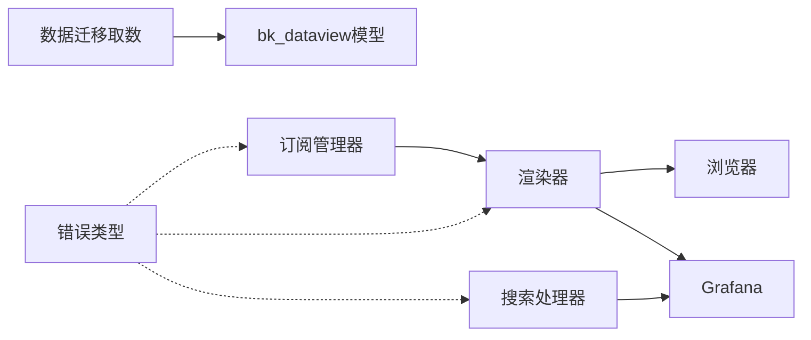

# 仪表板架构

<cite>
**本文引用的文件**
- [dashboard.py](file://bkmonitor/alarm_backends/service/new_report/handler/dashboard.py)
- [dashboard.py](file://bkmonitor/alarm_backends/service/report/render/dashboard.py)
- [dashboard.py](file://bkmonitor/core/errors/dashboard.py)
- [0023_dashboardmenu_dashboardmenulocation_dashboardview.py](file://bkmonitor/packages/monitor/migrations/0023_dashboardmenu_dashboardmenulocation_dashboardview.py)
- [dashboard.py](file://bkmonitor/packages/monitor_web/search/handlers/dashboard.py)
- [dashboard.py](file://bkmonitor/packages/monitor_web/data_migrate/fetcher/dashboard.py)
</cite>

## 目录
1. [简介](#简介)
2. [项目结构](#项目结构)
3. [核心组件](#核心组件)
4. [架构总览](#架构总览)
5. [组件详细分析](#组件详细分析)
6. [依赖关系分析](#依赖关系分析)
7. [性能考量](#性能考量)
8. [故障排查指南](#故障排查指南)
9. [结论](#结论)
10. [附录](#附录)

## 简介
本技术文档围绕监控平台中的“仪表板”子系统进行系统化梳理，重点阐述其整体设计思路、组件层次结构、数据流设计与渲染机制；同时覆盖布局管理、组件通信与状态管理、可配置性与个性化定制、响应式布局实现、生命周期与事件处理机制以及性能优化策略。文档以仓库中已存在的仪表板相关模块为依据，结合实际代码文件进行分析，并提供可视化图示帮助读者快速建立对系统的整体认知。

## 项目结构
从仓库结构看，仪表板能力主要分布在以下几类模块：
- 报告与渲染：负责将仪表板内容渲染为图片，供订阅或分享使用
- 搜索与权限：支持在 Grafana 中按业务维度检索仪表板并附加权限判断
- 数据迁移：支持将仪表盘、组织、用户偏好等数据从 bk_dataview 模型迁移到目标环境
- 错误与异常：统一定义仪表板相关错误类型
- 视图与菜单：数据库层的仪表板菜单、视图与位置信息模型

**图示来源**
- [dashboard.py:14-30](file://bkmonitor/alarm_backends/service/new_report/handler/dashboard.py#L14-L30)
- [dashboard.py:17-180](file://bkmonitor/alarm_backends/service/report/render/dashboard.py#L17-L180)
- [dashboard.py:15-56](file://bkmonitor/packages/monitor_web/search/handlers/dashboard.py#L15-L56)
- [dashboard.py:16-44](file://bkmonitor/packages/monitor_web/data_migrate/fetcher/dashboard.py#L16-L44)
- [dashboard.py:18-32](file://bkmonitor/core/errors/dashboard.py#L18-L32)
- [0023_dashboardmenu_dashboardmenulocation_dashboardview.py:23-87](file://bkmonitor/packages/monitor/migrations/0023_dashboardmenu_dashboardmenulocation_dashboardview.py#L23-L87)

**章节来源**
- [dashboard.py:14-30](file://bkmonitor/alarm_backends/service/new_report/handler/dashboard.py#L14-L30)
- [dashboard.py:17-180](file://bkmonitor/alarm_backends/service/report/render/dashboard.py#L17-L180)
- [dashboard.py:15-56](file://bkmonitor/packages/monitor_web/search/handlers/dashboard.py#L15-L56)
- [dashboard.py:16-44](file://bkmonitor/packages/monitor_web/data_migrate/fetcher/dashboard.py#L16-L44)
- [dashboard.py:18-32](file://bkmonitor/core/errors/dashboard.py#L18-L32)
- [0023_dashboardmenu_dashboardmenulocation_dashboardview.py:23-87](file://bkmonitor/packages/monitor/migrations/0023_dashboardmenu_dashboardmenulocation_dashboardview.py#L23-L87)

## 核心组件
- 订阅管理器接口：定义仪表板订阅的渲染参数与渲染流程入口，作为上层调用的抽象
- 渲染配置与URL生成：封装渲染参数、生成 Grafana 访问链接、处理单面板与整页渲染差异
- 浏览器截图与等待逻辑：基于无头浏览器打开仪表板页面，等待图表加载完成并截取目标区域
- 搜索处理器：对接 Grafana 搜索接口，按业务维度聚合结果并注入权限
- 数据迁移取数：从 bk_dataview 模型中抽取组织、数据源、仪表盘、收藏与偏好等数据
- 错误类型：统一仪表板相关错误码与消息模板
- 菜单/视图/位置模型：持久化仪表板菜单、视图与布局位置信息

**章节来源**
- [dashboard.py:14-30](file://bkmonitor/alarm_backends/service/new_report/handler/dashboard.py#L14-L30)
- [dashboard.py:17-180](file://bkmonitor/alarm_backends/service/report/render/dashboard.py#L17-L180)
- [dashboard.py:15-56](file://bkmonitor/packages/monitor_web/search/handlers/dashboard.py#L15-L56)
- [dashboard.py:16-44](file://bkmonitor/packages/monitor_web/data_migrate/fetcher/dashboard.py#L16-L44)
- [dashboard.py:18-32](file://bkmonitor/core/errors/dashboard.py#L18-L32)
- [0023_dashboardmenu_dashboardmenulocation_dashboardview.py:23-87](file://bkmonitor/packages/monitor/migrations/0023_dashboardmenu_dashboardmenulocation_dashboardview.py#L23-L87)

## 架构总览
仪表板子系统由“配置—渲染—输出”三段式组成，并与“搜索—权限—迁移—错误”支撑模块协同工作。下图展示了关键模块之间的交互关系：

**图示来源**
- [dashboard.py:19-30](file://bkmonitor/alarm_backends/service/new_report/handler/dashboard.py#L19-L30)
- [dashboard.py:44-86](file://bkmonitor/alarm_backends/service/report/render/dashboard.py#L44-L86)
- [dashboard.py:89-159](file://bkmonitor/alarm_backends/service/report/render/dashboard.py#L89-L159)
- [dashboard.py:162-180](file://bkmonitor/alarm_backends/service/report/render/dashboard.py#L162-L180)

## 组件详细分析

### 订阅管理器接口（DashboardReportHandler）
- 职责：定义仪表板订阅的渲染参数获取与渲染执行接口，便于扩展不同渲染策略
- 设计要点：抽象出 get_render_params 与 render 两个方法，便于上层按需注入参数并触发渲染

**图示来源**
- [dashboard.py:14-30](file://bkmonitor/alarm_backends/service/new_report/handler/dashboard.py#L14-L30)

**章节来源**
- [dashboard.py:14-30](file://bkmonitor/alarm_backends/service/new_report/handler/dashboard.py#L14-L30)

### 渲染配置与URL生成（RenderDashboardConfig/generate_dashboard_url）
- 渲染配置：包含租户ID、业务ID、仪表盘UID、宽高、面板ID、变量、时间范围、缩放比例、图片格式与质量、透明背景等
- URL生成：根据外部访问或内部容器模式拼接 Grafana 访问地址，支持单面板直出与整页渲染两种模式，并拼接变量与时间参数

**图示来源**
- [dashboard.py:44-86](file://bkmonitor/alarm_backends/service/report/render/dashboard.py#L44-L86)

**章节来源**
- [dashboard.py:17-42](file://bkmonitor/alarm_backends/service/report/render/dashboard.py#L17-L42)
- [dashboard.py:44-86](file://bkmonitor/alarm_backends/service/report/render/dashboard.py#L44-L86)

### 浏览器截图与等待逻辑（render_dashboard_panel/wait_for_panel_render）
- 页面加载：设置租户头，打开URL并等待网络空闲
- 尺寸适配：单面板渲染时按配置设置视口；整页渲染时动态计算滚动高度
- 加载等待：轮询检查面板加载条，超时保护
- 截图输出：根据配置选择格式、质量与透明背景

**图示来源**
- [dashboard.py:89-159](file://bkmonitor/alarm_backends/service/report/render/dashboard.py#L89-L159)
- [dashboard.py:162-180](file://bkmonitor/alarm_backends/service/report/render/dashboard.py#L162-L180)

**章节来源**
- [dashboard.py:89-159](file://bkmonitor/alarm_backends/service/report/render/dashboard.py#L89-L159)
- [dashboard.py:162-180](file://bkmonitor/alarm_backends/service/report/render/dashboard.py#L162-L180)

### 搜索处理器（DashboardSearchHandler）
- 场景：在 Grafana 中按业务维度搜索仪表板
- 流程：枚举所有组织，筛选匹配业务ID的组织，调用 Grafana 搜索接口，聚合结果并注入权限

**图示来源**
- [dashboard.py:18-55](file://bkmonitor/packages/monitor_web/search/handlers/dashboard.py#L18-L55)

**章节来源**
- [dashboard.py:15-56](file://bkmonitor/packages/monitor_web/search/handlers/dashboard.py#L15-L56)

### 数据迁移取数（bk_dataview迁移）
- 目标：将组织、数据源、仪表盘、收藏与偏好等数据从 bk_dataview 模型中抽取
- 关键点：通过业务ID映射 Grafana Org ID，限定查询范围，确保 Star 与 Dashboard 的关联过滤

**图示来源**
- [dashboard.py:5-44](file://bkmonitor/packages/monitor_web/data_migrate/fetcher/dashboard.py#L5-L44)

**章节来源**
- [dashboard.py:16-44](file://bkmonitor/packages/monitor_web/data_migrate/fetcher/dashboard.py#L16-L44)

### 错误类型（DashboardError/GrafanaApiError）
- 统一错误基类：定义状态码、错误码、名称与消息模板
- 具体错误：如 Grafana 接口错误、获取文件夹或仪表盘失败等

**图示来源**
- [dashboard.py:18-32](file://bkmonitor/core/errors/dashboard.py#L18-L32)

**章节来源**
- [dashboard.py:18-32](file://bkmonitor/core/errors/dashboard.py#L18-L32)

### 菜单/视图/位置模型（DashboardMenu/DashboardView/DashboardMenuLocation）
- DashboardMenu：仪表板菜单，包含业务ID与名称
- DashboardView：视图定义，包含类型（时间序列/Top/状态值）、指标项与标记
- DashboardMenuLocation：菜单与视图的绑定关系，包含显示顺序与视图大小

**图示来源**
- [0023_dashboardmenu_dashboardmenulocation_dashboardview.py:23-87](file://bkmonitor/packages/monitor/migrations/0023_dashboardmenu_dashboardmenulocation_dashboardview.py#L23-L87)

**章节来源**
- [0023_dashboardmenu_dashboardmenulocation_dashboardview.py:23-87](file://bkmonitor/packages/monitor/migrations/0023_dashboardmenu_dashboardmenulocation_dashboardview.py#L23-L87)

## 依赖关系分析
- 订阅管理器依赖渲染器提供的配置与截图能力
- 渲染器依赖浏览器模块与 Grafana 后端
- 搜索处理器依赖 Grafana 搜索接口与权限系统
- 数据迁移依赖 bk_dataview 模型与 Grafana 组织映射
- 错误类型为渲染与搜索等模块提供统一异常语义

**图示来源**
- [dashboard.py:14-30](file://bkmonitor/alarm_backends/service/new_report/handler/dashboard.py#L14-L30)
- [dashboard.py:17-180](file://bkmonitor/alarm_backends/service/report/render/dashboard.py#L17-L180)
- [dashboard.py:15-56](file://bkmonitor/packages/monitor_web/search/handlers/dashboard.py#L15-L56)
- [dashboard.py:16-44](file://bkmonitor/packages/monitor_web/data_migrate/fetcher/dashboard.py#L16-L44)
- [dashboard.py:18-32](file://bkmonitor/core/errors/dashboard.py#L18-L32)

**章节来源**
- [dashboard.py:14-30](file://bkmonitor/alarm_backends/service/new_report/handler/dashboard.py#L14-L30)
- [dashboard.py:17-180](file://bkmonitor/alarm_backends/service/report/render/dashboard.py#L17-L180)
- [dashboard.py:15-56](file://bkmonitor/packages/monitor_web/search/handlers/dashboard.py#L15-L56)
- [dashboard.py:16-44](file://bkmonitor/packages/monitor_web/data_migrate/fetcher/dashboard.py#L16-L44)
- [dashboard.py:18-32](file://bkmonitor/core/errors/dashboard.py#L18-L32)

## 性能考量
- 渲染参数优化
  - 缩放比例与图片质量：scale 与 image_quality 可权衡清晰度与体积，建议在满足需求前提下降低 scale 与质量以减少带宽与存储
  - 单面板直出：仅渲染必要面板可显著缩短等待与截图时间
- 等待策略
  - 网络空闲等待与面板加载条轮询相结合，避免过早截图导致图像不完整
- 资源复用
  - 浏览器实例复用与页面复用可降低启动成本（需注意上下文隔离）
- 时间范围与变量
  - 合理设置时间窗口与变量，避免一次性拉取过多数据导致渲染卡顿

[本节为通用性能建议，无需特定文件引用]

## 故障排查指南
- 常见错误类型
  - Grafana 接口错误：检查 Grafana 服务连通性与鉴权头设置
  - 获取文件夹或仪表盘失败：确认 UID、组织ID与权限
- 渲染失败定位
  - 检查 URL 生成是否正确（变量、时间范围、模式）
  - 确认浏览器等待逻辑是否超时，适当增大超时阈值
  - 截图目标是否存在（单面板标题开关、整页内容选择器）
- 权限与搜索
  - 搜索处理器会注入权限，若无结果或不可见，检查业务ID映射与权限动作

**章节来源**
- [dashboard.py:18-32](file://bkmonitor/core/errors/dashboard.py#L18-L32)
- [dashboard.py:89-159](file://bkmonitor/alarm_backends/service/report/render/dashboard.py#L89-L159)
- [dashboard.py:15-56](file://bkmonitor/packages/monitor_web/search/handlers/dashboard.py#L15-L56)

## 结论
本仪表板架构以“配置—渲染—输出”为主线，结合搜索、权限、迁移与错误处理形成闭环。通过清晰的模块边界与统一的错误语义，系统具备良好的可扩展性与可维护性。在实际部署中，应重点关注渲染参数的合理配置、等待策略的稳定性与资源复用，以获得更优的性能与用户体验。

## 附录
- 如何创建与配置自定义仪表板组件（步骤指引）
  - 步骤1：准备渲染配置
    - 在渲染配置中设置业务ID、仪表盘UID、宽高、面板ID（可选）、变量与时间范围
    - 参考路径：[渲染配置定义:17-42](file://bkmonitor/alarm_backends/service/report/render/dashboard.py#L17-L42)
  - 步骤2：生成访问URL
    - 使用 URL 生成函数拼接变量与时间参数，选择单面板直出或整页渲染模式
    - 参考路径：[URL生成逻辑:44-86](file://bkmonitor/alarm_backends/service/report/render/dashboard.py#L44-L86)
  - 步骤3：执行渲染与截图
    - 打开页面、等待加载完成、设置视口、截图并关闭页面
    - 参考路径：[渲染与截图流程:89-159](file://bkmonitor/alarm_backends/service/report/render/dashboard.py#L89-L159)
  - 步骤4：处理等待与异常
    - 使用面板加载条轮询等待，捕获超时与截图目标缺失等异常
    - 参考路径：[等待与异常处理:162-180](file://bkmonitor/alarm_backends/service/report/render/dashboard.py#L162-L180)
  - 步骤5：接入搜索与权限
    - 通过搜索处理器在 Grafana 中按业务维度检索仪表板，并注入权限
    - 参考路径：[搜索处理器:15-56](file://bkmonitor/packages/monitor_web/search/handlers/dashboard.py#L15-L56)
  - 步骤6：数据迁移与模型
    - 使用迁移取数脚本抽取组织、数据源、仪表盘、收藏与偏好
    - 参考路径：[迁移取数:16-44](file://bkmonitor/packages/monitor_web/data_migrate/fetcher/dashboard.py#L16-L44)
  - 步骤7：错误处理
    - 使用统一错误类型进行异常分类与上报
    - 参考路径：[错误类型:18-32](file://bkmonitor/core/errors/dashboard.py#L18-L32)