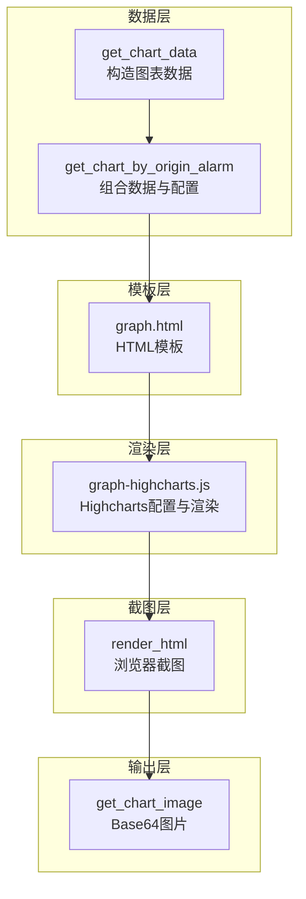
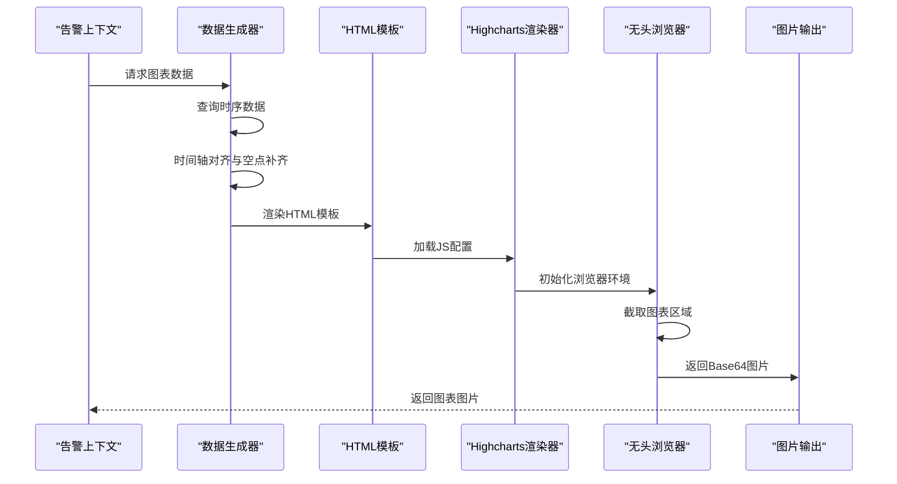
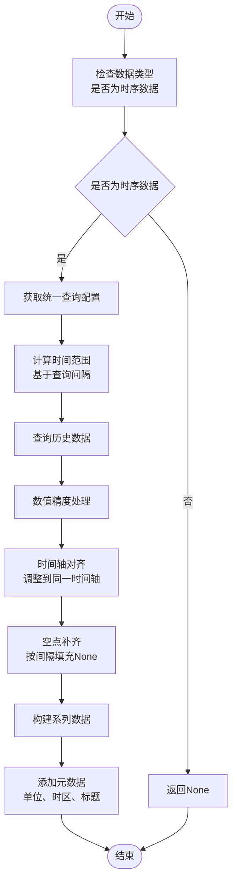
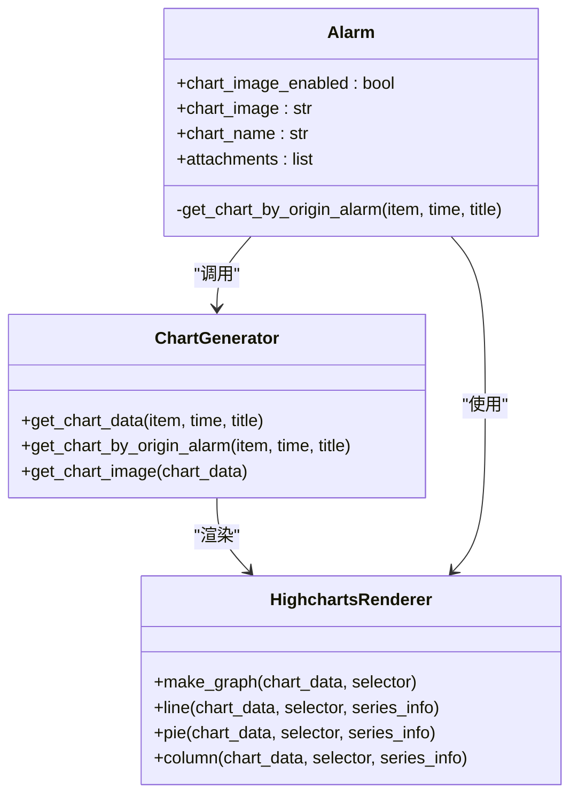
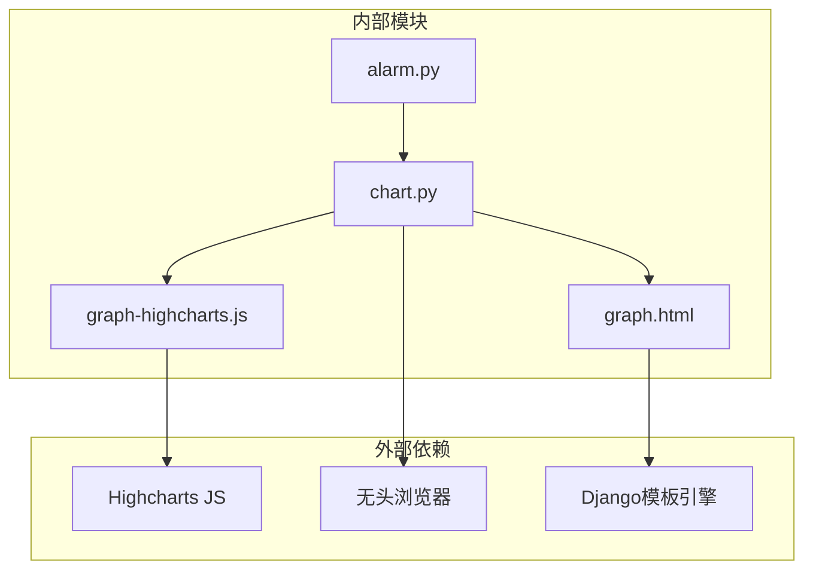

# 图表组件设计

<cite>
**本文档引用的文件**
- [chart.py](file://bkmonitor/alarm_backends/core/context/chart.py)
- [alarm.py](file://bkmonitor/alarm_backends/core/context/alarm.py)
- [graph-highcharts.js](file://bkmonitor/alarm_backends/templates/image_exporter/static/js/graph-highcharts.js)
- [graph.html](file://bkmonitor/alarm_backends/templates/image_exporter/graph.html)
</cite>

## 目录
1. [简介](#简介)
2. [项目结构](#项目结构)
3. [核心组件](#核心组件)
4. [架构概览](#架构概览)
5. [详细组件分析](#详细组件分析)
6. [依赖分析](#依赖分析)
7. [性能考虑](#性能考虑)
8. [故障排除指南](#故障排除指南)
9. [结论](#结论)

## 简介

本设计文档针对监控系统的图表组件系统进行全面阐述，重点覆盖以下方面：

- 图表组件的分类体系与渲染机制
- 折线图、柱状图、饼图等常见图表类型的实现原理
- 数据绑定机制、动态更新策略与性能优化技术
- 配置选项、样式定制与主题适配功能
- 扩展开发指南与最佳实践建议

该系统采用"数据生成 + HTML模板 + Highcharts渲染 + 浏览器截图"的完整链路，支持在告警场景中生成高质量的图表图片，用于邮件、企业微信机器人等通知渠道。

## 项目结构

图表组件系统主要由以下层次构成：

- 数据层：负责从统一查询接口获取时序数据，构造图表所需的数据结构
- 模板层：提供静态HTML模板，承载图表容器与必要的上下文数据
- 渲染层：通过Highcharts在浏览器环境中渲染图表
- 截图层：使用无头浏览器对指定DOM区域进行截图并转码为图片

**图表来源**
- [chart.py:93-236](file://bkmonitor/alarm_backends/core/context/chart.py#L93-L236)
- [graph.html](file://bkmonitor/alarm_backends/templates/image_exporter/graph.html)
- [graph-highcharts.js:55-95](file://bkmonitor/alarm_backends/templates/image_exporter/static/js/graph-highcharts.js#L55-L95)

**章节来源**
- [chart.py:93-236](file://bkmonitor/alarm_backends/core/context/chart.py#L93-L236)
- [graph-highcharts.js:1-1146](file://bkmonitor/alarm_backends/templates/image_exporter/static/js/graph-highcharts.js#L1-L1146)

## 核心组件

### 图表数据生成器

负责从监控数据源获取时序数据，构造适合Highcharts渲染的数据结构。关键特性包括：

- 时间轴对齐：将不同日期（今日、昨日、上周）的数据对齐到同一时间轴
- 空点补齐：根据查询间隔自动补齐缺失的时间点，避免图表断点
- 精度控制：根据系统配置对数值进行精度保留
- 单位处理：加载并传递单位信息给前端渲染

### 图表渲染器

基于Highcharts的JavaScript库，提供多种图表类型的默认配置与交互行为：

- 主题系统：内置默认主题，支持颜色、字体、网格线等样式定制
- 多图表类型：折线图、柱状图、饼图、漏斗图、雷达图、仪表盘等
- 交互功能：缩放、提示框、点击事件、百分比显示等
- 自适应布局：根据系列数量自动调整颜色方案与布局参数

### 图片生成器

通过无头浏览器对图表区域进行截图，生成可嵌入邮件或消息的图片：

- DOM选择：定位包含图表的容器元素
- 截图质量：设置图片格式与质量参数
- 异步处理：使用事件循环确保异步渲染完成
- 错误处理：捕获并记录渲染过程中的异常

**章节来源**
- [chart.py:69-91](file://bkmonitor/alarm_backends/core/context/chart.py#L69-L91)
- [chart.py:93-236](file://bkmonitor/alarm_backends/core/context/chart.py#L93-L236)
- [graph-highcharts.js:55-95](file://bkmonitor/alarm_backends/templates/image_exporter/static/js/graph-highcharts.js#L55-L95)

## 架构概览

整个图表组件系统遵循"数据-模板-渲染-截图"的流水线架构，各组件职责清晰、耦合度低，便于扩展与维护。

**图表来源**
- [alarm.py:282-357](file://bkmonitor/alarm_backends/core/context/alarm.py#L282-L357)
- [chart.py:69-91](file://bkmonitor/alarm_backends/core/context/chart.py#L69-L91)
- [graph.html](file://bkmonitor/alarm_backends/templates/image_exporter/graph.html)
- [graph-highcharts.js:37-66](file://bkmonitor/alarm_backends/templates/image_exporter/static/js/graph-highcharts.js#L37-L66)

## 详细组件分析

### 数据生成流程

数据生成器采用"多时间维度对比"的策略，同时展示今日、昨日、上周的时序数据，便于用户快速识别趋势变化。

**图表来源**
- [chart.py:93-236](file://bkmonitor/alarm_backends/core/context/chart.py#L93-L236)

**章节来源**
- [chart.py:106-236](file://bkmonitor/alarm_backends/core/context/chart.py#L106-L236)

### 渲染配置体系

Highcharts渲染器提供了完整的配置体系，支持多种图表类型与丰富的交互功能：

#### 主题配置
- 颜色方案：内置颜色数组，支持根据系列数量自动选择
- 字体设置：使用思源宋体等中文字体
- 网格线：水平网格线为主，垂直网格线隐藏
- 提示框：半透明背景，白色文字，支持共享提示

#### 图表类型配置
- 折线图(spline/line)：支持标记点、缩放、交叉线
- 柱状图(column)：支持堆叠、百分比显示
- 饼图(pie)：支持点击事件、百分比标签
- 雷达图(polar)：支持多维评分展示
- 仪表盘(gauge)：支持颜色区间映射

#### 交互功能
- 缩放：X轴缩放，支持时间范围选择
- 提示框：共享提示，显示多个系列的值
- 点击事件：支持子页面跳转
- 实时数据：支持动态刷新

**章节来源**
- [graph-highcharts.js:1-53](file://bkmonitor/alarm_backends/templates/image_exporter/static/js/graph-highcharts.js#L1-L53)
- [graph-highcharts.js:102-279](file://bkmonitor/alarm_backends/templates/image_exporter/static/js/graph-highcharts.js#L102-L279)
- [graph-highcharts.js:446-553](file://bkmonitor/alarm_backends/templates/image_exporter/static/js/graph-highcharts.js#L446-L553)

### 告警集成机制

告警系统通过上下文对象调用图表生成器，实现告警通知中的图表嵌入：

**图表来源**
- [alarm.py:282-357](file://bkmonitor/alarm_backends/core/context/alarm.py#L282-L357)
- [chart.py:69-236](file://bkmonitor/alarm_backends/core/context/chart.py#L69-L236)
- [graph-highcharts.js:55-95](file://bkmonitor/alarm_backends/templates/image_exporter/static/js/graph-highcharts.js#L55-L95)

**章节来源**
- [alarm.py:282-391](file://bkmonitor/alarm_backends/core/context/alarm.py#L282-L391)

## 依赖分析

图表组件系统的主要依赖关系如下：

**图表来源**
- [alarm.py:282-357](file://bkmonitor/alarm_backends/core/context/alarm.py#L282-L357)
- [chart.py:69-91](file://bkmonitor/alarm_backends/core/context/chart.py#L69-L91)
- [graph-highcharts.js:55-95](file://bkmonitor/alarm_backends/templates/image_exporter/static/js/graph-highcharts.js#L55-L95)

**章节来源**
- [alarm.py:282-357](file://bkmonitor/alarm_backends/core/context/alarm.py#L282-L357)
- [chart.py:69-91](file://bkmonitor/alarm_backends/core/context/chart.py#L69-L91)

## 性能考虑

### 数据处理优化

- 时间轴对齐算法：使用双指针法在已排序数据上进行高效匹配，避免重复扫描
- 空点补齐策略：基于时间间隔的精确匹配，减少不必要的数据点
- 数值精度控制：批量处理数值，避免重复的类型判断

### 渲染性能优化

- 主题复用：通过Highcharts.setOptions统一设置全局主题
- 颜色智能选择：根据系列数量自动选择合适的颜色方案
- 提示框优化：共享提示框减少DOM节点数量

### 内存管理

- 异步处理：使用事件循环避免阻塞主线程
- 资源清理：及时关闭浏览器页面，释放内存资源
- 错误处理：捕获异常防止内存泄漏

## 故障排除指南

### 常见问题及解决方案

#### 图表无法生成
- 检查数据类型是否为时序数据
- 确认查询配置中的聚合方法不是实时模式
- 验证告警策略是否启用图表功能

#### 图片为空
- 检查HTML模板是否正确渲染
- 确认浏览器页面是否成功加载
- 验证DOM选择器是否指向正确的容器

#### 渲染异常
- 检查Highcharts配置是否正确
- 确认数据格式符合预期
- 验证主题配置的兼容性

**章节来源**
- [chart.py:37-66](file://bkmonitor/alarm_backends/core/context/chart.py#L37-L66)
- [chart.py:88-91](file://bkmonitor/alarm_backends/core/context/chart.py#L88-L91)

## 结论

该图表组件系统通过清晰的分层架构和完善的配置体系，实现了从数据生成到图片输出的完整流程。系统具有以下优势：

- **模块化设计**：各组件职责明确，便于维护和扩展
- **配置灵活**：支持丰富的图表类型和样式定制
- **性能优化**：采用多种优化策略确保渲染效率
- **错误处理**：完善的异常捕获和日志记录机制

对于未来的扩展，建议重点关注：

- 支持更多图表类型和交互功能
- 优化大数据量场景下的渲染性能
- 增强主题系统的可定制性
- 提供更丰富的配置选项和API接口