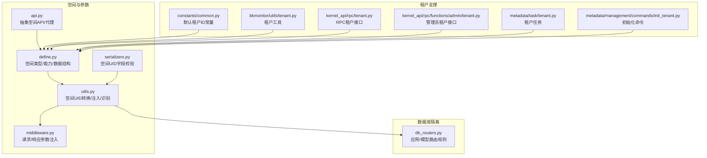
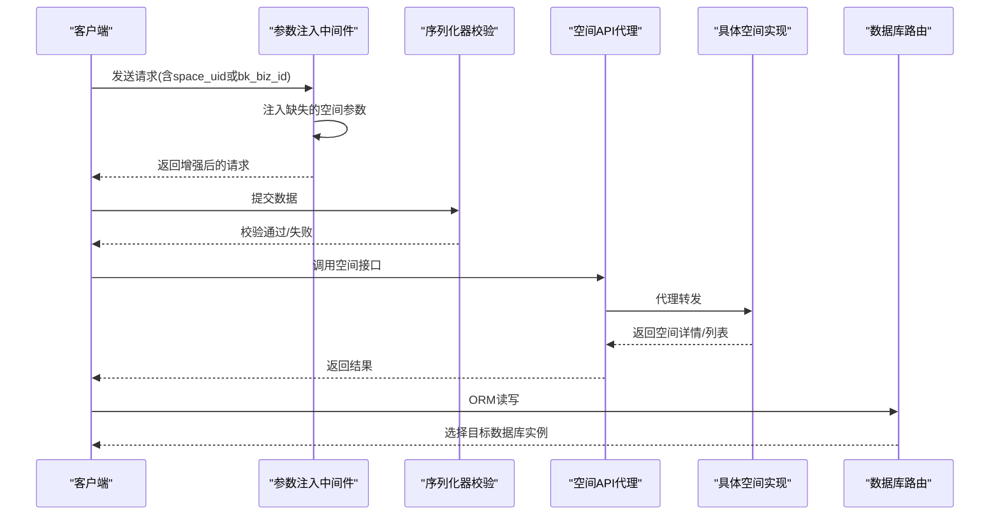
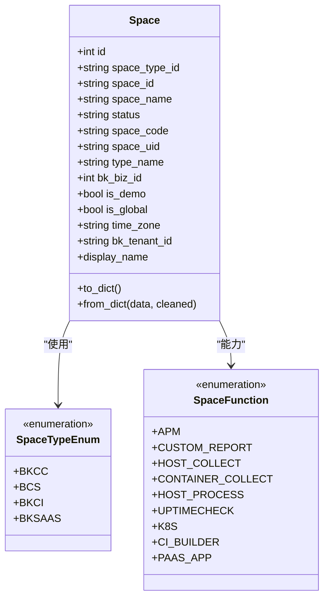
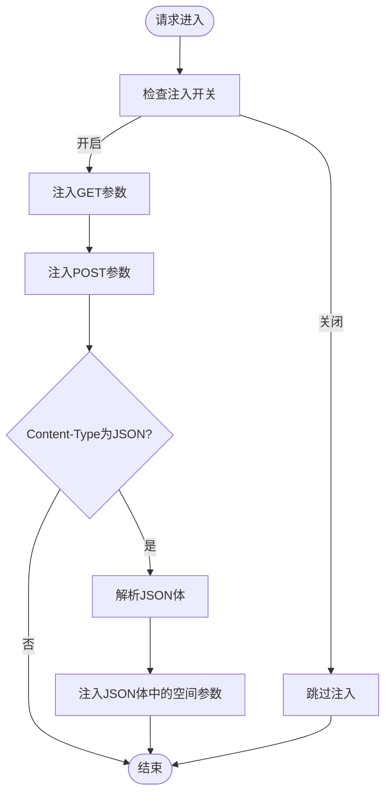
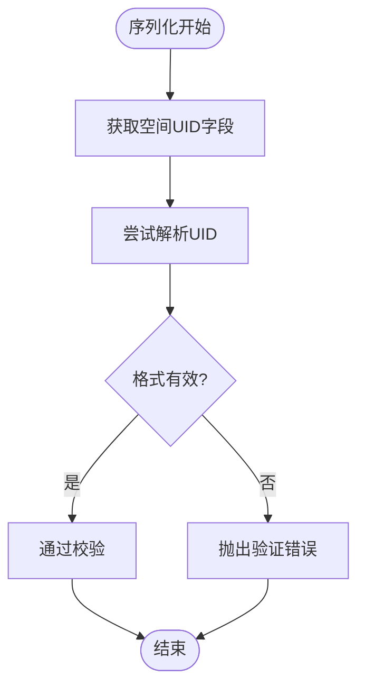
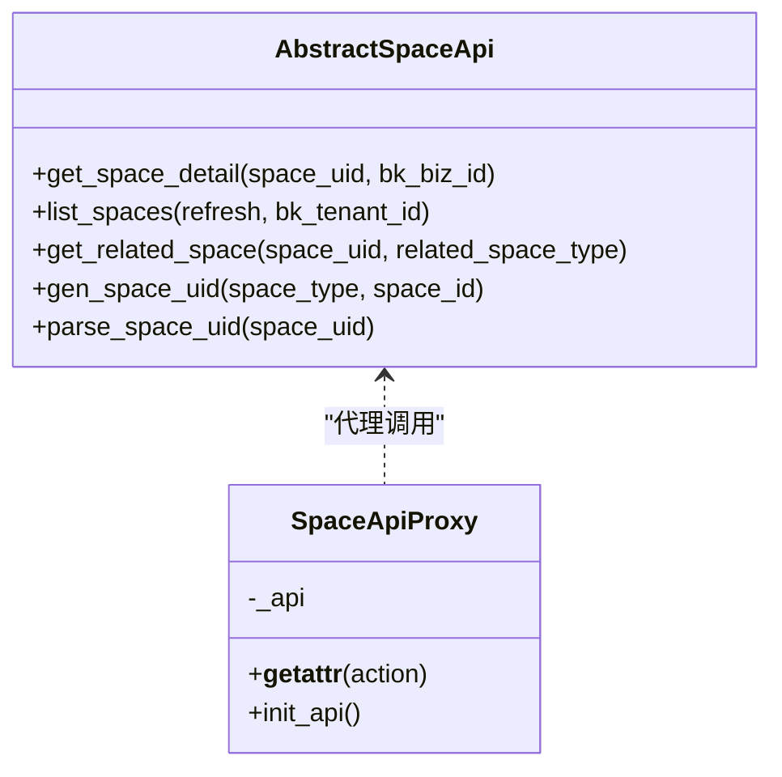
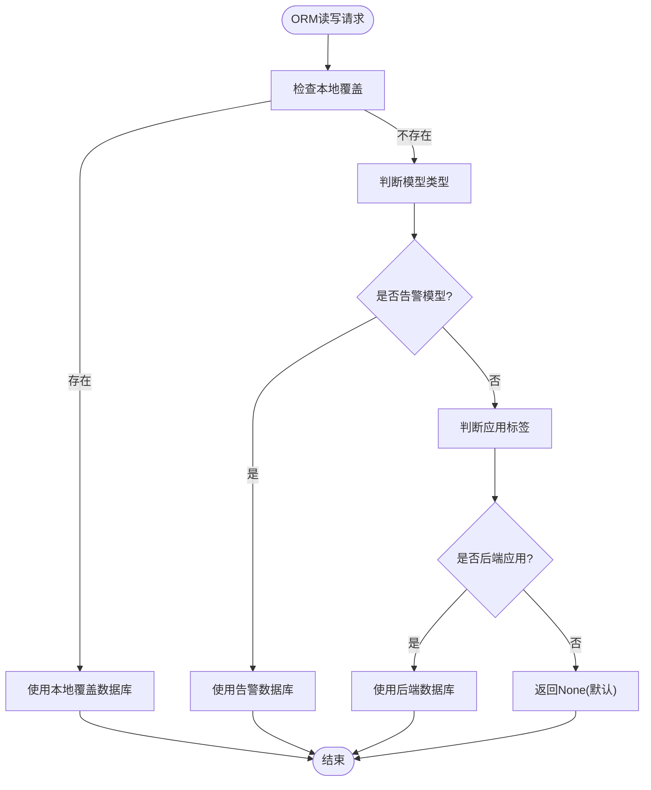
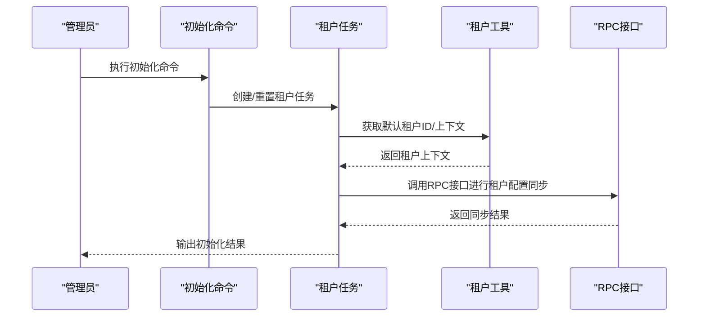
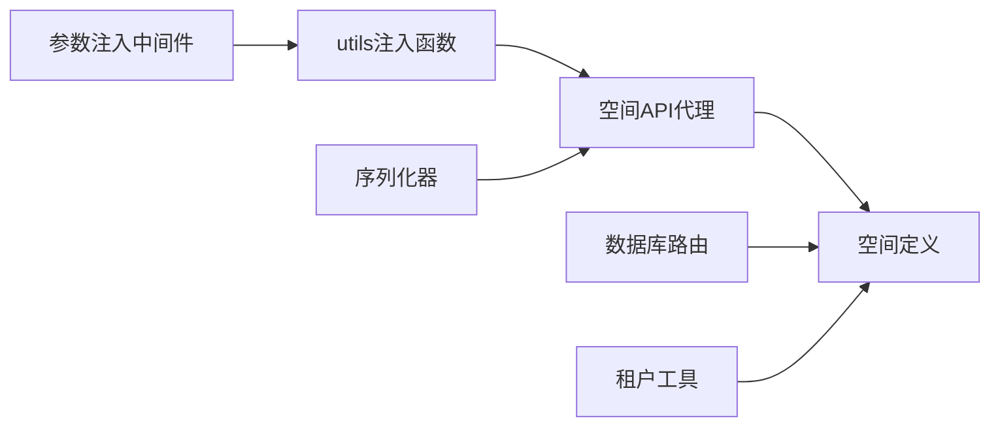

# 多租户管理

<cite>
**本文引用的文件**
- [define.py](file://bkmonitor/bkm_space/define.py)
- [utils.py](file://bkmonitor/bkm_space/utils.py)
- [middleware.py](file://bkmonitor/bkm_space/middleware.py)
- [api.py](file://bkmonitor/bkm_space/api.py)
- [serializers.py](file://bkmonitor/bkm_space/serializers.py)
- [errors.py](file://bkmonitor/bkm_space/errors.py)
- [db_routers.py](file://bkmonitor/bkmonitor/db_routers.py)
- [tenant.py](file://bkmonitor/bkmonitor/utils/tenant.py)
- [tenant.py](file://bkmonitor/kernel_api/rpc/functions/admin/tenant.py)
- [tenant.py](file://bkmonitor/kernel_api/rpc/tenant.py)
- [tenant.py](file://bkmonitor/metadata/task/tenant.py)
- [init_tenant.py](file://bkmonitor/metadata/management/commands/init_tenant.py)
- [common.py](file://bkmonitor/constants/common.py)
</cite>

## 目录
1. [简介](#简介)
2. [项目结构](#项目结构)
3. [核心组件](#核心组件)
4. [架构总览](#架构总览)
5. [详细组件分析](#详细组件分析)
6. [依赖分析](#依赖分析)
7. [性能考虑](#性能考虑)
8. [故障排查指南](#故障排查指南)
9. [结论](#结论)
10. [附录](#附录)

## 简介
本设计文档围绕多租户管理系统，系统性阐述多租户架构理念、数据隔离策略、资源管理机制与空间（Space）概念。文档覆盖租户生命周期管理、配置同步与状态监控、权限控制、数据访问与性能优化策略，并提供多租户部署最佳实践与故障排查指南。通过对仓库中多租户相关模块的深入分析，帮助读者理解如何在蓝鲸监控平台中实现安全、可扩展且高性能的多租户能力。

## 项目结构
多租户能力主要由以下模块协同实现：
- 空间模型与解析：定义空间类型、能力与数据结构，提供空间 UID 生成与解析。
- 参数注入中间件：自动注入空间参数，确保请求/响应携带必要的空间上下文。
- 序列化校验：对空间 UID 进行合法性校验。
- 数据库路由：按应用与模型类型进行数据库路由，实现后端数据的逻辑隔离。
- 租户工具与任务：提供租户 ID 默认值、初始化命令与任务调度等支撑能力。

**图示来源**
- [define.py:1-84](file://bkmonitor/bkm_space/define.py#L1-L84)
- [utils.py:1-111](file://bkmonitor/bkm_space/utils.py#L1-L111)
- [middleware.py:1-46](file://bkmonitor/bkm_space/middleware.py#L1-L46)
- [serializers.py:1-18](file://bkmonitor/bkm_space/serializers.py#L1-L18)
- [api.py:1-89](file://bkmonitor/bkm_space/api.py#L1-L89)
- [db_routers.py:1-168](file://bkmonitor/bkmonitor/db_routers.py#L1-L168)
- [common.py](file://bkmonitor/constants/common.py)

**章节来源**
- [define.py:1-84](file://bkmonitor/bkm_space/define.py#L1-L84)
- [utils.py:1-111](file://bkmonitor/bkm_space/utils.py#L1-L111)
- [middleware.py:1-46](file://bkmonitor/bkm_space/middleware.py#L1-L46)
- [serializers.py:1-18](file://bkmonitor/bkm_space/serializers.py#L1-L18)
- [api.py:1-89](file://bkmonitor/bkm_space/api.py#L1-L89)
- [db_routers.py:1-168](file://bkmonitor/bkmonitor/db_routers.py#L1-L168)
- [common.py](file://bkmonitor/constants/common.py)

## 核心组件
- 空间类型与能力：定义空间类型枚举与能力枚举，用于区分不同类型的业务空间与功能开关。
- 空间数据结构：统一的空间对象，包含空间标识、名称、状态、时区、是否演示、是否全局以及租户 ID 等字段。
- 空间 UID 生成与解析：提供标准格式的空间 UID 生成与解析方法，支持从空间类型与空间 ID 组合生成或拆分。
- 参数注入中间件：在请求进入时自动注入空间参数（如 space_uid 与 bk_biz_id），简化上层调用。
- 序列化校验：对空间 UID 字段进行合法性校验，避免非法输入导致后续流程异常。
- 抽象空间 API 与代理：定义空间 API 接口规范与代理类，便于替换具体实现。
- 数据库路由：根据应用与模型类型选择数据库实例，实现后端数据的逻辑隔离。
- 租户常量与工具：提供默认租户 ID 常量与租户相关工具函数、任务与初始化命令。

**章节来源**
- [define.py:9-84](file://bkmonitor/bkm_space/define.py#L9-L84)
- [utils.py:8-111](file://bkmonitor/bkm_space/utils.py#L8-L111)
- [middleware.py:11-46](file://bkmonitor/bkm_space/middleware.py#L11-L46)
- [serializers.py:10-18](file://bkmonitor/bkm_space/serializers.py#L10-L18)
- [api.py:11-89](file://bkmonitor/bkm_space/api.py#L11-L89)
- [db_routers.py:45-98](file://bkmonitor/bkmonitor/db_routers.py#L45-L98)
- [common.py](file://bkmonitor/constants/common.py)

## 架构总览
下图展示了多租户系统的关键交互：客户端请求经由参数注入中间件补全空间上下文，随后由抽象空间 API 代理调用具体实现，最终结合数据库路由与租户工具完成数据隔离与访问控制。

**图示来源**
- [middleware.py:21-34](file://bkmonitor/bkm_space/middleware.py#L21-L34)
- [serializers.py:10-18](file://bkmonitor/bkm_space/serializers.py#L10-L18)
- [api.py:73-89](file://bkmonitor/bkm_space/api.py#L73-L89)
- [db_routers.py:45-98](file://bkmonitor/bkmonitor/db_routers.py#L45-L98)

## 详细组件分析

### 空间模型与解析
- 空间类型与能力：涵盖 CMDB 业务、BCS、蓝盾、蓝鲸应用等类型，以及 APM、自定义上报、主机/容器采集、K8s、CI 构建机、PAAS 应用等功能能力。
- 空间数据结构：包含空间标识、名称、状态、编码、UID、类型名、业务 ID、演示标记、全局标记、时区与租户 ID 等字段；提供从字典构造与显示名属性。
- UID 生成与解析：统一的 UID 格式为“类型__ID”，并提供生成与解析方法，便于跨模块一致处理。

**图示来源**
- [define.py:9-84](file://bkmonitor/bkm_space/define.py#L9-L84)

**章节来源**
- [define.py:9-84](file://bkmonitor/bkm_space/define.py#L9-L84)

### 参数注入中间件
- 请求阶段：对 GET/POST 参数及 JSON 请求体进行空间参数注入，确保 space_uid 与 bk_biz_id 成对出现。
- 响应阶段：可选地对响应内容进行空间参数注入（需开启相应开关）。
- 配置开关：通过设置项控制是否启用请求/响应注入。

**图示来源**
- [middleware.py:11-46](file://bkmonitor/bkm_space/middleware.py#L11-L46)

**章节来源**
- [middleware.py:11-46](file://bkmonitor/bkm_space/middleware.py#L11-L46)

### 序列化校验
- 空间 UID 字段校验：在序列化阶段对空间 UID 进行解析校验，若格式不合法则抛出验证错误。

**图示来源**
- [serializers.py:10-18](file://bkmonitor/bkm_space/serializers.py#L10-L18)

**章节来源**
- [serializers.py:10-18](file://bkmonitor/bkm_space/serializers.py#L10-L18)

### 抽象空间 API 与代理
- 抽象接口：定义空间详情查询、空间列表查询、关联空间查询、UID 生成与解析等接口。
- 关联空间查询：根据资源定义中的类型查找关联空间，若类型一致则返回自身。
- 代理类：通过配置项动态加载具体实现类，便于替换与扩展。

**图示来源**
- [api.py:11-89](file://bkmonitor/bkm_space/api.py#L11-L89)

**章节来源**
- [api.py:11-89](file://bkmonitor/bkm_space/api.py#L11-L89)

### 数据库路由与隔离
- 应用路由：根据应用标签选择数据库实例，后端应用统一走后端路由，缓存应用走后端路由。
- 模型路由：针对特定模型（如告警相关）选择专用数据库实例。
- 迁移控制：限制后端应用仅能在指定数据库迁移，防止误迁。
- 访问统计：可选地记录表访问次数并按分钟输出日志，辅助性能分析。

**图示来源**
- [db_routers.py:45-98](file://bkmonitor/bkmonitor/db_routers.py#L45-L98)

**章节来源**
- [db_routers.py:45-98](file://bkmonitor/bkmonitor/db_routers.py#L45-L98)

### 租户工具与生命周期
- 默认租户 ID：通过常量提供默认租户 ID，用于空间对象构造时的回退。
- 租户工具：提供租户相关工具函数，便于在各模块中统一处理租户上下文。
- RPC 接口：内核 API 提供租户相关的 RPC 接口与管理员接口，支持租户维度的数据访问与管理。
- 租户任务：在元数据任务中提供租户维度的任务处理能力。
- 初始化命令：提供租户初始化命令，用于首次部署或重置租户配置。

**图示来源**
- [common.py](file://bkmonitor/constants/common.py)
- [tenant.py](file://bkmonitor/bkmonitor/utils/tenant.py)
- [tenant.py](file://bkmonitor/kernel_api/rpc/tenant.py)
- [tenant.py](file://bkmonitor/kernel_api/rpc/functions/admin/tenant.py)
- [tenant.py](file://bkmonitor/metadata/task/tenant.py)
- [init_tenant.py](file://bkmonitor/metadata/management/commands/init_tenant.py)

**章节来源**
- [common.py](file://bkmonitor/constants/common.py)
- [tenant.py](file://bkmonitor/bkmonitor/utils/tenant.py)
- [tenant.py](file://bkmonitor/kernel_api/rpc/tenant.py)
- [tenant.py](file://bkmonitor/kernel_api/rpc/functions/admin/tenant.py)
- [tenant.py](file://bkmonitor/metadata/task/tenant.py)
- [init_tenant.py](file://bkmonitor/metadata/management/commands/init_tenant.py)

## 依赖分析
- 组件耦合：空间模块之间低耦合，通过抽象接口与代理类解耦具体实现；参数注入中间件与序列化器分别负责输入补全与校验，职责清晰。
- 外部依赖：依赖 Django 设置项以动态加载空间实现类；依赖 Django REST Framework 的序列化器与中间件机制。
- 循环依赖：当前模块未见循环导入迹象；数据库路由通过应用标签与模型类型进行判断，避免复杂依赖链。

**图示来源**
- [middleware.py:1-46](file://bkmonitor/bkm_space/middleware.py#L1-L46)
- [utils.py:1-111](file://bkmonitor/bkm_space/utils.py#L1-L111)
- [api.py:1-89](file://bkmonitor/bkm_space/api.py#L1-L89)
- [define.py:1-84](file://bkmonitor/bkm_space/define.py#L1-L84)
- [db_routers.py:1-168](file://bkmonitor/bkmonitor/db_routers.py#L1-L168)
- [tenant.py](file://bkmonitor/bkmonitor/utils/tenant.py)

**章节来源**
- [middleware.py:1-46](file://bkmonitor/bkm_space/middleware.py#L1-L46)
- [utils.py:1-111](file://bkmonitor/bkm_space/utils.py#L1-L111)
- [api.py:1-89](file://bkmonitor/bkm_space/api.py#L1-L89)
- [define.py:1-84](file://bkmonitor/bkm_space/define.py#L1-L84)
- [db_routers.py:1-168](file://bkmonitor/bkmonitor/db_routers.py#L1-L168)
- [tenant.py](file://bkmonitor/bkmonitor/utils/tenant.py)

## 性能考虑
- 参数注入中间件：建议仅在必要场景启用请求注入，避免对所有请求进行 JSON 解析带来的额外开销；响应注入默认关闭，按需开启。
- 数据库路由：通过应用与模型类型快速分流，减少不必要的数据库连接与查询；利用迁移控制避免误迁导致的性能问题。
- 访问统计：表访问计数器按分钟输出日志，有助于定位热点表与慢查询，但需注意日志频率对性能的影响。
- 缓存与并发：结合后端路由与租户上下文，合理使用缓存与并发控制，避免跨租户数据竞争。

[本节为通用性能指导，无需特定文件引用]

## 故障排查指南
- 空间 UID 校验失败：检查序列化器报错，确认 UID 格式是否符合“类型__ID”规范。
- 参数注入无效：确认注入开关已开启，检查请求头 Content-Type 是否为 JSON；查看中间件是否正确处理请求体。
- 关联空间查询为空：确认资源定义中是否存在目标类型；检查空间详情是否正确返回。
- 数据库路由异常：检查应用标签与模型类型是否匹配；确认迁移控制是否阻止了必要的迁移。
- 租户初始化失败：执行初始化命令并查看输出；确认租户工具与 RPC 接口可用；检查默认租户 ID 常量是否正确。

**章节来源**
- [serializers.py:10-18](file://bkmonitor/bkm_space/serializers.py#L10-L18)
- [middleware.py:18-34](file://bkmonitor/bkm_space/middleware.py#L18-L34)
- [api.py:33-54](file://bkmonitor/bkm_space/api.py#L33-L54)
- [db_routers.py:75-97](file://bkmonitor/bkmonitor/db_routers.py#L75-L97)
- [init_tenant.py](file://bkmonitor/metadata/management/commands/init_tenant.py)

## 结论
多租户管理通过“空间”抽象实现统一的租户标识与能力描述，配合参数注入中间件、序列化校验与数据库路由，形成从请求到存储的完整隔离链路。默认租户 ID 常量与租户工具进一步增强了系统的可维护性与可扩展性。建议在生产环境中谨慎启用参数注入中间件的响应注入，严格遵循迁移控制策略，并通过访问统计持续优化热点表与慢查询。

[本节为总结性内容，无需特定文件引用]

## 附录
- 多租户部署最佳实践
  - 明确空间类型与能力边界，确保资源定义与业务需求一致。
  - 在网关与服务层统一启用参数注入中间件，避免遗漏。
  - 使用数据库路由将后端应用与告警模型分离，降低耦合度。
  - 通过初始化命令与租户任务完成租户维度的配置同步与状态监控。
- 权限控制与数据访问
  - 在序列化器与视图层增加基于租户 ID 的权限校验。
  - 利用数据库路由与租户工具实现跨模块的一致性隔离。
- 性能优化策略
  - 合理设置日志输出频率，避免高频日志影响性能。
  - 结合缓存与并发控制，减少重复查询与跨租户竞争。

[本节为通用指导，无需特定文件引用]