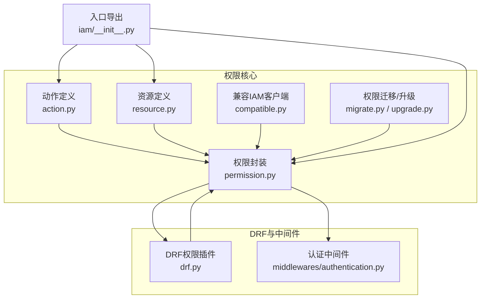
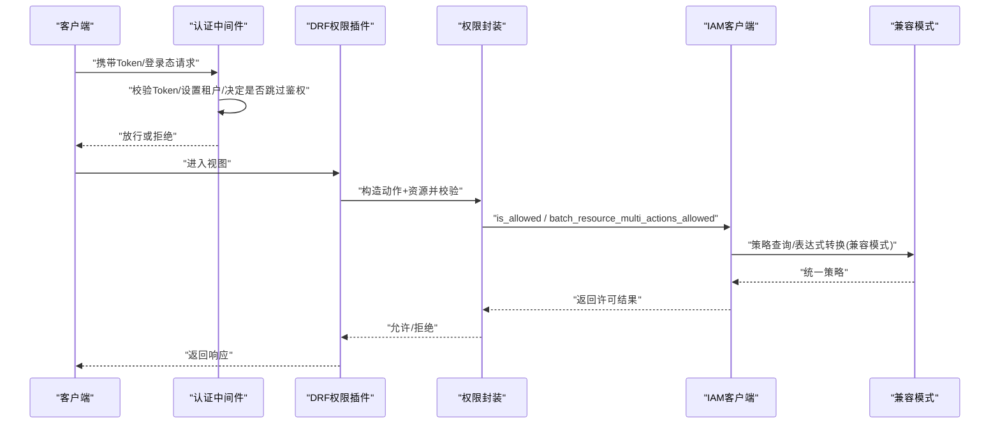
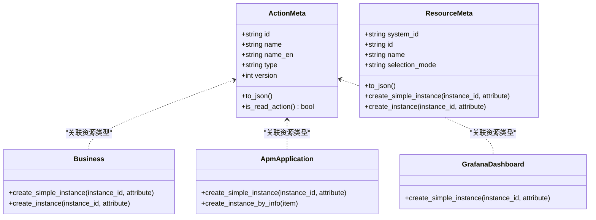
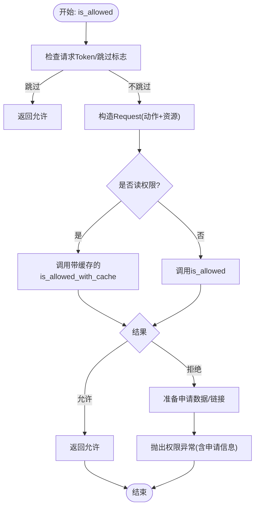
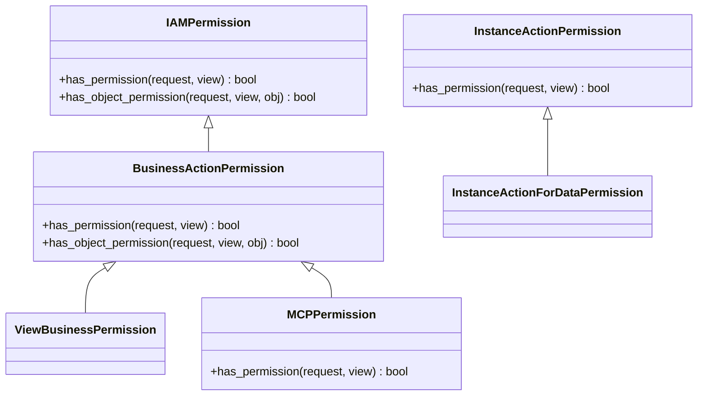
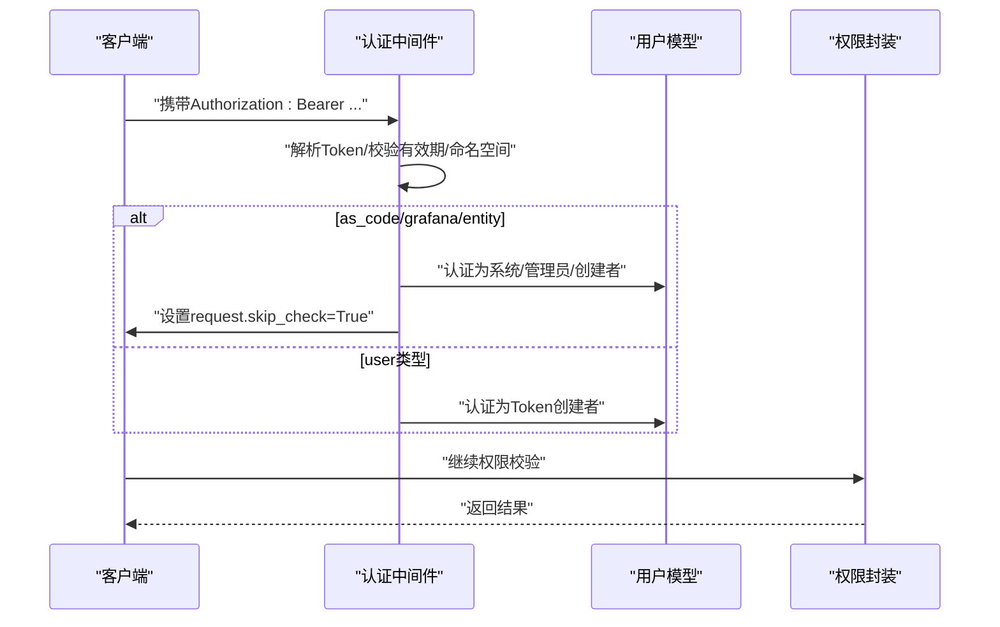
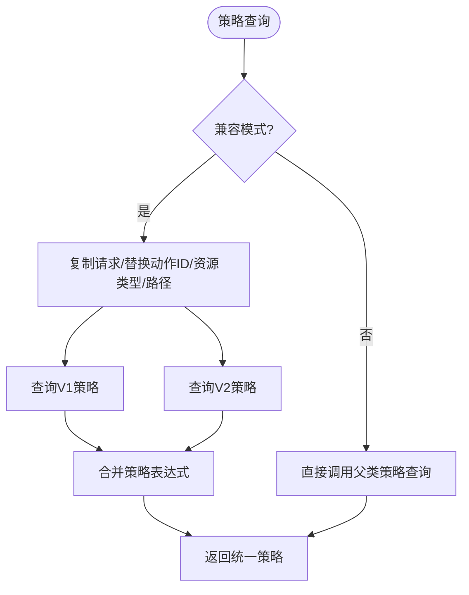
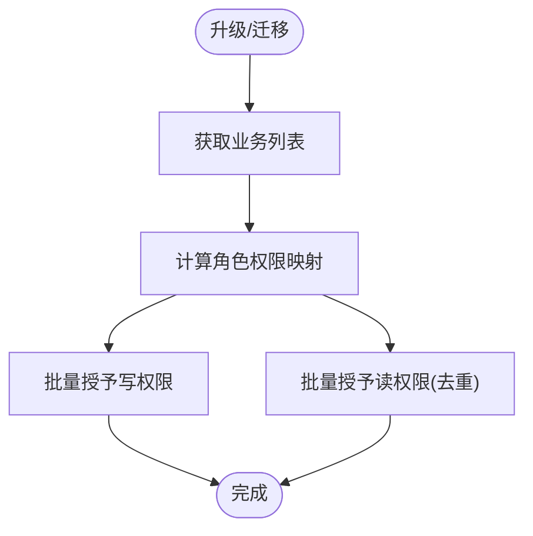
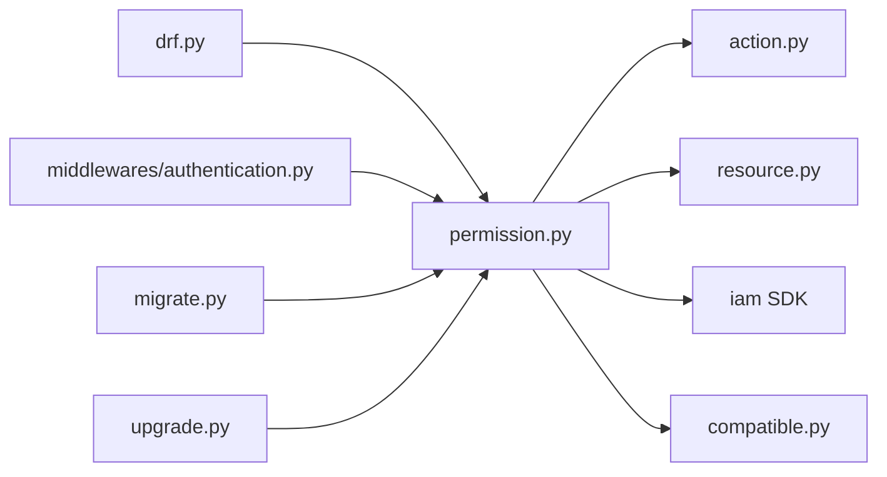
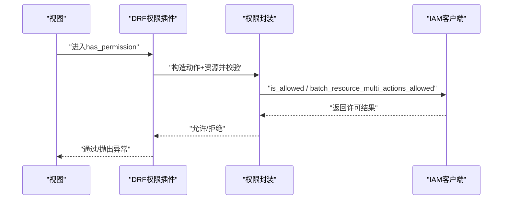

# 权限控制系统

<cite>
**本文引用的文件**
- [bkmonitor\bkmonitor\iam\__init__.py](file://bkmonitor\bkmonitor\iam\__init__.py)
- [bkmonitor\bkmonitor\iam\action.py](file://bkmonitor\bkmonitor\iam\action.py)
- [bkmonitor\bkmonitor\iam\resource.py](file://bkmonitor\bkmonitor\iam\resource.py)
- [bkmonitor\bkmonitor\iam\permission.py](file://bkmonitor\bkmonitor\iam\permission.py)
- [bkmonitor\bkmonitor\iam\drf.py](file://bkmonitor\bkmonitor\iam\drf.py)
- [bkmonitor\bkmonitor\iam\compatible.py](file://bkmonitor\bkmonitor\iam\compatible.py)
- [bkmonitor\bkmonitor\iam\migrate.py](file://bkmonitor\bkmonitor\iam\migrate.py)
- [bkmonitor\bkmonitor\iam\upgrade.py](file://bkmonitor\bkmonitor\iam\upgrade.py)
- [bkmonitor\bkmonitor\middlewares\authentication.py](file://bkmonitor\bkmonitor\middlewares\authentication.py)
</cite>

## 目录
1. [简介](#简介)
2. [项目结构](#项目结构)
3. [核心组件](#核心组件)
4. [架构总览](#架构总览)
5. [详细组件分析](#详细组件分析)
6. [依赖分析](#依赖分析)
7. [性能考虑](#性能考虑)
8. [故障排查指南](#故障排查指南)
9. [结论](#结论)
10. [附录](#附录)

## 简介
本技术文档围绕权限控制系统展开，系统基于 IAM（权限中心）进行权限模型设计与集成，覆盖动作与资源的定义、权限验证流程、DRF 中间件实现、权限缓存与兼容模式、权限迁移与升级、以及审计与扩展能力。文档旨在帮助开发者与运维人员理解权限模型、角色分配机制与资源访问控制策略，并提供实际配置案例与常见问题的解决方案。

## 项目结构
权限控制相关代码主要集中在 iam 包与 DRF 权限插件、认证中间件中：
- iam 包：动作与资源定义、权限封装、兼容模式、迁移与升级工具
- DRF 插件：基于 Django REST Framework 的权限类与装饰器
- 认证中间件：API Token 与登录态校验、租户隔离与权限豁免

图表来源
- [bkmonitor\bkmonitor\iam\__init__.py:16-20](file://bkmonitor\bkmonitor\iam\__init__.py#L16-L20)
- [bkmonitor\bkmonitor\iam\action.py:88-681](file://bkmonitor\bkmonitor\iam\action.py#L88-L681)
- [bkmonitor\bkmonitor\iam\resource.py:27-214](file://bkmonitor\bkmonitor\iam\resource.py#L27-L214)
- [bkmonitor\bkmonitor\iam\permission.py:83-519](file://bkmonitor\bkmonitor\iam\permission.py#L83-L519)
- [bkmonitor\bkmonitor\iam\compatible.py:20-158](file://bkmonitor\bkmonitor\iam\compatible.py#L20-L158)
- [bkmonitor\bkmonitor\iam\migrate.py:35-218](file://bkmonitor\bkmonitor\iam\migrate.py#L35-L218)
- [bkmonitor\bkmonitor\iam\upgrade.py:28-129](file://bkmonitor\bkmonitor\iam\upgrade.py#L28-L129)
- [bkmonitor\bkmonitor\iam\drf.py:34-363](file://bkmonitor\bkmonitor\iam\drf.py#L34-L363)
- [bkmonitor\bkmonitor\middlewares\authentication.py:49-140](file://bkmonitor\bkmonitor\middlewares\authentication.py#L49-L140)

章节来源
- [bkmonitor\bkmonitor\iam\__init__.py:12-20](file://bkmonitor\bkmonitor\iam\__init__.py#L12-L20)
- [bkmonitor\bkmonitor\iam\action.py:88-681](file://bkmonitor\bkmonitor\iam\action.py#L88-L681)
- [bkmonitor\bkmonitor\iam\resource.py:66-214](file://bkmonitor\bkmonitor\iam\resource.py#L66-L214)
- [bkmonitor\bkmonitor\iam\permission.py:83-519](file://bkmonitor\bkmonitor\iam\permission.py#L83-L519)
- [bkmonitor\bkmonitor\iam\compatible.py:20-158](file://bkmonitor\bkmonitor\iam\compatible.py#L20-L158)
- [bkmonitor\bkmonitor\iam\migrate.py:35-218](file://bkmonitor\bkmonitor\iam\migrate.py#L35-L218)
- [bkmonitor\bkmonitor\iam\upgrade.py:28-129](file://bkmonitor\bkmonitor\iam\upgrade.py#L28-L129)
- [bkmonitor\bkmonitor\iam\drf.py:34-363](file://bkmonitor\bkmonitor\iam\drf.py#L34-L363)
- [bkmonitor\bkmonitor\middlewares\authentication.py:49-140](file://bkmonitor\bkmonitor\middlewares\authentication.py#L49-L140)

## 核心组件
- 动作与资源定义：集中于 action.py 与 resource.py，定义系统内所有权限动作与资源类型，并提供动作依赖解析与资源实例构造。
- 权限封装：permission.py 提供统一的权限校验、批量校验、申请链接生成、空间权限筛选等能力，并内置读权限缓存与兼容模式支持。
- DRF 插件：drf.py 提供基于动作与资源的权限类、业务域权限、MCP 权限、实例权限与数据后处理注入权限字段等能力。
- 兼容模式：compatible.py 适配 IAM V1/V2 表达式差异，统一策略查询与合并。
- 迁移与升级：migrate.py 与 upgrade.py 支持策略迁移与按业务角色批量授权升级。
- 认证中间件：authentication.py 实现 API Token 鉴权、租户隔离、不同 Token 类型的权限豁免策略。

章节来源
- [bkmonitor\bkmonitor\iam\action.py:88-681](file://bkmonitor\bkmonitor\iam\action.py#L88-L681)
- [bkmonitor\bkmonitor\iam\resource.py:66-214](file://bkmonitor\bkmonitor\iam\resource.py#L66-L214)
- [bkmonitor\bkmonitor\iam\permission.py:83-519](file://bkmonitor\bkmonitor\iam\permission.py#L83-L519)
- [bkmonitor\bkmonitor\iam\drf.py:34-363](file://bkmonitor\bkmonitor\iam\drf.py#L34-L363)
- [bkmonitor\bkmonitor\iam\compatible.py:20-158](file://bkmonitor\bkmonitor\iam\compatible.py#L20-L158)
- [bkmonitor\bkmonitor\iam\migrate.py:35-218](file://bkmonitor\bkmonitor\iam\migrate.py#L35-L218)
- [bkmonitor\bkmonitor\iam\upgrade.py:28-129](file://bkmonitor\bkmonitor\iam\upgrade.py#L28-L129)
- [bkmonitor\bkmonitor\middlewares\authentication.py:49-140](file://bkmonitor\bkmonitor\middlewares\authentication.py#L49-L140)

## 架构总览
权限系统采用“动作-资源-主体”三层模型，结合 IAM 客户端进行权限评估与缓存；DRF 插件负责在视图层拦截与注入权限；认证中间件负责 Token 与租户隔离；兼容模式与迁移工具保障版本演进与策略平滑过渡。

图表来源
- [bkmonitor\bkmonitor\middlewares\authentication.py:49-140](file://bkmonitor\bkmonitor\middlewares\authentication.py#L49-L140)
- [bkmonitor\bkmonitor\iam\drf.py:34-130](file://bkmonitor\bkmonitor\iam\drf.py#L34-L130)
- [bkmonitor\bkmonitor\iam\permission.py:293-421](file://bkmonitor\bkmonitor\iam\permission.py#L293-L421)
- [bkmonitor\bkmonitor\iam\compatible.py:65-157](file://bkmonitor\bkmonitor\iam\compatible.py#L65-L157)

## 详细组件分析

### 动作与资源模型
- 动作（ActionMeta）：定义动作ID、名称、类型（view/manage）、版本、关联资源类型与依赖动作，提供 to_json 与 is_read_action 辅助。
- 资源（ResourceMeta）：定义资源系统ID、类型ID、名称、选择模式与实例选择器；提供 create_simple_instance/create_instance 构造资源实例。
- 资源类型枚举：BUSINESS、APM_APPLICATION、GRAFANA_DASHBOARD，支持路径与属性填充。
- 动作/资源注册：统一导出与查询，支持生成迁移 JSON 与构建权限全集。

图表来源
- [bkmonitor\bkmonitor\iam\action.py:18-63](file://bkmonitor\bkmonitor\iam\action.py#L18-L63)
- [bkmonitor\bkmonitor\iam\resource.py:27-191](file://bkmonitor\bkmonitor\iam\resource.py#L27-L191)

章节来源
- [bkmonitor\bkmonitor\iam\action.py:88-681](file://bkmonitor\bkmonitor\iam\action.py#L88-L681)
- [bkmonitor\bkmonitor\iam\resource.py:66-214](file://bkmonitor\bkmonitor\iam\resource.py#L66-L214)

### 权限封装与验证流程
- 初始化：支持显式用户名/租户或从请求中提取；根据运行角色选择 SaaS 或普通密钥；支持跳过鉴权（开发/配置）。
- 权限校验：is_allowed 支持单动作与多动作；读权限走带缓存路径；非读权限直连；异常时生成申请数据与链接。
- 批量校验：batch_is_allowed 支持多动作多资源组合校验；Token/跳过模式下快速放行。
- 空间筛选：list_actions 与 filter_space_list_by_action 基于策略表达式筛选可用空间。
- 申请数据：get_apply_data 生成本系统无权限数据与申请链接；prepare_apply_for_saas 支持 SaaS 空间全家桶申请。

图表来源
- [bkmonitor\bkmonitor\iam\permission.py:293-360](file://bkmonitor\bkmonitor\iam\permission.py#L293-L360)

章节来源
- [bkmonitor\bkmonitor\iam\permission.py:83-519](file://bkmonitor\bkmonitor\iam\permission.py#L83-L519)

### DRF 权限插件
- IAMPermission：通用动作+资源权限校验，支持多动作任一通过。
- BusinessActionPermission：自动注入业务资源上下文。
- MCPPermission：动态权限动作选择，基于请求头动态映射。
- InstanceActionPermission：基于路由参数的实例权限校验。
- 数据后处理：insert_permission_field 批量注入权限字段；filter_data_by_permission 支持按权限过滤或插入权限信息。
- 批量创建资源实例：batch_create_instance 并发构造资源实例。

图表来源
- [bkmonitor\bkmonitor\iam\drf.py:34-181](file://bkmonitor\bkmonitor\iam\drf.py#L34-L181)

章节来源
- [bkmonitor\bkmonitor\iam\drf.py:34-363](file://bkmonitor\bkmonitor\iam\drf.py#L34-L363)

### 认证中间件与权限豁免
- ApiTokenAuthenticationMiddleware：校验 Bearer Token，区分 as_code/grafana/entity/user 等类型，设置 skip_check 或替换用户，实现不同场景的权限豁免与租户隔离。
- 租户一致性校验：确保用户存储的 tenant_id 与当前配置一致。
- 登录态与 CSRF：NoCsrfSessionAuthentication 放行 DRF 请求。

图表来源
- [bkmonitor\bkmonitor\middlewares\authentication.py:49-123](file://bkmonitor\bkmonitor\middlewares\authentication.py#L49-L123)

章节来源
- [bkmonitor\bkmonitor\middlewares\authentication.py:49-140](file://bkmonitor\bkmonitor\middlewares\authentication.py#L49-L140)

### 兼容模式与策略表达式
- CompatibleIAM：检测是否处于兼容模式；当存在 V1 动作时，将 v2 动作请求转换为 v1 查询并合并策略表达式，统一返回。
- 策略查询：_do_policy_query/_do_policy_query_by_actions 在兼容模式下绕过资源传递，先获取全部策略再逐资源计算。

图表来源
- [bkmonitor\bkmonitor\iam\compatible.py:34-157](file://bkmonitor\bkmonitor\iam\compatible.py#L34-L157)

章节来源
- [bkmonitor\bkmonitor\iam\compatible.py:20-158](file://bkmonitor\bkmonitor\iam\compatible.py#L20-L158)

### 权限迁移与升级
- PolicyMigrator：支持分页查询策略、按路径分块授权、表达式到资源路径转换、批量路径授权。
- UpgradeManager：按业务聚合角色权限，区分读/写用户集合，批量授予实例权限。

图表来源
- [bkmonitor\bkmonitor\iam\upgrade.py:42-129](file://bkmonitor\bkmonitor\iam\upgrade.py#L42-L129)
- [bkmonitor\bkmonitor\iam\migrate.py:41-218](file://bkmonitor\bkmonitor\iam\migrate.py#L41-L218)

章节来源
- [bkmonitor\bkmonitor\iam\upgrade.py:28-129](file://bkmonitor\bkmonitor\iam\upgrade.py#L28-L129)
- [bkmonitor\bkmonitor\iam\migrate.py:35-218](file://bkmonitor\bkmonitor\iam\migrate.py#L35-L218)

## 依赖分析
- 组件耦合：Permission 依赖 ActionMeta/ResourceMeta、IAM 客户端与兼容层；DRF 插件依赖 Permission 与资源/动作枚举；认证中间件影响 Permission 的 skip_check 与用户上下文。
- 外部依赖：IAM SDK、蓝鲸空间与仪表盘服务、APM 应用模型、API Gateway JWT 签名公钥配置。
- 循环依赖：未见直接循环；资源与动作通过枚举注册，避免运行期循环。

图表来源
- [bkmonitor\bkmonitor\iam\drf.py:27-29](file://bkmonitor\bkmonitor\iam\drf.py#L27-L29)
- [bkmonitor\bkmonitor\iam\permission.py:38-48](file://bkmonitor\bkmonitor\iam\permission.py#L38-L48)
- [bkmonitor\bkmonitor\iam\action.py:11-13](file://bkmonitor\bkmonitor\iam\action.py#L11-L13)
- [bkmonitor\bkmonitor\iam\resource.py:15-17](file://bkmonitor\bkmonitor\iam\resource.py#L15-L17)
- [bkmonitor\bkmonitor\iam\compatible.py:17-17](file://bkmonitor\bkmonitor\iam\compatible.py#L17-L17)
- [bkmonitor\bkmonitor\middlewares\authentication.py:11-12](file://bkmonitor\bkmonitor\middlewares\authentication.py#L11-L12)

章节来源
- [bkmonitor\bkmonitor\iam\drf.py:27-29](file://bkmonitor\bkmonitor\iam\drf.py#L27-L29)
- [bkmonitor\bkmonitor\iam\permission.py:38-48](file://bkmonitor\bkmonitor\iam\permission.py#L38-L48)
- [bkmonitor\bkmonitor\iam\action.py:11-13](file://bkmonitor\bkmonitor\iam\action.py#L11-L13)
- [bkmonitor\bkmonitor\iam\resource.py:15-17](file://bkmonitor\bkmonitor\iam\resource.py#L15-L17)
- [bkmonitor\bkmonitor\iam\compatible.py:17-17](file://bkmonitor\bkmonitor\iam\compatible.py#L17-L17)
- [bkmonitor\bkmonitor\middlewares\authentication.py:11-12](file://bkmonitor\bkmonitor\middlewares\authentication.py#L11-L12)

## 性能考虑
- 读权限缓存：is_allowed 对读权限使用带缓存的评估方法，显著降低重复查询成本。
- 批量校验：batch_is_allowed 与 DRF 批量注入减少多次往返。
- 并发构造资源实例：insert_permission_field 使用线程池批量创建资源实例，提升大列表场景效率。
- 兼容模式策略合并：先获取全部策略再逐资源计算，避免多次服务端查询。

章节来源
- [bkmonitor\bkmonitor\iam\permission.py:331-339](file://bkmonitor\bkmonitor\iam\permission.py#L331-L339)
- [bkmonitor\bkmonitor\iam\drf.py:270-289](file://bkmonitor\bkmonitor\iam\drf.py#L270-L289)

## 故障排查指南
- 权限异常：is_allowed 在拒绝时抛出 PermissionDeniedError，包含动作名称与申请链接；可通过 get_apply_data 获取完整申请数据。
- 申请链接无效：get_apply_url 返回失败时回退到 IAM SaaS 主页；检查系统/动作/资源注册状态。
- Token 鉴权失败：中间件校验失败返回 403，需确认 Token 有效性、命名空间与业务域匹配、类型是否支持。
- 兼容模式策略不生效：确认兼容模式开关与 V1/V2 动作映射；检查表达式字段替换（biz.id → space.id）。
- 批量注入权限字段为空：insert_permission_field 仅对可提取实例ID的数据注入；检查 id_field 与 data_field 回调。

章节来源
- [bkmonitor\bkmonitor\iam\permission.py:353-357](file://bkmonitor\bkmonitor\iam\permission.py#L353-L357)
- [bkmonitor\bkmonitor\iam\permission.py:231-254](file://bkmonitor\bkmonitor\iam\permission.py#L231-L254)
- [bkmonitor\bkmonitor\middlewares\authentication.py:59-95](file://bkmonitor\bkmonitor\middlewares\authentication.py#L59-L95)
- [bkmonitor\bkmonitor\iam\compatible.py:65-108](file://bkmonitor\bkmonitor\iam\compatible.py#L65-L108)
- [bkmonitor\bkmonitor\iam\drf.py:207-253](file://bkmonitor\bkmonitor\iam\drf.py#L207-L253)

## 结论
权限控制系统以清晰的动作-资源-主体模型为基础，结合 DRF 插件与认证中间件实现细粒度的资源访问控制；通过读权限缓存、批量校验与兼容模式优化性能与稳定性；迁移与升级工具保障历史策略与角色权限的平滑过渡。建议在生产环境中启用读权限缓存、合理使用批量接口，并在跨版本升级时配合兼容模式与策略迁移工具。

## 附录

### 权限模型设计要点
- 动作类型：view（只读）与 manage（管理），用于区分缓存策略与权限范围。
- 资源层级：业务空间作为根资源，支持路径拼接与属性补充。
- 依赖关系：动作可声明依赖动作与资源类型，便于统一申请与校验。

章节来源
- [bkmonitor\bkmonitor\iam\action.py:58-63](file://bkmonitor\bkmonitor\iam\action.py#L58-L63)
- [bkmonitor\bkmonitor\iam\resource.py:135-163](file://bkmonitor\bkmonitor\iam\resource.py#L135-L163)

### 角色分配与继承
- 角色到权限映射：通过 RolePermission 与默认角色权限配置，将用户映射到读/写权限集合。
- 继承关系：写权限集合天然包含读权限集合，升级时进行去重处理。

章节来源
- [bkmonitor\bkmonitor\iam\upgrade.py:58-82](file://bkmonitor\bkmonitor\iam\upgrade.py#L58-L82)

### 资源访问控制策略
- 单动作校验：is_allowed 支持精确到资源实例的权限判断。
- 批量校验：batch_is_allowed 适合列表页权限预判。
- 数据注入：insert_permission_field 将权限结果注入响应，前端可据此渲染。

章节来源
- [bkmonitor\bkmonitor\iam\permission.py:386-421](file://bkmonitor\bkmonitor\iam\permission.py#L386-L421)
- [bkmonitor\bkmonitor\iam\drf.py:183-253](file://bkmonitor\bkmonitor\iam\drf.py#L183-L253)

### IAM 集成方案
- 客户端初始化：根据运行角色选择 app_code/secret_key 与网关地址。
- 系统/资源/动作注册：setup_meta 在进程内一次性注册，避免重复调用。
- 申请与授权：get_apply_data 生成申请数据，PolicyMigrator 支持批量路径授权。

章节来源
- [bkmonitor\bkmonitor\iam\permission.py:119-126](file://bkmonitor\bkmonitor\iam\permission.py#L119-L126)
- [bkmonitor\bkmonitor\iam\permission.py:494-519](file://bkmonitor\bkmonitor\iam\permission.py#L494-L519)
- [bkmonitor\bkmonitor\iam\migrate.py:71-108](file://bkmonitor\bkmonitor\iam\migrate.py#L71-L108)

### 权限验证流程（序列图）

图表来源
- [bkmonitor\bkmonitor\iam\drf.py:39-67](file://bkmonitor\bkmonitor\iam\drf.py#L39-L67)
- [bkmonitor\bkmonitor\iam\permission.py:386-421](file://bkmonitor\bkmonitor\iam\permission.py#L386-L421)

### 权限缓存机制
- 读权限缓存：is_allowed_with_cache 仅对读权限启用，降低重复查询开销。
- 资源实例缓存：APM 应用与 Grafana 仪表盘实例属性缓存，减少数据库与外部服务调用。

章节来源
- [bkmonitor\bkmonitor\iam\permission.py:331-339](file://bkmonitor\bkmonitor\iam\permission.py#L331-L339)
- [bkmonitor\bkmonitor\iam\resource.py:135-163](file://bkmonitor\bkmonitor\iam\resource.py#L135-L163)

### 权限变更通知与审计
- 申请与授权：get_apply_data 生成申请数据，PolicyMigrator 授权记录可用于审计追踪。
- 异常与日志：权限异常记录包含动作名称与申请链接，便于问题定位与复核。

章节来源
- [bkmonitor\bkmonitor\iam\permission.py:256-291](file://bkmonitor\bkmonitor\iam\permission.py#L256-L291)
- [bkmonitor\bkmonitor\iam\migrate.py:109-116](file://bkmonitor\bkmonitor\iam\migrate.py#L109-L116)

### 扩展接口与自定义规则
- 自定义动作/资源：在 action.py/resource.py 中新增枚举项，注册到系统元数据。
- 自定义 DRF 权限类：继承 IAMPermission/BusinessActionPermission/MCPPermission，按需注入资源上下文。
- 自定义资源实例创建：在 ResourceMeta 子类中覆写 create_simple_instance/create_instance。
- 自定义兼容策略：在 CompatibleIAM 中扩展策略表达式转换逻辑。

章节来源
- [bkmonitor\bkmonitor\iam\action.py:578-627](file://bkmonitor\bkmonitor\iam\action.py#L578-L627)
- [bkmonitor\bkmonitor\iam\resource.py:47-63](file://bkmonitor\bkmonitor\iam\resource.py#L47-L63)
- [bkmonitor\bkmonitor\iam\drf.py:34-130](file://bkmonitor\bkmonitor\iam\drf.py#L34-L130)
- [bkmonitor\bkmonitor\iam\compatible.py:50-108](file://bkmonitor\bkmonitor\iam\compatible.py#L50-L108)

### 实际配置案例
- 仪表盘实例编辑权限：使用 GRAFANA_DASHBOARD 资源类型与 EDIT_SINGLE_DASHBOARD 动作，自动注入业务上下文。
- MCP 权限：通过请求头动态选择 USING_DASHBOARD_MCP/USING_METRICS_MCP 等动作，自动注入业务资源。
- 列表页权限注入：使用 insert_permission_field 将多动作权限注入响应，前端按需渲染。

章节来源
- [bkmonitor\bkmonitor\iam\action.py:429-447](file://bkmonitor\bkmonitor\iam\action.py#L429-L447)
- [bkmonitor\bkmonitor\iam\drf.py:105-130](file://bkmonitor\bkmonitor\iam\drf.py#L105-L130)
- [bkmonitor\bkmonitor\iam\drf.py:183-253](file://bkmonitor\bkmonitor\iam\drf.py#L183-L253)