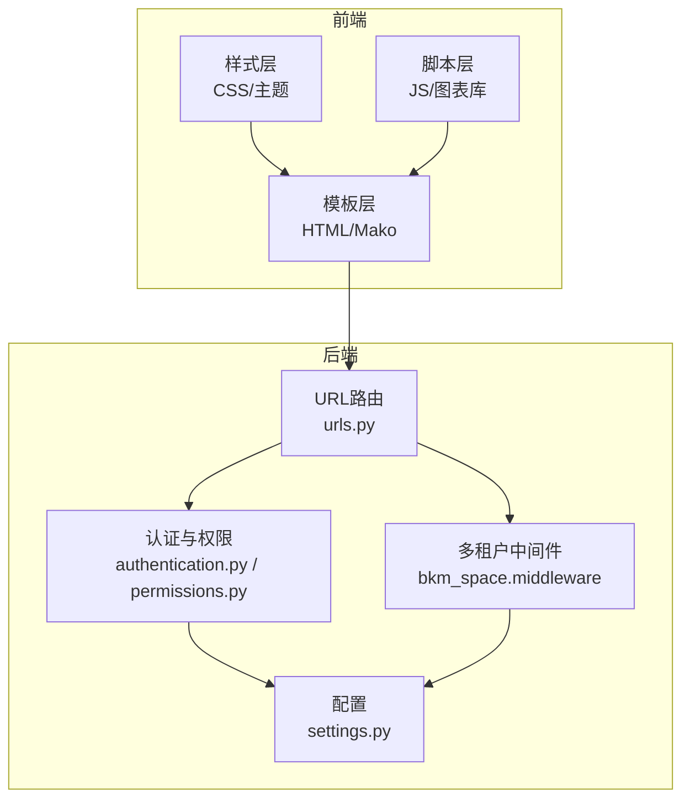
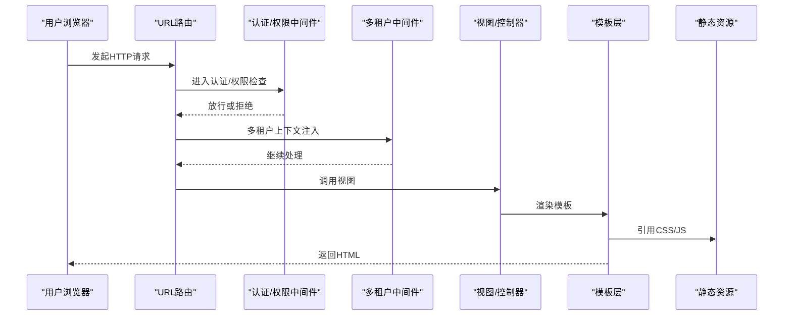
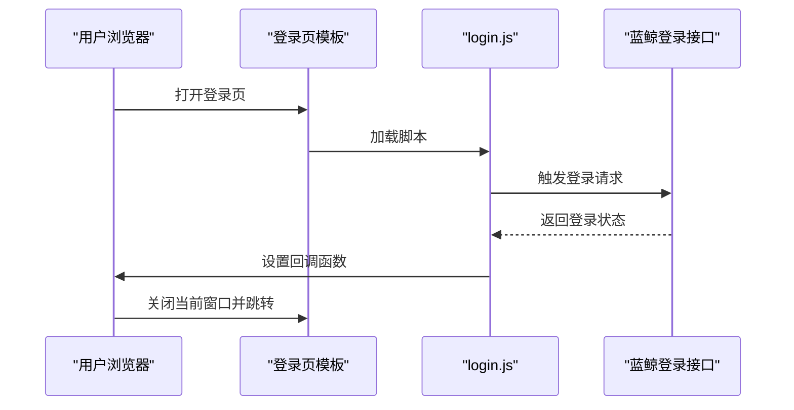
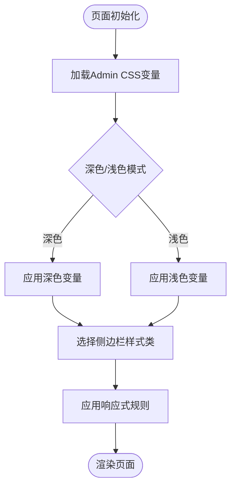
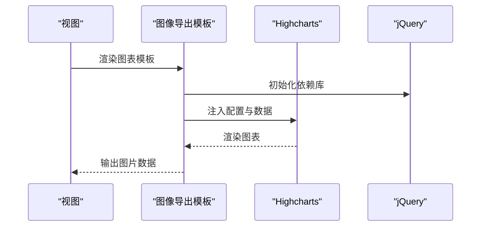
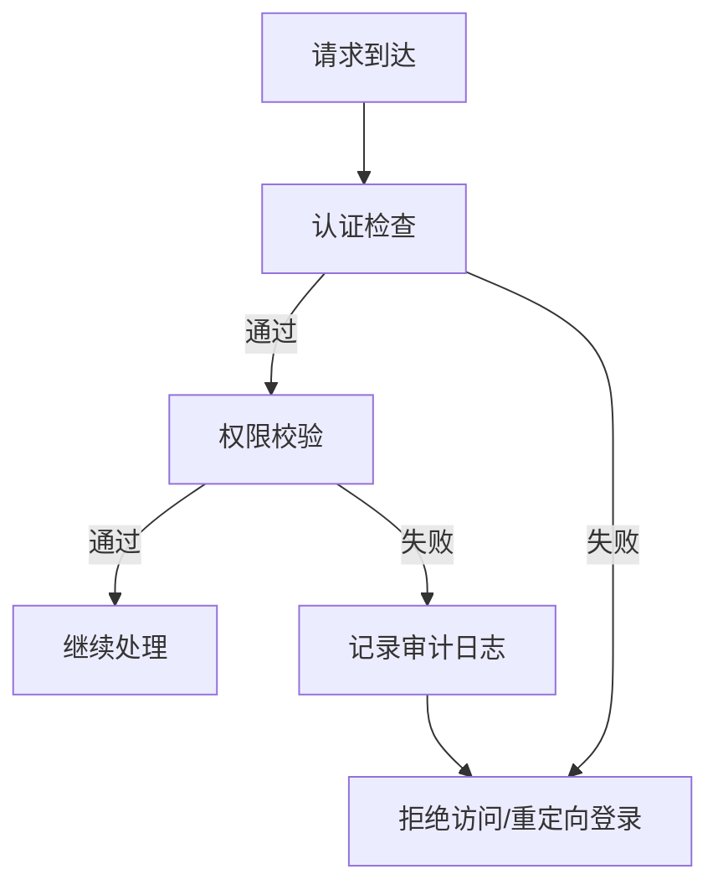
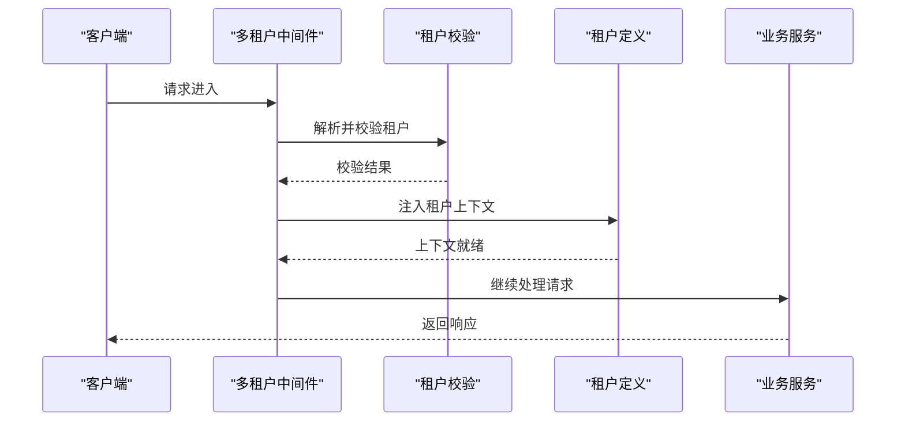
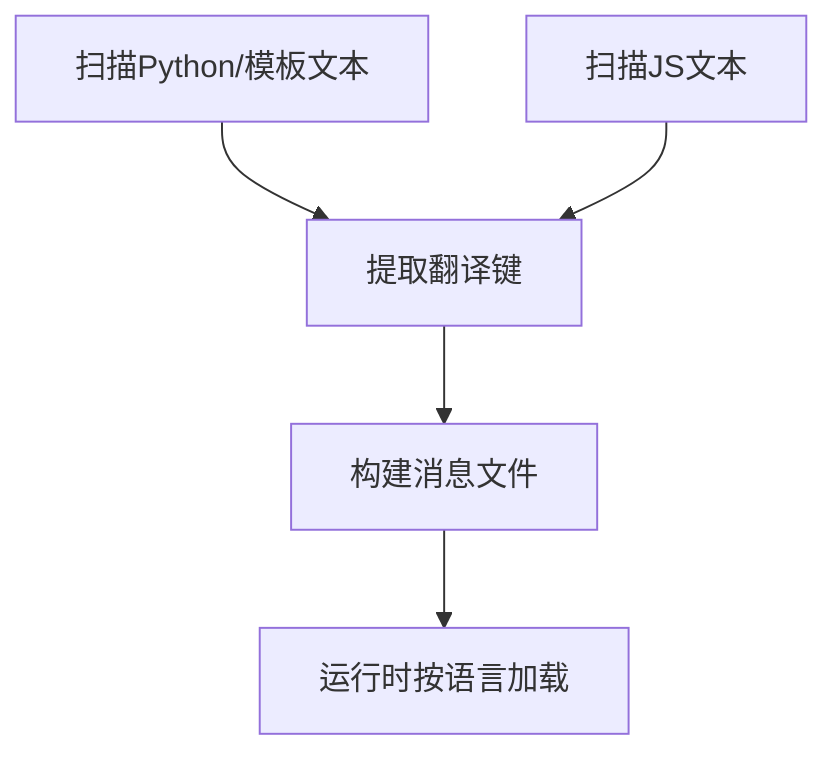
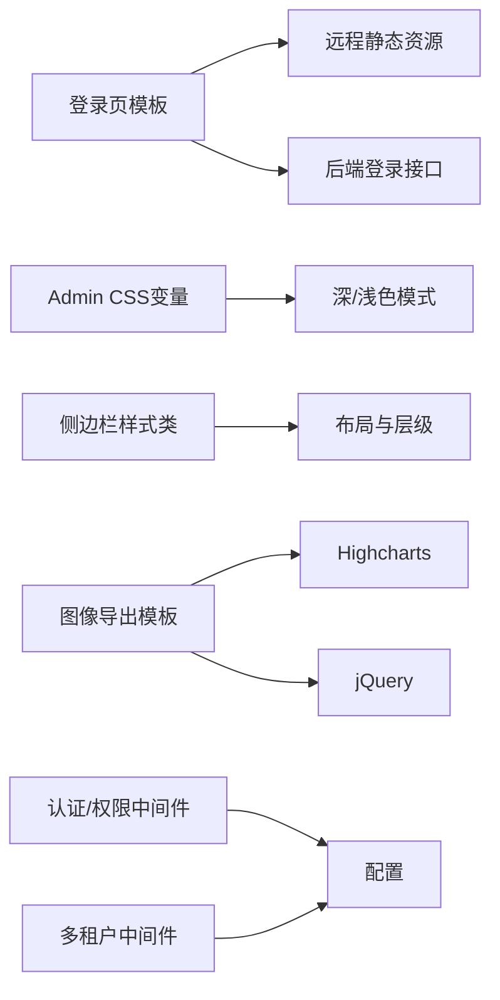

# 用户界面设计

<cite>
**本文引用的文件**
- [login_page.html](file://bkmonitor/templates/account/login_page.html)
- [bk.css](file://bkmonitor/static/css/bk.css)
- [base.css](file://bkmonitor/static/admin/css/base.css)
- [babel.cfg](file://bkmonitor/locale/babel.cfg)
- [babeljs.cfg](file://bkmonitor/locale/babeljs.cfg)
- [urls.py](file://bkmonitor/urls.py)
- [settings.py](file://bkmonitor/settings.py)
- [apps.py](file://bkmonitor/bkmonitor/apps.py)
- [authentication.py](file://bkmonitor/bkmonitor/authentication.py)
- [permissions.py](file://bkmonitor/bkmonitor/permissions.py)
- [middleware.py](file://bkmonitor/bkm_space/middleware.py)
- [validate.py](file://bkmonitor/bkm_space/validate.py)
- [define.py](file://bkmonitor/bkm_space/define.py)
- [login.js](file://bkmonitor/static/account/login.js)
- [graph.html](file://bkmonitor/alarm_backends/templates/image_exporter/graph.html)
- [graph-highcharts.js](file://bkmonitor/alarm_backends/templates/image_exporter/static/js/graph-highcharts.js)
- [highcharts.js](file://bkmonitor/alarm_backends/templates/image_exporter/static/js/highcharts.js)
- [highcharts-more.js](file://bkmonitor/alarm_backends/templates/image_exporter/static/js/highcharts-more.js)
- [jquery-1.10.2.min.js](file://bkmonitor/alarm_backends/templates/image_exporter/static/js/jquery-1.10.2.min.js)
</cite>

## 目录
1. [简介](#简介)
2. [项目结构](#项目结构)
3. [核心组件](#核心组件)
4. [架构总览](#架构总览)
5. [详细组件分析](#详细组件分析)
6. [依赖分析](#依赖分析)
7. [性能考虑](#性能考虑)
8. [故障排查指南](#故障排查指南)
9. [结论](#结论)
10. [附录](#附录)

## 简介
本设计文档面向用户界面系统，围绕仪表板架构、图表组件设计、权限控制系统与多租户管理机制展开，同时解释用户交互流程、响应式设计实现、主题定制功能与国际化支持。文档还覆盖权限模型的设计原理、角色分配机制、资源访问控制与审计日志记录，并提供UI组件使用指南、样式定制方法与扩展开发规范。

## 项目结构
用户界面系统由模板层（HTML/Mako）、静态资源层（CSS/JS）、后端路由与中间件、权限与多租户模块构成。模板层负责页面骨架与交互入口；静态资源层提供主题与图表渲染能力；后端通过URL路由与视图控制器组织业务逻辑；权限与多租户模块在中间件与认证层实现统一接入。

**图表来源**
- [urls.py](file://bkmonitor/urls.py)
- [settings.py](file://bkmonitor/settings.py)
- [authentication.py](file://bkmonitor/bkmonitor/authentication.py)
- [permissions.py](file://bkmonitor/bkmonitor/permissions.py)
- [middleware.py](file://bkmonitor/bkm_space/middleware.py)

**章节来源**
- [urls.py](file://bkmonitor/urls.py)
- [settings.py](file://bkmonitor/settings.py)
- [apps.py](file://bkmonitor/bkmonitor/apps.py)

## 核心组件
- 登录与会话管理：登录页模板与自动跳转脚本协同，完成蓝鲸登录对接与会话建立。
- 主题与布局：基于Admin CSS变量的主题系统与多种侧边栏导航样式，支撑深浅色主题与响应式布局。
- 图表与可视化：图像导出模板与Highcharts组合，提供可嵌入的图表渲染能力。
- 权限与多租户：认证、权限校验与多租户中间件在请求生命周期中统一拦截与处理。

**章节来源**
- [login_page.html](file://bkmonitor/templates/account/login_page.html)
- [login.js](file://bkmonitor/static/account/login.js)
- [bk.css](file://bkmonitor/static/css/bk.css)
- [base.css](file://bkmonitor/static/admin/css/base.css)
- [graph.html](file://bkmonitor/alarm_backends/templates/image_exporter/graph.html)
- [highcharts.js](file://bkmonitor/alarm_backends/templates/image_exporter/static/js/highcharts.js)

## 架构总览
用户请求从URL路由进入，经认证与权限中间件处理后，进入业务视图；模板层负责页面渲染，静态资源提供样式与脚本；多租户中间件在请求早期进行租户识别与上下文注入。

**图表来源**
- [urls.py](file://bkmonitor/urls.py)
- [authentication.py](file://bkmonitor/bkmonitor/authentication.py)
- [permissions.py](file://bkmonitor/bkmonitor/permissions.py)
- [middleware.py](file://bkmonitor/bkm_space/middleware.py)

## 详细组件分析

### 登录与会话流程
- 登录页模板负责提示与自动跳转，调用后端接口触发蓝鲸登录弹窗。
- 页面加载后自动执行登录函数，随后关闭当前窗口并重定向到目标地址。
- 登录成功回调设置全局函数，确保跳转逻辑正确拼接哈希片段。

**图表来源**
- [login_page.html](file://bkmonitor/templates/account/login_page.html)
- [login.js](file://bkmonitor/static/account/login.js)

**章节来源**
- [login_page.html](file://bkmonitor/templates/account/login_page.html)
- [login.js](file://bkmonitor/static/account/login.js)

### 主题与布局设计
- Admin CSS采用CSS变量定义主题色系，支持深色/浅色模式切换。
- 提供多种侧边栏导航样式类，便于按模块划分与视觉层次。
- 响应式布局通过媒体查询与容器适配，保证在不同设备上的可读性与可用性。

**图表来源**
- [base.css](file://bkmonitor/static/admin/css/base.css)
- [bk.css](file://bkmonitor/static/css/bk.css)

**章节来源**
- [base.css](file://bkmonitor/static/admin/css/base.css)
- [bk.css](file://bkmonitor/static/css/bk.css)

### 图表组件设计
- 图像导出模板用于生成带图表的图片，内嵌Highcharts与jQuery。
- 模板引用高亮版本的Highcharts与扩展库，确保复杂图表渲染能力。
- 通过模板参数传递数据与样式，实现图表与业务数据的解耦。

**图表来源**
- [graph.html](file://bkmonitor/alarm_backends/templates/image_exporter/graph.html)
- [highcharts.js](file://bkmonitor/alarm_backends/templates/image_exporter/static/js/highcharts.js)
- [highcharts-more.js](file://bkmonitor/alarm_backends/templates/image_exporter/static/js/highcharts-more.js)
- [jquery-1.10.2.min.js](file://bkmonitor/alarm_backends/templates/image_exporter/static/js/jquery-1.10.2.min.js)

**章节来源**
- [graph.html](file://bkmonitor/alarm_backends/templates/image_exporter/graph.html)
- [graph-highcharts.js](file://bkmonitor/alarm_backends/templates/image_exporter/static/js/graph-highcharts.js)
- [highcharts.js](file://bkmonitor/alarm_backends/templates/image_exporter/static/js/highcharts.js)
- [highcharts-more.js](file://bkmonitor/alarm_backends/templates/image_exporter/static/js/highcharts-more.js)
- [jquery-1.10.2.min.js](file://bkmonitor/alarm_backends/templates/image_exporter/static/js/jquery-1.10.2.min.js)

### 权限控制系统
- 认证与权限模块在中间件层统一拦截，对未授权访问进行拒绝或引导登录。
- 权限校验贯穿请求生命周期，确保资源访问受控。
- 审计日志建议在权限决策点记录访问行为，便于追踪与合规。

**图表来源**
- [authentication.py](file://bkmonitor/bkmonitor/authentication.py)
- [permissions.py](file://bkmonitor/bkmonitor/permissions.py)

**章节来源**
- [authentication.py](file://bkmonitor/bkmonitor/authentication.py)
- [permissions.py](file://bkmonitor/bkmonitor/permissions.py)

### 多租户管理机制
- 多租户中间件在请求早期识别租户上下文，注入到后续处理链。
- 校验与定义模块提供租户标识解析与合法性验证。
- 业务视图与数据访问层基于租户上下文隔离数据与配置。

**图表来源**
- [middleware.py](file://bkmonitor/bkm_space/middleware.py)
- [validate.py](file://bkmonitor/bkm_space/validate.py)
- [define.py](file://bkmonitor/bkm_space/define.py)

**章节来源**
- [middleware.py](file://bkmonitor/bkm_space/middleware.py)
- [validate.py](file://bkmonitor/bkm_space/validate.py)
- [define.py](file://bkmonitor/bkm_space/define.py)

### 国际化与本地化
- Python与模板文件的国际化扫描配置，确保后端与模板中的文本被提取。
- JavaScript文件的扫描配置，覆盖前端仪表盘脚本的本地化需求。
- 建议在模板中使用翻译标记，在前端脚本中通过后端接口或预编译资源提供语言包。

**图表来源**
- [babel.cfg](file://bkmonitor/locale/babel.cfg)
- [babeljs.cfg](file://bkmonitor/locale/babeljs.cfg)

**章节来源**
- [babel.cfg](file://bkmonitor/locale/babel.cfg)
- [babeljs.cfg](file://bkmonitor/locale/babeljs.cfg)

## 依赖分析
- 模板依赖：登录页模板依赖远程静态资源与后端接口，确保跨域登录与自动跳转。
- 样式依赖：Admin CSS变量驱动主题切换，侧边栏样式类提供布局扩展点。
- 图表依赖：Highcharts与jQuery版本需保持兼容，避免渲染异常。
- 中间件依赖：认证/权限中间件与多租户中间件需按顺序注册，避免上下文缺失。

**图表来源**
- [login_page.html](file://bkmonitor/templates/account/login_page.html)
- [base.css](file://bkmonitor/static/admin/css/base.css)
- [bk.css](file://bkmonitor/static/css/bk.css)
- [graph.html](file://bkmonitor/alarm_backends/templates/image_exporter/graph.html)
- [highcharts.js](file://bkmonitor/alarm_backends/templates/image_exporter/static/js/highcharts.js)
- [jquery-1.10.2.min.js](file://bkmonitor/alarm_backends/templates/image_exporter/static/js/jquery-1.10.2.min.js)
- [authentication.py](file://bkmonitor/bkmonitor/authentication.py)
- [middleware.py](file://bkmonitor/bkm_space/middleware.py)

**章节来源**
- [login_page.html](file://bkmonitor/templates/account/login_page.html)
- [base.css](file://bkmonitor/static/admin/css/base.css)
- [bk.css](file://bkmonitor/static/css/bk.css)
- [graph.html](file://bkmonitor/alarm_backends/templates/image_exporter/graph.html)
- [highcharts.js](file://bkmonitor/alarm_backends/templates/image_exporter/static/js/highcharts.js)
- [jquery-1.10.2.min.js](file://bkmonitor/alarm_backends/templates/image_exporter/static/js/jquery-1.10.2.min.js)
- [authentication.py](file://bkmonitor/bkmonitor/authentication.py)
- [middleware.py](file://bkmonitor/bkm_space/middleware.py)

## 性能考虑
- 静态资源缓存：合理设置远程静态资源版本号与缓存头，减少重复下载。
- 图表渲染优化：按需加载Highcharts扩展，避免一次性引入过多模块。
- 响应式与首屏：优先加载关键CSS与核心JS，延迟非关键资源，缩短首屏时间。
- 中间件链路：减少不必要的权限计算与租户解析，避免阻塞主请求。

## 故障排查指南
- 登录失败：检查登录页模板是否正确传递重定向地址，确认脚本回调函数是否生效。
- 主题异常：核对Admin CSS变量是否被覆盖，确认深色/浅色模式开关逻辑。
- 图表不显示：验证Highcharts与jQuery版本兼容性，检查模板参数是否正确传入。
- 权限拒绝：确认认证/权限中间件注册顺序，检查审计日志定位具体拒绝原因。
- 多租户错误：核对中间件租户解析逻辑，检查校验与定义模块的返回值。

**章节来源**
- [login_page.html](file://bkmonitor/templates/account/login_page.html)
- [login.js](file://bkmonitor/static/account/login.js)
- [base.css](file://bkmonitor/static/admin/css/base.css)
- [graph.html](file://bkmonitor/alarm_backends/templates/image_exporter/graph.html)
- [authentication.py](file://bkmonitor/bkmonitor/authentication.py)
- [middleware.py](file://bkmonitor/bkm_space/middleware.py)

## 结论
该用户界面系统以模板与静态资源为核心，结合认证、权限与多租户中间件，形成统一的访问控制与上下文注入机制。通过Admin CSS变量与多种侧边栏样式，实现灵活的主题与布局；图像导出模板与Highcharts组合满足图表渲染需求。国际化配置覆盖后端与前端脚本，便于多语言部署。建议在权限决策点完善审计日志，持续优化静态资源与图表渲染性能。

## 附录
- UI组件使用指南
  - 登录组件：直接复用登录页模板，确保远程静态资源与后端接口可用。
  - 导航组件：根据模块选择侧边栏样式类，配合Admin CSS变量实现主题切换。
  - 图表组件：在图像导出模板中传入数据与配置，确保Highcharts与jQuery版本匹配。
- 样式定制方法
  - 修改Admin CSS变量以调整主题色系；新增侧边栏样式类以扩展布局。
  - 使用媒体查询适配移动端，确保文字与控件可读性。
- 扩展开发规范
  - 在中间件层统一接入认证与多租户逻辑，避免分散处理。
  - 国际化文本统一通过扫描配置提取，前端脚本通过后端接口或预编译资源加载语言包。