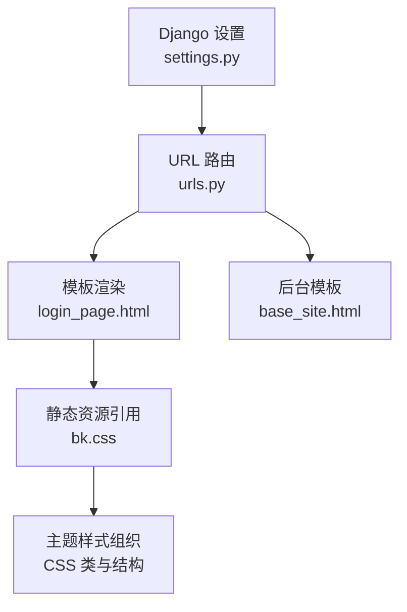
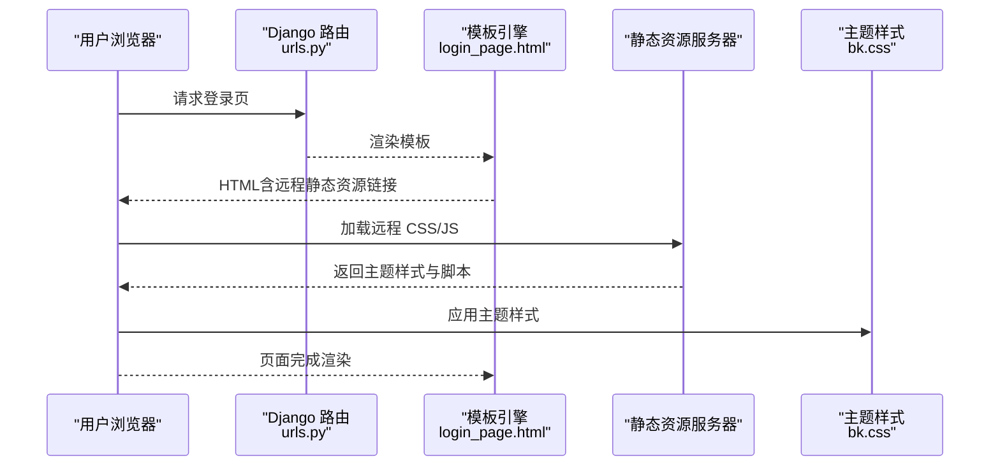
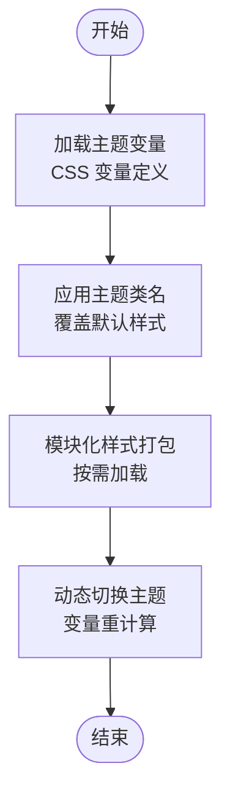
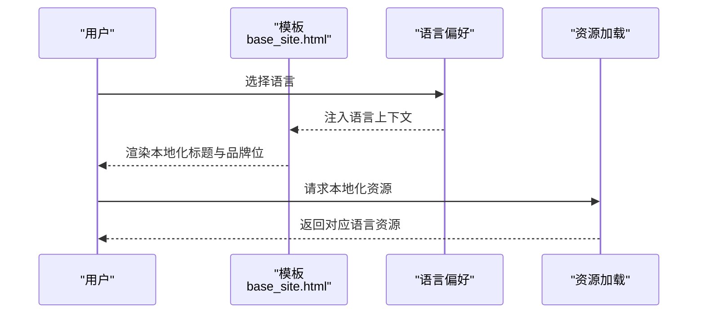
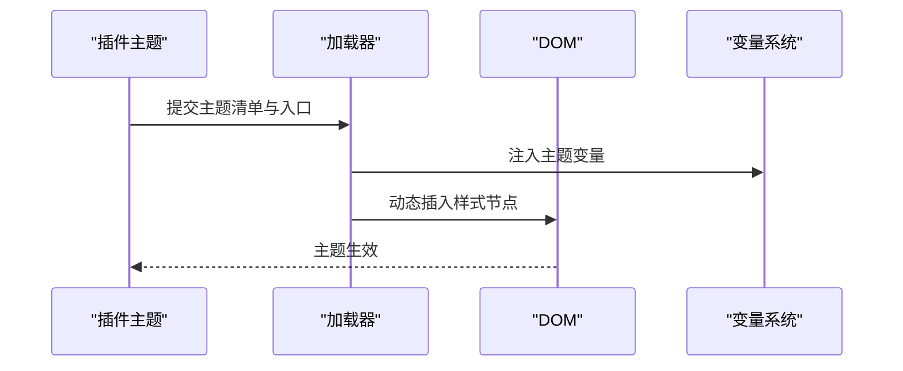
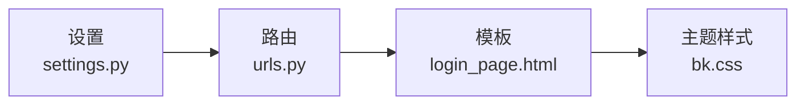

# 界面定制与主题

<cite>
**本文引用的文件**
- [settings.py](file://bkmonitor/settings.py)
- [urls.py](file://bkmonitor/urls.py)
- [bk.css](file://bkmonitor/static/css/bk.css)
- [base_site.html](file://bkmonitor/django_templates/admin/base_site.html)
- [login_page.html](file://bkmonitor/templates/account/login_page.html)
</cite>

## 目录
1. [简介](#简介)
2. [项目结构](#项目结构)
3. [核心组件](#核心组件)
4. [架构总览](#架构总览)
5. [组件详解](#组件详解)
6. [依赖关系分析](#依赖关系分析)
7. [性能考量](#性能考量)
8. [故障排查指南](#故障排查指南)
9. [结论](#结论)
10. [附录](#附录)

## 简介
本设计文档聚焦于界面定制与主题系统，围绕以下目标展开：
- 主题系统架构与样式组织
- CSS 变量系统与响应式设计
- 浏览器兼容性策略
- 国际化（i18n）与多语言切换
- 插件化主题与动态样式加载
- 开发指南与样式规范

在当前仓库中，界面主题与样式主要通过静态 CSS 文件与模板渲染进行组织；国际化通过 Django 的 i18n 标签与模板上下文变量实现；浏览器兼容性与响应式设计则体现在现有 CSS 类命名与结构中。后续可在现有基础上扩展 CSS 变量、模块化样式与动态主题加载能力。

## 项目结构
与界面定制和主题相关的关键位置如下：
- 静态资源：bkmonitor/static/css/bk.css 提供通用主题样式
- 模板：bkmonitor/templates/account/login_page.html 使用远程静态资源与本地 JS
- 后台模板：bkmonitor/django_templates/admin/base_site.html 承载后台站点标题与品牌位
- Django 设置：bkmonitor/settings.py 控制运行模式与数据库兼容补丁
- URL 路由：bkmonitor/urls.py 提供静态资源访问与媒体文件服务

图表来源
- [settings.py:1-110](file://bkmonitor/settings.py#L1-L110)
- [urls.py:1-97](file://bkmonitor/urls.py#L1-L97)
- [login_page.html:1-46](file://bkmonitor/templates/account/login_page.html#L1-L46)
- [bk.css:1-800](file://bkmonitor/static/css/bk.css#L1-L800)
- [base_site.html:1-12](file://bkmonitor/django_templates/admin/base_site.html#L1-L12)

章节来源
- [settings.py:1-110](file://bkmonitor/settings.py#L1-L110)
- [urls.py:1-97](file://bkmonitor/urls.py#L1-L97)
- [login_page.html:1-46](file://bkmonitor/templates/account/login_page.html#L1-L46)
- [bk.css:1-800](file://bkmonitor/static/css/bk.css#L1-L800)
- [base_site.html:1-12](file://bkmonitor/django_templates/admin/base_site.html#L1-L12)

## 核心组件
- 主题样式层
  - 以通用主题样式为主，采用类名组织布局与导航风格，便于按需替换与扩展
- 模板层
  - 登录页模板通过远程静态资源与本地脚本组合，体现可插拔的资源加载方式
  - 后台模板承载品牌位与标题，便于统一后台视觉
- 路由与静态资源
  - URL 路由提供静态资源与媒体文件访问，支撑主题资源的加载
- 运行时设置
  - 设置文件包含数据库兼容补丁与运行模式判断，间接影响前端兼容策略

章节来源
- [bk.css:1-800](file://bkmonitor/static/css/bk.css#L1-L800)
- [login_page.html:1-46](file://bkmonitor/templates/account/login_page.html#L1-L46)
- [base_site.html:1-12](file://bkmonitor/django_templates/admin/base_site.html#L1-L12)
- [urls.py:1-97](file://bkmonitor/urls.py#L1-L97)
- [settings.py:1-110](file://bkmonitor/settings.py#L1-L110)

## 架构总览
界面定制与主题系统由“模板渲染 + 静态资源 + 路由分发”构成，整体流程如下：

图表来源
- [urls.py:1-97](file://bkmonitor/urls.py#L1-L97)
- [login_page.html:1-46](file://bkmonitor/templates/account/login_page.html#L1-L46)
- [bk.css:1-800](file://bkmonitor/static/css/bk.css#L1-L800)

## 组件详解

### 主题样式组织与扩展点
- 现状
  - 通用主题样式集中在 bk.css，采用类名组织不同风格的导航与布局，便于按需替换
  - 登录页模板通过远程静态资源链接引入主题样式，体现可插拔的资源加载机制
- 建议
  - 引入 CSS 变量体系，集中管理颜色、字体、间距等设计令牌
  - 将样式拆分为模块化文件，支持按需打包与动态加载
  - 提供暗色/亮色主题变量映射，配合用户偏好或系统主题自动切换

图表来源
- [bk.css:1-800](file://bkmonitor/static/css/bk.css#L1-L800)
- [login_page.html:1-46](file://bkmonitor/templates/account/login_page.html#L1-L46)

章节来源
- [bk.css:1-800](file://bkmonitor/static/css/bk.css#L1-L800)
- [login_page.html:1-46](file://bkmonitor/templates/account/login_page.html#L1-L46)

### 响应式设计与浏览器兼容
- 现状
  - 导航与布局类名体现了不同屏幕宽度下的适配思路
  - 设置文件包含数据库兼容补丁，间接提示对旧版环境的支持策略
- 建议
  - 明确断点与栅格系统，结合 CSS 媒体查询实现响应式布局
  - 对低版本浏览器提供必要的 polyfill 与降级样式
  - 使用 CSS 自定义属性与逻辑属性增强可维护性

章节来源
- [bk.css:1-800](file://bkmonitor/static/css/bk.css#L1-L800)
- [settings.py:1-110](file://bkmonitor/settings.py#L1-L110)

### 国际化与多语言切换
- 现状
  - 后台模板使用 Django i18n 标签，体现后台界面的国际化能力
  - 登录页模板通过模板上下文变量输出本地化文案
- 建议
  - 统一在模板层使用 i18n 标签，避免硬编码文本
  - 为前端组件提供本地化资源加载机制，支持按语言动态加载文案与格式化函数
  - 在路由与模板中注入语言偏好，确保页面与资源一致

图表来源
- [base_site.html:1-12](file://bkmonitor/django_templates/admin/base_site.html#L1-L12)
- [login_page.html:1-46](file://bkmonitor/templates/account/login_page.html#L1-L46)

章节来源
- [base_site.html:1-12](file://bkmonitor/django_templates/admin/base_site.html#L1-L12)
- [login_page.html:1-46](file://bkmonitor/templates/account/login_page.html#L1-L46)

### 插件化主题与动态样式加载
- 现状
  - 登录页模板通过 REMOTE_STATIC_URL 引入远程主题资源，具备插件化加载基础
- 建议
  - 定义主题清单与加载接口，支持第三方主题包发布与安装
  - 提供动态样式注入与回滚机制，保障主题切换的稳定性
  - 为主题提供版本与依赖声明，避免冲突

图表来源
- [login_page.html:1-46](file://bkmonitor/templates/account/login_page.html#L1-L46)
- [bk.css:1-800](file://bkmonitor/static/css/bk.css#L1-L800)

章节来源
- [login_page.html:1-46](file://bkmonitor/templates/account/login_page.html#L1-L46)
- [bk.css:1-800](file://bkmonitor/static/css/bk.css#L1-L800)

### 开发指南与样式规范
- 类名规范
  - 采用语义化前缀区分功能域（如导航、按钮、表单），保持层级清晰
- 变量与混入
  - 使用 CSS 变量集中管理设计令牌，避免重复硬编码
- 模块化
  - 将样式按功能拆分为模块，支持按需打包与 Tree Shaking
- 兼容性
  - 对旧版浏览器提供必要降级与 polyfill，确保最小可用体验
- 国际化
  - 文案统一走 i18n，避免在样式中内嵌文本

章节来源
- [bk.css:1-800](file://bkmonitor/static/css/bk.css#L1-L800)
- [base_site.html:1-12](file://bkmonitor/django_templates/admin/base_site.html#L1-L12)
- [login_page.html:1-46](file://bkmonitor/templates/account/login_page.html#L1-L46)

## 依赖关系分析
- 模板依赖静态资源：登录页模板依赖远程静态资源与本地脚本
- 路由依赖静态服务：URL 路由负责静态资源与媒体文件的访问
- 设置影响运行环境：设置文件中的数据库兼容补丁影响前端兼容策略

图表来源
- [login_page.html:1-46](file://bkmonitor/templates/account/login_page.html#L1-L46)
- [bk.css:1-800](file://bkmonitor/static/css/bk.css#L1-L800)
- [urls.py:1-97](file://bkmonitor/urls.py#L1-L97)
- [settings.py:1-110](file://bkmonitor/settings.py#L1-L110)

章节来源
- [urls.py:1-97](file://bkmonitor/urls.py#L1-L97)
- [settings.py:1-110](file://bkmonitor/settings.py#L1-L110)

## 性能考量
- 资源合并与缓存
  - 将主题样式与业务样式分离，按需加载，减少首屏体积
- 动态加载
  - 支持主题包的按需下载与注入，避免一次性加载全部主题
- 缓存策略
  - 通过版本号与 HTTP 缓存头控制静态资源更新节奏

## 故障排查指南
- 主题样式未生效
  - 检查模板是否正确引用远程静态资源与版本号
  - 确认路由对静态资源与媒体文件的访问权限
- 国际化文案异常
  - 核对模板中 i18n 标签使用与语言上下文注入
- 兼容性问题
  - 检查浏览器对 CSS 变量与新特性支持情况，必要时提供降级方案

章节来源
- [login_page.html:1-46](file://bkmonitor/templates/account/login_page.html#L1-L46)
- [urls.py:1-97](file://bkmonitor/urls.py#L1-L97)
- [base_site.html:1-12](file://bkmonitor/django_templates/admin/base_site.html#L1-L12)
- [settings.py:1-110](file://bkmonitor/settings.py#L1-L110)

## 结论
当前系统以模板与静态资源为核心，提供了可插拔的主题加载基础。建议在此基础上引入 CSS 变量体系、模块化样式与动态主题加载机制，并完善国际化与兼容性策略，从而构建一套可扩展、可维护、可插拔的界面定制与主题系统。

## 附录
- 关键文件定位
  - 主题样式：bkmonitor/static/css/bk.css
  - 登录页模板：bkmonitor/templates/account/login_page.html
  - 后台模板：bkmonitor/django_templates/admin/base_site.html
  - 路由与静态资源：bkmonitor/urls.py
  - 运行设置：bkmonitor/settings.py