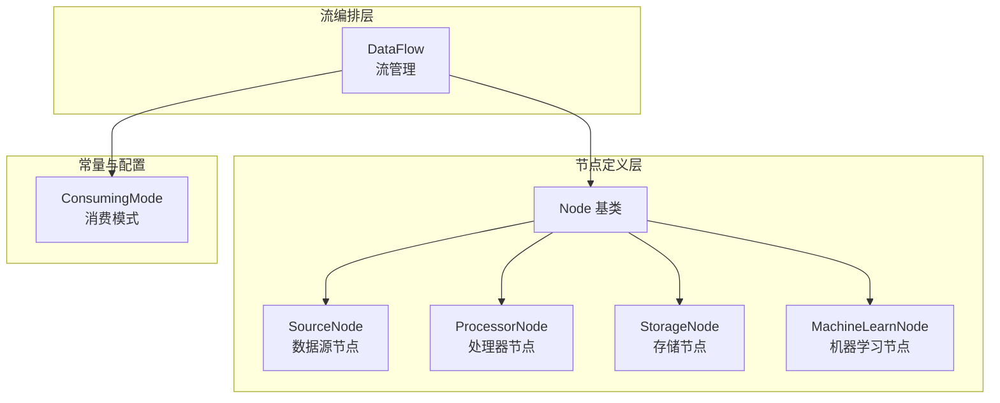
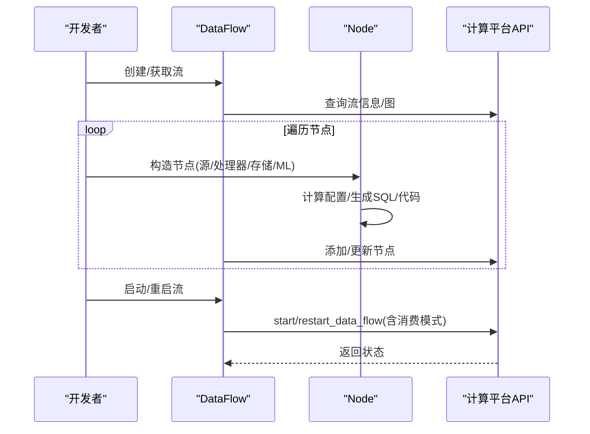
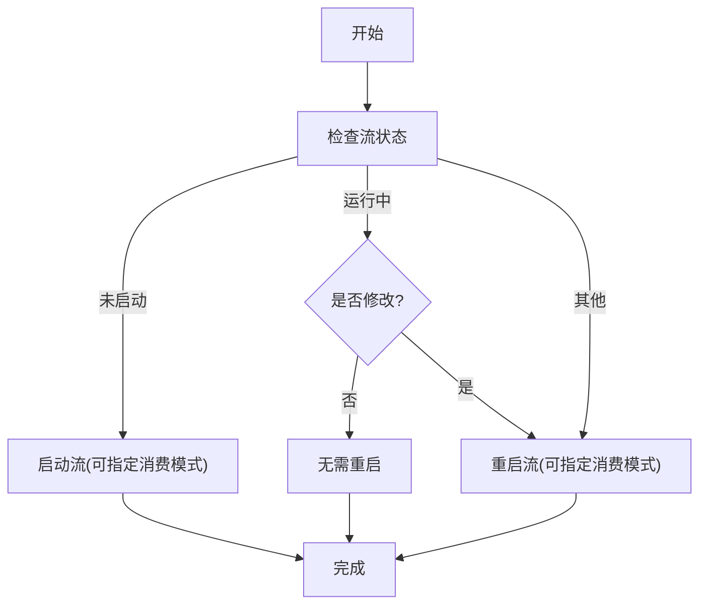
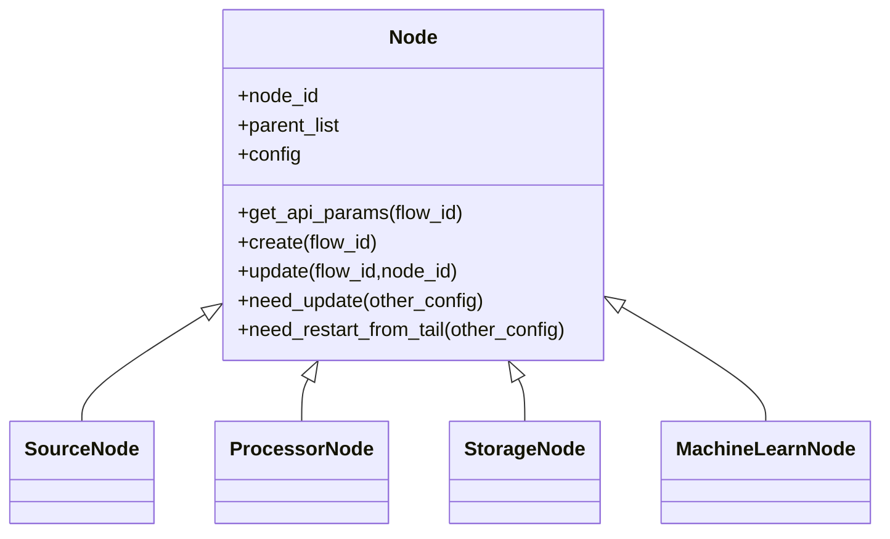
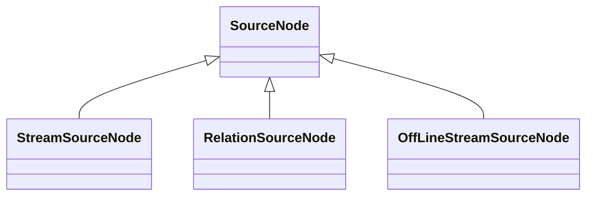
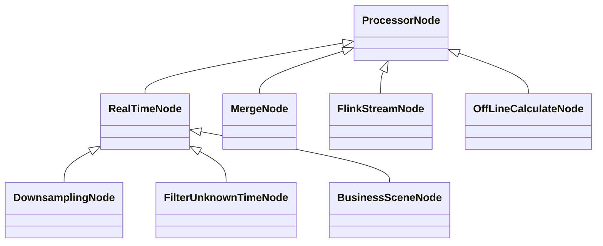
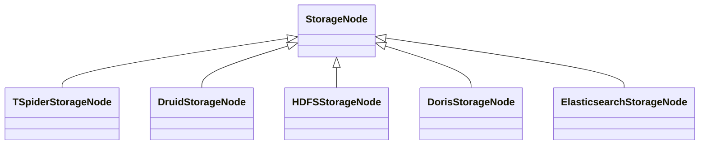
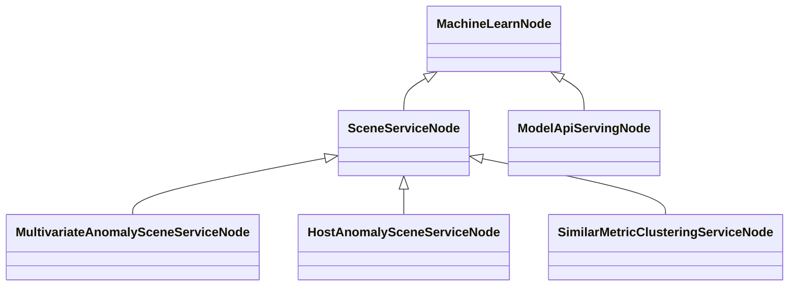
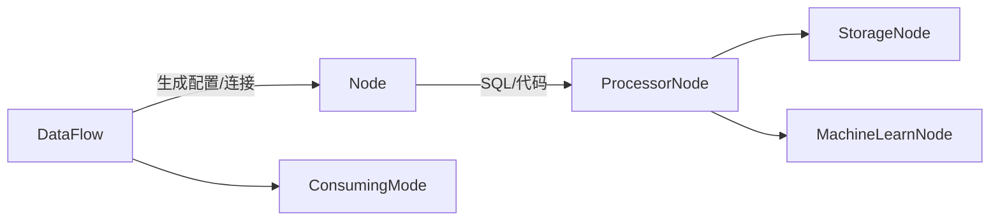

# 数据处理管道

<cite>
**本文引用的文件**
- [flow.py](file://bkmonitor/bkmonitor/dataflow/flow.py)
- [base.py](file://bkmonitor/bkmonitor/dataflow/node/base.py)
- [source.py](file://bkmonitor/bkmonitor/dataflow/node/source.py)
- [processor.py](file://bkmonitor/bkmonitor/dataflow/node/processor.py)
- [storage.py](file://bkmonitor/bkmonitor/dataflow/node/storage.py)
- [machine_learning.py](file://bkmonitor/bkmonitor/dataflow/node/machine_learning.py)
- [dataflow.py](file://bkmonitor/constants/dataflow.py)
</cite>

## 目录
1. [简介](#简介)
2. [项目结构](#项目结构)
3. [核心组件](#核心组件)
4. [架构总览](#架构总览)
5. [组件详解](#组件详解)
6. [依赖关系分析](#依赖关系分析)
7. [性能考量](#性能考量)
8. [故障排查指南](#故障排查指南)
9. [结论](#结论)
10. [附录](#附录)

## 简介
本文件面向“数据处理管道”的设计与实现，围绕从采集到存储的完整流程，系统阐述数据清洗、转换、聚合与过滤等步骤；解释数据流图的设计原理、节点类型与连接方式；覆盖批处理与实时处理的实现机制、并发控制与错误恢复策略；并提供配置方法、性能优化技巧、处理示例与调试指南，帮助读者快速理解与落地。

## 项目结构
数据处理管道主要由三层构成：
- 流编排层：负责数据流的生命周期管理（创建、启动、停止、重建）与节点增删改查。
- 节点定义层：抽象出通用节点基类，并按职责细分为数据源、处理器（实时/离线/Flink）、存储与机器学习节点。
- 常量与配置层：提供消费模式、偏移策略等常量，以及与外部计算平台交互的参数约定。

**图表来源**
- [flow.py:25-246](file://bkmonitor/bkmonitor/dataflow/flow.py#L25-L246)
- [base.py:28-133](file://bkmonitor/bkmonitor/dataflow/node/base.py#L28-L133)
- [source.py:18-71](file://bkmonitor/bkmonitor/dataflow/node/source.py#L18-L71)
- [processor.py:22-616](file://bkmonitor/bkmonitor/dataflow/node/processor.py#L22-L616)
- [storage.py:18-236](file://bkmonitor/bkmonitor/dataflow/node/storage.py#L18-L236)
- [machine_learning.py:35-496](file://bkmonitor/bkmonitor/dataflow/node/machine_learning.py#L35-L496)
- [dataflow.py:13-21](file://bkmonitor/constants/dataflow.py#L13-L21)

**章节来源**
- [flow.py:25-246](file://bkmonitor/bkmonitor/dataflow/flow.py#L25-L246)
- [base.py:28-133](file://bkmonitor/bkmonitor/dataflow/node/base.py#L28-L133)
- [dataflow.py:13-21](file://bkmonitor/constants/dataflow.py#L13-L21)

## 核心组件
- DataFlow：封装与外部计算平台的数据流交互，提供启动/重启、停止、删除、重建等能力，并维护节点变更标记以决定是否需要重启。
- Node 抽象：统一节点的配置生成、父子连接、相等性比较与更新/创建逻辑。
- SourceNode：数据源节点族，支持流式源、离线批源、Redis键值源等。
- ProcessorNode：处理器节点族，覆盖实时聚合、降采样、过滤未知时间、合并、业务场景、Flink 编程式节点、离线批处理等。
- StorageNode：存储节点族，覆盖 MySQL/TiDB、Druid、HDFS、Doris、Elasticsearch 等。
- MachineLearnNode：机器学习节点族，对接场景服务与模型推理节点。
- ConsumingMode：消费模式常量，控制从头部/尾部/当前位置消费。

**章节来源**
- [flow.py:25-246](file://bkmonitor/bkmonitor/dataflow/flow.py#L25-L246)
- [base.py:28-133](file://bkmonitor/bkmonitor/dataflow/node/base.py#L28-L133)
- [source.py:18-71](file://bkmonitor/bkmonitor/dataflow/node/source.py#L18-L71)
- [processor.py:22-616](file://bkmonitor/bkmonitor/dataflow/node/processor.py#L22-L616)
- [storage.py:18-236](file://bkmonitor/bkmonitor/dataflow/node/storage.py#L18-L236)
- [machine_learning.py:35-496](file://bkmonitor/bkmonitor/dataflow/node/machine_learning.py#L35-L496)
- [dataflow.py:13-21](file://bkmonitor/constants/dataflow.py#L13-L21)

## 架构总览
数据处理管道采用“流编排 + 节点组合”的架构。DataFlow 负责与计算平台交互，Node 家族负责表达数据处理逻辑，节点之间通过 from_links 建立上下游连接，形成 DAG。节点配置中包含 SQL 或编程代码、窗口/调度/输出等专用配置，最终由计算平台执行。

**图表来源**
- [flow.py:84-181](file://bkmonitor/bkmonitor/dataflow/flow.py#L84-L181)
- [base.py:95-133](file://bkmonitor/bkmonitor/dataflow/node/base.py#L95-L133)
- [processor.py:116-134](file://bkmonitor/bkmonitor/dataflow/node/processor.py#L116-L134)
- [storage.py:61-91](file://bkmonitor/bkmonitor/dataflow/node/storage.py#L61-L91)

## 组件详解

### DataFlow 流管理
- 生命周期管理：提供 start/restart/stop/delete/rebuild 等方法；根据当前状态与部署信息决定启动或重启行为。
- 消费模式：支持从头部、尾部或当前位置继续消费，结合“最近一次部署信息”与“是否已修改”判断重启策略。
- 节点增删改：遍历现有图节点，若配置一致则复用，否则创建或更新；记录是否需要从尾重启（如 SQL 变更）。

**图表来源**
- [flow.py:139-181](file://bkmonitor/bkmonitor/dataflow/flow.py#L139-L181)

**章节来源**
- [flow.py:25-246](file://bkmonitor/bkmonitor/dataflow/flow.py#L25-L246)
- [dataflow.py:13-21](file://bkmonitor/constants/dataflow.py#L13-L21)

### Node 抽象与节点连接
- 统一配置生成：get_api_params 会根据父节点列表生成 from_links，确保节点在图中的连接顺序。
- 相等性与更新：__eq__ 用于判断存量配置差异，need_update 决定是否需要更新节点；need_restart_from_tail 基于 SQL 变化判断是否需从尾重启。
- 创建/更新：create/update 方法调用计算平台 API 完成节点持久化。

**图表来源**
- [base.py:28-133](file://bkmonitor/bkmonitor/dataflow/node/base.py#L28-L133)

**章节来源**
- [base.py:28-133](file://bkmonitor/bkmonitor/dataflow/node/base.py#L28-L133)

### 数据源节点（SourceNode）
- StreamSourceNode：从结果表（实时/离线）作为数据源，输出表名为源表 ID。
- RelationSourceNode：Redis 键值关联数据源。
- OffLineStreamSourceNode：离线批处理数据源。

**图表来源**
- [source.py:18-71](file://bkmonitor/bkmonitor/dataflow/node/source.py#L18-L71)

**章节来源**
- [source.py:18-71](file://bkmonitor/bkmonitor/dataflow/node/source.py#L18-L71)

### 处理器节点（ProcessorNode）
- 实时节点 RealTimeNode：支持滚动窗口、等待时间、统计 SQL 生成；输出表名自动拼接业务 ID。
- 降采样 DownsamplingNode：按聚合方法与维度生成 SQL。
- 过滤未知时间 FilterUnknownTimeNode：过滤未来/过期时间范围内的数据。
- 合并 MergeNode：多输入合并为单一结果表。
- 业务场景 BusinessSceneNode：面向业务场景的计划表输出。
- FlinkStreamNode：基于 Flink 的编程节点，支持用户代码与输出字段定义。
- 离线批处理 OffLineCalculateNode：批处理节点，支持调度与窗口配置。

**图表来源**
- [processor.py:22-616](file://bkmonitor/bkmonitor/dataflow/node/processor.py#L22-L616)

**章节来源**
- [processor.py:22-616](file://bkmonitor/bkmonitor/dataflow/node/processor.py#L22-L616)

### 存储节点（StorageNode）
- TSpiderStorageNode：MySQL/TiDB 存储。
- DruidStorageNode：Druid 存储。
- HDFSStorageNode：HDFS 存储。
- DorisStorageNode：Doris 存储，支持字段与过期策略配置。
- ElasticsearchStorageNode：ES 存储，支持分析/Doc Values/JSON/日期字段与副本/唯一键配置。
- 工具函数：根据业务与系统表特征自动选择 Druid 或 TSpider。

**图表来源**
- [storage.py:18-236](file://bkmonitor/bkmonitor/dataflow/node/storage.py#L18-L236)

**章节来源**
- [storage.py:18-236](file://bkmonitor/bkmonitor/dataflow/node/storage.py#L18-L236)

### 机器学习节点（MachineLearnNode）
- SceneServiceNode：对接场景服务，支持分组/映射/变量配置。
- MultivariateAnomalySceneServiceNode：多变量异常检测场景。
- HostAnomalySceneServiceNode：主机异常检测场景。
- SimilarMetricClusteringServiceNode：相似指标聚类场景（离线）。
- ModelApiServingNode：模型推理节点，动态拉取模型配置并注入输入/输出。

**图表来源**
- [machine_learning.py:35-496](file://bkmonitor/bkmonitor/dataflow/node/machine_learning.py#L35-L496)

**章节来源**
- [machine_learning.py:35-496](file://bkmonitor/bkmonitor/dataflow/node/machine_learning.py#L35-L496)

## 依赖关系分析
- DataFlow 依赖 Node 家族生成配置并通过计算平台 API 管理节点；节点间通过 from_links 建立连接。
- 处理器节点内部通过 SQL 或 Flink 代码实现清洗、转换、聚合与过滤；存储节点负责将结果写入不同后端。
- 机器学习节点依赖场景服务与模型发布版本，动态生成输入映射与输出配置。

**图表来源**
- [flow.py:95-201](file://bkmonitor/bkmonitor/dataflow/flow.py#L95-L201)
- [base.py:95-133](file://bkmonitor/bkmonitor/dataflow/node/base.py#L95-L133)
- [processor.py:116-134](file://bkmonitor/bkmonitor/dataflow/node/processor.py#L116-L134)
- [storage.py:61-91](file://bkmonitor/bkmonitor/dataflow/node/storage.py#L61-L91)
- [machine_learning.py:123-185](file://bkmonitor/bkmonitor/dataflow/node/machine_learning.py#L123-L185)
- [dataflow.py:13-21](file://bkmonitor/constants/dataflow.py#L13-L21)

**章节来源**
- [flow.py:95-201](file://bkmonitor/bkmonitor/dataflow/flow.py#L95-L201)
- [base.py:95-133](file://bkmonitor/bkmonitor/dataflow/node/base.py#L95-L133)
- [processor.py:116-134](file://bkmonitor/bkmonitor/dataflow/node/processor.py#L116-L134)
- [storage.py:61-91](file://bkmonitor/bkmonitor/dataflow/node/storage.py#L61-L91)
- [machine_learning.py:123-185](file://bkmonitor/bkmonitor/dataflow/node/machine_learning.py#L123-L185)
- [dataflow.py:13-21](file://bkmonitor/constants/dataflow.py#L13-L21)

## 性能考量
- 实时窗口与等待时间：实时节点在配置中设置滚动窗口与等待时间，缓解数据延迟导致的不一致。
- 降采样与聚合：通过降采样节点减少后续存储与查询压力；合理设置聚合维度与方法。
- 存储后端选择：系统表优先使用 Druid，普通表使用 TSpider，必要时可选择 HDFS/Doris/ES，依据查询/写入特性权衡。
- SQL 优化：避免不必要的列扫描与复杂 JOIN；在过滤阶段尽早裁剪数据。
- 并发与资源：批处理节点与 Flink 节点可通过调度周期与资源配置控制并发度；ML 推理节点可配置服务资源。
- 重启策略：当 SQL 或字段结构变化时，选择从尾重启以保证历史数据兼容。

**章节来源**
- [processor.py:126-134](file://bkmonitor/bkmonitor/dataflow/node/processor.py#L126-L134)
- [processor.py:155-165](file://bkmonitor/bkmonitor/dataflow/node/processor.py#L155-L165)
- [storage.py:222-236](file://bkmonitor/bkmonitor/dataflow/node/storage.py#L222-L236)
- [flow.py:82-90](file://bkmonitor/bkmonitor/dataflow/flow.py#L82-L90)

## 故障排查指南
- 启动失败：捕获启动异常并抛出明确错误，记录流 ID/名称与异常信息，便于定位。
- 节点创建/更新失败：记录失败节点名称与异常，区分创建与更新两类错误。
- 节点未生效：确认节点配置是否发生变化（need_update），必要时触发重启；若 SQL 变更，考虑从尾重启。
- 存储异常：核对存储集群名称、过期天数与字段配置；ES 物理表名在自托管模式下需特殊处理。
- ML 节点问题：检查场景服务计划版本、输入映射与变量配置；模型发布版本变更后需重新生成配置。

**章节来源**
- [flow.py:161-163](file://bkmonitor/bkmonitor/dataflow/flow.py#L161-L163)
- [base.py:113-132](file://bkmonitor/bkmonitor/dataflow/node/base.py#L113-L132)
- [base.py:113-122](file://bkmonitor/bkmonitor/dataflow/node/base.py#L113-L122)
- [storage.py:196-219](file://bkmonitor/bkmonitor/dataflow/node/storage.py#L196-L219)
- [machine_learning.py:404-406](file://bkmonitor/bkmonitor/dataflow/node/machine_learning.py#L404-L406)

## 结论
该数据处理管道以 DataFlow 为核心编排，通过 Node 家族清晰划分数据采集、清洗、转换、聚合、过滤与存储等环节，并提供批处理与实时处理能力。借助消费模式、SQL/Flink 编程与多存储后端，可在不同场景下灵活组合；同时通过节点变更检测与从尾重启策略保障稳定性与一致性。

## 附录

### 数据流图设计要点
- 节点类型与职责分离：源/处理器/存储/ML 各司其职，避免在一个节点内混杂多种职责。
- 连接方式：使用 from_links 明确上游节点 ID 与箭头方向，确保 DAG 有序执行。
- 输出命名：统一以“业务 ID_表名”命名输出表，便于跨域检索与权限控制。

**章节来源**
- [base.py:95-111](file://bkmonitor/bkmonitor/dataflow/node/base.py#L95-L111)
- [processor.py:116-134](file://bkmonitor/bkmonitor/dataflow/node/processor.py#L116-L134)
- [storage.py:61-91](file://bkmonitor/bkmonitor/dataflow/node/storage.py#L61-L91)

### 批处理与实时处理实现机制
- 实时处理：通过滚动窗口与等待时间实现近实时聚合；SQL 生成器支持常见聚合方法与维度分组。
- 离线批处理：OffLineCalculateNode 提供调度周期与窗口配置，适合日/周级聚合与重算。
- Flink 编程：FlinkStreamNode 支持用户代码与输出字段定义，满足复杂流式逻辑。

**章节来源**
- [processor.py:126-134](file://bkmonitor/bkmonitor/dataflow/node/processor.py#L126-L134)
- [processor.py:478-520](file://bkmonitor/bkmonitor/dataflow/node/processor.py#L478-L520)
- [processor.py:545-598](file://bkmonitor/bkmonitor/dataflow/node/processor.py#L545-L598)

### 并发控制与错误恢复策略
- 并发控制：批处理与 Flink 节点通过调度周期与资源配置控制并发；ML 推理节点可配置服务资源。
- 错误恢复：启动失败抛出明确异常；节点更新失败记录失败原因；SQL 变更触发从尾重启以规避历史数据不兼容。

**章节来源**
- [flow.py:161-163](file://bkmonitor/bkmonitor/dataflow/flow.py#L161-L163)
- [base.py:113-132](file://bkmonitor/bkmonitor/dataflow/node/base.py#L113-L132)
- [flow.py:82-90](file://bkmonitor/bkmonitor/dataflow/flow.py#L82-L90)

### 配置方法与示例路径
- 创建流：通过 ensure_data_flow_exists 或 create_flow 获取/创建流。
- 添加节点：构造节点实例，调用 DataFlow.add_node 完成创建或更新。
- 启动流：start/start_or_restart_flow，传入消费模式（头部/尾部/当前位置）。
- 示例路径参考：
  - [创建/获取流:119-138](file://bkmonitor/bkmonitor/dataflow/flow.py#L119-L138)
  - [添加节点:185-202](file://bkmonitor/bkmonitor/dataflow/flow.py#L185-L202)
  - [启动/重启:139-181](file://bkmonitor/bkmonitor/dataflow/flow.py#L139-L181)
  - [实时节点配置:116-134](file://bkmonitor/bkmonitor/dataflow/node/processor.py#L116-L134)
  - [存储节点配置:61-91](file://bkmonitor/bkmonitor/dataflow/node/storage.py#L61-L91)
  - [机器学习节点配置:123-185](file://bkmonitor/bkmonitor/dataflow/node/machine_learning.py#L123-L185)

**章节来源**
- [flow.py:119-181](file://bkmonitor/bkmonitor/dataflow/flow.py#L119-L181)
- [processor.py:116-134](file://bkmonitor/bkmonitor/dataflow/node/processor.py#L116-L134)
- [storage.py:61-91](file://bkmonitor/bkmonitor/dataflow/node/storage.py#L61-L91)
- [machine_learning.py:123-185](file://bkmonitor/bkmonitor/dataflow/node/machine_learning.py#L123-L185)