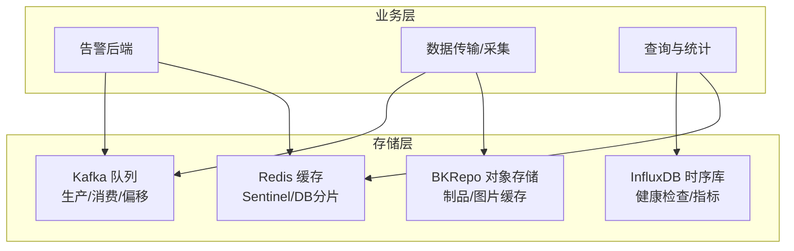
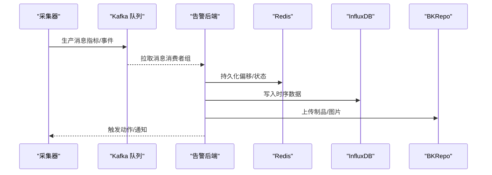
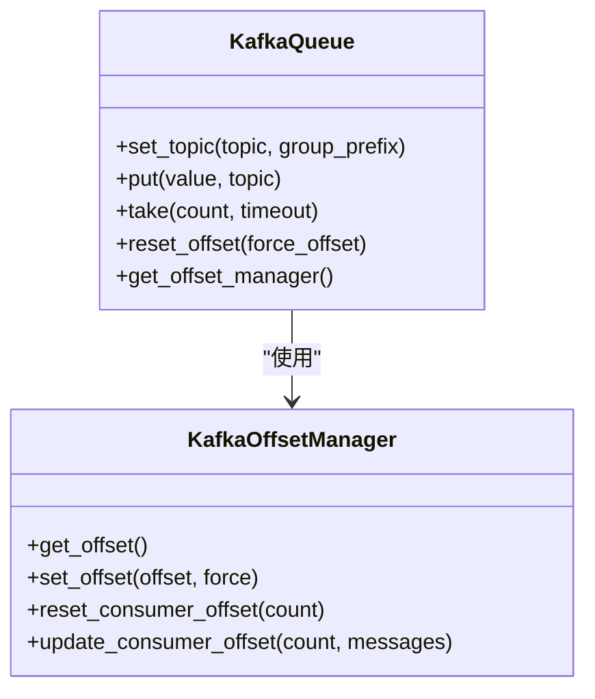
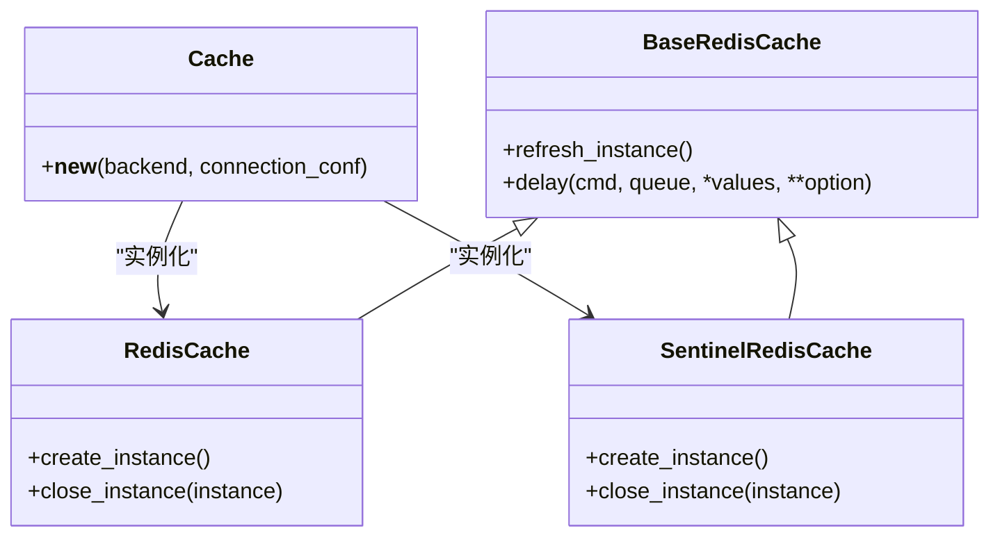
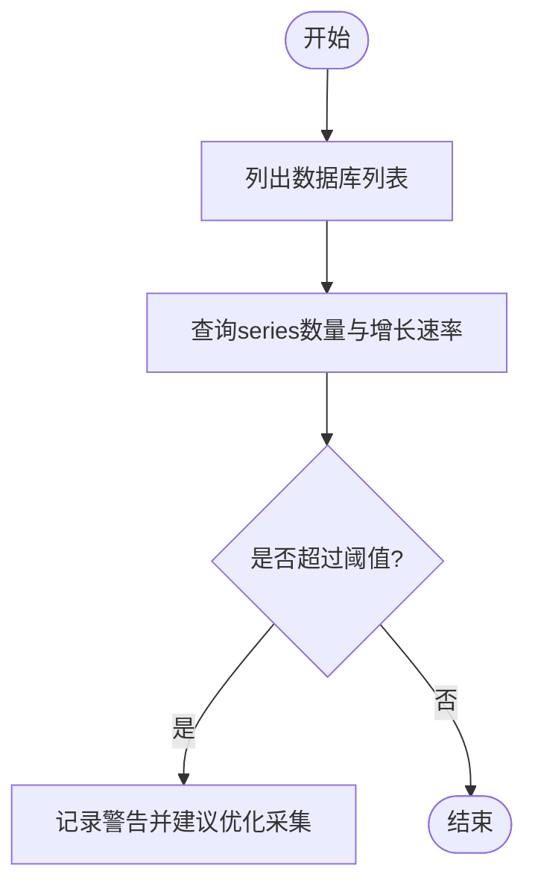
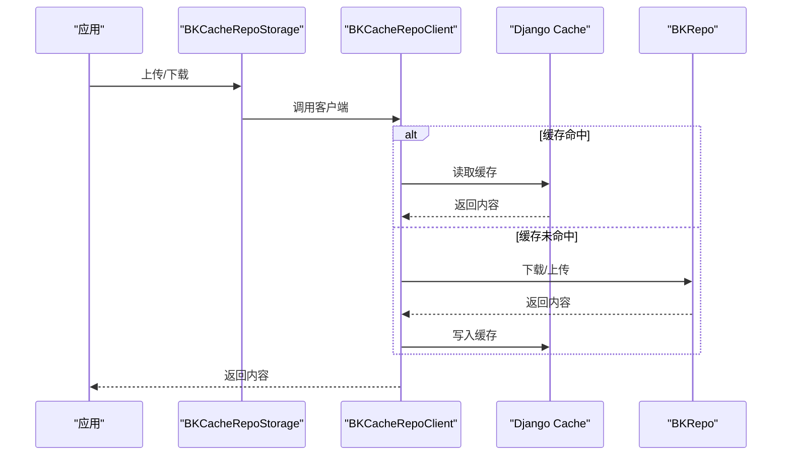
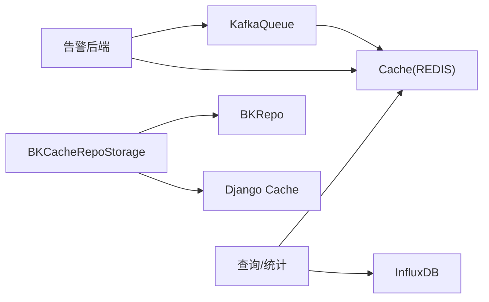

# 数据存储设计

<cite>
**本文引用的文件**
- [redis.py](file://bkmonitor/alarm_backends/core/storage/redis.py)
- [kafka.py](file://bkmonitor/alarm_backends/core/storage/kafka.py)
- [kafka_v2.py](file://bkmonitor/alarm_backends/core/storage/kafka_v2.py)
- [influxdb_story.py](file://bkmonitor/alarm_backends/management/story/influxdb_story.py)
- [storage.py](file://bkmonitor/bkmonitor/commons/storage.py)
- [web.py](file://bkmonitor/config/role/web.py)
- [function_story.py](file://bkmonitor/alarm_backends/management/story/function_story.py)
- [kernel_story.py](file://bkmonitor/alarm_backends/management/story/kernel_story.py)
</cite>

## 目录
1. [简介](#简介)
2. [项目结构](#项目结构)
3. [核心组件](#核心组件)
4. [架构总览](#架构总览)
5. [详细组件分析](#详细组件分析)
6. [依赖分析](#依赖分析)
7. [性能考虑](#性能考虑)
8. [故障排查指南](#故障排查指南)
9. [结论](#结论)
10. [附录](#附录)

## 简介
本文件聚焦于监控数据的存储设计，系统采用多存储引擎协同策略：时序数据库（InfluxDB）、消息队列（Kafka）、缓存（Redis）以及对象存储（BKRepo）。本文从架构、组件、数据流、分区与压缩策略、备份与恢复、性能优化与容量规划等方面进行系统化梳理，帮助读者理解各存储引擎的职责边界、配置要点与最佳实践。

## 项目结构
围绕数据存储的关键目录与文件如下：
- 消息队列与偏移管理：alarm_backends/core/storage/kafka*.py
- 缓存与集群：alarm_backends/core/storage/redis*.py
- 时序数据库健康检查：alarm_backends/management/story/influxdb_story.py
- 对象存储封装：bkmonitor/bkmonitor/commons/storage.py
- 压缩配置示例：config/role/web.py
- Kafka分区与积压检查：alarm_backends/management/story/*function_story*.py、kernel_story.py

图表来源
- [kafka.py:26-176](file://bkmonitor/alarm_backends/core/storage/kafka.py#L26-L176)
- [redis.py:98-326](file://bkmonitor/alarm_backends/core/storage/redis.py#L98-L326)
- [influxdb_story.py:24-120](file://bkmonitor/alarm_backends/management/story/influxdb_story.py#L24-L120)
- [storage.py:18-71](file://bkmonitor/bkmonitor/commons/storage.py#L18-L71)

章节来源
- [kafka.py:1-262](file://bkmonitor/alarm_backends/core/storage/kafka.py#L1-L262)
- [redis.py:1-326](file://bkmonitor/alarm_backends/core/storage/redis.py#L1-L326)
- [influxdb_story.py:1-120](file://bkmonitor/alarm_backends/management/story/influxdb_story.py#L1-L120)
- [storage.py:1-71](file://bkmonitor/bkmonitor/commons/storage.py#L1-L71)

## 核心组件
- Kafka 队列：负责告警与采集数据的高吞吐缓冲与解耦，支持消费者组、偏移持久化与重放。
- Redis 缓存：提供多DB分片、Sentinel高可用、延迟队列与任务调度；支撑配置缓存、队列元数据与临时状态。
- InfluxDB：承载时序指标与自采数据，提供健康检查与趋势分析。
- 对象存储（BKRepo）：提供制品与静态资源的统一存储与缓存加速。

章节来源
- [kafka.py:26-176](file://bkmonitor/alarm_backends/core/storage/kafka.py#L26-L176)
- [redis.py:33-40](file://bkmonitor/alarm_backends/core/storage/redis.py#L33-L40)
- [influxdb_story.py:42-120](file://bkmonitor/alarm_backends/management/story/influxdb_story.py#L42-L120)
- [storage.py:18-71](file://bkmonitor/bkmonitor/commons/storage.py#L18-L71)

## 架构总览
系统通过Kafka实现采集与告警数据的异步汇聚，Redis用于偏移与状态持久化，InfluxDB承载时序数据，对象存储用于制品与静态资源。整体流程如下：

图表来源
- [kafka.py:139-176](file://bkmonitor/alarm_backends/core/storage/kafka.py#L139-L176)
- [redis.py:197-221](file://bkmonitor/alarm_backends/core/storage/redis.py#L197-L221)
- [influxdb_story.py:73-120](file://bkmonitor/alarm_backends/management/story/influxdb_story.py#L73-L120)
- [storage.py:18-71](file://bkmonitor/bkmonitor/commons/storage.py#L18-L71)

## 详细组件分析

### Kafka 组件分析
- 生产与消费
  - 支持批量发送与自动重连；消费者组自动提交与偏移管理。
  - 提供偏移管理器，将消费位点持久化到Redis，保障重启后可继续消费。
- 分区与积压
  - 通过分区分配策略与尾部/头部定位，结合端点偏移计算，识别积压风险。
- 重放与回放
  - 支持重置偏移到指定位置，便于问题排查与数据修复。

图表来源
- [kafka.py:26-176](file://bkmonitor/alarm_backends/core/storage/kafka.py#L26-L176)
- [kafka_v2.py:70-130](file://bkmonitor/alarm_backends/core/storage/kafka_v2.py#L70-L130)

章节来源
- [kafka.py:26-176](file://bkmonitor/alarm_backends/core/storage/kafka.py#L26-L176)
- [kafka_v2.py:70-130](file://bkmonitor/alarm_backends/core/storage/kafka_v2.py#L70-L130)
- [function_story.py:97-112](file://bkmonitor/alarm_backends/management/story/function_story.py#L97-L112)
- [kernel_story.py:101-145](file://bkmonitor/alarm_backends/management/story/kernel_story.py#L101-L145)

### Redis 组件分析
- DB分片策略
  - DB7（日志）、DB8（配置缓存）、DB9（队列/CELERY）、DB10（服务数据），明确隔离不同业务域。
- 集群与高可用
  - 支持Sentinel主从切换与随机哨兵节点选择，提升可用性。
- 延迟队列
  - 通过有序集合与Hash存储任务，实现延时投递与重试。

图表来源
- [redis.py:98-326](file://bkmonitor/alarm_backends/core/storage/redis.py#L98-L326)

章节来源
- [redis.py:33-40](file://bkmonitor/alarm_backends/core/storage/redis.py#L33-L40)
- [redis.py:245-291](file://bkmonitor/alarm_backends/core/storage/redis.py#L245-L291)
- [redis.py:197-221](file://bkmonitor/alarm_backends/core/storage/redis.py#L197-L221)

### InfluxDB 组件分析
- 健康检查
  - 通过内部数据库查询series数量与增长速率，识别异常增长趋势。
- 连接池与客户端
  - 基于Consul配置动态获取连接参数，统一客户端池化管理。

图表来源
- [influxdb_story.py:73-120](file://bkmonitor/alarm_backends/management/story/influxdb_story.py#L73-L120)

章节来源
- [influxdb_story.py:42-120](file://bkmonitor/alarm_backends/management/story/influxdb_story.py#L42-L120)

### 对象存储组件分析
- BKRepo封装
  - 在上传/下载时同步写入Django Cache，减少重复IO，提升访问性能。
- 默认存储选择
  - 可按配置启用Ceph/BKRepo作为默认存储后端。

图表来源
- [storage.py:18-71](file://bkmonitor/bkmonitor/commons/storage.py#L18-L71)

章节来源
- [storage.py:18-71](file://bkmonitor/bkmonitor/commons/storage.py#L18-L71)

## 依赖分析
- 组件耦合
  - Kafka偏移管理依赖Redis；告警后端依赖Kafka与Redis；查询侧依赖InfluxDB与Redis；对象存储依赖BKRepo与Django Cache。
- 外部依赖
  - Kafka客户端、Redis/Sentinel、InfluxDB客户端池、BKRepo SDK。

图表来源
- [kafka.py:178-262](file://bkmonitor/alarm_backends/core/storage/kafka.py#L178-L262)
- [redis.py:293-326](file://bkmonitor/alarm_backends/core/storage/redis.py#L293-L326)
- [influxdb_story.py:116-120](file://bkmonitor/alarm_backends/management/story/influxdb_story.py#L116-L120)
- [storage.py:52-71](file://bkmonitor/bkmonitor/commons/storage.py#L52-L71)

章节来源
- [kafka.py:178-262](file://bkmonitor/alarm_backends/core/storage/kafka.py#L178-L262)
- [redis.py:293-326](file://bkmonitor/alarm_backends/core/storage/redis.py#L293-L326)
- [influxdb_story.py:116-120](file://bkmonitor/alarm_backends/management/story/influxdb_story.py#L116-L120)
- [storage.py:52-71](file://bkmonitor/bkmonitor/commons/storage.py#L52-L71)

## 性能考虑
- Kafka
  - 批量发送与分区拉取大小调优，避免频繁小包；合理设置消费者组与分区数，防止积压。
  - 使用偏移持久化与尾部定位，降低重启后的追赶成本。
- Redis
  - DB分片隔离不同业务域，避免热点集中；Sentinel提升可用性；延迟队列避免瞬时高峰。
  - 压缩配置可参考Web角色的zlib压缩器设置，降低网络与存储开销。
- InfluxDB
  - 定期监控series增长速率，及时优化采集粒度与保留策略。
- 对象存储
  - 通过Django Cache缓存热点文件，减少重复下载与带宽消耗。

章节来源
- [kafka_v2.py:77-104](file://bkmonitor/alarm_backends/core/storage/kafka_v2.py#L77-L104)
- [web.py:240-240](file://bkmonitor/config/role/web.py#L240-L240)
- [influxdb_story.py:47-71](file://bkmonitor/alarm_backends/management/story/influxdb_story.py#L47-L71)
- [storage.py:18-71](file://bkmonitor/bkmonitor/commons/storage.py#L18-L71)

## 故障排查指南
- Kafka积压
  - 通过端点偏移与已提交偏移差值判断积压；必要时调整消费者并发或分区数。
- 偏移异常
  - 检查Redis中的偏移键是否存在与正确性；必要时手动重置偏移。
- InfluxDB异常
  - 关注series增长速率与数据库容量；对异常增长的DB进行采集优化。
- Redis高可用
  - 检查Sentinel主从切换日志与连接参数；确认DB分片与密码配置一致。

章节来源
- [function_story.py:97-112](file://bkmonitor/alarm_backends/management/story/function_story.py#L97-L112)
- [kernel_story.py:101-145](file://bkmonitor/alarm_backends/management/story/kernel_story.py#L101-L145)
- [kafka.py:178-262](file://bkmonitor/alarm_backends/core/storage/kafka.py#L178-L262)
- [influxdb_story.py:47-71](file://bkmonitor/alarm_backends/management/story/influxdb_story.py#L47-L71)
- [redis.py:245-291](file://bkmonitor/alarm_backends/core/storage/redis.py#L245-L291)

## 结论
本系统通过Kafka实现高吞吐异步缓冲，Redis提供高可用与状态持久化，InfluxDB承载时序数据，BKRepo提供对象存储与缓存加速。建议在实际部署中结合业务规模与SLA要求，对分区、压缩、保留策略与缓存命中率进行持续优化，并建立完善的健康检查与故障恢复流程。

## 附录
- 存储引擎对比与适用场景
  - Kafka：高吞吐、低延迟、解耦生产者与消费者。
  - Redis：低延迟、高并发、高可用（Sentinel）、DB分片隔离。
  - InfluxDB：时序数据写入与查询优化、内置保留策略。
  - 对象存储：大文件与静态资源的统一存储与缓存加速。
- 最佳实践
  - Kafka：合理设置批大小与分区数；使用偏移持久化与尾部定位；定期监控积压。
  - Redis：DB分片隔离不同业务域；启用Sentinel；延迟队列避免峰值冲击。
  - InfluxDB：监控series增长速率；优化采集粒度与保留策略。
  - 对象存储：热点文件缓存；按需启用Ceph/BKRepo；控制缓存超时。