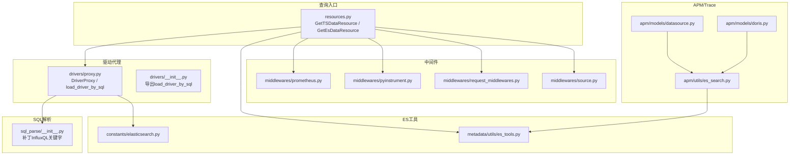
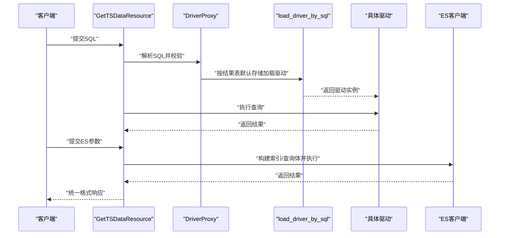
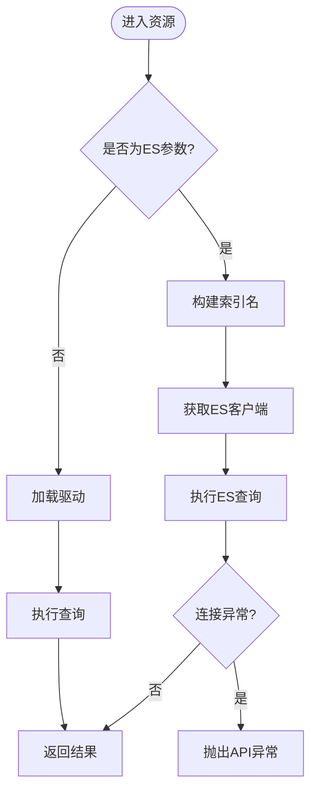
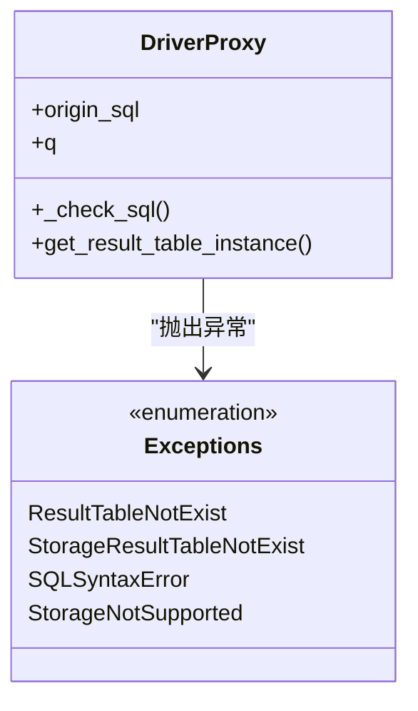
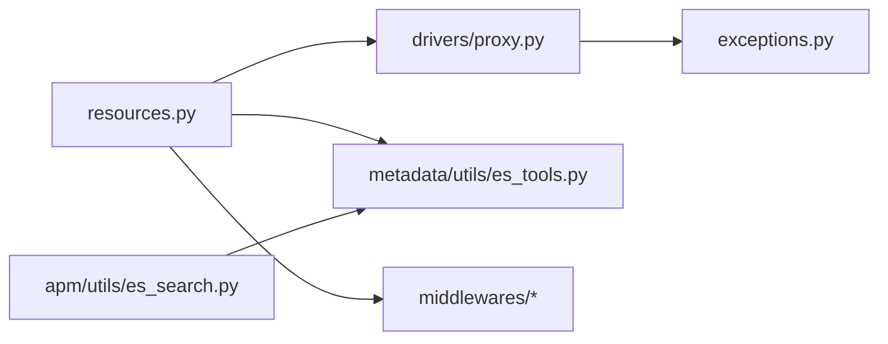

# 数据查询优化

<cite>
**本文引用的文件**
- [bkmonitor/query_api/resources.py](file://bkmonitor/query_api/resources.py)
- [bkmonitor/query_api/drivers/__init__.py](file://bkmonitor/query_api/drivers/__init__.py)
- [bkmonitor/query_api/drivers/proxy.py](file://bkmonitor/query_api/drivers/proxy.py)
- [bkmonitor/query_api/sql_parse/__init__.py](file://bkmonitor/query_api/sql_parse/__init__.py)
- [bkmonitor/query_api/exceptions.py](file://bkmonitor/query_api/exceptions.py)
- [bkmonitor/middlewares/prometheus.py](file://bkmonitor/middlewares/prometheus.py)
- [bkmonitor/middlewares/pyinstrument.py](file://bkmonitor/middlewares/pyinstrument.py)
- [bkmonitor/middlewares/request_middlewares.py](file://bkmonitor/middlewares/request_middlewares.py)
- [bkmonitor/middlewares/source.py](file://bkmonitor/middlewares/source.py)
- [bkmonitor/constants/elasticsearch.py](file://bkmonitor/constants/elasticsearch.py)
- [bkmonitor/metadata/utils/es_tools.py](file://bkmonitor/metadata/utils/es_tools.py)
- [bkmonitor/bk_dataview/views.py](file://bkmonitor/bk_dataview/views.py)
- [bkmonitor/bk_dataview/router.py](file://bkmonitor/bk_dataview/router.py)
- [bkmonitor/apm/utils/es_search.py](file://bkmonitor/apm/utils/es_search.py)
- [bkmonitor/apm/models/datasource.py](file://bkmonitor/apm/models/datasource.py)
- [bkmonitor/apm/models/doris.py](file://bkmonitor/apm/models/doris.py)
- [bkmonitor/apm/core/discover/handlers.py](file://bkmonitor/apm/core/discover/handlers.py)
- [bkmonitor/apm/core/deepflow/handlers.py](file://bkmonitor/apm/core/deepflow/handlers.py)
- [bkmonitor/apm/core/platform_config.py](file://bkmonitor/apm/core/platform_config.py)
- [bkmonitor/apm/core/application_config.py](file://bkmonitor/apm/core/application_config.py)
- [bkmonitor/apm/core/cluster_config.py](file://bkmonitor/apm/core/cluster_config.py)
- [bkmonitor/apm/migrations/...](file://bkmonitor/apm/migrations/...)
- [bkmonitor/apm/tests/...](file://bkmonitor/apm/tests/...)
- [bkmonitor/apm/utils/base.py](file://bkmonitor/apm/utils/base.py)
- [bkmonitor/apm/utils/time.py](file://bkmonitor/apm/utils/time.py)
- [bkmonitor/apm/utils/ui_optimizations.py](file://bkmonitor/apm/utils/ui_optimizations.py)
- [bkmonitor/apm/utils/report_event.py](file://bkmonitor/apm/utils/report_event.py)
- [bkmonitor/apm/views.py](file://bkmonitor/apm/views.py)
- [bkmonitor/apm/urls.py](file://bkmonitor/apm/urls.py)
- [bkmonitor/apm/resources.py](file://bkmonitor/apm/resources.py)
- [bkmonitor/apm/serializers.py](file://bkmonitor/apm/serializers.py)
- [bkmonitor/apm/types.py](file://bkmonitor/apm/types.py)
- [bkmonitor/apm/constants.py](file://bkmonitor/apm/constants.py)
- [bkmonitor/apm/admin.py](file://bkmonitor/apm/admin.py)
- [bkmonitor/apm/apps.py](file://bkmonitor/apm/apps.py)
- [bkmonitor/apm/utils/es_search.py](file://bkmonitor/apm/utils/es_search.py)
- [bkmonitor/apm/utils/base.py](file://bkmonitor/apm/utils/base.py)
- [bkmonitor/apm/utils/time.py](file://bkmonitor/apm/utils/time.py)
- [bkmonitor/apm/utils/ui_optimizations.py](file://bkmonitor/apm/utils/ui_optimizations.py)
- [bkmonitor/apm/utils/report_event.py](file://bkmonitor/apm/utils/report_event.py)
- [bkmonitor/apm/views.py](file://bkmonitor/apm/views.py)
- [bkmonitor/apm/urls.py](file://bkmonitor/apm/urls.py)
- [bkmonitor/apm/resources.py](file://bkmonitor/apm/resources.py)
- [bkmonitor/apm/serializers.py](file://bkmonitor/apm/serializers.py)
- [bkmonitor/apm/types.py](file://bkmonitor/apm/types.py)
- [bkmonitor/apm/constants.py](file://bkmonitor/apm/constants.py)
- [bkmonitor/apm/admin.py](file://bkmonitor/apm/admin.py)
- [bkmonitor/apm/apps.py](file://bkmonitor/apm/apps.py)
</cite>

## 目录
1. [简介](#简介)
2. [项目结构](#项目结构)
3. [核心组件](#核心组件)
4. [架构总览](#架构总览)
5. [详细组件分析](#详细组件分析)
6. [依赖分析](#依赖分析)
7. [性能考虑](#性能考虑)
8. [故障排查指南](#故障排查指南)
9. [结论](#结论)
10. [附录](#附录)

## 简介
本文件聚焦于数据查询优化主题，围绕统一查询接口、SQL解析与执行计划选择、查询模板与参数绑定、结果缓存、索引策略、查询重写以及分布式查询等维度，结合代码库中的实际实现进行系统化梳理。目标是帮助读者理解查询引擎的工作原理，并提供可操作的优化建议与最佳实践。

## 项目结构
查询相关能力主要分布在以下模块：
- 统一查询入口与资源层：bkmonitor/query_api
- SQL解析与关键字补丁：bkmonitor/query_api/sql_parse
- 查询驱动代理与路由：bkmonitor/query_api/drivers
- 中间件与性能观测：bkmonitor/middlewares
- ES工具与常量：bkmonitor/metadata/utils/es_tools 与 bkmonitor/constants/elasticsearch
- APM/Trace场景的ES查询封装：bkmonitor/apm/utils/es_search
- 数据源与存储模型：bkmonitor/apm/models/datasource、bkmonitor/apm/models/doris
- 视图与路由：bkmonitor/bk_dataview

图表来源
- [bkmonitor/query_api/resources.py:1-65](file://bkmonitor/query_api/resources.py#L1-L65)
- [bkmonitor/query_api/sql_parse/__init__.py:1-21](file://bkmonitor/query_api/sql_parse/__init__.py#L1-L21)
- [bkmonitor/query_api/drivers/proxy.py:1-70](file://bkmonitor/query_api/drivers/proxy.py#L1-L70)
- [bkmonitor/query_api/drivers/__init__.py:1-16](file://bkmonitor/query_api/drivers/__init__.py#L1-L16)
- [bkmonitor/middlewares/prometheus.py](file://bkmonitor/middlewares/prometheus.py)
- [bkmonitor/middlewares/pyinstrument.py](file://bkmonitor/middlewares/pyinstrument.py)
- [bkmonitor/middlewares/request_middlewares.py](file://bkmonitor/middlewares/request_middlewares.py)
- [bkmonitor/middlewares/source.py](file://bkmonitor/middlewares/source.py)
- [bkmonitor/metadata/utils/es_tools.py](file://bkmonitor/metadata/utils/es_tools.py)
- [bkmonitor/constants/elasticsearch.py](file://bkmonitor/constants/elasticsearch.py)
- [bkmonitor/apm/utils/es_search.py](file://bkmonitor/apm/utils/es_search.py)
- [bkmonitor/apm/models/datasource.py](file://bkmonitor/apm/models/datasource.py)
- [bkmonitor/apm/models/doris.py](file://bkmonitor/apm/models/doris.py)

章节来源
- [bkmonitor/query_api/resources.py:1-65](file://bkmonitor/query_api/resources.py#L1-L65)
- [bkmonitor/query_api/drivers/proxy.py:1-70](file://bkmonitor/query_api/drivers/proxy.py#L1-L70)
- [bkmonitor/query_api/sql_parse/__init__.py:1-21](file://bkmonitor/query_api/sql_parse/__init__.py#L1-L21)
- [bkmonitor/middlewares/prometheus.py](file://bkmonitor/middlewares/prometheus.py)
- [bkmonitor/middlewares/pyinstrument.py](file://bkmonitor/middlewares/pyinstrument.py)
- [bkmonitor/middlewares/request_middlewares.py](file://bkmonitor/middlewares/request_middlewares.py)
- [bkmonitor/middlewares/source.py](file://bkmonitor/middlewares/source.py)
- [bkmonitor/metadata/utils/es_tools.py](file://bkmonitor/metadata/utils/es_tools.py)
- [bkmonitor/constants/elasticsearch.py](file://bkmonitor/constants/elasticsearch.py)
- [bkmonitor/apm/utils/es_search.py](file://bkmonitor/apm/utils/es_search.py)
- [bkmonitor/apm/models/datasource.py](file://bkmonitor/apm/models/datasource.py)
- [bkmonitor/apm/models/doris.py](file://bkmonitor/apm/models/doris.py)

## 核心组件
- 统一查询资源
  - GetTSDataResource：接收SQL，通过驱动加载器选择具体存储驱动执行查询。
  - GetEsDataResource：接收索引名、查询体与数据源信息，直接调用ES客户端执行查询。
- SQL解析与关键字补丁
  - 对InfluxQL扩展SLIMIT/SOFFSET关键字的支持，确保解析兼容性。
- 驱动代理与路由
  - DriverProxy：解析SQL，校验SELECT字段，解析结果表元信息，按默认存储类型动态加载对应驱动。
  - load_driver_by_sql：根据结果表默认存储类型导入驱动模块并返回驱动实例。
- 异常体系
  - 结果表不存在、存储未配置、SQL语法错误、存储不支持等，便于定位问题与分级处理。
- 中间件与性能观测
  - Prometheus中间件：采集Prometheus指标，便于查询性能监控。
  - PyInstrument中间件：用于性能剖析，辅助慢查询定位。
  - 请求中间件与来源中间件：统一请求处理与来源识别。
- ES工具与常量
  - 通过数据源信息获取ES客户端，提供连接与查询封装。
  - ES常量定义，统一索引命名、分片与副本等策略常量。
- APM/Trace场景的ES查询封装
  - 提供Trace/日志等场景的ES查询工具，复用统一的ES客户端与参数构造。

章节来源
- [bkmonitor/query_api/resources.py:22-65](file://bkmonitor/query_api/resources.py#L22-L65)
- [bkmonitor/query_api/sql_parse/__init__.py:13-21](file://bkmonitor/query_api/sql_parse/__init__.py#L13-L21)
- [bkmonitor/query_api/drivers/proxy.py:37-70](file://bkmonitor/query_api/drivers/proxy.py#L37-L70)
- [bkmonitor/query_api/drivers/__init__.py:13-16](file://bkmonitor/query_api/drivers/__init__.py#L13-L16)
- [bkmonitor/query_api/exceptions.py:16-66](file://bkmonitor/query_api/exceptions.py#L16-L66)
- [bkmonitor/middlewares/prometheus.py](file://bkmonitor/middlewares/prometheus.py)
- [bkmonitor/middlewares/pyinstrument.py](file://bkmonitor/middlewares/pyinstrument.py)
- [bkmonitor/middlewares/request_middlewares.py](file://bkmonitor/middlewares/request_middlewares.py)
- [bkmonitor/middlewares/source.py](file://bkmonitor/middlewares/source.py)
- [bkmonitor/metadata/utils/es_tools.py](file://bkmonitor/metadata/utils/es_tools.py)
- [bkmonitor/constants/elasticsearch.py](file://bkmonitor/constants/elasticsearch.py)
- [bkmonitor/apm/utils/es_search.py](file://bkmonitor/apm/utils/es_search.py)

## 架构总览
统一查询入口根据SQL或ES参数选择不同执行路径：前者经由SQL解析与驱动代理，后者直接走ES客户端。两者均通过中间件进行性能与来源追踪。

图表来源
- [bkmonitor/query_api/resources.py:22-65](file://bkmonitor/query_api/resources.py#L22-L65)
- [bkmonitor/query_api/drivers/proxy.py:37-70](file://bkmonitor/query_api/drivers/proxy.py#L37-L70)
- [bkmonitor/query_api/drivers/__init__.py:13-16](file://bkmonitor/query_api/drivers/__init__.py#L13-L16)
- [bkmonitor/metadata/utils/es_tools.py](file://bkmonitor/metadata/utils/es_tools.py)

## 详细组件分析

### 组件A：统一查询资源（GetTSDataResource / GetEsDataResource）
- GetTSDataResource
  - 输入：SQL字符串
  - 处理：通过驱动加载器按SQL推断存储类型，交由对应驱动执行
  - 输出：查询结果
- GetEsDataResource
  - 输入：索引名/索引列表、文档类型、查询体、数据源信息
  - 处理：根据索引列表或通配规则拼接索引，获取ES客户端并执行查询；捕获连接异常并转换为API异常
  - 输出：ES查询结果

图表来源
- [bkmonitor/query_api/resources.py:22-65](file://bkmonitor/query_api/resources.py#L22-L65)

章节来源
- [bkmonitor/query_api/resources.py:22-65](file://bkmonitor/query_api/resources.py#L22-L65)

### 组件B：SQL解析与关键字补丁（sql_parse）
- 功能：向解析器注册SLIMIT/SOFFSET关键字，保证InfluxQL方言在解析阶段被正确识别。
- 影响：提升SQL解析稳定性，避免因关键字缺失导致的解析失败。

章节来源
- [bkmonitor/query_api/sql_parse/__init__.py:13-21](file://bkmonitor/query_api/sql_parse/__init__.py#L13-L21)

### 组件C：驱动代理与路由（DriverProxy / load_driver_by_sql）
- DriverProxy
  - 解析SQL，校验SELECT字段非空
  - 从元数据解析结果表ID，查询默认存储类型
  - 动态导入对应驱动模块并返回驱动实例
- load_driver_by_sql
  - 入口函数，串联代理与驱动加载流程

图表来源
- [bkmonitor/query_api/drivers/proxy.py:37-70](file://bkmonitor/query_api/drivers/proxy.py#L37-L70)
- [bkmonitor/query_api/exceptions.py:16-66](file://bkmonitor/query_api/exceptions.py#L16-L66)

章节来源
- [bkmonitor/query_api/drivers/proxy.py:37-70](file://bkmonitor/query_api/drivers/proxy.py#L37-L70)
- [bkmonitor/query_api/exceptions.py:16-66](file://bkmonitor/query_api/exceptions.py#L16-L66)

### 组件D：ES查询封装与工具（es_tools / es_search / elasticsearch常量）
- es_tools
  - 根据数据源信息获取ES客户端，屏蔽底层连接细节
- es_search
  - APM/Trace场景的ES查询封装，统一查询体构造与索引策略
- elasticsearch常量
  - 定义索引命名、分片/副本等策略常量，保障跨模块一致性

章节来源
- [bkmonitor/metadata/utils/es_tools.py](file://bkmonitor/metadata/utils/es_tools.py)
- [bkmonitor/apm/utils/es_search.py](file://bkmonitor/apm/utils/es_search.py)
- [bkmonitor/constants/elasticsearch.py](file://bkmonitor/constants/elasticsearch.py)

### 组件E：中间件与性能观测（prometheus / pyinstrument / request_middlewares / source）
- Prometheus中间件：采集查询耗时、吞吐等指标，便于整体性能监控
- PyInstrument中间件：对慢查询进行CPU火焰图剖析，定位热点
- 请求中间件与来源中间件：统一请求链路与来源识别，便于审计与排障

章节来源
- [bkmonitor/middlewares/prometheus.py](file://bkmonitor/middlewares/prometheus.py)
- [bkmonitor/middlewares/pyinstrument.py](file://bkmonitor/middlewares/pyinstrument.py)
- [bkmonitor/middlewares/request_middlewares.py](file://bkmonitor/middlewares/request_middlewares.py)
- [bkmonitor/middlewares/source.py](file://bkmonitor/middlewares/source.py)

## 依赖分析
- 组件耦合
  - GetTSDataResource依赖DriverProxy与驱动模块，耦合点在于“按结果表默认存储类型动态加载”
  - GetEsDataResource依赖ES工具与数据源信息，耦合点在于“索引名与查询体构造”
- 外部依赖
  - ES客户端：通过数据源信息动态获取
  - SQL解析：依赖sqlparse并进行关键字补丁
- 潜在循环依赖
  - 驱动模块按需导入，避免显式循环依赖
- 接口契约
  - 资源层仅负责输入校验与调用，输出统一格式，降低上层复杂度

图表来源
- [bkmonitor/query_api/resources.py:22-65](file://bkmonitor/query_api/resources.py#L22-L65)
- [bkmonitor/query_api/drivers/proxy.py:37-70](file://bkmonitor/query_api/drivers/proxy.py#L37-L70)
- [bkmonitor/query_api/exceptions.py:16-66](file://bkmonitor/query_api/exceptions.py#L16-L66)
- [bkmonitor/metadata/utils/es_tools.py](file://bkmonitor/metadata/utils/es_tools.py)
- [bkmonitor/apm/utils/es_search.py](file://bkmonitor/apm/utils/es_search.py)

章节来源
- [bkmonitor/query_api/resources.py:22-65](file://bkmonitor/query_api/resources.py#L22-L65)
- [bkmonitor/query_api/drivers/proxy.py:37-70](file://bkmonitor/query_api/drivers/proxy.py#L37-L70)
- [bkmonitor/query_api/exceptions.py:16-66](file://bkmonitor/query_api/exceptions.py#L16-L66)
- [bkmonitor/metadata/utils/es_tools.py](file://bkmonitor/metadata/utils/es_tools.py)
- [bkmonitor/apm/utils/es_search.py](file://bkmonitor/apm/utils/es_search.py)

## 性能考虑
- 查询监控指标
  - 使用Prometheus中间件采集查询耗时、QPS、错误率等指标，建立基线与阈值告警
- 慢查询分析
  - 使用PyInstrument中间件对慢查询进行CPU剖析，定位热点函数与瓶颈
- 索引策略
  - ES层面遵循常量定义的索引命名与分片/副本策略，避免过度分片与冷热不均
- 执行计划优化
  - SQL解析阶段确保SELECT字段合法，减少无效扫描
  - 针对InfluxQL方言增加SLIMIT/SOFFSET关键字，便于限制扫描范围
- 缓存机制
  - 当前资源层未见通用结果缓存实现，建议在业务层引入基于查询键与时间窗口的缓存策略，注意缓存失效与一致性

## 故障排查指南
- 常见异常与定位
  - 结果表不存在：确认结果表ID与命名规范
  - 存储未配置：检查结果表默认存储类型
  - SQL语法错误：检查SELECT字段与关键字支持情况
  - 存储不支持：确认驱动模块是否存在
  - ES连接异常：检查数据源信息与网络连通性
- 中间件辅助
  - 通过Prometheus指标快速定位慢查询与异常峰值
  - 通过PyInstrument剖析慢查询栈，识别热点

章节来源
- [bkmonitor/query_api/exceptions.py:16-66](file://bkmonitor/query_api/exceptions.py#L16-L66)
- [bkmonitor/query_api/resources.py:46-65](file://bkmonitor/query_api/resources.py#L46-L65)
- [bkmonitor/middlewares/prometheus.py](file://bkmonitor/middlewares/prometheus.py)
- [bkmonitor/middlewares/pyinstrument.py](file://bkmonitor/middlewares/pyinstrument.py)

## 结论
本项目通过统一查询资源、SQL解析补丁、驱动代理与ES工具，构建了可扩展的查询框架。建议在现有基础上完善查询模板与参数绑定、引入结果缓存、强化索引策略与查询重写能力，并持续利用中间件进行性能监控与慢查询分析，以实现端到端的数据查询优化闭环。

## 附录
- 查询API使用要点
  - SQL查询：通过GetTSDataResource提交SQL，确保结果表默认存储已配置
  - ES查询：通过GetEsDataResource提交索引名/列表、查询体与数据源信息
- 最佳实践
  - 明确索引命名与生命周期策略，避免通配符导致的全量扫描
  - 在业务层对高频查询进行参数化与缓存
  - 利用Prometheus与PyInstrument进行持续性能治理
  - 对SQL进行规范化与关键字补丁，减少解析与执行成本