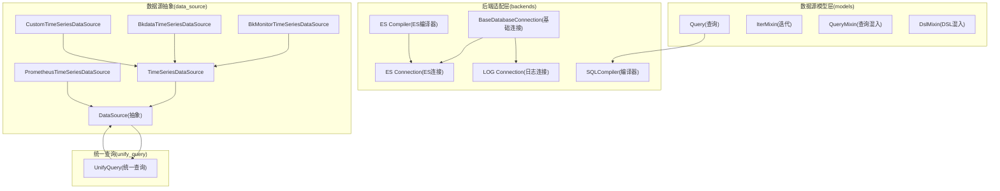
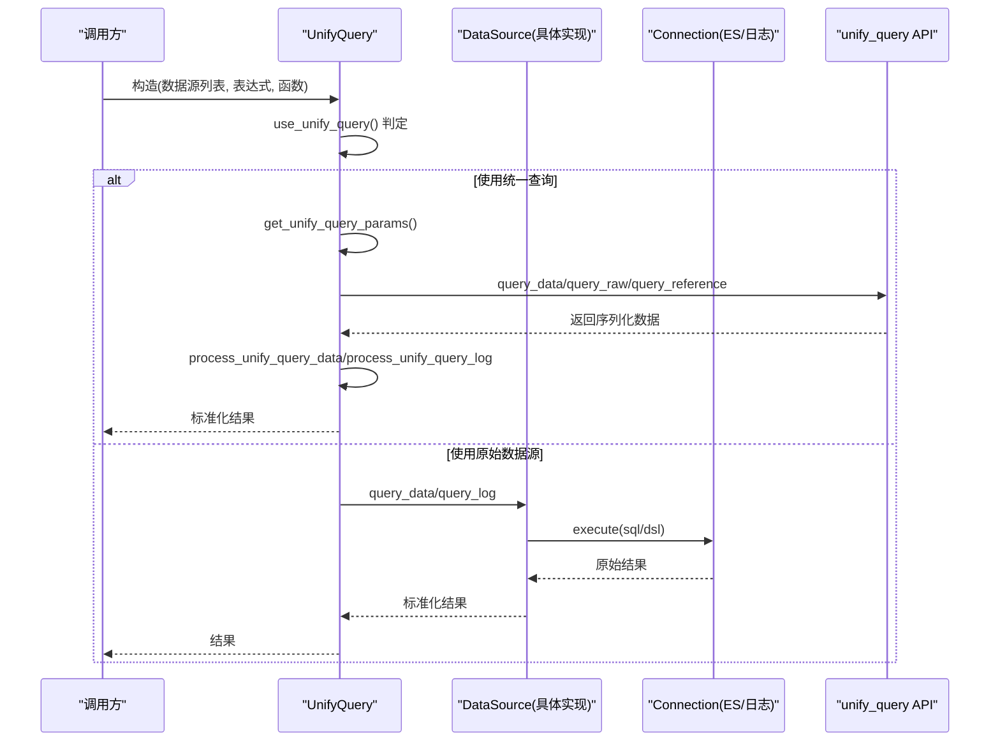
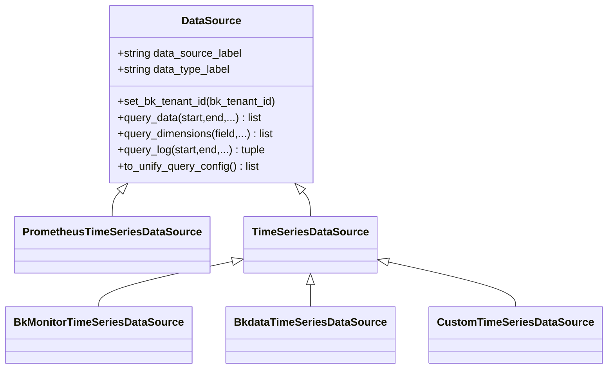
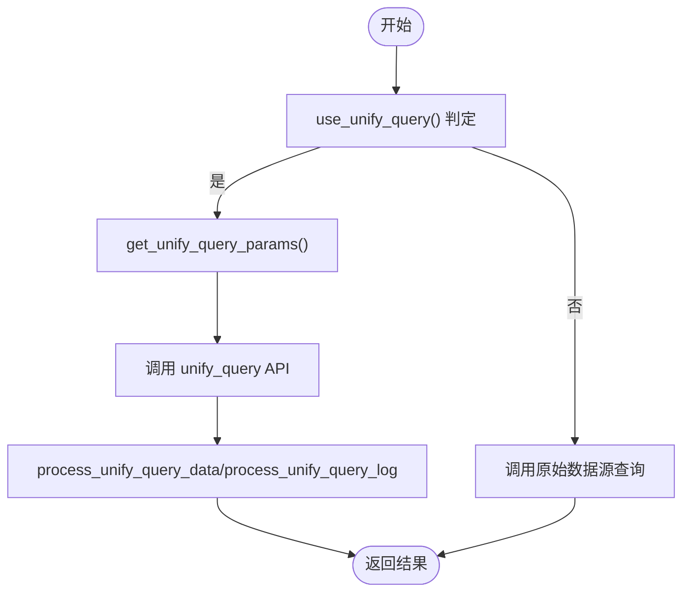
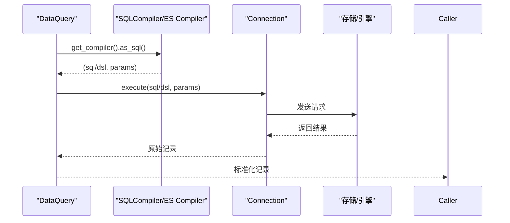
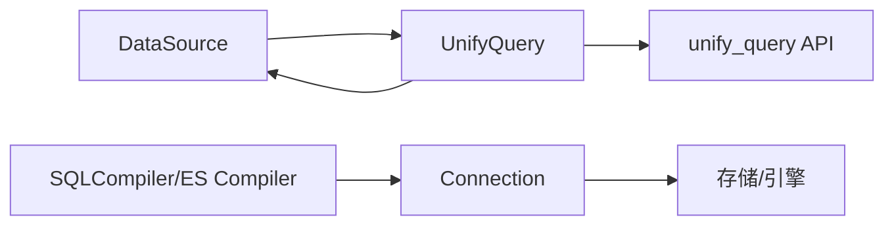

# 数据源集成

<cite>
**本文引用的文件**
- [bkmonitor/data_source/__init__.py](file://bkmonitor/bkmonitor/data_source/__init__.py)
- [bkmonitor/data_source/shortcuts.py](file://bkmonitor/bkmonitor/data_source/shortcuts.py)
- [bkmonitor/data_source/data_source/__init__.py](file://bkmonitor/bkmonitor/data_source/data_source/__init__.py)
- [bkmonitor/data_source/unify_query/query.py](file://bkmonitor/bkmonitor/data_source/unify_query/query.py)
- [bkmonitor/data_source/backends/base/connection.py](file://bkmonitor/bkmonitor/data_source/backends/base/connection.py)
- [bkmonitor/data_source/backends/elastic_search/connection.py](file://bkmonitor/bkmonitor/data_source/backends/elastic_search/connection.py)
- [bkmonitor/data_source/backends/log/connection.py](file://bkmonitor/bkmonitor/data_source/backends/log/connection.py)
- [bkmonitor/data_source/backends/base/compiler.py](file://bkmonitor/bkmonitor/data_source/backends/base/compiler.py)
- [bkmonitor/data_source/backends/elastic_search/compiler.py](file://bkmonitor/bkmonitor/data_source/backends/elastic_search/compiler.py)
- [bkmonitor/data_source/models/query.py](file://bkmonitor/bkmonitor/data_source/models/query.py)
</cite>

## 目录
1. [简介](#简介)
2. [项目结构](#项目结构)
3. [核心组件](#核心组件)
4. [架构总览](#架构总览)
5. [详细组件分析](#详细组件分析)
6. [依赖分析](#依赖分析)
7. [性能考虑](#性能考虑)
8. [故障排查指南](#故障排查指南)
9. [结论](#结论)
10. [附录](#附录)

## 简介
本文件面向“数据源集成”模块，系统性阐述时序数据库、日志系统、第三方 API 等多种数据源类型的接入机制，覆盖配置参数、连接池管理、认证与鉴权、错误处理策略、数据格式转换、字段映射、时间戳处理与数据验证规则，并提供可复用的配置示例与代码片段路径，帮助开发者快速集成新的数据源类型。

## 项目结构
数据源集成模块位于 bkmonitor/data_source 目录下，主要由以下层次构成：
- models：查询模型与迭代器封装，提供统一的查询入口与 DSL 支持
- backends：不同存储/引擎的编译器与连接器实现（如 ES、日志）
- data_source：数据源抽象类与具体实现（Prometheus、BK-Monitor、BK-Data、自定义等）
- unify_query：统一查询编排与灰度策略、时序/日志/事件的统一封装

图示来源
- [bkmonitor/data_source/models/query.py:195-243](file://bkmonitor/bkmonitor/data_source/models/query.py#L195-L243)
- [bkmonitor/data_source/backends/base/connection.py:12-16](file://bkmonitor/bkmonitor/data_source/backends/base/connection.py#L12-L16)
- [bkmonitor/data_source/backends/elastic_search/connection.py:27-55](file://bkmonitor/bkmonitor/data_source/backends/elastic_search/connection.py#L27-L55)
- [bkmonitor/data_source/backends/log/connection.py:15-24](file://bkmonitor/bkmonitor/data_source/backends/log/connection.py#L15-L24)
- [bkmonitor/data_source/backends/base/compiler.py:16-86](file://bkmonitor/bkmonitor/data_source/backends/base/compiler.py#L16-L86)
- [bkmonitor/data_source/backends/elastic_search/compiler.py:29-160](file://bkmonitor/bkmonitor/data_source/backends/elastic_search/compiler.py#L29-L160)
- [bkmonitor/data_source/data_source/__init__.py:525-760](file://bkmonitor/bkmonitor/data_source/data_source/__init__.py#L525-L760)
- [bkmonitor/data_source/unify_query/query.py:48-120](file://bkmonitor/bkmonitor/data_source/unify_query/query.py#L48-L120)

章节来源
- [bkmonitor/data_source/__init__.py:11-15](file://bkmonitor/bkmonitor/data_source/__init__.py#L11-L15)
- [bkmonitor/data_source/shortcuts.py:14-35](file://bkmonitor/bkmonitor/data_source/shortcuts.py#L14-L35)
- [bkmonitor/data_source/models/query.py:195-243](file://bkmonitor/bkmonitor/data_source/models/query.py#L195-L243)
- [bkmonitor/data_source/backends/base/connection.py:12-16](file://bkmonitor/bkmonitor/data_source/backends/base/connection.py#L12-L16)
- [bkmonitor/data_source/backends/elastic_search/connection.py:27-55](file://bkmonitor/bkmonitor/data_source/backends/elastic_search/connection.py#L27-L55)
- [bkmonitor/data_source/backends/log/connection.py:15-24](file://bkmonitor/bkmonitor/data_source/backends/log/connection.py#L15-L24)
- [bkmonitor/data_source/backends/base/compiler.py:16-86](file://bkmonitor/bkmonitor/data_source/backends/base/compiler.py#L16-L86)
- [bkmonitor/data_source/backends/elastic_search/compiler.py:29-160](file://bkmonitor/bkmonitor/data_source/backends/elastic_search/compiler.py#L29-L160)
- [bkmonitor/data_source/data_source/__init__.py:525-760](file://bkmonitor/bkmonitor/data_source/data_source/__init__.py#L525-L760)
- [bkmonitor/data_source/unify_query/query.py:48-120](file://bkmonitor/bkmonitor/data_source/unify_query/query.py#L48-L120)

## 核心组件
- 数据源抽象类 DataSource：定义统一接口（查询、维度、日志、初始化等），并提供时间对齐、高级条件过滤、函数解析等通用能力
- 统一查询 UnifyQuery：根据数据源类型、表达式、函数、灰度策略决定走统一查询还是原始数据源查询，负责时序/日志/事件的统一封装与统计
- 查询模型 DataQuery：提供链式 API（table/select/where/group_by/order_by/dsl_*），并支持原生 SQL 与 DSL
- 后端编译器与连接器：SQLCompiler/ES Compiler 将查询树编译为目标 DSL/SQL，Connection 负责执行与追踪

章节来源
- [bkmonitor/data_source/data_source/__init__.py:525-760](file://bkmonitor/bkmonitor/data_source/data_source/__init__.py#L525-L760)
- [bkmonitor/data_source/unify_query/query.py:48-120](file://bkmonitor/bkmonitor/data_source/unify_query/query.py#L48-L120)
- [bkmonitor/data_source/models/query.py:195-243](file://bkmonitor/bkmonitor/data_source/models/query.py#L195-L243)
- [bkmonitor/data_source/backends/base/compiler.py:16-86](file://bkmonitor/bkmonitor/data_source/backends/base/compiler.py#L16-L86)
- [bkmonitor/data_source/backends/elastic_search/compiler.py:29-160](file://bkmonitor/bkmonitor/data_source/backends/elastic_search/compiler.py#L29-L160)
- [bkmonitor/data_source/backends/base/connection.py:12-16](file://bkmonitor/bkmonitor/data_source/backends/base/connection.py#L12-L16)
- [bkmonitor/data_source/backends/elastic_search/connection.py:27-55](file://bkmonitor/bkmonitor/data_source/backends/elastic_search/connection.py#L27-L55)
- [bkmonitor/data_source/backends/log/connection.py:15-24](file://bkmonitor/bkmonitor/data_source/backends/log/connection.py#L15-L24)

## 架构总览
统一查询编排流程如下：

图示来源
- [bkmonitor/data_source/unify_query/query.py:281-332](file://bkmonitor/bkmonitor/data_source/unify_query/query.py#L281-L332)
- [bkmonitor/data_source/unify_query/query.py:333-386](file://bkmonitor/bkmonitor/data_source/unify_query/query.py#L333-L386)
- [bkmonitor/data_source/unify_query/query.py:387-425](file://bkmonitor/bkmonitor/data_source/unify_query/query.py#L387-L425)
- [bkmonitor/data_source/unify_query/query.py:464-495](file://bkmonitor/bkmonitor/data_source/unify_query/query.py#L464-L495)
- [bkmonitor/data_source/unify_query/query.py:496-533](file://bkmonitor/bkmonitor/data_source/unify_query/query.py#L496-L533)
- [bkmonitor/data_source/unify_query/query.py:559-627](file://bkmonitor/bkmonitor/data_source/unify_query/query.py#L559-L627)
- [bkmonitor/data_source/unify_query/query.py:731-780](file://bkmonitor/bkmonitor/data_source/unify_query/query.py#L731-L780)
- [bkmonitor/data_source/backends/elastic_search/connection.py:43-55](file://bkmonitor/bkmonitor/data_source/backends/elastic_search/connection.py#L43-L55)

章节来源
- [bkmonitor/data_source/unify_query/query.py:281-332](file://bkmonitor/bkmonitor/data_source/unify_query/query.py#L281-L332)
- [bkmonitor/data_source/unify_query/query.py:333-386](file://bkmonitor/bkmonitor/data_source/unify_query/query.py#L333-L386)
- [bkmonitor/data_source/unify_query/query.py:387-425](file://bkmonitor/bkmonitor/data_source/unify_query/query.py#L387-L425)
- [bkmonitor/data_source/unify_query/query.py:464-495](file://bkmonitor/bkmonitor/data_source/unify_query/query.py#L464-L495)
- [bkmonitor/data_source/unify_query/query.py:496-533](file://bkmonitor/bkmonitor/data_source/unify_query/query.py#L496-L533)
- [bkmonitor/data_source/unify_query/query.py:559-627](file://bkmonitor/bkmonitor/data_source/unify_query/query.py#L559-L627)
- [bkmonitor/data_source/unify_query/query.py:731-780](file://bkmonitor/bkmonitor/data_source/unify_query/query.py#L731-L780)
- [bkmonitor/data_source/backends/elastic_search/connection.py:43-55](file://bkmonitor/bkmonitor/data_source/backends/elastic_search/connection.py#L43-L55)

## 详细组件分析

### DataSource 抽象与具体实现
- 抽象职责：统一查询接口、时间字段与对齐、高级条件过滤、函数解析、维度查询桥接
- 典型实现：
  - PrometheusTimeSeriesDataSource：PromQL 执行，返回统一格式
  - TimeSeriesDataSource：通用时序数据源，支持函数解析、条件转换、统一查询配置生成
  - BkMonitorTimeSeriesDataSource：监控采集时序，兼容 CMDB 层级查询路由
  - BkdataTimeSeriesDataSource：计算平台时序，支持灰度切换、鉴权、时间字段规范化
  - CustomTimeSeriesDataSource：自定义时序，维度查询桥接到统一查询

图示来源
- [bkmonitor/data_source/data_source/__init__.py:525-760](file://bkmonitor/bkmonitor/data_source/data_source/__init__.py#L525-L760)
- [bkmonitor/data_source/data_source/__init__.py:794-877](file://bkmonitor/bkmonitor/data_source/data_source/__init__.py#L794-L877)
- [bkmonitor/data_source/data_source/__init__.py:879-1264](file://bkmonitor/bkmonitor/data_source/data_source/__init__.py#L879-L1264)
- [bkmonitor/data_source/data_source/__init__.py:1266-1356](file://bkmonitor/bkmonitor/data_source/data_source/__init__.py#L1266-L1356)
- [bkmonitor/data_source/data_source/__init__.py:1358-1498](file://bkmonitor/bkmonitor/data_source/data_source/__init__.py#L1358-L1498)
- [bkmonitor/data_source/data_source/__init__.py:1500-1513](file://bkmonitor/bkmonitor/data_source/data_source/__init__.py#L1500-L1513)

章节来源
- [bkmonitor/data_source/data_source/__init__.py:525-760](file://bkmonitor/bkmonitor/data_source/data_source/__init__.py#L525-L760)
- [bkmonitor/data_source/data_source/__init__.py:794-877](file://bkmonitor/bkmonitor/data_source/data_source/__init__.py#L794-L877)
- [bkmonitor/data_source/data_source/__init__.py:879-1264](file://bkmonitor/bkmonitor/data_source/data_source/__init__.py#L879-L1264)
- [bkmonitor/data_source/data_source/__init__.py:1266-1356](file://bkmonitor/bkmonitor/data_source/data_source/__init__.py#L1266-L1356)
- [bkmonitor/data_source/data_source/__init__.py:1358-1498](file://bkmonitor/bkmonitor/data_source/data_source/__init__.py#L1358-L1498)
- [bkmonitor/data_source/data_source/__init__.py:1500-1513](file://bkmonitor/bkmonitor/data_source/data_source/__init__.py#L1500-L1513)

### 统一查询 UnifyQuery
- 功能要点：
  - use_unify_query：依据数据源标签、表达式、函数、灰度策略判断是否走统一查询
  - get_unify_query_params：将各数据源配置合并为统一查询参数（query_list、step、表达式、排序等）
  - query_data/query_log：统一时序/日志查询入口，自动处理时间对齐、统计、序列化
  - process_unify_query_data/process_unify_query_log：统一结果标准化
- 错误处理：捕获异常并上报指标，区分 unify_query 与 query_api 两种路径

图示来源
- [bkmonitor/data_source/unify_query/query.py:281-332](file://bkmonitor/bkmonitor/data_source/unify_query/query.py#L281-L332)
- [bkmonitor/data_source/unify_query/query.py:333-386](file://bkmonitor/bkmonitor/data_source/unify_query/query.py#L333-L386)
- [bkmonitor/data_source/unify_query/query.py:387-425](file://bkmonitor/bkmonitor/data_source/unify_query/query.py#L387-L425)
- [bkmonitor/data_source/unify_query/query.py:464-495](file://bkmonitor/bkmonitor/data_source/unify_query/query.py#L464-L495)
- [bkmonitor/data_source/unify_query/query.py:496-533](file://bkmonitor/bkmonitor/data_source/unify_query/query.py#L496-L533)
- [bkmonitor/data_source/unify_query/query.py:559-627](file://bkmonitor/bkmonitor/data_source/unify_query/query.py#L559-L627)
- [bkmonitor/data_source/unify_query/query.py:731-780](file://bkmonitor/bkmonitor/data_source/unify_query/query.py#L731-L780)

章节来源
- [bkmonitor/data_source/unify_query/query.py:281-332](file://bkmonitor/bkmonitor/data_source/unify_query/query.py#L281-L332)
- [bkmonitor/data_source/unify_query/query.py:333-386](file://bkmonitor/bkmonitor/data_source/unify_query/query.py#L333-L386)
- [bkmonitor/data_source/unify_query/query.py:387-425](file://bkmonitor/bkmonitor/data_source/unify_query/query.py#L387-L425)
- [bkmonitor/data_source/unify_query/query.py:464-495](file://bkmonitor/bkmonitor/data_source/unify_query/query.py#L464-L495)
- [bkmonitor/data_source/unify_query/query.py:496-533](file://bkmonitor/bkmonitor/data_source/unify_query/query.py#L496-L533)
- [bkmonitor/data_source/unify_query/query.py:559-627](file://bkmonitor/bkmonitor/data_source/unify_query/query.py#L559-L627)
- [bkmonitor/data_source/unify_query/query.py:731-780](file://bkmonitor/bkmonitor/data_source/unify_query/query.py#L731-L780)

### 查询模型与编译执行
- DataQuery 提供链式 API：table/select/where/group_by/order_by/dsl_*，并支持原生 SQL 与 DSL
- SQLCompiler/ES Compiler：将查询树编译为 SQL/DSL，Connection 负责执行与追踪
- ES 编译器支持复合聚合、嵌套查询、通配符/正则/范围等丰富操作符映射

图示来源
- [bkmonitor/data_source/models/query.py:195-243](file://bkmonitor/bkmonitor/data_source/models/query.py#L195-L243)
- [bkmonitor/data_source/backends/base/compiler.py:16-86](file://bkmonitor/bkmonitor/data_source/backends/base/compiler.py#L16-L86)
- [bkmonitor/data_source/backends/elastic_search/compiler.py:103-160](file://bkmonitor/bkmonitor/data_source/backends/elastic_search/compiler.py#L103-L160)
- [bkmonitor/data_source/backends/elastic_search/connection.py:43-55](file://bkmonitor/bkmonitor/data_source/backends/elastic_search/connection.py#L43-L55)

章节来源
- [bkmonitor/data_source/models/query.py:195-243](file://bkmonitor/bkmonitor/data_source/models/query.py#L195-L243)
- [bkmonitor/data_source/backends/base/compiler.py:16-86](file://bkmonitor/bkmonitor/data_source/backends/base/compiler.py#L16-L86)
- [bkmonitor/data_source/backends/elastic_search/compiler.py:103-160](file://bkmonitor/bkmonitor/data_source/backends/elastic_search/compiler.py#L103-L160)
- [bkmonitor/data_source/backends/elastic_search/connection.py:43-55](file://bkmonitor/bkmonitor/data_source/backends/elastic_search/connection.py#L43-L55)

### 日志数据源接入
- 日志数据源通过统一查询模块处理，支持原始日志查询、排序、分页与元信息抽取
- ES 连接器负责 DSL 构造与执行，支持全量索引名、去重、嵌套字段查询

章节来源
- [bkmonitor/data_source/unify_query/query.py:464-495](file://bkmonitor/bkmonitor/data_source/unify_query/query.py#L464-L495)
- [bkmonitor/data_source/backends/elastic_search/connection.py:43-55](file://bkmonitor/bkmonitor/data_source/backends/elastic_search/connection.py#L43-L55)

## 依赖分析
- 组件耦合：
  - DataSource 依赖 UnifyQuery 生成统一查询配置，也支持直接查询
  - UnifyQuery 依赖数据源接口与 API.unify_query
  - 编译器与连接器解耦于具体存储，便于扩展新后端
- 外部依赖：
  - unify_query API：统一查询入口
  - OpenTelemetry Tracing：查询链路追踪
  - Django Q/Tree：条件树解析与转换

图示来源
- [bkmonitor/data_source/data_source/__init__.py:525-760](file://bkmonitor/bkmonitor/data_source/data_source/__init__.py#L525-L760)
- [bkmonitor/data_source/unify_query/query.py:281-332](file://bkmonitor/bkmonitor/data_source/unify_query/query.py#L281-L332)
- [bkmonitor/data_source/backends/base/compiler.py:16-86](file://bkmonitor/bkmonitor/data_source/backends/base/compiler.py#L16-L86)
- [bkmonitor/data_source/backends/elastic_search/connection.py:27-55](file://bkmonitor/bkmonitor/data_source/backends/elastic_search/connection.py#L27-L55)

章节来源
- [bkmonitor/data_source/data_source/__init__.py:525-760](file://bkmonitor/bkmonitor/data_source/data_source/__init__.py#L525-L760)
- [bkmonitor/data_source/unify_query/query.py:281-332](file://bkmonitor/bkmonitor/data_source/unify_query/query.py#L281-L332)
- [bkmonitor/data_source/backends/base/compiler.py:16-86](file://bkmonitor/bkmonitor/data_source/backends/base/compiler.py#L16-L86)
- [bkmonitor/data_source/backends/elastic_search/connection.py:27-55](file://bkmonitor/bkmonitor/data_source/backends/elastic_search/connection.py#L27-L55)

## 性能考虑
- 时间对齐与步长：统一查询按最小步长对齐，避免跨步长聚合误差
- 聚合优化：ES 编译器支持复合聚合与分桶大小控制，降低内存与网络开销
- 灰度与降采样：根据业务灰度列表与 down_sample_range 控制查询规模
- 并发查询：日志多数据源场景使用线程池并发拉取，汇总总数

章节来源
- [bkmonitor/data_source/unify_query/query.py:333-386](file://bkmonitor/bkmonitor/data_source/unify_query/query.py#L333-L386)
- [bkmonitor/data_source/backends/elastic_search/compiler.py:293-391](file://bkmonitor/bkmonitor/data_source/backends/elastic_search/compiler.py#L293-L391)
- [bkmonitor/data_source/unify_query/query.py:559-580](file://bkmonitor/bkmonitor/data_source/unify_query/query.py#L559-L580)

## 故障排查指南
- 统一查询异常：检查 use_unify_query 判定条件（数据源标签、表达式、函数、灰度）
- 权限问题：计算平台数据源在跨业务访问时进行鉴权校验，无权限抛出拒绝异常
- 时间对齐异常：确认 start/end 是否按 step 对齐，避免末尾时间戳返回
- ES 查询失败：核对 DSL 构造与操作符映射，关注嵌套字段与通配符使用

章节来源
- [bkmonitor/data_source/unify_query/query.py:281-332](file://bkmonitor/bkmonitor/data_source/unify_query/query.py#L281-L332)
- [bkmonitor/data_source/data_source/__init__.py:1421-1435](file://bkmonitor/bkmonitor/data_source/data_source/__init__.py#L1421-L1435)
- [bkmonitor/data_source/unify_query/query.py:128-133](file://bkmonitor/bkmonitor/data_source/unify_query/query.py#L128-L133)
- [bkmonitor/data_source/backends/elastic_search/compiler.py:103-160](file://bkmonitor/bkmonitor/data_source/backends/elastic_search/compiler.py#L103-L160)

## 结论
数据源集成模块通过 DataSource 抽象与 UnifyQuery 统一编排，实现了时序、日志、事件等多类型数据源的统一接入与查询。借助编译器/连接器的可扩展设计与丰富的操作符映射，开发者可快速适配新的数据源类型，并在统一查询与原始查询之间灵活切换，兼顾性能与功能完整性。

## 附录

### 配置参数与字段映射
- 时序查询关键参数
  - table/metrics/interval/time_field/group_by/where/filter_dict/functions
  - 参考路径：[bkmonitor/data_source/data_source/__init__.py:1147-1179](file://bkmonitor/bkmonitor/data_source/data_source/__init__.py#L1147-L1179)
- 统一查询参数
  - query_list(step/expression/order_by/space_uid/bk_tenant_id/not_time_align)
  - 参考路径：[bkmonitor/data_source/unify_query/query.py:333-386](file://bkmonitor/bkmonitor/data_source/unify_query/query.py#L333-L386)
- ES DSL 关键字段
  - aggregations/_source/query/sort/size/from/use_full_index_names/collapse
  - 参考路径：[bkmonitor/data_source/backends/elastic_search/compiler.py:103-160](file://bkmonitor/bkmonitor/data_source/backends/elastic_search/compiler.py#L103-L160)

### 认证与鉴权
- 计算平台数据源跨业务访问鉴权
  - 参考路径：[bkmonitor/data_source/data_source/__init__.py:1421-1435](file://bkmonitor/bkmonitor/data_source/data_source/__init__.py#L1421-L1435)

### 时间戳处理
- 时间对齐与偏移
  - 参考路径：[bkmonitor/data_source/data_source/__init__.py:576-589](file://bkmonitor/bkmonitor/data_source/data_source/__init__.py#L576-L589)
  - 参考路径：[bkmonitor/data_source/unify_query/query.py:128-133](file://bkmonitor/bkmonitor/data_source/unify_query/query.py#L128-L133)

### 数据格式转换与验证
- 统一结果标准化
  - 参考路径：[bkmonitor/data_source/unify_query/query.py:147-180](file://bkmonitor/bkmonitor/data_source/unify_query/query.py#L147-L180)
- 函数与参数校验
  - 参考路径：[bkmonitor/data_source/data_source/__init__.py:426-462](file://bkmonitor/bkmonitor/data_source/data_source/__init__.py#L426-L462)

### 示例与代码片段路径
- 快速开始（时序/日志查询）
  - 参考路径：[bkmonitor/data_source/shortcuts.py:14-35](file://bkmonitor/bkmonitor/data_source/shortcuts.py#L14-L35)
- 链式查询构建
  - 参考路径：[bkmonitor/data_source/models/query.py:210-243](file://bkmonitor/bkmonitor/data_source/models/query.py#L210-L243)
- ES 编译与执行
  - 参考路径：[bkmonitor/data_source/backends/elastic_search/compiler.py:103-160](file://bkmonitor/bkmonitor/data_source/backends/elastic_search/compiler.py#L103-L160)
  - 参考路径：[bkmonitor/data_source/backends/elastic_search/connection.py:43-55](file://bkmonitor/bkmonitor/data_source/backends/elastic_search/connection.py#L43-L55)