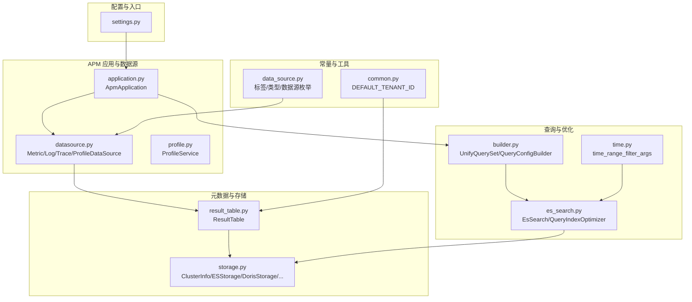
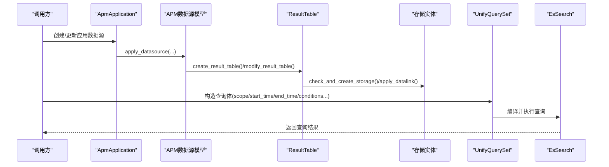
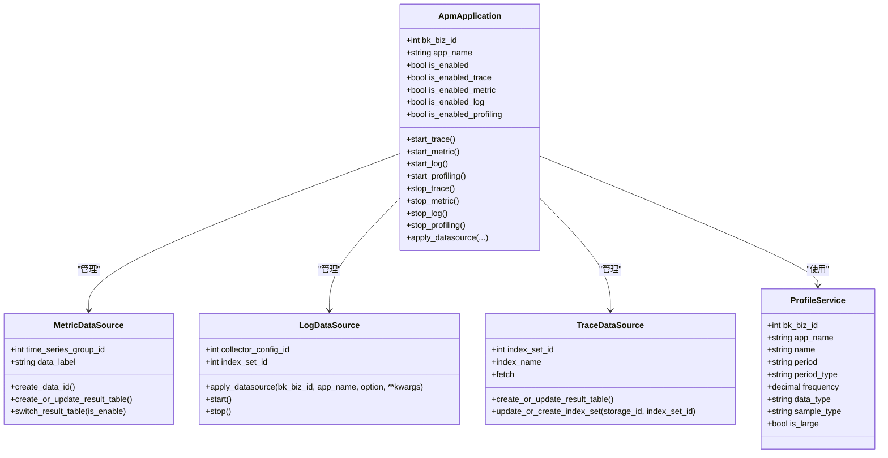
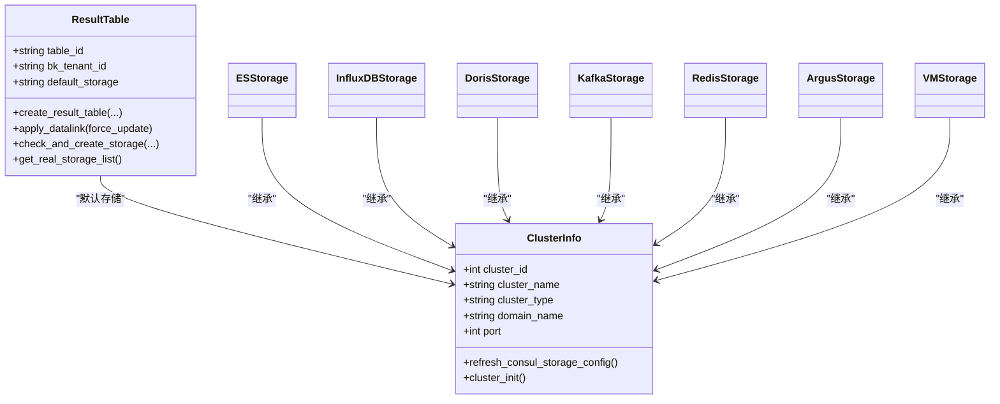
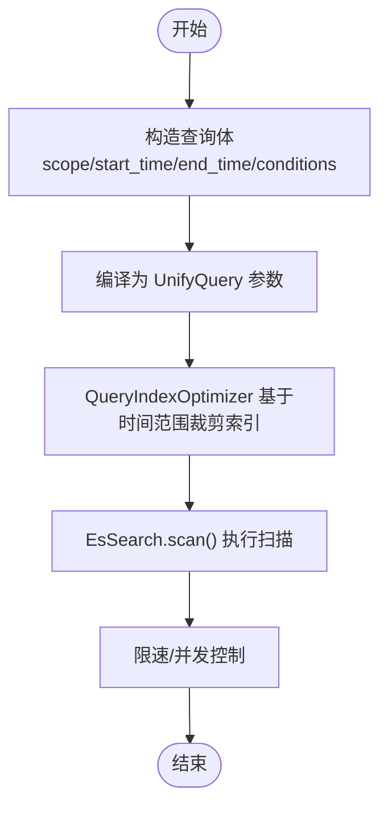
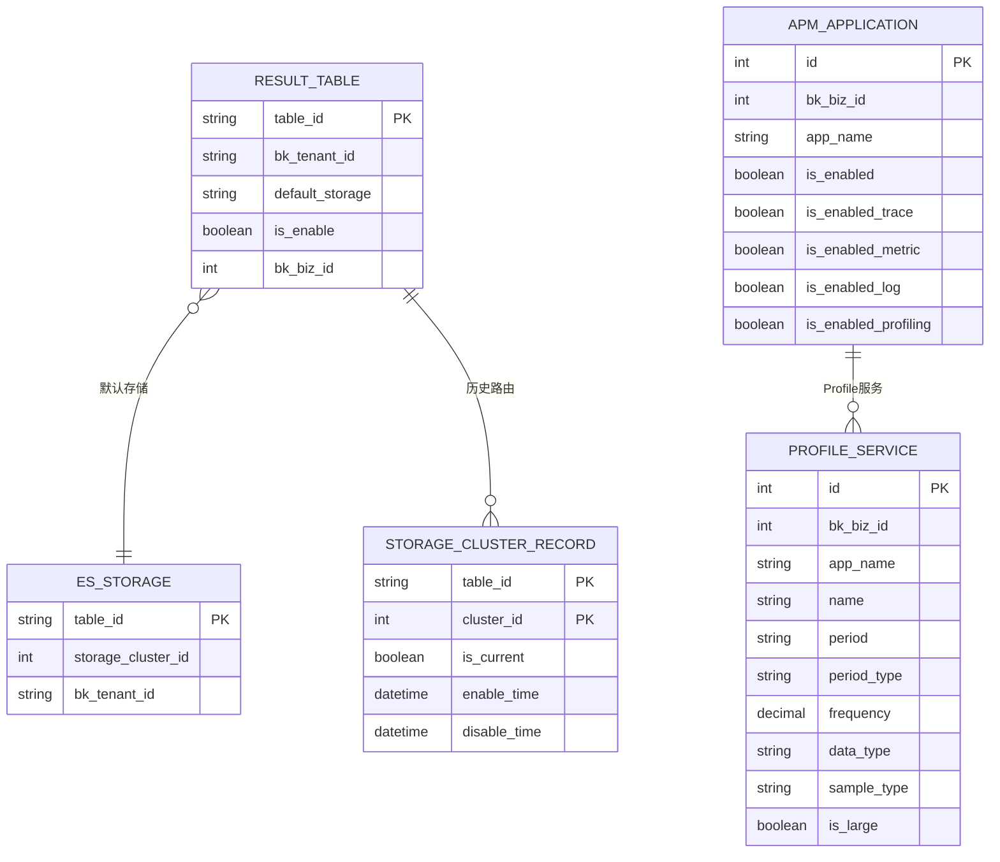
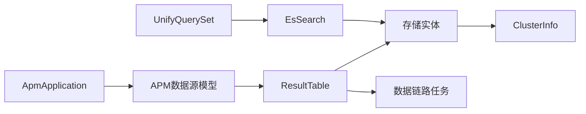

# 监控数据管理

<cite>
**本文引用的文件**
- [settings.py](file://bkmonitor/settings.py)
- [datasource.py](file://bkmonitor/apm/models/datasource.py)
- [result_table.py](file://bkmonitor/metadata/models/result_table.py)
- [storage.py](file://bkmonitor/metadata/models/storage.py)
- [es_search.py](file://bkmonitor/apm/utils/es_search.py)
- [data_source.py](file://bkmonitor/constants/data_source.py)
- [builder.py](file://bkmonitor/bkmonitor/data_source/unify_query/builder.py)
- [profile.py](file://bkmonitor/apm/models/profile.py)
- [application.py](file://bkmonitor/apm/models/application.py)
- [common.py](file://bkmonitor/constants/common.py)
- [time.py](file://bkmonitor/apm/utils/time.py)
</cite>

## 目录
1. [简介](#简介)
2. [项目结构](#项目结构)
3. [核心组件](#核心组件)
4. [架构总览](#架构总览)
5. [详细组件分析](#详细组件分析)
6. [依赖分析](#依赖分析)
7. [性能考量](#性能考量)
8. [故障排查指南](#故障排查指南)
9. [结论](#结论)
10. [附录](#附录)

## 简介
本文件面向监控数据管理系统，围绕数据采集、处理、存储与查询优化展开，系统性阐述：
- 数据采集机制：如何接入不同数据源（时序、事件、日志、Trace、Profile），以及数据链路与结果表的创建与启用。
- 数据处理流程：统一查询（UnifyQuery）的编译与执行、索引优化与扫描策略。
- 数据存储设计：多存储后端（ES、InfluxDB、Doris、Kafka、Redis、Argus、VM）的抽象与路由。
- 数据查询优化：基于时间范围的索引裁剪、扫描限速与并发控制、查询代理与索引选择。

## 项目结构
系统采用模块化分层：
- 配置与入口：Django 设置加载与环境变量注入。
- APM 应用与数据源：应用级数据源生命周期管理（开启/关闭）、结果表与数据链路联动。
- 元数据与存储：结果表、存储集群、实际存储实体的抽象与管理。
- 查询与优化：统一查询编译器、查询体构造、ES 查询代理与索引优化。
- 常量与工具：数据源标签、数据类型、时间范围工具等。

**图表来源**
- [settings.py:1-110](file://bkmonitor/settings.py#L1-L110)
- [application.py:1-343](file://bkmonitor/apm/models/application.py#L1-L343)
- [datasource.py:1-800](file://bkmonitor/apm/models/datasource.py#L1-L800)
- [result_table.py:1-800](file://bkmonitor/metadata/models/result_table.py#L1-L800)
- [storage.py:1-800](file://bkmonitor/metadata/models/storage.py#L1-L800)
- [builder.py:1-555](file://bkmonitor/bkmonitor/data_source/unify_query/builder.py#L1-L555)
- [es_search.py:1-282](file://bkmonitor/apm/utils/es_search.py#L1-L282)
- [data_source.py:1-247](file://bkmonitor/constants/data_source.py#L1-L247)
- [common.py:1-129](file://bkmonitor/constants/common.py#L1-L129)
- [time.py:1-16](file://bkmonitor/apm/utils/time.py#L1-L16)

**章节来源**
- [settings.py:1-110](file://bkmonitor/settings.py#L1-L110)
- [application.py:1-343](file://bkmonitor/apm/models/application.py#L1-L343)
- [datasource.py:1-800](file://bkmonitor/apm/models/datasource.py#L1-L800)
- [result_table.py:1-800](file://bkmonitor/metadata/models/result_table.py#L1-L800)
- [storage.py:1-800](file://bkmonitor/metadata/models/storage.py#L1-L800)
- [builder.py:1-555](file://bkmonitor/bkmonitor/data_source/unify_query/builder.py#L1-L555)
- [es_search.py:1-282](file://bkmonitor/apm/utils/es_search.py#L1-L282)
- [data_source.py:1-247](file://bkmonitor/constants/data_source.py#L1-L247)
- [common.py:1-129](file://bkmonitor/constants/common.py#L1-L129)
- [time.py:1-16](file://bkmonitor/apm/utils/time.py#L1-L16)

## 核心组件
- 应用与数据源
  - ApmApplication：应用级开关与数据源生命周期管理，支持开启/关闭 Trace/Metric/Log/Profiling。
  - APM 数据源模型：MetricDataSource、LogDataSource、TraceDataSource、ProfileDataSource，负责 data_id、结果表、存储集群与启用状态。
- 元数据与存储
  - ResultTable：逻辑结果表，负责创建/更新结果表、绑定存储、应用数据链路。
  - ClusterInfo/各存储实体：抽象存储集群与实际存储（ES、InfluxDB、Doris、Kafka、Redis、Argus、VM），提供 consul 配置与迁移记录。
- 查询与优化
  - UnifyQuerySet/QueryConfigBuilder：类 ORM 查询体构造，统一编译为 UnifyQuery 查询参数。
  - EsSearch/QueryIndexOptimizer：ES 查询代理与索引裁剪，基于时间范围过滤索引集合，提升扫描效率。
- 常量与工具
  - 数据源标签与类型、统一查询支持的数据源组合。
  - DEFAULT_TENANT_ID、时间范围过滤辅助函数。

**章节来源**
- [application.py:1-343](file://bkmonitor/apm/models/application.py#L1-L343)
- [datasource.py:1-800](file://bkmonitor/apm/models/datasource.py#L1-L800)
- [result_table.py:1-800](file://bkmonitor/metadata/models/result_table.py#L1-L800)
- [storage.py:1-800](file://bkmonitor/metadata/models/storage.py#L1-L800)
- [builder.py:1-555](file://bkmonitor/bkmonitor/data_source/unify_query/builder.py#L1-L555)
- [es_search.py:1-282](file://bkmonitor/apm/utils/es_search.py#L1-L282)
- [data_source.py:1-247](file://bkmonitor/constants/data_source.py#L1-L247)
- [common.py:1-129](file://bkmonitor/constants/common.py#L1-L129)
- [time.py:1-16](file://bkmonitor/apm/utils/time.py#L1-L16)

## 架构总览
系统通过“应用-数据源-结果表-存储集群”的链路完成数据接入与查询：
- 应用层：ApmApplication 统一管理数据源开关与创建流程。
- 元数据层：ResultTable 负责结果表的创建、字段与存储配置、数据链路应用。
- 存储层：ClusterInfo 抽象集群，各存储实体承载具体后端能力与 consul 配置。
- 查询层：UnifyQuerySet 编译查询体，EsSearch 优化索引选择，提高查询性能。

**图表来源**
- [application.py:140-210](file://bkmonitor/apm/models/application.py#L140-L210)
- [datasource.py:175-191](file://bkmonitor/apm/models/datasource.py#L175-L191)
- [result_table.py:315-564](file://bkmonitor/metadata/models/result_table.py#L315-L564)
- [builder.py:486-555](file://bkmonitor/bkmonitor/data_source/unify_query/builder.py#L486-L555)
- [es_search.py:112-136](file://bkmonitor/apm/utils/es_search.py#L112-L136)

**章节来源**
- [application.py:140-210](file://bkmonitor/apm/models/application.py#L140-L210)
- [datasource.py:175-191](file://bkmonitor/apm/models/datasource.py#L175-L191)
- [result_table.py:315-564](file://bkmonitor/metadata/models/result_table.py#L315-L564)
- [builder.py:486-555](file://bkmonitor/bkmonitor/data_source/unify_query/builder.py#L486-L555)
- [es_search.py:112-136](file://bkmonitor/apm/utils/es_search.py#L112-L136)

## 详细组件分析

### 数据源接入与生命周期
- APM 数据源模型
  - MetricDataSource：时序数据，创建 data_id 与时间序列组，支持 InfluxDB 代理集群。
  - LogDataSource：日志数据，创建自定义上报与索引集，支持 ES 存储参数。
  - TraceDataSource：Trace 日志，创建结果表与索引集，支持冷热集群与切片配置。
  - ProfileDataSource：Profile 数据，提供服务实例表与采样频率/周期等字段。
- 应用级生命周期
  - 开启/关闭：start/stop 方法通过 metadata 接口启用/停用结果表。
  - 创建流程：apply_datasource 统一入口，创建 data_id、结果表与存储配置。

**图表来源**
- [application.py:36-289](file://bkmonitor/apm/models/application.py#L36-L289)
- [datasource.py:192-783](file://bkmonitor/apm/models/datasource.py#L192-L783)
- [profile.py:14-30](file://bkmonitor/apm/models/profile.py#L14-L30)

**章节来源**
- [application.py:36-289](file://bkmonitor/apm/models/application.py#L36-L289)
- [datasource.py:192-783](file://bkmonitor/apm/models/datasource.py#L192-L783)
- [profile.py:14-30](file://bkmonitor/apm/models/profile.py#L14-L30)

### 结果表与存储管理
- ResultTable
  - 创建/更新：统一创建逻辑，校验标签、命名规范、业务归属，批量创建字段，创建存储记录。
  - 数据链路：根据存储类型与选项，应用数据链路（VM、日志V4、事件组V4）。
  - 存储查询：支持按存储类型获取配置，刷新 consul 配置。
- 存储抽象
  - ClusterInfo：集群信息，支持 ES/Kafka/Redis/InfluxDB/BKDATA/Argus/VM/Doris 等类型。
  - 实际存储实体：ESStorage、DorisStorage、InfluxDBStorage 等，提供客户端、字段管理、consul 配置与迁移记录。
  - 集群初始化：ES 集群自动创建索引策略初始化。

**图表来源**
- [result_table.py:315-660](file://bkmonitor/metadata/models/result_table.py#L315-L660)
- [storage.py:95-330](file://bkmonitor/metadata/models/storage.py#L95-L330)

**章节来源**
- [result_table.py:315-660](file://bkmonitor/metadata/models/result_table.py#L315-L660)
- [storage.py:95-330](file://bkmonitor/metadata/models/storage.py#L95-L330)

### 统一查询与索引优化
- UnifyQuerySet/QueryConfigBuilder
  - 类 ORM 查询体：支持设置作用域、时间范围、聚合、函数、表达式、维度与指标。
  - 编译为 UnifyQuery 参数：导出查询配置，支持瞬时量与时间对齐。
- EsSearch/QueryIndexOptimizer
  - 查询代理：注入时间范围过滤，自动裁剪索引集合。
  - 索引过滤：根据日/月粒度生成匹配正则，减少扫描范围。
  - 扫描与限速：基于 Semaphore 的限速装饰器，避免 ES 扫描压力过大。

**图表来源**
- [builder.py:486-555](file://bkmonitor/bkmonitor/data_source/unify_query/builder.py#L486-L555)
- [es_search.py:168-282](file://bkmonitor/apm/utils/es_search.py#L168-L282)

**章节来源**
- [builder.py:486-555](file://bkmonitor/bkmonitor/data_source/unify_query/builder.py#L486-L555)
- [es_search.py:168-282](file://bkmonitor/apm/utils/es_search.py#L168-L282)

### 数据模型与索引设计
- 结果表与字段
  - ResultTable：表名、标签、默认存储、启用状态、业务归属等。
  - ResultTableField：默认字段与时间字段配置，支持 CMDB 层级字段。
- 存储路由与迁移
  - StorageClusterRecord：记录存储集群变更历史，支持 ES 集群迁移后的路由更新与 consul 刷新。
- APM 应用与 Profile
  - ApmApplication：应用开关与 Token 生成。
  - ProfileService：Profile 服务实例与采样配置。

**图表来源**
- [result_table.py:55-113](file://bkmonitor/metadata/models/result_table.py#L55-L113)
- [storage.py:663-794](file://bkmonitor/metadata/models/storage.py#L663-L794)
- [application.py:36-289](file://bkmonitor/apm/models/application.py#L36-L289)
- [profile.py:14-30](file://bkmonitor/apm/models/profile.py#L14-L30)

**章节来源**
- [result_table.py:55-113](file://bkmonitor/metadata/models/result_table.py#L55-L113)
- [storage.py:663-794](file://bkmonitor/metadata/models/storage.py#L663-L794)
- [application.py:36-289](file://bkmonitor/apm/models/application.py#L36-L289)
- [profile.py:14-30](file://bkmonitor/apm/models/profile.py#L14-L30)

## 依赖分析
- 组件耦合
  - ApmApplication 依赖 APM 数据源模型与 metadata 接口，间接依赖 ResultTable。
  - ResultTable 依赖存储实体与数据链路任务，间接依赖 ClusterInfo。
  - UnifyQuerySet 依赖 QueryConfigBuilder 与 UnifyQuery，查询时依赖 EsSearch。
- 外部依赖
  - Elasticsearch、InfluxDB、Kafka、Redis、Argus、VictoriaMetrics、Doris 等存储后端。
  - Consul 用于存储与查询配置的集中管理。
- 循环依赖
  - 通过模块拆分与延迟导入避免循环依赖（如 ResultTable 中的延迟导入）。

**图表来源**
- [application.py:1-343](file://bkmonitor/apm/models/application.py#L1-L343)
- [datasource.py:1-800](file://bkmonitor/apm/models/datasource.py#L1-L800)
- [result_table.py:1-800](file://bkmonitor/metadata/models/result_table.py#L1-L800)
- [storage.py:1-800](file://bkmonitor/metadata/models/storage.py#L1-L800)
- [builder.py:1-555](file://bkmonitor/bkmonitor/data_source/unify_query/builder.py#L1-L555)
- [es_search.py:1-282](file://bkmonitor/apm/utils/es_search.py#L1-L282)

**章节来源**
- [application.py:1-343](file://bkmonitor/apm/models/application.py#L1-L343)
- [datasource.py:1-800](file://bkmonitor/apm/models/datasource.py#L1-L800)
- [result_table.py:1-800](file://bkmonitor/metadata/models/result_table.py#L1-L800)
- [storage.py:1-800](file://bkmonitor/metadata/models/storage.py#L1-L800)
- [builder.py:1-555](file://bkmonitor/bkmonitor/data_source/unify_query/builder.py#L1-L555)
- [es_search.py:1-282](file://bkmonitor/apm/utils/es_search.py#L1-L282)

## 性能考量
- 索引裁剪
  - QueryIndexOptimizer 基于时间范围生成索引过滤正则，减少扫描范围，提升查询性能。
- 扫描限速
  - EsSearch 支持基于 Semaphore 的限速装饰器，控制并发与速率，避免 ES 压力过大。
- 存储选择
  - Trace/Log/Profile 等场景可配置 ES 切片大小、副本数、分片数与冷热集群策略，平衡写入与查询。
- 查询编译
  - UnifyQuerySet 将复杂查询体编译为统一参数，减少重复拼装，提升可维护性与可读性。

**章节来源**
- [es_search.py:138-166](file://bkmonitor/apm/utils/es_search.py#L138-L166)
- [es_search.py:168-282](file://bkmonitor/apm/utils/es_search.py#L168-L282)
- [datasource.py:568-670](file://bkmonitor/apm/models/datasource.py#L568-L670)
- [builder.py:276-331](file://bkmonitor/bkmonitor/data_source/unify_query/builder.py#L276-L331)

## 故障排查指南
- 结果表创建失败
  - 检查标签合法性、表名唯一性、业务归属与命名规范。
  - 查看数据链路应用是否成功，必要时刷新 consul 配置。
- 存储集群不可用
  - 确认集群状态与认证信息，检查 consul 配置是否正确刷新。
  - ES 集群需初始化自动创建索引策略。
- 查询性能差
  - 确认是否使用时间范围过滤，避免全索引扫描。
  - 调整 ES 切片大小、分片/副本数与冷热策略。
- 数据源启用失败
  - 检查 data_id 与结果表创建流程，查看异常告警与事件上报。

**章节来源**
- [result_table.py:315-564](file://bkmonitor/metadata/models/result_table.py#L315-L564)
- [storage.py:210-249](file://bkmonitor/metadata/models/storage.py#L210-L249)
- [storage.py:331-360](file://bkmonitor/metadata/models/storage.py#L331-L360)
- [es_search.py:168-282](file://bkmonitor/apm/utils/es_search.py#L168-L282)
- [application.py:211-215](file://bkmonitor/apm/models/application.py#L211-L215)

## 结论
本系统通过“应用-数据源-结果表-存储-查询”的完整链路，实现了对多源数据的统一接入与高效查询。关键优化点包括：
- 基于时间范围的索引裁剪与扫描限速；
- 统一查询编译与查询体构造；
- 多存储后端抽象与集群配置集中管理；
- 数据链路与结果表联动，保障接入与查询稳定性。

建议在生产环境中结合业务规模与数据特征，合理配置存储参数与查询策略，并持续监控查询性能与存储健康度。

## 附录
- 配置参数说明（节选）
  - ES 存储参数：切片大小、保留天数、分片数、副本数、冷热集群配置。
  - InfluxDB 代理集群：默认存储配置与集群名称。
  - 数据标签与类型：统一查询支持的数据源与类型组合。
- 代码示例路径（不含具体代码）
  - 应用数据源创建与启用：[application.py:140-210](file://bkmonitor/apm/models/application.py#L140-L210)
  - 结果表创建与数据链路应用：[result_table.py:315-564](file://bkmonitor/metadata/models/result_table.py#L315-L564)
  - 统一查询编译与执行：[builder.py:486-555](file://bkmonitor/bkmonitor/data_source/unify_query/builder.py#L486-L555)
  - ES 查询索引优化与扫描：[es_search.py:168-282](file://bkmonitor/apm/utils/es_search.py#L168-L282)
  - 数据源标签与类型：[data_source.py:1-247](file://bkmonitor/constants/data_source.py#L1-L247)
  - 默认租户 ID：[common.py:127-129](file://bkmonitor/constants/common.py#L127-L129)
  - 时间范围过滤辅助：[time.py:14-16](file://bkmonitor/apm/utils/time.py#L14-L16)