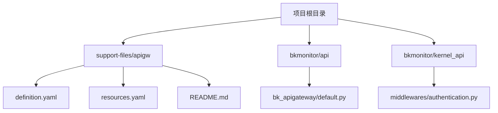
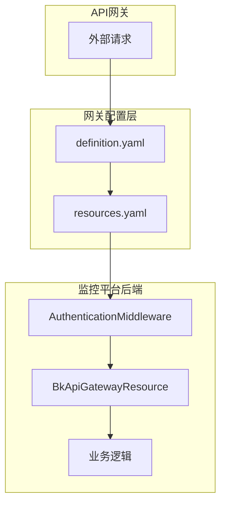
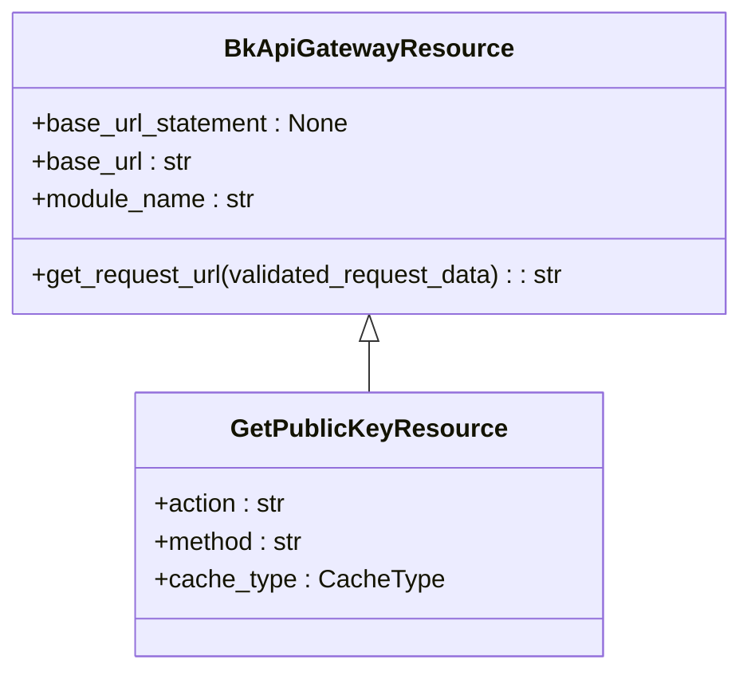
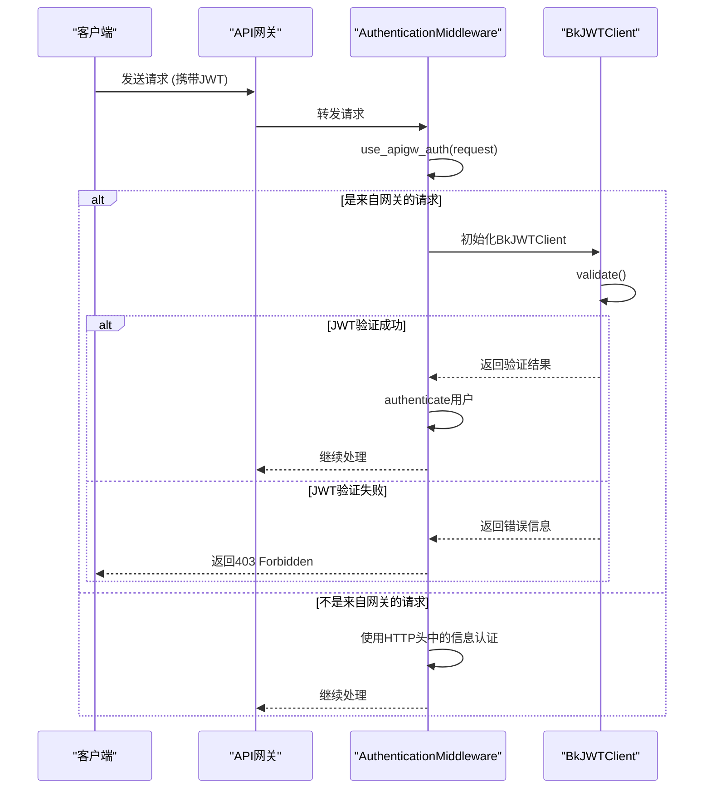
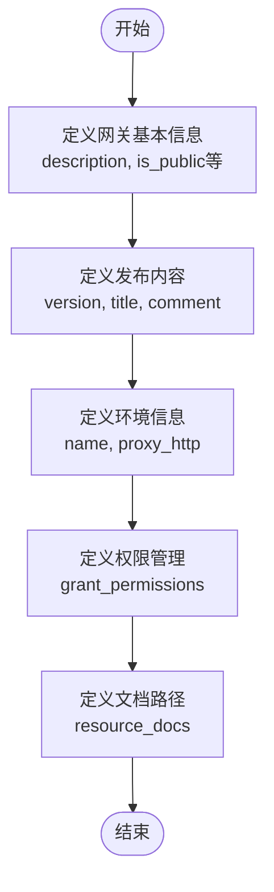
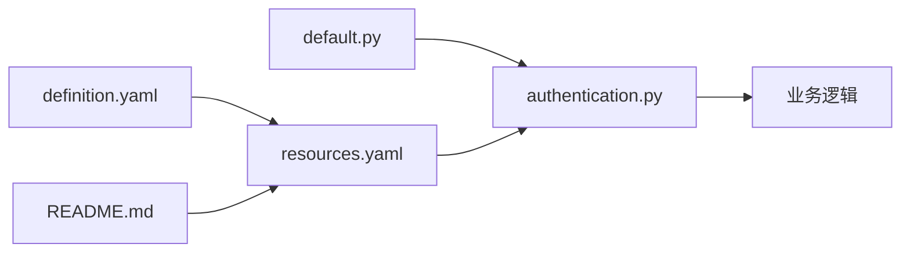

# API网关集成

<cite>
**本文档引用的文件**
- [default.py](file://bkmonitor/api/bk_apigateway/default.py#L1-L43)
- [definition.yaml](file://bkmonitor/support-files/apigw/definition.yaml#L1-L102)
- [resources.yaml](file://bkmonitor/support-files/apigw/resources.yaml#L1-L54)
- [README.md](file://bkmonitor/support-files/apigw/README.md#L1-L110)
- [authentication.py](file://bkmonitor/kernel_api/middlewares/authentication.py#L1-L244)
</cite>

## 目录

1. [简介](#简介)
2. [项目结构](#项目结构)
3. [核心组件](#核心组件)
4. [架构概述](#架构概述)
5. [详细组件分析](#详细组件分析)
6. [依赖分析](#依赖分析)
7. [性能考虑](#性能考虑)
8. [故障排除指南](#故障排除指南)
9. [结论](#结论)

## 简介
本文档系统阐述了蓝鲸监控平台（bk-monitor）通过蓝鲸API网关对外提供服务的完整机制。文档详细说明了API的注册、路由配置和访问控制策略，深入解释了JWT和API Key等认证方式、限流规则以及日志记录机制。同时，提供了从API发布流程、版本管理到文档生成的完整指南，并展示了如何通过网关调用监控数据查询、告警管理等核心接口。文档还包含了防止DDoS攻击和数据泄露的安全最佳实践，并记录了访问拒绝、响应延迟等常见问题的排查步骤。

## 项目结构
蓝鲸监控平台的项目结构清晰，遵循模块化设计原则。API网关相关的配置和定义主要集中在`support-files/apigw`目录下，而核心的API资源定义则位于`bkmonitor/api`目录中。`bkmonitor/api/bk_apigateway`模块提供了与API网关交互的基础类。

**图示来源**
- [definition.yaml](file://bkmonitor/support-files/apigw/definition.yaml#L1-L102)
- [resources.yaml](file://bkmonitor/support-files/apigw/resources.yaml#L1-L54)
- [README.md](file://bkmonitor/support-files/apigw/README.md#L1-L110)
- [default.py](file://bkmonitor/api/bk_apigateway/default.py#L1-L43)
- [authentication.py](file://bkmonitor/kernel_api/middlewares/authentication.py#L1-L244)

## 核心组件
本系统的核心组件包括API网关配置文件（`definition.yaml`和`resources.yaml`）、API资源基类（`BkApiGatewayResource`）以及负责认证鉴权的中间件（`AuthenticationMiddleware`）。这些组件共同协作，实现了API的注册、路由、安全控制和请求处理。

**组件来源**
- [definition.yaml](file://bkmonitor/support-files/apigw/definition.yaml#L1-L102)
- [resources.yaml](file://bkmonitor/support-files/apigw/resources.yaml#L1-L54)
- [default.py](file://bkmonitor/api/bk_apigateway/default.py#L1-L43)
- [authentication.py](file://bkmonitor/kernel_api/middlewares/authentication.py#L1-L244)

## 架构概述
蓝鲸监控平台的API网关集成采用分层架构。最上层是API网关本身，负责接收所有外部请求。中间层是网关的配置和路由规则，定义了请求如何被转发。最底层是监控平台的业务逻辑。当请求到达API网关时，网关根据`resources.yaml`中的路由规则，将请求转发到监控平台的后端服务。整个过程由`AuthenticationMiddleware`进行安全控制。

**图示来源**
- [definition.yaml](file://bkmonitor/support-files/apigw/definition.yaml#L1-L102)
- [resources.yaml](file://bkmonitor/support-files/apigw/resources.yaml#L1-L54)
- [authentication.py](file://bkmonitor/kernel_api/middlewares/authentication.py#L1-L244)
- [default.py](file://bkmonitor/api/bk_apigateway/default.py#L1-L43)

## 详细组件分析

### API资源基类分析
`BkApiGatewayResource`是所有API网关资源的基类，它继承自`APIResource`，并定义了与API网关通信的基础配置。

**图示来源**
- [default.py](file://bkmonitor/api/bk_apigateway/default.py#L19-L42)

### 认证鉴权流程分析
当一个请求到达时，`AuthenticationMiddleware`中间件会首先判断请求是否来自API网关。如果是，则使用JWT进行验证；否则，使用应用代码和用户名进行认证。

**图示来源**
- [authentication.py](file://bkmonitor/kernel_api/middlewares/authentication.py#L1-L244)

### API网关配置分析
`definition.yaml`文件定义了API网关的全局配置，包括网关的基本信息、环境配置、权限管理和文档路径。

**图示来源**
- [definition.yaml](file://bkmonitor/support-files/apigw/definition.yaml#L1-L102)

## 依赖分析
API网关集成依赖于多个关键文件和模块。`definition.yaml`和`resources.yaml`是配置的核心，`README.md`提供了操作规范，`default.py`提供了代码实现，`authentication.py`则负责安全控制。

**图示来源**
- [definition.yaml](file://bkmonitor/support-files/apigw/definition.yaml#L1-L102)
- [resources.yaml](file://bkmonitor/support-files/apigw/resources.yaml#L1-L54)
- [README.md](file://bkmonitor/support-files/apigw/README.md#L1-L110)
- [default.py](file://bkmonitor/api/bk_apigateway/default.py#L1-L43)
- [authentication.py](file://bkmonitor/kernel_api/middlewares/authentication.py#L1-L244)

## 性能考虑
在API网关集成中，性能主要体现在JWT公钥的缓存和API令牌的缓存上。`AuthenticationMiddleware`使用`lru_cache`和`caches["login_db"]`来缓存公钥，避免了频繁的网络请求。同时，`APP_CODE_TOKENS`字典缓存了应用代码的权限信息，减少了数据库查询次数。

## 故障排除指南
当遇到API调用问题时，可以按照以下步骤进行排查：

1.  **检查API是否注册**：确认`resources.yaml`文件中是否包含该API的定义。
2.  **检查权限**：确认调用方是否已获得访问该API的权限。
3.  **检查认证信息**：确认请求头中是否正确携带了`X-Bkapi-JWT`或`Authorization`等认证信息。
4.  **检查租户ID**：在多租户模式下，确认`X-BK-TENANT-ID`是否正确。
5.  **查看日志**：检查`kernel_api`中间件的日志，获取详细的错误信息。

**组件来源**
- [resources.yaml](file://bkmonitor/support-files/apigw/resources.yaml#L1-L54)
- [authentication.py](file://bkmonitor/kernel_api/middlewares/authentication.py#L1-L244)

## 结论
蓝鲸监控平台通过一套完善的API网关集成机制，实现了对外服务的安全、高效和可管理。通过`definition.yaml`和`resources.yaml`进行声明式配置，结合`AuthenticationMiddleware`进行动态鉴权，构建了一个健壮的API服务框架。遵循`README.md`中的规范进行开发和部署，可以确保系统的稳定性和可维护性。