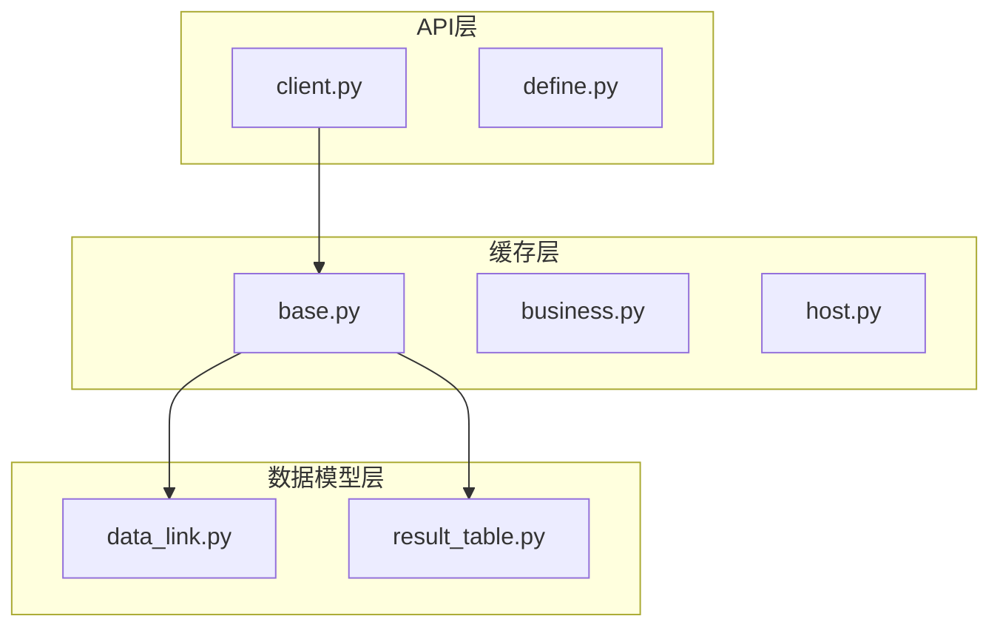
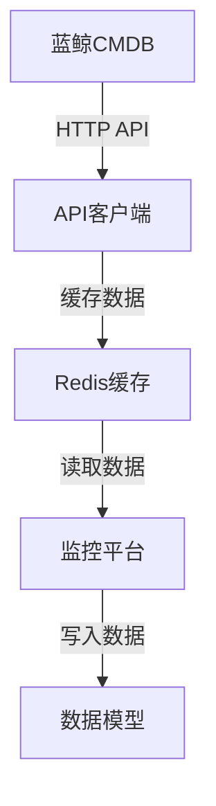
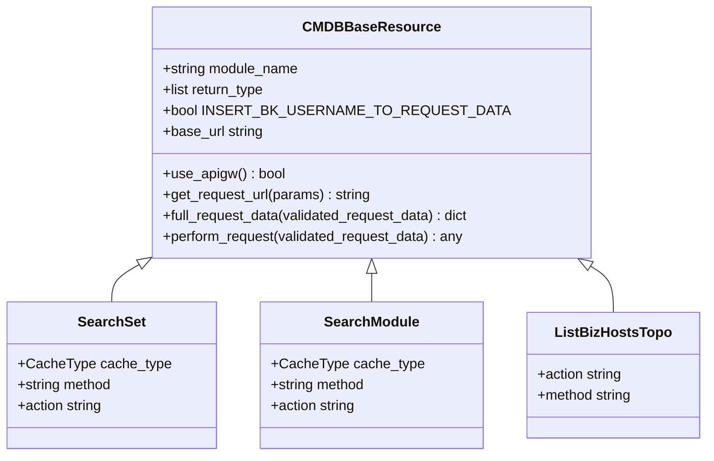
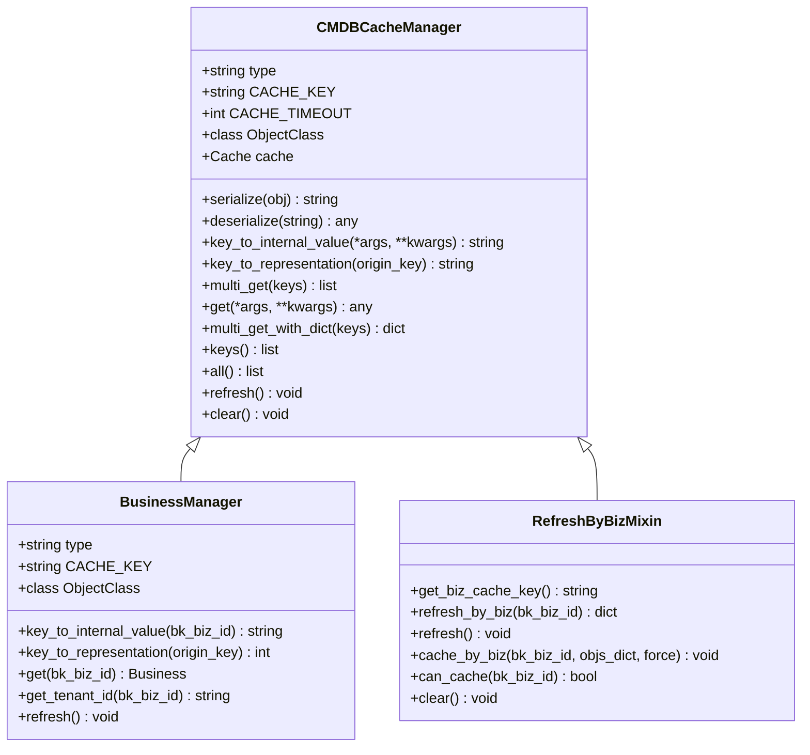
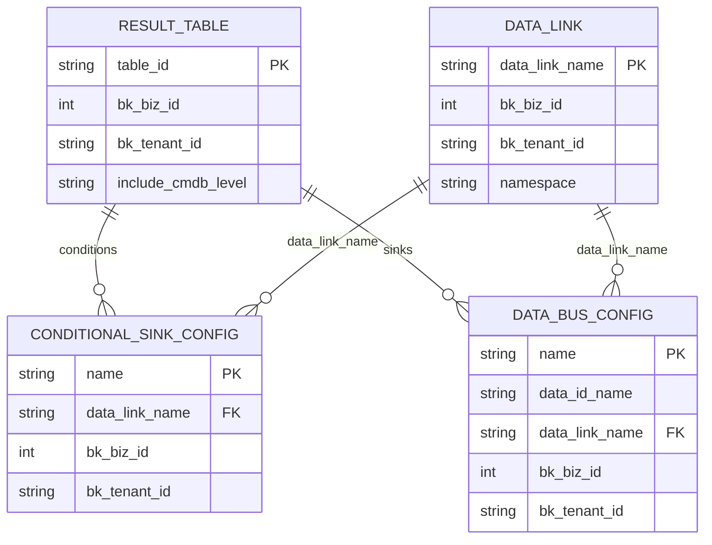
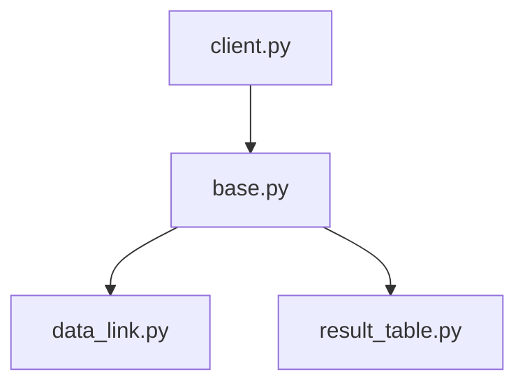

# CMDB集成

<cite>
**本文档引用的文件**   
- [client.py](file://bkmonitor/api/cmdb/client.py#L1-L457)
- [base.py](file://bkmonitor/alarm_backends/core/cache/cmdb/base.py#L1-L282)
- [business.py](file://bkmonitor/alarm_backends/core/cache/cmdb/business.py#L1-L83)
- [data_link.py](file://bkmonitor/metadata/models/data_link/data_link.py#L313-L348)
- [result_table.py](file://bkmonitor/metadata/models/result_table.py#L2663-L2691)
</cite>

## 目录
1. [简介](#简介)
2. [项目结构](#项目结构)
3. [核心组件](#核心组件)
4. [架构概述](#架构概述)
5. [详细组件分析](#详细组件分析)
6. [依赖分析](#依赖分析)
7. [性能考虑](#性能考虑)
8. [故障排除指南](#故障排除指南)
9. [结论](#结论)

## 简介
本文档详细阐述了蓝鲸监控平台（bk-monitor）与蓝鲸配置管理数据库（CMDB）的集成机制。文档涵盖了主机信息同步流程、拓扑关系获取方式、服务模板与集群信息的对接方法。详细解释了API调用细节，包括认证方式、请求参数和响应数据结构。提供了通过SDK获取主机列表和拓扑数据的实际代码示例。描述了数据缓存策略和同步频率配置。记录了常见集成问题，如权限不足、数据不一致等，并提供了解决方案。最后，包含了批量查询和增量同步等性能优化建议。

## 项目结构
蓝鲸监控平台的项目结构清晰，模块化设计。CMDB集成相关的代码主要分布在`api/cmdb`和`alarm_backends/core/cache/cmdb`目录下。`api/cmdb`目录包含了与CMDB交互的API客户端实现，而`alarm_backends/core/cache/cmdb`目录则包含了CMDB数据的缓存管理机制。

**图示来源**
- [client.py](file://bkmonitor/api/cmdb/client.py#L1-L457)
- [base.py](file://bkmonitor/alarm_backends/core/cache/cmdb/base.py#L1-L282)
- [data_link.py](file://bkmonitor/metadata/models/data_link/data_link.py#L313-L348)
- [result_table.py](file://bkmonitor/metadata/models/result_table.py#L2663-L2691)

## 核心组件
CMDB集成的核心组件包括API客户端、缓存管理器和数据模型。API客户端负责与CMDB进行HTTP通信，缓存管理器负责管理CMDB数据的本地缓存，数据模型则定义了CMDB数据在监控平台中的存储结构。

**组件来源**
- [client.py](file://bkmonitor/api/cmdb/client.py#L1-L457)
- [base.py](file://bkmonitor/alarm_backends/core/cache/cmdb/base.py#L1-L282)
- [data_link.py](file://bkmonitor/metadata/models/data_link/data_link.py#L313-L348)

## 架构概述
CMDB集成的架构分为三层：API层、缓存层和数据模型层。API层通过HTTP请求与CMDB进行交互，获取主机、拓扑、服务模板等信息。缓存层将这些信息缓存在本地Redis中，以提高访问速度和减少对CMDB的压力。数据模型层则将这些信息与监控平台的其他数据进行关联和存储。

**图示来源**
- [client.py](file://bkmonitor/api/cmdb/client.py#L1-L457)
- [base.py](file://bkmonitor/alarm_backends/core/cache/cmdb/base.py#L1-L282)

## 详细组件分析

### API客户端分析
API客户端是CMDB集成的入口，负责封装所有与CMDB的API调用。它基于`CMDBBaseResource`基类，通过继承和重写方法来实现具体的API功能。

#### 类图

**图示来源**
- [client.py](file://bkmonitor/api/cmdb/client.py#L1-L457)

### 缓存管理器分析
缓存管理器是CMDB集成的核心，负责管理CMDB数据的本地缓存。它基于`CMDBCacheManager`基类，通过继承和重写方法来实现具体的缓存功能。

#### 类图

**图示来源**
- [base.py](file://bkmonitor/alarm_backends/core/cache/cmdb/base.py#L1-L282)
- [business.py](file://bkmonitor/alarm_backends/core/cache/cmdb/business.py#L1-L83)

### 数据模型分析
数据模型定义了CMDB数据在监控平台中的存储结构。它通过`ResultTable`和`DataLink`等模型来存储和关联CMDB数据。

#### 实体关系图

**图示来源**
- [data_link.py](file://bkmonitor/metadata/models/data_link/data_link.py#L313-L348)
- [result_table.py](file://bkmonitor/metadata/models/result_table.py#L2663-L2691)

## 依赖分析
CMDB集成的依赖关系清晰，API客户端依赖于缓存管理器，缓存管理器依赖于数据模型。这种分层设计使得各组件职责明确，易于维护和扩展。

**图示来源**
- [client.py](file://bkmonitor/api/cmdb/client.py#L1-L457)
- [base.py](file://bkmonitor/alarm_backends/core/cache/cmdb/base.py#L1-L282)
- [data_link.py](file://bkmonitor/metadata/models/data_link/data_link.py#L313-L348)
- [result_table.py](file://bkmonitor/metadata/models/result_table.py#L2663-L2691)

## 性能考虑
CMDB集成在性能方面做了大量优化。通过本地缓存减少对CMDB的直接调用，通过批量查询和增量同步减少网络开销。缓存的过期时间设置为7天，确保数据的时效性。

## 故障排除指南
常见集成问题包括权限不足、数据不一致等。解决方案包括检查API密钥、重新同步数据、清理缓存等。

**组件来源**
- [client.py](file://bkmonitor/api/cmdb/client.py#L1-L457)
- [base.py](file://bkmonitor/alarm_backends/core/cache/cmdb/base.py#L1-L282)

## 结论
CMDB集成是蓝鲸监控平台的重要组成部分，通过API客户端、缓存管理器和数据模型的协同工作，实现了与蓝鲸CMDB的高效集成。该集成机制设计合理，性能优越，易于维护和扩展。