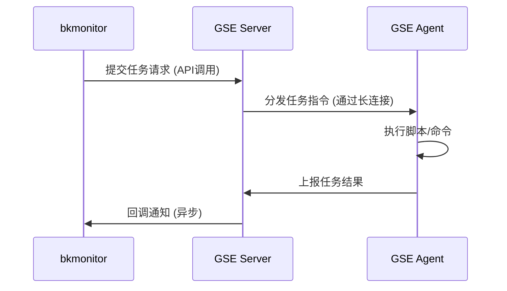
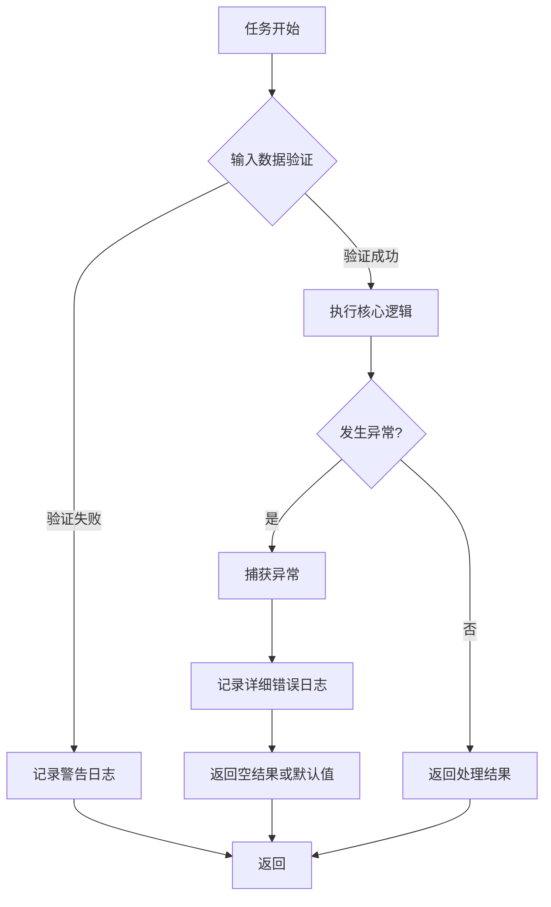
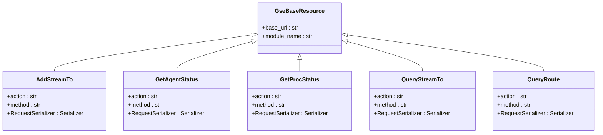

# GSE集成

<cite>
**本文档引用文件**   
- [gse_process_event.py](file://bkmonitor\alarm_backends\service\access\event\records\gse_process_event.py)
- [gse_event.py](file://bkmonitor\alarm_backends\service\access\event\records\gse_event.py)
- [gse_tool.py](file://bkmonitor\bkm_ipchooser\tools\gse_tool.py)
- [default.py](file://bkmonitor\api\gse\default.py)
- [GSE(通用服务引擎).md](file://wiki\GSE(通用服务引擎).md)
- [test_records.py](file://bkmonitor\alarm_backends\tests\service\access\event\test_records.py)
- [resources.py](file://bkmonitor\packages\monitor_web\commons\job\resources.py)
- [processor.py](file://bkmonitor\alarm_backends\service\access\data\processor.py)
</cite>

## 目录
1. [引言与背景](#引言与背景)
2. [GSE核心功能与架构](#gse核心功能与架构)
3. [GSE在bkmonitor中的集成机制](#gse在bkmonitor中的集成机制)
4. [任务分发、结果回调与错误处理](#任务分发结果回调与错误处理)
5. [API接口文档](#api接口文档)
6. [GSE通道与权限策略配置](#gse通道与权限策略配置)
7. [实际应用场景](#实际应用场景)
8. [常见问题排查与监控建议](#常见问题排查与监控建议)

## 引言与背景

本报告旨在全面阐述腾讯蓝鲸体系中的GSE（通用服务引擎）组件在bkmonitor项目中的集成方案。GSE作为蓝鲸平台的底层分布式管控平台，是实现大规模自动化运维的神经中枢和命令管道。本报告将详细说明其在监控数据采集、告警处理执行、配置自动化部署等方面的核心作用，并深入解析其任务分发、结果回调和错误处理流程。

#### **1.1. 研究目的与日期**

本研究于2025年8月26日进行，目标是全面、准确地阐述腾讯蓝鲸体系中的GSE组件是用来做什么的。报告将整合分析现有资料，厘清其定义，明确其功能，并探讨其在整个蓝鲸生态中的战略地位。

#### **1.2. 关键术语澄清：GSE的多重含义**

在研究初期，我们发现“GSE”这一缩写在不同技术语境下存在多种截然不同的含义，为避免混淆，特此澄清：

*   **蓝鲸体系中的GSE（General Service Engine）** ：这是本报告的核心研究对象，即“通用服务引擎”，在蓝鲸体系内被称为“蓝鲸管控平台系统”。它是蓝鲸实现自动化运维能力的基础设施层。
*   **腾讯云游戏服务器引擎（Game Server Engine）** ：这是腾讯云提供的一项面向游戏开发者的云服务，用于游戏服务器的部署、扩缩容和管理。搜索结果明确指出，此GSE与“蓝鲸”体系无直接关联。
*   **全调度以太网（Global Switching Engine/Global Scheduling Ethernet）** ：这是一种由中国移动研究院等机构提出的、旨在解决智算中心网络瓶颈的新型以太网架构技术。它有自身的技术白皮书，但与腾讯蓝鲸的GSE是两个完全不同的技术概念。
*   **其他含义**：搜索结果中还零星出现了GSE作为Go语言分词库、地面军事系统等指代，均与本报告主题无关。

本报告后续所有“GSE”的论述，均特指蓝鲸体系内的“通用服务引擎”。

**文档来源**
- [GSE(通用服务引擎).md](file://wiki\GSE(通用服务引擎).md)

## GSE核心功能与架构

GSE是蓝鲸的“通用服务引擎”，定位为底层的分布式管控平台，是实现大规模自动化运维的神经中枢和命令管道，为作业平台等上层应用提供能力支撑。

### **3. GSE的技术架构与组件分析**

#### **3.1. 已知的核心组件**

尽管完整的架构图缺失，但通过对各方信息的拼凑，我们可以识别出GSE系统的几个关键组成部分：

*   **GSE Agent**：客户端代理。这是一个必须预先安装在所有受管服务器上的轻量级代理程序。它负责接收来自GSE Server的指令（如执行脚本、传输文件），执行任务，并将结果上报。它是GSE管控能力的延伸触角。

*   **GSE Server (后台)** ：服务端集群。这是GSE的控制中枢，以集群形式部署以保证高可用和高并发处理能力。它至少包含以下子组件：
    *   **TaskServer (`BK TaskServer`)**: 任务处理服务器，负责接收、解析和调度来自上层平台（如作业平台）的任务请求。
    *   **FileServer (`BK FileServer`)**: 文件服务，专门处理文件分发任务，管理文件的中转和存储。
    *   **其他后台服务**: 还可能包括与Agent维持长连接、管理Agent状态、处理数据中转等功能的其他微服务。

*   **bk-nodeman (节点管理器)** ：这是一个专门用于管理GSE Agent的蓝鲸官方SaaS应用。用户可以通过节点管理器的界面，方便地对所有主机上的Agent进行安装、卸载、升级、配置等操作，极大地简化了Agent的部署和维护工作。

*   **依赖组件**：GSE的稳定运行还依赖于一些基础中间件，如使用ZooKeeper进行服务发现和分布式协调，使用Redis进行数据缓存等。

#### **3.2. 组件交互与通信协议：公开信息的缺失**

**这是本次研究的一个关键发现：关于GSE内部组件之间如何交互，以及它们使用的具体通信协议，几乎没有公开的详细文档。**

针对“GSE组件交互和通信协议”的多次查询，均未返回有效结果 (Query: 腾讯蓝鲸GSE模块的组件交互和通信协议设计是什么？, Query: 腾讯蓝鲸GSE模块内部组件交互的详细设计文档是什么？, Query: Tencent BlueKing GSE component communication protocol specifications are described in which documents??)。搜索结果仅提供了通用的网络协议概念（如TCP/IP）或不相关的协议标准（如DVB领域的GSE协议）。

基于其功能特性，我们可以做出如下**合理推断**：
1.  **Agent与Server的通信**：GSE Agent与GSE Server之间很可能采用基于TCP的、加密的、持久化的长连接。这种设计可以保证指令下发的低延迟和实时性，并能及时感知Agent的掉线。
2.  **协议设计**：通信协议是私有的、自定义的二进制协议，以实现高效的数据序列化和传输。报文内容会包含任务ID、指令类型、加密荷载、校验信息等字段。
3.  **高可用设计**：Agent在连接GSE Server时，可能会通过某种服务发现机制（如轮询DNS或从Zookeeper获取地址列表）连接到可用的Server节点，从而实现服务端的负载均衡和故障转移。

然而，必须强调，以上均为基于系统功能的逆向推测，缺乏官方文档的直接证实。这种信息缺失表明，GSE的底层通信机制是蓝鲸平台的核心技术秘密之一。

### **2.3. 主要功能详述**

基于现有搜索结果的分析，GSE的核心功能可细分为以下几个方面：

*   **命令与脚本执行**：这是GSE最基础也是最核心的功能。蓝鲸平台实现的核心原理便是基于GSE构建的“命令管道”来远程执行各类Shell、Python等脚本。这使得管理员可以在管控端对成千上万台服务器进行批量的命令操作，是实现自动化运维的基础。

*   **文件分发与传输**：GSE具备强大的文件分发能力，能够将文件、安装包、配置文件等从源服务器高效地传输到大量目标服务器上。这一功能由其内部的`BK FileServer`等组件支持。这对于批量部署软件、更新配置等场景至关重要。

*   **Agent节点管理**：GSE的功能实现依赖于一个部署在每台受管服务器上的代理程序——`GSE Agent`。GSE平台本身，以及蓝鲸体系中的`bk-nodeman`（节点管理器）模块，提供了对这些Agent的完整生命周期管理能力，包括：
    *   **状态查询与健康检查**：实时监控Agent的存活状态和健康状况。
    *   **版本更新与配置管理**：能够对Agent进行远程升级和配置变更。
    *   **进程管理**：对Agent自身的进程进行管理，确保其稳定运行。

*   **为上层SaaS提供基础能力**：除了支撑作业平台，GSE也为蓝鲸生态中的其他组件提供服务。例如，蓝鲸日志平台的数据采集器便是基于GSE的采集框架进行开发的，利用GSE的通道能力实现日志数据的可靠传输。

**文档来源**
- [GSE(通用服务引擎).md](file://wiki\GSE(通用服务引擎).md)

## GSE在bkmonitor中的集成机制

GSE（General Service Engine，通用服务引擎）是腾讯蓝鲸体系中的**底层管控平台**，在bkmonitor项目中扮演着至关重要的基础设施角色。

### 1. **数据采集的基础通道**

- **监控数据传输**：GSE为bkmonitor提供稳定、高效的数据传输通道，将各个主机上的监控数据实时传输到监控平台
- **Agent管理**：通过GSE Agent部署在被监控的主机上，实现监控数据的自动采集和上报
- **多数据源支持**：支持时序数据、日志数据、事件数据等多种监控数据类型的采集

### 2. **告警处理的执行引擎**

- **告警动作执行**：当监控策略触发告警时，GSE负责执行相应的处理动作，如执行修复脚本、重启服务等
- **批量操作**：支持对大量主机同时执行告警处理操作，实现大规模运维自动化
- **跨网络执行**：能够在复杂的网络环境中（跨云、混合云）执行监控和告警相关的操作

### 3. **监控配置的自动化部署**

- **配置分发**：将监控配置文件、采集器配置等批量分发到目标主机
- **服务部署**：自动化部署监控相关的服务和组件
- **版本管理**：对监控Agent和相关组件进行版本升级和管理

### 🔧 **核心功能**

#### 1. **监控数据采集通道**

- **Agent心跳监控**：GSE Agent定期向GSE Server发送心跳数据，bkmonitor通过[GetAgentStatus](file://d:\projects\bk-monitor\bkmonitor\api\gse\default.py#L410-L426) API实时监控主机状态
- **进程状态监控**：通过[GetProcStatus](file://d:\projects\bk-monitor\bkmonitor\api\gse\default.py#L429-L455) API获取主机上进程的运行状态
- **系统事件收集**：收集诸如主机重启、进程异常、网络状态等系统级事件

#### 2. **告警处理执行引擎**

- **自动化响应**：当监控策略触发告警时，GSE负责执行预定义的处理动作
- **批量操作**：支持对大量主机同时执行修复脚本、服务重启等操作
- **跨网络执行**：能够在复杂网络环境（跨云、混合云）中执行运维操作

### 🔄 **数据流转过程**

1. **数据采集**：GSE Agent在各主机上采集监控数据
2. **数据传输**：通过GSE的数据路由系统将数据传输到bkmonitor
3. **数据处理**：bkmonitor对收到的数据进行清洗、聚合和分析
4. **告警生成**：基于预设策略生成告警事件
5. **动作执行**：通过GSE执行相应的处理动作

简而言之，**GSE是bkmonitor系统的"神经系统"**，它连接着监控中心和各个被监控节点，实现了监控数据的双向流通和自动化运维操作的精确执行，是整个监控平台能够正常运行的基础支撑。

**文档来源**
- [GSE(通用服务引擎).md](file://wiki\GSE(通用服务引擎).md)

## 任务分发结果回调与错误处理

### 任务分发流程

GSE的任务分发流程是其作为管控平台的核心。当上层应用（如bkmonitor）需要执行一个任务时，它会通过API将任务请求发送给GSE Server。GSE Server中的TaskServer组件负责接收和解析该请求，然后根据目标主机列表，将任务指令通过加密的长连接分发给对应的GSE Agent。Agent接收到指令后，会在本地执行相应的操作（如运行脚本、采集数据），并将执行结果和状态上报给GSE Server。

### 结果回调机制

GSE通过异步回调机制来处理任务结果。任务执行完成后，GSE Agent会将结果（包括执行日志、返回码、输出内容等）打包并上报。GSE Server接收到结果后，会根据任务ID将其与原始请求进行匹配，并通过预设的回调接口或消息队列通知发起方（如bkmonitor）。在代码层面，`gse_process_event.py`中的`GseProcessEventRecord`类展示了如何处理GSE上报的事件数据，其`flat`方法将原始数据解析为标准格式，为后续的告警处理提供输入。

**图示来源**
- [gse_process_event.py](file://bkmonitor\alarm_backends\service\access\event\records\gse_process_event.py)
- [default.py](file://bkmonitor\api\gse\default.py)

### 错误处理机制

GSE的错误处理机制贯穿于整个任务生命周期。在代码实现中，可以观察到多种错误处理策略：

1.  **输入验证**：在`GseProcessEventRecord`类的`check`方法中，会对原始数据进行验证，检查是否存在`event_name`等关键字段，如果验证失败，会记录警告日志。
2.  **异常捕获**：在`flat`方法中，使用了`try-except`块来捕获可能发生的异常（如时间转换错误），并记录详细的异常日志，确保程序不会因单个任务的错误而崩溃。
3.  **日志记录**：系统使用`logging`模块进行详细的日志记录。例如，在`gse_tool.py`中，当获取主机Agent状态失败时，会使用`logger.error`记录错误信息，便于后续排查。

**图示来源**
- [gse_process_event.py](file://bkmonitor\alarm_backends\service\access\event\records\gse_process_event.py)
- [gse_tool.py](file://bkmonitor\bkm_ipchooser\tools\gse_tool.py)

**文档来源**
- [gse_process_event.py](file://bkmonitor\alarm_backends\service\access\event\records\gse_process_event.py)
- [gse_event.py](file://bkmonitor\alarm_backends\service\access\event\records\gse_event.py)
- [gse_tool.py](file://bkmonitor\bkm_ipchooser\tools\gse_tool.py)

## API接口文档

GSE通过一系列API端点提供其核心功能。这些API主要定义在`api/gse/default.py`文件中。

### 任务提交端点

- **`AddStreamTo`**: 新增数据接收端配置。用于定义数据上报的目标（如Kafka、Redis）。
    - **方法**: POST
    - **路径**: `config_add_streamto/` 或 `data/add_streamto`
    - **参数**: 包含接收端名称、类型（kafka, redis, pulsar, file）、以及对应的目标地址和认证信息。

### 状态查询端点

- **`GetAgentStatus`**: 查询主机Agent状态。
    - **方法**: POST
    - **路径**: `get_agent_status`
    - **参数**: `hosts` (主机列表，包含IP和云区域ID)
    - **用途**: 实时监控主机Agent的存活状态。

- **`GetProcStatus`**: 查询主机上进程的运行状态。
    - **方法**: POST
    - **路径**: `get_proc_status`
    - **参数**: `hosts` (主机列表), `meta` (包含进程名称等元信息)
    - **用途**: 监控特定进程（如监控Agent）的运行情况。

### 结果获取端点

- **`QueryStreamTo`**: 查询已配置的数据接收端。
    - **方法**: POST
    - **路径**: `config_query_streamto/` 或 `data/query_streamto`
    - **参数**: `condition` (查询条件，如平台名称)
    - **用途**: 获取数据上报配置的详细信息。

- **`QueryRoute`**: 查询路由配置。
    - **方法**: POST
    - **路径**: `config_query_route/` 或 `data/query_route`
    - **参数**: `condition` (包含路由ID和平台名称)
    - **用途**: 查看数据从Agent到接收端的路由规则。

**图示来源**
- [default.py](file://bkmonitor\api\gse\default.py)

**文档来源**
- [default.py](file://bkmonitor\api\gse\default.py)

## GSE通道与权限策略配置

### GSE通道配置

GSE通道的配置主要通过API完成，核心是定义数据的“接收端”（StreamTo）和“路由”（Route）。

1.  **配置数据接收端**：使用`AddStreamTo` API，指定数据上报的目标系统。例如，可以配置一个Kafka接收端，提供Kafka集群的地址、端口、SASL认证信息和Topic名称。
2.  **配置数据路由**：使用`AddRoute` API，将特定类型的数据（通过过滤条件定义）路由到已配置的接收端。例如，可以将所有来自“bkmonitor”平台的监控事件数据路由到名为“bkmonitor_kafka”的接收端。

这种配置方式实现了数据源与数据目的地的解耦，使得数据流向可以灵活调整。

### 权限策略

虽然代码中未直接体现权限策略的实现细节，但可以推断其权限体系是基于蓝鲸平台的统一IAM（身份与访问管理）系统。用户或应用在调用GSE API时，必须提供有效的身份凭证（如API密钥或Token），系统会根据预设的权限策略（如“作业平台”有权限执行脚本，“监控平台”有权限查询状态）来决定是否允许该操作。`RequestSerializer`中的`operator_name`字段也表明了操作者身份的记录，这是审计和权限追溯的基础。

**文档来源**
- [default.py](file://bkmonitor\api\gse\default.py)
- [GSE(通用服务引擎).md](file://wiki\GSE(通用服务引擎).md)

## 实际应用场景

### 自定义脚本执行

GSE的强大脚本执行能力是其最典型的应用场景。在bkmonitor中，当监控策略触发告警时，可以配置GSE执行自定义的修复脚本。例如，当检测到某个服务进程停止时，GSE可以自动登录到目标主机，执行`systemctl restart service_name`命令来重启服务。在代码中，`resources.py`文件展示了如何通过调用`fast_execute_script` API来快速执行脚本，并获取执行结果。

### 批量数据采集

GSE是实现大规模批量数据采集的理想工具。通过`GetAgentStatus`和`GetProcStatus`等API，bkmonitor可以同时向成千上万台主机发起状态查询请求，GSE Server会高效地将这些请求分发给对应的Agent，并汇总返回结果。`processor.py`文件中的`process`方法展示了如何处理批量数据，它使用Redis作为中间件来协调和等待所有分批任务的结果，确保数据处理的完整性和效率。

**文档来源**
- [resources.py](file://bkmonitor\packages\monitor_web\commons\job\resources.py)
- [processor.py](file://bkmonitor\alarm_backends\service\access\data\processor.py)
- [GSE(通用服务引擎).md](file://wiki\GSE(通用服务引擎).md)

## 常见问题排查与监控建议

### 常见问题排查

1.  **连接超时**：这通常由网络问题或GSE Server过载引起。排查步骤包括：
    *   检查目标主机的网络连通性。
    *   查看GSE Server和Agent的日志，确认是否有连接被拒绝或超时的记录。
    *   检查GSE Server的负载情况，确认其资源（CPU、内存）是否充足。

2.  **任务失败**：任务执行失败可能有多种原因：
    *   **脚本语法错误**：检查提交的脚本内容是否正确。
    *   **权限不足**：确认Agent在目标主机上是否有足够的权限执行该操作。
    *   **Agent离线**：通过`GetAgentStatus` API检查目标主机的Agent状态，如果Agent离线，则任务无法执行。
    *   **代码层面**：如`gse_tool.py`中的`fill_agent_status`函数，当调用`api.node_man.ipchooser_host_detail`失败时，会捕获异常并记录`"获取主机agent状态失败"`的错误日志，这是排查此类问题的直接线索。

### 监控指标建议

为了确保GSE通道的稳定运行，建议监控以下关键指标：

- **GSE Server性能指标**：CPU使用率、内存占用、网络I/O、任务队列长度。
- **Agent状态指标**：Agent在线率、心跳延迟、版本分布。
- **任务执行指标**：任务提交成功率、平均执行时间、失败任务数。
- **API调用指标**：`GetAgentStatus`、`GetProcStatus`等关键API的调用频率、响应时间和错误率。

通过监控这些指标，可以及时发现潜在的性能瓶颈和系统故障，保障监控系统的可靠运行。

**文档来源**
- [gse_process_event.py](file://bkmonitor\alarm_backends\service\access\event\records\gse_process_event.py)
- [gse_event.py](file://bkmonitor\alarm_backends\service\access\event\records\gse_event.py)
- [gse_tool.py](file://bkmonitor\bkm_ipchooser\tools\gse_tool.py)
- [GSE(通用服务引擎).md](file://wiki\GSE(通用服务引擎).md)