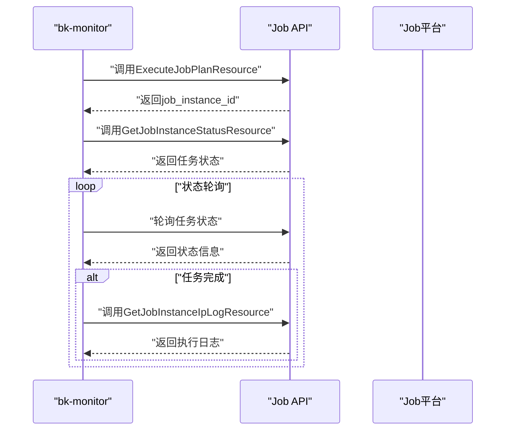
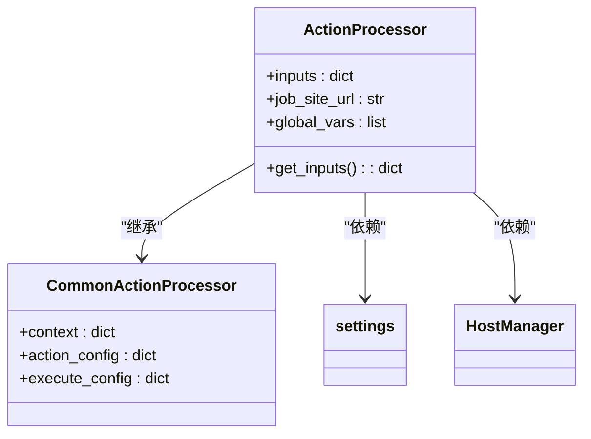
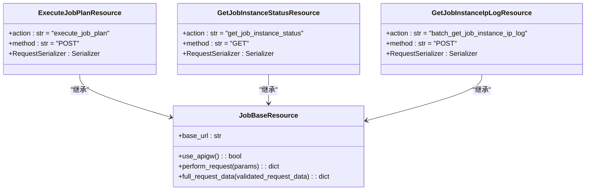
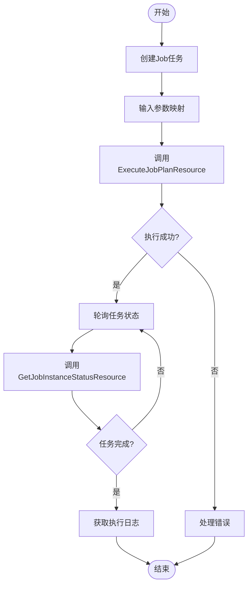

# Job平台集成

<cite>
**本文档引用的文件**   
- [processor.py](file://bkmonitor/alarm_backends/service/fta_action/job/processor.py)
- [default.py](file://bkmonitor/api/job/default.py)
- [action_plugin_initial.json](file://bkmonitor/support-files/fta/action_plugin_initial.json)
- [action.py](file://bkmonitor/bkmonitor/models/fta/action.py)
- [default.py](file://bkmonitor/config/default.py)
</cite>

## 目录
1. [简介](#简介)
2. [核心组件](#核心组件)
3. [API调用流程](#api调用流程)
4. [详细组件分析](#详细组件分析)
5. [典型用例](#典型用例)
6. [常见问题与解决方案](#常见问题与解决方案)

## 简介
本文档详细描述了蓝鲸监控平台（bk-monitor）与蓝鲸作业平台（Job平台）的集成方式。通过告警触发自动化运维任务，实现故障自愈和自动化处理。文档涵盖了任务模板配置、参数传递、执行结果反馈、API调用流程、Python SDK使用示例、权限配置和安全策略等关键内容。

## 核心组件
Job平台集成的核心组件包括Job动作处理器、API资源类和动作插件配置。这些组件共同实现了告警触发自动化运维任务的功能。

**本文档引用的文件**   
- [processor.py](file://bkmonitor/alarm_backends/service/fta_action/job/processor.py)
- [default.py](file://bkmonitor/api/job/default.py)
- [action_plugin_initial.json](file://bkmonitor/support-files/fta/action_plugin_initial.json)

## API调用流程
Job平台的API调用流程包括任务启动、状态轮询和日志获取三个主要步骤。



**图示来源**
- [default.py](file://bkmonitor/api/job/default.py#L130-L202)

**本文档引用的文件**
- [default.py](file://bkmonitor/api/job/default.py)

## 详细组件分析

### Job动作处理器分析
Job动作处理器负责处理告警并触发Job任务，是集成的核心逻辑实现。



**图示来源**
- [processor.py](file://bkmonitor/alarm_backends/service/fta_action/job/processor.py#L0-L58)

**本文档引用的文件**
- [processor.py](file://bkmonitor/alarm_backends/service/fta_action/job/processor.py)

### API资源类分析
API资源类定义了与Job平台交互的接口，包括任务创建、状态查询和日志获取。



**图示来源**
- [default.py](file://bkmonitor/api/job/default.py#L130-L202)

**本文档引用的文件**
- [default.py](file://bkmonitor/api/job/default.py)

### 动作插件配置分析
动作插件配置定义了Job平台集成的完整工作流和参数映射规则。



**图示来源**
- [action_plugin_initial.json](file://bkmonitor/support-files/fta/action_plugin_initial.json#L94-L185)

**本文档引用的文件**
- [action_plugin_initial.json](file://bkmonitor/support-files/fta/action_plugin_initial.json)

## 典型用例

### 自动重启服务
当监控系统检测到服务进程异常时，自动触发Job平台的重启脚本。

```python
# Python SDK使用示例
from api.job.default import ExecuteJobPlanResource

def auto_restart_service(bk_biz_id, template_id, target_ip):
    """
    自动重启服务
    """
    params = {
        "bk_biz_id": bk_biz_id,
        "job_plan_id": template_id,
        "global_var_list": [
            {
                "id": 1,
                "value": target_ip
            }
        ]
    }
    
    result = ExecuteJobPlanResource().request(params)
    return result
```

### 磁盘清理
当磁盘使用率超过阈值时，自动执行磁盘清理任务。

```python
# 磁盘清理任务配置
job_config = {
    "execute_config": {
        "template_id": 1000043,
        "template_detail": {
            "1000005_3": "{{alert.event.ip}}",
            "1000004_1": "清理临时文件"
        },
        "timeout": 60,
    },
    "name": "磁盘清理",
    "desc": "自动清理磁盘空间",
    "is_enabled": True,
    "plugin_id": 3,
    "bk_biz_id": 2
}
```

**本文档引用的文件**
- [action_plugin_initial.json](file://bkmonitor/support-files/fta/action_plugin_initial.json)
- [processor.py](file://bkmonitor/alarm_backends/service/fta_action/job/processor.py)

## 常见问题与解决方案

### 任务超时
**问题描述**：Job任务执行时间过长，导致超时。

**解决方案**：
1. 在策略配置中增加超时时间
2. 优化脚本执行效率
3. 将大任务拆分为多个小任务

```python
# 增加超时时间配置
job_config = {
    "execute_config": {
        "timeout": 600,  # 设置为600秒
        "template_id": 1000043
    }
}
```

### 参数错误
**问题描述**：传递的参数格式不正确，导致任务执行失败。

**解决方案**：
1. 检查参数映射规则
2. 验证参数类型和格式
3. 使用正确的变量引用语法

```python
# 正确的参数传递方式
global_vars = []
for param in template_detail:
    var_id, category = param["key"].split("_")
    if category == "3":  # IP类型参数
        for ip in param["value"].split(";"):
            if ":" in ip:
                cloud_id, inner_ip = ip.split(":")
            else:
                inner_ip = ip
                cloud_id = getattr(context["alert"].event, "bk_cloud_id", 0)
            global_vars.append({
                "id": int(var_id),
                "server": {"ip_list": [{"bk_cloud_id": cloud_id, "ip": inner_ip}]}
            })
    else:
        global_vars.append({"id": int(var_id), "value": param["value"]})
```

**本文档引用的文件**
- [processor.py](file://bkmonitor/alarm_backends/service/fta_action/job/processor.py)
- [action_plugin_initial.json](file://bkmonitor/support-files/fta/action_plugin_initial.json)