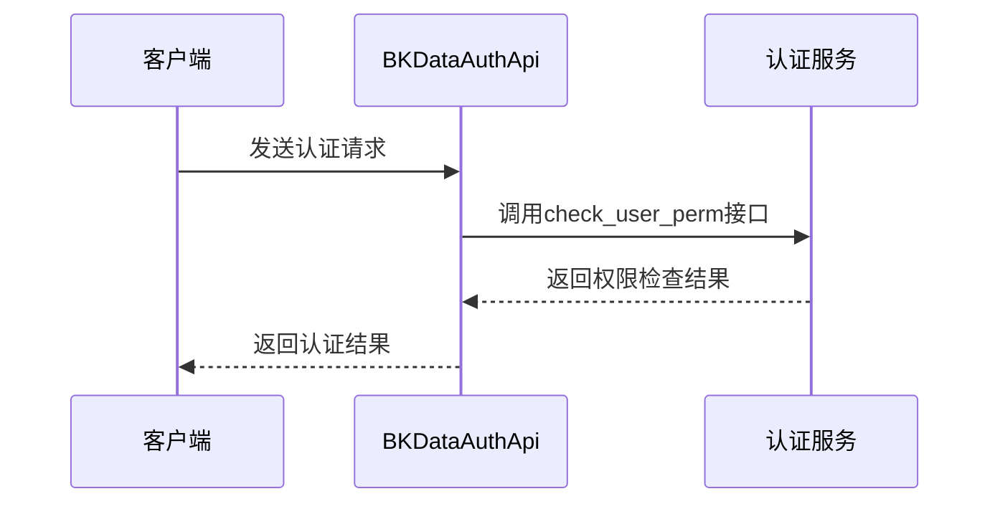
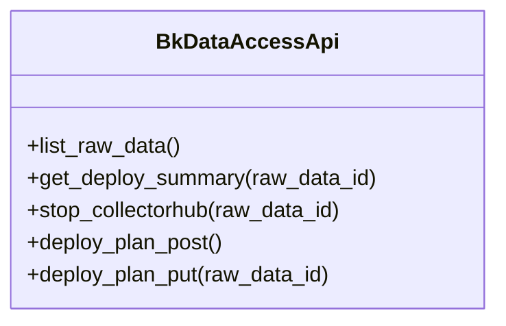
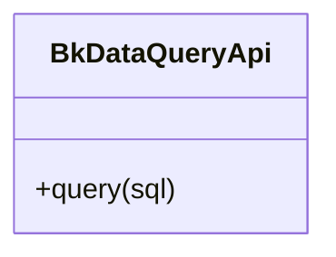
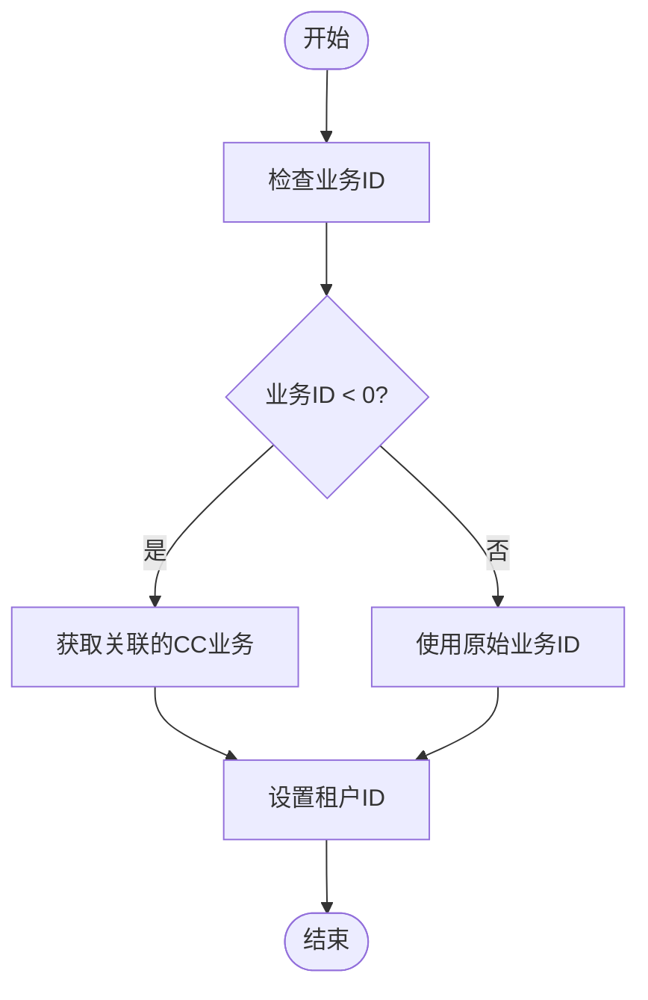
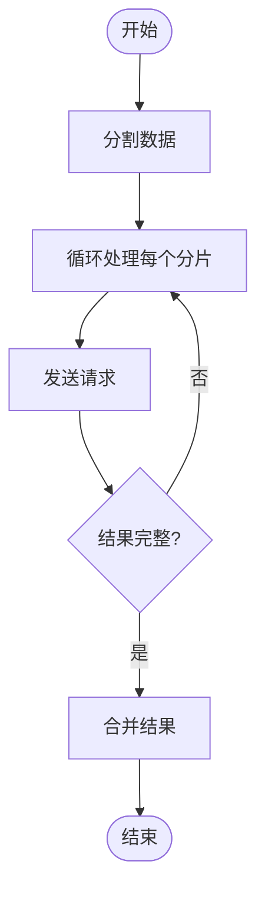
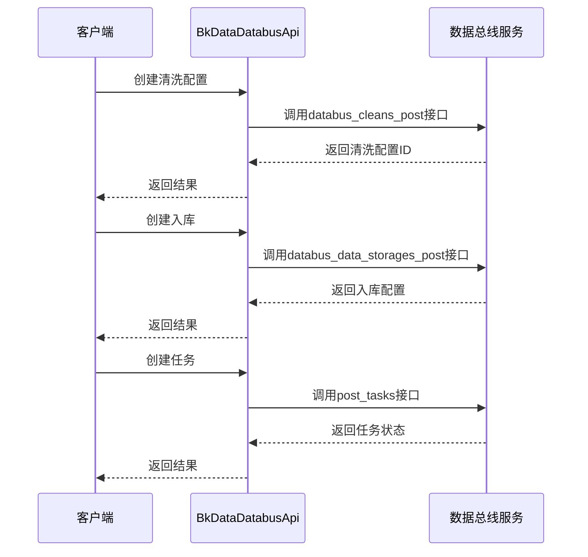
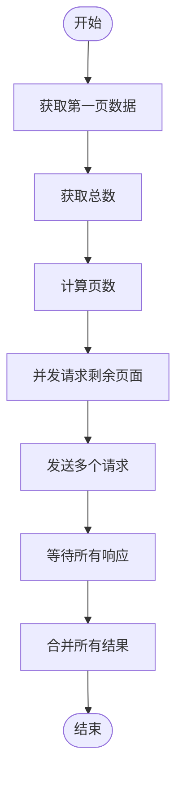
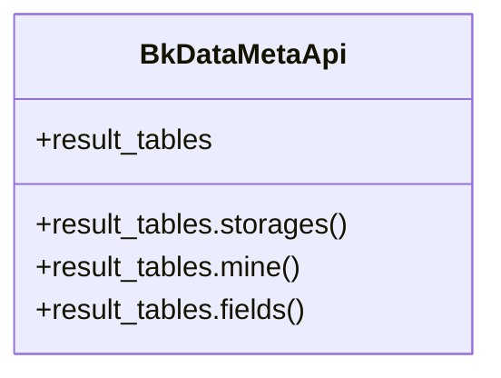
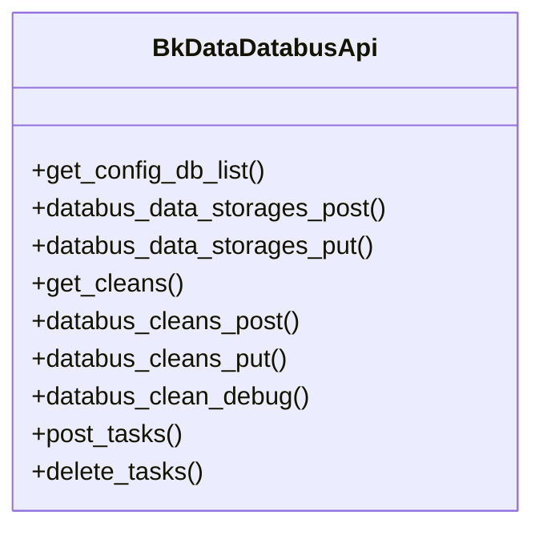
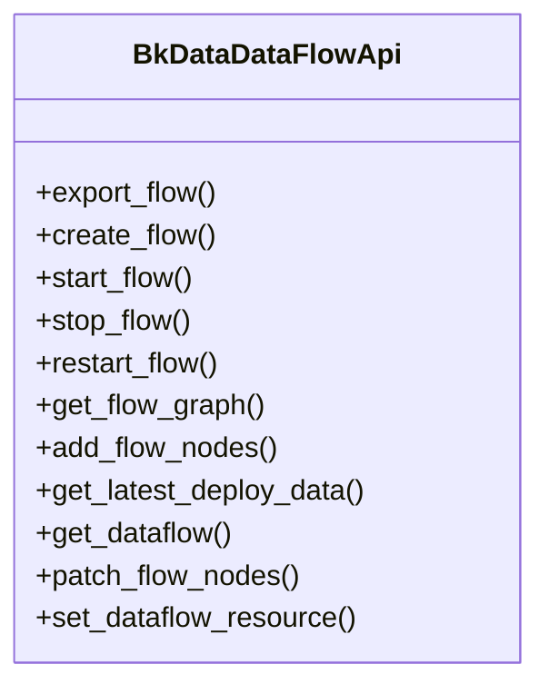

# BKData数据平台集成

<cite>
**本文档引用的文件**
- [bkdata_access.py](file://bklog/apps/api/modules/bkdata_access.py)
- [bkdata_query.py](file://bklog/apps/api/modules/bkdata_query.py)
- [bkdata_auth.py](file://bklog/apps/api/modules/bkdata_auth.py)
- [bkdata_meta.py](file://bklog/apps/api/modules/bkdata_meta.py)
- [bkdata_databus.py](file://bklog/apps/api/modules/bkdata_databus.py)
- [bkdata_dataflow.py](file://bklog/apps/api/modules/bkdata_dataflow.py)
- [utils.py](file://bklog/apps/api/modules/utils.py)
- [base.py](file://bklog/apps/api/base.py)
- [bkdata.py](file://bklog/apps/utils/bkdata.py)
</cite>

## 目录
1. [简介](#简介)
2. [核心组件](#核心组件)
3. [认证授权流程](#认证授权流程)
4. [数据接入与查询接口](#数据接入与查询接口)
5. [数据权限控制](#数据权限控制)
6. [查询性能优化](#查询性能优化)
7. [数据接入任务创建](#数据接入任务创建)
8. [实时查询调用](#实时查询调用)
9. [批量数据获取](#批量数据获取)
10. [元数据服务交互](#元数据服务交互)
11. [数据总线与数据流](#数据总线与数据流)

## 简介
BKData数据平台集成文档全面介绍了与BKData的数据接入、查询和分析能力集成。文档详细说明了`bkdata_access.py`和`bkdata_query.py`中提供的数据源连接、数据查询、结果获取等接口的使用方法。同时描述了认证授权流程、数据权限控制、查询性能优化等关键点，并提供了数据接入任务创建、实时查询调用、批量数据获取等场景的代码示例。此外，还解释了与BKData元数据服务、数据总线、数据流等组件的交互机制和最佳实践。

## 核心组件
BKData数据平台集成主要由以下几个核心组件构成：数据接入模块（Access）、数据查询模块（Query）、认证授权模块（Auth）、元数据模块（Meta）、数据总线模块（Databus）和数据流模块（DataFlow）。这些模块通过统一的API网关进行通信，实现了数据的采集、处理、存储和分析功能。

**组件来源**
- [bkdata_access.py](file://bklog/apps/api/modules/bkdata_access.py)
- [bkdata_query.py](file://bklog/apps/api/modules/bkdata_query.py)
- [bkdata_auth.py](file://bklog/apps/api/modules/bkdata_auth.py)
- [bkdata_meta.py](file://bklog/apps/api/modules/bkdata_meta.py)
- [bkdata_databus.py](file://bklog/apps/api/modules/bkdata_databus.py)
- [bkdata_dataflow.py](file://bklog/apps/api/modules/bkdata_dataflow.py)

## 认证授权流程
BKData平台的认证授权流程主要通过`bkdata_auth.py`模块实现。该模块提供了用户权限检查、权限范围获取、认证令牌管理等功能。认证方式支持用户认证和令牌认证两种模式，通过配置`FEATURE_TOGGLE`中的`bkdata_token_auth`开关来控制。



**图示来源**
- [bkdata_auth.py](file://bklog/apps/api/modules/bkdata_auth.py#L49-L58)

**组件来源**
- [bkdata_auth.py](file://bklog/apps/api/modules/bkdata_auth.py)
- [utils.py](file://bklog/apps/api/modules/utils.py#L122-L135)

## 数据接入与查询接口
数据接入与查询接口主要由`bkdata_access.py`和`bkdata_query.py`两个模块提供。`bkdata_access.py`负责数据源的接入和部署管理，而`bkdata_query.py`则提供数据查询功能。

### 数据接入接口
数据接入接口主要包括源数据列表获取、部署计划查询、采集器启停等功能。



**图示来源**
- [bkdata_access.py](file://bklog/apps/api/modules/bkdata_access.py#L50-L97)

### 数据查询接口
数据查询接口提供同步查询功能，支持SQL语法进行数据检索。



**图示来源**
- [bkdata_query.py](file://bklog/apps/api/modules/bkdata_query.py#L45-L53)

**组件来源**
- [bkdata_access.py](file://bklog/apps/api/modules/bkdata_access.py)
- [bkdata_query.py](file://bklog/apps/api/modules/bkdata_query.py)

## 数据权限控制
数据权限控制通过多租户模式实现，每个业务（bk_biz_id）对应一个租户ID。权限控制主要在请求前通过`biz_to_tenant_getter`函数进行处理，确保请求在正确的租户上下文中执行。



**图示来源**
- [utils.py](file://bklog/apps/api/modules/utils.py#L361-L381)

**组件来源**
- [utils.py](file://bklog/apps/api/modules/utils.py)
- [bkdata_auth.py](file://bklog/apps/api/modules/bkdata_auth.py)

## 查询性能优化
查询性能优化主要通过以下几个方面实现：缓存机制、批量请求、并发处理和查询参数优化。

### 缓存机制
通过`cache_time`参数设置接口响应的缓存时间，减少重复请求对后端服务的压力。

### 批量请求
对于大量数据的查询，使用`batch_request`方法进行分片处理，避免单次请求数据量过大。



**图示来源**
- [base.py](file://bklog/apps/api/base.py#L632-L674)

**组件来源**
- [base.py](file://bklog/apps/api/base.py)
- [bkdata.py](file://bklog/apps/utils/bkdata.py)

## 数据接入任务创建
数据接入任务的创建通过`bkdata_databus.py`模块实现，主要包括清洗配置创建、入库创建和任务创建等步骤。



**图示来源**
- [bkdata_databus.py](file://bklog/apps/api/modules/bkdata_databus.py#L86-L122)

**组件来源**
- [bkdata_databus.py](file://bklog/apps/api/modules/bkdata_databus.py)

## 实时查询调用
实时查询调用通过`bkdata_query.py`模块的`query`接口实现，支持SQL语法进行数据检索。查询结果以列表形式返回，便于后续处理。

```python
# 示例代码路径
# file://bklog/apps/utils/bkdata.py#L106-L114
def query(self) -> list:
    params = {"sql": self.to_sql()}
    if settings.FEATURE_TOGGLE.get("bkdata_token_auth", "off") == "on":
        params.update({"bkdata_authentication_method": "token", "bkdata_data_token": settings.BKDATA_DATA_TOKEN})
    else:
        params.update({"bkdata_authentication_method": "user", "bk_username": "admin", "operator": "admin"})
    params.update({"no_request": True})
    return BkDataQueryApi.query(params, request_cookies=False)["list"]
```

**组件来源**
- [bkdata_query.py](file://bklog/apps/api/modules/bkdata_query.py)
- [bkdata.py](file://bklog/apps/utils/bkdata.py)

## 批量数据获取
批量数据获取通过`bulk_request`方法实现，支持分页查询和并发处理，有效提高大数据量查询的效率。



**图示来源**
- [base.py](file://bklog/apps/api/base.py#L676-L741)

**组件来源**
- [base.py](file://bklog/apps/api/base.py)

## 元数据服务交互
元数据服务交互通过`bkdata_meta.py`模块实现，主要提供结果表操作功能，包括结果表的查询、存储信息获取等。



**图示来源**
- [bkdata_meta.py](file://bklog/apps/api/modules/bkdata_meta.py#L48-L67)

**组件来源**
- [bkdata_meta.py](file://bklog/apps/api/modules/bkdata_meta.py)

## 数据总线与数据流
数据总线与数据流组件通过`bkdata_databus.py`和`bkdata_dataflow.py`模块实现，提供了数据清洗、分发、流处理等功能。

### 数据总线功能
数据总线主要负责数据的清洗和入库操作。



**图示来源**
- [bkdata_databus.py](file://bklog/apps/api/modules/bkdata_databus.py#L45-L132)

### 数据流功能
数据流主要负责数据处理流程的管理，包括流程的创建、启动、停止等操作。



**图示来源**
- [bkdata_dataflow.py](file://bklog/apps/api/modules/bkdata_dataflow.py#L33-L138)

**组件来源**
- [bkdata_databus.py](file://bklog/apps/api/modules/bkdata_databus.py)
- [bkdata_dataflow.py](file://bklog/apps/api/modules/bkdata_dataflow.py)