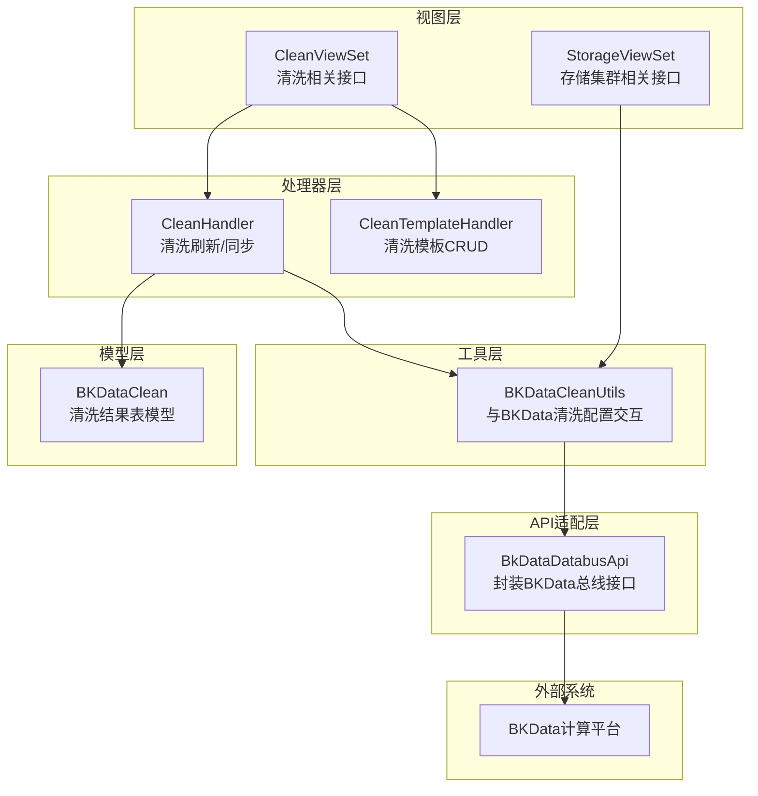
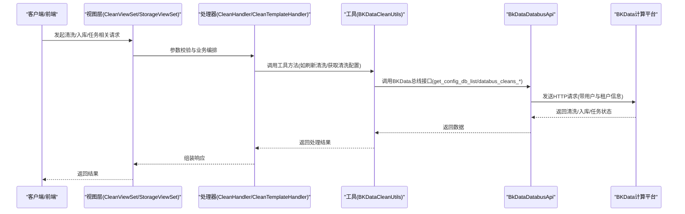
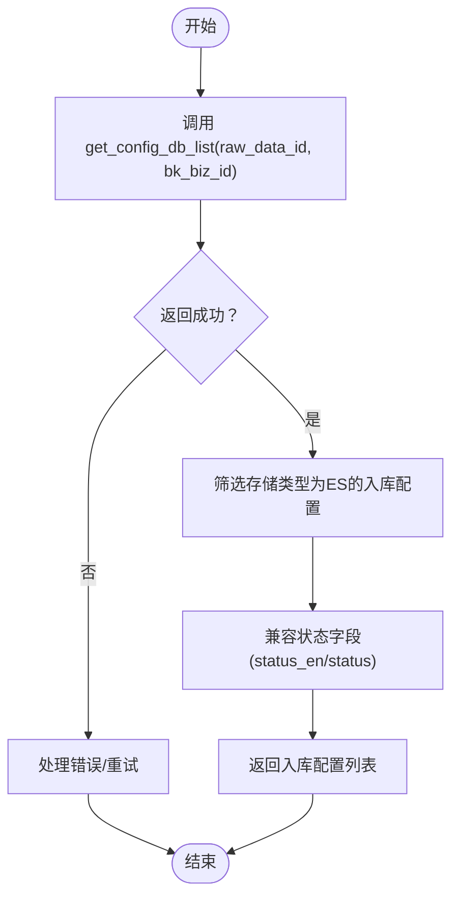
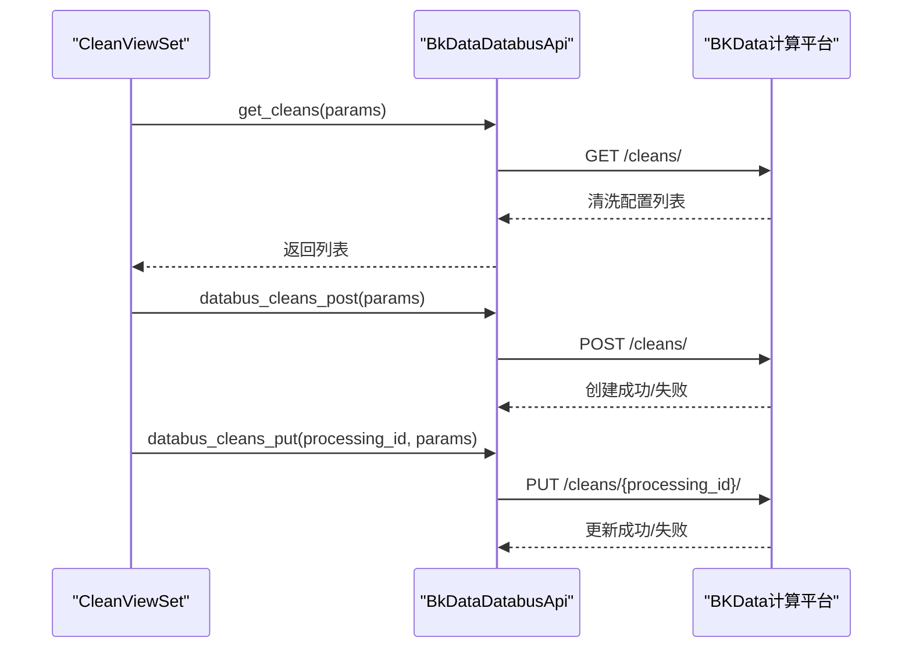
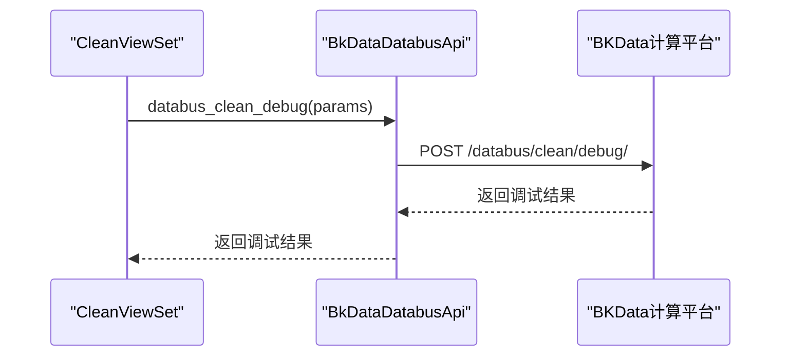
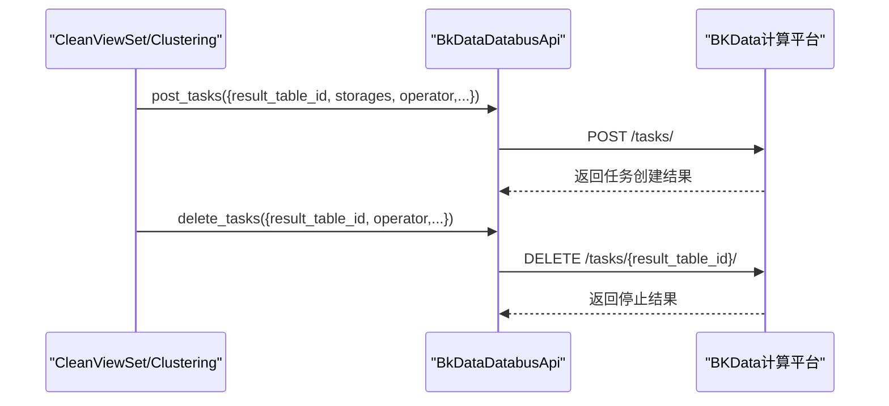
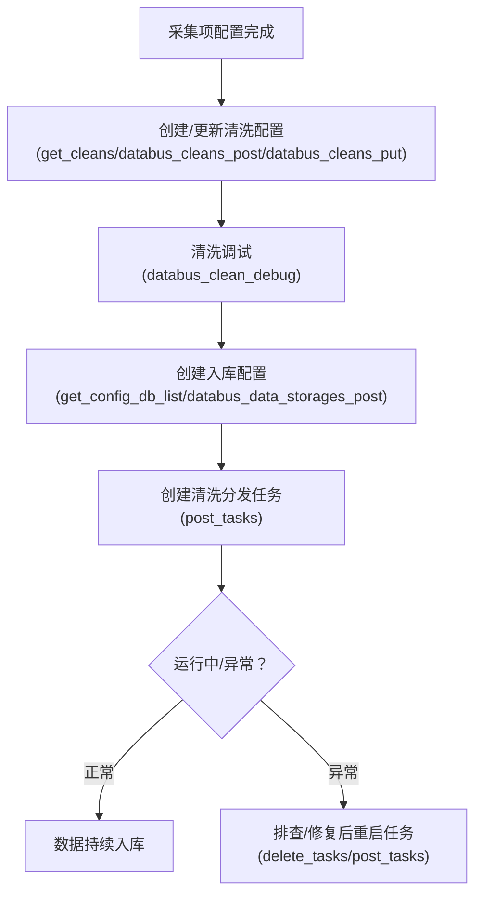
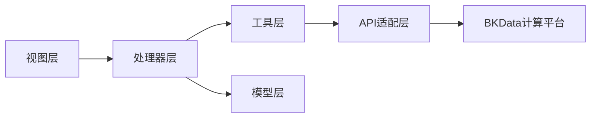

# BKData数据总线

<cite>
**本文引用的文件**
- [bkdata_databus.py](file://bklog/apps/api/modules/bkdata_databus.py)
- [clean_views.py](file://bklog/apps/log_databus/views/clean_views.py)
- [storage_views.py](file://bklog/apps/log_databus/views/storage_views.py)
- [clean.py](file://bklog/apps/log_databus/handlers/clean.py)
- [bkdata_clean.py](file://bklog/apps/log_databus/utils/bkdata_clean.py)
- [models.py](file://bklog/apps/log_databus/models.py)
- [data_access.py](file://bklog/apps/log_clustering/handlers/data_access/data_access.py)
</cite>

## 目录
1. [简介](#简介)
2. [项目结构](#项目结构)
3. [核心组件](#核心组件)
4. [架构总览](#架构总览)
5. [详细组件分析](#详细组件分析)
6. [依赖关系分析](#依赖关系分析)
7. [性能考量](#性能考量)
8. [故障排查指南](#故障排查指南)
9. [结论](#结论)
10. [附录](#附录)

## 简介
本文件面向BKLog平台与BKData（计算平台）数据总线的对接，聚焦于数据采集、清洗、入库与任务分发的全链路管理能力。重点说明以下接口与流程：
- 数据入库管理：get_config_db_list、databus_data_storages_post
- 数据清洗配置管理：get_cleans、databus_cleans_post、databus_cleans_put
- 清洗调试：databus_clean_debug
- 任务生命周期：post_tasks（创建清洗分发任务）、delete_tasks（停止任务）
- 数据流从采集到存储的完整流程与最佳实践

## 项目结构
围绕BKData数据总线的关键模块分布如下：
- API适配层：封装BKData总线REST接口，统一鉴权与租户映射
- 视图层：对外暴露HTTP接口，供前端与内部服务调用
- 处理器层：封装业务逻辑，如清洗模板、清洗同步等
- 工具层：封装与BKData总线交互的工具方法
- 模型层：持久化存储清洗结果、入库配置等

图表来源
- [bkdata_databus.py](file://bklog/apps/api/modules/bkdata_databus.py#L30-L135)
- [clean_views.py](file://bklog/apps/log_databus/views/clean_views.py#L46-L196)
- [storage_views.py](file://bklog/apps/log_databus/views/storage_views.py#L141-L239)
- [clean.py](file://bklog/apps/log_databus/handlers/clean.py#L37-L71)
- [bkdata_clean.py](file://bklog/apps/log_databus/utils/bkdata_clean.py#L22-L59)
- [models.py](file://bklog/apps/log_databus/models.py#L492-L513)

章节来源
- [bkdata_databus.py](file://bklog/apps/api/modules/bkdata_databus.py#L30-L135)
- [clean_views.py](file://bklog/apps/log_databus/views/clean_views.py#L46-L196)
- [storage_views.py](file://bklog/apps/log_databus/views/storage_views.py#L141-L239)
- [clean.py](file://bklog/apps/log_databus/handlers/clean.py#L37-L71)
- [bkdata_clean.py](file://bklog/apps/log_databus/utils/bkdata_clean.py#L22-L59)
- [models.py](file://bklog/apps/log_databus/models.py#L492-L513)

## 核心组件
- BkDataDatabusApi：封装BKData总线的REST接口，包括数据入库、清洗配置、清洗调试、任务创建与停止等，统一注入用户信息与租户映射。
- CleanHandler/CleanTemplateHandler：封装清洗刷新、同步、模板CRUD等业务逻辑。
- BKDataCleanUtils：封装与BKData清洗配置交互的工具方法，如获取清洗配置列表、插入/删除清洗记录等。
- BKDataClean模型：持久化清洗结果表信息，包含状态、存储类型、集群、采集项ID、业务ID等字段。

章节来源
- [bkdata_databus.py](file://bklog/apps/api/modules/bkdata_databus.py#L30-L135)
- [clean.py](file://bklog/apps/log_databus/handlers/clean.py#L37-L71)
- [bkdata_clean.py](file://bklog/apps/log_databus/utils/bkdata_clean.py#L22-L59)
- [models.py](file://bklog/apps/log_databus/models.py#L492-L513)

## 架构总览
下图展示了从采集到入库的端到端数据流，以及与BKData总线的交互协议。

图表来源
- [clean_views.py](file://bklog/apps/log_databus/views/clean_views.py#L46-L196)
- [storage_views.py](file://bklog/apps/log_databus/views/storage_views.py#L141-L239)
- [clean.py](file://bklog/apps/log_databus/handlers/clean.py#L37-L71)
- [bkdata_databus.py](file://bklog/apps/api/modules/bkdata_databus.py#L30-L135)
- [bkdata_clean.py](file://bklog/apps/log_databus/utils/bkdata_clean.py#L22-L59)

## 详细组件分析

### 数据入库管理：get_config_db_list 与 databus_data_storages_post
- get_config_db_list：用于获取指定原始数据源在BKData侧的入库配置列表，支持按业务ID、原始数据ID筛选，并兼容状态字段的兼容性转换。
- databus_data_storages_post：用于在BKData侧创建入库配置，通常与清洗结果表关联，完成从清洗到存储的桥接。

图表来源
- [bkdata_databus.py](file://bklog/apps/api/modules/bkdata_databus.py#L45-L75)
- [bkdata_clean.py](file://bklog/apps/log_databus/utils/bkdata_clean.py#L22-L59)

章节来源
- [bkdata_databus.py](file://bklog/apps/api/modules/bkdata_databus.py#L45-L75)
- [bkdata_clean.py](file://bklog/apps/log_databus/utils/bkdata_clean.py#L22-L59)

### 数据清洗配置管理：get_cleans、databus_cleans_post、databus_cleans_put
- get_cleans：获取清洗配置列表，支持按业务ID等条件筛选。
- databus_cleans_post：创建清洗配置，通常与采集项、清洗模板、结果表ID等绑定。
- databus_cleans_put：更新清洗配置，支持按processing_id定位。

图表来源
- [bkdata_databus.py](file://bklog/apps/api/modules/bkdata_databus.py#L77-L104)
- [clean_views.py](file://bklog/apps/log_databus/views/clean_views.py#L46-L110)

章节来源
- [bkdata_databus.py](file://bklog/apps/api/modules/bkdata_databus.py#L77-L104)
- [clean_views.py](file://bklog/apps/log_databus/views/clean_views.py#L46-L110)

### 清洗调试：databus_clean_debug
- databus_clean_debug：对清洗配置进行调试，常用于验证ETL参数、字段提取是否正确，便于快速定位问题。

图表来源
- [bkdata_databus.py](file://bklog/apps/api/modules/bkdata_databus.py#L105-L113)
- [clean_views.py](file://bklog/apps/log_databus/views/clean_views.py#L503-L557)

章节来源
- [bkdata_databus.py](file://bklog/apps/api/modules/bkdata_databus.py#L105-L113)
- [clean_views.py](file://bklog/apps/log_databus/views/clean_views.py#L503-L557)

### 任务生命周期：post_tasks 与 delete_tasks
- post_tasks：创建清洗分发任务，通常传入结果表ID、消费位置等参数，启动从清洗到存储的数据流转。
- delete_tasks：停止清洗分发任务，释放资源，避免重复消费或资源占用。

图表来源
- [bkdata_databus.py](file://bklog/apps/api/modules/bkdata_databus.py#L114-L132)
- [data_access.py](file://bklog/apps/log_clustering/handlers/data_access/data_access.py#L188-L210)

章节来源
- [bkdata_databus.py](file://bklog/apps/api/modules/bkdata_databus.py#L114-L132)
- [data_access.py](file://bklog/apps/log_clustering/handlers/data_access/data_access.py#L188-L210)

### 数据流从采集到存储的完整流程
- 采集阶段：采集项配置完成后，生成采集链路与结果表ID。
- 清洗阶段：基于采集项与清洗模板，创建/更新清洗配置；必要时进行调试验证。
- 入库阶段：在BKData侧创建入库配置，将清洗后的数据写入目标存储（如ES/Kafka）。
- 任务阶段：创建清洗分发任务，启动数据从清洗到存储的持续流转；根据需要停止任务。

图表来源
- [bkdata_databus.py](file://bklog/apps/api/modules/bkdata_databus.py#L45-L132)
- [clean_views.py](file://bklog/apps/log_databus/views/clean_views.py#L46-L196)
- [storage_views.py](file://bklog/apps/log_databus/views/storage_views.py#L141-L239)
- [bkdata_clean.py](file://bklog/apps/log_databus/utils/bkdata_clean.py#L22-L59)

章节来源
- [bkdata_databus.py](file://bklog/apps/api/modules/bkdata_databus.py#L45-L132)
- [clean_views.py](file://bklog/apps/log_databus/views/clean_views.py#L46-L196)
- [storage_views.py](file://bklog/apps/log_databus/views/storage_views.py#L141-L239)
- [bkdata_clean.py](file://bklog/apps/log_databus/utils/bkdata_clean.py#L22-L59)

## 依赖关系分析
- API适配层依赖BKData总线接口，统一注入用户信息与租户映射，确保跨系统鉴权一致。
- 视图层依赖处理器层，处理器层再依赖工具层与模型层，形成清晰的分层职责。
- 工具层通过API适配层与BKData总线交互，实现清洗配置与入库配置的读取与写入。
- 模型层持久化清洗结果表信息，支撑后续任务调度与状态追踪。

图表来源
- [bkdata_databus.py](file://bklog/apps/api/modules/bkdata_databus.py#L30-L135)
- [clean.py](file://bklog/apps/log_databus/handlers/clean.py#L37-L71)
- [bkdata_clean.py](file://bklog/apps/log_databus/utils/bkdata_clean.py#L22-L59)
- [models.py](file://bklog/apps/log_databus/models.py#L492-L513)

章节来源
- [bkdata_databus.py](file://bklog/apps/api/modules/bkdata_databus.py#L30-L135)
- [clean.py](file://bklog/apps/log_databus/handlers/clean.py#L37-L71)
- [bkdata_clean.py](file://bklog/apps/log_databus/utils/bkdata_clean.py#L22-L59)
- [models.py](file://bklog/apps/log_databus/models.py#L492-L513)

## 性能考量
- 接口缓存：部分接口设置了缓存时间，减少频繁调用BKData总线带来的压力。
- 并发控制：清洗同步采用锁机制，避免并发重复触发同步任务。
- 异步处理：清洗同步通过异步任务执行，降低接口阻塞风险。
- 资源隔离：任务创建/停止按业务ID与结果表ID进行租户映射，避免跨业务资源干扰。

章节来源
- [bkdata_databus.py](file://bklog/apps/api/modules/bkdata_databus.py#L45-L75)
- [clean.py](file://bklog/apps/log_databus/handlers/clean.py#L57-L71)

## 故障排查指南
- 清洗配置无法获取：检查get_cleans与get_config_db_list的参数（业务ID、原始数据ID），确认BKData侧清洗配置是否存在。
- 清洗调试失败：使用databus_clean_debug进行逐项验证，关注ETL参数与字段提取是否符合预期。
- 任务无法启动/停止：核对post_tasks/delete_tasks的参数（结果表ID、操作者），确认任务状态与权限。
- 入库配置异常：确认入库配置列表中存储类型为ES的配置已正确筛选与兼容状态字段。
- 同步冲突：清洗同步存在锁机制，若提示“正在运行”，等待异步任务完成后再尝试。

章节来源
- [bkdata_databus.py](file://bklog/apps/api/modules/bkdata_databus.py#L77-L132)
- [bkdata_clean.py](file://bklog/apps/log_databus/utils/bkdata_clean.py#L22-L59)
- [clean.py](file://bklog/apps/log_databus/handlers/clean.py#L57-L71)

## 结论
本文梳理了BKLog与BKData数据总线的对接要点，围绕数据入库、清洗配置、调试与任务生命周期进行了系统化说明，并提供了端到端数据流图与依赖关系图。建议在生产环境中遵循参数校验、异步处理与资源隔离的最佳实践，确保数据从采集到存储的稳定流转。

## 附录
- 实际代码示例请参考以下路径（不直接展示代码内容）：
  - get_config_db_list与入库配置获取：[bkdata_databus.py](file://bklog/apps/api/modules/bkdata_databus.py#L45-L75)、[bkdata_clean.py](file://bklog/apps/log_databus/utils/bkdata_clean.py#L22-L59)
  - 清洗配置管理：[bkdata_databus.py](file://bklog/apps/api/modules/bkdata_databus.py#L77-L104)、[clean_views.py](file://bklog/apps/log_databus/views/clean_views.py#L46-L110)
  - 清洗调试：[bkdata_databus.py](file://bklog/apps/api/modules/bkdata_databus.py#L105-L113)、[clean_views.py](file://bklog/apps/log_databus/views/clean_views.py#L503-L557)
  - 任务生命周期：[bkdata_databus.py](file://bklog/apps/api/modules/bkdata_databus.py#L114-L132)、[data_access.py](file://bklog/apps/log_clustering/handlers/data_access/data_access.py#L188-L210)
  - 数据模型：[models.py](file://bklog/apps/log_databus/models.py#L492-L513)