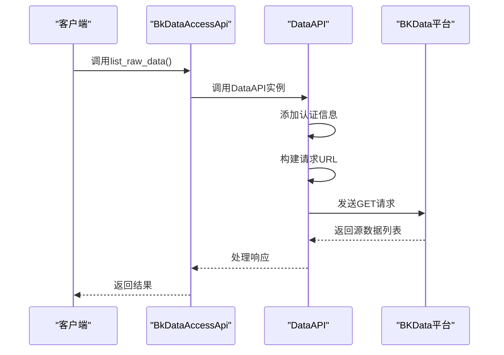
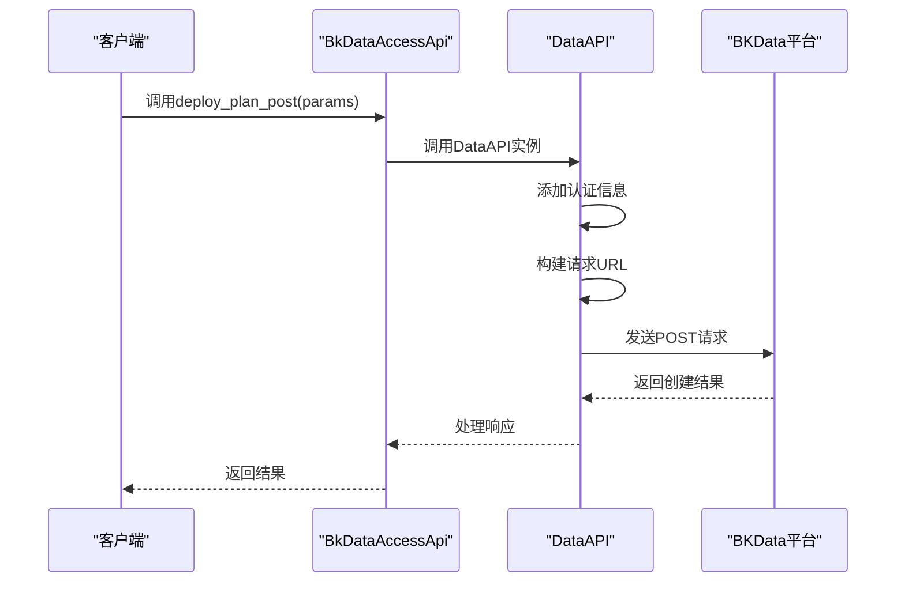
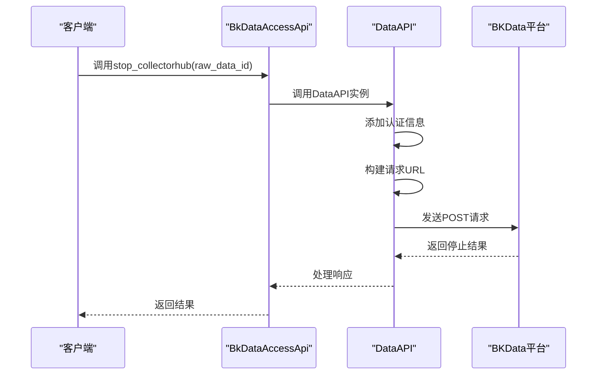
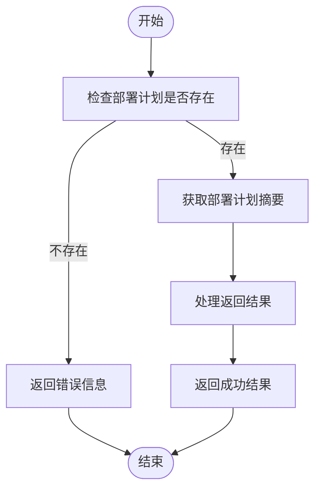
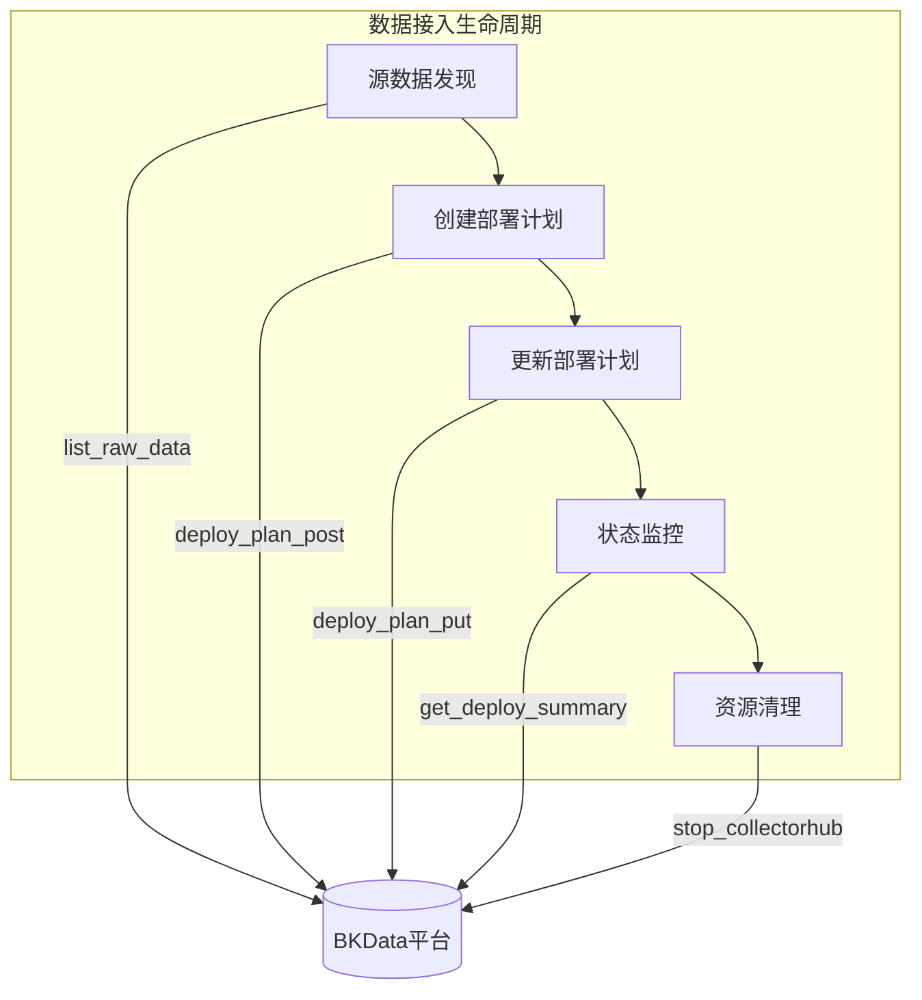
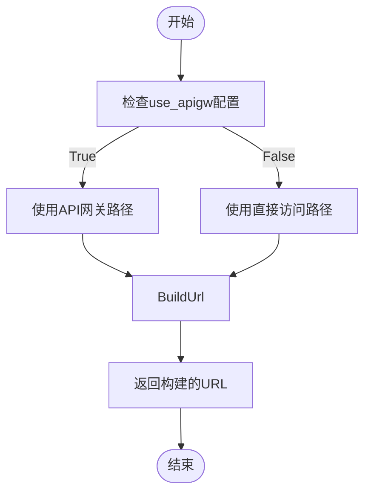
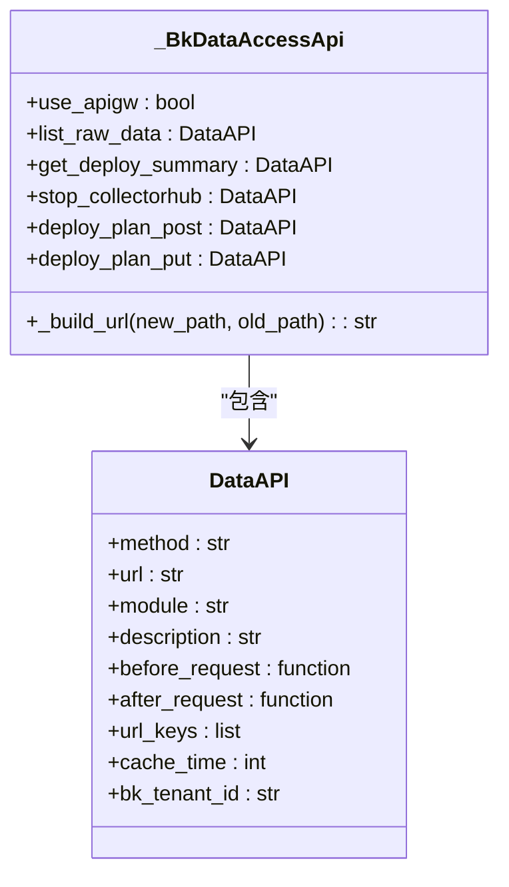
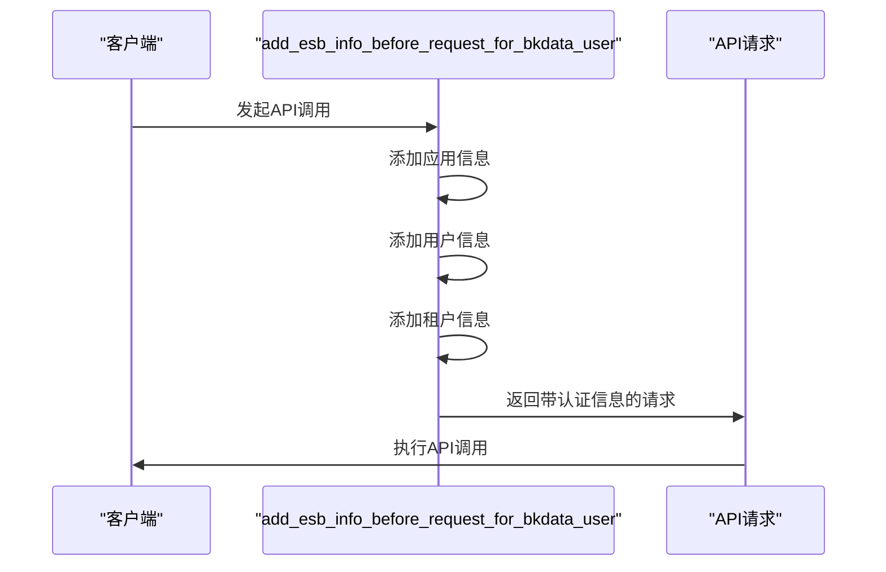
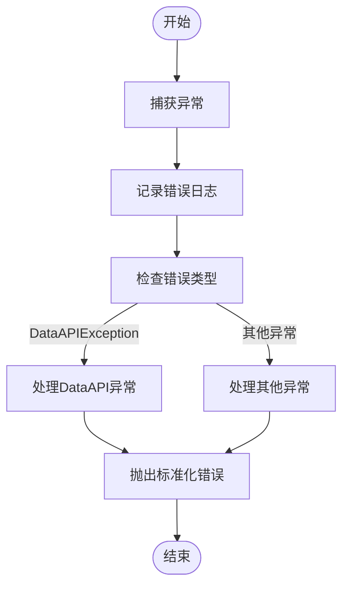
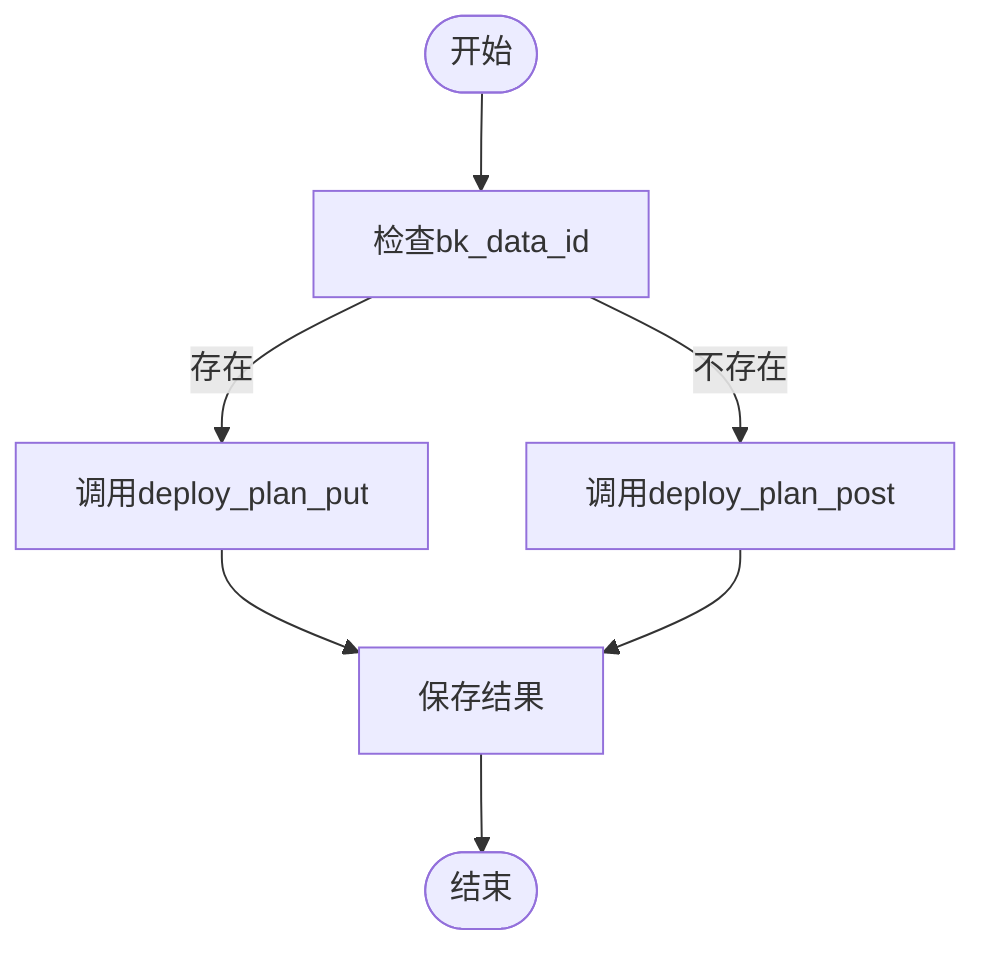

# BKData数据接入

<cite>
**本文档引用的文件**
- [bkdata_access.py](file://bklog/apps/api/modules/bkdata_access.py)
- [base.py](file://bklog/apps/api/base.py)
- [utils.py](file://bklog/apps/api/modules/utils.py)
- [domains.py](file://bklog/config/domains.py)
- [exception.py](file://bklog/apps/api/exception.py)
- [bkdata.py](file://bklog/apps/utils/bkdata.py)
- [base.py](file://bklog/apps/log_databus/handlers/collector/base.py)
- [bkdata.py](file://bklog/apps/log_databus/tasks/bkdata.py)
</cite>

## 目录
1. [简介](#简介)
2. [核心API功能](#核心api功能)
3. [数据接入生命周期管理](#数据接入生命周期管理)
4. [API网关集成与URL构建](#api网关集成与url构建)
5. [交互协议与认证方式](#交互协议与认证方式)
6. [错误处理策略](#错误处理策略)
7. [实际应用示例](#实际应用示例)
8. [总结](#总结)

## 简介

BKData数据接入模块提供了完整的数据源连接和采集功能，通过API接口实现对数据接入的全生命周期管理。该模块主要通过`bkdata_access.py`文件中的`BkDataAccessApi`类提供服务，支持源数据列表获取、部署计划创建与更新、采集器状态管理等核心功能。

该模块基于蓝鲸平台的API网关架构，实现了与BKData平台的无缝集成，为日志采集、数据处理等场景提供了稳定可靠的数据接入能力。通过标准化的API接口和完善的错误处理机制，确保了数据接入过程的可管理性和可维护性。

**Section sources**
- [bkdata_access.py](file://bklog/apps/api/modules/bkdata_access.py#L1-L100)

## 核心API功能

BKData数据接入模块提供了多个核心API接口，用于管理数据接入的各个阶段。这些接口通过`DataAPI`类封装，提供了统一的调用方式和错误处理机制。

### list_raw_data接口

`list_raw_data`接口用于获取源数据列表，通过GET请求方式调用。该接口返回系统中所有已注册的源数据信息，包括数据ID、数据名称、维护人等元数据信息。接口调用时会自动添加必要的认证信息，并根据配置决定是否通过API网关进行请求转发。



**Diagram sources**
- [bkdata_access.py](file://bklog/apps/api/modules/bkdata_access.py#L50-L57)
- [base.py](file://bklog/apps/api/base.py#L191-L800)

### deploy_plan_post接口

`deploy_plan_post`接口用于创建新的部署计划，通过POST请求方式调用。该接口需要提供详细的部署计划参数，包括业务ID、数据场景、权限配置、源数据信息等。在创建部署计划时，系统会验证参数的完整性和正确性，并确保相关资源的可用性。



**Diagram sources**
- [bkdata_access.py](file://bklog/apps/api/modules/bkdata_access.py#L78-L86)
- [base.py](file://bklog/apps/api/base.py#L191-L800)

### deploy_plan_put接口

`deploy_plan_put`接口用于更新现有的部署计划，通过PUT请求方式调用。该接口需要指定要更新的原始数据ID，并提供需要修改的部署计划参数。更新操作会保留未修改的配置项，只对指定的参数进行变更，确保配置的连续性和稳定性。


**Diagram sources**
- [bkdata_access.py](file://bklog/apps/api/modules/bkdata_access.py#L87-L96)
- [base.py](file://bklog/apps/api/base.py#L191-L800)

### stop_collectorhub接口

`stop_collectorhub`接口用于停止单个采集器，通过POST请求方式调用。该接口需要指定要停止的原始数据ID，执行后会终止对应采集器的数据采集任务。停止操作是可逆的，可以通过启动接口重新激活采集器。



**Diagram sources**
- [bkdata_access.py](file://bklog/apps/api/modules/bkdata_access.py#L69-L77)
- [base.py](file://bklog/apps/api/base.py#L191-L800)

**Section sources**
- [bkdata_access.py](file://bklog/apps/api/modules/bkdata_access.py#L50-L99)

## 数据接入生命周期管理

BKData数据接入模块提供了完整的数据接入生命周期管理功能，从源数据发现到部署计划管理，再到采集器状态控制，形成了一个闭环的管理流程。

### 部署计划查询(get_deploy_summary)

`get_deploy_summary`接口用于查询部署计划的摘要信息，通过GET请求方式调用。该接口需要指定原始数据ID，返回对应部署计划的详细状态信息，包括部署进度、运行状态、错误信息等。此接口常用于监控部署计划的执行情况和故障排查。



**Diagram sources**
- [bkdata_access.py](file://bklog/apps/api/modules/bkdata_access.py#L58-L68)
- [base.py](file://bklog/apps/api/base.py#L191-L800)

### 数据接入流程

数据接入的完整生命周期包括以下几个阶段：源数据发现、部署计划创建、部署计划更新、状态监控和资源清理。每个阶段都有相应的API接口支持，确保了数据接入过程的可控性和可追溯性。



**Diagram sources**
- [bkdata_access.py](file://bklog/apps/api/modules/bkdata_access.py#L50-L99)
- [base.py](file://bklog/apps/api/base.py#L191-L800)

**Section sources**
- [bkdata_access.py](file://bklog/apps/api/modules/bkdata_access.py#L50-L99)
- [bkdata.py](file://bklog/apps/log_databus/tasks/bkdata.py#L60-L259)

## API网关集成与URL构建

BKData数据接入模块通过API网关集成机制，实现了灵活的请求路由和协议转换功能。`use_apigw`属性和`_build_url`方法共同构成了URL构建的核心机制。

### use_apigw机制

`use_apigw`是一个属性，用于判断是否使用API网关进行请求转发。该属性的值从系统配置中获取，允许在不同环境（开发、测试、生产）中灵活切换API调用方式。当`use_apigw`为True时，请求将通过API网关转发；否则，请求将直接发送到目标服务。



**Diagram sources**
- [bkdata_access.py](file://bklog/apps/api/modules/bkdata_access.py#L38-L47)
- [base.py](file://bklog/apps/api/base.py#L191-L800)

### _build_url方法

`_build_url`方法负责构建实际的请求URL，根据`use_apigw`的值选择不同的URL模板。该方法接收新旧两种路径参数，确保在API网关迁移过程中能够平滑过渡。URL构建过程考虑了环境变量、版本号等动态因素，提高了系统的可配置性。



**Diagram sources**
- [bkdata_access.py](file://bklog/apps/api/modules/bkdata_access.py#L42-L47)
- [base.py](file://bklog/apps/api/base.py#L191-L800)

**Section sources**
- [bkdata_access.py](file://bklog/apps/api/modules/bkdata_access.py#L38-L47)
- [base.py](file://bklog/apps/api/base.py#L191-L800)

## 交互协议与认证方式

BKData数据接入模块采用了标准化的交互协议和多层次的认证机制，确保了API调用的安全性和可靠性。

### 交互协议

模块采用RESTful API设计风格，使用标准的HTTP方法（GET、POST、PUT、DELETE）对应不同的操作类型。请求和响应数据格式采用JSON，确保了跨平台的兼容性。API调用遵循蓝鲸平台的统一规范，包括错误码、响应结构等。

### 认证方式

认证机制通过`add_esb_info_before_request_for_bkdata_user`函数实现，该函数在每次API调用前自动添加必要的认证信息。认证信息包括应用代码、应用密钥、用户信息等，确保了API调用的身份验证和权限控制。



**Diagram sources**
- [utils.py](file://bklog/apps/api/modules/utils.py#L167-L171)
- [base.py](file://bklog/apps/api/base.py#L527-L533)

**Section sources**
- [utils.py](file://bklog/apps/api/modules/utils.py#L167-L171)
- [base.py](file://bklog/apps/api/base.py#L527-L533)

## 错误处理策略

BKData数据接入模块实现了完善的错误处理机制，通过分层的异常处理和详细的错误信息记录，提高了系统的稳定性和可维护性。

### 异常类型

系统定义了多种异常类型，包括`DataAPIException`、`ApiRequestError`、`ApiResultError`等，分别对应不同的错误场景。异常处理遵循Python的异常处理规范，确保了错误信息的准确传递和处理。

### 错误处理流程

错误处理流程包括错误捕获、错误信息记录、错误转换和错误抛出四个阶段。系统在捕获到异常后，会记录详细的错误日志，然后根据错误类型进行相应的处理，最后将标准化的错误信息抛出给调用方。



**Diagram sources**
- [exception.py](file://bklog/apps/api/exception.py#L29-L41)
- [base.py](file://bklog/apps/api/base.py#L318-L320)

**Section sources**
- [exception.py](file://bklog/apps/api/exception.py#L29-L41)
- [base.py](file://bklog/apps/api/base.py#L318-L320)

## 实际应用示例

以下是一些BKData数据接入模块的实际应用示例，展示了如何在真实场景中使用这些API接口。

### 创建和管理数据采集任务

在`bkdata.py`任务文件中，`create_bkdata_data_id`函数展示了如何使用`deploy_plan_post`和`get_deploy_summary`接口创建和管理数据采集任务。该函数首先尝试获取部署计划摘要，如果失败则创建新的部署计划。

```mermaid
sequenceDiagram
participant Task as "创建任务"
participant Check as "检查部署计划"
participant Create as "创建部署计划"
participant BKData as "BKData平台"
Task->>Check : 调用get_deploy_summary
Check->>BKData : 查询部署计划
BKData-->>Check : 返回查询结果
Check-->>Task : 处理结果
alt 部署计划不存在
Task->>Create : 调用deploy_plan_post
Create->>BKData : 创建部署计划
BKData-->>Create : 返回创建结果
Create-->>Task : 处理结果
end
Task->>Task : 保存结果
```

**Diagram sources**
- [bkdata.py](file://bklog/apps/log_databus/tasks/bkdata.py#L68-L149)
- [bkdata_access.py](file://bklog/apps/api/modules/bkdata_access.py#L78-L86)

### 部署计划更新流程

在`base.py`采集器处理器中，`_create_or_update_data_id`方法展示了如何使用`deploy_plan_put`接口更新部署计划。该方法根据是否存在已有的数据ID来决定是创建还是更新部署计划。



**Diagram sources**
- [base.py](file://bklog/apps/log_databus/handlers/collector/base.py#L980-L992)
- [bkdata_access.py](file://bklog/apps/api/modules/bkdata_access.py#L87-L96)

**Section sources**
- [bkdata.py](file://bklog/apps/log_databus/tasks/bkdata.py#L68-L149)
- [base.py](file://bklog/apps/log_databus/handlers/collector/base.py#L980-L992)

## 总结

BKData数据接入模块通过`bkdata_access.py`文件提供了一套完整的数据源连接和采集功能。该模块的核心是`BkDataAccessApi`类，它封装了多个API接口，包括`list_raw_data`、`deploy_plan_post`、`deploy_plan_put`和`stop_collectorhub`，实现了数据接入的全生命周期管理。

模块通过`use_apigw`属性和`_build_url`方法实现了灵活的API网关集成，确保了在不同环境下的兼容性。认证机制通过`add_esb_info_before_request_for_bkdata_user`函数实现，保证了API调用的安全性。错误处理策略通过分层的异常处理机制，提高了系统的稳定性和可维护性。

在实际应用中，这些API接口被广泛用于创建和管理数据采集任务，实现了从源数据发现到部署计划管理的完整流程。通过标准化的接口设计和完善的错误处理，BKData数据接入模块为日志采集和数据处理提供了可靠的基础支持。

**Section sources**
- [bkdata_access.py](file://bklog/apps/api/modules/bkdata_access.py#L1-L100)
- [base.py](file://bklog/apps/api/base.py#L1-L1009)
- [utils.py](file://bklog/apps/api/modules/utils.py#L1-L406)