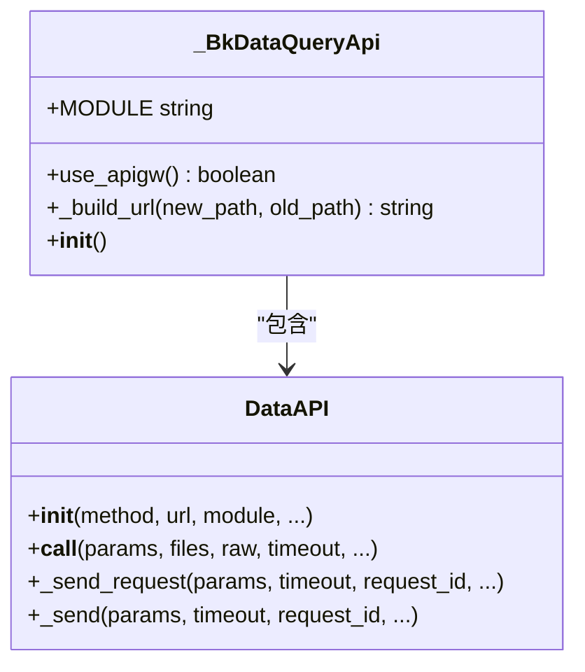
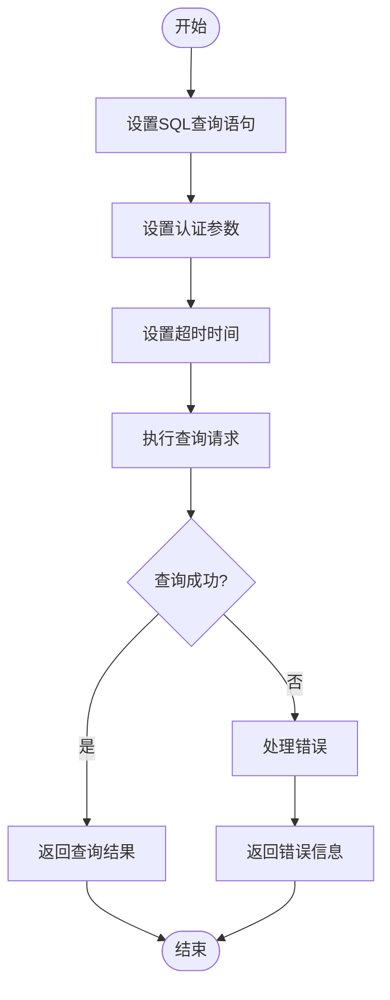
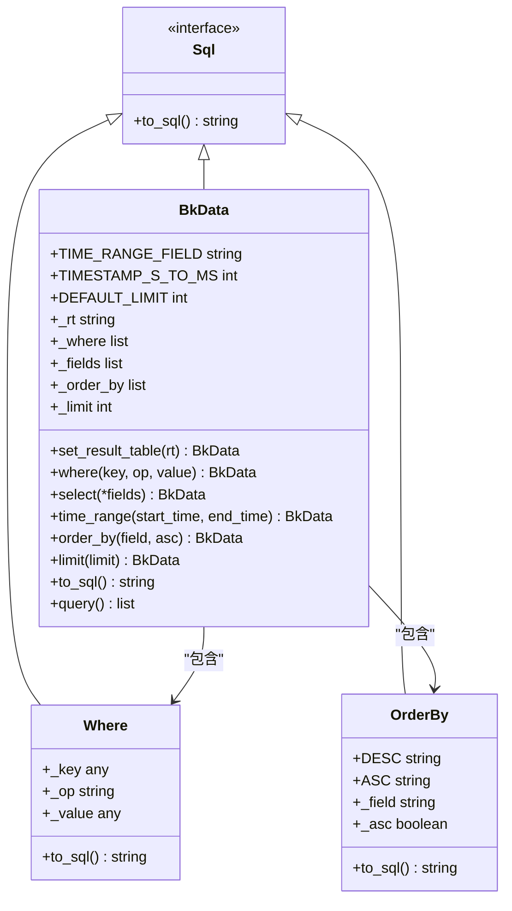
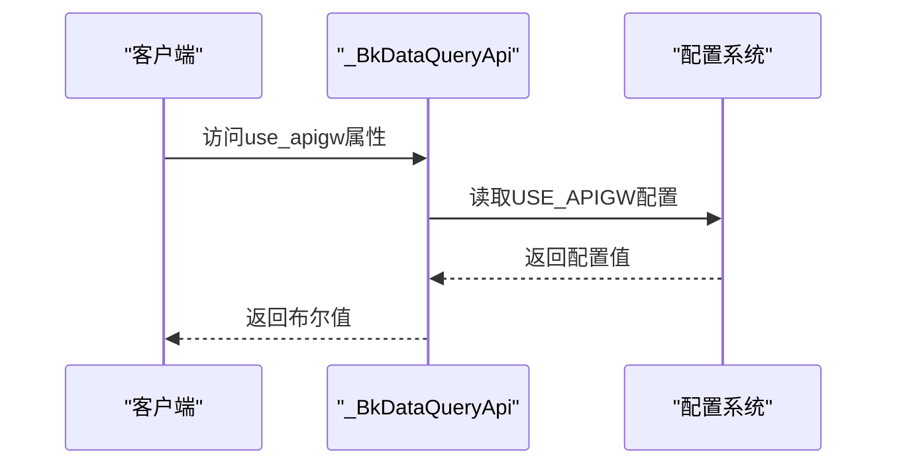
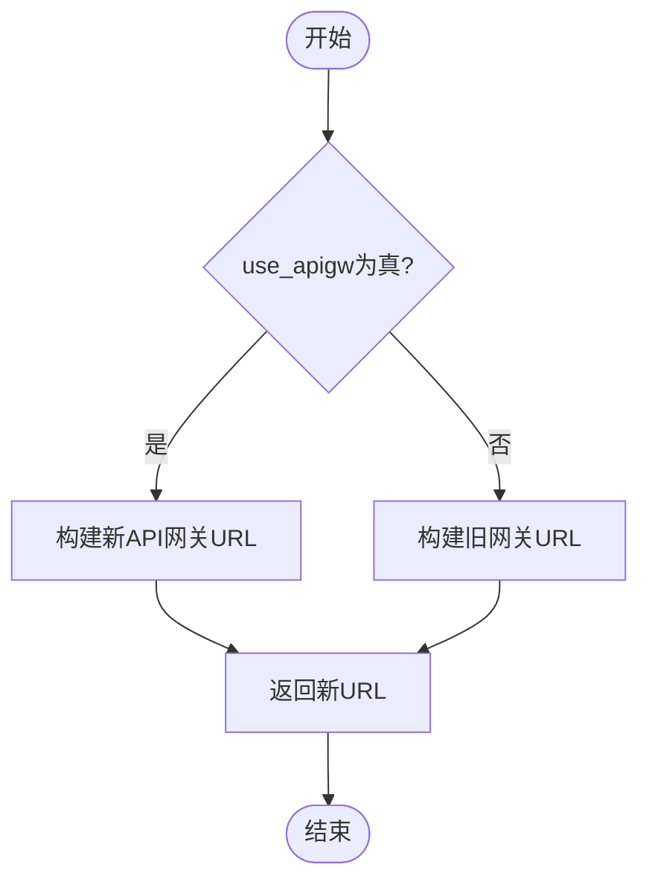
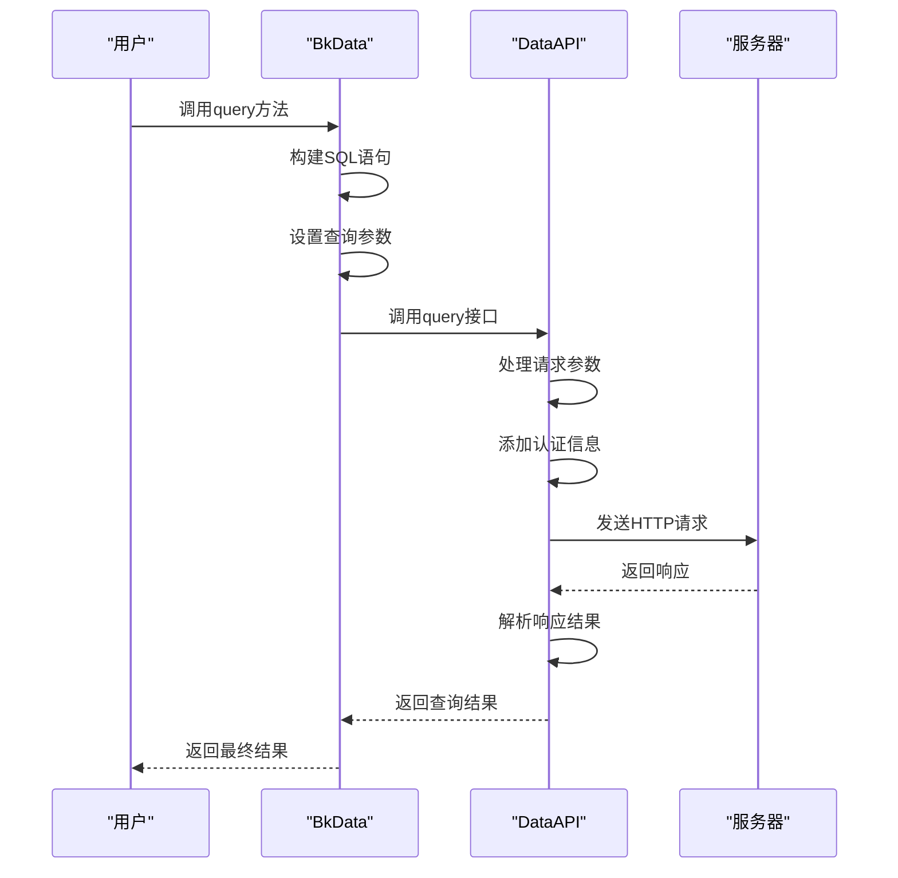
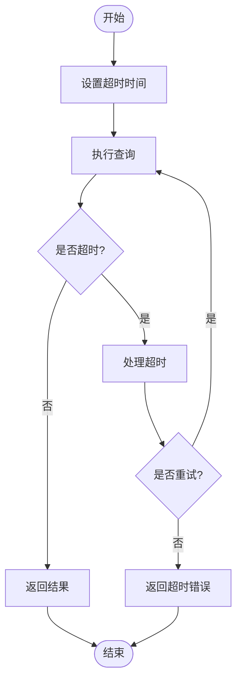

# BKData数据查询

<cite>
**本文档引用的文件**
- [bkdata_query.py](file://bklog/apps/api/modules/bkdata_query.py)
- [bkdata.py](file://bklog/apps/utils/bkdata.py)
- [base.py](file://bklog/apps/api/base.py)
- [domains.py](file://bklog/config/domains.py)
- [default.py](file://bklog/config/default.py)
</cite>

## 目录
1. [简介](#简介)
2. [核心功能](#核心功能)
3. [查询接口详解](#查询接口详解)
4. [API网关集成机制](#api网关集成机制)
5. [URL构建机制](#url构建机制)
6. [数据查询实现](#数据查询实现)
7. [查询性能优化](#查询性能优化)
8. [常见问题解决方案](#常见问题解决方案)
9. [结论](#结论)

## 简介

BKData数据查询功能是蓝鲸日志平台的重要组成部分，提供了强大的数据查询能力。该功能主要通过bkdata_query.py文件中的query接口实现同步查询，支持灵活的请求参数配置、查询语句构建和结果获取。本文档将详细介绍BKData数据查询的各项功能和实现机制。

**Section sources**
- [bkdata_query.py](file://bklog/apps/api/modules/bkdata_query.py#L1-L20)

## 核心功能

BKData数据查询模块提供了完整的数据查询解决方案，主要包括同步查询接口、API网关集成、URL构建等核心功能。该模块通过DataAPI封装了底层的HTTP请求，提供了统一的接口调用方式。

**Diagram sources**
- [bkdata_query.py](file://bklog/apps/api/modules/bkdata_query.py#L30-L53)
- [base.py](file://bklog/apps/api/base.py#L191-L400)

## 查询接口详解

BKData数据查询的query接口提供了同步查询能力，支持多种请求参数配置和查询条件设置。通过该接口，用户可以构建复杂的查询语句并获取查询结果。

### 请求参数配置

查询接口支持多种请求参数配置，包括SQL语句、认证方式、超时设置等。参数通过字典形式传递，其中sql参数是必需的，用于指定查询语句。

**Diagram sources**
- [bkdata_query.py](file://bklog/apps/api/modules/bkdata_query.py#L45-L53)
- [bkdata.py](file://bklog/apps/utils/bkdata.py#L106-L114)

### 查询语句构建

BKData提供了便捷的查询语句构建工具，支持通过链式调用方式构建复杂的SQL查询语句。用户可以通过select、where、order_by等方法逐步构建查询条件。

**Diagram sources**
- [bkdata.py](file://bklog/apps/utils/bkdata.py#L8-L114)

**Section sources**
- [bkdata.py](file://bklog/apps/utils/bkdata.py#L8-L114)

## API网关集成机制

BKData数据查询模块通过use_apigw属性实现了API网关的集成，可以根据配置灵活选择是否使用API网关进行请求转发。

### use_apigw实现

use_apigw是一个属性方法，通过读取settings.USE_APIGW配置来决定是否使用API网关。这个设计使得系统可以在不同环境下灵活切换API网关的使用状态。

**Diagram sources**
- [bkdata_query.py](file://bklog/apps/api/modules/bkdata_query.py#L33-L36)

**Section sources**
- [bkdata_query.py](file://bklog/apps/api/modules/bkdata_query.py#L33-L36)

## URL构建机制

URL构建机制通过_build_url方法实现，根据是否使用API网关来构建不同的请求URL。这种设计支持系统在不同部署环境下的灵活适配。

### _build_url实现

_build_url方法根据use_apigw的值选择不同的URL模板。当使用API网关时，使用PAAS_API_HOST和环境变量构建新的URL路径；否则使用DATAQUERY_APIGATEWAY_ROOT构建旧的URL路径。

**Diagram sources**
- [bkdata_query.py](file://bklog/apps/api/modules/bkdata_query.py#L37-L42)

**Section sources**
- [bkdata_query.py](file://bklog/apps/api/modules/bkdata_query.py#L37-L42)

## 数据查询实现

BKData数据查询的实现基于DataAPI类，通过封装HTTP请求提供了统一的接口调用方式。查询过程包括参数处理、请求发送、结果解析等步骤。

### 查询执行流程

数据查询的执行流程从构建查询语句开始，经过参数处理、请求发送、结果解析等步骤，最终返回查询结果。

**Diagram sources**
- [bkdata.py](file://bklog/apps/utils/bkdata.py#L106-L114)
- [base.py](file://bklog/apps/api/base.py#L277-L317)

**Section sources**
- [bkdata.py](file://bklog/apps/utils/bkdata.py#L106-L114)

## 查询性能优化

为了提高查询性能，BKData数据查询模块提供了多种优化策略，包括查询超时设置、数据量控制、缓存机制等。

### 查询超时处理

查询接口支持设置超时时间，通过timeout参数可以控制查询的最大等待时间。默认超时时间为60秒，可以根据实际需求进行调整。

**Diagram sources**
- [base.py](file://bklog/apps/api/base.py#L282-L284)

## 常见问题解决方案

在使用BKData数据查询时，可能会遇到查询超时、数据量过大等问题。本节提供了一些常见问题的解决方案。

### 查询超时处理策略

当查询超时发生时，可以采取以下策略：
1. 增加超时时间
2. 优化查询语句，减少查询范围
3. 分批查询大数据集
4. 使用缓存机制

### 数据量过大处理策略

当查询结果数据量过大时，可以采取以下策略：
1. 使用limit限制返回结果数量
2. 添加更精确的查询条件
3. 分页查询
4. 使用聚合查询减少数据量

**Section sources**
- [base.py](file://bklog/apps/api/base.py#L216-L217)
- [bkdata.py](file://bklog/apps/utils/bkdata.py#L53-L54)

## 结论

BKData数据查询功能提供了强大而灵活的数据查询能力，通过同步查询接口、API网关集成、URL构建等机制，实现了高效的数据访问。该功能的设计考虑了性能优化和错误处理，能够满足各种复杂场景下的数据查询需求。通过合理使用查询参数配置、优化查询语句和处理常见问题，可以充分发挥BKData数据查询的优势。