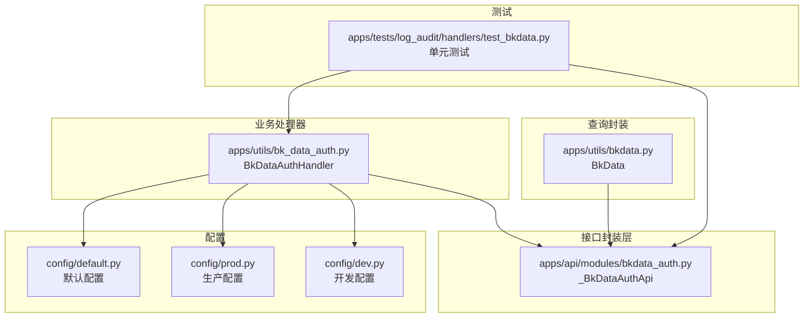
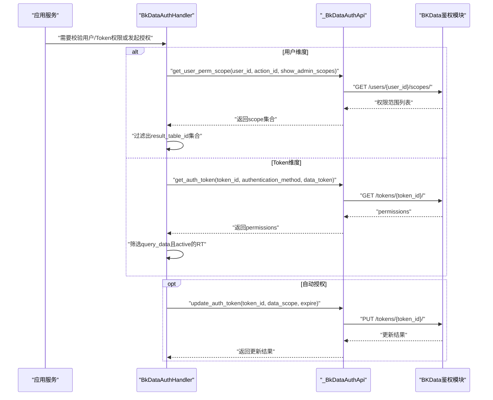
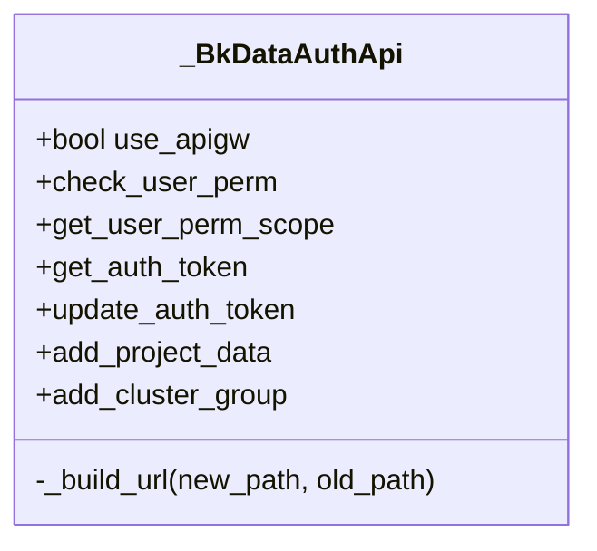
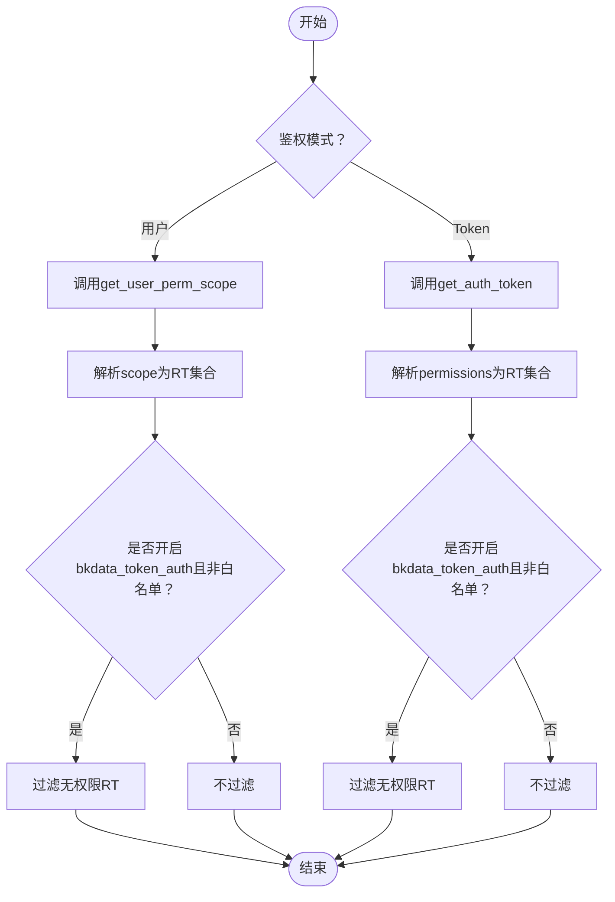
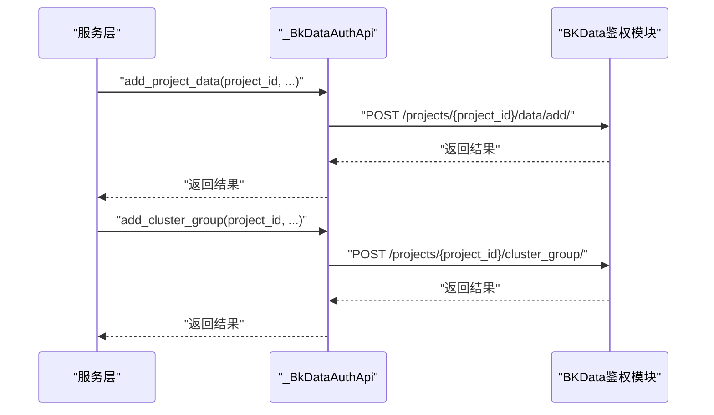
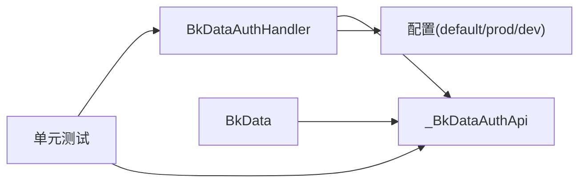

# BKData认证授权

<cite>
**本文引用的文件**
- [bkdata_auth.py](file://bklog/apps/api/modules/bkdata_auth.py)
- [bk_data_auth.py](file://bklog/apps/utils/bk_data_auth.py)
- [bkdata.py](file://bklog/apps/utils/bkdata.py)
- [default.py](file://bklog/config/default.py)
- [prod.py](file://bklog/config/prod.py)
- [dev.py](file://bklog/config/dev.py)
- [test_bkdata.py](file://bklog/apps/tests/log_audit/handlers/test_bkdata.py)
</cite>

## 目录
1. [简介](#简介)
2. [项目结构](#项目结构)
3. [核心组件](#核心组件)
4. [架构总览](#架构总览)
5. [详细组件分析](#详细组件分析)
6. [依赖关系分析](#依赖关系分析)
7. [性能考量](#性能考量)
8. [故障排查指南](#故障排查指南)
9. [结论](#结论)
10. [附录](#附录)

## 简介
本文件面向BKLog蓝鲸日志平台与BKData（数据平台）鉴权模块的集成场景，系统性梳理并说明以下能力：
- 用户权限检查：check_user_perm
- 用户权限范围获取：get_user_perm_scope
- 认证令牌详情查询：get_auth_token
- 认证令牌更新：update_auth_token
- 项目数据权限管理：add_project_data
- 资源组申请：add_cluster_group
- 结合BKData鉴权模块的交互机制、权限控制策略、安全考虑与错误处理方案
- 提供可复用的使用流程与最佳实践

## 项目结构
围绕BKData认证授权的相关代码主要分布在如下位置：
- 接口封装层：apps/api/modules/bkdata_auth.py
- 业务处理器：apps/utils/bk_data_auth.py
- 查询封装与鉴权参数注入：apps/utils/bkdata.py
- 配置项：config/default.py、config/prod.py、config/dev.py
- 测试用例：apps/tests/log_audit/handlers/test_bkdata.py

图表来源
- [bkdata_auth.py](file://bklog/apps/api/modules/bkdata_auth.py#L1-L112)
- [bk_data_auth.py](file://bklog/apps/utils/bk_data_auth.py#L1-L176)
- [bkdata.py](file://bklog/apps/utils/bkdata.py#L1-L115)
- [default.py](file://bklog/config/default.py#L535-L576)
- [prod.py](file://bklog/config/prod.py#L103-L120)
- [dev.py](file://bklog/config/dev.py#L97-L111)
- [test_bkdata.py](file://bklog/apps/tests/log_audit/handlers/test_bkdata.py#L101-L155)

章节来源
- [bkdata_auth.py](file://bklog/apps/api/modules/bkdata_auth.py#L1-L112)
- [bk_data_auth.py](file://bklog/apps/utils/bk_data_auth.py#L1-L176)
- [bkdata.py](file://bklog/apps/utils/bkdata.py#L1-L115)
- [default.py](file://bklog/config/default.py#L535-L576)
- [prod.py](file://bklog/config/prod.py#L103-L120)
- [dev.py](file://bklog/config/dev.py#L97-L111)
- [test_bkdata.py](file://bklog/apps/tests/log_audit/handlers/test_bkdata.py#L101-L155)

## 核心组件
- 接口封装层（_BkDataAuthApi）
  - 提供对BKData鉴权模块的REST接口封装，包括：
    - check_user_perm：POST /api/bk-base/{env}/v3/auth/users/{user_id}/check/
    - get_user_perm_scope：GET /api/bk-base/{env}/v3/auth/users/{user_id}/scopes/
    - get_auth_token：GET /api/bk-base/{env}/v3/auth/tokens/{token_id}/
    - update_auth_token：PUT /api/bk-base/{env}/v3/auth/tokens/{token_id}/
    - add_project_data：POST /api/bk-base/{env}/v3/auth/projects/{project_id}/data/add/
    - add_cluster_group：POST /api/bk-base/{env}/v3/auth/projects/{project_id}/cluster_group/
  - 支持两种调用路径：
    - 使用网关（USE_APIGW为真时）：PAAS_API_HOST + /api/bk-base/{env}/v3/auth/...
    - 使用旧版网关（AUTH_APIGATEWAY_ROOT）：AUTH_APIGATEWAY_ROOT + 原路径
  - 统一在请求前注入ESB信息（add_esb_info_before_request_for_bkdata_user），并支持租户ID注入（biz_to_tenant_getter）

- 业务处理器（BkDataAuthHandler）
  - 用户维度：
    - list_authorized_rt_by_user：基于get_user_perm_scope获取用户具备“result_table.manage_auth”动作的RT集合
    - filter_unauthorized_rt_by_user：在开启bkdata_token_auth开关且非白名单应用时，过滤掉用户无权限的RT
  - Token维度：
    - list_authorized_rt_by_token：基于get_auth_token返回的permissions过滤出“result_table.query_data”且状态为“active”的RT集合
    - filter_unauthorized_rt_by_token：在开启bkdata_token_auth开关且非白名单应用时，过滤掉token无权限的RT
  - 自动授权：
    - authorize_result_table_to_token：当API调用方为其他APP时，自动向token追加授权（一年有效期）
  - 鉴权跳转：
    - get_auth_url：生成数据平台鉴权页面URL，包含scopes、state、data_token_id等参数

- 查询封装（BkData）
  - 在查询时根据FEATURE_TOGGLE决定使用“token”或“user”鉴权方式，并注入相应参数
  - 通过BkDataQueryApi.query执行查询

章节来源
- [bkdata_auth.py](file://bklog/apps/api/modules/bkdata_auth.py#L34-L112)
- [bk_data_auth.py](file://bklog/apps/utils/bk_data_auth.py#L35-L176)
- [bkdata.py](file://bklog/apps/utils/bkdata.py#L106-L115)

## 架构总览
下图展示了从应用到BKData鉴权模块的调用链路与关键决策点。

图表来源
- [bk_data_auth.py](file://bklog/apps/utils/bk_data_auth.py#L35-L176)
- [bkdata_auth.py](file://bklog/apps/api/modules/bkdata_auth.py#L48-L112)

## 详细组件分析

### 接口封装层（_BkDataAuthApi）
- 关键接口与行为
  - check_user_perm：用于检查用户是否具备某项权限（如result_table.manage_auth）
  - get_user_perm_scope：获取用户权限范围，支持管理员范围显示
  - get_auth_token：获取指定token的权限详情
  - update_auth_token：更新token的权限范围（用于自动授权）
  - add_project_data：为项目添加数据权限
  - add_cluster_group：为项目申请资源组
- 路径选择与租户注入
  - 根据USE_APIGW动态选择PAAS_API_HOST或AUTH_APIGATEWAY_ROOT
  - add_cluster_group与add_project_data注入租户ID（biz_to_tenant_getter）
- 请求前置处理
  - before_request统一注入ESB信息（add_esb_info_before_request_for_bkdata_user）

图表来源
- [bkdata_auth.py](file://bklog/apps/api/modules/bkdata_auth.py#L34-L112)

章节来源
- [bkdata_auth.py](file://bklog/apps/api/modules/bkdata_auth.py#L34-L112)

### 业务处理器（BkDataAuthHandler）
- 用户权限范围
  - list_authorized_rt_by_user：调用get_user_perm_scope，过滤出“result_table.manage_auth”且状态有效的RT
  - filter_unauthorized_rt_by_user：在bkdata_token_auth开关开启且不在白名单时，过滤掉用户无权限的RT
- Token权限范围
  - list_authorized_rt_by_token：调用get_auth_token，解析permissions，筛选“result_table.query_data”且状态为“active”的RT
  - filter_unauthorized_rt_by_token：在bkdata_token_auth开关开启且不在白名单时，过滤掉token无权限的RT
- 自动授权
  - authorize_result_table_to_token：当调用方为其他APP时，自动向token追加授权（一年有效期），并记录日志
- 鉴权跳转
  - get_auth_url：拼接BKDATA_URL与OAuth授权参数（scopes、state、data_token_id），返回授权URL

图表来源
- [bk_data_auth.py](file://bklog/apps/utils/bk_data_auth.py#L35-L176)

章节来源
- [bk_data_auth.py](file://bklog/apps/utils/bk_data_auth.py#L35-L176)

### 查询封装（BkData）
- 鉴权参数注入
  - 当FEATURE_TOGGLE中bkdata_token_auth为on时，使用“token”鉴权方式并携带bkdata_data_token
  - 否则使用“user”鉴权方式并携带bk_username/operator
- 执行查询
  - 通过BkDataQueryApi.query执行SQL查询，关闭Cookie传递

章节来源
- [bkdata.py](file://bklog/apps/utils/bkdata.py#L106-L115)

### 配置与环境变量
- 默认配置（default.py）
  - BKDATA_DATA_APP_CODE：数据平台数据应用标识
  - BKDATA_DATA_TOKEN_ID：数据平台数据令牌ID
  - BKDATA_DATA_TOKEN：数据平台数据令牌值
- 生产配置（prod.py）
  - BKDATA_URL：数据平台地址（K8S部署时从环境变量加载）
- 开发配置（dev.py）
  - 支持从环境变量加载多类配置

章节来源
- [default.py](file://bklog/config/default.py#L535-L576)
- [prod.py](file://bklog/config/prod.py#L103-L120)
- [dev.py](file://bklog/config/dev.py#L97-L111)

### API调用流程（项目数据权限管理与资源组申请）
- add_project_data
  - 作用：为项目添加数据权限
  - 调用路径：POST /api/bk-base/{env}/v3/auth/projects/{project_id}/data/add/
  - 租户注入：biz_to_tenant_getter()
- add_cluster_group
  - 作用：为项目申请资源组
  - 调用路径：POST /api/bk-base/{env}/v3/auth/projects/{project_id}/cluster_group/
  - 租户注入：biz_to_tenant_getter()

图表来源
- [bkdata_auth.py](file://bklog/apps/api/modules/bkdata_auth.py#L89-L111)

章节来源
- [bkdata_auth.py](file://bklog/apps/api/modules/bkdata_auth.py#L89-L111)

## 依赖关系分析
- 模块耦合
  - BkDataAuthHandler依赖_BkDataAuthApi提供的DataAPI接口
  - BkDataAuthHandler依赖配置项（BKDATA_URL、BKDATA_DATA_TOKEN_ID、BKDATA_DATA_TOKEN、FEATURE_TOGGLE）
  - BkData依赖BkDataQueryApi进行查询执行
- 外部依赖
  - PAAS_API_HOST与AUTH_APIGATEWAY_ROOT用于路由切换
  - ESB信息注入确保跨系统鉴权信息一致
- 可能的循环依赖
  - 代码结构清晰，未发现循环导入迹象

图表来源
- [bk_data_auth.py](file://bklog/apps/utils/bk_data_auth.py#L1-L176)
- [bkdata_auth.py](file://bklog/apps/api/modules/bkdata_auth.py#L1-L112)
- [bkdata.py](file://bklog/apps/utils/bkdata.py#L1-L115)
- [default.py](file://bklog/config/default.py#L535-L576)
- [prod.py](file://bklog/config/prod.py#L103-L120)
- [dev.py](file://bklog/config/dev.py#L97-L111)
- [test_bkdata.py](file://bklog/apps/tests/log_audit/handlers/test_bkdata.py#L101-L155)

章节来源
- [bk_data_auth.py](file://bklog/apps/utils/bk_data_auth.py#L1-L176)
- [bkdata_auth.py](file://bklog/apps/api/modules/bkdata_auth.py#L1-L112)
- [bkdata.py](file://bklog/apps/utils/bkdata.py#L1-L115)
- [default.py](file://bklog/config/default.py#L535-L576)
- [prod.py](file://bklog/config/prod.py#L103-L120)
- [dev.py](file://bklog/config/dev.py#L97-L111)
- [test_bkdata.py](file://bklog/apps/tests/log_audit/handlers/test_bkdata.py#L101-L155)

## 性能考量
- 接口调用频率
  - 用户/Token权限查询建议缓存短期结果，避免高频重复调用
- 路由选择
  - USE_APIGW为真时走PAAS_API_HOST，减少跨域与代理开销；否则走AUTH_APIGATEWAY_ROOT
- 参数注入
  - 统一注入ESB信息与租户ID，避免重复构造，提升一致性与性能
- 查询优化
  - FEATURE_TOGGLE控制鉴权方式，合理选择“token”或“user”，减少不必要的鉴权成本

[本节为通用指导，不直接分析具体文件]

## 故障排查指南
- 常见问题定位
  - 配置缺失：BKDATA_URL、BKDATA_DATA_TOKEN_ID、BKDATA_DATA_TOKEN未正确设置
  - 功能开关：FEATURE_TOGGLE中bkdata_token_auth未开启导致权限过滤失效
  - 白名单影响：ESQUERY白名单导致跳过权限校验
  - 网关路径：USE_APIGW与AUTH_APIGATEWAY_ROOT配置不一致导致请求失败
- 日志与调试
  - authorize_result_table_to_token会输出授权结果日志，便于追踪
  - 单元测试覆盖了鉴权URL生成、用户/Token权限过滤等关键路径
- 建议步骤
  - 核对配置项与环境变量
  - 在测试环境中启用bkdata_token_auth开关验证过滤逻辑
  - 使用get_auth_url生成授权链接，确认参数拼接正确
  - 观察authorize_result_table_to_token的日志输出

章节来源
- [bk_data_auth.py](file://bklog/apps/utils/bk_data_auth.py#L114-L176)
- [test_bkdata.py](file://bklog/apps/tests/log_audit/handlers/test_bkdata.py#L101-L155)

## 结论
- 本方案通过_BkDataAuthApi统一封装BKData鉴权接口，BkDataAuthHandler提供用户与Token双维度的权限管理与自动授权能力，BkData在查询阶段按需注入鉴权参数，形成闭环。
- 通过FEATURE_TOGGLE与白名单机制实现灵活的安全控制，结合配置项与环境变量满足多环境部署需求。
- 建议在生产环境启用缓存与监控，持续评估接口调用频次与延迟，确保系统稳定性与安全性。

[本节为总结性内容，不直接分析具体文件]

## 附录

### 实际使用示例（以路径代替代码片段）
- 用户权限验证
  - 获取用户权限范围：参考路径
    - [bk_data_auth.py](file://bklog/apps/utils/bk_data_auth.py#L39-L48)
    - [bkdata_auth.py](file://bklog/apps/api/modules/bkdata_auth.py#L59-L68)
  - 过滤无权限RT（用户维度）：参考路径
    - [bk_data_auth.py](file://bklog/apps/utils/bk_data_auth.py#L72-L97)
- Token权限验证
  - 获取Token权限详情：参考路径
    - [bk_data_auth.py](file://bklog/apps/utils/bk_data_auth.py#L49-L71)
    - [bkdata_auth.py](file://bklog/apps/api/modules/bkdata_auth.py#L69-L78)
  - 过滤无权限RT（Token维度）：参考路径
    - [bk_data_auth.py](file://bklog/apps/utils/bk_data_auth.py#L98-L113)
- 自动授权与鉴权跳转
  - 自动授权：参考路径
    - [bk_data_auth.py](file://bklog/apps/utils/bk_data_auth.py#L132-L176)
    - [bkdata_auth.py](file://bklog/apps/api/modules/bkdata_auth.py#L79-L88)
  - 生成授权URL：参考路径
    - [bk_data_auth.py](file://bklog/apps/utils/bk_data_auth.py#L114-L131)
- 项目数据权限管理与资源组申请
  - 添加项目数据：参考路径
    - [bkdata_auth.py](file://bklog/apps/api/modules/bkdata_auth.py#L89-L101)
  - 申请资源组：参考路径
    - [bkdata_auth.py](file://bklog/apps/api/modules/bkdata_auth.py#L101-L111)
- 查询阶段鉴权参数注入
  - 根据FEATURE_TOGGLE选择鉴权方式：参考路径
    - [bkdata.py](file://bklog/apps/utils/bkdata.py#L106-L115)

章节来源
- [bk_data_auth.py](file://bklog/apps/utils/bk_data_auth.py#L35-L176)
- [bkdata_auth.py](file://bklog/apps/api/modules/bkdata_auth.py#L34-L112)
- [bkdata.py](file://bklog/apps/utils/bkdata.py#L106-L115)