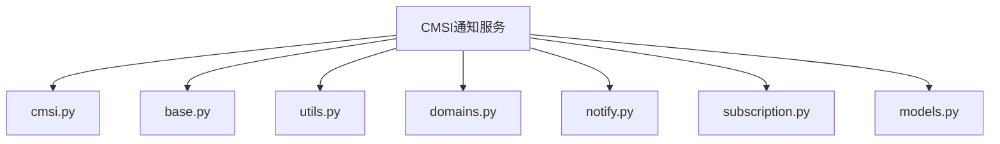
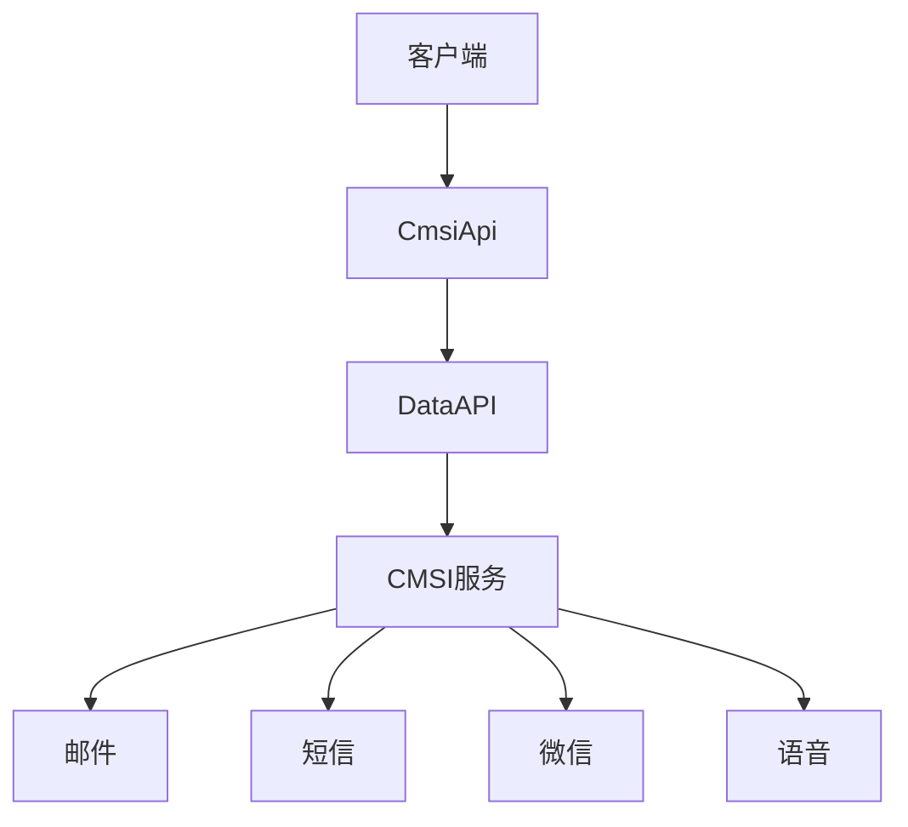
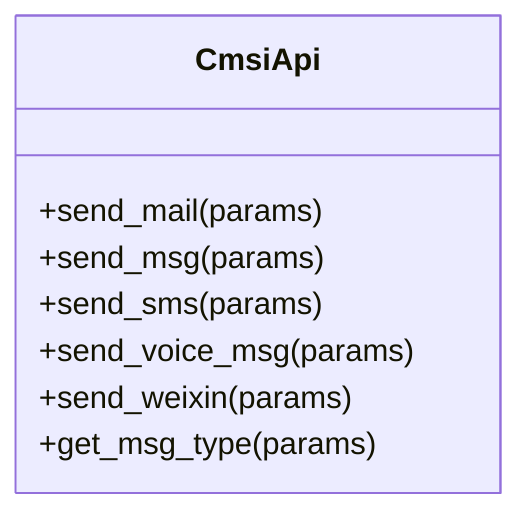
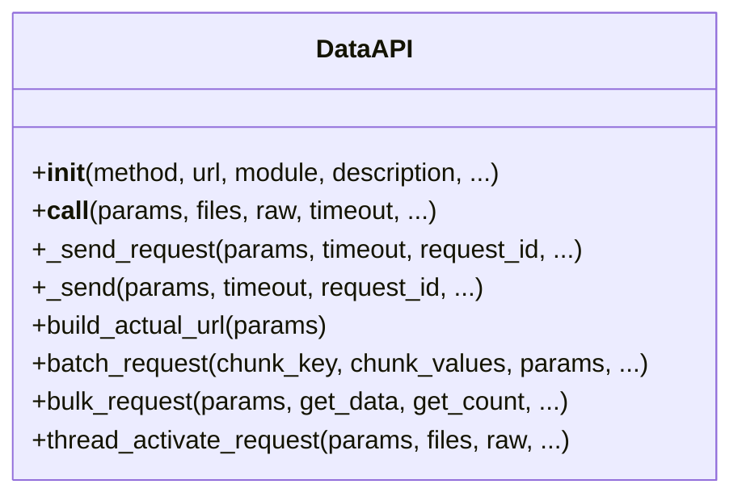
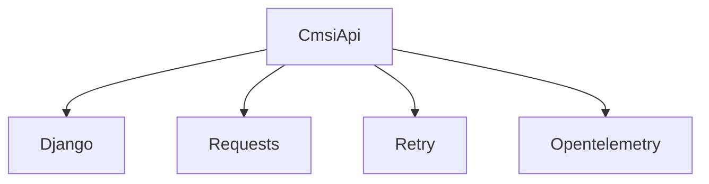

# CMSI通知服务集成

<cite>
**本文档引用文件**   
- [cmsi.py](file://bklog/apps/api/modules/cmsi.py)
- [base.py](file://bklog/apps/api/base.py)
- [utils.py](file://bklog/apps/api/modules/utils.py)
- [domains.py](file://bklog/config/domains.py)
- [notify.py](file://bklog/apps/utils/notify.py)
- [subscription.py](file://bklog/apps/log_clustering/tasks/subscription.py)
- [models.py](file://bklog/apps/log_databus/models.py)
</cite>

## 目录
1. [简介](#简介)
2. [项目结构](#项目结构)
3. [核心组件](#核心组件)
4. [架构概述](#架构概述)
5. [详细组件分析](#详细组件分析)
6. [依赖分析](#依赖分析)
7. [性能考虑](#性能考虑)
8. [故障排除指南](#故障排除指南)
9. [结论](#结论)

## 简介
CMSI（蓝鲸消息管理服务）是蓝鲸平台的核心通知服务，提供邮件、短信、微信、语音等多种通知渠道的统一接口。本文档详细介绍CMSI通知服务的集成方案，包括接口使用方法、参数配置、消息模板管理、发送状态查询、错误处理机制、监控策略等，帮助开发者快速集成CMSI服务到日志告警、系统通知等场景中。

## 项目结构
CMSI通知服务的集成主要涉及以下文件和目录：
- `bklog/apps/api/modules/cmsi.py`：CMSI接口封装
- `bklog/apps/api/base.py`：API基础类
- `bklog/apps/api/modules/utils.py`：工具函数
- `bklog/config/domains.py`：域名配置
- `bklog/apps/utils/notify.py`：通知工具类
- `bklog/apps/log_clustering/tasks/subscription.py`：聚类订阅任务
- `bklog/apps/log_databus/models.py`：数据总线模型

**图示来源**
- [cmsi.py](file://bklog/apps/api/modules/cmsi.py)
- [base.py](file://bklog/apps/api/base.py)
- [utils.py](file://bklog/apps/api/modules/utils.py)
- [domains.py](file://bklog/config/domains.py)
- [notify.py](file://bklog/apps/utils/notify.py)
- [subscription.py](file://bklog/apps/log_clustering/tasks/subscription.py)
- [models.py](file://bklog/apps/log_databus/models.py)

## 核心组件
CMSI通知服务的核心组件包括：
- **CmsiApi类**：封装了CMSI服务的各种接口
- **DataAPI类**：API请求的基础类
- **工具函数**：用于处理请求参数和响应
- **配置文件**：定义服务地址和认证信息

**组件来源**
- [cmsi.py](file://bklog/apps/api/modules/cmsi.py#L57-L117)
- [base.py](file://bklog/apps/api/base.py#L191-L800)
- [utils.py](file://bklog/apps/api/modules/utils.py#L30-L406)
- [domains.py](file://bklog/config/domains.py#L29-L82)

## 架构概述
CMSI通知服务的架构如下图所示：

**图示来源**
- [cmsi.py](file://bklog/apps/api/modules/cmsi.py#L57-L117)
- [base.py](file://bklog/apps/api/base.py#L191-L800)

## 详细组件分析

### CmsiApi类分析
CmsiApi类封装了CMSI服务的各种接口，包括发送邮件、短信、微信、语音等。

#### 类图

**图示来源**
- [cmsi.py](file://bklog/apps/api/modules/cmsi.py#L57-L117)

#### 接口说明
- **send_mail**：发送邮件
- **send_msg**：通用消息发送
- **send_sms**：发送短信
- **send_voice_msg**：公共语音通知
- **send_weixin**：发送微信消息
- **get_msg_type**：查询消息发送类型

**组件来源**
- [cmsi.py](file://bklog/apps/api/modules/cmsi.py#L72-L114)

### DataAPI类分析
DataAPI类是API请求的基础类，提供了请求发送、参数处理、响应处理等功能。

#### 类图

**图示来源**
- [base.py](file://bklog/apps/api/base.py#L191-L800)

#### 方法说明
- **__init__**：初始化API请求
- **__call__**：调用API
- **_send_request**：发送请求
- **_send**：实际发送请求
- **build_actual_url**：构建实际URL
- **batch_request**：批量请求
- **bulk_request**：批量请求（分页）
- **thread_activate_request**：线程激活请求

**组件来源**
- [base.py](file://bklog/apps/api/base.py#L200-L770)

### 工具函数分析
工具函数用于处理请求参数和响应，包括参数清洗、认证信息添加等。

#### 函数说明
- **before_send_cmsi_api**：处理CMSI API请求参数
- **before_send_cmsi_wechat**：处理微信消息请求参数
- **before_send_cmsi_voice_msg**：处理语音消息请求参数
- **add_esb_info_before_request**：添加ESB信息到请求参数

**组件来源**
- [cmsi.py](file://bklog/apps/api/modules/cmsi.py#L30-L54)
- [utils.py](file://bklog/apps/api/modules/utils.py#L152-L248)

### 配置文件分析
配置文件定义了CMSI服务的地址和认证信息。

#### 配置说明
- **CMSI_APIGATEWAY_ROOT_V2**：CMSI服务地址
- **USE_APIGW**：是否使用API网关
- **PAAS_API_HOST**：PaaS API主机地址
- **ENVIRONMENT**：环境变量

**组件来源**
- [domains.py](file://bklog/config/domains.py#L57-L82)
- [cmsi.py](file://bklog/apps/api/modules/cmsi.py#L27-L28)

## 依赖分析
CMSI通知服务依赖以下组件：
- **Django**：Web框架
- **Requests**：HTTP请求库
- **Retry**：重试库
- **Opentelemetry**：分布式追踪

**图示来源**
- [cmsi.py](file://bklog/apps/api/modules/cmsi.py#L22-L27)
- [base.py](file://bklog/apps/api/base.py#L33-L45)

## 性能考虑
CMSI通知服务的性能考虑包括：
- **超时设置**：默认超时时间为60秒
- **缓存**：支持请求结果缓存
- **并发请求**：支持批量请求和分页请求
- **重试机制**：支持请求重试

**性能来源**
- [base.py](file://bklog/apps/api/base.py#L216-L219)
- [base.py](file://bklog/apps/api/base.py#L347-L354)
- [base.py](file://bklog/apps/api/base.py#L632-L741)

## 故障排除指南
### 错误码处理
CMSI通知服务的错误码处理机制如下：
- **请求错误**：捕获`ApiRequestError`异常
- **结果错误**：捕获`ApiResultError`异常
- **数据API异常**：捕获`DataAPIException`异常

**故障排除来源**
- [base.py](file://bklog/apps/api/base.py#L318-L319)
- [exception.py](file://bklog/apps/api/exception.py#L29-L40)

### 发送成功率监控
发送成功率监控可以通过以下方式实现：
- **日志记录**：记录每次请求的详细信息
- **性能指标**：收集请求耗时、成功率等指标
- **告警**：设置告警规则，及时发现异常

**监控来源**
- [base.py](file://bklog/apps/api/base.py#L457-L481)

### 故障转移策略
故障转移策略包括：
- **重试机制**：请求失败时自动重试
- **备用服务**：配置备用服务地址
- **降级处理**：服务不可用时降级处理

**故障转移来源**
- [base.py](file://bklog/apps/api/base.py#L368-L383)

## 结论
CMSI通知服务提供了统一的接口，方便开发者集成邮件、短信、微信、语音等多种通知渠道。通过本文档的介绍，开发者可以快速了解CMSI服务的使用方法、配置方式、错误处理机制和监控策略，从而更好地集成到自己的应用中。