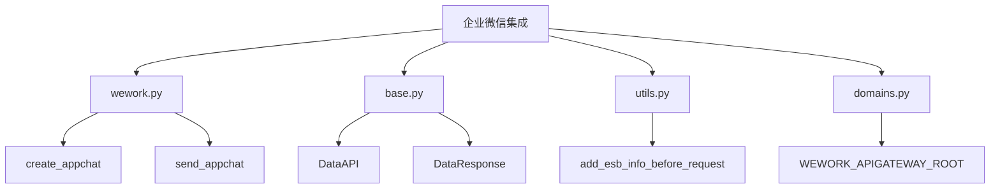
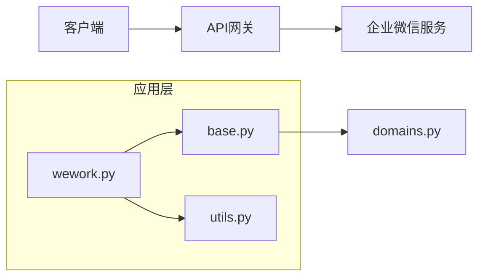
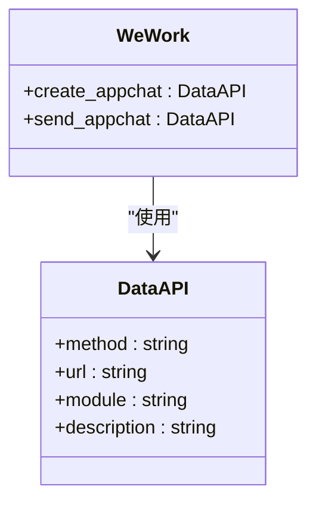
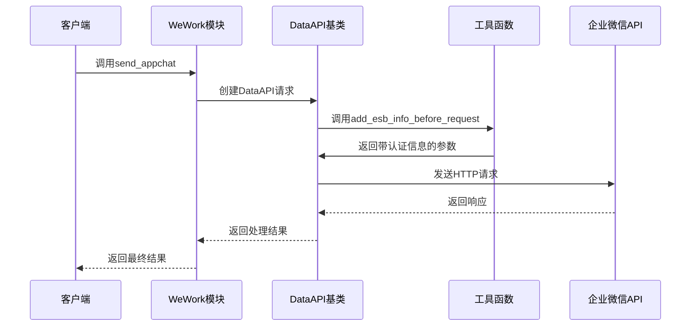
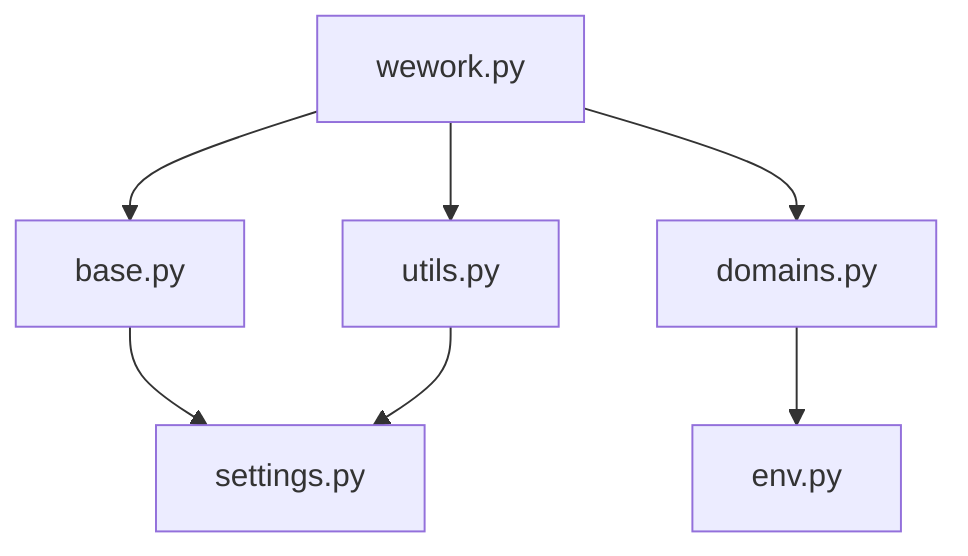

# 企业微信集成

<cite>
**本文档引用的文件**   
- [wework.py](file://bklog/apps/api/modules/wework.py#L1-L49)
- [base.py](file://bklog/apps/api/base.py#L1-L800)
- [utils.py](file://bklog/apps/api/modules/utils.py#L1-L406)
- [domains.py](file://bklog/config/domains.py#L1-L83)
</cite>

## 目录
1. [项目结构](#项目结构)
2. [核心组件](#核心组件)
3. [架构概述](#架构概述)
4. [详细组件分析](#详细组件分析)
5. [依赖分析](#依赖分析)
6. [性能考虑](#性能考虑)
7. [故障排除指南](#故障排除指南)
8. [结论](#结论)

## 项目结构
项目结构显示企业微信集成功能位于`bklog/apps/api/modules/`目录下的`wework.py`文件中。该模块作为API模块的一部分，负责与企业微信进行消息通知功能的对接。系统通过API网关根地址配置实现与企业微信服务的通信，具体配置在`config/domains.py`文件中定义。

**Diagram sources**
- [wework.py](file://bklog/apps/api/modules/wework.py#L1-L49)
- [base.py](file://bklog/apps/api/base.py#L1-L800)
- [utils.py](file://bklog/apps/api/modules/utils.py#L1-L406)
- [domains.py](file://bklog/config/domains.py#L1-L83)

**Section sources**
- [wework.py](file://bklog/apps/api/modules/wework.py#L1-L49)
- [domains.py](file://bklog/config/domains.py#L1-L83)

## 核心组件
企业微信集成的核心组件包括消息发送接口、认证机制和配置管理。`wework.py`文件中定义了`_WeWork`类，提供了创建和发送企业微信群聊的功能。系统通过`DataAPI`基类实现API调用，结合`add_esb_info_before_request`函数处理请求前的认证信息添加。

**Section sources**
- [wework.py](file://bklog/apps/api/modules/wework.py#L1-L49)
- [base.py](file://bklog/apps/api/base.py#L1-L800)
- [utils.py](file://bklog/apps/api/modules/utils.py#L1-L406)

## 架构概述
系统架构采用模块化设计，通过API网关与企业微信服务进行通信。`wework.py`模块依赖于`base.py`中的`DataAPI`类实现HTTP请求处理，利用`utils.py`中的工具函数进行请求预处理。配置信息通过`domains.py`文件集中管理，确保API根地址的统一配置。

**Diagram sources**
- [wework.py](file://bklog/apps/api/modules/wework.py#L1-L49)
- [base.py](file://bklog/apps/api/base.py#L1-L800)
- [utils.py](file://bklog/apps/api/modules/utils.py#L1-L406)
- [domains.py](file://bklog/config/domains.py#L1-L83)

## 详细组件分析
### 企业微信模块分析
企业微信模块提供了创建群聊和发送消息的接口，通过POST方法调用企业微信API。系统在发送请求前会自动添加必要的认证信息，确保请求的安全性。

#### 接口定义

**Diagram sources**
- [wework.py](file://bklog/apps/api/modules/wework.py#L1-L49)
- [base.py](file://bklog/apps/api/base.py#L1-L800)

#### 请求处理流程

**Diagram sources**
- [wework.py](file://bklog/apps/api/modules/wework.py#L1-L49)
- [base.py](file://bklog/apps/api/base.py#L1-L800)
- [utils.py](file://bklog/apps/api/modules/utils.py#L1-L406)

**Section sources**
- [wework.py](file://bklog/apps/api/modules/wework.py#L1-L49)
- [base.py](file://bklog/apps/api/base.py#L1-L800)
- [utils.py](file://bklog/apps/api/modules/utils.py#L1-L406)

## 依赖分析
企业微信集成模块依赖于多个核心组件，包括API基础类、工具函数和配置管理。这些依赖关系确保了模块的可维护性和扩展性。

**Diagram sources**
- [wework.py](file://bklog/apps/api/modules/wework.py#L1-L49)
- [base.py](file://bklog/apps/api/base.py#L1-L800)
- [utils.py](file://bklog/apps/api/modules/utils.py#L1-L406)
- [domains.py](file://bklog/config/domains.py#L1-L83)

**Section sources**
- [wework.py](file://bklog/apps/api/modules/wework.py#L1-L49)
- [base.py](file://bklog/apps/api/base.py#L1-L800)
- [utils.py](file://bklog/apps/api/modules/utils.py#L1-L406)
- [domains.py](file://bklog/config/domains.py#L1-L83)

## 性能考虑
系统在设计时考虑了性能优化，通过连接池管理和缓存机制提高API调用效率。`DataAPI`类支持请求缓存，减少重复请求对系统资源的消耗。同时，系统实现了错误重试机制，确保在网络不稳定情况下的消息可靠送达。

## 故障排除指南
当企业微信消息推送出现问题时，应首先检查API网关根地址配置是否正确。其次，验证认证信息是否有效，包括应用代码和密钥。最后，检查网络连接是否正常，确保能够访问企业微信API服务。

**Section sources**
- [wework.py](file://bklog/apps/api/modules/wework.py#L1-L49)
- [base.py](file://bklog/apps/api/base.py#L1-L800)
- [utils.py](file://bklog/apps/api/modules/utils.py#L1-L406)

## 结论
企业微信集成模块通过清晰的架构设计和完善的错误处理机制，实现了稳定可靠的消息通知功能。系统采用模块化设计，便于维护和扩展。通过合理的配置管理和性能优化，确保了消息推送的高效性和可靠性。