# 第三方系统集成

<cite>
**本文档引用文件**   
- [wework.py](file://bklog/apps/api/modules/wework.py)
- [cmsi.py](file://bklog/apps/api/modules/cmsi.py)
- [unify_query.py](file://bklog/apps/api/modules/unify_query.py)
- [bkdata_access.py](file://bklog/apps/api/modules/bkdata_access.py)
- [bkdata_query.py](file://bklog/apps/api/modules/bkdata_query.py)
- [bkdata_databus.py](file://bklog/apps/api/modules/bkdata_databus.py)
- [base.py](file://bklog/apps/api/base.py)
- [domains.py](file://bklog/config/domains.py)
- [env.py](file://bklog/config/env.py)
</cite>

## 目录
1. [介绍](#介绍)
2. [企业微信集成](#企业微信集成)
3. [CMSI通知服务集成](#cmsi通知服务集成)
4. [BKData数据平台集成](#bkdata数据平台集成)
5. [统一查询接口](#统一查询接口)
6. [RESTful API客户端封装](#restful-api客户端封装)
7. [外部基础设施集成](#外部基础设施集成)
8. [错误恢复策略](#错误恢复策略)
9. [总结](#总结)

## 介绍
本文档详细介绍了系统与非蓝鲸生态的外部平台集成方案。重点描述了与腾讯云Wework的企业微信消息通知集成，与CMSI的邮件、短信通知服务对接，以及与外部数据平台（如BKData）的数据接入和查询能力。文档还说明了统一查询接口（unify_query）如何抽象不同数据源的查询逻辑，实现跨平台数据检索。此外，提供了RESTful API客户端的封装方式、连接池管理、超时重试机制和错误恢复策略。最后，包含了与外部ES集群、Kafka消息队列等基础设施的集成配置和最佳实践。

## 企业微信集成
系统通过API模块与腾讯云Wework的企业微信进行集成，支持创建和发送企业微信群聊消息。集成主要通过`wework.py`文件中的`_WeWork`类实现，该类封装了企业微信的API调用。

**图源**
- [wework.py](file://bklog/apps/api/modules/wework.py#L28-L48)

**节源**
- [wework.py](file://bklog/apps/api/modules/wework.py#L28-L48)

## CMSI通知服务集成
系统与CMSI的邮件、短信通知服务对接，支持发送邮件、短信、微信消息等多种通知方式。集成主要通过`cmsi.py`文件中的`_CmsiApi`类实现，该类封装了CMSI的API调用。

**图源**
- [cmsi.py](file://bklog/apps/api/modules/cmsi.py#L57-L117)

**节源**
- [cmsi.py](file://bklog/apps/api/modules/cmsi.py#L57-L117)

## BKData数据平台集成
系统与BKData数据平台集成，支持数据接入、查询和管理。集成主要通过`bkdata_access.py`、`bkdata_query.py`和`bkdata_databus.py`文件中的相应类实现，这些类封装了BKData的API调用。

**图源**
- [bkdata_access.py](file://bklog/apps/api/modules/bkdata_access.py#L35-L99)
- [bkdata_query.py](file://bklog/apps/api/modules/bkdata_query.py#L30-L54)
- [bkdata_databus.py](file://bklog/apps/api/modules/bkdata_databus.py#L30-L135)

**节源**
- [bkdata_access.py](file://bklog/apps/api/modules/bkdata_access.py#L35-L99)
- [bkdata_query.py](file://bklog/apps/api/modules/bkdata_query.py#L30-L54)
- [bkdata_databus.py](file://bklog/apps/api/modules/bkdata_databus.py#L30-L135)

## 统一查询接口
统一查询接口（unify_query）抽象了不同数据源的查询逻辑，实现了跨平台数据检索。集成主要通过`unify_query.py`文件中的`_UnifyQueryApi`类实现，该类封装了统一查询接口的API调用。

**图源**
- [unify_query.py](file://bklog/apps/api/modules/unify_query.py#L52-L107)

**节源**
- [unify_query.py](file://bklog/apps/api/modules/unify_query.py#L52-L107)

## RESTful API客户端封装
系统提供了RESTful API客户端的封装，支持连接池管理、超时重试机制和错误恢复策略。集成主要通过`base.py`文件中的`DataAPI`类实现，该类封装了RESTful API的调用。

**图源**
- [base.py](file://bklog/apps/api/base.py#L191-L770)

**节源**
- [base.py](file://bklog/apps/api/base.py#L191-L770)

## 外部基础设施集成
系统与外部ES集群、Kafka消息队列等基础设施集成，支持数据存储和消息传递。集成主要通过`storage.py`和`bk_monitor.py`文件中的相应类实现，这些类封装了外部基础设施的API调用。

**图源**
- [storage.py](file://bklog/apps/log_databus/handlers/storage.py#L593-L610)
- [bk_monitor.py](file://bklog/bk_monitor/test/bk_monitor.py#L125-L158)

**节源**
- [storage.py](file://bklog/apps/log_databus/handlers/storage.py#L593-L610)
- [bk_monitor.py](file://bklog/bk_monitor/test/bk_monitor.py#L125-L158)

## 错误恢复策略
系统提供了完善的错误恢复策略，支持异常处理、重试机制和日志记录。集成主要通过`exceptions.py`文件中的相应类实现，这些类定义了系统中的各种异常类型。

```mermaid
classDiagram
class BaseException {
+code : string
+message : string
+data : dict
+__init__(code, message, data)
+__str__()
}
class ApiError {
+__init__(code, message, data)
}
class ValidationError {
+MESSAGE : string
+ERROR_CODE : string
+__init__(code, message, data)
}
class ApiResultError {
+MESSAGE : string
+ERROR_CODE : string
+__init__(code, message, data)
}
class ComponentCallError {
+MESSAGE : string
+ERROR_CODE : string
+__init__(code, message, data)
}
class BizNotExistError {
+MESSAGE : string
+ERROR_CODE : string
+__init__(code, message, data)
}
class LanguageDoseNotSupported {
+MESSAGE : string
+ERROR_CODE : string
+__init__(code, message, data)
}
class LockError {
+MESSAGE : string
+ERROR_CODE : string
+__init__(code, message, data)
}
class PermissionError {
+MESSAGE : string
+ERROR_CODE : string
+__init__(code, message, data)
}
class ApiRequestError {
+MESSAGE : string
+ERROR_CODE : string
+__init__(code, message, data)
}
class UnknownLuceneOperatorException {
+ERROR_CODE : string
+MESSAGE : string
+__init__(code, message, data)
}
class GrepParseError {
+ERROR_CODE : string
+MESSAGE : string
+__init__(code, message, data)
}
class CreateOrUpdateLogRouterException {
+ERROR_CODE : string
+MESSAGE : string
+__init__(code, message, data)
}
BaseException <|-- ApiError
BaseException <|-- ValidationError
BaseException <|-- ApiResultError
BaseException <|-- ComponentCallError
BaseException <|-- BizNotExistError
BaseException <|-- LanguageDoseNotSupported
BaseException <|-- LockError
BaseException <|-- PermissionError
BaseException <|-- ApiRequestError
BaseException <|-- UnknownLuceneOperatorException
BaseException <|-- GrepParseError
BaseException <|-- CreateOrUpdateLogRouterException
```

**图源**
- [exceptions.py](file://bklog/apps/exceptions.py#L73-L143)

**节源**
- [exceptions.py](file://bklog/apps/exceptions.py#L73-L143)

## 总结
本文档详细介绍了系统与非蓝鲸生态的外部平台集成方案，涵盖了企业微信、CMSI通知服务、BKData数据平台、统一查询接口、RESTful API客户端封装、外部基础设施集成和错误恢复策略。通过这些集成，系统能够实现跨平台的数据接入、查询和管理，提供高效、可靠的服务。