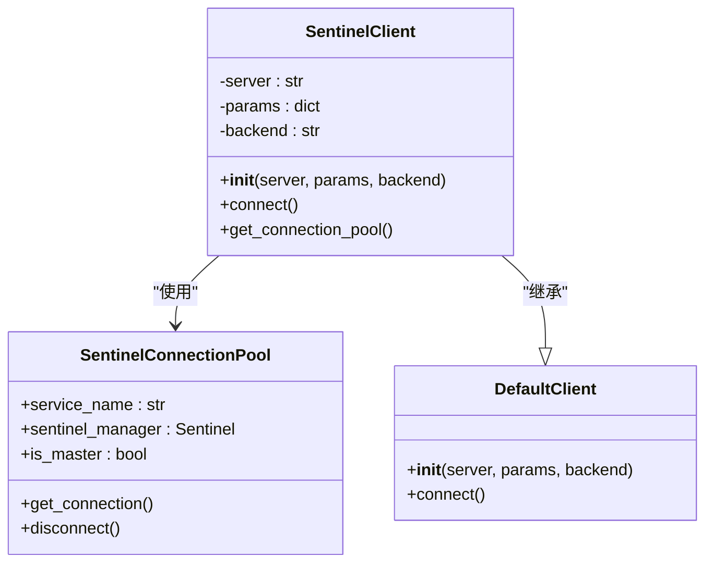
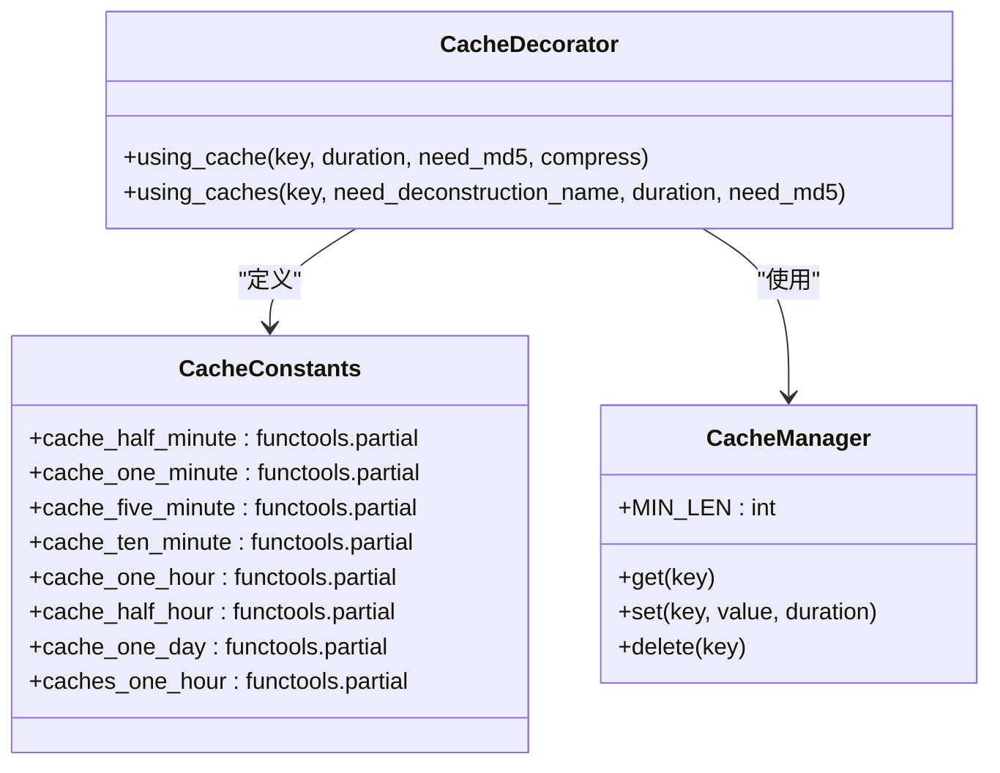
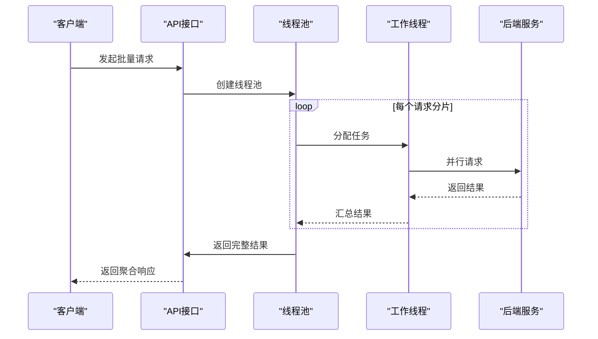
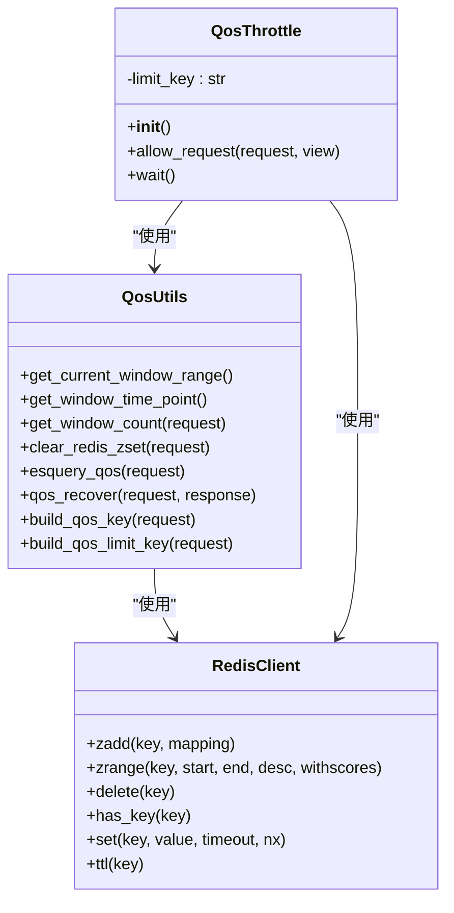
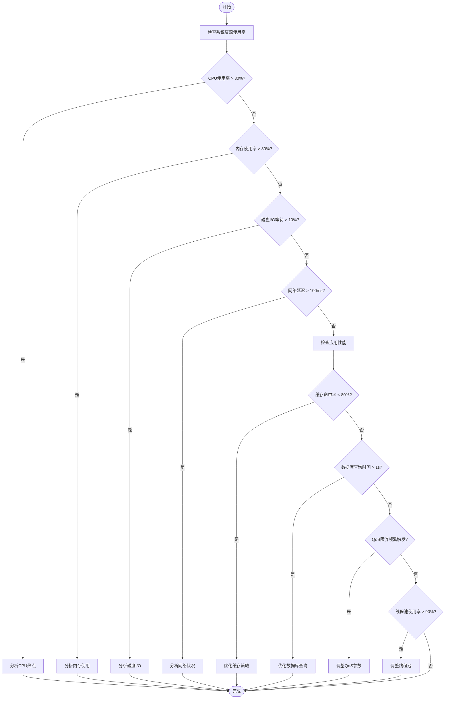

# 性能优化与高级配置

<cite>
**本文档引用的文件**  
- [unify_query.py](file://bklog/apps/api/modules/unify_query.py)
- [transfer.py](file://bklog/apps/api/modules/transfer.py)
- [qos.py](file://bklog/apps/log_esquery/qos.py)
- [cache.py](file://bklog/apps/utils/cache.py)
- [sentinel.py](file://bklog/apps/utils/sentinel.py)
- [async_export_handlers.py](file://bklog/apps/log_unifyquery/handler/async_export_handlers.py)
- [base.py](file://bklog/apps/api/base.py)
</cite>

## 目录
1. [引言](#引言)
2. [连接池管理机制](#连接池管理机制)
3. [查询缓存策略](#查询缓存策略)
4. [请求批处理机制](#请求批处理机制)
5. [QoS服务质量控制](#qos服务质量控制)
6. [性能监控与调优建议](#性能监控与调优建议)
7. [高并发场景配置指南](#高并发场景配置指南)
8. [瓶颈分析方法](#瓶颈分析方法)
9. [结论](#结论)

## 引言

本文档深入探讨了蓝鲸监控平台中实现的性能优化机制，重点分析了`unify_query.py`和`transfer.py`中实现的连接池管理、查询缓存策略和请求批处理技术。同时，详细解释了`qos.py`中定义的查询质量服务控制如何与统一查询集成，包括超时控制、速率限制和资源隔离策略。文档还提供了性能监控指标和调优建议，针对高并发场景给出了配置参数调整指南和瓶颈分析方法。

## 连接池管理机制

系统通过Redis Sentinel实现了高可用的连接池管理机制，确保在分布式环境下数据库连接的稳定性和性能。

**图示来源**  
- [sentinel.py](file://bklog/apps/utils/sentinel.py#L59-L106)

**连接池配置特点：**
- 支持主从分离配置，通过`is_master`参数区分主节点和从节点连接
- 使用Sentinel实现自动故障转移和高可用性
- 支持通过URL参数动态配置连接池属性
- 提供了完整的连接池生命周期管理

**Section sources**
- [sentinel.py](file://bklog/apps/utils/sentinel.py#L59-L106)

## 查询缓存策略

系统实现了多层次的查询缓存策略，通过装饰器模式简化缓存的使用，提高查询性能。

**图示来源**  
- [cache.py](file://bklog/apps/utils/cache.py#L36-L147)

**缓存策略实现细节：**
- 提供了`using_cache`和`using_caches`两个装饰器，分别用于单个和批量缓存操作
- 支持多种缓存时长的预定义常量，如5分钟、1小时等
- 支持MD5哈希处理缓存键，避免特殊字符问题
- 支持数据压缩，对于大于15字节的数据自动进行zlib压缩
- 提供了详细的日志记录，便于监控缓存命中情况

**Section sources**
- [cache.py](file://bklog/apps/utils/cache.py#L36-L147)

## 请求批处理机制

系统通过线程池和异步处理机制实现了高效的请求批处理，显著提升了大规模数据查询的性能。

**图示来源**  
- [base.py](file://bklog/apps/api/base.py#L632-L672)
- [async_export_handlers.py](file://bklog/apps/log_unifyquery/handler/async_export_handlers.py#L272-L290)

**批处理机制特点：**
- 使用`ThreadPool`实现并发请求处理
- 支持自定义分片大小，通过`BULK_REQUEST_LIMIT`配置
- 采用`apply_async`非阻塞方式提交任务
- 支持结果聚合和异常处理
- 在异步导出场景中使用`ThreadPoolExecutor`进行数据保留期查询

**Section sources**
- [base.py](file://bklog/apps/api/base.py#L632-L672)
- [async_export_handlers.py](file://bklog/apps/log_unifyquery/handler/async_export_handlers.py#L272-L290)

## QoS服务质量控制

系统通过Redis实现了完善的QoS（服务质量）控制机制，确保在高负载情况下系统的稳定性和公平性。

**图示来源**  
- [qos.py](file://bklog/apps/log_esquery/qos.py#L39-L145)

**QoS控制机制：**
- 基于Redis的ZSET实现请求计数和时间窗口管理
- 支持按应用代码、索引集ID等维度进行限流
- 使用滑动时间窗口算法进行速率控制
- 当请求超过限制时，设置禁止标记并返回等待时间
- 提供了`qos_recover`机制，在成功响应后清理计数

**配置参数：**
- `BKLOG_QOS_USE`: 是否启用QoS控制
- `BKLOG_QOS_LIMIT_APP`: 受限流控制的应用列表
- `BKLOG_QOS_LIMIT_WINDOW`: 限流时间窗口（分钟）
- `BKLOG_QOS_LIMIT`: 时间窗口内最大请求数
- `BKLOG_QOS_LIMIT_TIME`: 超出限制后的禁止时间（分钟）

**Section sources**
- [qos.py](file://bklog/apps/log_esquery/qos.py#L39-L145)

## 性能监控与调优建议

系统提供了全面的性能监控指标和调优建议，帮助运维人员优化系统性能。

### 性能监控指标

| 指标类别 | 具体指标 | 监控方法 | 告警阈值 |
|---------|---------|---------|---------|
| 缓存性能 | 缓存命中率 | Redis `INFO`命令 | < 80% |
|         | 缓存使用率 | Redis `INFO`命令 | > 80% |
|         | 缓存驱逐次数 | Redis `INFO`命令 | 持续增长 |
| 系统性能 | QPS | API请求日志统计 | 根据业务需求 |
|         | 平均响应时间 | API请求日志统计 | > 1秒 |
|         | 错误率 | API请求日志统计 | > 1% |
| 资源使用 | CPU使用率 | 系统监控 | > 80% |
|         | 内存使用率 | 系统监控 | > 80% |
|         | 线程池使用率 | 线程池监控 | > 90% |

### 调优建议

1. **缓存优化**
   - 根据业务特点调整缓存时长
   - 对于热点数据，适当增加缓存时间
   - 定期清理过期缓存，避免内存浪费

2. **连接池优化**
   - 根据并发量调整连接池大小
   - 监控连接池使用率，避免连接耗尽
   - 合理设置连接超时时间

3. **批处理优化**
   - 根据系统负载调整`BULK_REQUEST_LIMIT`
   - 监控线程池使用情况，避免线程耗尽
   - 对于大数据量查询，考虑分页处理

4. **QoS优化**
   - 根据业务重要性调整不同应用的限流策略
   - 定期评估限流参数的合理性
   - 监控被限流的请求，分析是否需要调整策略

**Section sources**
- [qos.py](file://bklog/apps/log_esquery/qos.py#L34-L145)
- [cache.py](file://bklog/apps/utils/cache.py#L36-L147)
- [base.py](file://bklog/apps/api/base.py#L632-L672)

## 高并发场景配置指南

针对高并发场景，系统提供了多种配置参数调整指南，以确保系统稳定运行。

### 关键配置参数

| 参数名称 | 默认值 | 说明 | 高并发建议值 |
|---------|-------|------|-------------|
| BULK_REQUEST_LIMIT | 500 | 批量请求分片大小 | 200-300 |
| BKLOG_QOS_LIMIT_WINDOW | 5 | 限流时间窗口（分钟） | 1-3 |
| BKLOG_QOS_LIMIT | 3 | 时间窗口内最大请求数 | 5-10 |
| BKLOG_QOS_LIMIT_TIME | 5 | 超出限制后的禁止时间（分钟） | 1-3 |
| USE_REDIS | on | 是否使用Redis | on |
| REDIS_MODE | sentinel | Redis模式 | sentinel |

### 配置调整策略

1. **渐进式调整**
   - 从小幅度调整开始，观察系统反应
   - 每次调整后至少观察24小时
   - 记录每次调整的效果

2. **监控驱动**
   - 基于监控数据进行调整
   - 关注关键性能指标的变化
   - 避免过度优化导致其他问题

3. **业务优先级**
   - 根据业务重要性分配资源
   - 保障核心业务的性能
   - 对非核心业务适当限制

**Section sources**
- [default.py](file://bklog/config/default.py#L436-L1203)

## 瓶颈分析方法

系统提供了多种瓶颈分析方法，帮助快速定位性能问题。

### 瓶颈分析流程

**图示来源**  
- [qos.py](file://bklog/apps/log_esquery/qos.py#L34-L145)
- [cache.py](file://bklog/apps/utils/cache.py#L36-L147)
- [base.py](file://bklog/apps/api/base.py#L632-L672)

### 分析工具

1. **系统监控工具**
   - 使用`top`、`htop`查看CPU和内存使用
   - 使用`iostat`查看磁盘I/O
   - 使用`netstat`查看网络状况

2. **应用监控工具**
   - 查看API请求日志，分析响应时间和错误率
   - 监控Redis性能指标
   - 分析线程池使用情况

3. **性能分析工具**
   - 使用Python的`cProfile`进行性能分析
   - 使用`py-spy`进行实时性能分析
   - 使用`flamegraph`生成火焰图

**Section sources**
- [qos.py](file://bklog/apps/log_esquery/qos.py#L34-L145)
- [cache.py](file://bklog/apps/utils/cache.py#L36-L147)
- [base.py](file://bklog/apps/api/base.py#L632-L672)

## 结论

本文档详细介绍了蓝鲸监控平台的性能优化与高级配置机制。通过连接池管理、查询缓存策略、请求批处理和QoS服务质量控制等技术，系统实现了高性能和高可用性。在高并发场景下，通过合理的配置参数调整和瓶颈分析方法，可以确保系统的稳定运行。建议运维人员根据实际业务需求，结合监控数据，持续优化系统性能。